# 立方体贴图Cubemap

> 注：在本节当中，我们会讲解Cubemap的烘焙原理，以及Cubemap如何在场景中作为Skybox天空盒渲染出来，但暂时不去扩展Skybox对光照系统的影响，更详细的知识会在后面的PBR以及IBL的部分进行详细介绍。

​	在做渲染的时候，立方体贴图Cubemap可以大幅度改善渲染的效果。以下我们先来看一个Cubemap使用后的效果图：

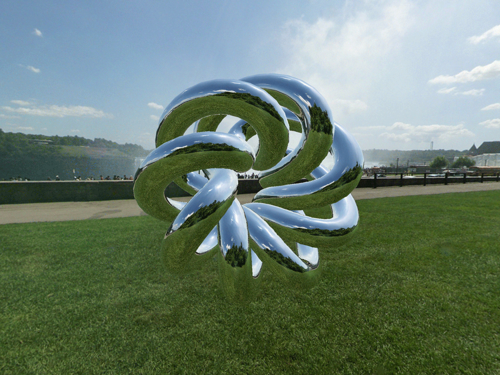

​									图片来源：https://metalbyexample.com/reflection-and-refraction/

​	读者可能会好奇，上述渲染结果中的背景是如何”产生“的，以及我们要怎么做渲染呢？这就是本节要介绍的内容。


# 一、什么是Cubemap&Cubemap的制作

​	如果读者上网搜索Cubemap关键词，搜出来的Cubemap往往都如下图：

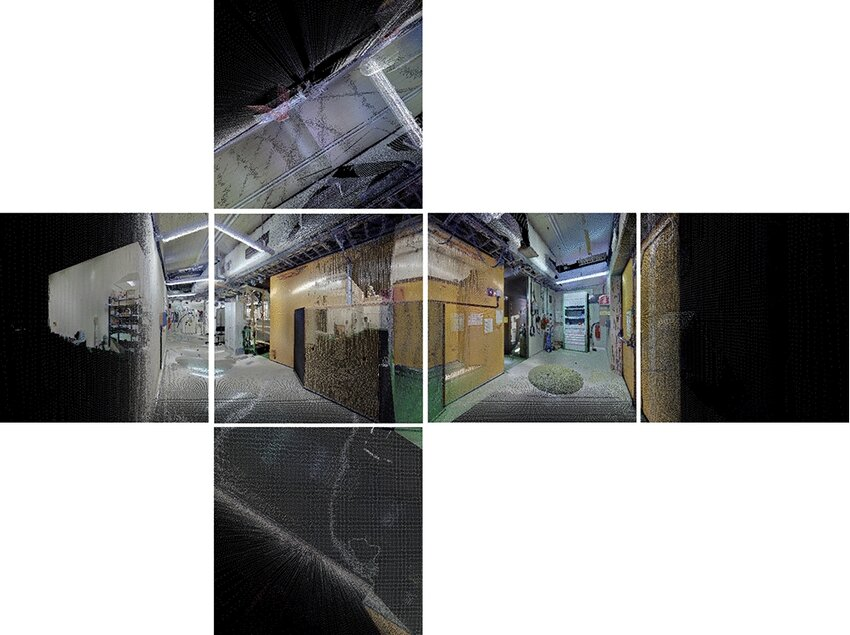

​	Cubemap，顾名思义，中文名叫立方体贴图，由六个面的2D贴图组合而成，在渲染的时候常会用作天空盒来使用（skybox，可以理解为作为渲染的背景板）。它由六个正方形的纹理组成，分别代表一个立方体的六个面（上、下、前、后、左、右），这样在渲染的时候就可以捕捉到从一个特定点周围360度的环境信息。在制作Cubemap的时候，环境会被投影到立方体的各个侧面上，并存储为六个方形纹理，或者展开成单个纹理的六个区域（上图就是六个方形纹理）。

> 直观理解，好像就是我站在场景的中央，往上下左右前后看去，并拍了六张照，得到了一组Cubemap。

​	在制作的时候，立方体贴图是通过首先从一个视点渲染场景六次来生成的，每个视图由一个表示每个立方体面的90度视锥体定义。读者可能会疑惑，**如果我不做立方体的渲染，而是环绕场景360度，把每个角度的渲染结果记录下来，形成一张球面图，是不是效果更好呢？**事实上，早期人们确实是这样做的，以下是一个球面映射图（Spherical Map）：

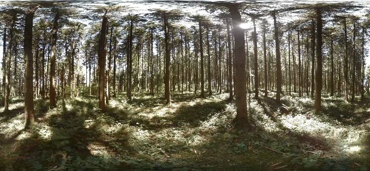


​	可以看到，上面的贴图也能够记录周围环境的信息，但观察上图最上面的部分，会发现有一些失真的现象，特别是在球体的极点附近。这种失真可能会影响到反射和环境映射的质量。另外，Spherical Map 还有一些其他的缺点，比如高度依赖观察场景的视点。随着视点的变化，球面映射可能无法提供一致或准确的结果，导致视觉伪影；现在也有很多其他类型的用于制作Skybox的贴图，比如HDR贴图，使用等距柱状投影图(Equirectangular Map) 等。但Cubemap是一种非常经典地用于做Skybox地方式，因此我们接下来会重点介绍Cubemap的原理，并将其引入到我们的渲染器当中。

​	

# 二、Cubemap的渲染&采样

​	在之前的纹理章节，我们使用UV坐标对一张纹理进行采样。对于采样Cubemap而言，采样的纹理坐标不再是UV坐标，而是一个三维的向量。从下图来看更容易理解：

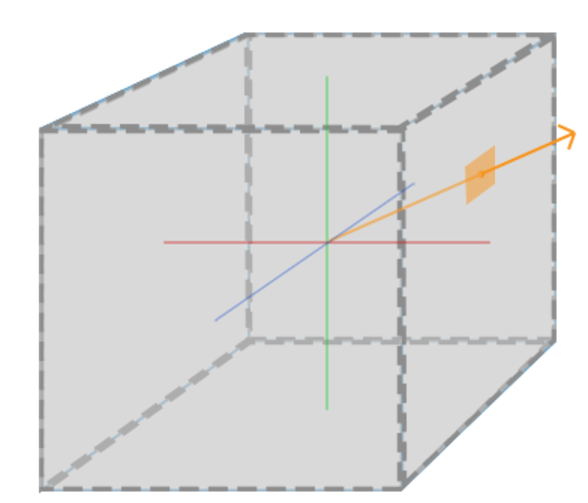

​	如上图，黄色的向量指的是采样向量，而上面Cubemap的六张图就会被”贴“在立方体的六个面上，依据采样向量的方向采样到对应面的对应像素点，作为着色的参考依据。比如说在做镜面反射的时候，就可以依据视角方向$\vec{v}$经过表面法线方向$\vec{n}$反射出去的反射方向$\vec{r}$，计算打到天空盒上的采样点，将采样结果作为着色结果，以实现镜面反射的效果。于是就诞生了两个问题：

- （1）Cubemap由六个子面构成，那么对应面是指哪个面呢？每个子面应该被贴到立方体的前后左右上下中的哪个面？
- （2）具体的采样算法是什么样的？

​	解决了上面两个问题，我们就可以使用Cubemap进行渲染了。实际上渲染一个Cubemap就是将一个贴着对应贴图的立方体渲染到场景当中，但这里的渲染是有一些trick在的，见后文。


## 1.Cubemap的渲染

​	我们先解决第一个问题，将Cubemap显示在场景当中，但先不对其进行采样。解决这个问题的核心在于要知道每个面会被贴在哪里。例如OpenGL会对此进行约定，如下图：


​	上图还是比较清晰的，top就是上面，left就是左面，依次类推。读者可以想象一下上述的Cubemap被”折成“一个立方体的过程，容易发现它是基于左手系的（top对应Y轴正方向，right对应X轴正方向，而front则对应Z轴正方向，指向的是前面，也就是屏幕里面，这一点不要理解错误）。再比如Unity，它是基于左手系的。上图的left，right，bottom，top，front，back为了方便理解，很多渲染器/引擎也会将其命名为-X，+X，-Y，+Y，+Z和-Z（基于左手系）。Cubemap也可以使用右手系。在以下的理论部分中，我们使用左手系进行讲解。而渲染器的实现也是基于左手系。

​	可以在网上找到一些免费的Cubemap资源，比如下图就是本节教程中要使用的cubemap（在对应的github当中有提供）：

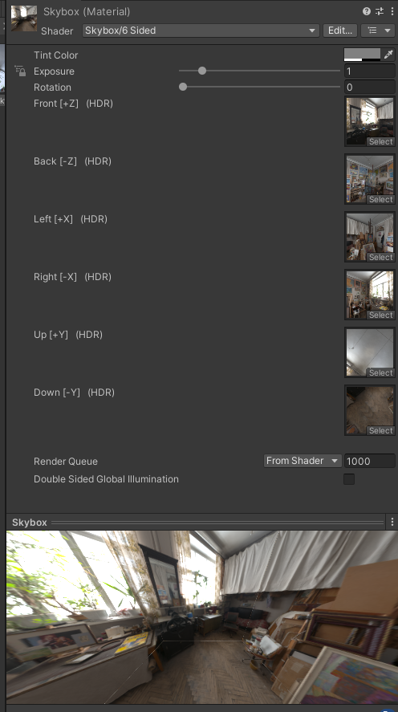

​	上图可以看到在正常的工作流当中，我们需要提供Cubemap的六个面的对应子图。类似HDR这种参数暂时不需要关心，后面的教程中会进行介绍。下图就是六个Cubemap的面在渲染时的效果：

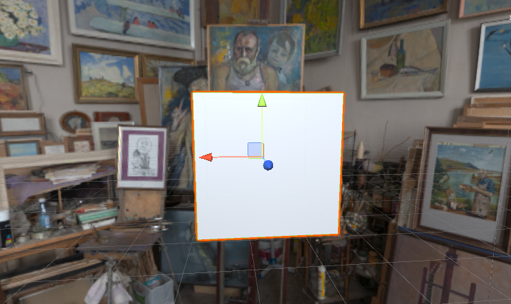

​	在本节完成之后，我们也可以将天空盒显示在场景当中。接下来具体介绍。

### （1）Cubemap HDR格式读取

​	在本节教程当中，我们使用的贴图格式为hdr格式，例如下图：

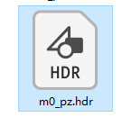

​	这里的m0_pz表示不模糊的原始Cubemap版本，pz则是positive Z的意思，也就是对应cubemap的前面。关于hdr格式的图像读取可以参考维基百科上的说明：https://en.wikipedia.org/wiki/Radiance_(software)，这里涉及到HDR和LDR的概念，在本节中先不进行介绍。

​	这部分的其他参考链接：https://learnopengl-cn.github.io/05%20Advanced%20Lighting/02%20Gamma%20Correction/。以及这篇：https://blog.csdn.net/qjh5606/article/details/89790713。关于HDR图像的介绍可以看这篇：https://zh.wikipedia.org/zh-cn/%E9%AB%98%E5%8A%A8%E6%80%81%E8%8C%83%E5%9B%B4%E6%88%90%E5%83%8F，我们也会在后续教程中单独开设一节对色彩空间进行介绍。

> 读取完之后的六张纹理会保存颜色到六个Texture的buffer当中，这六个Texture又共同组成了一个Cubemap。而Cubemap就是我们接下来要使用的。如果读者对于这部分的hdr图像读取很感兴趣可以查看Github中的仓库源码，但不关心的话完全不影响接下来的学习。


### （2）Cubemap的绘制时机

​	在前面的章节中，我们有介绍渲染顺序应当是先渲染不透明物体（从近到远渲染），然后渲染透明物体（由远到近渲染）。现在我们为渲染器引入了天空盒，就需要讨论一下天空盒的渲染时机问题了。分别讨论以下的几种情况：

- （a）先渲染天空盒，然后不透明，接着半透明：这种次序是没有问题的，因为天空盒作为”背景“，先渲染到”最后“看起来很符合常理。不过这样做**不够高效**，如果我们先渲染天空盒，我们就会对屏幕上的每一个像素运行一遍对应的片元着色器，这样如果最后天空盒只有一小部分可见，就会比较亏；
- （b）**先渲染不透明物体，然后天空盒，接着半透明**：此时当渲染天空盒的时候，不透明物体已经都渲染完成了，并且将深度写入到了深度缓冲区当中。这样如果天空盒的渲染无法通过深度测试，并且由于渲染器开启了Early-Z，就可以不用走片元着色器的逻辑，降低运算量。**这种做法比较可取，但涉及到一个问题：天空盒只是一个立方体（大小比如1x1x1），深度值如何设置呢？**这就是巧妙之处了，**我们需要欺骗深度缓冲，让它认为天空盒有着最大的深度值1.0**，只要它前面有一个物体，深度测试就会失败。
- （c）在不透明物体和半透明物体之后渲染天空盒。这种次序并不可取，因为没办法做半透明的混合。直接pass。

在排除了上述的（c）方法后，（a）和（b）其实都是可行的。为了降低运算量，渲染器中采取（b）方法进行运算。接下来就是顶点着色器和片元着色器的设置了。


### （3）Cubemap——顶点着色器

​	在渲染管线的章节，我们重点介绍了在管线中的顶点着色器和片元着色器。渲染Cubemap的重点就在于这两个着色器，以及渲染的时机。首先，我们先来看顶点着色器。直观理解，其实我们就是把Cubemap的六个面，也就是六张Texture渲染到立方体的六个面上，并让立方体作为”背景“呈现。

​	我们先来看一下在渲染之前，更新Cubemap相关数据的逻辑：

```c++
static void update_skybox_model(std::shared_ptr<Model> model, Camera* perframe)
{
    mat4_t view_matrix = camera_get_view_matrix(*perframe);
    mat4_t proj_matrix = camera_get_proj_matrix(*perframe);
    uniforms_skybox* uniforms = (uniforms_skybox*)model->program->shader_uniforms_;

    //移除掉skybox的位移
    view_matrix.m[0][3] = 0;
    view_matrix.m[1][3] = 0;
    view_matrix.m[2][3] = 0;

    uniforms->vp_matrix = mat4_mul_mat4(proj_matrix, view_matrix);
}
```

​	可以看到在做skybox更新的时候，有一个细节是将渲染时所需的view矩阵的平移项置为0，直观理解就好像在渲染天空盒的时候，默认我们的相机位于场景的**正中心**。读者可以回忆一下自己见过的使用天空盒的场景，约定俗成都是模拟相机在中心的效果，上述就是一个trick的方法。接下来我们介绍在顶点着色器中如何做trick，使得立方体可以作为背景呈现。

​	在之前空间变换的相关章节中，我们有介绍**透视除法**是在顶点着色器运行之后执行的。而在透视除法之后的z值将会用在后面的深度缓冲当中。这个Z的范围是[0，1]，并且是非线性深度（因为做了透视除法，此时近处是0，远处是1）。在前面有说过，渲染Cubemap作为skybox其实就是把对应的立方体渲染到屏幕上，那么实际上，在顶点着色器中**如果我们强制让要绘制的立方体做透视除法前的Z值与W值相等，那么透视除法之后的非线性深度值就是1**，此时在深度测试中就可以作为”最后面“的物体。因此，顶点着色器这样写：

```c++
vec4_t skybox_vertex_shader(void* attribs_, void* varyings_, void* uniforms_)
{
    auto* attribs = static_cast<attribs_skybox*>(attribs_);
    auto* varyings = static_cast<varyings_skybox*>(varyings_);
    auto* uniforms = static_cast<uniforms_skybox*>(uniforms_);
    vec4_t local_pos = vec4_from_vec3(attribs->position, 1);
    vec4_t clip_pos = mat4_mul_vec4(uniforms->vp_matrix, local_pos);  //转到裁剪空间
    clip_pos.z = clip_pos.w * (1 - EPSILON); //稍微有个小的bias，防止精度误差
    varyings->direction = attribs->position;
    return clip_pos;
}
```

​	这里还有两个注意的点：

- （1）顶点着色器传给片元着色器的结构体中的direction值就是传入顶点着色器的position值。这里我们在渲染器中渲染的Cube（作为Skybox）的顶点坐标范围是[-0.5，0.5]，这一点需要注意，在片元着色器采样的时候会用到这个配置。
- （2）这个作为天空盒的立方体需要使用双面渲染，也就是不剔除背面。

我们让片元着色器只输出蓝色，结果如下：

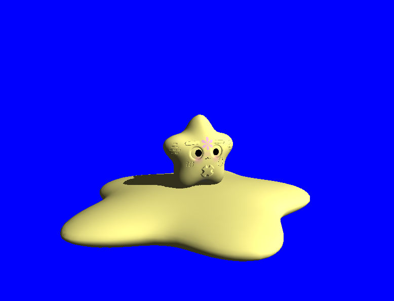

旋转一下相机，发现天空盒始终以正确的方式进行渲染（虽然现在还是纯色），说明我们的顶点着色器应该是正确的！

​	

### （4）Cubemap——片元着色器

回顾一下Cubemap采样的图：


怎么确定黄色的向量与整个Cube的交点是什么呢？我们假设将一个**长宽都为2**的正方体放在坐标原点，将一张Cubemap贴上去，那么各点的坐标将如下图所示（注意，这个坐标系是左手坐标系，+Z指的是forward，前面，也就是屏幕向里的里面）：

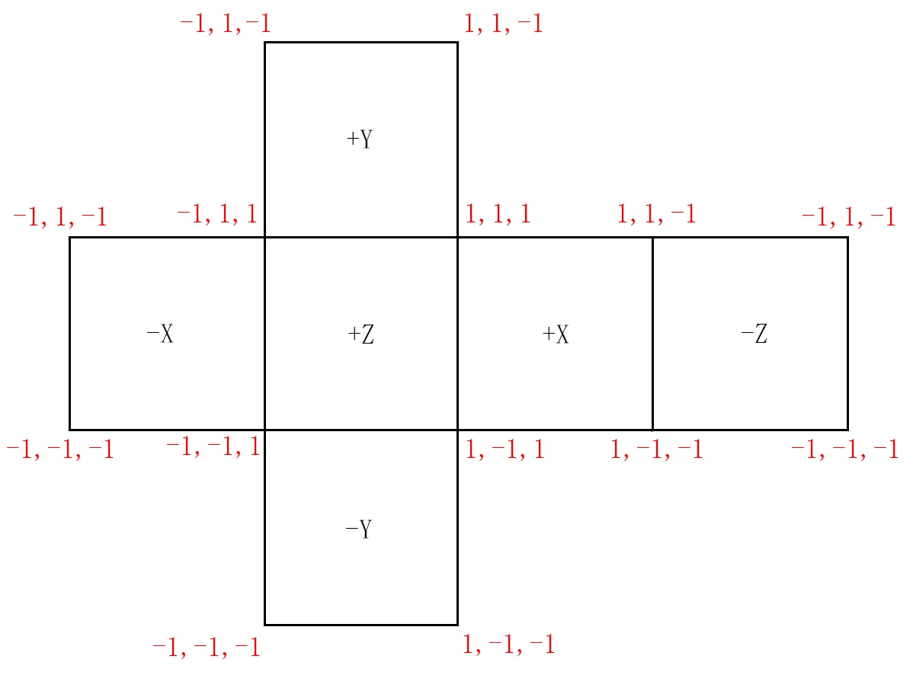

假设我们现在正在+Z表面上移动，那么对应Z的坐标是不变的，只有X轴坐标和Y轴坐标会发生变化。从上图可以看出整个cube的上下左右前后的面之间的交点的坐标。举个例子，+X，+Y，+Z面的共同交点坐标是（1，1，1），而+X，-Y，-Z面的共同交点则是（1，-1，-1）。如果我们对每个面都以左下角为uv原点，右上角为uv (1,1)，可用三维的坐标换算得到UV坐标。此时如下图：

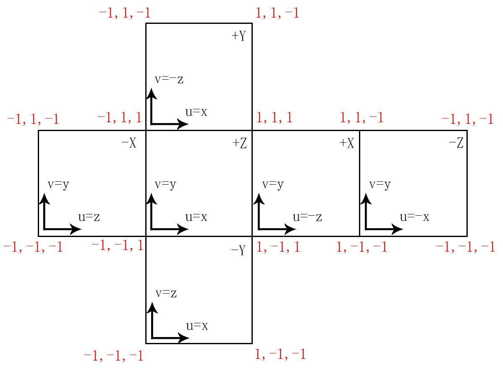

在每个面上，都有标注对应的纹理坐标系的U方向和V方向正方向（如果读者被绕蒙了的话，可以把上面一张图打印下来，折成一个立方体，比对着看一下）。此时用三维向量对Cubemap采样的实际步骤如下：

- （1）取x，y，z坐标中绝对值最大的为主轴，再用正负号判定正负轴。例如(-0.8, 0.5, 0.4)，对应-X轴；
- （2）坐标除以主轴的绝对值，换算到立方体上。举个例子，(-0.8, 0.5, 0.4)对应在-X轴上 ->对应在立方体上的值为 (-1, 0.625, 0.5)，这里就是一个简单的向量缩放，可以把采样点定位到-X面上。
- （3）根据对应轴的UV坐标换算关系，求得UV，还是以上述为例， (-1, 0.625, 0.5)对应在-X面上，此时看上图，采样的u方向是z方向，v方向是y方向，所以有(-1, 0.625, 0.5) -> u = z = 0.5, v = y = 0.625；
- （4）求得UV坐标为（0.5，0.625）。但注意，我们在采样的时候每个面的范围是[-1，1]，但是UV坐标应该是[0，1]，所以要做一步$y=0.5x+0.5$的操作，$x$是刚才求出的UV值，而$y$则是真正要采样的UV坐标，对应本例应该是（0.5，0.625）->（0.75，0.8125）
- （5）从-X面的贴图上依据上述的UV坐标进行采样。

实际上，在渲染天空盒的时候也是这样做的，每个片元都对应一个插值之后的向量方向，然后依据上述算法采样提前保存的每个面的纹理的对应的坐标。代码如下：

```c++
vec4_t cubemap_sample(std::shared_ptr<CubeMap> cubemap, vec3_t direction) 
{
	return cubemap_repeat_sample(cubemap, direction);
}
vec4_t cubemap_repeat_sample(std::shared_ptr<CubeMap> cubemap, vec3_t direction)
{
	vec2_t texcoord;
	int face_index = select_cubemap_face(direction, &texcoord);
	//texcoord.y = 1 - texcoord.y;
	return texture_repeat_sample(cubemap->faces[face_index], texcoord);
}
```

我们先来看`select_cubemap_face`这个函数，用于确定要采样的面是哪个面，以及采样的UV坐标是什么，对应上述算法的（1）（2）（3）（4）步骤。在渲染器的实现中，我们也是按照上面的情况来做的，这个函数如下：

```c++
/*
 * for cubemap sampling, see subsection 3.7.5 of
 * https://www.khronos.org/registry/OpenGL/specs/es/2.0/es_full_spec_2.0.pdf
 */
static int select_cubemap_face(vec3_t direction, vec2_t* texcoord) {
	float abs_x = (float)fabs(direction.x);
	float abs_y = (float)fabs(direction.y);
	float abs_z = (float)fabs(direction.z);
	float ma, sc, tc;
	int face_index;

	if (abs_x > abs_y && abs_x > abs_z) {   /* major axis -> x */
		ma = abs_x;
		if (direction.x > 0) {                  /* positive x */
			face_index = 0;
			sc = -direction.z;
			tc = direction.y;
		}
		else {                                /* negative x */
			face_index = 1;
			sc = +direction.z;
			tc = direction.y;
		}
	}
	else if (abs_y > abs_z) {             /* major axis -> y */
		ma = abs_y;
		if (direction.y > 0) {                  /* positive y */
			face_index = 2;
			sc = +direction.x;
			tc = -direction.z;
		}
		else {                                /* negative y */
			face_index = 3;
			sc = +direction.x;
			tc = +direction.z;
		}
	}
	else {                                /* major axis -> z */
		ma = abs_z;
		if (direction.z > 0) {                  /* positive z */
			face_index = 4;
			sc = +direction.x;
			tc = +direction.y;
		}
		else {                                /* negative z */
			face_index = 5;
			sc = -direction.x;
			tc = direction.y;
		}
	}

	texcoord->x = (sc / ma + 1) / 2;
	texcoord->y = (tc / ma + 1) / 2;
	return face_index;
}
```

这样做的话最终结果就会是正确的，最终实现的效果如下图：

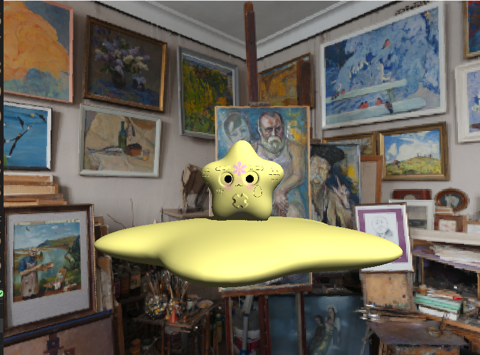

注意：

- （1）目前在渲染器中，我们读取完hdr的图片之后，Cubemap采用左手系的方式进行摆放，可以看一下按照左手系摆完之后的结果：

  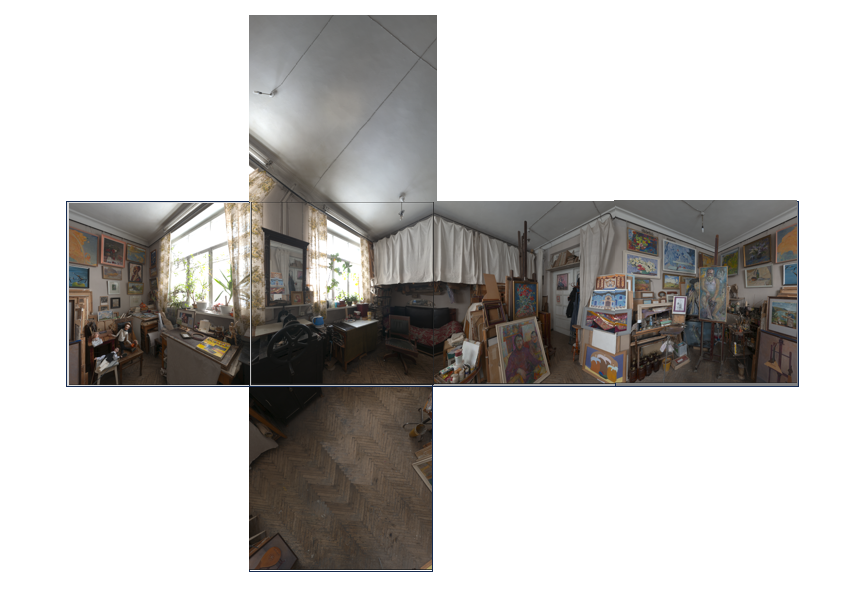

  而在渲染当中，我们也按照上面的算法来进行采样，这样得到的UV坐标就是正确的。这里面我们是手动推导了一遍Cubemap的映射关系，公式可能与OpenGL的不同，但其实都是正确的，原因是一些与纹理翻转有关的问题，更多可以看一下这篇：https://blog.csdn.net/qjh5606/article/details/89847297。**需要说明的是，我们目前的渲染器按照正确的推导方式推导出了左手系下的Cubemap的映射公式，重要的是读者需要理解其中的思路和思想。**

> 这一部分也可以参考OpenGL的白皮书：https://registry.khronos.org/OpenGL/specs/es/2.0/es_full_spec_2.0.pdf的第3.7.5小节。以及可以参考这一篇：https://www.khronos.org/opengl/wiki/Cubemap_Texture。如果要按照OpenGL那套左手系的流程来做Cubemap的话，采样公式在上述链接的3.7.5小节可以看到，同时对采样结果的y要做一个翻转，如下：
> ```c++
> vec4_t cubemap_repeat_sample(std::shared_ptr<CubeMap> cubemap, vec3_t direction)
> {
> 	vec2_t texcoord;
> 	int face_index = select_cubemap_face(direction, &texcoord);
> 	texcoord.y = 1 - texcoord.y;
> 	return texture_repeat_sample(cubemap->faces[face_index], texcoord);
> }
> ```
>
> 但这里不用细究了，按照渲染器的教程来进行学习即可理解Cubemap的概念和采样过程（渲染器也是左手坐标系）。

