# lesson10 阴影

## 10.1 引入

如下图，日常中，光打在人身上，在地上会留下影子，阴影的出现是因为人挡住了照向地面的光线。

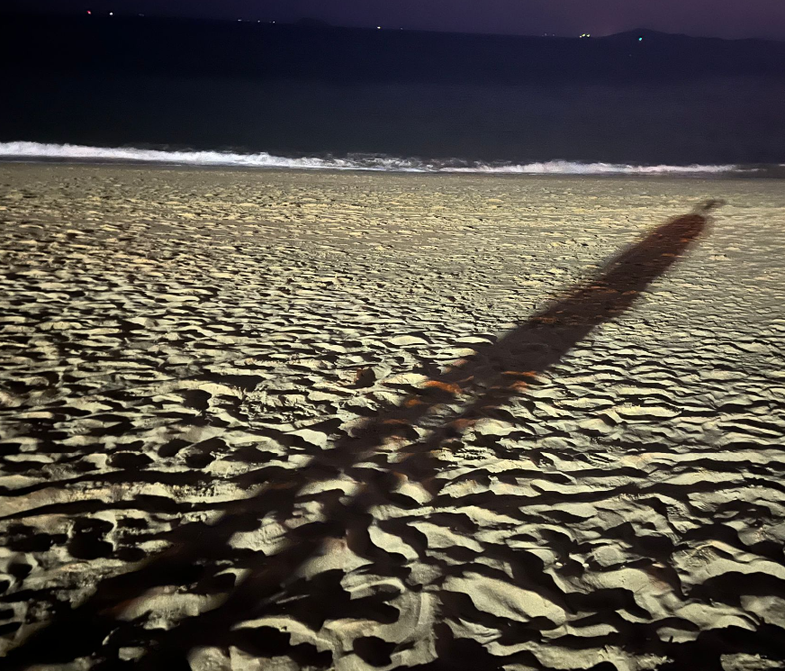

如下图，对应上图中灯就是光源，人就是遮挡物，影子就是阴影，地面沙滩就是接收物（会接收阴影）。

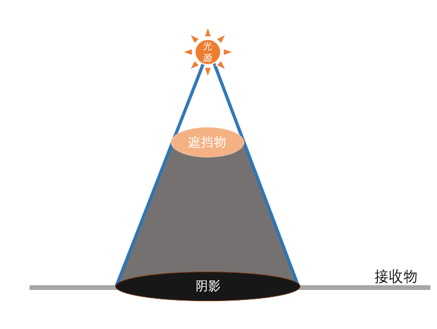

上图中的光源是点光源，这样在接收物上投射出来的阴影就的边界很明确，不会出现“虚化”的效果。这样的阴影被称为硬阴影（hard shadow）。

而如果这个光源是有面积的，如下图，就会在接收物上投射出不全是阴影的”虚化“的阴影效果。如下图，接收物上，完全被遮挡物挡住的没有光线能到达的地方会形成本影（umbra）。有部分光线能到达，部分光线无法到达的地方会形成模糊的阴影，我们成为半影（penumbra）。这样的阴影被称为软阴影（soft shadow）。

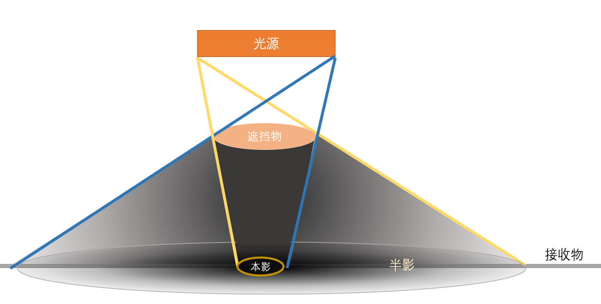

这节课我们着重讨论硬阴影的实现，下节课我们会进一步讨论软阴影的实现。


## 10.2 shadow map 实现硬阴影
### 10.2.1 基础原理


假设一个场景中，只有一个点光源，若干个遮挡物和接受物，那么什么地方会产生阴影呢？假设我们此时站在光源的位置往场景中各个地方看，看不见的地方也就是光线照不到的地方，那就会产生阴影。

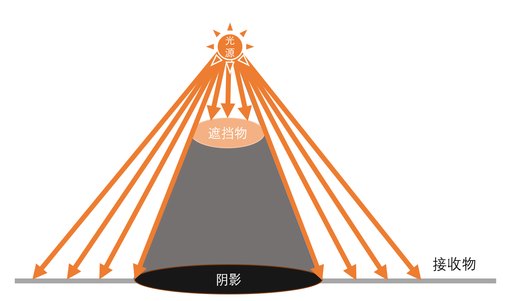


从这个思想出发，我们将光源视作相机，渲染一张类似相机的深度贴图（z-buffer）的，光源的深度贴图，我们称为**阴影贴图（shadow map）**，shadow map上的每个像素点都记录了最靠近光源的物体的深度值。

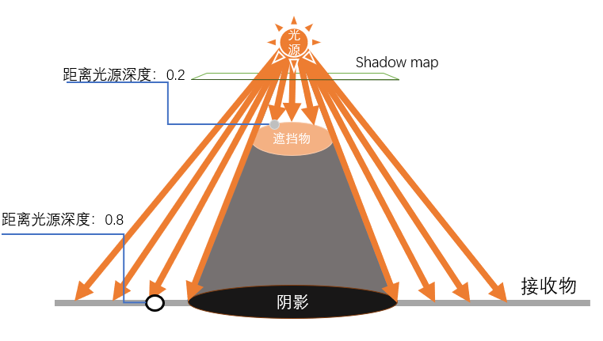

如下图所示，shadow map只需要存储深度即可，可视化如下。

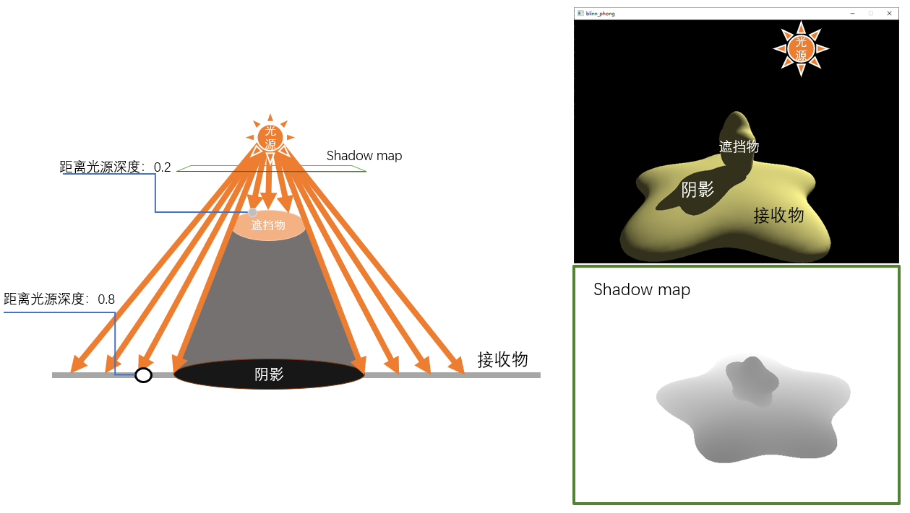


接下来，我们的相机看向场景，下图中，假设相机能够看到点a和b，我们要如何知道这两个点是不是阴影呢？

我们将a和b转到光源的”相机空间“（将光源作为相机），进一步转到光源的”屏幕空间“（shadow map），也就是找到a和b对应到光源的shadow map上显示的点A和B。

我们发现，shadow map上A的深度与a一致，因此a不在阴影中，被照亮。

shadow map上B的深度小于b的深度，即可能有东西距离光源比b点距离光源更近，因此b被遮挡，在阴影中。

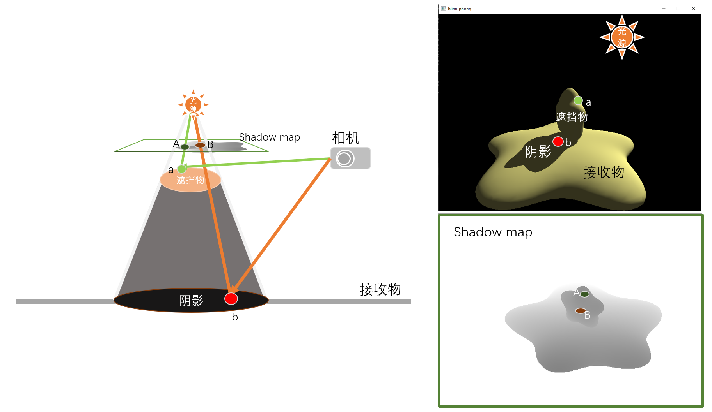


### 10.2.2 shadow caster（能够投射阴影的遮挡物）

这时候有的读者可能会有疑惑，假设此时是一个点光源，那么光源会向着四面八方各个方向投射光线，那么我们的shadow map应当是它看向哪个方向的时候渲染出来的呢。确实如此，单个shadow map，即是光源单个方向的z-buffer，必须指定一个特定方向，即只有场景中的一部分会被渲染到shadow map上。

如果有一些物体根本不会遮挡住光线，也就是说光线可以穿过它而不是在它背后留下阴影的话，这种物体并不需要被渲染到shaow map上（比如有的项目中会简化的认为玻璃等透明物体并不会遮挡住光线，投射下阴影）。shadow map只需要渲染能够遮挡住光线投射阴影的物体，我们称这种物体为**shadow caster（能够投射阴影的遮挡物）**。

 再者，假设此时场景中有众多shadow caster，但是相机只能够看到其中的一部分，那么其他的shadow caster是没有必要渲染在shadow map上的，将他们剔除可以节省性能，也可以提升阴影贴图的质量，提高z-buffer的有效精度。（前面的深度章节有提及类似的z-buffer的有效精度的说法，读者这里不理解的话可以复习一下）。


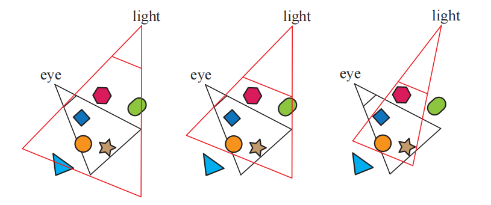

（上图来自Real-Time Rendering, Fourth Edition）

如上图所示：

左图中：光源的视野范围中包含了相机的观察体。可以看到，红色，绿色和浅蓝色的三个shadow caster是在相机观察体之外，不会被相机看到的。

中间的图中：

将光源的远裁剪面推向靠近近裁剪面的方向，将相机不可见的浅蓝色shadow caster排除在外；

将光源的近裁剪面推向靠近远裁剪面的方向，提升z-buffer的有效精度从而提升阴影贴图的质量。

右图中：将相机观察体的侧面进行收缩，将相机不可见的绿色shadow caster排除在外；


### 10.2.3 对应渲染器部分代码

布置一个有两个星星的场景：可以看到，此时场景中没有阴影。

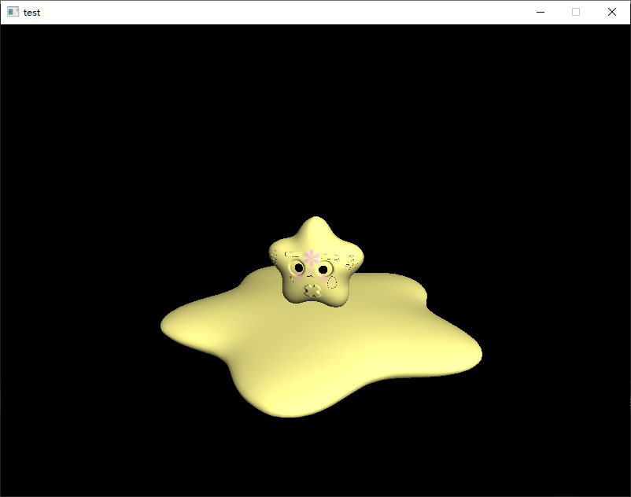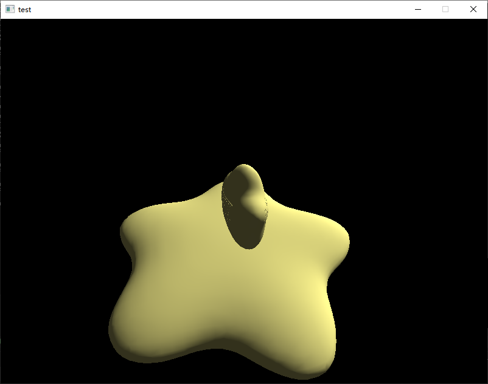


我们在场景文件中增加配置了”是否渲染阴影“的选项，如果我们选择开启，那么我们在代码中也会获取到这个配置，并绘制shadow map。

我们暂时简化地认为，只有不透明物体是**shadow caster（能够投射阴影的遮挡物）**；且只有一个点光源。


#### 1、渲染shadow map

我们需要在正常渲染场景中所有物体之前，增加一个pass，渲染一个shadow map

```C++
//区分透明与非透明模型
vector<Model*> TransModels;//透明物体
vector<Model*> OpaqueModels;//非透明物体
for (int index = 0; index < models.size(); index++)
{  // 统计非透明模型的数量
    Model* model = models[index];

    if (model->transparent == 0)
    {
        OpaqueModels.push_back(model);
    }
    else
    {
        TransModels.push_back(model);  //renderQueue = transparent + 1 
        //break;  // 透明模型不计入
    }
}

//第一个pass
//渲染shadowmap
if (scene.shadowmap_buffer)
{  // 如果场景有阴影缓冲区和阴影贴图
    sort_models(models, FrameInfo::get_light_view_matrix());// 按照光源的视角矩阵对模型进行排序
    framebuffer_clear_depth(scene.shadowmap_buffer, 1);  // 清除阴影缓冲区的深度信息
    for (int index = 0; index < OpaqueModels.size(); index++)
    {  // 遍历所有模型
        Model* model = models[index];
        model->draw(model, scene.shadowmap_buffer,true);  // 绘制模型到阴影缓冲区
        //draw是函数指针，如可以指向draw_model(Model* model, framebuffer_t* framebuffer,bool isDrawShadowMap)
    }
    if(scene.shadowmap == nullptr)
        scene.shadowmap = new Texture();
    scene.shadowmap->set_texture_from_depth_buffer(scene.shadowmap_buffer);// 将阴影缓冲区的深度信息转换为阴影贴图
    //scene.shadowmap->write_texture_to_file("shadowmap.tga");
    // 将阴影缓冲区的深度信息转换为阴影贴图

    for(int index =0;index<OpaqueModels.size();index++) //todo:可以优化，现在是把总的shadowmap赋值给每个model的uniform的值，方便后面用
	{
        Model* model = models[index];
        uniforms_blinnphong* uniforms = (uniforms_blinnphong*)model->program->get_uniforms();
        uniforms->shadowmap = scene.shadowmap;
	}
}

//第二个pass
//先渲染不透明物体，再渲染透明物体
```


代码中的`model->draw(model, scene.shadowmap_buffer,true);  // 绘制模型到阴影缓冲区`将会将模型送入渲染管线中的几何处理（包含顶点着色器），光栅化和片元处理阶段。

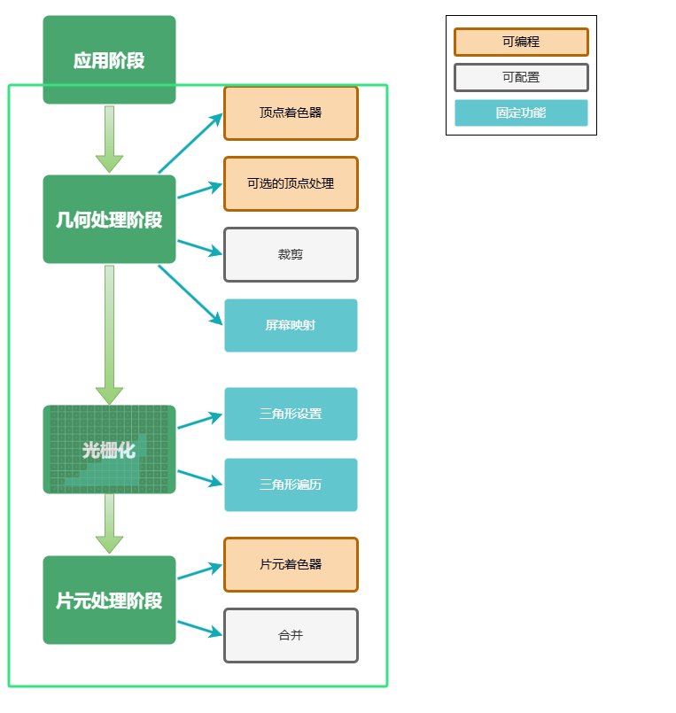

接下来我们来逐步看一看

##### 渲染shadow map的顶点着色器

在顶点着色器中，我们会进入绘制shadow map的特殊顶点着色器。

```C++
vec4_t blinnphong_vertex_shader(void* attribs_, void* varyings_, void* uniforms_)
{
    auto* attribs = static_cast<attribs_blinnphong*>(attribs_);
    auto* varyings = static_cast<varyings_blinnphong*>(varyings_);
    auto* uniforms = static_cast<uniforms_blinnphong*>(uniforms_);

    if(uniforms->isDrawShadowMap==false)
	{
        return common_vertex_shader(attribs, varyings, uniforms);
	}
	else
	{
		return shadow_vertex_shader(attribs, varyings, uniforms);
	}
}
```

这是因为绘制shadow map的顶点着色器并不需要计算普通的顶点着色器的法线，纹理坐标，光照信息等，只需要进行顶点变换，将顶点转换到光源的裁剪空间.

```C++
static vec4_t shadow_vertex_shader(attribs_blinnphong* attribs,
    varyings_blinnphong* varyings,
    uniforms_blinnphong* uniforms) 
{
    mat4_t model_matrix = get_model_matrix(attribs, uniforms);
    mat4_t light_vp_matrix = uniforms->light_vp_matrix;

    vec4_t input_position = vec4_from_vec3(attribs->position, 1);
    vec4_t world_position = mat4_mul_vec4(model_matrix, input_position);
    vec4_t depth_position = mat4_mul_vec4(light_vp_matrix, world_position);

    varyings->texcoord = attribs->texcoord;
    return depth_position;
}
```

##### 光栅化

在光栅化阶段，会进行属性的插值。在渲染shadow map的阶段，我们会将深度进行插值。

```C++
void graphics_draw_triangle(framebuffer_t* framebuffer, Program* program)
{
	int num_vertices;
	for (int i = 0; i < 3; i++)  //走一遍顶点着色器
	{
		vec4_t clip_position = blinnphong_vertex_shader(program->shader_attribs_[i], program->in_varyings_[i], program->get_uniforms());
		program->in_coords[i] = clip_position;  //保存顶点着色器的输出,指的是三个顶点的裁剪空间坐标
	}
    ......
```

##### 渲染shadow map的片元着色器

渲染shadow map的片元着色器阶段并不需要做什么，我们只需要取得每个像素的深度作为shadow map。

```C++
static vec4_t shadow_fragment_shader(varyings_blinnphong* varyings,
    uniforms_blinnphong* uniforms,
    int* discard,
    int backface)
{
    return vec4_new(0, 0, 0, 0);
}
```

##### 将shadow map 转换为纹理

`    scene.shadowmap->set_texture_from_depth_buffer(scene.shadowmap_buffer);// 将阴影缓冲区的深度信息转换为阴影贴图`

渲染shadow map这个pass中，进行了渲染管线中的几何处理，光栅化和片元处理阶段，渲染出了shadowmap_buffer之后，我们还需要进一步将这个线性的buffer转换为用**纹理**(texture)表示的shadow map， 可以方便后续我们做阴影映射（从相机看场景查看某个位置是否是阴影）的时候，对shadow map进行采样和计算。

```C++
void set_texture_from_depth_buffer(framebuffer_t* buffer)
{
	width = buffer->width;
	height = buffer->height;
	this->buffer.resize(width * height);
	int num_pixels = width * height;
	for (int i = 0; i < num_pixels; i++) {
		float depth = buffer->depth_buffer[i];
		this->buffer[i] = vec4_new(depth, depth, depth, 1);
	}
}
```


接下来我们可以可视化的查看这张shadow map（阴影贴图）试试：可以看到，靠近光源的部分较黑，因为数值较小。

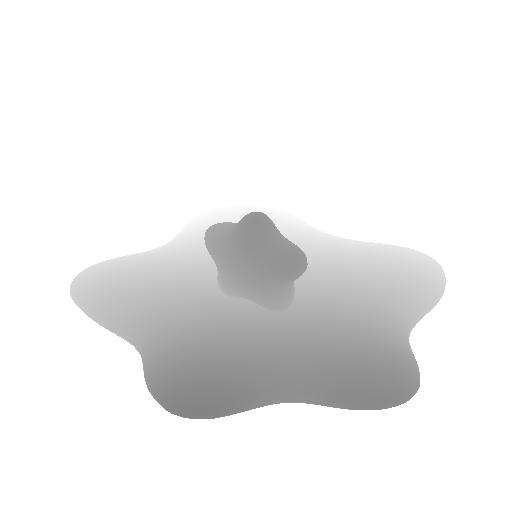


#### 2、实现阴影

拿到了shadow map之后，接下来我们就要进入下一个pass，继续像之前一样对每一个模型进行渲染，不同的是对于每一个片元，我们会通过shadow map判断它是否在阴影中。

```C++
static int is_in_shadow(varyings_blinnphong* varyings,
    uniforms_blinnphong* uniforms, 
    float n_dot_l) 
{
    if (uniforms->shadowmap != nullptr)
    {
        float sampleU = (varyings->depth_position.x + 1) * 0.5f;
        float sampleV = (varyings->depth_position.y + 1) * 0.5f;
        sampleV = 1.0 - sampleV;
        float closest_depth = sample2D(uniforms->shadowmap, vec2_new(sampleU, sampleV), DEFAULT).x;
        float current_depth = varyings->depth_position.z * 0.5 + 0.5;  //depth是-1到1的范围，转换到0到1的范围
        return current_depth > closest_depth;
    }
    else
    {
        return 0;
    }
}
```

普通的片元着色器中

```C++
static vec4_t common_fragment_shader(varyings_blinnphong* varyings,
    uniforms_blinnphong* uniforms,
    int* discard,
    int backface)  
{
    //sample texture
    Material_BlinnPhong material = get_material(varyings, uniforms, backface);
    vec3_t color = material.emission;
    if (uniforms->ambient_intensity > 0)
    {
        vec3_t ambient = material.diffuse;  //kd/ka
        float intensity = uniforms->ambient_intensity; //Ia
        color = vec3_add(color, vec3_mul(ambient, intensity));
    }
    //lambert and blinn_phong
    vec3_t light_dir = vec3_normalize(uniforms->light_dir); //注意Light方向要归一化
    
    float n_dot_l = vec3_dot(material.normal, light_dir);
    //half lambert
    //n_dot_l = n_dot_l * 0.5 + 0.5;
    if (n_dot_l < 0)
    {
		n_dot_l = 0;
	}
    //增加判断是否在阴影中
    if (!is_in_shadow(varyings, uniforms, n_dot_l))
    {
        vec3_t view_dir = get_view_dir(varyings, uniforms);
        vec3_t specular = get_specular(light_dir, view_dir, material);
        vec3_t diffuse = vec3_mul(material.diffuse, n_dot_l);
        color = vec3_add(color, vec3_add(diffuse, specular));
    }
    return vec4_from_vec3(color , material.alpha);
}
```


结果：

可以看到，我们的阴影顺利出现了，但是出现了很明显的错误条纹。接下来我们来看看这个问题如何产生以及如何解决这个问题。

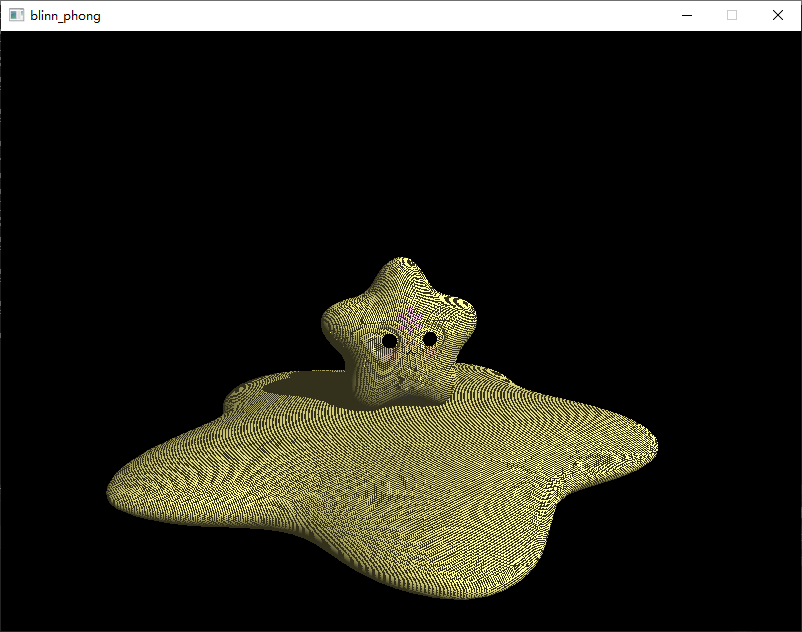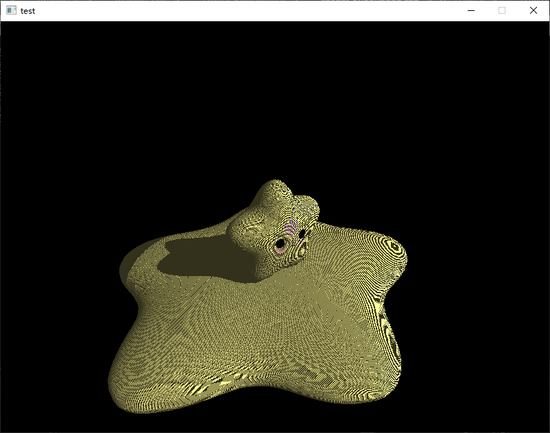


### 10.2.4 shadow map缺点

shadow map的分辨率会很大的影响生成阴影的质量。

#### 自阴影锯齿（self-shadow aliasing）/ 阴影痤疮（shadow acne）

我们回忆一下，shadow map会代表从这个场景中距离光源深度最近的表面。假设shadow map 的分辨率不是特别的高，shadow map中一个像素点会对应场景中一整个小区域的深度。如下图所示。


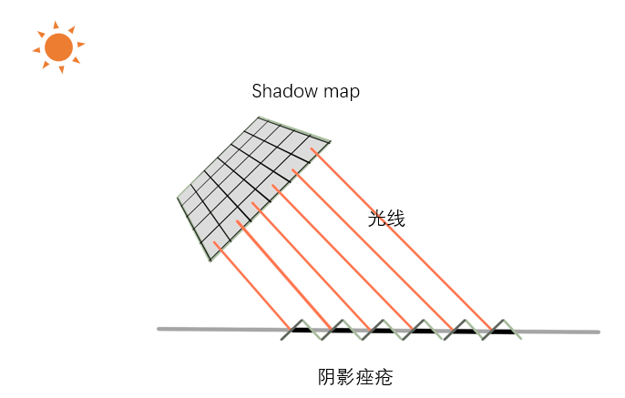


上图中，橙色表示光线，接受物上的矩形线表示 shadow map中的对应值的情况。

由于shadow map是离散采样的，可以看到在实际的接收物（shadow caster）表面上，有一部分片元比shadow map深度要大（对应图中黑色部分），在判断是否是阴影的时候，因为比shadow map中记录的离散的深度更大，因此会错误地认为这一部分是阴影，最终会出现错误的条纹状的阴影。

如下图，假设此时相机要渲染c点，那么在片元着色器中会查询是否在阴影中，这一步会将c点转到光源空间，对shadow map进行采样。然后就会发现，shadow map中对应位置记录的深度比c点的深度要小！这就说明，是有东西遮住了光线，c点是在阴影中的!但实际上，遮住光线的是c点自己。这种情况，是物体的实际深度，与自己的采样深度，相比较不相等（实际深度大于采样深度）导致的，所以可谓是自己（采样的副本）遮挡了自己（实际的物体），所以被称为 self shadowing / 自阴影锯齿（self-shadow aliasing）/ 阴影痤疮（shadow acne）。

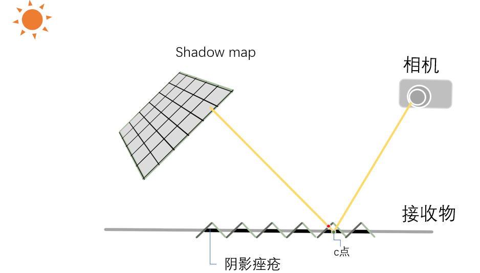


 

>  什么时候自遮挡现象最严重？什么时候没有自遮挡现象？
>
>  - 当光源是垂直从上往下照射地面的时候，没有自遮挡现象。
>  - 当光源几乎平行地照向地面的时候，此时自遮挡现象最严重。


##### 如何解决

只有实际深度大于采样深度的时候才有问题，那么我们在计算实际深度的时候，往灯光方向拉一点，让他减小一点就可以了。

也就是添加一个bias值，将当前实际深度做一个偏移，让它距离光源更近，|当前实际深度值 - bias| > 采样得到的深度值，我们才认为该片段被遮挡了，相当于给了一个缓冲区。


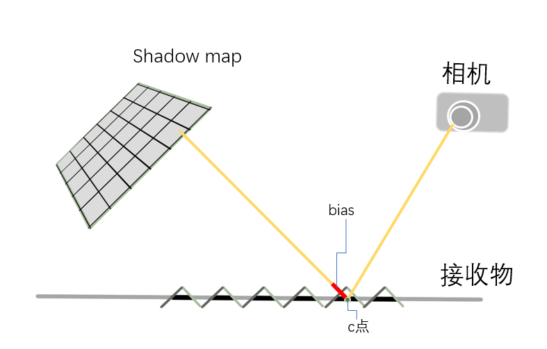

【改进】由于当light和地板是垂直的时候，误差最小，那么这个bias值可以很小。当light和地板的夹角比较大的时候，也就是误差会变大的时候，将bias也增大，结果就可以更加灵活和精确一些。


```C++
static int is_in_shadow(varyings_blinnphong* varyings,
    uniforms_blinnphong* uniforms, 
    float n_dot_l) 
{
    if (uniforms->shadowmap != nullptr)
    {
        float sampleU = (varyings->depth_position.x + 1) * 0.5f;
        float sampleV = (varyings->depth_position.y + 1) * 0.5f;
        sampleV = 1.0 - sampleV;

        //增加bias 避免阴影痤疮
        //float depth_bias = float_max(0.05f * (1 - n_dot_l), 0.005f);
        float depth_bias = float_max(0.15f * (1 - n_dot_l), 0.15f);
        float closest_depth = sample2D(uniforms->shadowmap, vec2_new(sampleU, sampleV), DEFAULT).x;
        //uniforms->shadowmap->write_texture_to_file("shadowmap11111.tga");

        float current_depth = varyings->depth_position.z * 0.5 + 0.5;  //depth是-1到1的范围，转换到0到1的范围
        current_depth = current_depth - depth_bias;
        //std::cout<<"current_depth:"<<current_depth<<",closest_depth:"<<closest_depth<< std::endl;

        return current_depth > closest_depth;
    }
    else
    {
        return 0;
    }
}
```


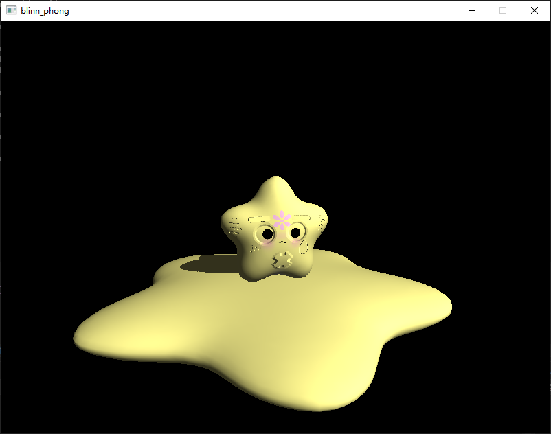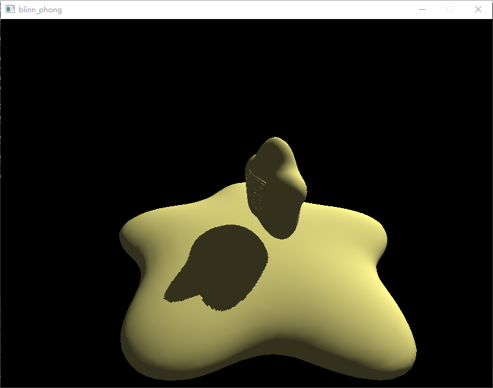


##### 新的问题

引入上述解决方法后，出现了一个问题，如上图所示。

这个小星星是紧贴着下面的大星星的，小星星的脚部应该产生阴影的地方，出现了隔断现象，detached shadow。

过大的偏移量会导致所谓的漏光（light leak）或者Peter Panning问题，即物体看起来像是悬浮在表面上方一样。这种瑕疵的出现，是因为物体接触点下方的区域（例如脚下的地面），被向前偏移得太多，因此并没有接收到阴影。

工业界的解决方法大都是找到一个合适的bias值，使得既没有出现自遮挡，也没有出现detached shadow现象。


调整一个合适的bias：

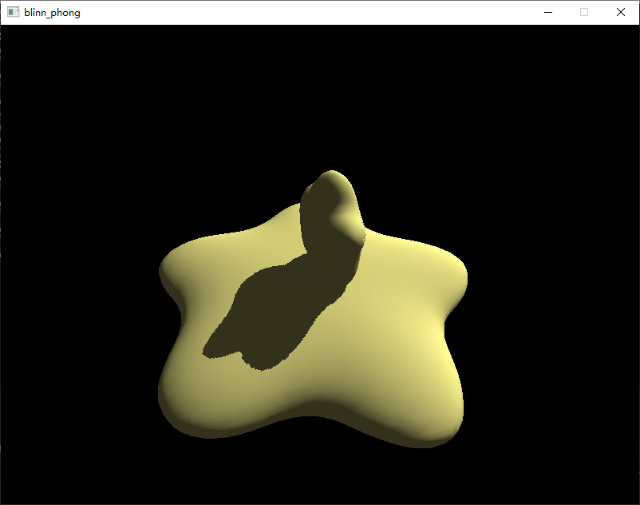


#### 锯齿 / 走样

我们靠近阴影观察，可以看到，这里的阴影有非常明显的块状锯齿走样。这也是因为shadow map的分辨率的问题。

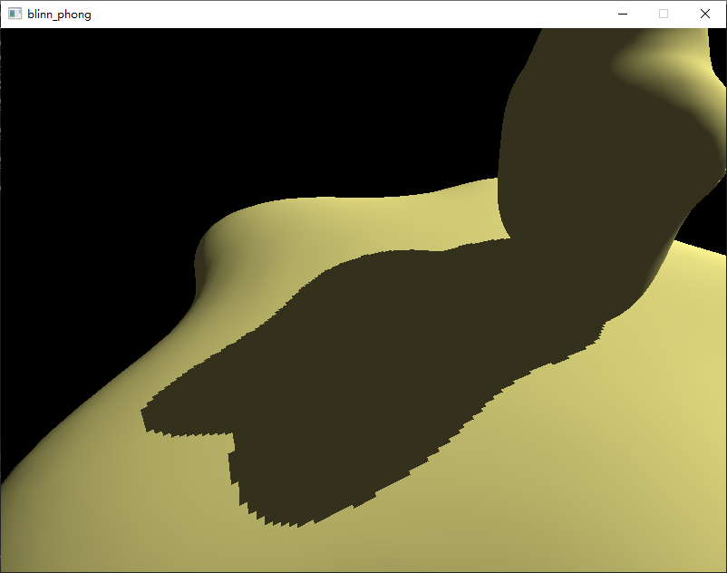

不同shadow map分辨率下的阴影质量:

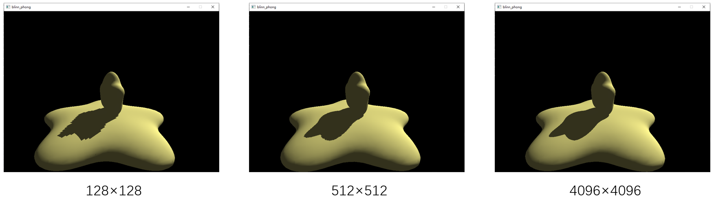

我们想象一下，此时灯光距离相机中能看到的物体越来越远，shadow map中像素对应的区域越来越大，那么精度也会越来越低。能否在更靠近相机的地方给予shadow map上更高的精度呢？

想要解决以上问题，可以采用接下来要讲的级联阴影贴图方式.

### 10.2.5 级联阴影贴图（cascade shadow maps，CSM）

在更靠近相机的地方添加更多的样本，比方说，使用多张shadow map。让距离相机最近的物体对应shadow map中更高的分辨率。而距离相机比较远的大量物体物体可以公用一张shadow，给与它们每个物体的精度都相对较低。

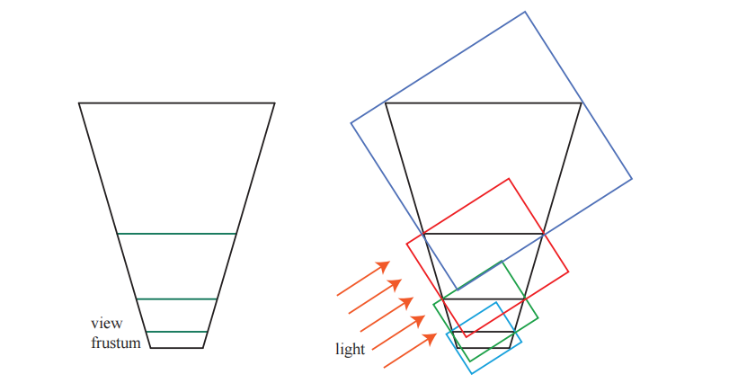

图片来自[ShaderX5 2006] Cascaded Shadow Maps

左图中，我们将相机的观察体分为了从近到远的四个区域，其中我们希望更近的物体有更高的精度，因此，近的区域划分更密集。

右图中，我们为每个划分后的观察体区域创建了对应的包围盒，左下角的方向光源对应生成四个阴影贴，每一个包围盒决定了对应阴影贴图的渲染范围。


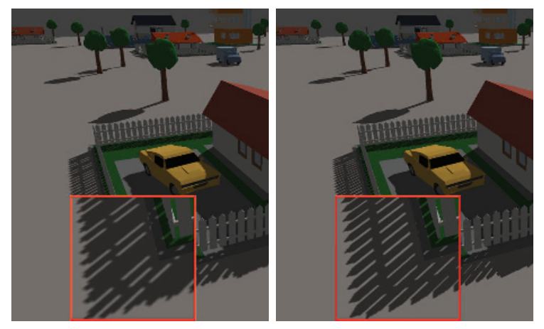

图片来自Zhang, Fan, Hanqiu Sun, and Oskari Nyman, “Parallel-Split Shadow Maps on Programmable GPUs,”in Hubert Nguyen, ed., GPU Gems 3, Addison-Wesley, pp. 203–237, 2007. Cited on p. 242, 243, 244

左图中，相机可以看见的区域很大，shadow map需要覆盖所有可见的shadow caster， 因此shadow map的分别率也需要很大，此场景中，为了避免走样（锯齿），单张阴影贴图使用了 $2048 \times 2048$ 的分辨率。

右图中，使用了Cascaded Shadow Maps（级联阴影贴图），使用了四个 $1024 \times 1024 $的阴影贴图，大大提高了阴影质量 。


