# lesson12_光线追踪


### 1. 引言

- 光线追踪与传统渲染技术的对比（如光栅化）+光线追踪的基本概念

​	不知道读者是否会觉得，我们之前实现的光栅化效果不够真实，并不那么像现实中的效果。例如很难实现如下图中物体A反射物体B的光。

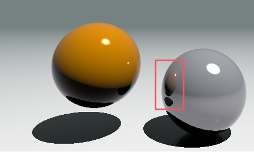

​	本章我们将介绍光线追踪，光线追踪能够更真实地反映现实中的光影效果。在现实中，我们的眼睛看到的颜色都是因为接收到了光，现实中的光线从光源出发，在场景中不断弹射，如果最终进入到我们的眼睛，那么我们的眼睛就能看到这个色彩。

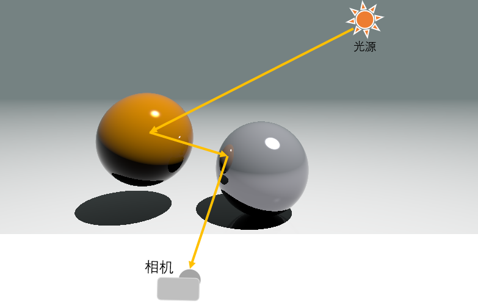

​	根据光路可逆性，我们同样可以从眼睛/相机出发，回溯这根光线在到达相之前是怎样的传播路径，打到了什么物体，经过了几次的反射，几次折射等。我们要做的就是追踪光线，这就是光线追踪的思想。对于每个像素，我们从相机开始发射一根（或者多根）光线穿过这个像素，追踪这根光线，如果这根光线与场景中的物体相交，我们就计算着色，并模拟光线的反射或者折射行为，例如此时光线打到了如图所示的光滑镜面材质上，那我们就进行镜面反射的计算，创建新的光线往镜面反射的方向出发。最后把这根光线这一路上的颜色相加，就是最终呈现在屏幕像素上的颜色。

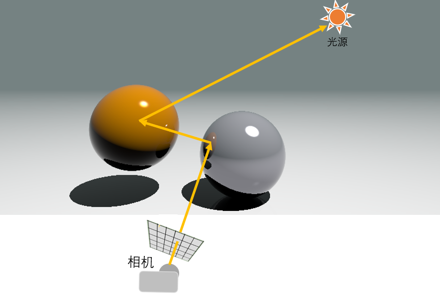

​	光线追踪并不需要像光栅化那样，计算复杂的空间变换。

​	复习一下光栅化，需要遍历空间中的三角形，将三角形从模型坐标转换到世界空间，相机空间，裁剪空间，最终转换到屏幕空间等，然后再去遍历屏幕中的每个像素，看像素是否在三角形内，进而进行着色等操作。

```
for (T in triangles )
    for (P in pixels )
        检查像素P是否在三角形T中
```

​	（伪代码参考[1]]）

​	而光线追踪则是对于每个屏幕中的像素，我们发射光线，检查场景中的所有物体/图元（如三角形）是否会被射线打到，如果会，光线就会“染上”物体的颜色。

【只需要将物体，光源，相机，光线等转到同一个坐标系下即可，例如物体从模型空间转到世界空间，同时光源与相机也转换到世界空间统一计算【存疑】】

```
for (P in pixels )
    for (T in triangles )
        检查穿过像素P的射线是否打中三角形T
```


#### 1.1 实验环境

​	由于光线追踪与光栅化是完全不同的两个体系，而且光线追踪的计算量非常大，不再适合我们之前的用CPU渲染的C++光栅化渲染器，而应该采用GPU，且光追作为一个单独的体系，也希望之前没有跟着写渲染器的读者可以实现光线追踪，且由于希望读者无需配任何环境，我们选择使用在线网站Shadertoy（https://www.shadertoy.com/）作为光线追踪的实验环境。

​	读者可以打开Shadertoy（https://www.shadertoy.com/），使用GLSL语言直接进行实验。这节教程也会在实现算法的时候顺便介绍一下对应的Shadertoy的语法。

### 2. 光线追踪的基础原理

#### 2.1光线的生成

##### 2.1.1定义一条光线

要实现光线追踪，我们首先要知道如何定义一条光线。

- 我们将光线定义为$Ray(t)=\mathbf{o}+t \mathbf{d}$

  - $Ray(t)$是一个三维坐标的点，沿着光线移动；$o(origin)$是起点，$d(direction)$则是光线的方向；$t(time)$是一个实数，可以理解为时刻

  - 不同的t值可以到达不同的地方，如果t只能取正数那么这就是一条射线：

  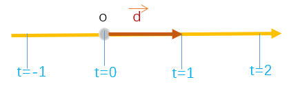

所以，光线的结构体如下：

```GLSL
struct Ray 
{
    vec3 o;     // origin
    vec3 d;     // direction - always set with normalized vector
    float t;    // time
};
```

也就是说，如果指定了原点$o$和光线方向$d$，以及对应的$t$，我们就可以获取到光线此时打到的点。此时创建一根光线的函数及其重载函数如下：

```glsl
Ray createRay(vec3 o, vec3 d, float t)
{
    Ray r;
    r.o = o;
    r.d = d;
    r.t = t;
    return r;
}

Ray createRay(vec3 o, vec3 d)
{
    return createRay(o, d, 0.0);
}
```

如果没有显式地指定$t$的值，就生成一根光线，并且指定$t=0$。


##### 2.1.2 光线与屏幕坐标的关联

得到了光线的定义之后，我们要决定初始这条光线要往哪个方向去发射呢？$Ray(t)=\mathbf{o}+t \mathbf{d}$中的$\mathbf{o} 和\mathbf{d}$是多少呢？（已知$t$可以是不同的值，让光线到达不同的地方）。

在光线追踪中，我们看到的内容是光线进入人眼中的内容（或者是说光线被相机捕捉到的内容），由于光路具备可逆性，我们可以让光线从相机出发，往屏幕上的每一个像素发射。此时生成的光线的起点$o(origin)$是相机，那么方向$d(direction)$呢？

我们从相机$o(origin)$点发射一条光线Ray（红色线），穿过像素A的中心。这些光线被称作者相机光线（camera ray) 或者眼睛光线（eye ray）。

（u,v）是屏幕上像素点A的坐标，

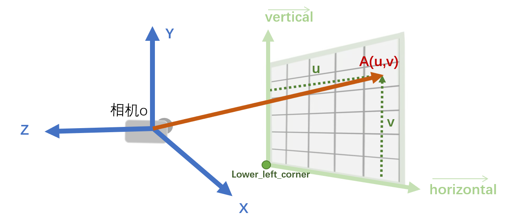


- 在本项目当中，为了防止混淆导致不好Debug，我们选择不同长宽的图像；

- 暂时来说，认为视角的aspect ratio就是渲染画面的宽高比。我们将相机放置在o点，同时认为**X轴向右，Y轴向上，Z轴正方向指向屏幕外面**（也就是说，这是一个**右手坐标系**）（补充一下，**类似Unity的模型坐标系和世界坐标系都是左手坐标系**，Z轴正方向是指向屏幕内侧的）。从左上角开始遍历屏幕空间。

- 此时，如何表示从视角打向成像平面的像素光线的方向？

  - 认为屏幕左下角为`lower_left_corner`，下图绿色部分就好像相机的"成像平面"，我们可以自行配置一些值来计算出`lower_left_corner`的坐标。比如我们假定相机到成像平面的距离为1，成像平面的高度为2，宽高比为2：1，从相机往其-z方向发射射线会打到成像平面的中心。从以上信息可以推导出`lower_left_corner`的坐标为（-2，-1，-1）。
  - 认为水平方向为`horizontal`,例如可以是(4.0,0.0,0.0),而竖直方向为`vertical`,例如可以是(0.0,2.0,0.0)，这里`horizontal`和`vertical`的模就表示成像平面的大小。后面将会用比例系数来表示点在屏幕中的位置；

  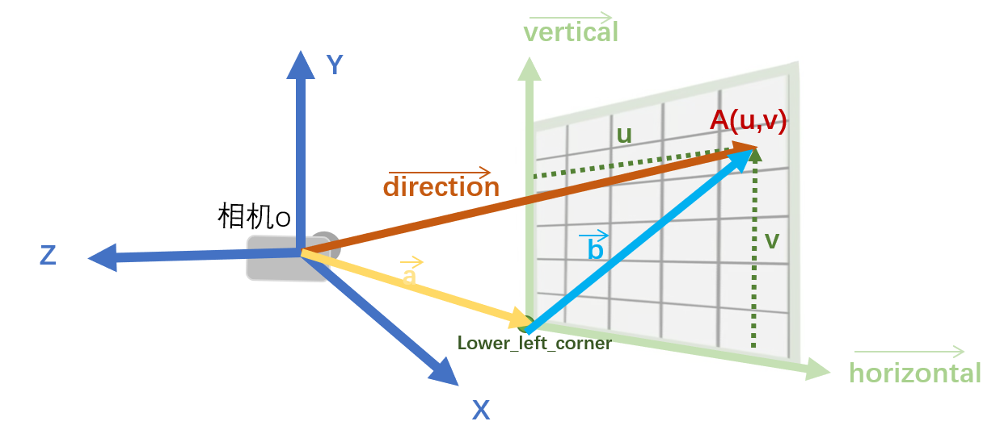

  - 在上图当中，$\vec{direction}=\vec{b}+\vec{a}$
    - $\vec{a}=lowerleftcorner-origin$
    - $\vec{b}=u*\vec{horizontal}+v*\vec{vertical}$ 

  - 代入$\vec{a}和\vec{b}$,得到结果为$\vec{direction}=lowerleftcorner-origin+u*\vec{horizontal}+v*\vec{vertical}$

上面推导中的$u$和$v$就类似于纹理篇的UV坐标，范围为[0，1]，左下角为（0，0），右上角为（1，1）。趁热打铁，我们来构建一下相机模型，以及对应的$direction$方向。首先是相机模型：

```GLSL
struct Camera
{
    vec3 origin;
    vec3 lowerLeftCorner;
    vec3 horizontal;
    vec3 vertical;
    vec3 u, v, w;
    float lensRadius; 
    float time0, time1;
};
```

上面的$u,v,w$对应相机自己的$x,y,z$轴方向，并且是归一化的结果。`lensRadius`被用于产生景深的效果（后文会介绍），从而让渲染结果更为真实，`time0`和`time1`也是后面会介绍，用于实现运动模糊的效果（可以想象相机快门打开（`time0`）之后，时隔`time1-time0`的时间后快门关闭，此时如果被拍摄物体在运动，就可能会产生运动模糊的现象）。

我们来写一个**创建相机模型的函数：**

```glsl
Camera createCamera(
    vec3 lookFrom,
    vec3 lookAt,
    vec3 worldUp,
    float fovy,
    float aspect,
    float aperture,
    float focusDist,
    float time0,
    float time1)
{
    float theta = fovy * pi / 180.0;
    float halfHeight = tan(theta * 0.5);
    float halfWidth = aspect * halfHeight;

    Camera cam;
    cam.lensRadius = aperture * 0.5;
    cam.origin = lookFrom;
    cam.w = normalize(lookFrom - lookAt);
    cam.u = normalize(cross(worldUp, cam.w));
    cam.v = cross(cam.w, cam.u);
    
    cam.lowerLeftCorner = cam.origin - halfWidth * focusDist * cam.u - halfHeight * focusDist * cam.v - cam.w * focusDist;
    cam.horizontal = 2.0 * halfWidth * focusDist * cam.u;
    cam.vertical = 2.0 * halfHeight * focusDist * cam.v;
    cam.time0 = time0;
    cam.time1 = time1;
    return cam;
}
```

在光栅化的章节有介绍FOV的概念，这里利用FOV求解出`halfHeight`。这里我们默认相机到成像平面的距离为1，`cam.lensRadius`用于模拟相机的景深效果。这里详细介绍一下。先解释一下景深的概念：

> **以下这部分比较抽象，如果难以理解的话也不影响后文的学习（不用纠结）。**
>
> 景深指的是相机对焦点前后相对清晰的成像范围，在景深之内的影像比较清楚，在这个范围之前或是之后的影像则比较模糊。虽然透镜只能够将光聚到某一固定的距离，远离此点则会逐渐模糊，但是在某一 段特定的距离内，影像模糊的程度是肉眼无法察觉的，这段距离称之为景深。下面这张图可能会辅助理解：
>
> 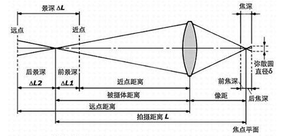
>
> 上图中的$\Delta L$​即为景深。我们称投影点（对应下图subject）和物体完全聚焦的平面（对应下图focusing plane）之间的距离为focus distance。请注意，focus distance与focus length是不一样的，后者可以简单理解为相机和图像平面之间的距离。英文的原文定义如下：
>
> - **Focal length** is the distance from the focusing plane (where the camera’s sensor is) to the rear nodal point of the lens, when focused at infinity. This is a property of the lens, which determines the angle of view as well as the perspective. 
> - **Focusing distance** is the distance from the focusing plane to the subject.
>
> 在真实的相机当中，我们平时摄影中所说的“焦距”是由镜头和胶片/传感器之间的距离控制的。这就是为什么当你改变对焦时，你会看到镜头相对于相机移动(这也可能发生在你的手机相机上，但传感器会移动)。而“光圈”（aperture）是 一个孔，用来有效地控制镜头的大小。对于一台真正的相机来说，如果需要更多的光线，你可以把光 圈调大，这样就会产生更多的散焦模糊现象。
>
> 
>
> 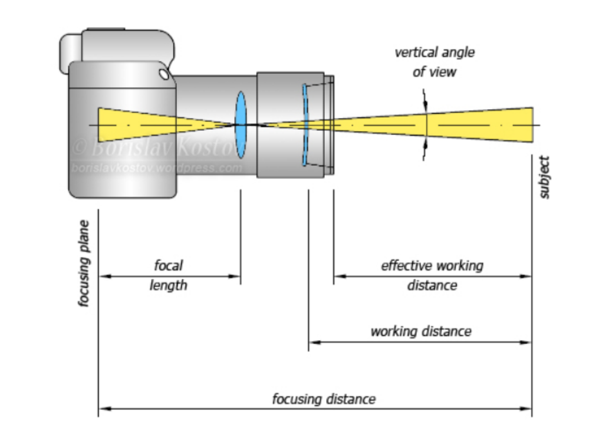

有了上述概念的一个基本认知之后，我们来看代码这一句：

```glsl
cam.lowerLeftCorner = cam.origin - halfWidth * focusDist * cam.u - halfHeight * focusDist * cam.v - cam.w * focusDist;
```

这句话的意义是什么呢？实际上这是一个近似，借用著名的光追三部曲中Ray Tracing in one weekend中的trick，本来我们要模拟以下情景：

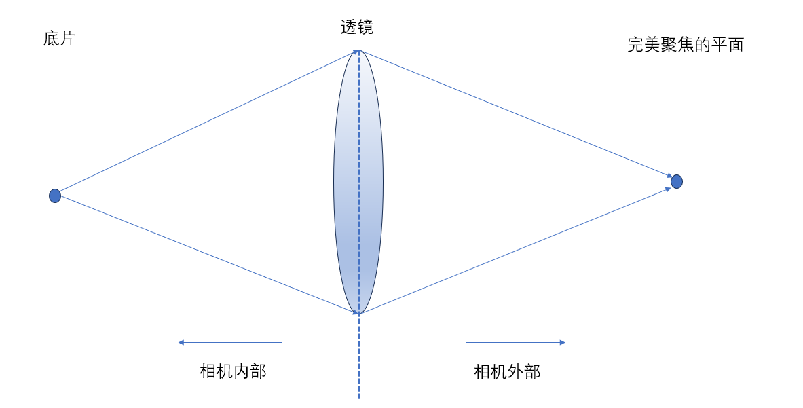

模拟这个场景会比较困难，因为还涉及到成像结果翻转的问题。所以为了简化，我们不考虑相机内部，但同时又想呈现出景深/相机焦散的效果，就可以借用Ray Tracing In One Weekend中的模型，将其简化为下图：

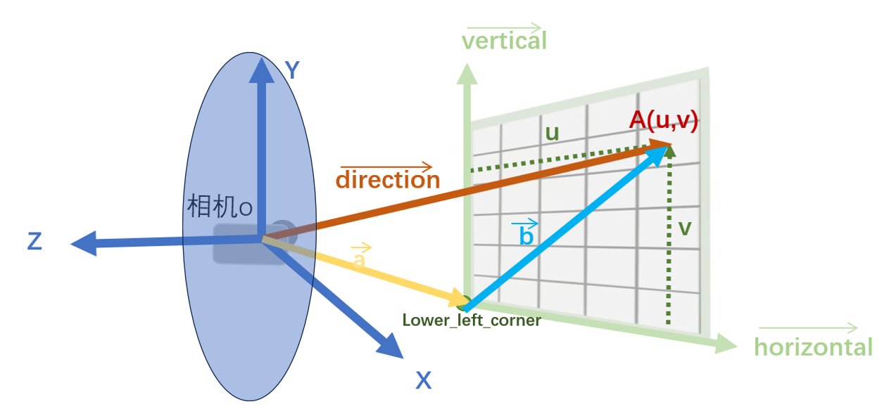

此时相机打出的光线的起点`origin`不再是一个固定的点，而是分布在透镜所在的圆盘上（我们假设透镜是圆盘状的），即打出光线的起点是圆盘（即蓝色区域）上的随机一点，通过这种trick来模拟相机“焦散”的感觉。而经过实验这种方法带来的效果是不错的。在简化模型中，我们就可以认为相机距离成像平面的距离为上面的`focusing distance`，也就是把相机模型的inside侧移除（但focusing distance的长度依旧是inside+outside的长度），改为从透镜上随机一点发射光线了。

**遍历图像的每个像素，计算相机打到这个像素上的光线的代码如下：**（color函数为真正的光追着色函数，这里还没实现）

```glsl
void mainImage(out vec4 fragColor, in vec2 fragCoord)
{
    gSeed = float(baseHash(floatBitsToUint(gl_FragCoord.xy))) / float(0xffffffffU); //随机一个seed，暂不需关心细节
    vec2 mouse = iMouse.xy / iResolution.xy;
    mouse.x = mouse.x * 2.0 - 1.0;

    vec3 camPos = vec3(mouse.x * 10.0, mouse.y * 5.0, 8.0);
    vec3 camTarget = vec3(0.0, 0.0, -1.0);
    float fovy = 20.0;
    float aperture = 0.0;
    float distToFocus = length(camTarget - camPos);
    float time0 = 0.0;
    float time1 = 0.0; //暂时先设定time1=time0=0.0
    Camera cam = createCamera(
        camPos,
        camTarget,
        vec3(0.0, 1.0, 0.0),    // world up vector
        fovy,
        iResolution.x / iResolution.y,
        aperture,
        distToFocus,
        time0,
        time1);
    vec2 uv = (gl_FragCoord.xy + hash2(gSeed)) / iResolution.xy; //在当前像素的基础上随机加一点扰动
    vec3 col = color(getRay(cam, uv));
    fragColor = vec4(col, 1.0);
}
```

对于每个像素而言，其uv坐标可以通过这个式子求出：`uv = (gl_FragCoord.xy + hash2(gSeed)) / iResolution.xy;`，如果不加`hash2(gSeed)`，则采样的点是像素的中心，加一点偏移可以带来一定的随机性，因为我们每根像素只打出一根光线，所以效果可能不够好，后面我们会利用时间上反走样的技术来起到去噪的效果。

核心是`getRay`函数，算法在本节开始时有介绍：

```glsl
Ray getRay(Camera cam, vec2 uv)
{
    vec2 rd = cam.lensRadius * randomInUnitDisk(gSeed);
    vec3 offset = cam.u * rd.x + cam.v * rd.y;  //模拟景深/模糊效果，光线起始点随机偏移一点
    float time = cam.time0 + hash1(gSeed) * (cam.time1 - cam.time0);
    return createRay(
        cam.origin + offset,
        normalize(cam.lowerLeftCorner + uv.x * cam.horizontal + uv.y * cam.vertical - cam.origin - offset),
        time); 
}
```

跟本节开始的推导相比，无非是camera的origin现在是camera.origin+offset，这里先不用关心time这个值，由于前面的time1和time0都是0，所以这里time就是0。在**运动模糊部分**，会展开介绍time的作用。

至此，我们就可以完成穿过所有像素的我们想要的所有光线的生成（每个像素打出一根光线）。那么接下来，就要让光线不断往前走，直到与场景中的物体相交（也可能最后都没有与任何物体相交），计算光线与物体的交点、弹射的方向（可以包括漫反射，镜面反射和折射）以及光线颜色衰减的系数等信息。


#### 2.2 光线与物体求交

我们将光线从相机中发射出来之后，接下来要做的事情是和场景内的物体求交。这里我们**先考虑三种情况：光线和球面相交、光线和普通的隐式平面相交、以及一般化一些的光线与三角形求交。**

##### 2.2.1 光线与球面相交

**(1)光线方程**

$Ray(t)=\mathbf{o}+t \mathbf{d}(0≤t<∞)\quad$

**(2)球面方程**

- 半径为R的球体的方程：

  - $x^2+y^2+z^2=R^2$

  - 也就是说，如果一个坐标点$(x，y，z)$满足上面的方程，我们就认为这个点在球面上，否则不在球面上；

- 根据上式推广，如果球心在 $C  =(cx，cy，cz)$，则球的方程为：

  - $(x-cx)^2+(y-cy)^2+(z-cz)^2=R^2$

- 再次推广，此时对于光线和球面的交点$p(t)$，有：

  - $(p(t)-C)^2-R^2=0\quad$,其中c为中心点的坐标

- 也就是说，对于光线上的点$p(t)=\mathbf{o}+t \mathbf{d}$，有$(p(t)-C)^2-R^2=0\quad$

  也就是$(\mathbf{o}+t \mathbf{d}-C)^2=R^2$ 

**将上式中的点乘展开，进行多项式展开，可以得到化简之后的式子：**

$ t^2·\vec{d}·\vec{d}+2·t·\vec{d}·\vec{(o-C)}+\vec{(o-C)}·\vec{(o-C)}-R^2=0$

可以看到，通过这个式子求解二次方程,**就可以求解出t的值**，通过t的值来判定是否相交以及相交的交点数

对于求根公式来说（这其实就是高中数学介绍的正常二次方程的求根公式），此时可以简化如下（可以令$b = \frac{1}{2}b_0$, $b_0$是初始的求根公式当中的B项）：
$$
\begin{aligned}
& \frac{-b_o \pm \sqrt{b_o^{2}-4 a c}}{2 a} \\
= & \frac{-2 b \pm \sqrt{(2 b)^{2}-4 a c}}{2 a} \\
= & \frac{-2 b \pm 2 \sqrt{b^{2}-a c}}{2 a} \\
= & \frac{-b \pm \sqrt{b^{2}-a c}}{a}
\end{aligned}
$$

我们让：
$$
a=\vec{d}·\vec{d}\\
b=\vec{d}·\vec{(o-C)}\\
c=\vec{(o-C)}·\vec{(o-C)}-R^2
$$
因此原来的式子变为:(再次注意和我们学的二次方程稍有不同，t的参数是2b而不是b)
$$
a·t^2+2·b·t+c=0
$$

得到:
$$
t = \frac{-b \pm \sqrt{b^2-ac}}{a}
$$


如果判别式$discriminant=\sqrt{b^2-ac} >0 $,说明有2个交点（这里指的是光线所在的直线，交点有可能在direction的后方），$discriminant=\sqrt{b^2-ac} <0 $说明无交点。但在光线追踪中，$t>0$我们才认为是有效的交点值。如下图：

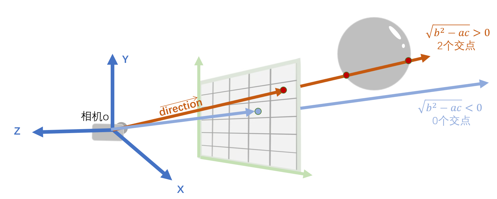

```GLSL
vec3 pointOnRay(Ray r, float t)
{
    return r.o + r.d * t;
}

// 球体与光线相交检测函数
bool hit_sphere(Sphere s, Ray r, float tmin, float tmax, inout HitRecord rec)
{
    vec3 oc = r.o - s.center;
    float a = dot(r.d, r.d);
    float b = dot(oc, r.d);
    float c = dot(oc, oc) - s.radius * s.radius;
    float discriminant = b * b - a * c;
    if(discriminant > 0.0) //说明有两个交点
    {
        float sqrtDiscriminant = sqrt(discriminant);
        float temp = (-b - sqrtDiscriminant) / a;
        if(temp < tmax && temp > tmin) //这才是有效值
        {
            rec.t = temp;
            rec.pos = pointOnRay(r, rec.t);
            rec.normal = (rec.pos - s.center) / s.radius;
            return true;
        }
        temp = (-b + sqrtDiscriminant) / a;
        if(temp < tmax && temp > tmin)
        {
            rec.t = temp;
            rec.pos = pointOnRay(r, rec.t);
            rec.normal = (rec.pos - s.center) / s.radius;
            return true;
        }
    }
    return false;
}
```

一开始，我们传入hit_sphere函数的`tmin`可以设置为0.001（这是为了防止浮点数精度造成的误差），而`tmax`则是`max_float`。这里我们需要记录交点的信息，记录交点信息的结构体为：

```glsl
struct HitRecord
{
    vec3 pos;
    vec3 normal; //交点的法线
    float t;            // 记录光线相交时的t值
    Material material; //material指的是相交点的材质，后面会解释
};
```

我们会遍历场景中的所有物体，找到最近的交点作为光线与场景的交点（想想看非常合理，毕竟”后面“的物体会被”前面“的物体所挡住）。这里有一个hit_world函数，可以在源代码中查看，这里就不贴上来了，其实就是遍历场景中的所有物体（在这个demo中，所有的物体都是球体），并求解出最近的交点。

接下来，先来看一下光线和隐式平面求交，以及光线和三角形求交的逻辑。


##### 2.2.2 光线与**隐式平面求交**

联立方程组:
$$
\begin{cases}
  r(t)=p=o+td(0≤t<∞)\quad① \\ 
  p:f(p)=0\quad ②
\end{cases}.
$$
也就是说,解方程$f(o+td)=0$即可.


##### 2.2.3 光线与三角形求交

###### (1)使用三角形的重心坐标判断

判断光线是否与三角形相交,可以按照下面的步骤(**注:该算法需要进行优化**):

- 1.判断光线是否与三角形所在平面相交;
- 2.判断交点是否在三角形的内部(**使用重心**)；

**1.判断光线是否与三角形所在平面相交;**

已知平面方程如下:

$ax+by+cz+d=0$

则对于平面上的点$p$,有:

- $p:(p-p')·N=0$  ($p'$是平面上一点,$N$是平面的法线方向,$\vec{N}=(a,b,c)$)


**此时我们联立光线方程与平面方程,求解二者的交点$p$**
$$
\begin{cases}  r(t)=p=o+td(0≤t<∞)\quad① \\   p:(p-p')·N=0\quad ②\end{cases}.
$$
将①代入②,有$(o+td-p')·N=0$,通过点乘的分配律求解出:$\large t=\frac{(p'-o)·N}{d·N}$(需要验证是否满足$0≤t<∞$)

接下来,只需要判断$o+td$这个点是否在三角形内部即可(使用重心坐标来判断)


**2.判断交点是否在三角形的内部(使用重心)**

我们复习一下第一节光栅化提到的重心坐标判断点是否在三角形内部的内容：

重心坐标$(w,u,v)$表示点P在三角形ABC内的位置。

（以下以二维情况为例）

对于三角形ABC内任意一点P, 存在三个数u,v,w，满足：

$u+v+w=1$

$P=w*A+u*B+v*C$

则$(w,u,v)$称为此三角形上P点的重心坐标


在三角形情形中，重心坐标也叫**面积坐标**，因为*P*点关于三角形*ABC*的重心坐标和三角形PBC,PCA及PAB的（有向）面积成比例，

$w:u:v = S(PBC):S(PCA):S(PAB)$


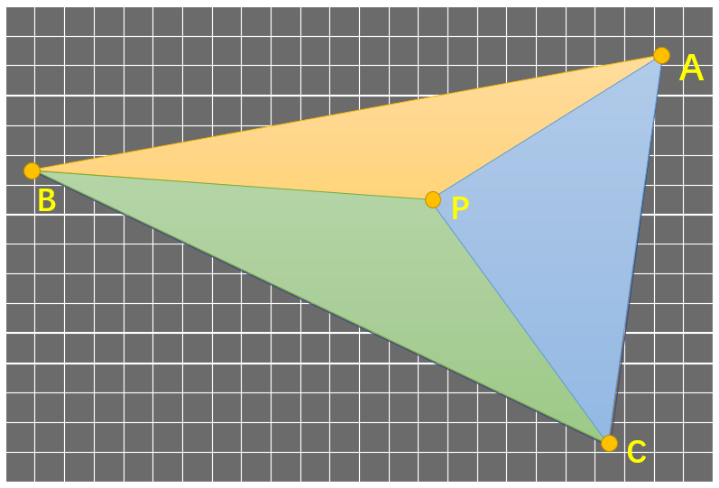


（2）判断点在三角形内

如果点P在三角形内部，则它必然会对三角形的每一边形成一个小三角形，这些小三角形的面积都是正的（即w,u,v都大于零）。

如果其中任一重心坐标（比如u）为零或负数，意味着点P恰好位于某一边上或者在边外，这样就不再是“严格”位于三角形内部。

因此只有当三角形的三个重心坐标都>0时才认为是在三角形内（这里暂时不过多考虑边界情况，比如=0之类的）。

因此,我们只需要计算出点P的重心坐标,就可以判断这一点是否在三角形内,从而决定是否为其着色。


 （3） 重心坐标计算公式

使$w=1-u-v$

则$P=w*A+u*B+v*C = (1-u-v)*A+u*B+v*C$

展开

$P = A-u*A-v*A+u*B+v*C $

$P = A+u*(B-A)+v*(C-A)$

$P = A+u*\overrightarrow{AB}+v*\overrightarrow{AC}$

$u*\overrightarrow{AB}+v*\overrightarrow{AC}+\overrightarrow{PA} = \overrightarrow{0}$

由此，可以推出以下两个方程：


$$
\begin{bmatrix} u \\ v \\ 1 \end{bmatrix} \begin{bmatrix} \overrightarrow{AB}_x & \overrightarrow{AC}_x & \overrightarrow{PA}_x \end{bmatrix} = 0
$$


$$
\begin{bmatrix} u \\ v \\ 1 \end{bmatrix} \begin{bmatrix} \overrightarrow{AB}_y & \overrightarrow{AC}_y & \overrightarrow{PA}_y \end{bmatrix} = 0
$$

因此$\begin{bmatrix} u & v & 1 \end{bmatrix} $与$\begin{bmatrix} \overrightarrow{AB}_x & \overrightarrow{AC}_x & \overrightarrow{PA}_x \end{bmatrix} $和$\begin{bmatrix} \overrightarrow{AB}_y & \overrightarrow{AC}_y & \overrightarrow{PA}_y \end{bmatrix} $都垂直，

>在三维几何中，向量a和向量b的叉乘结果是一个向量，该向量垂直于a和b向量构成的平面。
>
>$\overrightarrow{a} \times \overrightarrow{b} =  \overrightarrow{n}$
>
>则 $ \overrightarrow{n}$与 $ \overrightarrow{a}$垂直， $ \overrightarrow{n}$与 $ \overrightarrow{b}$垂直，
>
>反之亦然，如果 $ \overrightarrow{n}$与 $ \overrightarrow{a}$垂直， $ \overrightarrow{n}$与 $ \overrightarrow{b}$垂直，
>
>则$\overrightarrow{a} \times \overrightarrow{b} =  \overrightarrow{n}$

不难看出，实际上重心坐标就等于$(\overrightarrow{AB}_x, \overrightarrow{AC}_x, \overrightarrow{PA}_x)$和$(\overrightarrow{AB}_y, \overrightarrow{AC}_y, \overrightarrow{PA}_y)$的叉乘结果（当然要归一化z到1）。
$$
\begin{bmatrix} u & v & 1 \end{bmatrix} =(\overrightarrow{AB}_x, \overrightarrow{AC}_x, \overrightarrow{PA}_x) \times (\overrightarrow{AB}_y, \overrightarrow{AC}_y, \overrightarrow{PA}_y)
$$

$$
(\overrightarrow{AB}_x, \overrightarrow{AC}_x, \overrightarrow{PA}_x) \times (\overrightarrow{AB}_y, \overrightarrow{AC}_y, \overrightarrow{PA}_y) = \\
\begin{vmatrix}i&j&k\\\overrightarrow{AB}_x&\overrightarrow{AC}_x&\overrightarrow{PA}_x\\\overrightarrow{AB}_y&\overrightarrow{AC}_y&\overrightarrow{PA}_y
\end{vmatrix} \\
$$


$$
[(\overrightarrow{AC}_x\cdot \overrightarrow{PA}_y)-(\overrightarrow{AC}_y\cdot \overrightarrow{PA}_x)]\overrightarrow{i} \\
-[(\overrightarrow{AB}_x\cdot \overrightarrow{PA}_y)-(\overrightarrow{AB}_y\cdot \overrightarrow{PA}_x)]\overrightarrow{j} \\
+[(\overrightarrow{AB}_x\cdot \overrightarrow{AC}_y)-(\overrightarrow{AB}_y\cdot \overrightarrow{AC}_x)]\overrightarrow{k}
$$


至此,我们发现,当我们只知道A,B,C和P的坐标,就顺利算出P的重心坐标$\begin{bmatrix} 1-u-v,u , v \end{bmatrix} $,通过判断u,v是否>0,我们就可以判断P是否在三角形内.


###### (2)补充:`Möller Trumbore Algorithm`

- 这是一种简化算法,可以立刻直接求解判断**光线与三角形**求交，而不需要先求光线与三角形交点然后再使用重心坐标判断是否在三角形内部.

该算法的推导可以参考下列博客:

[(8条消息) Möller-Trumbore算法-射线三角形相交算法_zhanxi1992的博客-CSDN博客](https://blog.csdn.net/zhanxi1992/article/details/109903792)

推导过程如下:

假设$P_0、P_1、P_2$是三角形的三个顶点：

> 利用重心坐标一步求解交点是否在三角形内,我们需要求解如下方程:
>
> $\vec{O}+t\vec{D}=(1-b1-b2)\vec{P_0}+b_1\vec{P_1}+b_2\vec{P_2}$
>
> (以下证明为了方便,不再标注向量符号)
>
> 将括号展开,移项可得:
>
> $O-P_0=(P_1-P_0)b_1+(P_2-P_0)b_2-tD\quad ①$
>
> 通过观察可知,$O-P_0,(P_1-P_0),(P_2-P_0)$都是已知量,因此可以将其用变量来表示:
> $$
> E_1=P_1-P_0 \\
> E_2=P_2-P_0 \\
> S=O-P_0
> $$
>
> 此时①式可化为:
>
> $S=E_1b_1+E_2b_2-tD$
>
> 将其转为矩阵乘法的表示形式,有:
> $$
> \begin{bmatrix}
> -D&E_1&E_2
> \end{bmatrix}
> \begin{bmatrix}
> t\\b_1\\b_2
> \end{bmatrix}=S
> $$
> 这个方程形如$Ax=c$,因此可以用**克拉默法则**求解出$t$的值(注意到此时的)$$\begin{bmatrix}-D&E_1&E_2\end{bmatrix}$$其实是一个$3×3$的矩阵(因为每一项是一个列向量),这里我们考虑$det\begin{bmatrix}-D&E_1&E_2\end{bmatrix}≠0$的情况.所以有:
>
> ​																						$$ \large{t=det\frac{\begin{bmatrix}S&E_1&E_2\end{bmatrix}}{\begin{bmatrix}-					D&E_1&E_2\end{bmatrix}}} \quad ②$$
>
> 关于克拉默法则的更进一步介绍,可以参考[克拉默法则 - 知乎 (zhihu.com)](https://zhuanlan.zhihu.com/p/161429987)
>
> 注意到:
> $$
> det\begin{bmatrix}
> -D&E_1&E_2
> \end{bmatrix}=det
> \begin{bmatrix}
> -D&E_1&E_2
> \end{bmatrix}^T
> $$
> **此时由向量混合积可以得出:**
>
> 分母部分:
> $$
> det\begin{bmatrix}
> -D&E_1&E_2
> \end{bmatrix}=det
> \begin{bmatrix}
> -D&E_1&E_2
> \end{bmatrix}^T=-D·(E_1×E_2)=E_1·(D×E_2)
> $$
> 令$S_1=D×E_2$
>
> 所以就可以推导出:
> $$
> det\begin{bmatrix}
> -D&E_1&E_2
> \end{bmatrix}=E_1·S_1 \quad ③
> $$
> 对于分子部分也是同理,令$S_2=S×E$
>
> 可以用类似的推导方式推导出:
> $$
> det\begin{bmatrix}
> S&E_1&E_2
> \end{bmatrix}=S_2·E_2 \quad ④
> $$
> 将③④代入②,解得:
>
> ​																					$t=\LARGE\frac{S_2·E_2}{E_1·S_1}$
>
> 同样,也是可以解出$b_1,b_2$的:
>
> ​																					$b_1=\LARGE\frac{S_1·S}{E_1·S_1}$
>
> ​																					$b_2=\LARGE\frac{S_2·D}{E_1·S_1}$
>
> 所以,我们只需要判断是否满足$t≥0,b_1≥0,b_2≥0,(1-b_1-b_2)≥0$即可判断光线是否与三角形相交.


##### 2.2.4 场景物体众多

回顾一下，我们此时学会了从相机出发，对于每个像素发射一条（多条）光线，然后追踪这些光线，看它们是否与场景中的物体相交。最简单的做法是，从像素点打出一根光线后，然后遍历场景中的所有物体，计算他们是否与光线相交。如下图，如果与多个物体相交，我们可以找到最近的交点。


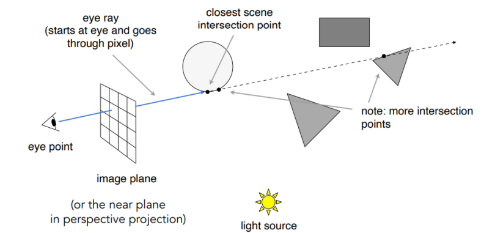

(图来自[2]Wang, Zijin. "The Development of Ray Tracing and Its Future." (2022).)

但是如果如下图场景中有非常多的物体，每个物体都要和每个光线判断是否相交，这个性能上会有很大的问题。因此，我们可以使用**空间加速**结构，例如八叉树，BVH或者k-d树。（后续会更新空间加速章节）

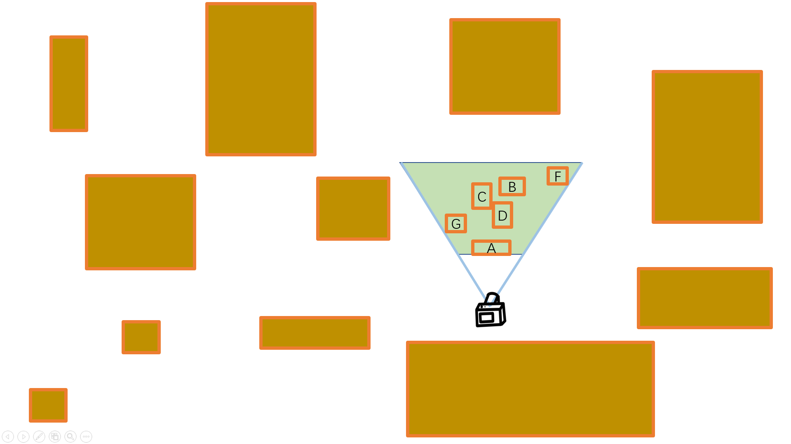

在本节中，我们不会介绍空间加速的更多知识。此时对于相机发出的每根光线，着色函数如下：

```glsl
vec3 color(Ray r)
{
    HitRecord rec;
    vec3 col = vec3(1.0);
    for(int i = 0; i < MAX_BOUNCES; ++i)
    {
        if(hit_world(r, 0.001, 10000.0, rec))
        {
            Ray scatterRay;
            vec3 atten;
            if(scatter(r, rec, atten, scatterRay))
            {
                col *= atten;
                r = scatterRay;
            }
            else
            {
                return vec3(0.0);
            }
        }
        else
        {
            float t = 0.5 * (r.d.y + 1.0);
            col *= mix(vec3(1.0), vec3(0.5, 0.7, 1.0), t);
            return col;
        }
    }
    return col;
}
```

重点是`hit_world`函数，这个函数可以在源代码中找到，负责求解出光线与场景物体最近的交点，以及交点的信息。按照前面的描述，交点信息包含pos，t，normal，material，而material决定了光在和场景物体相交之后的去向，以及衰减多少，这就是`scatter(r, rec, atten, scatterRay)`这个函数告诉我们的事，会在下一部分中进行介绍。


#### 2.3 像素着色

那么接下来我们就知道相交的物体与相交的点，我们应该做些什么，直接计算返回交点的颜色？还是继续反射/折射光线？实际上，这取决于光线相交的物体的材质等各种因素。先来看看在上一节的最后遗留下来的接口：

```glsl
bool scatter(Ray rIn, HitRecord rec, out vec3 atten, out Ray rScattered)
```

接下来要实现这个函数，其中rIn是输入的光线，rec是交点的信息（包含交点的材质），而函数输出的结果则是光衰减的值（毕竟光很可能会被表面吸收一部分，再弹射出来的包含衰减），以及弹射光线的方向。那么，针对不同的材质，我们就要分情况进行讨论。


##### 2.3.2.镜面反射-金属材质
假设相交的物体材质是金属类型的，表面很光滑，那么光线大概率会沿着反射方向反射出去（读者可以回忆前面讲的BlinnPhong模型）。

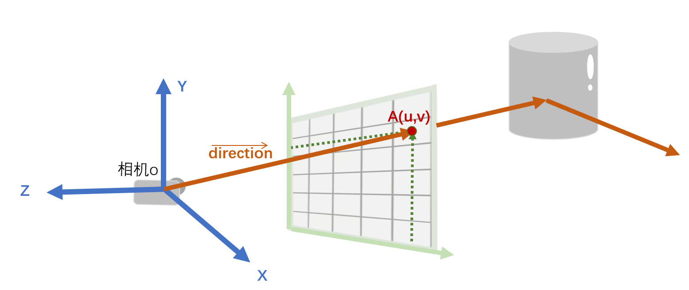


对于光滑的金属材质来说, 光线是不会像漫反射那样随机散射的, 而是产生类似镜面反射。我们用向量来具体推导出这种反射方向：


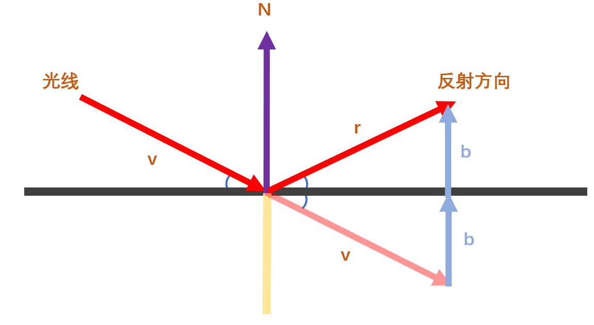

我们想要求出红色的向量（ $\vec{r}$）的公式：

$\vec{r}=\vec{v}+2*\vec{b}$

其中，已知法线方向$\vec{N}$是一个单位向量，所以我们假设向量$\vec{v}$与水平方向的夹角为θ，则$\left|\vec{b}\right |=\left|\vec{v}\right|*sin(\theta)=-\left|\vec{v}\right|*cos(90°+\theta)$

所以$\left|\vec{b}\right |=-\vec{v}·\vec{N}$（这是因为点乘的定义，读者可以回忆点乘与$\cos$之间的关系，$||\vec{N}||=1$）,又因为向量$\vec{b}$ 的方向与$\vec{N}$保持一致，所以$\vec{b}=(-\vec{v}·\vec{N})*\vec{N}$

可以推导出：

$\vec{r}=\vec{v}+2*\vec{b}=\vec{v}-2*(\vec{v}·\vec{N})*\vec{N}$

代码如下：

```GLSL
//镜面反射
vec3 m_reflect(vec3 v, vec3 n)
{
    return v - 2.0 * dot(v, n) * n;
}
```

实际上shadertoy中也自带reflect函数，我们使用shadertoy中的reflect函数也一样。

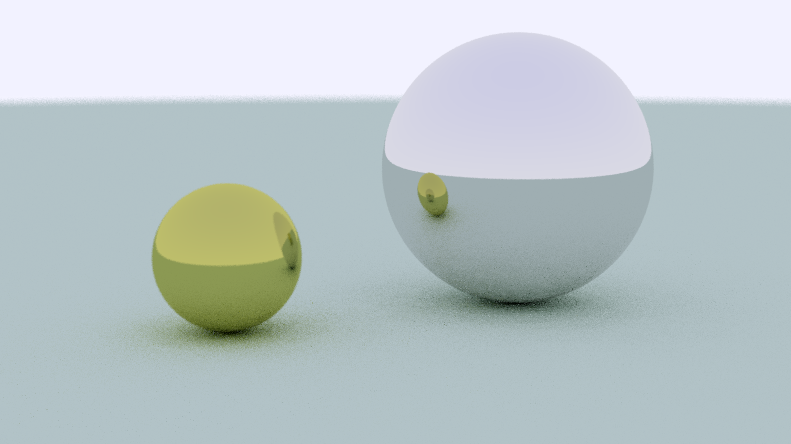

###### fuzzy效果(磨砂效果)

在现实中,有很多金属并不是完美的镜面反射,而是磨砂材质的,如下图: 

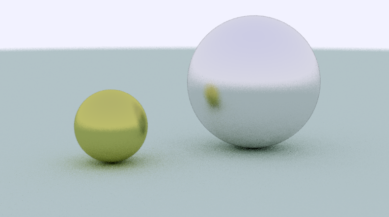

为了完成这种需求，我们可以给镜面反射反射出去的方向**加入一点点随机性, 只要在算出反射向量后**, 在其终点为球心的球内随机选取一个点作为最终的终点，如下图所示：


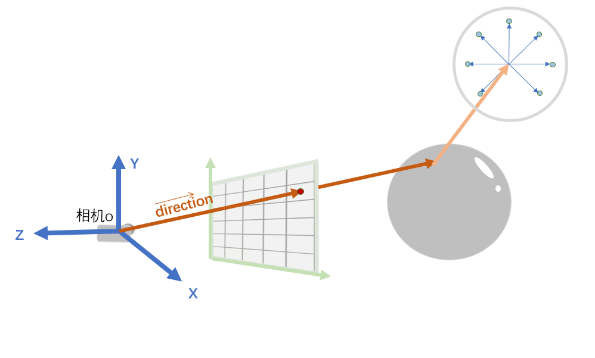

就好像我们在镜面反射方向上加了一些偏移（如下图），这样就能更好地实现磨砂的效果：

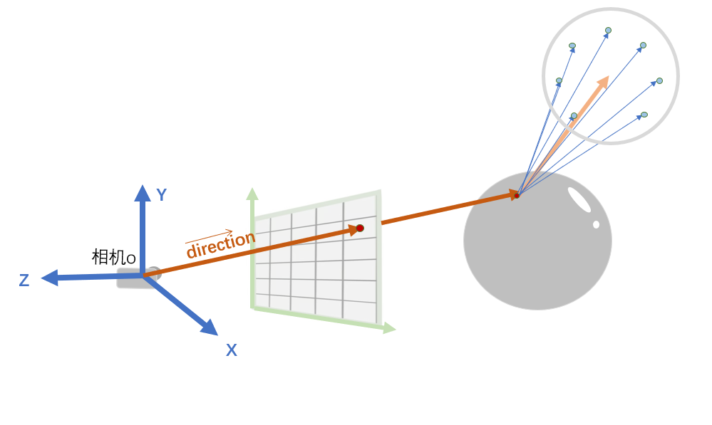


当然上图这个灰色空心的球越大, 金属看上去就更加模糊(fuzzy, 或者说粗糙)。所以我们这里引入一个变量来表示模糊的程度(fuzziness)(所以当fuzz=0时不会产生模糊)。如果fuzz, 也就是随机球的半径很大, 光线可能会散射到物体内部去。这时候我们可以认为物体吸收了光线。

这部分的代码如下：

```GLSL
if(rec.material.type == MT_METAL)
{
    vec3 refl = reflect(rIn.d, rec.normal);
    rScattered = createRay(rec.pos, normalize(refl + rec.material.roughness * randomInUnitSphere(gSeed)), rIn.t); //rIn.t就是击中点的t值，这个t值其实不重要（也不是必要传入的值），因为每轮弹射的光我们都会设置tmin=0.001，tmax=10000这种较大的值
    atten = rec.material.albedo;
    return dot(rScattered.d, rec.normal) > 0.0; //如果反射光线与法线不呈现锐角，则返回false，不再弹射（打到球体里面去了）
}
```

> 对attenuation的补充说明：之前我们提到过光追的时候每次打到某个物体光线就会被弹射出来（当然也很可能会被吸收一部分），因此针对下次弹射出来的光的”颜色“需要乘一个衰减系数。**那么如何计算这个衰减系数呢？**
>
> 实际上，**这个衰减系数就是物体表面的albedo属性**，这里也是归于物理学上的定律，即我们之所以看到某个表面呈现A颜色，是因为A颜色的光打到了我们的眼睛。因此假设初始光是”白色“(1.0,1.0,1.0)，打到了一个红色的表面，这意味着反射出来的光应该是红色（1.0，0.0，0.0）。假设反射出来的光到进入人眼前没有再打到其他物体了，那么进入人眼（即相机）的就是红光。此时可以发现就好像attenuation就是(1.0，0.0，0.0)，即红色，这也就是上面代码中attenuation项如此计算的原因。对于多次弹射的情况也可以类比推理成立。
>
> **注意，由于我们还没有讲到辐射度量学，因此上面的说法是不够严谨的，但可以让读者更容易理解。**


##### 2.3.3 漫反射材质

如果是漫反射材质，比如很多绝缘体（塑料，橡皮,  木头桌子）等等粗糙材质，光线打到表面后，反射光线会向四面八方发射，而不是集中反射到某个区域被我们捕捉到。

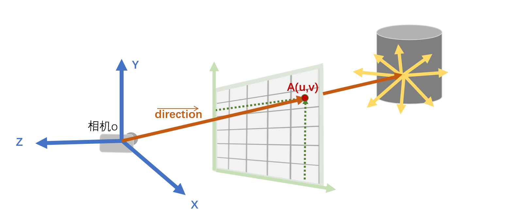

>回忆与对比Phong模型或者Blinn-Phong模型中的漫反射处理：
>
>在之前的"基础光照"章节中,我们使用Phong模型或者Blinn-Phong模型来模拟漫反射,我们复习一下其公式$L_d = k_d(I/r^2)max(0, \vec{n} · \vec{l})$,其中$\vec{l}$为指向光源的方向.实际上,这模拟的是如果光“直接照射”到的表面会更亮一些，而非直接照射的区域会更暗，背光侧最暗。
>
>在真实情况或光线追踪中:
>
>从光源角度出发, 光线并不容易到达某物体的背光面, 更容易到达表面"直接面向"光源的地方; 
>
>从像素出发, 如从上图交点处的"逆"光线往四面八方发射出去, "直接面向"光源的地方其反射的光线会更多的到达光源, 最终呈现在像素上的颜色会更亮. 而背光面的地方, 往四面八方发射出去光线, 也可能到达不了光源. 
>
>因此, Phong模型或者Blinn-Phong模型中的漫反射处理实际上是对真实的漫反射的一种模拟, 在光追中, 我们可以更真实地实现它.

​	我们可以采用在与漫反射材质的交点处,发射非常多的光线并追踪光线; 当然发射的光线越多, 计算量越大, 速度也就越慢.  如果想要加快速度, 我们也可以牺牲一定的质量做简化, 例如随机采样一个或者几个方向作为反射方向。**在本篇的光线追踪教程中，我们每次只会打出一根光线做追踪。**

​	如何随机采样呢?实际上, 这也是有说法的, 我们应该选择在**单位球面**选取一个随机点, 长度固定为单位向量长度, 来作为随机发射的方向。

​	要得到这个反射想象，我们可以从交点出发，向法线方向走单位距离，然后随机取一个单位长度的方向，到达目标点，类似于：


然后交点向目标点连线，得到的这个方向就是我们要进行反射的方向。

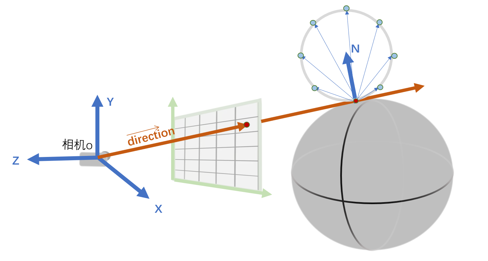

代码如下：

```GLSL
if(rec.material.type == MT_DIFFUSE)
{
    vec3 target = rec.pos + rec.normal + randomInUnitSphere(gSeed);
    rScattered = createRay(rec.pos, normalize(target - rec.pos), rIn.t);
    atten = rec.material.albedo;
    return true;
}
```

效果如下：

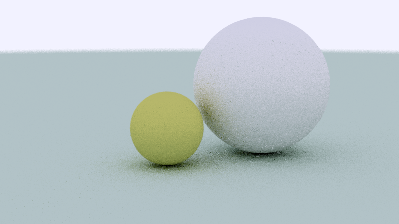

##### 2.3.4 折射

如果材质是类似玻璃,钻石和水等会发生折射的材质，那么光线不仅会发生反射，还会发生折射。

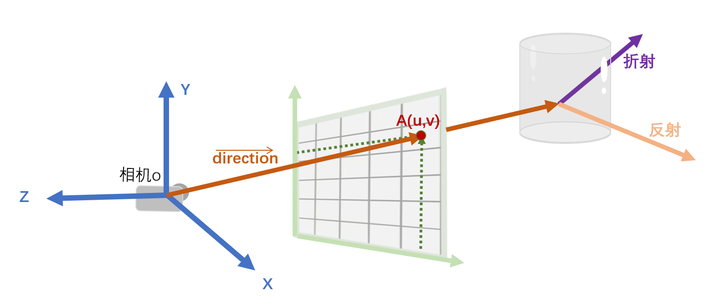

​	还记得透明物体的章节我们提到过折射吗,此时我们再复习一下:从光学原理来看，光线入射到半透明物体的表面，一部分光线被反射出去，一部分光线被折射进入表面。光线在不同介质中的传播速度不同，回顾一下初中物理，我们将介质的折射率$\eta_i$定义为$\frac{c}{v}$，其中$c$是真空中光速，$v$是介质中的光速。

​	如下图所示，入射角与折射角之间的关系由Snell定律给出：
$$
\frac{\sin\theta_r}{\sin\theta_i}=\frac{\eta_1}{\eta_2}
$$

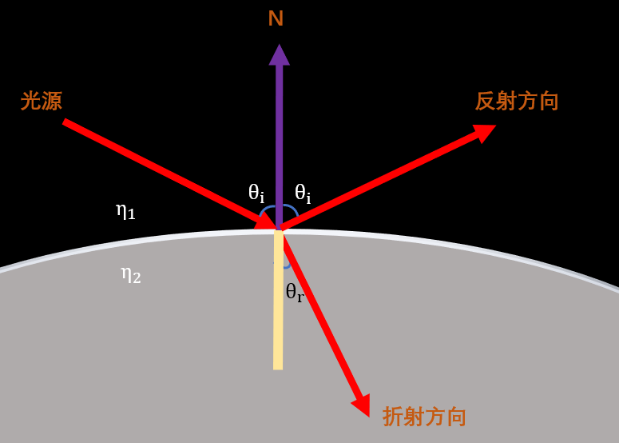

​	其中，$\theta_i$是入射角，$\theta_r$是折射角，$\eta_1$是入射介质的折射率，$\eta_2$是折射介质的折射率。

​	透明物体的章节中我们没有考虑折射,而是直接假设所有介质的折射率都是一样的，这样折射角总是与入射角相等。对于很薄的表面来说，效果其实是可以接受的.但我们既然实现了光线追踪,就可以做更真实的效果.

​      我们在前面的镜面反射部分已经求得反射方向,我们现在的目的是求出折射方向,推导过程如下：

(参考[3]De Greve, Bram. "Reflections and refractions in ray tracing." *Retrived Oct* 16 (2006): 2014.及https://www.zhihu.com/people/cjt-83-73/posts ):

(假定以下**向量都归一化**,且以下向量省略上标箭头)

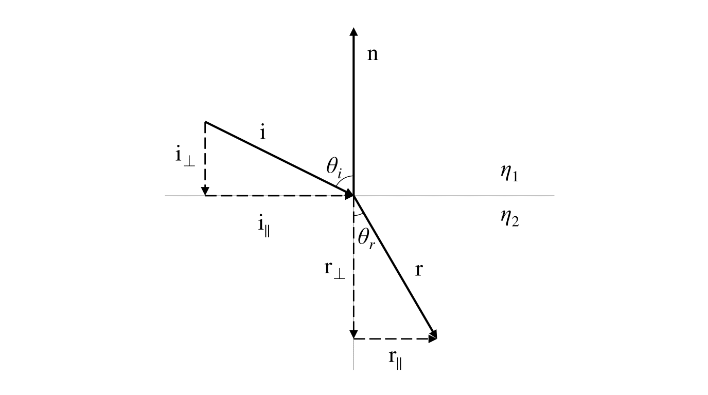

根据[斯涅尔定律](https://link.zhihu.com/?target=https%3A//zh.wikipedia.org/zh/%E6%96%AF%E6%B6%85%E5%B0%94%E5%AE%9A%E5%BE%8B)（Snell's law），介质折射率和正弦的乘积一定相等。
$$
\frac{\sin\theta_r}{\sin\theta_i}=\frac{\eta_1}{\eta_2}
$$

因$r_{\parallel}$和$i_{\parallel}$平行且指向相同方向

$$
r_{\parallel}=
\frac{|r_{\parallel}|}{|i_{\parallel}|}i_{\parallel}=
\frac{sin\theta_{r}}{sin\theta_{i}}i_{\parallel}=
\frac{\eta_{1}}{\eta_{2}}i_{\parallel}=
\frac{\eta_{1}}{\eta_{2}}(cos\theta_{i}n \cdot |i|+i) 
\stackrel{|i|=1}{=} \frac{\eta_{1}}{\eta_{2}}(cos\theta_{i}n+i)
\tag {1}
$$

根据勾股定理

$$
\left|r_\perp\right|=\sqrt{\left|r\right|^2-\left|r_\parallel\right|^2}=\sqrt{1-sin^2\theta_r}
$$

所以

$$
r_\perp=-|r_\perp|n=-\sqrt{1-sin^2\theta_r}n
$$

再根据斯涅尔定律

$$
sin^{2}\theta_{r}=(\frac{\eta_{1}}{\eta_{2}})^{2}sin^{2}\theta_{i}=(\frac{\eta_{1}}{\eta_{2}})^{2}(1-cos^{2}\theta_{i})
$$

代入得

$$
r_\perp=-\sqrt{1-(\frac{\eta_1}{\eta_2})^2(1-cos^2\theta_i)}n
\tag{2}
$$


将式子(1)和式子(2)代入

$$
\begin{aligned}\text{r}&=r_{\parallel}+r_{\perp}\\&=\frac{\eta_{1}}{\eta_{2}}(i+cos\theta_{i}n)-\sqrt{1-(\frac{\eta_{1}}{\eta_{2}})^{2}(1-cos^{2}\theta_{i})}n\\&=\frac{\eta_{1}}{\eta_{2}}i+(\frac{\eta_{1}}{\eta_{2}}cos\theta_{i}-\sqrt{1-(\frac{\eta_{1}}{\eta_{2}})^{2}(1-cos^{2}\theta_{i})})n\end{aligned}
$$

最后因为

$$cos\theta_i=-i\cdot n$$

得到

$$
r=\frac{\eta_1}{\eta_2}i-(\frac{\eta_1}{\eta_2}(i\cdot n)+\sqrt{1-(\frac{\eta_1}{\eta_2})^2(1-(i\cdot n)^2)})n
$$

**需要注意的是，上述式子在根号内的值大于等于0时才成立。**

当$\eta_1\leq\eta_2$ 时，根号内始终大于等于0。

当$\eta_1>\eta_2$ 时，则在特定入射角度(超过临界角)会发生全内反射的现象。此时折射分量为0.

$$
r=\begin{cases}\:\frac{\eta_1}{\eta_2}i-(\frac{\eta_1}{\eta_2}(i\cdot n)+\sqrt{1-(\frac{\eta_1}{\eta_2})^2(1-(i\cdot n)^2)})n&\text{if}\:1-(\frac{\eta_1}{\eta_2})^2(1-(i\cdot n)^2)\geq0\\\:0&\text{if}\:1-(\frac{\eta_1}{\eta_2})^2(1-(i\cdot n)^2)<0\end{cases}
$$

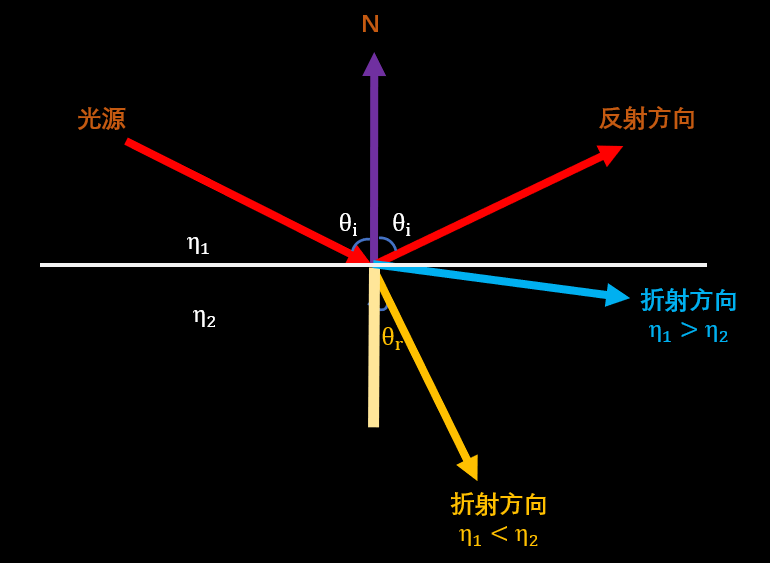

由此,我们就可以求出不出现全反射情况下的折射方向$r$。

但是，如图上蓝色线所示，当$\eta_1>\eta_2$ 时，在特定入射角度(超过临界角)会发生全内反射的现象。此时折射分量为0，那么我们也需要表现出这个全反射的情况。


###### 全反射情况

注意到如果$\frac{\eta_1}{\eta_2}$比较大的话，那么$sinθ_r=sin\theta_i\frac{\eta_1}{\eta_2}$有可能会出现大于1的情况（当光线从高折射律介质射入低折射率介质时, 比如从钻石类的材质射入到空气中，此时上述的Snell方程可能没有实解（因为看前面推导的公式里根号下面可能出现<0的情况）），此时就无法求解出正确的折射光线了。通过上面的公式发现本质上无解的情况应该是$sin\theta_r>1$，也就是$sin\theta_i\frac{\eta_1}{\eta_2}>1$

**解决方案：当求解出光线无法完成折射的任务时，使其反射**

**什么情况下光线会从高折射律介质射入低折射率介质？**

常常在实心物体的内部发生, 所以我们称这种情况被称为"全内反射"。比如在潜水的时候, 你发现水与空气的交界处看上去像一面镜子的原因。

可以用三角函数解出$\sin\theta$

$$
\sin \theta=\sqrt{1-\cos ^{2} \theta}
$$
其中的$cos\theta$为$$cos\theta=dot(-i,n)$$,其中i是入射光线，n是法线。

> 下图就是一个全内反射的例子（图源：维基百科）：
>
> 


##### Schlick近似方法

现实世界中的玻璃, **发生反射的概率会随着入射角而改变**——从一个很狭窄的角度去看玻璃窗（也就是说你的视线方向几乎垂直于玻璃窗的法线方向）, 它会变成一面镜子。如果要完全精确地描述这件事公式是十分痛苦的（参考学习链接：https://zhuanlan.zhihu.com/p/372110183），不过有一个数学上近似的等式, 它是由Christophe Schlick提出的。Schlick 反射率函数如下：
$$
F_{\text {Schlick }}\left(n, v, F_{0}\right)=F_{0}+\left(1-F_{0}\right)(1-(n \cdot v))^{5}
$$
其中的F0与介质的折射率有关，公式计算如下：
$$
F_{0}=\left(\frac{\eta_{1}-\eta_{2}}{\eta_{1}+\eta_{2}}\right)^{2}=\left(\frac{\eta-1}{\eta+1}\right)^{2}
$$
下面展示了用使用schlick近似方法+前面推导的折射方向来实现折射：

```GLSL
if(rec.material.type == MT_DIALECTRIC)
{
    atten = vec3(1.0);
    vec3 outwardNormal;
    float niOverNt;
    float cosine;
    if(dot(rIn.d, rec.normal) > 0.0)  //说明光线从内部打出去
    {
        outwardNormal = -rec.normal;
        niOverNt = rec.material.refId
            x; //默认空气的折射率为1
        cosine = dot(rIn.d, rec.normal) / length(rIn.d); 
        cosine = sqrt(1.0f - rec.material.refIdx * rec.material.refIdx * (1.0f - cosine * cosine));  // 计算折射角度
    }
    else
    {
        outwardNormal = rec.normal;
        niOverNt = 1.0 / rec.material.refIdx;
        cosine = -dot(rIn.d, rec.normal) / length(rIn.d); 
    }
    vec3 refracted;
    float reflectProb;
    if(customRefract(rIn.d, outwardNormal, niOverNt, refracted)) //这个函数可以对一下源码中的实现，和前面的推导保持一致
    {
        reflectProb = schlick(cosine, rec.material.refIdx);
    }
    else
    {
        reflectProb = 1.0;
    }

    if(hash1(gSeed) < reflectProb) //走反射逻辑
    {
        vec3 reflected = reflect(rIn.d, rec.normal);
        rScattered = createRay(rec.pos, normalize(reflected), rIn.t);
    }
    else  //走折射逻辑
    {
        rScattered = createRay(rec.pos, normalize(refracted), rIn.t);
    }

    return true;
}
```

一眼看去，似乎代码比较复杂，且考虑了两种情况，这是为什么呢？现在我们就来具体解释一下上述代码的一些细节：

> 【1】先看下面这段代码：
> ```glsl
> if(dot(rIn.d, rec.normal) > 0.0)  //说明光线从内部打出去
> {
>        outwardNormal = -rec.normal;
>        niOverNt = rec.material.refIdx; //默认空气的折射率为1
>     cosine = dot(rIn.d, rec.normal) / length(rIn.d); 
>        cosine = sqrt(1.0f - rec.material.refIdx * rec.material.refIdx * (1.0f - cosine * cosine));  // 计算折射角度
>    }
> else
> {
>     	outwardNormal = rec.normal;
>        niOverNt = 1.0 / rec.material.refIdx;
>        cosine = -dot(rIn.d, rec.normal) / length(rIn.d); 
>    }
> ```
> 
>`niOverNt`对应的就是上面推导部分的$\frac{\eta_{1}}{\eta_{2}}$，不过有一边默认是空气作为介质，对应的$\eta=1$，所以如果是光线从外部入射，`niOverNt`就是正常的$1/\eta$，否则如果是从内部射出去的话，则`niOverNt`应该是$\eta$。`outwardNormal`这个变量也比较好理解，记录和光线相交的交点的法线方向。接下来就是`cosine`这个变量的说明。
> 
>在Schlick近似方法中，公式如下：
> $$
> F_{\text {Schlick }}\left(n, v, F_{0}\right)=F_{0}+\left(1-F_{0}\right)(1-(n \cdot v))^{5}
> $$
> 这里的Schlick公式对应的代码为：
> 
>```glsl
> float schlick(float cosine, float refIdx)
> {
>     float r0 = (1.0 - refIdx) / (1.0 + refIdx);
>        r0 = r0 * r0;
>     return r0 + (1.0 - r0) * pow((1.0 - cosine), 5.0);
>    }
>    ```
> 
>    也就是在这个函数中，我们依然固定空气的折射率为1.0，并且采用如下计算$F_0$的式子：
>    $$
> F_{0}=\left(\frac{\eta_{1}-\eta_{2}}{\eta_{1}+\eta_{2}}\right)^{2}
> $$
>根据上文，本段最开始的`cosine`变量就应该指的是传入Schlick函数的`cosine`值，也即$n · v$的值。对于从外部射入而言比较好理解，符合我们的认知。但如果是从内部出射到外部呢？（此时$\eta_1>\eta_2$）
> 
> A：此时如果还是计算原来的`cosine`值是不准确的，在这种情况下后面要计算Schlick的cos值就变成**折射光的方向和法线方向的夹角**（这里也用到了光路可逆的特性），也就是前面图当中的$\theta_r$，根据前文推导的公式可以表示为：
> $$
> sin^{2}\theta_{r}=(\frac{\eta_{1}}{\eta_{2}})^{2}sin^{2}\theta_{i}=(\frac{\eta_{1}}{\eta_{2}})^{2}(1-cos^{2}\theta_{i}) \\
> cos\theta_{r} = \sqrt{1 - sin^{2}\theta_{r}}
>$$
> 现在读者应该能够理解为何上述代码要分两种情况讨论了（从介质内打到空气中，以及从空气打到介质内），并且为了满足后面的Schlick的计算，$\cos{\theta}$值也要分情况进行讨论。（可以参考这篇：https://zhuanlan.zhihu.com/p/303168568 简单来说就是对于Schlick项而言，$\eta_1>\eta_2$以及$\eta_1<\eta_2$需要分两种情况讨论，所以计算出来的$\cos\theta$也是不同的）
> 
> **需要记住的是，Schlick公式计算的是反射率（有多少光线反射？有多少光线折射？），而折射光的方向则是由上面的复杂推导公式所决定的。**

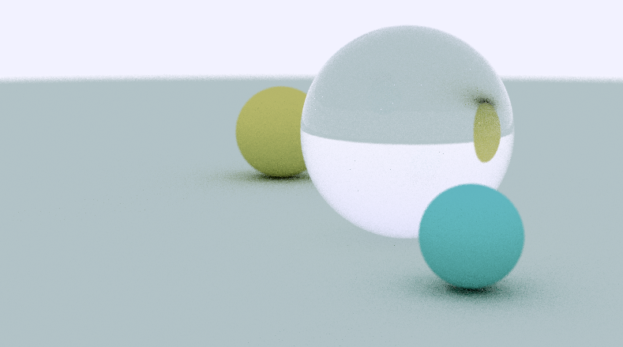

也许大家会觉得奇怪，但是如果现实中的玻璃珠的全反射实际上也是这个效果


​		图片来自https://pixabay.com/zh/photos/glass-sphere-glass-bullet-round-1547291/


##### 2.3.5 阴影

如果我们此时往光源（暂定一个光源）去发射一根射线，我们可以知道在这个交点往光源的方向是否会被遮挡，如果被遮挡，那么这点就在阴影中。因此这条射线也被称为shadow ray。

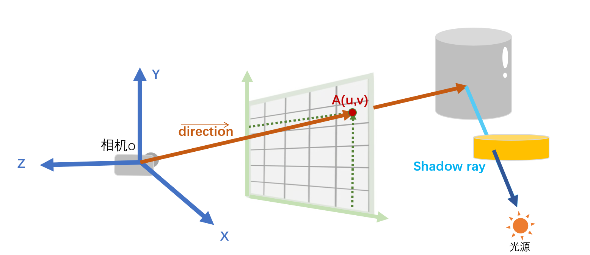

​															被遮挡，交点处是阴影

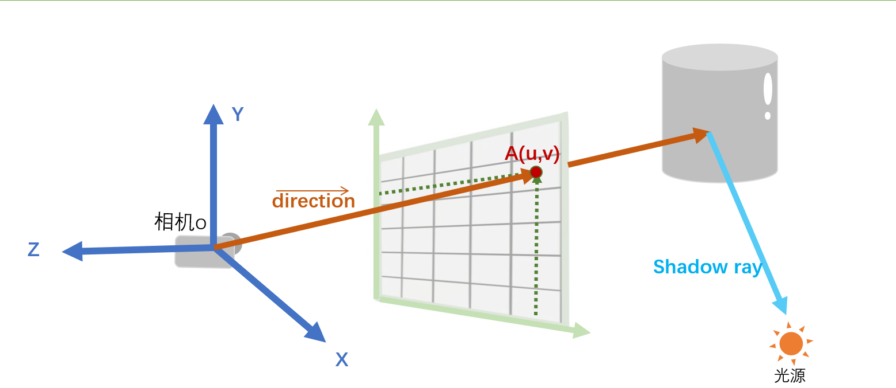

​																未被遮挡


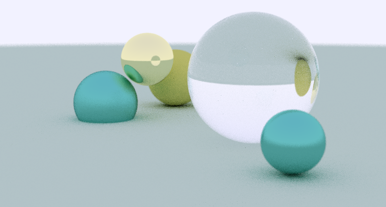

但是实际上，在这个光追项目中，我们并不需要额外处理阴影部分，因为对于阴影部分来说，其很有可能会在物体和地面之间来回弹射多次，最终打到max_bounce的次数，并且由于每次都有一个衰减值attenuation，因此最终阴影越重的地方结果会越黑。


#### 2.4 整体光线追踪的细节补充

在前面的部分中我们介绍了光线打到不同材质物体上之后的反射/折射效果，这里我们复习一下整体的过程。在这部分中，我们会对上述没有说明完全的地方进行补充说明。在本节教程的同级目录下有两个可执行的shadertoy文件，可以直接复制进shadertoy里面看效果，注释非常详细（本文里面的代码对应路径下的Final文件夹，另一个源码也可以执行，读者可以对比学习）。

对于shadertoy而言，其main函数如下：
```glsl
void mainImage(out vec4 fragColor, in vec2 fragCoord)
{
    gSeed = float(baseHash(floatBitsToUint(gl_FragCoord.xy))) / float(0xffffffffU); //随机一个seed，暂不需关心细节
    vec2 mouse = iMouse.xy / iResolution.xy;
    mouse.x = mouse.x * 2.0 - 1.0;

    vec3 camPos = vec3(mouse.x * 10.0, mouse.y * 5.0, 8.0);
    vec3 camTarget = vec3(0.0, 0.0, -1.0);
    float fovy = 20.0;
    float aperture = 0.0;
    float distToFocus = length(camTarget - camPos);
    float time0 = 0.0;
    float time1 = 0.0; //暂时先设定time1=time0=0.0
    Camera cam = createCamera(
        camPos,
        camTarget,
        vec3(0.0, 1.0, 0.0),    // world up vector
        fovy,
        iResolution.x / iResolution.y,
        aperture,
        distToFocus,
        time0,
        time1);
    vec2 uv = (gl_FragCoord.xy + hash2(gSeed)) / iResolution.xy; //在当前像素的基础上随机加一点扰动
    vec3 col = color(getRay(cam, uv));
    fragColor = vec4(col, 1.0);
}
```

其中color函数计算出的就是打出的光线着色的颜色，getRay函数用于生成一条对应origin和direction的光线，即2.1节所讲述的部分。而color函数再复习一下：

```glsl
vec3 color(Ray r)
{
    HitRecord rec;
    vec3 col = vec3(1.0);
    for(int i = 0; i < MAX_BOUNCES; ++i)
    {
        if(hit_world(r, 0.001, 10000.0, rec))
        {
            Ray scatterRay;
            vec3 atten;
            if(scatter(r, rec, atten, scatterRay))
            {
                col *= atten;
                r = scatterRay;
            }
            else
            {
                return vec3(0.0);
            }
        }
        else  //只是返回背景色
        {
            float t = 0.5 * (r.d.y + 1.0);
            col *= mix(vec3(1.0), vec3(0.5, 0.7, 1.0), t);
            return col;
        }
    }
    return col;
}
```

根据上面的代码，我们来考虑以下的几种情况（假设光线是从相机出发的，即正常的光线追踪）：

- （1）如果光线什么都没打到，hit_world返回false，则最终颜色就是背景颜色skyColor（可以自行设定，这里是用光线方向的y值做插值，避免单一背景色）；
- （2）如果光线一直都在打到东西，也要看打到的东西的材质：
  - 如果被打中点的材质是漫反射，则scatter函数返回一定是true，此时更新颜色为albedo的颜色（相当于物体表面呈现albedo的颜色是因为其吸收了一部分光，散射出来的光就是albedo的颜色，所以`col*=atten``atten=albedo`）。
  - 如果被打中点的材质是镜面反射或者前面提到的fuzzy材质，那么`scatter=dot(wi.direction, isectInfo.normal) > 0.0f`，这就意味着反射的光线方向与法线夹角不呈现锐角，是不合理的结果，此时停止继续散射；
  - 如果被打中点的材质是走的折射逻辑，参考前文的推导，并且此时的scatter函数返回一定也是true。

- 如果超过了MAX_BOUNCES的迭代次数，可以认为“其所处阴影当中”，返回不断衰减后的最终col值即可（可以想象，如果一束光一直在不断弹射“出不去”，就好像“被卡死在角落里了”，可以视为阴影）。


##### 2.4.1 单位圆盘内随机生成一点

这个函数为`random_in_unit_disk()`。其实可以有很多种写法。比如说：

##### （1）算法1

```glsl
// 生成单位圆盘内的随机点（用于景深相机效果）
vec3 random_in_unit_disk()
{
    float spx = 2.0 * rand2D() - 1.0;  // 随机 x 坐标
    float spy = 2.0 * rand2D() - 1.0;  // 随机 y 坐标

    float r, phi;

    // 确定 r 和 phi 的值来保证生成的点在单位圆盘内
    if (spx > -spy)
    {
        if (spx > spy)
        {
            r = spx;
            phi = spy / spx;
        }
        else
        {
            r = spy;
            phi = 2.0 - spx / spy;
        }
    }
    else
    {
        if (spx < spy)
        {
            r = -spx;
            phi = 4.0f + spy / spx;
        }
        else
        {
            r = -spy;
            if (spy != 0.0)
                phi = 6.0 - spx / spy;
            else
                phi = 0.0;
        }
    }

    phi *= PI / 4.0;  // 转换为弧度

    return vec3(r * cos(phi), r * sin(phi), 0.0f);  // 返回随机点
}
```

这个算法乍一看可能会比较迷惑，以下是对其的解读：

- （1）随机x坐标和y坐标，范围是[-1，1]：

```glsl
float spx = 2.0 * rand2D() - 1.0;  // 随机 x 坐标
float spy = 2.0 * rand2D() - 1.0;  // 随机 y 坐标
```

- （2）接下来，通过条件语句决定如何计算 `r`（距离原点的距离）和 `phi`（相对于 x 轴的角度）的值。这一部分是为了确保所生成的点位于单位圆盘内。

  - 通过比较 `spx` 和 `spy` 的大小关系，将整个平面分成八个象限，并在每个象限中使用不同的方式来计算 `r` 和 `phi`。

  具体地，看下面这张图：

  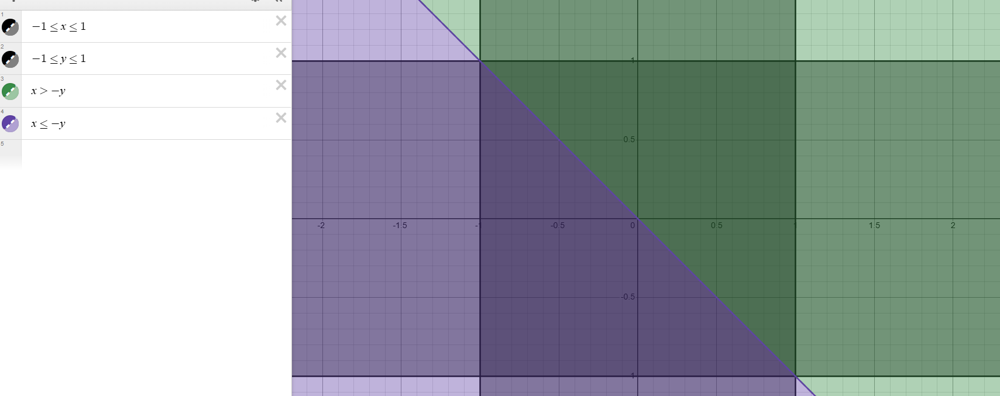

  绿色的部分对应代码中的`spx > -spy`，紫色的部分则对应代码中的`else`情况，也就是`spx <= -spy`。此时如果还满足`spx>spy`，则是下面红框两部分三角形对应的情况：

  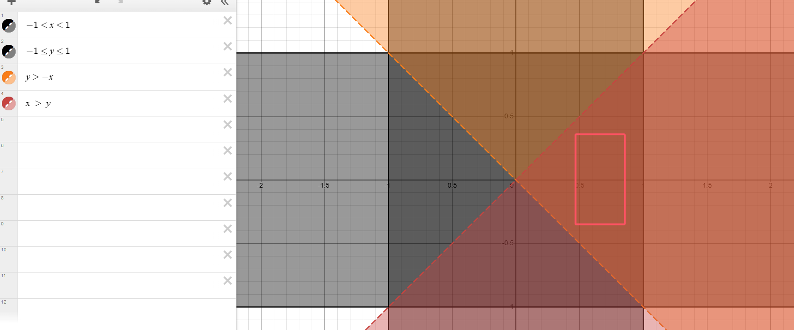

  - 此时`r = spx`一定>0，`phi` 是通过将 `spy` 和 `spx` 的比率转换为角度，以便确定点在极坐标系中的位置。其他象限的情况也是一样的，读者可以在desmos当中尝试一下。

我们用python实现一下上面这个随机采样的算法，绘制10000个点，看看具体的分布：

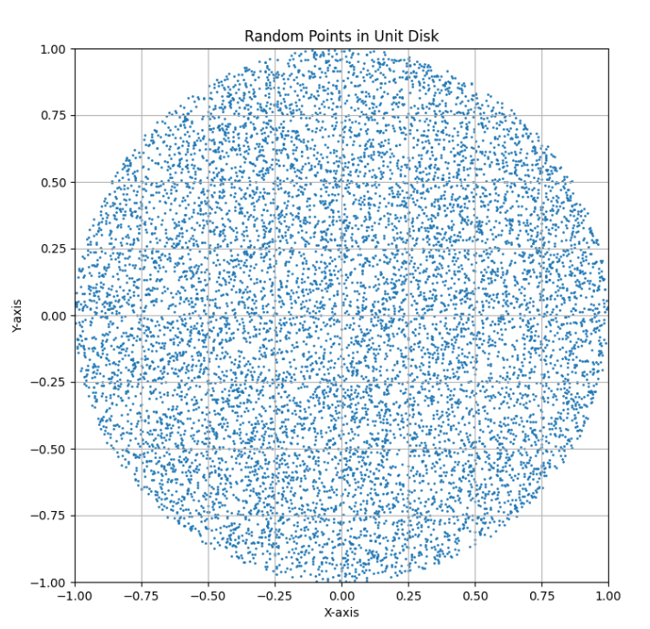

可以看到，随机的效果还是不错的。

##### （2）算法2

**当然，这个算法看着比较难以理解（如果不理解的话用接下来的拒绝法也可以），使用拒绝法也是可以的**（这种算法比较好理解），该算法的版本如下：

```c++
// 生成单位圆盘内的随机点（用于景深相机效果）
vec3 random_in_unit_disk()
{
    for(int i=0;i<10000;i++) //拒绝法，设置最大的迭代次数，防止死循环
    {
		vec3 p = vec3(2.0 * rand2D() - 1.0, 2.0 * rand2D() - 1.0, 0.0); //rand2D返回值是[0，1)
		if (sqrt(length(p)) >= 1.0f) continue; //如果距离圆心的距离>1，说明不在圆内，重新生成
		return p;
	}
}
```

同样在python当中，可视化一下拒绝法的效果，同样绘制10000个点，看看效果：

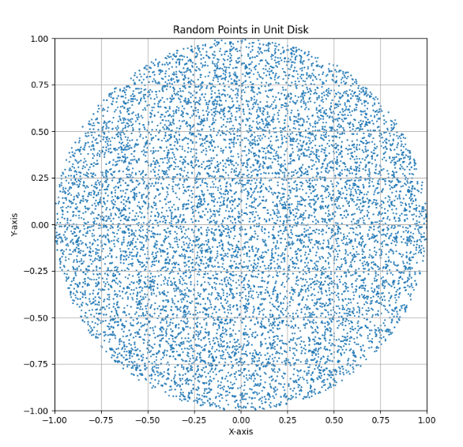

可以看到，效果还是不错的。

> 实际测试下来，拒绝法速度比较慢，而且由于会不断地“拒绝”计算出来的结果，导致计算量也会比较大。


##### （3）算法3

利用圆的参数方程公式，随机生成$r$和$\phi$两个值，这里就不过多介绍了，实际测试也是可用的算法。

```glsl
vec2 randomInUnitDisk(inout float seed)
{
    vec2 h = hash2(seed) * vec2(1.0, 6.28318530718);
    float phi = h.y;
    float r = sqrt(h.x);
	return r * vec2(sin(phi), cos(phi));
}
```


#### 2.4.2 反走样

如果我们一个像素只打出一根光线，会得到下面的结果：

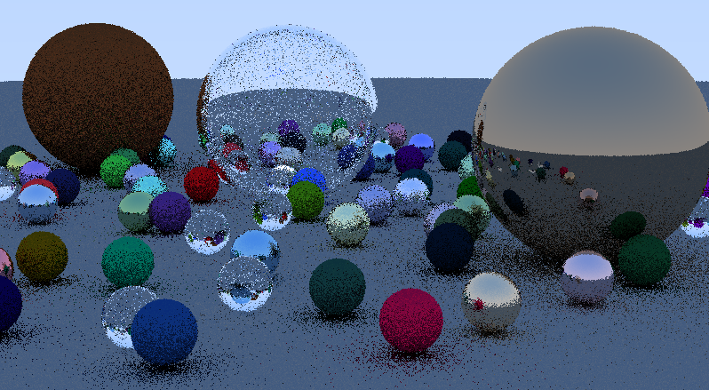

可以看到，噪点非常多。这一点也很容易解释，因为现实中的光线追踪不可能每次与物体相交后只反射出来一根光线。例如漫反射的材质，其应该是向四面八方打出若干条弹射光线。但由于算力的限制，并且我们不希望光线数呈指数级暴增，因此每次只会弹射出一根光线。显然这个结果并不精确。一共解决思路是参考光栅化反走样中的SSAA技术，每个像素点打出若干条射线，对结果求平均，main函数代码修改如下：

```glsl
vec3 sum_col = vec3(0.0);
for(int i=0;i<sample_cnt;i++)
{
    vec2 uv = (gl_FragCoord.xy + hash2(gSeed)) / iResolution.xy; //在当前像素的基础上随机加一点扰动
    vec3 col = color(getRay(cam, uv));
    sum_col += col;
}
sum_col /= float(sample_cnt);
fragColor = vec4(sum_col, 1.0);
```

渲染结果如下（此时sample_cnt=50）：

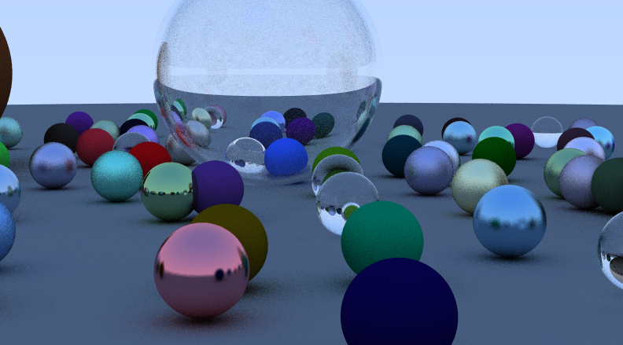

此时结果还不错，但仍旧有很多噪点，并且画面看起来很暗。针对画面偏暗的问题我们会在下一节解决，这里先解决噪点。如果采样数更大效果会更好，但如果我们要做到实时这个额外的开销是难以接受的（想象一下，每帧每个像素都要额外打出x条射线，这个计算量多么可怕）。因此我们可以引入在时间上降噪的方法。


##### 时间上的反走样

这种思想在工业界有着非常广泛的应用，比如大名鼎鼎的TAA反走样算法就用了这个思想。在刚才的算法中，我们的sample_cnt遍布在空间上（每个像素打出sample_cnt根射线），那如果把多次采样放在时间上，能否起到反走样的效果呢？我们来试一试。

首先，为gSeed添加一个iTime，使得每一帧的seed都有所不同：

```glsl
gSeed = float(baseHash(floatBitsToUint(gl_FragCoord.xy))) / float(0xffffffffU) + iTime;
```

此时运行shadertoy程序，会发现依然有噪点，只不过每帧的噪点都不一样。接下来要开始实现时间上的反走样算法，这个算法的步骤如下。

**首先，在Shadertoy中绑定buffer和channel**：

我们把刚才的所有代码复制出来，放到shadertoy的某个buffer中。示意过程如下：

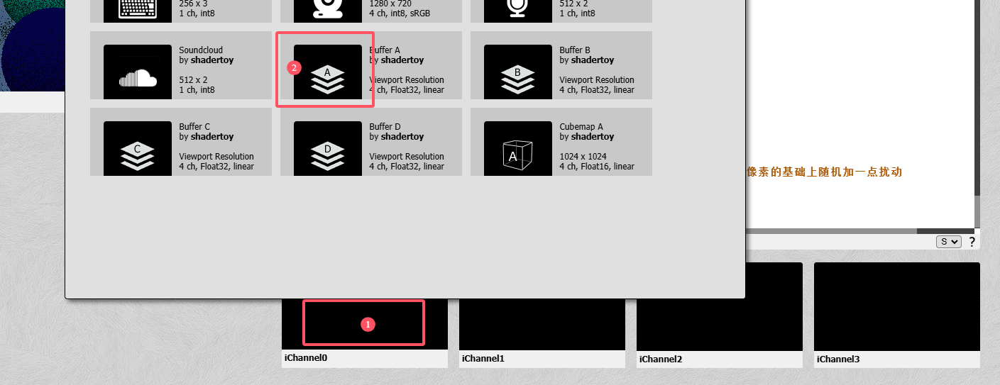

这就意味着此时iChannel0中将会对应到Buffer A的内容。接着我们新建一个bufferA：

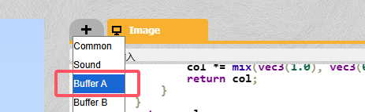

然后把刚才所有的shadertoy代码复制进去，接着将原来的Image通道（见上图）改为如下的代码：

```glsl
void mainImage(out vec4 fragColor, in vec2 fragCoord)
{
    fragColor = vec4(texelFetch(iChannel0, ivec2(fragCoord), 0).xyz,1.0);
}
```

很容易理解，这里就是从iChannel0中采样结果。也就是说整个光追的着色结果会被放入到bufferA中，也就是iChannel0中，而最终渲染的时候从bufferA中采样结果，作为最终的渲染结果。那这样做有什么意义呢？

别急，我们先再创建一个bufferB，配置其iChannel0为BufferB本身，在里面写入下面的代码：

```glsl
void mainImage( out vec4 fragColor, in vec2 fragCoord )
{
    vec4 prev = texelFetch(iChannel0, ivec2(fragCoord), 0);
    fragColor = vec4(iMouse.xy, prev.xy);
}
```

> 以上代码的含义是，prev存储了上一帧中BufferB的值，而fragColor则存储了当前帧中的BufferB的值。此时我们就有了前一帧和当前帧的信息，读者可以仔细思考这个过程。


**接着，每次将采样结果和历史结果做混合**

直接看代码，以下代码是写在Buffer A当中的：

```glsl
vec2 uv = gl_FragCoord.xy / iResolution.xy;
vec4 prev = texture(iChannel0, uv);
prev.xyz *= prev.w;

uv = (gl_FragCoord.xy + hash2(gSeed)) / iResolution.xy; //在当前像素的基础上随机加一点扰动

vec3 col = color(getRay(cam, uv));
vec4 mousedata = texelFetch(iChannel1, ivec2(fragCoord), 0);
if(mousedata.x - mousedata.z != 0.0 || mousedata.y - mousedata.w != 0.0)
{
    fragColor = vec4(col, 1.0);
    return;
}
if(prev.w > MAX_SAMPLES)
{
    fragColor = prev;
    return;
}
col += prev.xyz;
float w = prev.w + 1.0;
col /= w;
fragColor = vec4(col, w);
```

乍一看可能摸不着头脑，这里来解读一下：

- 首先，`vec4 prev = texture(iChannel0, uv);`是拿出上一帧中iChannel0中的信息，我们可以理解为上一帧渲染的结果；

- `prev.xyz *= prev.w`;注意`prev`是一个buffer中存放的结果，其不会直接作为最后的渲染结果，因此我们可以存放一些值进去。这里要结合后面来看，总之我们把`prev`的xyz分量分别乘了其w项；

- ```glsl
  uv = (gl_FragCoord.xy + hash2(gSeed)) / iResolution.xy; //在当前像素的基础上随机加一点扰动
  vec3 col = color(getRay(cam, uv));
  ```

  这段代码是对当前uv做一点扰动，然后渲染得到新的颜色值（很可能和buffer中上一帧的值不同）。

- ```glsl
  col += prev.xyz;
  float w = prev.w + 1.0;
  col /= w;
  fragColor = vec4(col, w);
  ```

  先忽略掉上面的两个if判断语句，这几行代码做的事情是将当前帧的渲染结果和历史结果相加，然后再求平均。这样的话历史的渲染结果就会对当前帧的结果起到指导作用，相当于增加采样数（从时间域上来看）。

- 对于两个if语句：

  - 第一个if是判断如果鼠标发生了移动（意味着旋转了镜头），则重置w的值为1.0，相当于需要重新计算；
  - 第二个if是当prev.w大于最大采样数时，结果就保持稳定即可，不需要再更新fragColor了。

如果读者不好理解的话，反复阅读上面的文字和对应的代码，希望能够理解时间采样的重要思想，这对于后面的图形学学习有着非常重要的作用。

再次运行代码，结果好了很多！

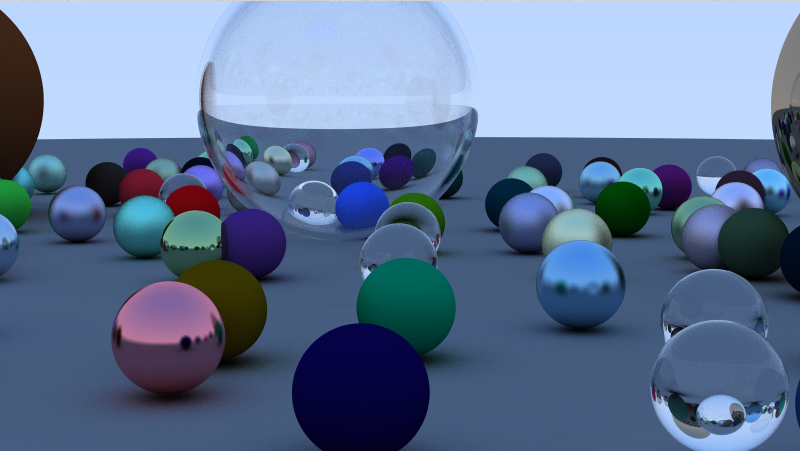


#### 2.4.3 伽马校正

上述的结果是偏暗的。这里与gamma校正的知识点有关，在本节先不做扩展，先介绍如何修改代码让结果更为正确。关于gamma校正的知识将在后面统一进行介绍。

对于当帧渲染的结果，要做gamma校正，这个写在最后的Image部分即可：

```glsl
vec3 toGamma(vec3 c)
{
    return pow(c, vec3(1.0 / 2.2));
}

void mainImage(out vec4 fragColor, in vec2 fragCoord)
{
    // hold mouse button + move to move around scene
    vec3 linearColor = texelFetch(iChannel0, ivec2(fragCoord), 0).xyz;
    
    fragColor = vec4(toGamma(linearColor),1.0);
}
```

gamma校正后的结果如下：

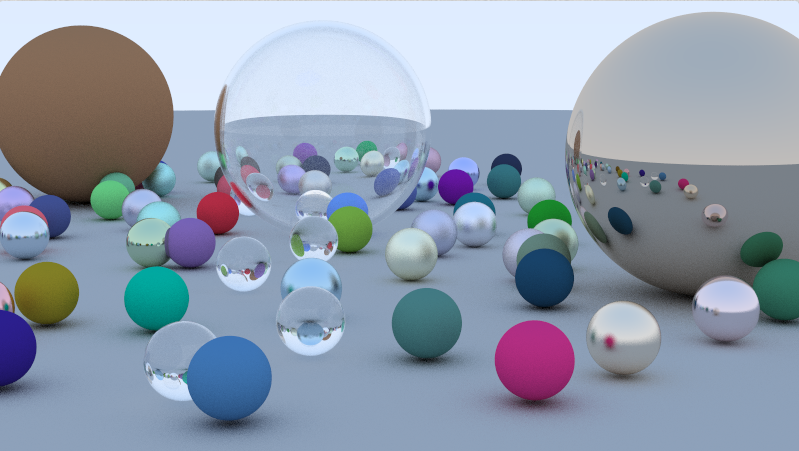

至此，我们的光线追踪基础就算是完成了！源代码见本篇笔记的Final子文件夹。我们还可以调整相机的焦散模糊效果，只需要调整main函数中的aperature参数为0.08，就可以实现下图的效果：

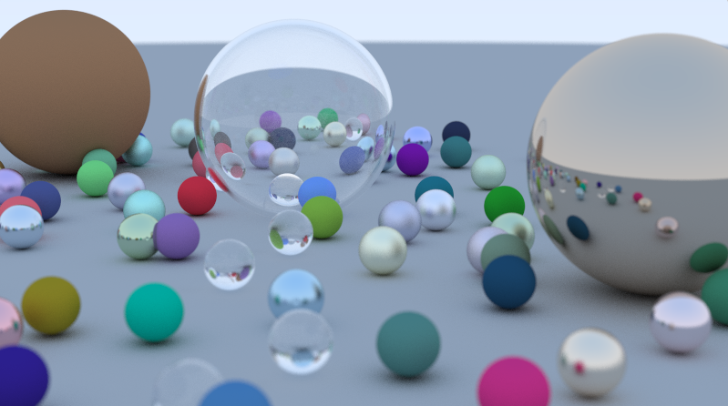

可以看到，近处更为模糊，而远处更为清晰。


参考文章：

[1] Real-Time Rendering 4th

[2]Wang, Zijin. "The Development of Ray Tracing and Its Future." (2022).https://ceur-ws.org/Vol-3150/short3.pdf

[3]De Greve, Bram. "Reflections and refractions in ray tracing." *Retrived Oct* 16 (2006): 2014. https://graphics.stanford.edu/courses/cs148-10-summer/docs/2006--degreve--reflection_refraction.pdf

[4]https://www.shadertoy.com/view/lssBD7