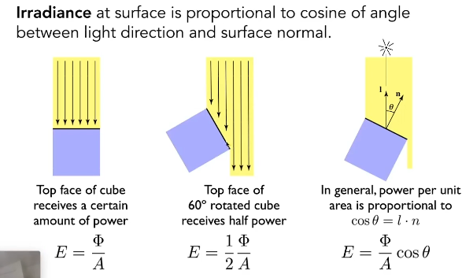
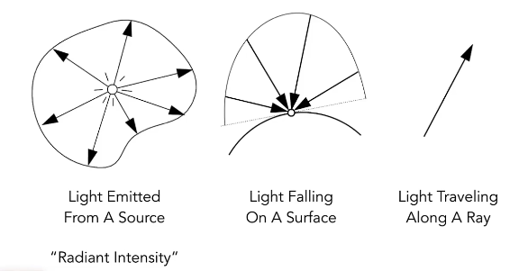
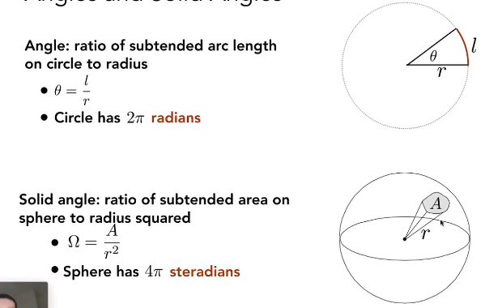
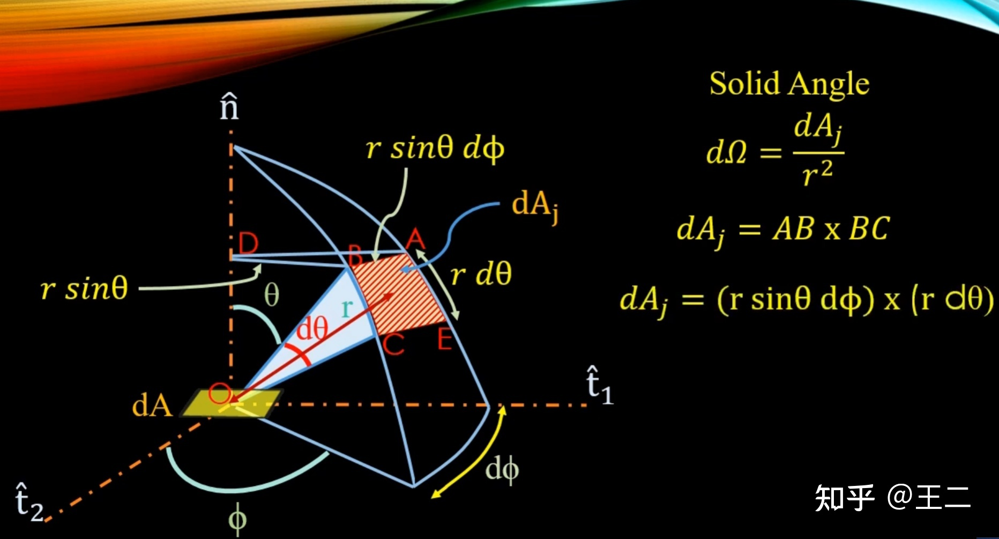
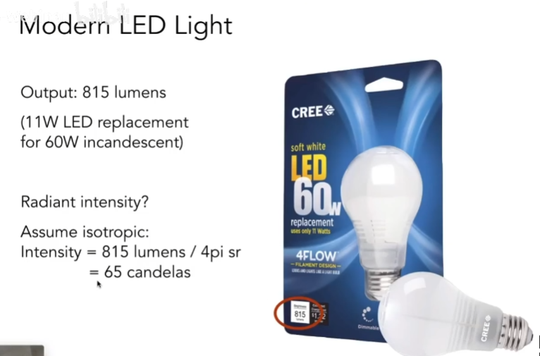
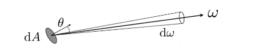
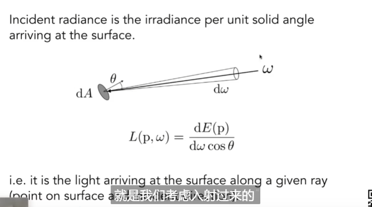
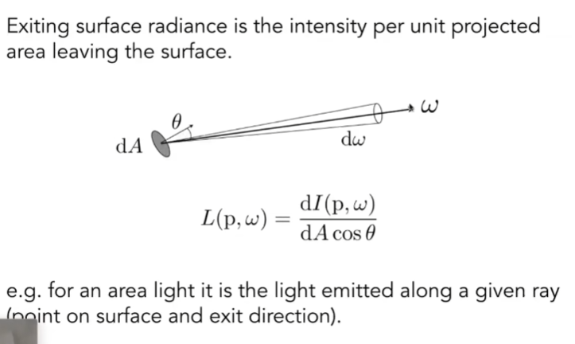

# lesson13_辐射度量学与渲染方程

## 1 引言

前面的章节我们讲解以及实现了一个较为简单的光线追踪模型，但是很显然，它依旧有很多不真实的地方。因此，我们要学会更精确的光线追踪，而这个前提就是，我们需要先学会能更精确反应现实中的光照信息的辐射度量学，以及渲染方程等。

## 2 辐射度量学

辐射度量学（radiometry）是研究各种电磁辐射（electromagnetic radiation）强弱的学科，研究对于电磁辐射的测量[1]。电磁辐射可被认为是光子组成的粒子流，而电磁辐射的波动形式是电磁波，我们平时看到的可见光就属于电磁波。

​						可见光谱只占有宽广的[电磁波谱](https://zh.wikipedia.org/wiki/電磁波譜)的一小部分。图片来自[3]

使用辐射度量学可以从物理上更精准的描述光的信息。

### 2.1 辐射量

要对电磁辐射进行测量，我们需要首先定义一些辐射量（radiometric quantity）。（就比如我们对苹果这个物体的质量进行测量，我们需要定义质量这个物理量一样。）

| 英文名称             | 中文名称        | 符号    | 单位              | 公式                                  | 注解                           |
| -------------------- | --------------- | ------- | ----------------- | ------------------------------------- | ------------------------------ |
| radiant energy       | 辐射能          | $Q$     | $Joule,J$（焦耳） |                                       | 电磁辐射的能量                 |
| radiant flux / power | 辐射通量 / 功率 | $\Phi $ | $watts,W$(瓦特)   | $ \LARGE \frac{dQ}{dt}$               | **单位时间**的辐射能量         |
| irradiance           | 辐照度          | $E$     | $W/m^2$           | $ \LARGE \frac{d \Phi}{d A}$ | 辐射通量相对于**面积**的密度   |
| radiant intensity    | 辐射强度        | $I$     | $W/sr$            | $\LARGE \frac{d \Phi}{d \omega}$                 | 辐射通量相对于**立体角**的密度 |
| **radiance** | 辐射度 | $L$ | $W/m^2sr$ | $\LARGE \frac{d^{2} \Phi }{d A d \omega}$ | 辐射通量相对于**面积和立体角**的密度  / 对**单条光线**中电磁辐射的度量 |

接下来，我们会逐一讲解以上辐射量。

#### 2.1.1 辐射能（radiant energy）

**辐射能**就是电磁辐射的能量，符号为$Q$, 单位为$J(Joule), $ 也就是焦耳。电磁辐射可被认为是光子组成的粒子流，因此辐射能也可以认为是光子所携带的能量。

实际上，光源辐射出来的就是辐射能，比如当你打开一个灯泡， 灯泡会发出光，这些光是以电磁辐射的形式传播的能量，这些能量的总量就是辐射能。

#### 2.1.2 辐射通量 （radiant flux） / 功率（power）

辐射通量 （radiant flux）又称为功率（power）是单位时间的辐射能（radiant energy），符号为$\Phi $，可表示为$\LARGE \frac{dQ}{dt}$， 单位是$watts,W$(瓦特)。

>实际上每个辐射度量学物理量会对应一个光度学物理量，辐射通量 （radiant flux）对应光度学中的光通量（luminous flux），单位是流明（lumen），表示光的亮度。
>
>光度学（photometry）会考虑人眼感知可见光强弱，而人眼对于不同波长的光的敏感度是不同的。
>
>而辐射度量学就不会考虑人眼的感知，而是直接考虑电磁辐射的强弱。

辐射通量 （radiant flux）是辐射度量学中最基本的单位，而非 辐射能（radiant energy）。假设还是一个灯泡照射照射在桌面上，照的时间越长，桌面越热，辐射能（radiant energy）越大，但我们并不想知道总的辐射能，我们其实希望知道，这个灯泡每秒钟会释放多少焦耳的辐射能，因此我们就引入使用辐射通量 （radiant flux）来表示。这个灯泡的辐射通量 （radiant flux） / 功率（power）为100瓦，表示其每秒钟会释放100焦耳的辐射能（radiant energy）

#### 2.1.3  irradiance（辐照度） 

> 标题中我们将英文写在前面，因为接下来几个概念大家更习惯用英文来表述，中文可能会引起混淆。

irradiance（辐照度） 表示单位面积上的辐射通量，符号为$E$，单位是$W/m^2$（瓦特每平方米）。可以表示为$\LARGE \frac{d \Phi}{d A}$。

具体来说，irradiance（辐照度）表示的是，电磁辐射入射于物体表面时，每单位面积的辐射通量（radiant flux） / 功率（power）。也可以简单理解为用来描述物体表面接收多少光的能量。

在渲染中，这个单位面积一般是物体的表面, 与入射光线垂直的面积。

- 如果你站在阳光下，你的皮肤表面接收到的太阳光就是辐照度。比如在晴天中午，阳光的辐照度大约是1000 W/m²。
- 室内一盏台灯下，离灯泡越近，桌面上的辐照度越高；离得远，辐照度会变小。

#### （3）Irradiance

- 定义：power per unit area

$$
E(x)\equiv \frac{d\Phi(x)}{dA}[\frac{W}{m^2}][\frac{lm}{s^2}=lux]
$$

与intensity做对比,intensity是对应单位立体角上,而irradiance则是对应单位面积上.**这个单位面积是指和入射光线垂直的面积,如下:**

用上述公式来理解光到球壳上某一点的能量值:

其实，intensity并没有发生衰减（因为立体角并没有发生变化，图上红绿色那根线），而是irradiance在发生衰减。

------

在接下来的部分中，会介绍三个很重要的概念：Radiant intensity，irradiance和radiance。直观理解如下图：

- radiant intensity:后面可能简称intensity,光源会往各个方向辐射能量,定义一个与方向有关的量叫做radiant intensity；

- 物体表面接收多少光的能量,叫做irradiance；
- 光线传播中如何度量能量,叫做radiance；

------

#### （2）Radiant Intensity

- 定义：power **per unit solid angle** emitted by a point light source，这里的power指的是上面的功率$\Phi$  （能量除以立体角）

$$
I(\omega)\equiv \frac{d\Phi}{d\omega}[\frac{W}{sr}][\frac{lm}{sr}=cd=candela]
$$

candela是标准单位制当中的单位，而 dω是单位立体角.

立体角单位：sr

##### **什么是立体角？**

对于二维来说，我们定义弧度。而扩展到三维来说，就利用立体角来定义：

立体角:面积A/半径的平方.(注意这个面要正对着球心，可以理解成从球心指出到球面上的一个很小的面积)，因此对于整个球面来说，其面积为$4\pi r^2$，所以整个球面的立体角为$4\pi r^2/r^2=4\pi$

##### **在球面坐标系下，如何表示立体角？**

这里推导公式的图如下：

在上图里，BC = rdθ（这可以通过弧度的定义得到），而BD=rsinθ（因为BD⊥n轴），而ABD可以看作一个小的扇形，进而根据弧度的定义得到AB = rsinθdΦ，接下来就可以求出上图的小的“平面”ABCE的面积了，为dAj。

那么此时就有：
$$
\begin{aligned}
\mathrm{d} A & =(r \mathrm{~d} \theta)(r \sin \theta \mathrm{d} \phi)
=r^{2} \sin \theta \mathrm{d} \theta \mathrm{d} \phi \\
\mathrm{d} \omega & =\frac{\mathrm{d} A}{r^{2}}=\sin \theta \mathrm{d} \theta \mathrm{d} \phi
\end{aligned}
$$
重点是要看到$dω=sin\theta d\theta d\phi$这种计算方式，在后面很有用。(理解上是θ和Φ各变化一点点,立体角发生的变化)

对于整个球来说，有：
$$
\Omega= \int_{s^2}d\omega=\int_{0}^{2\pi}\int_{0}^\pi sin\theta d\theta d\phi = 4\pi
$$
在辐射度量学中,我们直接用ω来表示三维空间中的方向(ω可以由θ和Φ来进行定义, unit length)

##### **回到Intensity**

总的发射power，然后单位立体角发射Intensity

因为有:
$$
I(\omega)\equiv \frac{d\Phi}{d\omega}[\frac{W}{sr}][\frac{lm}{sr}=cd=candela]
$$
所以想要求出单位时间的能量Φ,我们就可以对各个立体角方向的$I$进行积分求解,这就可以得到一个点光源均匀的往四周辐射能量,对应的任何方向的intensity推导公式如下:
$$
\Phi=\int_{S^2}I d\omega=4\pi I (所有方向的intensity积分起来，能得到power)\\  
I=\frac{\Phi}{4\pi}
$$

也就是说，如果是向四周均匀辐射能量的话，任何方向的Instensity的值都为$\large \frac{\Phi}{4\pi}$。

联系下不同的变量

------

#### （3）Irradiance

- 定义：power per unit area

$$
E(x)\equiv \frac{d\Phi(x)}{dA}[\frac{W}{m^2}][\frac{lm}{s^2}=lux]
$$

与intensity做对比,intensity是对应单位立体角上,而irradiance则是对应单位面积上.**这个单位面积是指和入射光线垂直的面积,如下:**

用上述公式来理解光到球壳上某一点的能量值:

其实，intensity并没有发生衰减（因为立体角并没有发生变化，图上红绿色那根线），而是irradiance在发生衰减。

#### （4）Radiance（重要）

- 为了描述光在传播过程中的属性.power **per unit solid angle, per projected unit area**.

$$
L(p,\omega)\equiv \frac{d^2\Phi(p,\omega)}{d\omega dA cos\theta}\\ 单位[\frac{W}{sr\ m^2}][\frac{cd}{m^2}=\frac{lm}{sr\ m^2}=nit]
$$
从某个微小面积上，往某个微小立体角去辐射能量

(这里有一个cosθ表示参与计算了与光垂直的面的面积,之前有说)（**有个疑问，这里的cos为什么在下面？不过可以先记下来。**）

因此，radiance的定义可以这么理解:

- （1）irradiance per solid angle

  - it is the light arriving at the surface along a given ray(point on surface and incident direction)
  - 看上图，因为打到平面dA上的能量可能会来自很多方向，此时就可以用单位角限制从某个特定方向过来的光的能量；

  

- （2）intensity per projected unit area

  - for an area light it is the light emitted along a given ray(point on surface and exit direction)
  - 考虑小的面dA的intensity，因为其会向各个方向发射能量，考虑其往特定方向辐射出去的能量；

按第一种理解方式,就是$\large L(p,\omega)=\frac{dE(p)}{d\omega cos \theta}$

按第二种理解方式,就是$\large L(p,\omega)=\frac{dI(p,\omega)}{dA cos \theta}$

在理解BRDF的过程当中，我们要重点理解第一种方式。

下面这张图揭示了radiance和irradiance之间的关系：

ir/E：dA收到的所有能量

r/L：从某个单位立体角进来，能让dA收到的能量

根据前面的可以求解积分:
$$
∵ L(p,\omega)=\frac{dE(p)}{d\omega cos \theta}\\
∴dE(p,\omega)=L_i(p,\omega)cos\theta d\omega \\
∴E(p)=\int_{H^2}L_i(p,\omega)cos\theta d\omega
$$
所以，p点收到的所有能量（也就是irrandiance）就是从各个方向进来的能量求和。其实就是**radiance在irradiance的基础上加了一个方向性**。$H^2$指的是单位半球面。

------

[1]https://en.wikipedia.org/wiki/Radiometry

[2]real-time rendering 4th

[3]https://zh.wikipedia.org/wiki/%E7%94%B5%E7%A3%81%E6%B3%A2