# lesson13_辐射度量学与渲染方程

## 1 引言

前面的章节我们讲解以及实现了一个较为简单的光线追踪模型，但是很显然，它依旧有很多不真实的地方。因此，我们要学会更精确的光线追踪，而这个前提就是，我们需要先学会能更精确反应现实中的光照信息的辐射度量学，以及渲染方程等。

## 2 辐射度量学

辐射度量学（radiometry）是研究各种电磁辐射（electromagnetic radiation）强弱的学科，研究对于电磁辐射的测量[1]。电磁辐射可被认为是光子组成的粒子流，而电磁辐射的波动形式是电磁波，我们平时看到的可见光就属于电磁波。

​						可见光谱只占有宽广的[电磁波谱](https://zh.wikipedia.org/wiki/電磁波譜)的一小部分。图片来自[3]

使用辐射度量学可以从物理上更精准的描述光的信息。

### 2.1 辐射量

要对电磁辐射进行测量，我们需要首先定义一些辐射量（radiometric quantity）。（就比如我们对苹果这个物体的质量进行测量，我们需要定义质量这个物理量一样。）

| 英文名称             | 中文名称        | 符号    | 单位              | 公式                                  | 注解                           |
| -------------------- | --------------- | ------- | ----------------- | ------------------------------------- | ------------------------------ |
| radiant energy       | 辐射能          | $Q$     | $Joule,J$（焦耳） |                                       | 电磁辐射的能量                 |
| radiant flux / power | 辐射通量 / 功率 | $\Phi $ | $watts,W$(瓦特)   | $ \LARGE \frac{dQ}{dt}$               | **单位时间**的辐射能量         |
| irradiance           | 辐照度          | $E$     | $W/m^2$           | $ \LARGE \frac{d \Phi}{d A}$ | **单位面积**上的辐射通量 |
| radiant intensity    | 辐射强度        | $I$     | $W/sr$            | $\LARGE \frac{d \Phi}{d \omega}$                 | **单位立体角**上的辐射通量 |
| **radiance** | 辐射率 | $L$ | $W/m^2sr$ | $\LARGE \frac{d^{2} \Phi }{d A d \omega}$ | **单位面积**和**单位立体角**上的辐射通量  /  对**单条光线**中电磁辐射的度量 |

接下来，我们会逐一讲解以上辐射量。

#### 2.1.1 辐射能（radiant energy）

思考：一个灯泡会发光发热，我们该如何表示它的总能量呢？

**辐射能（radiant energy）**就是电磁辐射的能量，符号为$Q$, 单位为$J(Joule), $ 也就是焦耳。电磁辐射可被认为是光子组成的粒子流，因此辐射能也可以认为是光子所携带的能量。

实际上，光源辐射出来的就是辐射能，比如当你打开一个灯泡， 灯泡会发出光，这些光是以电磁辐射的形式传播的能量，这些能量的总量就是辐射能。

如下图，灯泡从开始发光到能量释放完毕结束发光，这个过程中释放的总能量就是辐射能。

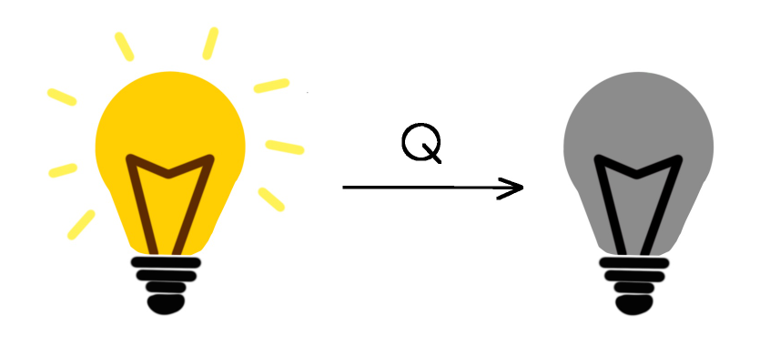

#### 2.1.2 辐射通量 （radiant flux） / 功率（power）

思考：一个灯泡单位时间会释放多少能量呢？

**辐射通量 （radiant flux）**又称为**功率（power）**是单位时间的辐射能（radiant energy），符号为$\Phi $，可以通过下式表示：
$$
\Phi =\lim_{\Delta t\to 0}\frac{\Delta Q}{\Delta t} =\frac{dQ}{dt}
$$
 单位是焦耳/秒，但是我们一般会使用$watts,W$(瓦特)来作为单位。

>实际上每个辐射度量学物理量会对应一个光度学物理量，辐射通量 （radiant flux）对应光度学中的光通量（luminous flux），单位是流明（lumen），表示光的亮度。
>
>光度学（photometry）会考虑人眼感知可见光强弱，而人眼对于不同波长的光的敏感度是不同的。
>
>而辐射度量学就不会考虑人眼的感知，而是直接考虑电磁辐射的强弱。

辐射通量 （radiant flux）是辐射度量学中最基本的单位，而非 辐射能（radiant energy）。假设还是一个灯泡照射照射在桌面上，照的时间越长，桌面越热，辐射能（radiant energy）越大，但我们并不想知道总的辐射能，我们其实希望知道，这个灯泡每秒钟会释放多少焦耳的辐射能，因此我们就引入使用辐射通量 （radiant flux）来表示。

​	举个例子，假设这个灯泡的辐射通量 （radiant flux） / 功率（power）为100瓦，表示其每秒钟会释放100焦耳的辐射能（radiant energy）。（前提是假设此灯泡任何时候发射的能量相同）

#### 2.1.3  irradiance（辐照度） 

思考：把手掌放在灯泡旁边，手掌表面接收到的光的能量是多少呢？

> 标题中我们将英文写在前面，因为接下来几个概念大家更习惯用英文来表述，中文可能会引起混淆。

**irradiance（辐照度）** 表示**单位面积**上的辐射通量，符号为$E$，单位是$W/m^2$（瓦特每平方米）。可以通过下式表示：
$$
E=\lim_{\Delta A\to 0}\frac{\Delta \Phi}{\Delta A} =\frac{d \Phi}{d A}
$$
具体来说，irradiance（辐照度）表示的是，电磁辐射入射于物体表面时，每单位面积的辐射通量（radiant flux） / 功率（power）。也可以简单理解为用来描述物体表面接收多少光的能量。

在渲染中，这个单位面积一般是物体的表面。如下图，假设场景中的光源面积是$A$，且这个光源的辐射通量（radiant flux）为$\Phi$ :

如下图左侧， 如果这个面积与入射光线垂直，则$A_1 = A$, 在$A_1$内任意点的irradiance（辐照度）$E_1=\LARGE \frac{ \Phi}{ A}$.

如下图左侧， 如果这个面积与入射光线不垂直，则$A_2 = \LARGE\frac{A}{cos\theta}$, 在$A_2$内任意点的irradiance（辐照度）$E_2=\LARGE \frac{ \Phi cos\theta}{ A}$.

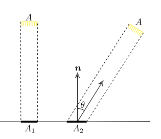

​															图源：[4]

这也很好理解，$A$越倾斜，$A_2$越大，单位面积上的辐射通量（radiant flux）越小，因为光线被分散到更大的面积上了。

如下图，还是之前例子中的灯泡，这个灯泡的辐射通量/ 功率$\Phi $为60W，这个点光源向四周均匀地辐射能量，对于距离光源中心 $r$ 的球壳上，由于灯泡均匀地像四周发散能量，因此对于某个球壳的每个地方的irradiance（辐照度）是一样的，球壳面积为$4\pi r^2$，因此这个球壳上的irradiance（辐照度）的值就是$E\LARGE= \frac{ \Phi}{ A}=\frac{60}{4\pi r^2}$。$r$越大，irradiance（辐照度）越小。

我们可以简单地想象，我们地手掌放在灯泡旁边，这个时候手掌表面单位面积接收到的光的能量就是irradiance（辐照度），我们的手掌距离灯泡越远，感受到的温暖就越小，因为irradiance（辐照度）变小了。

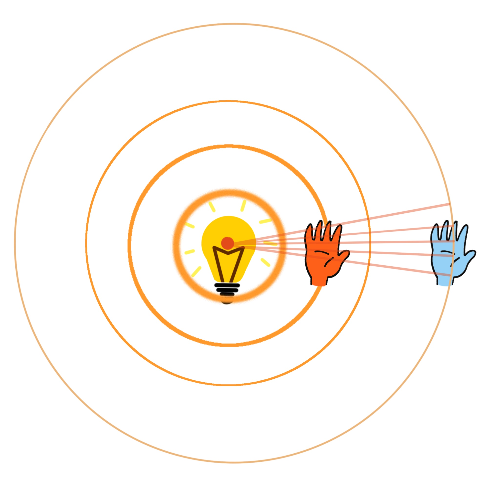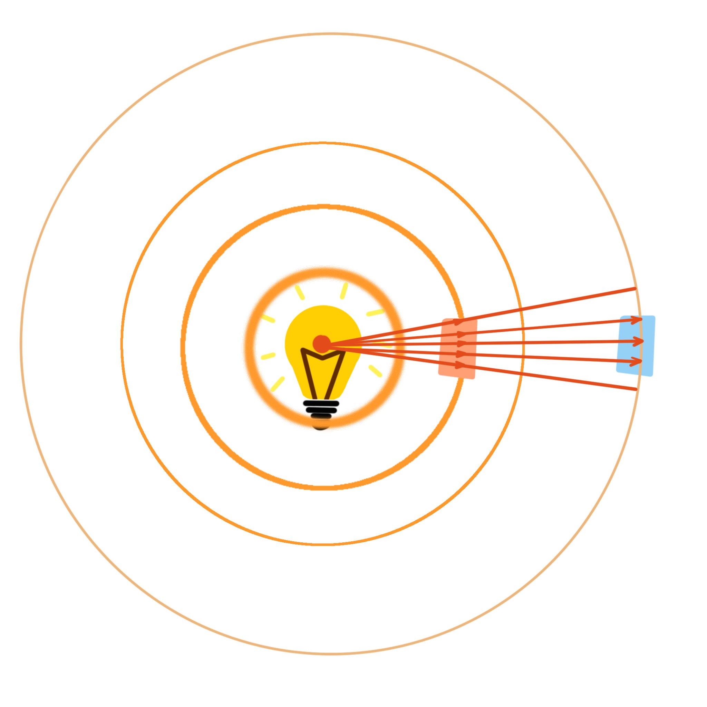

假设手掌距离灯泡1米，那么irradiance（辐照度）的值就是$\LARGE \frac{60}{4\pi r^2}=\frac{60}{4\pi}$ $≈4.77W/m^2$。这个值就是我们手掌表面单位面积接收到的光的能量。

>在某些地方，使用辐射出射度（radiant emittance，radiant exitance）表示单位面积表面发射的辐射通量。
>
>https://en.wikipedia.org/wiki/Radiant_exitance
>
>由于公式与irradiance（辐照度）是一致的，因此后续本文不做具体区分。

#### 2.1.3  radiant intensity（辐射强度） 

思考：灯泡往一个特定方向发射的能量是多少呢？

**radiant intensity（辐射强度）** 表示**单位立体角**上的辐射通量，符号为$I$，单位是$W/sr$（瓦特每立体角）。可以通过下式表示：
$$
E=\lim_{\Delta \omega\to 0}\frac{\Delta \Phi}{\Delta \omega} =\frac{d \Phi}{d \omega}
$$

这里提到了立体角的概念，那我们来看看什么是立体角：

##### 立体角

###### 二维角度表示--弧度公式

对于二维的半径为$r$的圆来说，角度可表示为$\theta=\frac{l}{r}$，（弧度公式）

例如

当$l=2\pi r$, 则$\theta = 2\pi$；

 当$l=\frac{1}{2}\pi r$, 则$\theta = \frac{1}{2}\pi$ .

###### 三维角度表示--立体角

在三维空间中，我们也希望有一个类似于角度的概念，这就是立体角（solid angle），可以理解成从球心指出到球面上的一个很小的面积。、

其公式与二维角度类似，对于半径为$r$的球来说，立体角$\omega$可以表示为 **$\LARGE \omega = \frac{A}{r^2}$**，其中$A$是球面上的面积。

https://en.wikipedia.org/wiki/Solid_angle

例如：

对于整个球面来说，其面积为$4\pi r^2$，所以整个球面的立体角为$4\pi r^2/r^2=4\pi$ 。

对于半球面来说，其面积为$2\pi r^2$，所以整个球面的立体角为$2\pi r^2/r^2=2\pi$ 。

**立体角公式推导**

实际上在我们后续会遇到的情况中，我们无法直接得到这个立体角对应的面积的大小，而是只知道在球面坐标系下这个立体角的“方向”，即下图中的 $\theta$ 和 $\phi$。那么我们就需要通过 $\theta$ 和 $\phi$来计算面积进而计算立体角。

推导公式的图如下：

下图中，根据上文提到的弧度公式$\theta=\frac{l}{r}$，则$l= r\theta$，我们知道$AB=rd\theta$

如下图，在直角三角形AEO中，$AE=rsin\theta$

如下图，依旧根据上文提到的弧度公式$\theta=\frac{l}{r}$，则$l= r\theta$，我们知道$AC=AE*d\phi =  rsin\theta d\phi$

由此，我们终于得到ABCD的两个边$AB=rd\theta$, $AC=  rsin\theta d\phi$ , 

我们可以算出小“平面”ABCD的面积

那么此时就有：
$$
\begin{aligned}
\mathrm{d} A & =AB*AC=
(r \mathrm{~d} \theta)(r \sin \theta \mathrm{d} \phi)
=r^{2} \sin \theta \mathrm{d} \theta \mathrm{d} \phi \\
\mathrm{d} \omega & =\frac{\mathrm{d} A}{r^{2}}=\sin \theta \mathrm{d} \theta \mathrm{d} \phi
\end{aligned}
$$

对于整个球来说，有：
$$
\Omega= \int_{s^2}d\omega=\int_{0}^{2\pi}\int_{0}^\pi sin\theta d\theta d\phi = 4\pi
$$

综上，在辐射度量学中,我们直接用ω来表示三维空间中的方向--立体角(ω可以由θ和Φ来进行定义)，$\mathrm{d} \omega =\sin \theta \mathrm{d} \theta \mathrm{d} \phi $  。

回到radiant intensity（辐射强度）上，其定义是单位立体角上的辐射通量，可以表示为$I=\LARGE \frac{d \Phi}{d \omega}$。

由于立体角$\mathrm{d} \omega =\sin \theta \mathrm{d} \theta \mathrm{d} \phi $  ,我们发现， 立体角和半径r是没有关系的，同理，radiant intensity（辐射强度）与距离光源远近无关。见下图左侧：

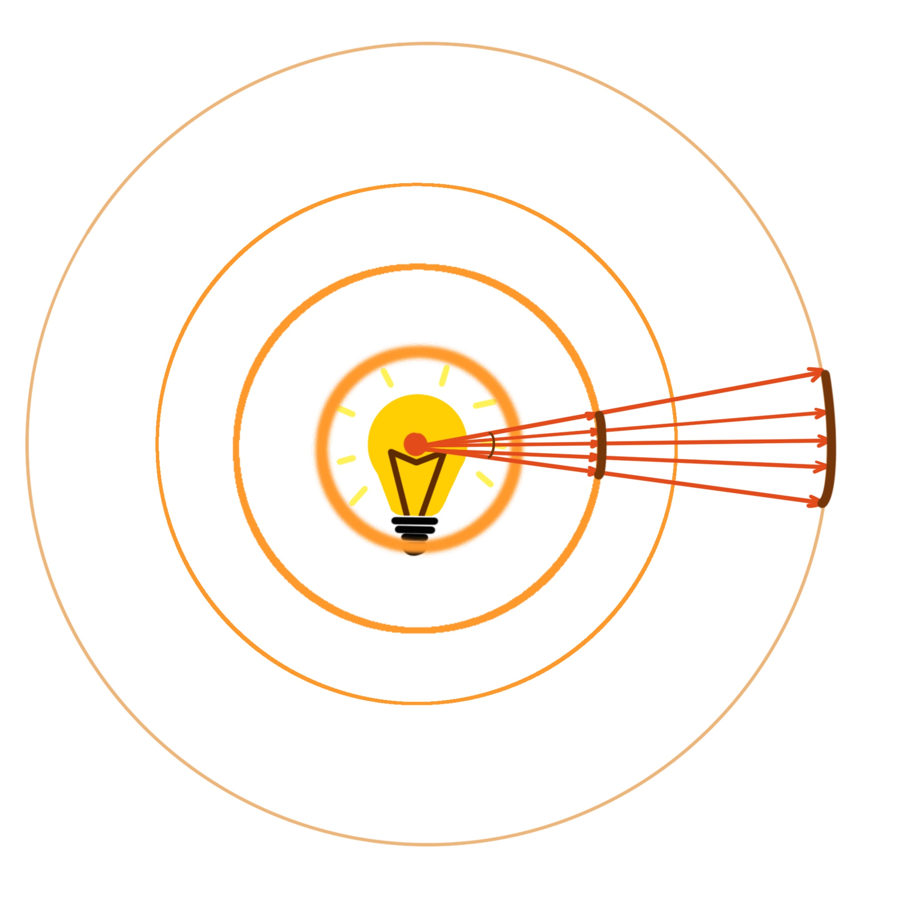

可见，radiant intensity（辐射强度）并没有发生衰减（上图左侧），而 irradiance（辐照度）在发生衰减（上图右侧）。

如下图，还是之前例子中的灯泡，这个灯泡向四周均匀地辐射能量，即总的发射辐射通量/ 功率$\Phi$，然后单位立体角发射radiant intensity（辐射强度）$I$ .

因为有:
$$
I=\LARGE \frac{d \Phi}{d \omega}
$$
所以想要求出单位时间的能量，即辐射通量/ 功率$\Phi$, 我们就可以对各个立体角方向的$I$进行积分求解, 这就可以得到一个点光源均匀的往四周辐射能量,对应的任何方向的intensity推导公式如下:
$$
\Phi=\int_{S^2}I d\omega=4\pi I (所有立体角的intensity积分起来，能得到功率power)\\  
I=\frac{\Phi}{4\pi}
$$

也就是说，如果是向四周均匀辐射能量的话，任何方向/立体角的Instensity的值都为$\large \frac{\Phi}{4\pi}$。

我们再举一个例子，如果这次光源不是均匀发光，而是一个聚光灯，发光集中在某方向，假设在某方向上通过的立体角是0.5 sr，功率是60 W，那么：

$I=\LARGE \frac{ \Phi}{ \omega}$$ =  \frac{60}{0.5}=120W/sr$

#### 2.1.4  radiance（辐射率） 

**radiance（辐射率）**是**单位面积**和**单位立体角**上的辐射通量，符号为$L$，单位是$W/m^2sr$（瓦特每平方米每立体角）。可以表示为$\LARGE \frac{d^{2} \Phi }{d A d \omega}$。

radiance（辐射率） 是一个很重要的概念，我们在之前的基础光线追踪章节中，提到的从相机或者眼睛出发，穿过每个像素的光线，就可以用radiance（辐射率）来表示。

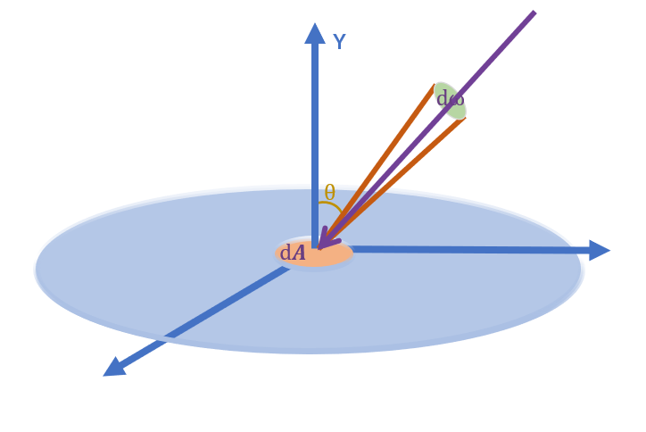

我们可以理解为，radiance是irradiance和radiant intensity的结合，irradiance是单位面积上的辐射通量，radiant intensity是单位立体角上的辐射通量，而radiance是单位面积和单位立体角上的辐射通量。

radiance（L）可以看作是单位面积的radiant intensity（I）。radiant intensity是单位立体角上的辐射通量，我们进一步关注一个微小面积往某个微小立体角上发射的辐射通量，这就是radiance。也可以理解为，这个微小面积dA的radiant intensity是向周围各个方向发射能量，而我们只关心这个微小面积向某个微小立体角\特定方向发射的能量，即radiance。

$\large L=\frac{dI}{dA cos \theta}$

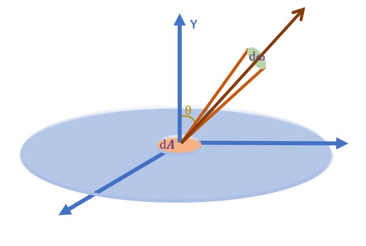

另一方面，radiance（L）可以看作是单位立体角的irradiance(E)。irradiance是单位面积上接收到的所有方向来的辐射通量，如下图，我们仅仅看这个小面积上接收的一个立体角来的辐射通量，这就是radiance。

$\large L=\frac{dE}{d\omega cos \theta}$

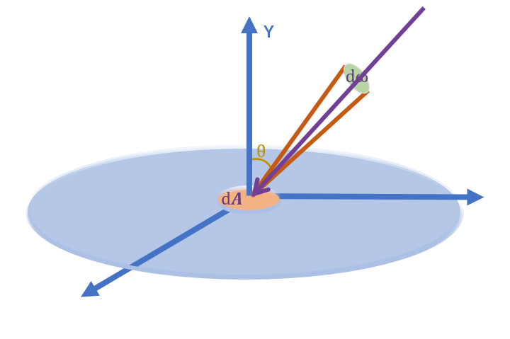

反之，如果我们将所有方向的立体角的radiance积分起来，就可以得到irradiance:
$$
∵ L_i(\omega)=\frac{dE}{d\omega cos \theta}\\
∴dE(\omega)=L_i(\omega)cos\theta d\omega \\
∴E=\int_{H^2}L_i(\omega)cos\theta d\omega
$$
所以，dA收到的所有能量（也就是irrandiance）就是从各个方向进来的能量求和。其实就是**radiance在irradiance的基础上加了一个方向性**。$H^2$指的是单位半球面

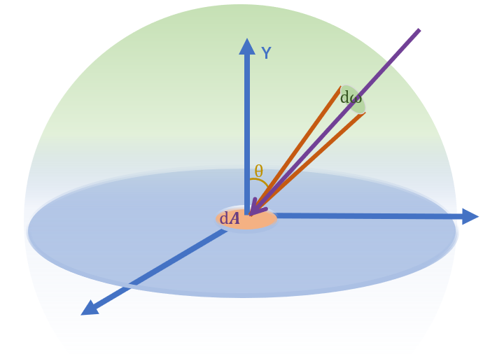

## 3 表面反射

我们知道，光打到一个表面上，有可能有一部分会被吸收，有一部分会被反射，我们可以回忆光线追踪的章节，假设是光滑平面，那么光线大概率发生镜面反射，光线会沿着反射方向反射出去。

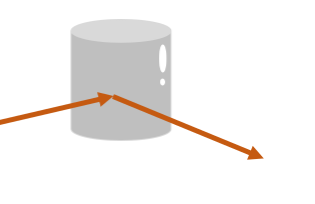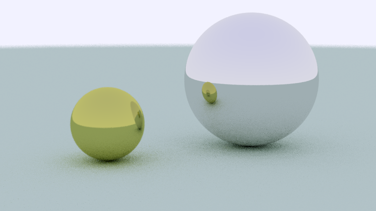

如果是漫反射材质，比如很多绝缘体（塑料，橡皮,  木头桌子）等等粗糙材质，光线打到表面后，反射光线会向四面八方发射，而不是集中反射到某个区域被我们捕捉到。

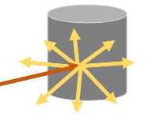                             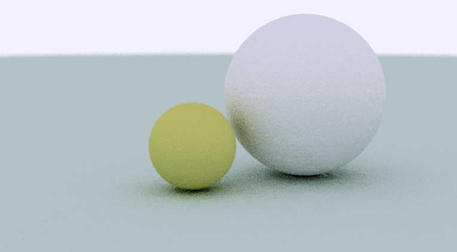

那么，假设我们想要知道，某一根光线沿着$\omega_i$方向入射到表面上，经过反射（部分会被吸收，部分可能会反射到各个方向去），沿着$\omega_o$ 方向反射到我们眼睛被我们看见，我们想知道沿着$\omega_o$ 出射的光线能量占了沿着$\omega_i$ 入射的光线能量的多少，这就是BRDF（bidirectional reflectance distribution function，双向反射分布函数）要描述的问题。

### 3.1 BRDF

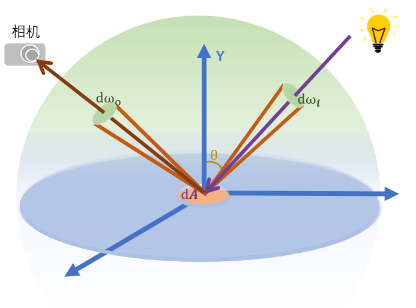

BRDF（bidirectional reflectance distribution function，双向反射分布函数）描述的是在一对方向$\omega_i$ 和$\omega_o$ 上，沿着$\omega_i$入射的光有多少会朝着$\omega_o$ 反射出来。也就是说，BRDF描述了表面如何把一个方向$\omega_i$收集到的能量，反射到另一个方向$\omega_o$去。符号表示为$f_r(w_i\rightarrow w_o)$。公式表示为：
$$
f_r(w_i\rightarrow w_o)=
\frac{dL_o(\omega_o)}{dE(\omega_i)}=
\frac{dL_o(\omega_o)}{L_i(\omega_i)cos\theta_id\omega_i}
$$
接下来，我们解释一下这个公式。

$L_o(\omega_o)$项：

$L_o(\omega_o)$表示的是表面从$\omega_o$ 出射的总的radiance(辐射率), 包含表面上半球所有方向的入射光线的能量贡献。如下图，假设有多个光源照亮表面p，它们都会影响到从$\omega_o$ 出射的光线的强度/能量。

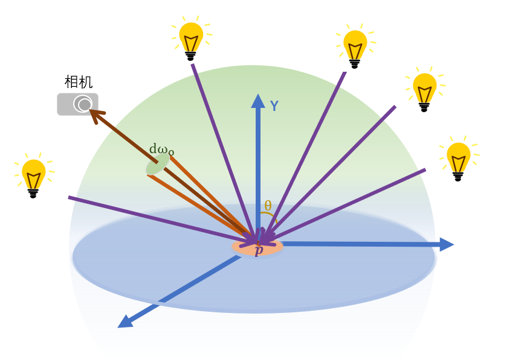

而我们只需要知道其中从特定方向$\omega_i$来的光线的贡献，因此，使用的是$dL_o(\omega_o)$表示来自特定方向$\omega_i$的入射光贡献的radiance(辐射率)。

$dE(\omega_i)$项：

$E$表示irradiance，是单位面积上的辐射通量，表面p接收到的来自上半球所有方向的入射光线的贡献。

$dE(\omega_i)$表示来自特定方向$\omega_i$的入射光对于表面p的贡献。

因此，不难想到，$dE(\omega_i)=L_i(\omega_i)cos\theta_id\omega_i$。

这样一来我们就理解了BRDF的公式。

同时，BRDF有两个重要**性质**：

1、BRDF具有**可逆性（reciprocity ）**，即 $f_r(w_i\rightarrow w_o)=f_r(w_o\rightarrow w_i )$，交换输入和输出的方向并不会改变BRDF.

2、BRDF遵循**能量守恒**定律：光反射的总能量少于等于入射光的能量。这是由于入射光入射到表面后，能量可能会被吸收，反射光的能量不可能超过入射光的能量。对于所有方向$\omega_o $ ， 满足：
$$
\int_{\H^{2}(n)}f_r(w_i\rightarrow w_o)cos\theta_i d\omega_i \leq 1
$$
$\H^{2}(n)$是指单位半球面，指表面上半球面。

### 3.2 反射方程与渲染方程

**反射方程**：

最终我们想得到的是$L_o(\omega_o)$项，回顾下，$L_o(\omega_o)$表示的是表面从$\omega_o$ 出射的总的radiance(辐射率), 包含表面上半球所有方向的入射光线的能量贡献。如下图，假设有多个光源照亮表面p，它们都会影响到从$\omega_o$ 出射的光线的强度/能量。

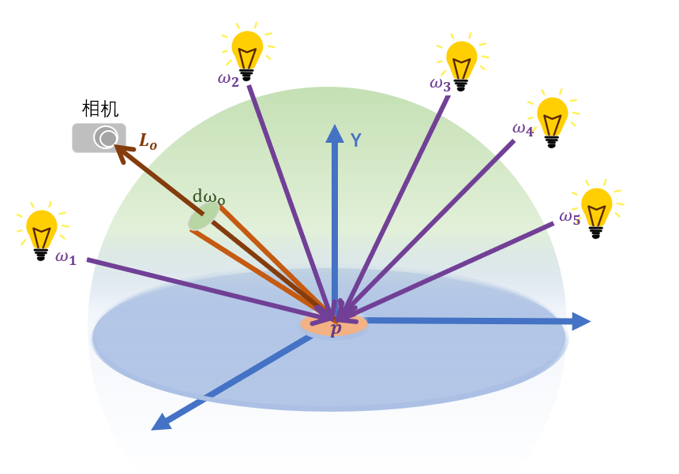

那么，我们只需要将所有方向的入射光线（所有$\omega_i$）的贡献加起来，就可以得到$L_o(\omega_o)$。
$$
L_o(\omega_o)=\sum L_i(\omega_i)f_r(w_i\rightarrow w_o)cos\theta_i 
$$
如果我们有特别多乃至无数多个光源，那么我们可以用积分来表示，这就是反射方程的公式：
$$
L_o(\omega_o)=\int_{\H^{2}(n)}L_i(\omega_i)f_r(w_i\rightarrow w_o)cos\theta_i d\omega_i
$$

（$\H^{2}(n)$是指单位半球面，指表面上半球面。）

可以认为，我们把所有输入入射方向的贡献加起来，对于某个出射方向就知道了出射方向的颜色。

值得注意的是，这里的“光源”也可以是其他表面反射过来的光线，不一定指的是真的发光的光源。

我们还需要进一步考虑物体自身发光的radiance(辐射率)。因此，我们需要将BRDF和自发光radiance结合起来，得到**渲染方程**。
$$
L_o(\omega_o)=L_e(\omega_0)+\int_{\H^{2}(n)}L_i(\omega_i)f_r(w_i\rightarrow w_o)cos\theta_i d\omega_i
$$
关于渲染方程的解法,在后面会进行介绍.

现在要从反射方程里面推出更通用的渲染方程

[1]https://en.wikipedia.org/wiki/Radiometry

[2]real-time rendering 4th

[3]https://zh.wikipedia.org/wiki/%E7%94%B5%E7%A3%81%E6%B3%A2

[4] Physically Based Rendering: From Theory To Implementation

