# RayMarching+SDF教程（以shadertoy为例）

在很多游戏中，都会实现一些复杂的动态效果，比如体积雾，体积云，体积光，毛发，火焰，变形等，如果使用传统建模，需要耗费大量的面片且效果也不好。因此，很多游戏会使用RayMarching技术来实现这些效果。因此，本节我们就来初步了解一下RayMarching是什么。

如下图，是游戏《地平线：零之曙光》中实现的体积云，使用到了RayMarching技术。


# 一、普通的RayMarching

SDF可视化：https://www.shadertoy.com/view/lslXD8

参考视频：https://www.youtube.com/watch?v=PGtv-dBi2wE&list=PLGmrMu-IwbguU_nY2egTFmlg691DN7uE5&index=22

## 1.什么是Ray marching？（==看情况补充一下基本知识储备==）

在前面的光线追踪章节，我们介绍了光追的基本应用，并渲染出了许多球体在场景当中。思考一个问题：现在我们想实现复杂的动态效果，例如我们想实现体积云，如果场景中不只是有球形体积云怎么办？例如我们有圆环、圆柱、圆锥、甚至更加复杂的几何体体积云在场景中，要如何计算求交呢？

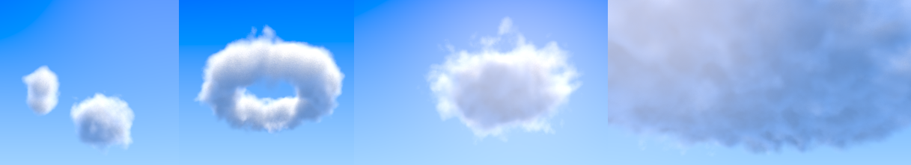

使用Ray marching实现的各种形状的体积云。可在线查看https://www.shadertoy.com/view/WdXGRj

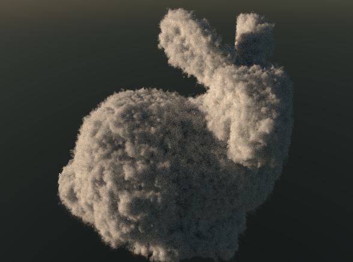

使用Ray marching实现的兔子形状的体积云。可在线查看https://www.shadertoy.com/view/7dVGWR


诚然，我们可以写出光线与各种几何体的求交公式，每有一种不同的几何体出现在场景中就增加一种判断函数，但是否有什么**通用的解法**可以求出”光线与场景物体的交点“信息呢？一种方式是将几何体转换为基本图元，比如三角形面片，然后计算光线和三角形面片求交。而另一种方式，**就要引入大名鼎鼎的Ray marching算法了。**

回顾一下在几何章节一开始，介绍的SDF函数概念：

> 符号距离场函数 (Signed Distance Field，SDF) ，它表示的是某点到物体表面的距离，如果距离为负数，表示这个点在物体内部，如果距离为正数，表示这个点在物体外部，如果距离为零，表示这个点刚好在物体表面上。


**基于以上的基础知识，Ray marching的算法如下：**

依旧是光线追踪的思想，只不过这次我们谨慎一些，沿着光线方向，每次只前进**一小步**，然后计算出这一步的有向距离 (SD) 值（**这里指的是距离场景所有物体的最近距离**，是有向距离，因为这有正有负，正意味着在表面外侧，负意味着在表面内侧，0意味着在表面上），一直前进直到 SD 值与 0 相差非常小 `abs(SD) < PRECISION` ，就认为光线到达了物体的表面。

这里有个问题，**每次前进的步长是多少呢？**如果步长太大，光线可能会跳过物体表面，如果步长太小，光线前进的速度就会极慢，这样就会带来非常多冗余的计算，使得画面帧数下降。

**一个聪明的做法是让光线每次前进的距离刚好等于 SD 的绝对值，因为它是当前点到物体表面的最短距离。最好的情况下，光线只需要前进一两次就可以刚好到达表面。**

当光线偏离物体很远时，光线也很快就会传播到无穷远处，当光线步进的距离足够远而仍然没有到达物体表面，就认为这条光线没有击中任何物体，那我们就可以认为它击中了天空。

下面是三维空间的一个二维切面，可视化这个算法中光线步进和与物体求交的过程。

| 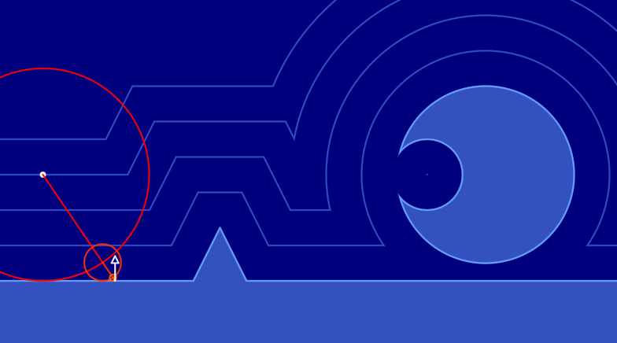 | 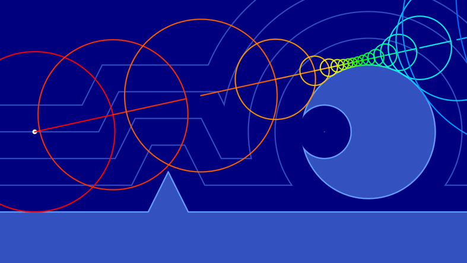 |
| :----------------------------------------------------------: | :----------------------------------------------------------: |
|                 较好的情况下很快到达物体表面                 |                   没有交点的情况很快就发散                   |

​											图片截取自 [https://www.shadertoy.com/view/lslXD8](https://www.shadertoy.com/view/lslXD8)

一种比较差的情况是，光线刚好与物体擦肩而过，这个时候步进次数会急剧上升，不过好在光线总会离开物体表面附近，我们可以设置一个最大步进次数，当步进次数超过这个值时，也认为这条光线没有击中任何物体。

​			
​										图片截取自 https://www.shadertoy.com/view/lslXD8

上述网站（ https://www.shadertoy.com/view/lslXD8）可以很好地看到这个Ray marching的过程，读者可以结合网站内容来看

https://www.shadertoy.com/view/4dKyRz 是另一个可视化Ray marching的过程，也可以辅助读者学习，下面我们使用这个来具体讲解一下Ray marching的过程：

如下图，从P0点，我们要往目标点粉色点处发射射线，找到与场景中物体的交点。

首先，我们寻找场景中所有物体里，距离$P_0$点最近的物体，下图中橙色线条就是其最近距离。以这个最近距离为半径$R_0$，以$P_0$为圆心画一个圆，如下绿色圈，往目标点出发$R_0$距离，到达$P_1$点。

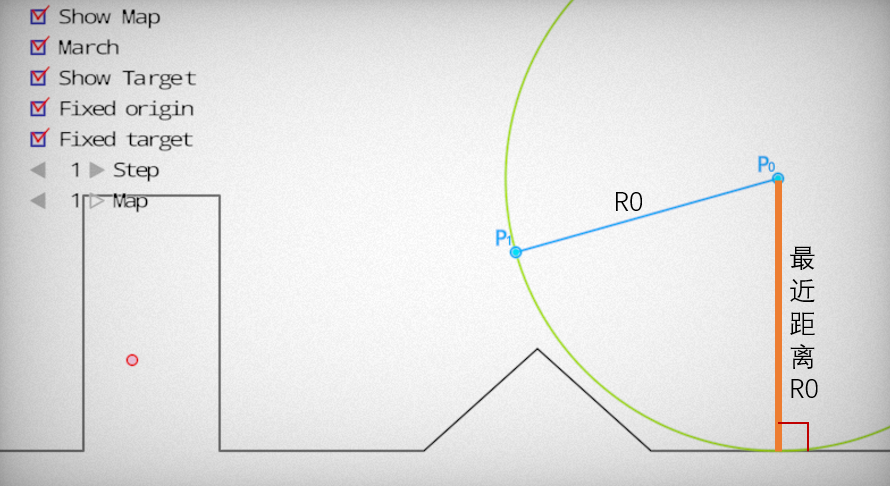

接下来，继续寻找距离$P_1$点最近的物体的最近位置，如下图中橙色线条，以这个最近距离为半径$R_1$，以$P_1$为圆心画一个圆，往目标点出发$R_1$距离，到达$P_2$点。

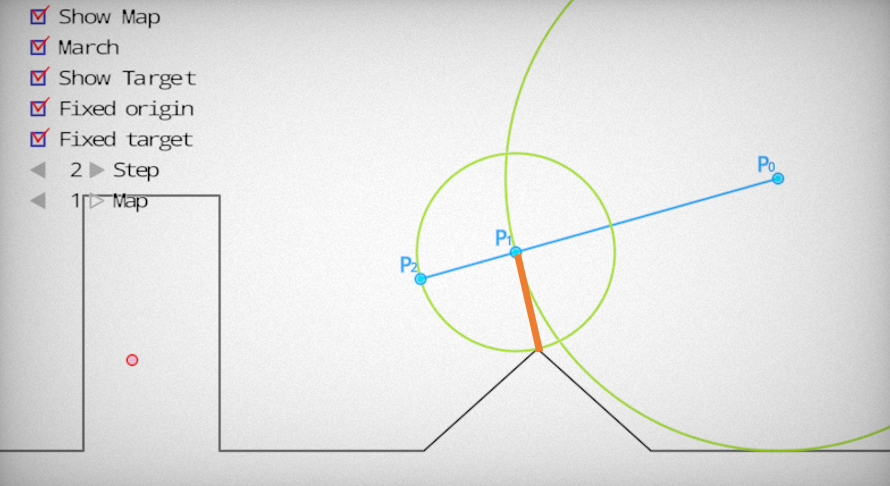

接下来也是如此。

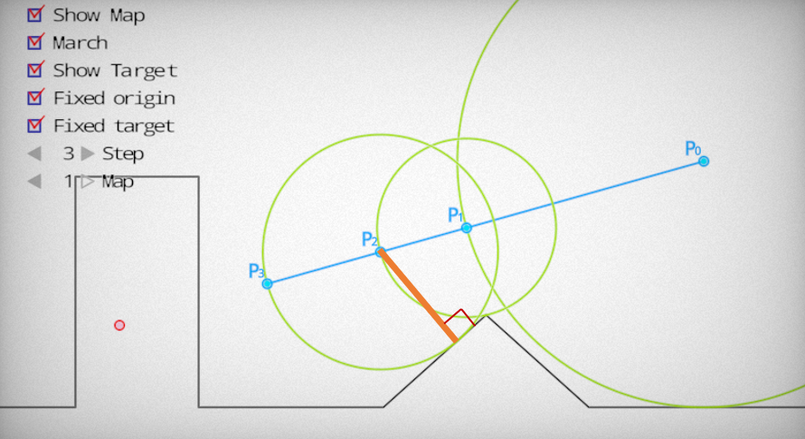

最后找到与场景中物体的交点。

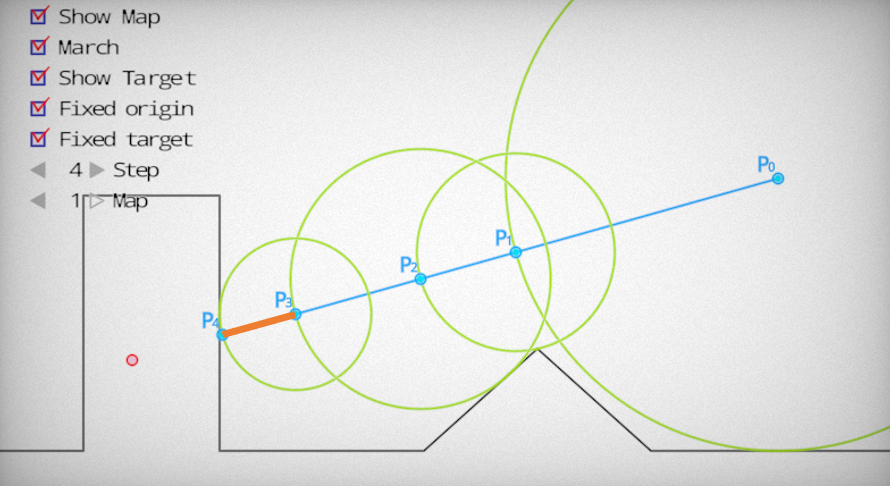

【==可以再适当补充一些知识，让大家能看懂，后面再弄也可以==】

以下是一个最为基础的Ray marching的shadertoy demo，可以直接拷贝到shadertoy（https://www.shadertoy.com/）当中运行查看结果。

```glsl
#define max_iter 100
#define max_dist 100.0 //最远抵达的距离
#define min_surface_dist 0.001

float dist(vec3 p)
{
    //与场景的最近距离
    //有一个地面和一个球
    //sphere
    vec4 s = vec4(0,1,6,1); //xyz:center w:r
    //地面高度为0
    float sphereDist = length(s.xyz - p) - s.w;
    float planeDist = p.y; //注意这里不要取绝对值，因为这是类似于SDF的概念，是允许有负值的
    return min(sphereDist, planeDist);
}

float RayMarch(vec3 ro, vec3 rd)
{
    float s = 0.0; //总的距离
    //从ro开始做ray march操作
    for(int i=0;i<max_iter;i++)
    {
        vec3 p = ro + rd * s;
        float t = dist(p);
        s += t;
        if(t<min_surface_dist || t>max_dist) break;
    }
    return s; //回传最终计算的距离
}

void mainImage( out vec4 fragColor, in vec2 fragCoord )
{
    //see this:https://stackoverflow.com/questions/58684315/shadertoy-fragcoord-vs-iresolution-vs-fragcolor
    vec2 uv = (fragCoord - 0.5*iResolution.xy) / iResolution.y;  //把UV的原点归一化到中心,但uv.x = 0.5并不在中心，注意
    vec3 col = vec3(0);
    //if(uv.x > 0.5) col = vec3(1.0,0.0,0.0); //可debug看结果
    
    //camera model
    vec3 ro = vec3(0,1,0);
    vec3 rd = normalize(vec3(uv.x, uv.y, 1));
    float d = RayMarch(ro, rd);
    d/=6.0;
    col = vec3(d);
    fragColor = vec4(col, 1.0);
}
```

此时实现的效果如下：

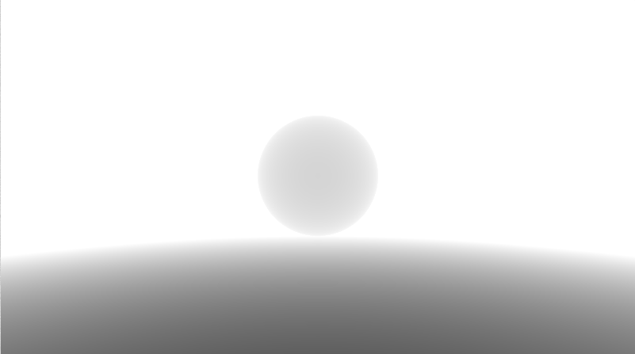


## 1.引入shading model

其实就是一个简单的lambert着色：`light = dot(lightVector, normalVector)`

其中：

- `lightVector=normalize(lightPos - surfacePos)`
- `normalVector:`用类似于求曲线导数的方式来计算，这里不展开，看函数即可。

```glsl
vec3 GetNormal(vec3 p)
{
    vec2 e = vec2(0.01,0);
    float d = dist(p);
    vec3 n = d - vec3(
        dist(p-e.xyy),
        dist(p-e.yxy),
        dist(p-e.yyx));
    return normalize(n);
}
```

此时总的代码修改为如下：

```glsl
#define max_iter 100
#define max_dist 100.0 //最远抵达的距离
#define min_surface_dist 0.001

float dist(vec3 p)
{
    //与场景的最近距离
    //有一个地面和一个球
    //sphere
    vec4 s = vec4(0,1,6,1); //xyz:center w:r
    //地面高度为0
    float sphereDist = length(s.xyz - p) - s.w;
    float planeDist = p.y; //
    return min(sphereDist, planeDist);
}

vec3 GetNormal(vec3 p)
{
    vec2 e = vec2(0.01,0);
    float d = dist(p);
    vec3 n = d - vec3(
        dist(p-e.xyy),
        dist(p-e.yxy),
        dist(p-e.yyx));
    return normalize(n);
}

float GetLight(vec3 p)
{
    vec3 lightPos = vec3(0,5,6);
    lightPos.xz += vec2(sin(iTime),cos(iTime)) * 2.0;
    vec3 l = normalize(lightPos - p);
    vec3 n = GetNormal(p);
    return clamp(dot(n, l),0.0,1.0);
}

float RayMarch(vec3 ro, vec3 rd)
{
    float s = 0.0; //总的距离
    //从ro开始做ray march操作
    for(int i=0;i<max_iter;i++)
    {
        vec3 p = ro + rd * s;
        float t = dist(p);
        s += t;
        if(t<min_surface_dist || t>max_dist) break;
    }
    return s; //回传最终计算的距离
}

void mainImage( out vec4 fragColor, in vec2 fragCoord )
{
    //see this:https://stackoverflow.com/questions/58684315/shadertoy-fragcoord-vs-iresolution-vs-fragcolor
    vec2 uv = (fragCoord - 0.5*iResolution.xy) / iResolution.y;  //把UV的原点归一化到中心,但uv.x = 0.5并不在中心，注意
    vec3 col = vec3(0);
    //if(uv.x > 0.5) col = vec3(1.0,0.0,0.0); //可debug看结果
    
    //camera model
    vec3 ro = vec3(0,1,0);
    vec3 rd = normalize(vec3(uv.x, uv.y, 1));
    float d = RayMarch(ro, rd);
    vec3 p = ro + rd * d;
    float diffuse = GetLight(p);
    col = vec3(diffuse);
    fragColor = vec4(col, 1.0);
}
```

效果为：


## 2.引入Shadow

在Raymarching的框架下做阴影是比较简单的，只需要从相机raymarch打到的点开始，往光源的方向做Ray marching，记录击中东西的距离，如果这个距离小于到光源的距离，则认为所处于阴影中。

在光线追踪章节我们提到过，我们再复习一下：如果我们此时往光源（暂定一个光源）去发射一根射线，我们可以知道在这个交点往光源的方向是否会被遮挡，如果被遮挡，那么这点就在阴影中。因此这条射线也被称为shadow ray。

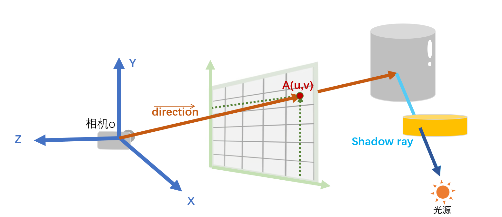

​															被遮挡，交点处是阴影

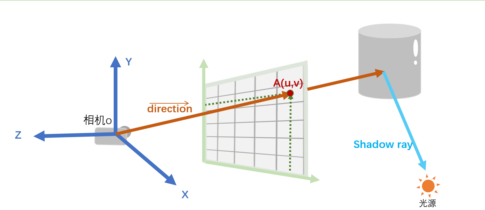

​																	未被遮挡


修改后的GetLight代码如下：

```glsl
float GetLight(vec3 p)
{
    vec3 lightPos = vec3(0,5,6);
    lightPos.xz += vec2(sin(iTime),cos(iTime)) * 2.0;
    vec3 l = normalize(lightPos - p);
    vec3 n = GetNormal(p);
    float diffuse = clamp(dot(n, l),0.0,1.0);
    float d = RayMarch(p + n * min_surface_dist, l); //p + n * min_surface_dist是为了让起点离开表面
    if(d<length(lightPos - p)) diffuse*=0.1; //算是在阴影当中
    return diffuse;
}
```

如果发现了下图这种artifact，可以适当提高离开表面的强度，比如改为`float d = RayMarch(p + n * min_surface_dist * 2.0, l);`即可。


最终的全部代码：

```glsl
#define max_iter 100
#define max_dist 100.0 //最远抵达的距离
#define min_surface_dist 0.001

float dist(vec3 p)
{
    //与场景的最近距离
    //有一个地面和一个球
    //sphere
    vec4 s = vec4(0,1,6,1); //xyz:center w:r
    //地面高度为0
    float sphereDist = length(s.xyz - p) - s.w;
    float planeDist = p.y; //
    return min(sphereDist, planeDist);
}

vec3 GetNormal(vec3 p)
{
    vec2 e = vec2(0.01,0);
    float d = dist(p);
    vec3 n = d - vec3(
        dist(p-e.xyy),
        dist(p-e.yxy),
        dist(p-e.yyx));
    return normalize(n);
}


float RayMarch(vec3 ro, vec3 rd)
{
    float s = 0.0; //总的距离
    //从ro开始做ray march操作
    for(int i=0;i<max_iter;i++)
    {
        vec3 p = ro + rd * s;
        float t = dist(p);
        s += t;
        if(t<min_surface_dist || t>max_dist) break;
    }
    return s; //回传最终计算的距离
}

float GetLight(vec3 p)
{
    vec3 lightPos = vec3(0,5,6);
    lightPos.xz += vec2(sin(iTime),cos(iTime)) * 2.0;
    vec3 l = normalize(lightPos - p);
    vec3 n = GetNormal(p);
    float diffuse = clamp(dot(n, l),0.0,1.0);
    float d = RayMarch(p + n * min_surface_dist * 2.0, l); //p + n * min_surface_dist是为了让起点离开表面
    if(d<length(lightPos - p)) diffuse*=0.1;
    return diffuse;
}

void mainImage( out vec4 fragColor, in vec2 fragCoord )
{
    //see this:https://stackoverflow.com/questions/58684315/shadertoy-fragcoord-vs-iresolution-vs-fragcolor
    vec2 uv = (fragCoord - 0.5*iResolution.xy) / iResolution.y;  //把UV的原点归一化到中心,但uv.x = 0.5并不在中心，注意
    vec3 col = vec3(0);
    //if(uv.x > 0.5) col = vec3(1.0,0.0,0.0); //可debug看结果
    
    //camera model
    vec3 ro = vec3(0,1,0);
    vec3 rd = normalize(vec3(uv.x, uv.y, 1));
    float d = RayMarch(ro, rd);
    vec3 p = ro + rd * d;
    float diffuse = GetLight(p);
    col = vec3(diffuse);
    fragColor = vec4(col, 1.0);
}
```


# 二、课时2：更多的基本形状

对应视频：https://www.youtube.com/watch?v=Ff0jJyyiVyw&t=4s

## 1.Capsule

现在我们有一点P，和一个Capsule（胶囊体），Capsule的两个端点分别为A和B，半径为r，我们要计算P到Capsule的最近距离。如下图：


在蓝色区域部分（上半部分），P到胶囊体的最近距离为$|AP|-r$ 

在红色区域部分（下半部分），P到胶囊体的最近距离为$|BP|-r$

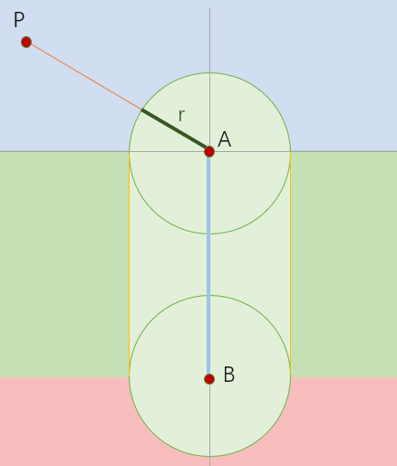

在绿色区域部分（中间部分），P到胶囊体的最近距离为$|CP|-r$，其中C为P到AB的投影点。

如下图，C点的计算方式为：$C=A + t(B-A)$，

$t=\LARGE \frac{C-A}{B-A}= \frac{AC}{AB}$ ,   

如果C在AB内，则$t=\LARGE \frac{|AC|}{|AB|}$,  

>我们可以拓展一下，如果C在AB内，或者B以下，也就是AC与AB同向，则$t=\LARGE \frac{|AC|}{|AB|}$，
>
>如果C在A以上，也就是AC与AB反向，则$t=\LARGE \frac{-|AC|}{|AB|}$

$|AC|=|AP|cos \theta $,    $  cos\theta = \LARGE \frac{{AP}\cdot{AB}}{|AP||AB|}$ 

因此 $t=\LARGE \frac{|AC|}{|AB|} =\frac{|AP|cos \theta}{|AB|} = \LARGE \frac{{AP}\cdot{AB}}{|AB|^2} = \frac{{AP}\cdot{AB}}{{AB}\cdot{AB}}$

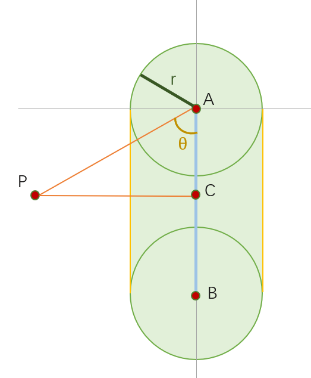

即可求出最近距离$|CP|-r$ 。 

我们希望使用1个公式而不是三个公式来简化代码，我们发现：

如果直接使用上述中间部分式子表示形状，那么将会得到一个无限延展的圆柱体，其中C1点对应的t<0.（实际上应该对应右图中不区分区域的图）

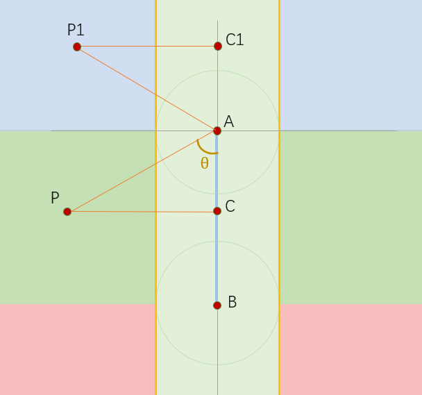


但是我们要表示胶囊体的时候，C1点的t值应该是0. 如下图，当t=0的时候，C点为：$C=A + t(B-A)=A$，最近距离$|CP|-r=|AP|-r$ 。 即我们所求的蓝色区域（上半部分）最近距离。

刚才我们提到，在上半部分时，$C=A + t(B-A)$ 中的t是小于0的，那么我们只需要当t<0时，让t=0即可。

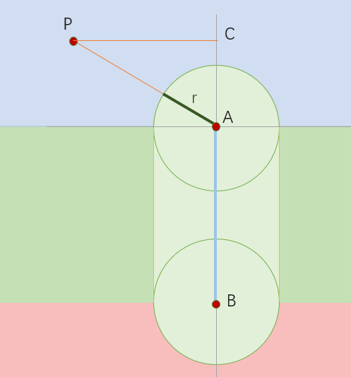


同理，当t=1的时候，C点为：$C=A + t(B-A)=B$，最近距离$|CP|-r=|BP|-r$ 。 即我们所求的蓝色区域（上半部分）最近距离。只需要当t>1时，让t=1即可。

即 $t = clamp(t, 0, 1)$ (clamp函数是将t限制在0和1之间)。


我们总结一下，欲计算点P到Capsule的最近距离：

需要计算$|CP|-r$，其中C为P到AB的投影点。

$C=A + t(B-A)$，$t = \LARGE \frac{{AP}\cdot{AB}}{{AB}\cdot{AB}}$，$t = clamp(t, 0, 1)$


此时用代码来表示SDS_Capsule：

```glsl
float sdCapsule(vec3 p, vec3 a, vec3 b, float r)
{
    vec3 ab = b-a;
    vec3 ap = p-a;
    float t = dot(ap, ab) / dot(ab, ab);
    t = clamp(t, 0.0, 1.0);
    vec3 c = a + t * ab;
    return length(p-c) - r;
}
```

此时替换上一节的dist函数，计算和场景最近的距离（去掉sphere，不渲染sphere了）：

```glsl
float dist(vec3 p)
{
    //与场景的最近距离
    //有一个地面和一个球
    //sphere
    vec4 s = vec4(0,1,6,1); //xyz:center w:r
    //地面高度为0
    float sphereDist = length(s.xyz - p) - s.w;
    float planeDist = p.y; //
    float sc = sdCapsule(p,vec3(0,1,6), vec3(1,2,6), 0.2); //新增的渲染capsule
    return min(sc, planeDist);
}
```

渲染的结果如下：


可以看到，就能够利用SDF得到Capsule的渲染结果了。


## 2.Torus

这里我们假设Torus所处于原点，$R$表示大圆的半径，$r$表示小圆的半径，Torus的生成过程可以看作是竖着的小圆绕着大圆的边进行旋转得到的。示意图如下：

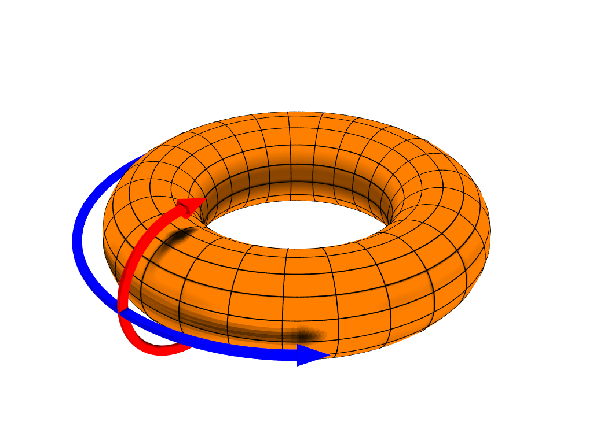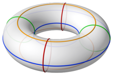

图源：https://en.wikipedia.org/wiki/Torus

现在我们有一点P，和一个Torus（圆环），我们要计算P到Torus的最近距离d。如下图：

$d=|PC|-r$，

$|PC|=\sqrt{x^2+y^2}$ ，可以用shadertoy中的vec2(x,y)表示。

其中 $x=P_{xz}-R$ ，  $y=P_y$


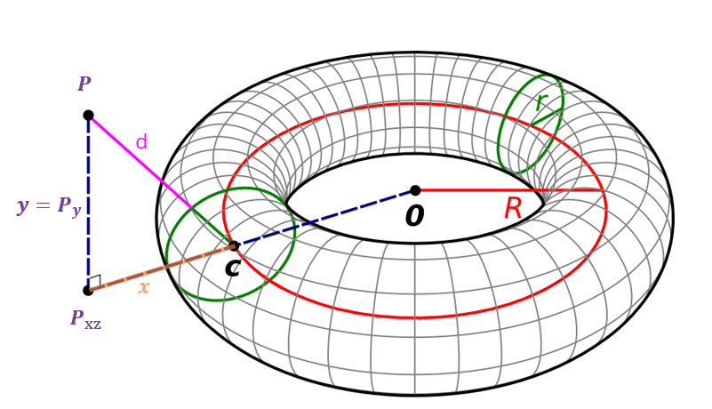

图参考：https://math-physics-problems.fandom.com/wiki/Measurement_of_the_Torus


综上，$|PC|=length(vec2(x,y))$是比较直观的，通过勾股定理即可得到。此时sdTorus的代码如下：

```glsl
float sdTorus(vec3 p, vec2 r)  //r记录大圆和小圆的r
{
    float x = length(p.xz) - r.x; //r.x是大圆的半径
    return length(vec2(x, p.y)) - r.y;
}
```


### 有趣的地方

现在我们就可以把这个Torus加入到现在的场景里了，具体如下：

```glsl
float dist(vec3 p)
{
    vec4 s = vec4(0,1,6,1); //xyz:center w:r
    float sphereDist = length(s.xyz - p) - s.w;
    float planeDist = p.y; //
    
    float sc = sdCapsule(p,vec3(0,1,6), vec3(1,2,6), 0.2);
    float td = sdTorus(p, vec2(1.5, 0.5));
    float d = min(sc, planeDist);
    d = min(d, td); //可以看到，我们对SDF连续求min可以模拟加入物体的过程，比如min(a,b,c)则abc都会呈现在场景里
    return d;
}
```

此时渲染结果为：

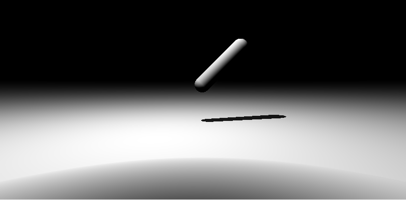

之所以会这样，是因为我们的Torus的SDF计算公式默认其位于世界的正中心。**有什么办法能平移这个Torus呢？**这就是巧妙的地方了，我们可以直接修改传入的p值，此时td计算那行修改如下：

```glsl
float td = sdTorus(p-vec3(0,0.5,6), vec2(1.5, 0.3));
```

修改后的结果如下：

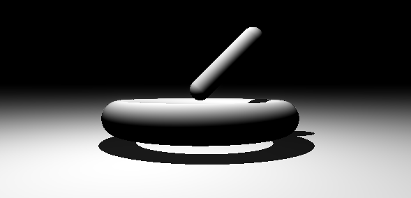

可以看到，顺利把Torus进行了平移，确实很巧妙。


## 3.Box

对于一个在原点的box，我们可以定义其width，height和depth（分别用size.x，size.y, size.z来表示）。

这里需要解释一下，有两种情况：

- 先看蓝色区域中，假设$p$位于立方体八个角的”外侧“，此时$d_x = abs(p.x) - size.x$，$d_y = abs(p.y) - size.y$，$d_z = abs(p.z) - size.z$，（这里的abs是取绝对值），此时$d=dx^2 +dy^2 +dz^2$ , 也就是 $d=length(abs(p) - size)$，注意这里面有三个轴，即$abs(p) - size$对应上图的$dx^2+dy^2+dz^2$，所以$d$的值相当于对这个取根号操作，即上式；

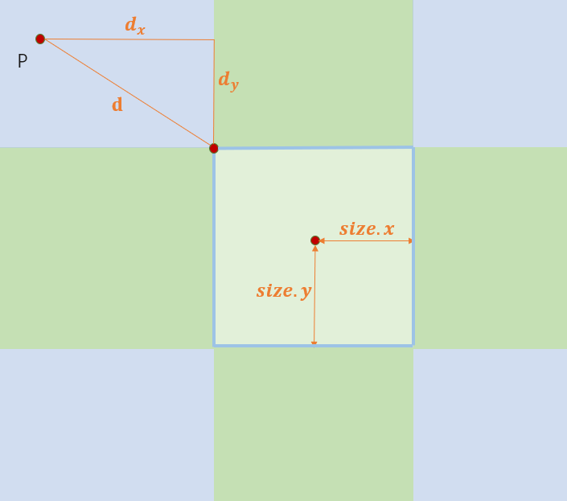

- 再看绿色区域中，此时距离box的距离不再是距离某个角的距离，而是投影上去的距离。比如上图，这种情况下计算出来的$dy = abs(p.y) - size.y$会是一个<0的值，我们就可以将其clamp到0。此时dx，dy，dz任何一个分量<0的时候都会被clamp到0。

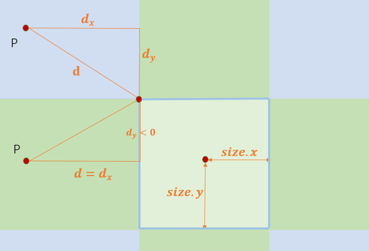

所以最终计算的式子为上图上面那个式子。用代码实现就是：

```glsl
float sdBox(vec3 p, vec3 size)
{
    return length(max(abs(p)-size, 0.0));
}
```

当然sdBox也可以加进来，这里就不展示了，最终代码里有。

> 【补充】其实严格来说应该是下面这个计算函数：
>
> ```glsl
> float sdBox(vec3 p, vec3 size)
> {
>  	p = abs(p)-size;
> 	return length(max(p, 0.))+min(max(p.x, max(p.y, p.z)), 0.);
> }
> ```
>
> 可以看到，相比于上面的计算函数，多了一项`+min(max(p.x, max(p.y, p.z)), 0.)`，这一项是为了处理在box内部的情况，此时SDF应当为距离表面的最近距离，且为负数。此时一定是在内部距离某个平面是最近的（不可能是距离某个角点最近），且`p.x,p.y,p.z`都是负值，所以可以找他们中最大的值，也就是哪个离0最近，即abs(p)距离size最近，即离size规定的六个面的最近距离。
>
> p是正值的情况，对应点在box的外面，此时`min(max(p.x, max(p.y, p.z)), 0.)`是0，不会干扰前面的计算结果。
>
> **这里要看对性能的要求程度，如果运行初始版本的sdBox不会出现什么artifact，用初始版本也可以，不需要用【补充】中的版本。要根据实际项目做决定。**


## 4.Cyclinder

这个是相对复杂一些的，有点抽象。回忆一下前面的Capsule，如果我们把对$t$的clamp操作去掉：


$d=|CP|-r$，其中C为P到AB的投影点。

$C=A + t(B-A)$，$t = \LARGE \frac{{AP}\cdot{AB}}{{AB}\cdot{AB}}$，

如果直接使用上述中间部分式子表示形状，那么将会得到一个如下无限延展的圆柱体

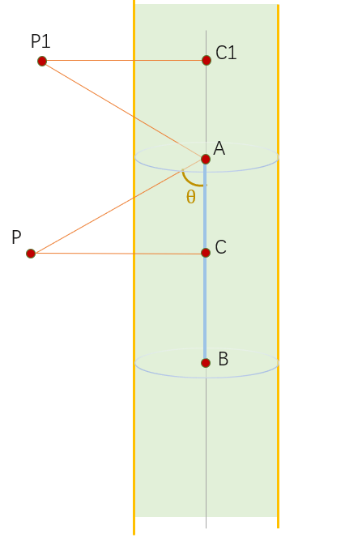

此时没有`clamp(t,0.0,1.0)`这一步操作，我们会得到一个无限延展的圆柱体。但这并不是我们想要的，我们想要让上下两个面封口。考虑下面的两种情况：

**情况1**

先来看图①，我们要求的是浅蓝色区域中的点P距离圆柱体（Cylinder）的最近距离，即图中的$e$。

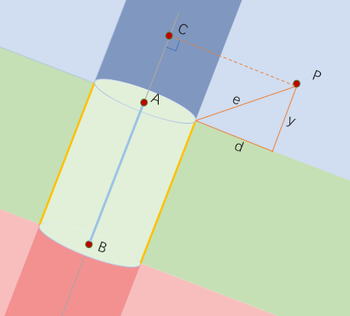

​																	图①

类似于box的计算方式（勾股定理，计算出d和y就可以算出e），此时$d$项比较简单，就是在Capsule章节我们计算得到的d，也就是$d=|CP|-r$,  即$length(p-c)-radius$，其中$c=A + t(B-A)$。那么$y$项怎么算？

> 计算$y$项：
>
> 如果位于A点上方浅蓝色区域，即$t<0,y=|AC|=|AB|\frac{|AC|}{|AB|}=|AB|(-t)$，
>
> 如果位于B点下方浅粉色区域，即$t>1, y=|BC|=|AC|-|AB|=|AB|\frac{|AC|-|AB|}{|AB|}=|AB|(t-1)$，
>
> 我们希望将这两种情况合并：
>
> （1）首先，回忆一下$t$的定义，$C=A + t(B-A)$, 当C在$A$点处$t=0$，在$B$点处$t=1$，
>
> 如果我们做了$t_1=t-0.5$的操作，则A点处 $t_1=-0.5$，B点处 $t_1=0.5$，并且从A到B逐渐增加。
>
> 此时我们再做一步`t2=abs(t-0.5)`的操作，于是AB的中点位置$t_2=0$，朝A,B两侧 t2 逐渐增大，且到达A点或B点的时候$t_2=0.5$。
>
> 最后，我们再对`t2=abs(t-0.5)`做一次-0.5的操作，公式为`t3=abs(t-0.5)-0.5`，此时聪明的地方就来了：在AB中心的值会变为$t_3=-0.5$，A，B两点会变为$t_3=0$，而A上侧和B下侧都有$t_3>0$。
>
> 
>
> 由此，如果令$y = t_3 |AB|$:
>
> 如果位于A点上方区域，即$t<0,t3=abs(t-0.5)-0.5=-(t-0.5)-0.5=-t$，$y=|AB|(-t)$，
>
> 如果位于B点下方区域，即$t>1,t3=abs(t-0.5)-0.5=(t-0.5)-0.5=t-1$，$y=|AB|(t-1)$，则包含了上下两种情况。
>
> 
>
> 因此，$y$的计算公式可以写作$y=t_3 * length(AB)$   即：
> $$
> y=(abs(t-0.5)-0.5) * length(AB);
> $$


所以理论上，$e$的计算结果为$e = \sqrt{d^2 +y^2}$,即
$$
e = length(d,y)
$$


**情况2**

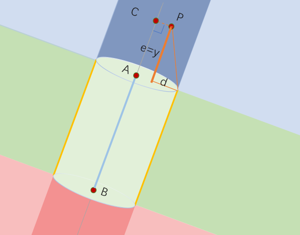

​																图②

但注意看图②深蓝色区域这种情况，和Box非常类似，此时$d=|CP|-r<0$ ，此时的距离是和上平面的垂直距离，应该是图②对应的$p$点与投影到上平面的点之间的距离 $y$ 。

图中的B点下方的深粉色区域计算方法同上。


**情况3**

如下图③，在深绿色区域，P点距离圆柱最近的距离是$d=|CP|-r$，此时$y<0$。

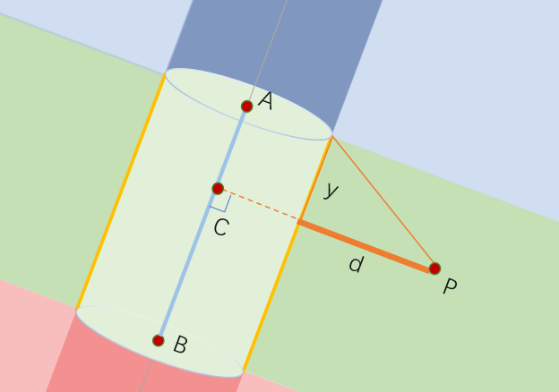

​																图③


我们统一一下，这里的trick和box那一节的类似，更新后的$e$如下：
$$
e=\sqrt{max(d,0)^2+max(y,0)^2}
$$
代码中可以写成：
$$
e = length(max(vec2(d, y), 0));
$$
**情况4**

那么，是不是这样就可以涵盖所有的情况了呢？**很遗憾还是不能**。来看下面内部的情况：

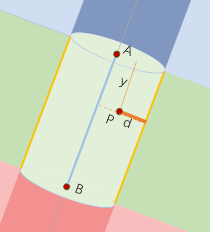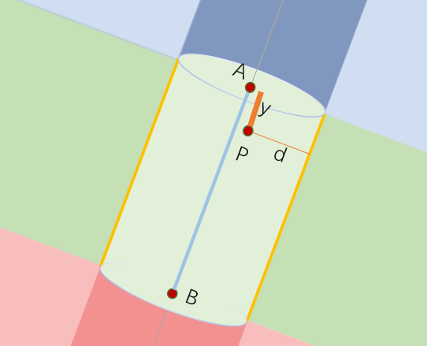


也就是说，当点$p$位于cyclinder的内部的时候，之前的计算是无法涵盖这种情况的。因为其实有可能如上图右侧，此时距离cyclinder表面的距离不再是距离侧面的距离，而是距离上下表面的距离（意味着，此时$p$距离圆柱上下表面更近），定义一个interior distance：i
$$
i = min(max(d, y), 0)
$$
来考虑几种情况：

- $d>0, y>0$，对应情况1， 此时在圆柱体外侧，并且在A的上侧或者B的下侧，此时$i=0,D=e=\sqrt{d^2 +y^2}$

情况1

- $d<0, y<0$，此时就对应情况4，我们要比较$d$和$y$哪个的绝对值更小，即比较$d$和$y$的最大值；并且这个时候来计算$e$，会发现$e=0,D=i$（从$e$的计算公式可知，$e = length(max(vec2(d, y), 0));$，d和y都是负数） （浅绿色圆柱内部）

情况4

- $d>0, y<0$，对应情况3，此时对应在圆柱体的外侧，但介于A所在上平面和B所在下平面之间，$i=0,D=e=d$；

情况3

- $d<0, y>0$，对应情况2，此时对应上上图②所示的情况，依然$i=0,D=e=y$；

情况2

综上，最终的距离就是$i+e$。
$$
t =\frac{{AP}\cdot{AB}}{{AB}\cdot{AB}} \\
C=A + t(B-A)\\
d=|CP|-r\\
\\
y=(abs(t-0.5)-0.5) * |AB|\\
e=\sqrt{max(d,0)^2+max(y,0)^2}\\
i = min(max(d, y), 0)\\
\\
D=i+e
$$


写成代码如下：

```glsl
float sdCylinder(vec3 p, vec3 a, vec3 b, float r)
{
    vec3 ab = b-a;
    vec3 ap = p-a;
    float t = dot(ap, ab) / dot(ab, ab);
    vec3 c = a + t * ab;
    float d = length(p-c) - r;
    float y = (abs(t-0.5)-0.5) * length(ab);
    float e = length(max(vec2(d, y), 0.0));
    float i = min(max(d, y), 0.0);
    return i+e;
}
```

此时效果如下：

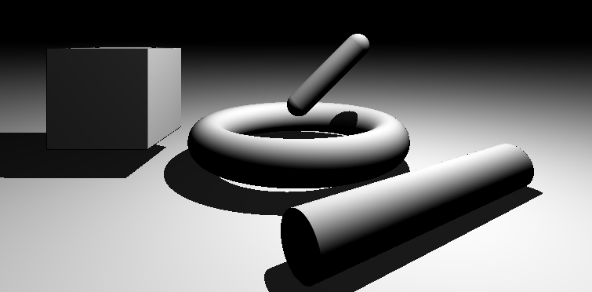

> 补充：【面试题】如何判断一个点在cyclinder的内部还是外部？
>
> 其实根据上面的公式和总结已经很明显了，对于内部的点来说有$d<0$且$ y<0$。


## 最终代码

```glsl
#define max_iter 100
#define max_dist 100.0 //最远抵达的距离
#define min_surface_dist 0.001

float sdCapsule(vec3 p, vec3 a, vec3 b, float r)
{
    vec3 ab = b-a;
    vec3 ap = p-a;
    float t = dot(ap, ab) / dot(ab, ab);
    t = clamp(t, 0.0, 1.0);
    vec3 c = a + t * ab;
    return length(p-c) - r;
}

float sdCylinder(vec3 p, vec3 a, vec3 b, float r)
{
    vec3 ab = b-a;
    vec3 ap = p-a;
    float t = dot(ap, ab) / dot(ab, ab);
    vec3 c = a + t * ab;
    float d = length(p-c) - r;
    float y = (abs(t-0.5)-0.5) * length(ab);
    float e = length(max(vec2(d, y), 0.0));
    float i = min(max(d, y), 0.0);
    return i+e;
}

float sdTorus(vec3 p, vec2 r)  //r记录大圆和小圆的r
{
    float x = length(p.xz) - r.x; //r.x是大圆的半径
    return length(vec2(x, p.y)) - r.y;
}


float sdBox(vec3 p, vec3 size)
{
    return length(max(abs(p)-size, 0.0));
}
float dist(vec3 p)
{
    //与场景的最近距离
    //有一个地面和一个球
    //sphere
    vec4 s = vec4(0,1,6,1); //xyz:center w:r
    //地面高度为0
    float sphereDist = length(s.xyz - p) - s.w;
    float planeDist = p.y; //
    float sc = sdCapsule(p,vec3(0,1,6), vec3(1,2,6), 0.2);
    float td = sdTorus(p-vec3(0,0.5,6), vec2(1.5, 0.3));
    float bd = sdBox(p-vec3(-3, 1.2, 6),vec3(0.75));
    float cyclinderDist = sdCylinder(p,vec3(0,0.3,3), vec3(3,0.3,5), 0.3);
    float d = min(sc, planeDist);
    d = min(d, td);
    d = min(d, bd);
    d = min(d, cyclinderDist);
    return d;
}


vec3 GetNormal(vec3 p)
{
    vec2 e = vec2(0.01,0);
    float d = dist(p);
    vec3 n = d - vec3(
        dist(p-e.xyy),
        dist(p-e.yxy),
        dist(p-e.yyx));
    return normalize(n);
}


float RayMarch(vec3 ro, vec3 rd)
{
    float s = 0.0; //总的距离
    //从ro开始做ray march操作
    for(int i=0;i<max_iter;i++)
    {
        vec3 p = ro + rd * s;
        float t = dist(p);
        s += t;
        if(t<min_surface_dist || t>max_dist) break;
    }
    return s; //回传最终计算的距离
}

float GetLight(vec3 p)
{
    vec3 lightPos = vec3(0,5,6);
    lightPos.xz += vec2(sin(iTime),cos(iTime)) * 2.0;
    vec3 l = normalize(lightPos - p);
    vec3 n = GetNormal(p);
    float diffuse = clamp(dot(n, l),0.0,1.0);
    float d = RayMarch(p + n * min_surface_dist * 2.0, l); //p + n * min_surface_dist是为了让起点离开表面
    if(d<length(lightPos - p)) diffuse*=0.1;
    return diffuse;
}

void mainImage( out vec4 fragColor, in vec2 fragCoord )
{
    //see this:https://stackoverflow.com/questions/58684315/shadertoy-fragcoord-vs-iresolution-vs-fragcolor
    vec2 uv = (fragCoord - 0.5*iResolution.xy) / iResolution.y;  //把UV的原点归一化到中心,但uv.x = 0.5并不在中心，注意
    vec3 col = vec3(0);
    //if(uv.x > 0.5) col = vec3(1.0,0.0,0.0); //可debug看结果
    
    //camera model
    vec3 ro = vec3(0,2,0);
    vec3 rd = normalize(vec3(uv.x, uv.y-0.2, 1));
    float d = RayMarch(ro, rd);
    vec3 p = ro + rd * d;
    float diffuse = GetLight(p);
    col = vec3(diffuse);
    fragColor = vec4(col, 1.0);
}
```

至此，我们使用RayMarching+SDF实现了一些基本的几何形状。这些基本的primitives可以构成更多好玩的形状（硬表面模型）。

------


# 三、RayMarching: Basic Operators

对应视频：https://www.youtube.com/watch?v=AfKGMUDWfuE

本节会介绍布尔运算，以及SDF的融合，以及一些其他好玩的操作，将基础图形结合起来。

首先，我们修改一下dist函数，让场景中只出现一个box：

```glsl
float dist(vec3 p)
{
    float pd = p.y;
    float bd = sdBox(p-vec3(0,1,0),vec3(1,1,1));
    float d = min(pd, bd);
    return d;
}
```

同时，我们加入了鼠标控制相机旋转的逻辑，这里基本原理就是用旋转矩阵控制相机旋转，具体的细节可以参考https://www.youtube.com/watch?v=PBxuVlp7nuM这个视频。

> ==todo：这个视频讲述了如何在shader toy中描绘相机模型，暂时不是本节课的核心，先不整理进来，后面有需求再看和整理。==

修改mainImage函数如下：

```glsl
vec3 R(vec2 uv, vec3 p, vec3 l, float z) 
{
    vec3 f = normalize(l-p),
        r = normalize(cross(vec3(0,1,0), f)),
        u = cross(f,r),
        c = p+f*z,
        i = c + uv.x*r + uv.y*u,
        d = normalize(i-p);
    return d;
}

mat2 Rot(float a) {
    float s = sin(a);
    float c = cos(a);
    return mat2(c, -s, s, c);
}

void mainImage( out vec4 fragColor, in vec2 fragCoord )
{
    vec2 uv = (fragCoord-.5*iResolution.xy)/iResolution.y;
	vec2 m = iMouse.xy/iResolution.xy;
    
    vec3 col = vec3(0);
    
    vec3 ro = vec3(0, 4, -5);
    ro.yz *= Rot(-m.y+.4);
    ro.xz *= Rot(m.x*6.2831);
    
    vec3 rd = R(uv, ro, vec3(0,0,0), .7);

    float d = RayMarch(ro, rd);
    
    if(d<max_dist) {
    	vec3 p = ro + rd * d;
    
    	float dif = GetLight(p);
    	col = vec3(dif);
    }
    
    col = pow(col, vec3(.4545));	// gamma correction
    
    fragColor = vec4(col,1.0);
}
```

此时运行，就可以看到一个Box在场景中，并且移动鼠标可以旋转相机观察各个方向的结果。**后面的内容基于本程序运行，这样可以更好地观察基础运算的效果。**


## 1.平移和旋转物体

在计算SDF之前可以修改$p$点的坐标，以实现平移和旋转的效果，比如以下的dist函数：

```glsl
mat2 Rot(float a) 
{
    float s = sin(a);
    float c = cos(a);
    return mat2(c, -s, s, c);
}

float dist(vec3 p)
{
    float pd = p.y;
    vec3 bp = p - vec3(0,1,0); //box position
    bp.xz *= Rot(iTime);
    float bd = sdBox(bp,vec3(1,1,1));
    float d = min(pd, bd);
    return d;
}
```

此时运行，就会发现立方体在绕着Y轴进行旋转。Rot对应旋转矩阵（绕Y轴），这一点可以参考前面的空间变换章节或者这篇维基百科文章：https://zh.wikipedia.org/zh-cn/%E6%97%8B%E8%BD%AC%E7%9F%A9%E9%98%B5

> 在shadertoy中，按照这里的说法：https://stackoverflow.com/questions/24593939/matrix-multiplication-with-vector-in-glsl，m是矩阵，v是向量。m * v => matrix of math * vector，这是我们正常学习的。对于向量在左，矩阵在右的情况则是：
>
> ```
> v * m => v^T * m = (M^T * v)^T
> => transpose of matrix of math * vector
> ```
>
> 所以其实是一样的，这里的矩阵依旧是按列优先的旋转矩阵，只是向量变成了转置后的行向量，在内部做乘法的时候会把矩阵也转置。
>
> bp.xz在这里是行向量，不是列向量，但是矩阵mat2(10,20,30,40)是按照列向量排布的，意味着mat2(10,20,30,40)表示10，20是第一列，30 40是第二列，写代码的时候虽然是`bp.xz *= Rot(iTime)`，矩阵在右侧，但其实矩阵会被转置计算，不会造成错误。
>
> **只需要记住，在glsl中（即shadertoy的语言），矩阵是列优先的，而glsl中做矩阵乘法的时候，矩阵写在左侧和右侧问题都不大，内部会做处理。shadertoy中，我们可以用（向量*矩阵）的方式来做，结果并不影响。**

此时运行程序，就可以看到立方体在自发性地绕着Y轴旋转。


## 2.一些基本运算

### （1）布尔运算

在前面的几何篇中，我们有提及到布尔运算。布尔运算的常见算子有并、交和差集三种：

- 并：将两个几何体合并为一个；
- 交：找出两个几何体公共的部分；
- 差集：$A-B$意味着从$A$中减去包含有$B$的部分。

在这一节中，会介绍这三种运算在RayMarching和SDF系统中的应用。

#### （a）差集运算

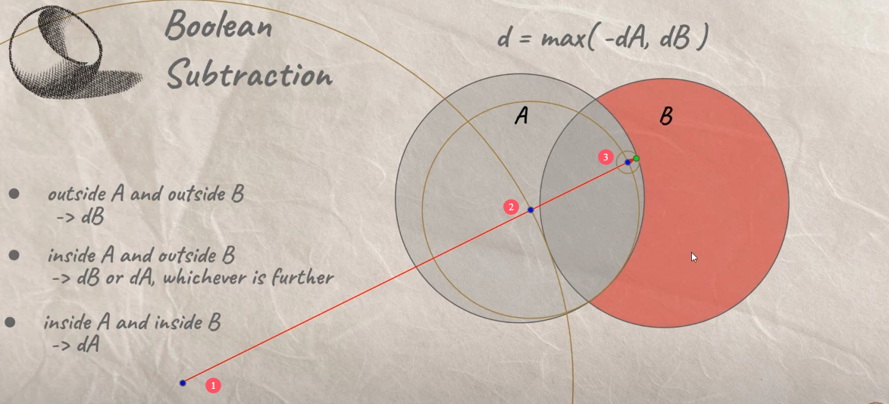

差集的SDF计算公式为$d(B-A)=max(-dA, dB)$

看上图，红色区域对应的是B-A的结果。假设Ray Marching的起点为①表示的点，每次Ray marching计算得到的点是$p$点，方向是红色线的方向：

- 若$p$位于A表面和B表面的外侧（例如①处），根据上面公式，此时$dA>0,dB>0$，因此$dB>-dA$，结果是$dB$；
- 若$p$位于A表面的内侧，B表面的外侧（例如②处），根据上面公式，此时$dA<0,dB>0$，这是就要看$-dA$和$dB$哪个更大了，例如②的情况显然离B更近，因此下一轮ray marching的距离应该是$dA$，从而会进入B的内部；
- 若$p$位于A表面的内侧，并且位于B表面的内侧（例如③处），根据上面公式，此时$dA<0,dB<0$，一定有$-dA>dB$，返回的是距离A表面的最近距离；
- 如果$p$位于A表面的外侧，B表面的内侧，此时$-dA$和$dB$都是负数，取max就相当于看哪个的绝对值更小，一样能得到正确答案（可以自己尝试一下）；

根据上面三轮Ray marching，计算出的结果就是B-A的值。不妨在代码中尝试一下，我们在上面的立方体处用SDF做一个球体：

```glsl
float dist(vec3 p)
{
    float pd = p.y;
    float bd = sdBox(p-vec3(0,1,0),vec3(1,1,1));
    float sdfSphere = sdSphere(p-vec3(0,1,0), vec3(0,1,0),2.0);
    float d=min(bd, sdfSphere);
    d = min(d, pd);
    return d;
}
```

此时结果为：

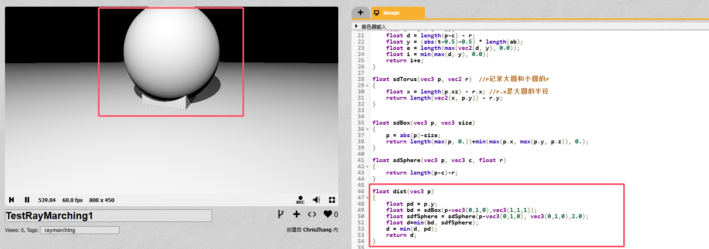

容易发现，取SDS：`min(A,B)`其实就是求并集的操作。结果如上图。假设我们只修改dist函数中的一行：

```glsl
float d=max(bd, -sdfSphere);
```

就会得到下面的结果：


可见，SDF+Ray marching的工作流，可以让之前文章里提到的布尔运算变得非常简单，上述结果就相当于box - sphere（做差集）。那么如果是`float d=max(-bd, sdfSphere);`呢？不难想到应该是sphere - box，结果如下：


也就是说，现在变成了从Sphere中挖去了Box。


#### （b）交集运算

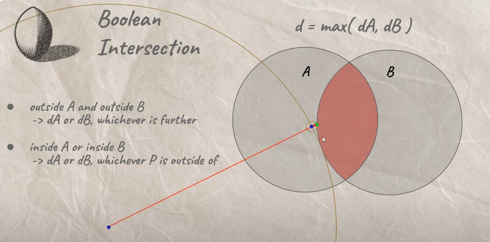

此时dA和dB交集运算后的SDF结果为：max(dA, dB)。考虑三种情况：

- 如果待计算SDF的点$p$在表面A和表面B的外面，则距离谁更远就Ray march更远的距离，在上例中就是dB的距离；
- 如果$p$在某个表面内侧，而在另一个表面的外侧，则结果一定是正值的SDF。比如此时$p$在A表面的内侧，但是在B表面的外侧，则会继续朝着B表面步进；
- 如果$p$在两个表面的内侧，则也是类似的，可以自行验证。

依然是上面的立方体和球体的例子，如果改成了：

```glsl
float d=max(bd, sdfSphere);
```

则结果如下：


也就是成功取了交集运算。


#### （c）并集运算

虽然并集运算放在了最后，但其实并集是很容易的，在前面已经总结过了，就是两个值取min操作即可。每次我们在场景中加入新的物品也是用的取min操作。


### （2）平滑布尔运算

在前面的学习中，我们学到了基本的并集、交集和差集运算，并给出了他们的公式：

- $A \cup B$：`min(dA,dB)`;
- $A \cap B$：`max(dA，dB)`;
- $A-B$：`max(dA,-dB)`；

有时，我们可能想要平滑这种运算，让其变得更柔和。举个例子，还是一个box和一个sphere的例子，直接求并集：

```glsl
float dist(vec3 p)
{
    float pd = p.y+1.0;
    float bd = sdBox(p-vec3(0,1,0),vec3(1,1,1));
    float sdfSphere = sdSphere(p-vec3(2,0,0), vec3(0,1,0),2.0);
    float d=min(bd, sdfSphere);
    d = min(d, pd);
    return d;
}
```

这时的结果如下图：


可以看到，融合是比较生硬的。这时神奇的地方就来了，我们修改一下前面的min和max操作，变为下面的函数：

```glsl
float smin( float a, float b, float k )
{
	float h = clamp( 0.5 + 0.5*(b-a)/k, 0.0, 1.0 );
	return mix( b, a, h ) - k*h*(1.0-h);
}

float smax( float a, float b, float k )
{
	float h = clamp( 0.5 + 0.5*(b-a)/k, 0.0, 1.0 );
	return mix( a, b, h ) + k*h*(1.0-h);
}
```

这两个函数的细节我们并不需要非常关心，大致原理就是做了一个平滑操作。使用了这两个函数之后，会使得布尔运算变得平滑，从而提升视觉效果。比如我们把上面的min函数改成smin函数，令k=0.2，看一下效果：

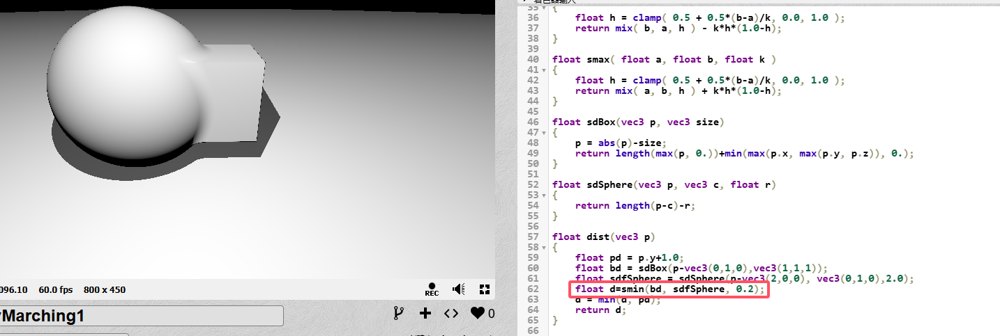

此时可以看到，布尔运算的结果变得平滑了很多。随着smin/smax函数传入的k值不断增大，效果也会越来越平滑。


## 3.最终Demo

这里我们用Shadertoy制作了一个利用Ray marching技术+SDF生成的《绝区零》中的邦布，感兴趣的读者可以去shadertoy官网上看下述链接：

https://www.shadertoy.com/view/lcKfD3

效果如下：


比较重要的函数（涉及到本课时学习的内容）是`vec2 map( vec3 p )`这个函数。其他几何体的SDF可以参阅这篇博客：https://iquilezles.org/articles/distfunctions/，里面详细介绍了在Raymarching+SDF的架构下，我们可以做出哪些神奇的操作。