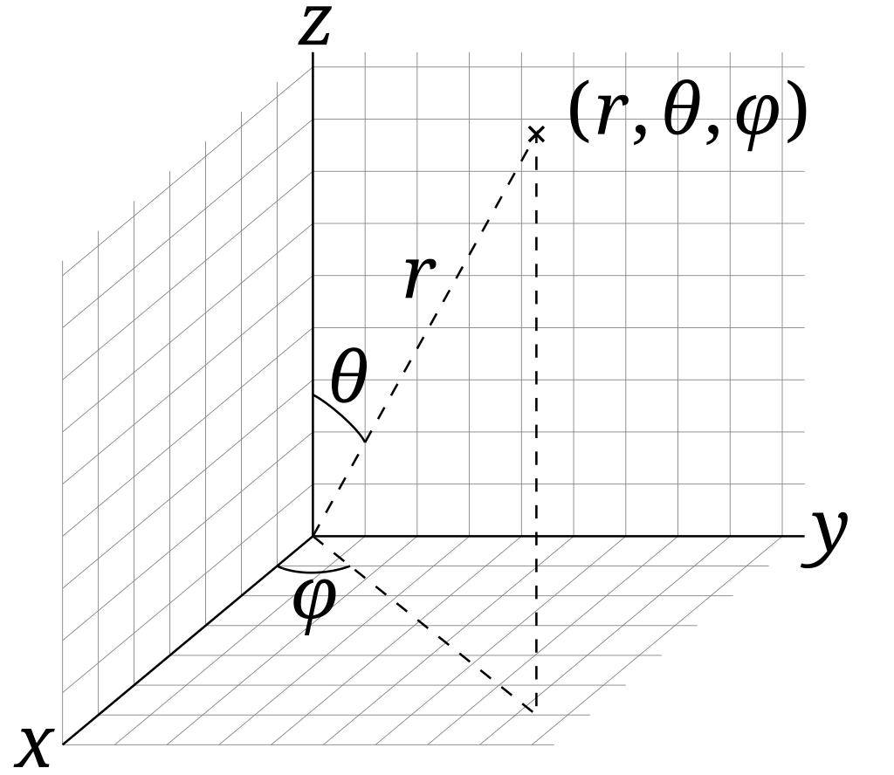
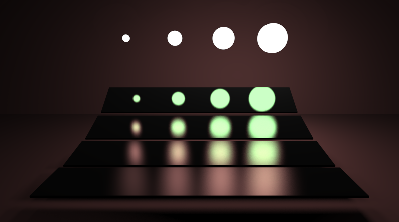

# 重要性采样和路径追踪实践

# 一、重要性采样

## 1.回顾蒙特卡洛路径追踪

在前面的章节中，我们介绍了蒙特卡洛路径追踪的方法来计算全局光照。回顾一下蒙特卡洛积分的计算方式：
$$
F_N=\frac{1}{N} \sum_{i=1}^N \frac{f(X_i)}{p(X_i)} \quad  X_k \sim pdf(x)
$$
这里的$p$是概率密度函数，可以使用均匀半球采样或者是自定义的概率密度函数。**这里就衍生了两个问题：**

- （1）对于每一种概率密度$p$函数，我要怎么写代码来对半球进行采样呢？意味着我要采样的向量$v$的方向是什么？
- （2）不同的$p$带来的结果是否不同？什么样的概率密度函数$p$是更好的？

为了解决上述（2）问题，我们就需要介绍**重要性采样。**但在这之前，我们先把（1）问题的解决思路介绍一下。


## 2.如何从一个给定的概率分布函数$p$中采样？

**问题描述：**设随机变量$X \sim pdf(x)$，记累积分布函数$F_X(x)=P(X \le x)$，现在希望能够从该概率分布中进行采样。

**方法：**假设随机变量$Y \sim U(0,1)$，此时对于随机变量$Y$来说，其累积分布函数为:$P(Y<=y) = y$。于是可以构造另一随机变量$Z = F_X^{-1}(Y)$，此时有：
$$
P(F_X^{-1}(Y)\le x) = P(Y \le F_X(x)) = F_X(x)
$$
因此新构造出来的随机变量$Z$恰好符合随机变量$X$的分布，因此想要对随机变量$X$进行采样，可以转化为对随机变$Z$进行采样，而对后者进行采样是颇为直接的，只用两步：

- （1）在（0，1）内均匀采样得到一个值$y_i$
- （2）对其进行$F_X^{-1}(y_i)$的逆分布函数变换即可。

**看起来会比较抽象，我们马上会举一个例子辅助说明。**上述方法一般被称为逆分布函数方法，虽然只介绍了对一维随机变量的采样，但拓展到高维也是比较直接的。比如说现在要生成二维随机变量$(\theta,\phi) \sim pdf(\theta,\phi)$，则解决方案是可以先根据边缘概率密度$pdf(\theta)$生成$\theta_i$的采样，再根据条件概率密度$pdf(\phi|\theta)$生成对于$\phi_i$的采样即可。对于更高维的情况来说也是类似。

> 也可以参考维基百科这里的介绍：https://zh.wikipedia.org/zh-cn/%E9%80%86%E5%8F%98%E6%8D%A2%E9%87%87%E6%A0%B7


### （1）举例：均匀半球采样

根据前文的介绍，在均匀半球采样的时候，对立体角求积分使用的概率密度函数$p = 1/2\pi$。显然，概率密度函数在积分域上求解的积分值应该为1（因为总的概率应该是1）。现在的问题是虽然知道了立体角的概率密度，但没有办法从立体角转化到三维坐标，自然也不知道该怎么写代码。但之前在介绍球面坐标的时候，我们有：
$$
d\omega = sin\theta d\theta d\phi
$$
因此可以转化为对球面坐标$\theta$和$\phi$进行采样。此时有：
$$
\int_{\Omega+}pdf(\omega)d\omega=1 \\
\int_{\Omega+}pdf(\omega)sin\theta d\theta d\phi=1 \\
\int_{\Omega+}\frac{1}{2\pi}sin\theta d\theta d\phi=1
$$
此时，$(\theta,\phi)$的联合概率密度应该是$\large pdf(\theta,\phi) \sim \frac{sin\theta}{2\pi}$。于是，依据概率论中的知识，我们可以计算出：
$$
pdf(\theta)=\int_0^{2\pi}p(\theta,\phi)d\phi=\sin\theta \\
pdf(\phi\mid\theta)=\frac{pdf(\theta,\phi)}{pdf(\theta)}=\frac{1}{2\pi}
$$
现在有了边缘概率密度和条件概率密度，那么接下来的采样过程就如上面所讲述的，首先计算得到累积分布函数：
$$
\begin{gathered}
F(\theta)=\int_0^\theta\sin tdt=1-\cos\theta \\
F(\phi\mid\theta)=\int_0^\phi\frac{1}{2\pi}dt=\frac{\phi}{2\pi}
\end{gathered}
$$
此时令$\xi_1,\xi_2$是[0，1]区间上均匀分布的随机数，利用逆分布函数就可以得到采样结果：
$$
\theta=\cos^{-1}(1-\xi_1),\phi=2\pi\xi_2
$$
这就是我们要计算的均匀半球采样中的球面采样坐标$\theta$和$\phi$，如果把球面坐标转为三维笛卡尔坐标系，则有：
$$
\left.\left\{
\begin{array}
{l}x=\sin\theta\cos\phi=\cos(2\pi\xi_2)\sqrt{1-(1-\xi_1)^2} \\
y=\sin\theta\sin\phi=\sin(2\pi\xi_2)\sqrt{1-(1-\xi_1)^2} \\
z=\cos\theta=1-\xi_1
\end{array}\right.\right.
$$
以上就是一个完整的对半球面均匀采样的一个过程。但要注意，实际上在计算的时候，我们往往需要法线所在半球方向的向量，因此需要将采样的随机方向转换到法线所在的半球上，这可以通过在法线所在方向构建局部坐标系（参考法线贴图章节），而上述的$(x,y,z)$就是局部坐标系中的值，进而可以求出在世界空间中实际上的采样方向。在下面的实践部分，这是通过一次矩阵乘法来将法线朝向代表的局部坐标系转为世界空间下的方向。


## 3.重要性采样

回到本节开始时提到的第二个问题，什么样的概率密度函数是一个好的采样概率密度函数？

> **实际上，一个好的概率密度函数，应该和原函数的分布尽可能地保持一致。**直观上来讲，当某一区域函数值比较大的时候，这部分积分的值自然会对最终结果有比较大的(重要)影响，理所应当的应该在这部分区域采样更多的点，来减小误差，也就是说$f(x)$大,$pdf(x)$也应该大。反之当某一区域函数值比较小的时候，这部分积分的值对最终结果没有比较明显的贡献，因此对于这部分区域减少采样点，即使**相对**误差较大，但最终放到整体的积分结果中也是可以接受的。

上述即为**重要性采样的基本思想。**在采样样本数比较少的情况下，我们希望能够“物尽其用”，尽可能地让结果更加好。不难想到，上一节所介绍的蒙特卡洛路径追踪中对光源采样的过程，本质上也是重要性采样的思想。


### （1）余弦重要性采样（cosine-weighted）

趁热打铁，我们来看看之前的渲染方程：
$$
L_o(x,\omega_0)=\int_{\Omega+}L_i(x,\omega_i)f_r(x,\omega_i,\omega_0)cos\theta d\omega_i
$$
假设我们是一个漫反射的材质，就可以把BRDF项提出来（这是一种直观的感受，更具体地推导在PBR章节会进行介绍），因为漫反射会均匀地向四面八方散射光，此时渲染方程就是：
$$
L_o(x,\omega_0)=f_r\int_{\Omega+}L_i(x,\omega_i)cos\theta d\omega_i
$$
这里$L_i$我们没办法很好地知道是什么，但我们可以尽可能地让采样的概率密度函数$p$和被积函数分布相似，因此可以尝试依据$\cos\theta$项进行**重要性采样。**

对$\cos$项进行重要性采样，意味着概率密度函数$pdf$正比于cosine项，而根据概率密度函数的性质，其在积分域上的积分结果为1，因此有：
$$
\begin{aligned}
 & \int_{\Omega^+}pdf(\omega)\mathrm{d}\omega=1 \\
 & \int_{\Omega^+}c*cos\theta_i\mathrm{d}\omega=1
\end{aligned}
$$
将$d\omega$用前面的球面坐标展开，可以得到$c=\frac{1}{\pi}$。于是就有：
$$
\int_{\Omega^+}\frac{1}{\pi}\cos\theta\sin\theta d\theta d\phi=1 \\
\int_{\Omega^+}pdf(\theta, \phi) d\theta d\phi=1
$$
就可以得到：
$$
pdf(\theta, \phi) = \frac{cos\theta sin\theta}{\pi}
$$
于是和之前推导的类似，可以通过求解边缘概率密度，条件概率密度以及累积分布函数+逆分布的方式，求解出采样的方法：
$$
\begin{aligned}
 & pdf(\theta)=\int_0^{2\pi}p(\theta,\phi)d\phi=sin2\theta \\
 & pdf(\phi\mid\theta)=\frac{pdf(\theta,\phi)}{pdf(\theta)}=\frac{1}{2\pi} \\
 & F(\theta)=\int_0^\theta\sin2tdt=1-\cos^2\theta \\
 & F(\phi\mid\theta)=\int_0^\phi\frac{1}{2\pi}dt=\frac{\phi}{2\pi}
\end{aligned}
$$
此时令$\xi_1,\xi_2$是[0，1]区间上均匀分布的随机数，利用逆分布函数就可以得到采样结果：
$$
\theta=\cos^{-1}\sqrt{(1-\xi_1)},\phi=2\pi\xi_2
$$
转换为三维的坐标：
$$
\left.\left\{
\begin{array}
{l}x=\sin\theta\cos\phi=\cos(2\pi\xi_2)\sqrt{\xi_1} \\
 y=\sin\theta\sin\phi=\sin(2\pi\xi_2)\sqrt{\xi_1} \\
 z=\cos\theta=\sqrt{1-\xi_1}
\end{array}\right.\right.
$$
我们来对比一下均匀半球采样和余弦重要性采样对蒙特卡洛路径追踪的结果影响：


可以看到，在样本数比较少的情况下，**重要性采样有助于大幅提高渲染的效果**，噪声会比均匀采样少很多。

**在计算机图形学的学术界与工业界，重要性采样都有着非常重要的应用，如在PBR中对NDF项进行GGX重要性采样，可以大幅度提高渲染的效率和效果。**更多的知识会在对应的章节进行展开介绍。

将余弦重要性采样写成代码就是：

```glsl
vec2 sample_disk(vec2 uv)
{
	float theta = 2.0 * 3.141592653589 * uv.x;
	float r = sqrt(uv.y);
	return vec2(cos(theta), sin(theta)) * r;
}

vec3 sample_cos_hemisphere(vec2 uv) //这里传入的uv是两个随机的[0,1]区间上的值
{
	vec2 disk = sample_disk(uv);
	return vec3(disk.x, sqrt(max(0.0, 1.0 - dot(disk, disk))), disk.y);
}
```

可以比对一下，跟我们的推导是保持一致的。注意这里我们调换了最终结果的坐标轴顺序，是因为球面坐标和笛卡尔坐标系的$xyz$轴方向并不完全一致，回忆球面坐标系如下：



而在实际渲染时，同样是右手系的情况下，我们有时会让$y$轴指向正上方，所以需要进行一步调换操作。


## 4.多重重要性采样（Multiple Importance Sampling，MIS）

这部分可以参考的链接：https://graphics.stanford.edu/courses/cs348b-03/papers/veach-chapter9.pdf

也可以参考对应的解读：https://zhuanlan.zhihu.com/p/360420413。以下是对多重重要性采样技术进行说明。

在前面的部分中，我们介绍了对于重要性采样而言，采样的pdf函数与被积分函数的分布越近似，采样效果越好。而我们可以对渲染方程的BRDF项进行重要性采样，也可以对余弦项重要性采样（参考前文的余弦重要性采样）。当然，在上一节中的对光源进行采样也是重要性采样的思想。似乎以上的重要性采样方法比较不错，但实际上依然有问题，看下图：


（a）图是对BRDF进行重要性采样的结果，（b）图则是对光源进行重要性采样的结果。每张图的最上侧有四个球形光源，大小从小到大；每张图下面则有四块”板子“，其粗糙度依次提升，意味着最下面那块板子的粗糙度最高。我们来依次分析上述渲染结果产生的原因：

- （1）先来看（a）图，如果我们对BRDF进行采样，此时对于光滑的物体来说，对BRDF重要性采样的效果是不错的，因此可以看到第一排板子上的渲染效果都会好一些；而对于粗糙度比较高的物体来说，其BRDF会很发散，并不集中（甚至非常粗糙的时候相当于均匀采样了），此时对BRDF进行重要性采样的时候，如果光源非常小，就很难采样到光源，效果会非常差（看（a）图左下角的情况，最差的结果）
- （2）再看（b）图，如果我们对光源进行采样，这就是上一节教程的路径追踪了，此时可以看到对于光源比较小的情况（对应左侧第一列），渲染效果是比较好的；但假如这时的BRDF分布非常集中（只有一个小范围才可能对计算结果有贡献），而光源又非常大，此时对光源进行重要性采样的性价比就比较低了，在这么大一个光源上进行均匀采样的时候，很难恰好找到那一个有贡献的小的范围，这就会造成右上角的结果非常差。

**可见，只对光源进行重要性采样和只对BRDF做重要性采样，都会在某种情况下渲染效果非常差**。而多重重要性采样技术（Multiple Importance Sampling, MIS）就是基于此观察产生的。可以看到，对BRDF采样效果差的地方，正好对光源采样的效果比较好；反之也是同理，**这两种采样方法似乎正好呈现互补关系。**

MIS提供了一种将多种采样分布结合起来的无偏估计的方法，假设我们现在有$n$种采样分布，每种采样分布采样了$n_i$个点，此时最后的估计可以表示为：
$$
F=\sum_{i=1}^n\frac{1}{n_i}\sum_{j=1}^{n_i}w_i\left(X_{i,j}\right)\frac{f\left(X_{i,j}\right)}{p_i\left(X_{i,j}\right)}
$$
本身这依旧是蒙特卡洛方法，只不过对每一种采样分布都加了一个权重$\omega_i(X_{i,j})$。这也比较符合直觉，即好像对采样结果进行”加权求和“。

> 无偏估计：无偏估计是用样本统计量来估计总体参数时的一种无偏推断。**估计量的数学期望等于被估计参数的真实值**，则称此此估计量为被估计参数的无偏估计，即具有无偏性，是一种用于评价估计量优良性的准则。无偏估计的意义是：在多次重复下，它们的平均数接近所估计的参数真值。**换句话说，无偏估计是指在长期多次采样后，所得到的结果不会系统性地偏离真实的光照或场景特征。**

要想让这样的估计是无偏估计，还需要满足两个条件：
$$
\begin{aligned}
 & 1.\sum_{i=1}^nw_i(x)=1\mathrm{~whenever~}f(x)\neq0,\mathrm{~and} \\
 & 2.w_i(x)=0\mathrm{~whenever~}p_i(x)=0
\end{aligned}
$$
对于第二条比较好理解，概率密度为0的地方采样的权重应该是0。针对第一条，也可以这么理解：只要被积函数$f(x)$有值，那么就一定存在分布可以采样到对应的$f(x)$，比如在整个渲染方程中有值的地方，就一定可以被光源采样的pdf或者是被BRDF采样的pdf覆盖到。

**接下来的问题就在于，如何设置权重$w(i)呢？$**


### （1）权重的设置

这里的权重是不能胡乱设置的，必须要满足上面的两条性质。

#### （a）Balance heuristic

这种方法非常直接，将权重设置如下：
$$
w_s(x)=\frac{pdf_s(x)}{\sum_jpdf_j(x)}
$$
不难验证符合上面的两条性质。倘若一个点采样的pdf越大，其实也就说明了这个重要性采样分布更加擅长这个区域，理应给它更高的权重，而如果pdf小，意味着该重要性采样分布对这个区域没有什么自信，就可以减小权重，来降低误差。比如我们以$p_{light}$表示对光源采样的pdf函数，$p_{brdf}$表示对BRDF采样的pdf函数。我们来看一下本节一开始（a）（b）两图的渲染不好的问题是否能得到解决：


- 看（a）图，对于左上角的光源情况，如果对光源采样，此时光源非常小，因此$p_{light}$会比较大。再观察最后一块板子，BRDF由于长板比较粗糙，因此$p_{brdf}$会比较小。这样使用Balance heuristic的MIS计算得到的$w_{light}$就会比较大，$w_{brdf}$会相对小一些，这样就会降低BRDF采样所造成的误差影响；
- 看（b）图，对于右上角的光源情况，如果对光源采样，此时由于光源比较大，因此$p_{light}$会比较小，再观察第一块板子，BRDF采样由于长板比较光滑，因此$p_{brdf}$会相对较大。这样使用Balance heuristic的MIS计算得到的$w_{light}$就会比较小，$w_{brdf}$会相对大一些，这样就会降低光源采样所造成的误差影响，而BRDF采样占的权重会更大一些。

经过上述的描述，我们应该能够体会到MIS的基本思想了。在https://graphics.stanford.edu/courses/cs348b-03/papers/veach-chapter9.pdf这篇中，其实还额外介绍了两种权重的设置方法，分别是cutoff heuristic和power heuristic方法，以下我们介绍第二种比较常见的。


#### （b）Power heuristic

和前面的Balance heuristic方法比较类似，权重设置的公式如下：
$$
w_s(x)=\frac{pdf_s(x)^\beta}{\sum_jpdf_j(x)^\beta}
$$
在原始论文中，建议设置$\beta=2$。实际上，这种使用了power后的权重设置方法，可以放大不同pdf的区别。使用了Power heuristic+MIS后的渲染结果会得到多大的提升呢？可以看下图：


左下角是应用了MIS之后的结果，可以看到提升还是比较明显的。这个shadertoy上的项目可以实时性地查看MIS方法使用前后的对比，以及光源采样和BRDF采样的权重比较：

https://www.shadertoy.com/view/lsV3zV

以下是一张结果图：



其中红色通道表示对光源采样的样本，绿色表示对BRDF采样的样本。可以对比一下和前面介绍的内容，发现是可以对应上的：

- （1）左下角的情况，对应小光源和分布广泛的BRDF，此时$p_{light}$比较大，$p_{brdf}$比较小，因此基本采样的都是光源；
- （2）右上角的情况，对应大光源和分布集中的BRDF，此时$p_{light}$比较小，$p_{brdf}$比较大，因此基本采样的都是BRDF；

至此，我们介绍完了重要性采样和多重重要性采样的方法。


## 参考链接

【1】https://zhuanlan.zhihu.com/p/360420413

【2】https://www.mathematik.uni-marburg.de/~thormae/lectures/graphics1/code/ImportanceSampling/importance_sampling_notes.pdf


# 二、路径追踪实践

学习完上面的知识后，我们就可以用Shadertoy试一下基于蒙特卡洛积分的路径追踪了。这次我们渲染的目标是大名鼎鼎的康奈尔盒（Cornell’s box），源代码在本文档的同级目录下面，以下会对比较重要的函数进行说明。**这个示例代码使用蒙特卡洛路径追踪+MIS多重重要性采样方法。**

渲染最终结果如下（假定场景中的物体除了光源都是漫反射材质，意味着光线会随机朝着四面八方散射）。其实其他的材质也是可以做的，不过漫反射是最简单好做的材质，就以这种材质为例：


首先，还是先看主函数`mainImage`，其中采用每个像素多次采样的方式来类比蒙特卡洛方法，函数如下：

```glsl
vec3 s = vec3(0);
for(int i = 0; i < NUM_SAMPLES; i++) {
    Ray ray;
    ray.origin = cam_center;
    vec2 r = get_random();
    vec3 ray_dir = normalize(vec3(p + r.x * dFdx(p) + r.y * dFdy(p), -1));
    ray.dir = ray_dir;
    vec3 c = pt_mis(ray);
    s += c;
}

fragColor = vec4(pow(s / float(NUM_SAMPLES), vec3(1.0 / 2.2)), 1.0);
```

可以看到，每个像素会打出`NUM_SAMPLES`数量的光线，而`pt_mis`函数是接下来我们会重点关注的函数，用于获取单根光线着色的结果，最终着色的结果就是将`NUM_SAMPLES`次的结果求和之后求平均，然后做gamma校正即可。**接下来的重点是pt_mis函数。**但在这个函数之前，我们需要思考一个问题：在康奈尔盒这个场景中，物体不再是球体，因此我们需要实现光线和立方体以及和平面的求交函数。


## 1.光线和各种物体求交

光线和球体求交的逻辑和函数在光线追踪篇已经进行过比较细致的介绍了，这里在Cornell box中需要引入光线和平面，以及AABB求交的逻辑。

### （1）光线和平面求交

对于一个平面来说，我们可以通过其中心$c$和法线方向$\vec{N}$唯一地将其确定。光线和平面求交的推导如下：

> 已知平面方程如下:
>
> $ax+by+cz+d=0$
>
> 则对于平面上的点$p$,有:
>
> - $p:(p-p')·N=0$  ($p'$是平面上一点,$N$是平面的法线方向,$\vec{N}=(a,b,c)$)
>
> 
>
> **此时我们联立光线方程与平面方程,求解二者的交点$p$**
> $$
> \begin{cases}  r(t)=p=o+td(0≤t<∞)\quad① \\   p:(p-p')·N=0\quad ②\end{cases}.
> $$
> 将①代入②,有$(o+td-p')·N=0$,通过点乘的分配律求解出:$\large t=\frac{(p'-o)·N}{d·N}$(需要验证是否满足$0≤t<∞$)

根据上文，假设平面的中心是center，法线方向是normal，可以写出如下光线和平面求交的函数：

```glsl
float intersect_plane(Ray ray, vec3 center, vec3 normal)
{
    float denom = dot(ray.dir, normal);
    float t = dot(center - ray.origin, normal) / denom;
	return t > 0.0 ? t : INFINITY;
}
```

还是比较清晰的。当然，以上代码**只能用于判断光线是否和一个无限大的平面的相交情况。**如果平面大小有限制，我们可以求出交点$p$再判断其是否在有限平面的范围内。例如对于康奈尔盒的左侧面（红色）来说，判断条件如下：

```glsl
// left
{
    vec3 n = vec3(1, 0, 0); //左侧面的法线方向
    float t = intersect_plane(ray, vec3(-1, 0, 0), n);
    if(t < t_min) {
        vec3 p_tmp = ray_at(ray, t); //计算出交点
        if(all(lessThanEqual(p_tmp.yz, vec2(1))) && all(greaterThanEqual(p_tmp.yz,
                        vec2(-1))))  //交点的yz值都要介于-1到1之间，才是在平面区间范围内
        {
            normal = n;
            p = p_tmp;

            t_min = t;

            albedo = vec4(0.9, 0.1, 0.1, 0);
        }
    }
}
```

> 由于被限定在了左平面，因此不需要额外判断交点的X值是否合法。

在这个示例程序中，天花板的面光源也是一个plane，因此判断射线是否和光源相交也可以调用前面的光线和平面求交函数。


### （2）光线和立方体求交

在康奈尔盒的场景中，还有两个旋转后的长方体。**先不考虑旋转、平移、缩放等仿射变换**，让我们来计算光线和一个立方体求交的公式。在前面的章节中我们有多次介绍AABB的概念，可以想到光线和立方体求交就是和AABB求交。于是问题就转换为了光线和AABB如何计算求交？以二维情况为例，我们来看下图：


对于上图的二维情况，我们先假设光线是“直线”，意味着两端可以无限延申，那么如果光线不和AABB的某条边平行，其一定会与XPlane1，XPlane2，YPlane1，YPlane2各有一个交点，在上图中，我们认为比较小的交点$t$值是tNear（在下面的推导中对应$t_{min}$），比较大的交点$t$值是tFar（在下面的推到中对应$t_{max}$）。左侧是光线和AABB有交点的情况，右侧则是没有交点的情况。

**注意到以下结论**:

- **光线进入box,只有两组边都进去了才算进去**
- **光线离开box,只要一组出来就算出来**

对于每一组对边,记录$t_{min}和t_{max}$,则有:

$\large t_{enter}=max(t_{min}),t_{exit}=min(t_{max})$


##### 最终结论

容易想到，似乎$t_{enter}<t_{exit}$的时候，光线和AABB可能会相交。但这里也得要求$t_{exit}>=0$。否则相当于光线离开AABB的位置在其“后面”，这时AABB位于光线的后面，也是不相交的情况。思考一下，$t_{enter}$的范围需要限制么？

- 一种特殊情况在于如果$t_{exit}>=0$同时$t_{enter}<0$,**那么可以想象到这种情况应该是光源在盒子的里面,显然这种情况也是相交的。**

因此其实我们并不需要额外限制$t_{enter}$的范围。最终得出结论,**即光线和AABB相交,当且仅当**:

$ \large t_{enter}<t_{exit}\&\&t_{exit}>=0$

趁热打铁，我们把上面的逻辑写成代码，首先是定义AABB的结构体：

```glsl
struct AABB
{
	vec3 min_, max_;
};
```

然后是光线和AABB求交的函数：

```glsl
//传入的float t_min = 0.0; float t_max = 999999999.0;
bool intersect_aabb(in Ray ray, in AABB aabb, inout float t_min, inout float t_max)
{
	vec3 div = 1.0 / ray.dir;
	vec3 t_1 = (aabb.min_ - ray.origin) * div;
	vec3 t_2 = (aabb.max_ - ray.origin) * div;

	vec3 t_min2 = min(t_1, t_2);
	vec3 t_max2 = max(t_1, t_2);  //这样可以求解出三组对边的tmin和tmax

	t_min = max(max(t_min2.x, t_min2.y), max(t_min2.z, t_min));
	t_max = min(min(t_max2.x, t_max2.y), min(t_max2.z, t_max));

	return t_min < t_max && t_max >= 0.0;
}
```

不过，针对光线和AABB求交问题，有时我们不仅要知道是否有交点，还要知道具体的交点在哪，交点的法线方向等。这里就需要特判了，具体函数不过多展开，不难理解（以下函数假定AABB的中心位于原点，因此可以用`AABB(-size,size)`来确定AABB的左下角和右上角）：

```glsl
float intersect_box(Ray ray, out vec3 normal, vec3 size)
{
	float t_min = 0.0;
	float t_max = 999999999.0;
	if(intersect_aabb(ray, AABB(-size, size), t_min, t_max)) {
		vec3 p = ray_at(ray, t_min);
		p /= size;
		if(abs(p.x) > abs(p.y)) {  //这里又有点类似于前面光栅化部分所提到的和Cubemap求交
			if(abs(p.x) > abs(p.z)) {
				normal = vec3(p.x > 0.0 ? 1.0 : -1.0, 0, 0);
			}
			else {
				normal = vec3(0, 0, p.z > 0.0 ? 1.0 : -1.0);
			}
		}
		else if(abs(p.y) > abs(p.z)) {
			normal = vec3(0, p.y > 0.0 ? 1.0 : -1.0, 0);
		}
		else {
			normal = vec3(0, 0, p.z > 0.0 ? 1.0 : -1.0);
		}

		return t_min;
	}

	return INFINITY;
}
```


### （3）引入平移和旋转

这里其实用了trick，假设我们要移动AABB，可以等价于我们移动了光源的起点。假设我们要旋转AABB，也可以等价于旋转这根光线。即，我们可以在做`intersect_box`函数之前平移ray.origin并旋转ray.direction，比如康奈尔盒中那个斜着的长方体可以声明如下：

```glsl
{
    vec3 normal_tmp;
    Ray ray_tmp = ray;
    mat4 r = rotate_y(0.3);
    ray_tmp.origin -= vec3(-0.35, -0.5, -0.35); //平移
    ray_tmp.dir = vec3(r * vec4(ray_tmp.dir, 0)); //旋转
    ray_tmp.origin = vec3(r * vec4(ray_tmp.origin, 1.0));
    float t = intersect_box(ray_tmp, normal_tmp, vec3(0.25, 0.5, 0.25));
    if(t < t_min) {
        t_min = t;
        p = ray_at(ray, t);
        albedo = vec4(0.7, 0.7, 0.7, 0);
        normal = vec3(transpose(r) * vec4(normal_tmp, 0.0)); 
    }
}
```

> 这里用了一些trick，不需要太过关注，总之这段代码实现了物体的平移和旋转。


## 2.pt_mis函数：计算着色结果

先来复习一下，我们最终的伪代码为：

```c++
shade(p,w0):
    #contribution from the light source.
    L_dir=0.0
    Uniformly sample the light at x1 (pdf_light=1/A)
    Shoot a ray from p to x1
    if the ray is not blocked in the middle
        L_dir = L_i*f_r*cosθ*cosθ1/|x1-p|^2/pdf_light

    #Contribution from other reflectors.
    L_indir=0.0
    Test Russian Roulette with probability P_RR

    Uniformly sample the hemosphere toward wi(pdf_hemi=1/2pi)
    Trace a ray r(p,wi)
    if ray r hit a non-emitting object at q
        L_indir=shade(q,-wi)*f_r*cosθ/pdf_hemi/P_RR

    return L_dir+L_indir
```

### （1）直接光照部分

先来看“contribution from the light source”这部分，来自于光源的直接光照，对光源进行采样以提升采样效率。这部分代码在shadertoy中对应如下:

```glsl
vec3 pos_ls = sample_light(get_random());
vec3 l_nee = pos_ls - position;
float rr_nee = dot(l_nee, l_nee);
l_nee /= sqrt(rr_nee);
float G = max(0.0, dot(normal, l_nee)) * max(0.0, -dot(l_nee, light_normal)) / rr_nee;
```

以上部分计算得到的G项其实就是下面这个式子：
$$
\frac{cos\theta cos \theta'}{||x'-x||^2}
$$
实际在应用中，类似于之前计算漫反射的lambert项，我们只考虑$\cos\theta$和$cos \theta'$都>=0的情况，否则要么光源在被着色点的背面，要么此时点在光源的背面，都是不合理的。因此只有$G>=0$可以继续后面的运算。

回顾一下此时的渲染方程：
$$
L_o(x,\omega_0)=\int_{\Omega+}L_i(x,\omega_i)f_r(x,\omega_i,\omega_0)cos\theta d\omega_i \\
=\int_A L_i(x,\omega_i)f_r(x,\omega_i,\omega_o)\frac{cos\theta cos \theta'}{||x'-x||^2}dA
$$
代码如下：

```glsl
if(G > 0.0) {
    float light_pdf = 1.0 / light_area;

    vec3 brdf = albedo.rgb / PI; //lambert BRDF

    if(test_visibility(position, pos_ls)) {
        vec3 Le = light_albedo.rgb * light_albedo.a;
        contrib += tp * (Le * G * brdf) / light_pdf;  //tp=vec3(1.0)
    }
}
```

可以和上面的伪代码对应一下，应该是没有问题的。其中`test_visibility`函数用于检测当前位置position与光源采样位置pos_ls间是否有遮挡物，其函数如下：

```glsl
bool test_visibility(vec3 p1, vec3 p2)
{
	const float eps = 1e-5;

	Ray r = Ray(p1, normalize(p2 - p1));
	r.origin += eps * r.dir;

	vec3 n, p;
	vec4 a; // ignored
	float t_shadow = intersect(r, p, n, a);

	return t_shadow > distance(p1, p2) - 2.0 * eps;
}
```

> 实际上就是从着色点$p1$朝着光源采样点$p2$打出一根光线，与场景相交的结果为t_shadow,如果t_shadow小于$p_1$和$p_2$之间的距离，说明中间有遮挡物（当然这里有一个eps项防止自交和浮点数精度问题），此时函数返回false，意味着存在遮挡；否则不存在遮挡；


### （2）间接光照部分知识储备1

再来复习一下伪代码：

```c++
#Contribution from other reflectors.
L_indir=0.0
Test Russian Roulette with probability P_RR

Uniformly sample the hemosphere toward wi(pdf_hemi=1/2pi)
Trace a ray r(p,wi)
if ray r hit a non-emitting object at q
    L_indir=shade(q,-wi)*f_r*cosθ/pdf_hemi/P_RR
```


（a）**首先我们来解决这个问题：**`Uniformly sample the hemosphere toward wi(pdf_hemi=1/2pi)`

也就是说，需要在当前着色点法线所在半球内随机采样一个方向。先来写半球内随机采样一个方向的函数：

```glsl
vec2 sample_disk(vec2 uv) //cosine-weighted重要性采样，后面具体会说
{
	float theta = 2.0 * 3.141592653589 * uv.x;
	float r = sqrt(uv.y);
	return vec2(cos(theta), sin(theta)) * r;
}

vec3 sample_cos_hemisphere(vec2 uv) //传入的uv是随机的get_random()，返回值的范围是 [0, 1)，也就是生成的随机数是一个介于 0 和 1 之间（不包括 1）的浮点数。
{
	vec2 disk = sample_disk(uv);
	return vec3(disk.x, sqrt(max(0.0, 1.0 - dot(disk, disk))), disk.y);
}
```

> 这里`get_random()`函数的具体细节不需要过多关注，使用的是**TEA (Tiny Encryption Algorithm)** 加密算法的一种简化版本，**TEA** 是一种对称加密算法，由 David Wheeler 和 Roger Needham 在 1994 年提出。它以其简单性和高效性而闻名。使用的是一个 128 位的密钥（四个 32 位的无符号整数），并通过一系列的迭代运算（通常为 64 次）来对数据进行加密或解密。加密过程涉及位移、异或、加法等操作，确保输出是不可预测的。加密结果被返回，并用于生成伪随机数。更具体的资料可以参考：https://en.wikipedia.org/wiki/Tiny_Encryption_Algorithm

上面的`sample_disk()`函数使用参数方程的方式生成圆盘内的随机点，而生成半球内的随机点则是保留生成圆盘随机点的x值和y值作为半球采样方向的x值和z值，y值则通过向量模为1的约束条件得到。

**以上代码成立的条件是采样半球法线方向垂直向上，那么对于任意表面朝向（法线方向不一定朝上），半球采样的函数要如何修改呢？**

回忆一下在法线贴图的章节有提到过切线空间，这里我们用类似的方法。来直接看函数：

```glsl
mat3 construct_ONB_frisvad(vec3 normal)
{
	mat3 ret;
	ret[1] = normal;
	if(normal.z < -0.999805696) {
		ret[0] = vec3(0.0, -1.0, 0.0);
		ret[2] = vec3(-1.0, 0.0, 0.0);
	}
	else {
		float a = 1.0 / (1.0 + normal.z);
		float b = -normal.x * normal.y * a;
		ret[0] = vec3(1.0 - normal.x * normal.x * a, b, -normal.x);
		ret[2] = vec3(b, 1.0 - normal.y * normal.y * a, -normal.y);
	}
	return ret;
}
```

此时调用的逻辑是：`vec3 dir = normalize(onb * sample_cos_hemisphere(get_random()));`。具体解释一下：

- 在glsl中，矩阵是按照列优先的方式存储的，意味着`ret[1]`指的是矩阵`ret`的第二列；
- `construct_ONB_frisvad` 函数的主要作用是构建一个正交归一基（Orthogonal Normal Basis，简称 ONB），用于在三维空间中定义一个局部坐标系。这个坐标系的法向量为输入的 `normal` 向量；
  - `ret[1] = normal;` 将法线设置为 ONB 的第二个基向量（y 轴）；
  - 接下来，根据法线的 z 分量来决定如何计算其他两个基向量（`ret[0]` 和 `ret[2]`）：
    - 如果 `normal.z < -0.999805696`，表示法线几乎是指向负 z 轴，则使用固定的向量来定义切向量和副切向量。
    - 否则，使用 `a` 和 `b` 来帮助计算切向量和副切向量，这样可以确保这两个向量与法线互相垂直并且归一化。

> 其他参考链接：https://github.com/NVIDIA/Q2RTX/blob/master/src/refresh/vkpt/shader/utils.glsl，这个函数在这里可以找到。来自于这篇论文：https://backend.orbit.dtu.dk/ws/portalfiles/portal/126824972/onb_frisvad_jgt2012_v2.pdf

这里这个函数我们当作工具来使用就好。**主要作用就是在三维空间中构建一个局部坐标系，使得任意角度的法向量都可以返回正确的半球方向采样结果。**


### （3）间接光照部分知识储备2——重要性采样