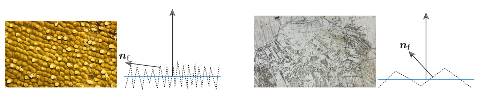

# lesson15_PBR

前面我们讲了

接下来的部分会涉及到前面讲解的渲染方程等部分

前面的引言后面补充，直接开始吧

或者名字也可以直接改为Cook-Torrance BRDF

#### 微表面（**Microfacet**）模型

日常生活中，无论是看起来相对粗糙还是相对光滑的表面，在微观上，它们大都是由不规则的微小表面构成的，如下图的香蕉皮表面和金属镁表面，在显微镜下的样子。

（a）图源[4]   [7]        香蕉皮表面  					（b）图源[5]     [7]  金属镁表面							

有的法线相对变化更大，法线朝向更不一致，反射的光线也会往四面八方去，表面也会看起来粗糙一些，如上图（a）香蕉皮表面。

有的法线相对变化较小，法线朝向更一致，更有机会产生镜面反射，表面也会看起来更平滑一些，如上图（b）金属镁表面。

我们很难对以上这种微小到比单个像素还小的，且不规则的表面显示建模，且我们的眼睛和大部分相机也无法观测到这样的微小表面，因此，我们转而对他们的总体效果进行统计建模。

我们在宏观上使用一个粗糙度(Roughness)参数，然后用统计学的方法来概略的估算微平面的粗糙程度。

下图展示了将凹凸不平的表面逐渐缩小之后，凸起大小逐渐减小，直到最后一张图像中的表面凸起比单个像素还要小得多，已经无法看到表面的凹凸不平，而是看到了一个统计的总体高光效果。

图源[2]  从可见的宏观表面细节逐渐过渡到微观尺度。图像序列按照从上到下，从左到右排布。每个图像中的表面形状和光源都是固定的，只有表面细节的尺度发生了变化。

因此，材质的粗糙程度可以通过微表面的法线分布情况来体现.

## Cook-Torrance BRDF

介绍：

前面的辐射度量学与渲染方程章节中我们学习了BRDF与渲染方程等内容。许多BRDF模型都是建立在上面所提到的微表面模型之上的。其中，Cook-Torrance BRDF是一个比较经典的BRDF模型，它是由ROBERT L. COOK 和 KENNETH E. TORRANCE在1982年于《A Reflectance Model for Computer Graphics》中提出的。

Cook-Torrance BRDF分为漫反射和镜面反射两个部分：
$$
\large f_r = k_d f_{lambert} + k_s f_{specular}
$$
$k_d$ : 漫反射系数.  （后面的ibl章节有更详细介绍）

 $k_s$ : 镜面反射系数.$k_d=1-k_s$ 。表示的是入射光中被反射的比例。

 $f_{lambert}$ : 漫反射部分

 $f_{specular}$ : 镜面反射部分.

#### 漫反射部分 

 $f_{lambert}$ 漫反射部分叫做Lambertian Diffuse。 类似于我们之前提到的漫反射着色，是一个恒定的算式：
$$
\large f_{lambert}=\frac{c}{\pi}
$$

其中 $c$ 表示Albedo或表面颜色。

推导过程如下：

我们首先回忆一下前面渲染方程章节中提到的渲染方程定义（这里也是反射方程，我们暂时先忽略自发光项）：

**反射方程**：

$L_o(\omega_o)$表示的是表面从$\omega_o$ 出射的总的radiance(辐射率), 包含表面上半球所有方向的入射光线的能量贡献。如下图，假设有多个光源照亮表面p，它们都会影响到从$\omega_o$ 出射的光线的强度/能量。

反射方程的公式：
$$
L_o(\omega_o)=\int_{\H^{2}(n)}L_i(\omega_i)f_r(w_i\rightarrow w_o)cos\theta_i d\omega_i
$$

（$\H^{2}(n)$是指单位半球面，指表面上半球面。）

**半球定向反射率（hemispherical-directional reflectance）**

此处我们进一步定义一个半球定向反射率（hemispherical-directional reflectance）$R(\omega_o )$ , 

对于 $R(\omega_o )$的公式如下：
$$
R(\omega_o)=\int_{\H^{2}(n)}f_r(w_i\rightarrow w_o)cos\theta_i d\omega_i
$$

与反射方程仅相差一个$L_i(\omega_i)$ . 

**定向半球反射率（directional-hemispherical reflectance）**

还可以定义一个相反的函数：定向半球反射率（directional-hemispherical reflectance）$R(\omega_i)$ , 与上面的反射方程求的$\omega_o$不同，这次我们要求的是对于入射方向$\omega_i$,  入射光线被反射到半球内的各个方向， $R(\omega_i)$表示了这个入射光线被反射到半球方向内的数量，如下图。

对于 $R(\omega_i)$的公式如下：
$$
R(\omega_i)=\int_{\H^{2}(n)}f_r(w_i\rightarrow w_o)cos\theta_o d\omega_o
$$

由于BRDF具有**可逆性（reciprocity ）**（辐射度量学与渲染方程章节讲过），$R(\omega_i)=R(\omega_o)$  , 可以使用定向反照率（directional albedo）来作为两个反射率的统称。

 $R(\omega_i)$测量了给定入射方向上的能量损失。如果$R(\omega_i)=0$， 表示表示入射光线被完全吸收，没有反射出来。如果$R(\omega_i)=1$，则表示入射光线被完全反射，没有被吸收。由于$\omega_i$即入射光方向， $R(\omega_i)$也被写为 $R(l)$。$R(l)$ 通常会被吧I奥什维一个RGB向量，以便用于渲染。由于RGB的每个分量（红、绿、蓝）都被限制在[0,1]的范围内，因此 $R(l)$也可以被认为是一个颜色。

**Lambertian BRDF**

对于漫反射来说，我们知道，漫反射是均匀的反射，即对于任意出射方向$\omega_o$，$f_r(w_i\rightarrow w_o)$都是一个常数，即$f_r(w_i\rightarrow w_o)=f_{lambert}$。因此，对于漫反射来说，$R(\omega_i)$可以积分简化为：
$$
R(\omega_i)=f_{lambert}\int_{\H^{2}(n)}cos\theta_o d\omega_o
$$

进一步推导：(辐射度量学与渲染方程章节推导过$\mathrm{d} \omega =\sin \theta \mathrm{d} \theta \mathrm{d} \phi $  )
$$
R(\omega_i)=\\
f_{lambert}\int_{\H^{2}(n)}cos\theta_o d\omega_o=\\
f_{lambert}\int_{\H^{2}(n)}cos\theta_o sin\theta_o d\theta d\phi=\\
f_{lambert}\int_{0}^{2\pi}d \phi \int_{0}^{0.5\pi}cos\theta_o sin\theta_o d\theta =\\
f_{lambert}2\pi \int_{0}^{0.5\pi}0.5sin2\theta_o d\theta =\\
f_{lambert}2\pi \int_{0}^{0.5\pi}0.5sin2\theta_o d\theta =\\
f_{lambert}\pi \int_{0}^{0.5\pi}sin2\theta_o d\theta =\\
=f_{lambert}\pi \left[ -\frac{1}{2}cos2\theta_o \right]_{0}^{0.5\pi}=\\
=f_{lambert}\pi \left[ -\frac{1}{2}cos\pi + \frac{1}{2}cos0 \right]=\\
=f_{lambert}\pi \left[ -\frac{1}{2}(-1) + \frac{1}{2}(1) \right]=\\
f_{lambert} \pi
$$
所以
$$
R(\omega_i)=f_{lambert}\int_{\H^{2}(n)}cos\theta_o d\omega_o=f_{lambert} \pi
$$

则$f_{lambert}$可以表示为：（由上文可知$R(\omega_i)$即 $R(l)$是颜色，以下我们表示为c）
$$
f_{lambert}=\frac{R(\omega_i)}{\pi}=\frac{c}{\pi}
$$

#### 镜面反射部分

参考：

[1] Cook, Robert L., and Kenneth E. Torrance. "A reflectance model for computer graphics." *ACM Transactions on Graphics (ToG)* 1.1 (1982): 7-24.

[2] Real-Time Rendering 4th

[3] https://learnopengl.com/PBR/Theory

[4]https://xueqiu.com/6218450268/137632670

[5]https://www.bilibili.com/video/BV1gt421u7Go/?spm_id_from=333.337.search-card.all.click&vd_source=f2def4aba42c7ed69fc648e1a2029c7b

[6]pbrt