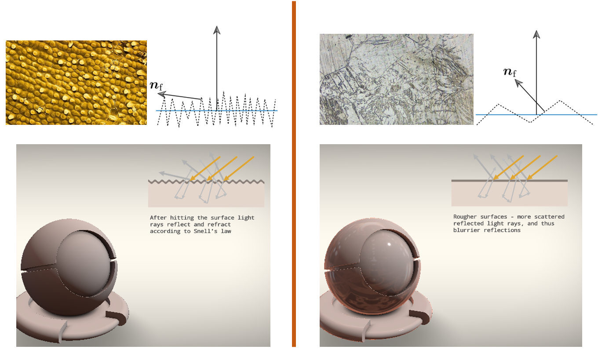
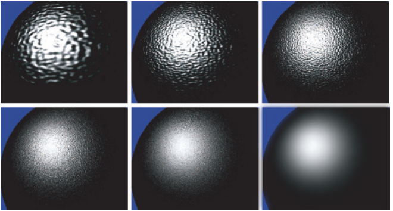
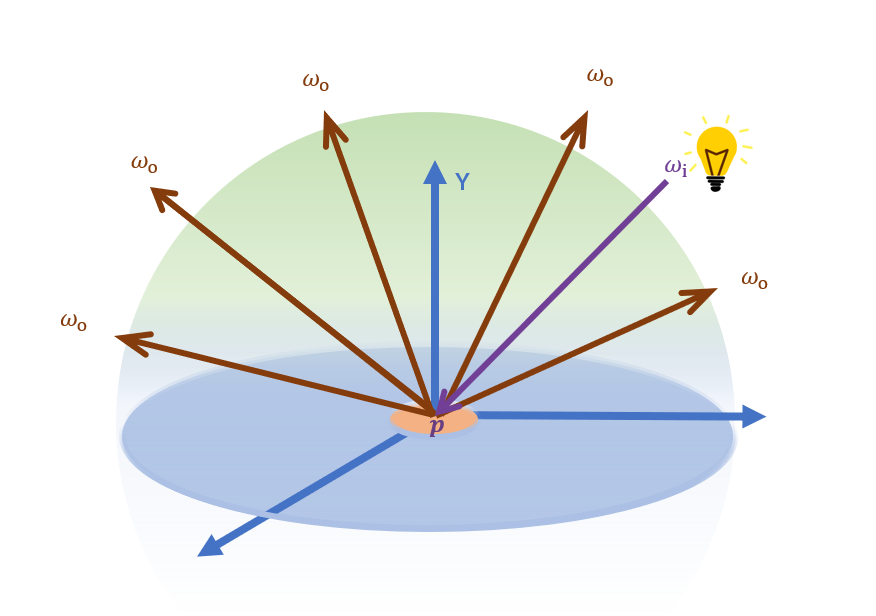
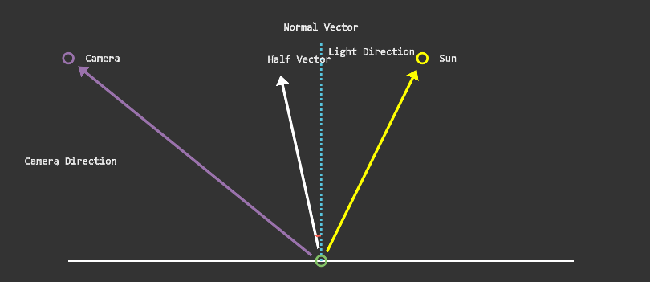
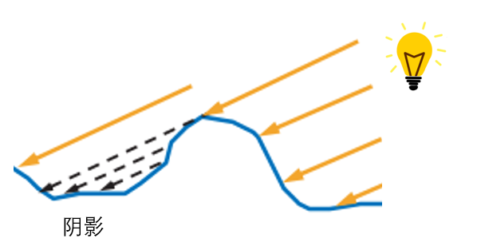
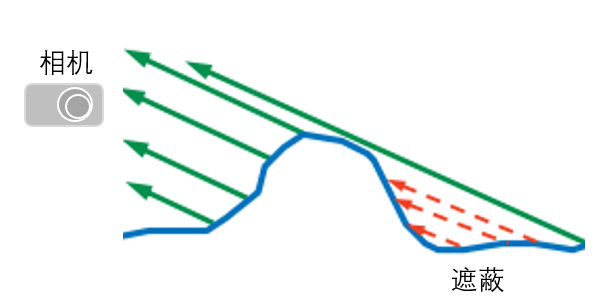

# lesson15_PBR

前面我们讲了

接下来的部分会涉及到前面讲解的渲染方程等部分


前面的引言后面补充，直接开始吧


或者名字也可以直接改为Cook-Torrance BRDF


#### 微表面（**Microfacet**）模型

日常生活中，无论是看起来相对粗糙还是相对光滑的表面，在微观上，它们大都是由不规则的微小表面构成的，如下图的香蕉皮表面和金属镁表面，在显微镜下的样子。



（a）图源[4]   [7] [8]       香蕉皮表面  					（b）图源[5]     [7] [8]  金属镁表面							

有的法线相对变化更大，法线朝向更不一致，反射的光线也会往四面八方去，表面也会看起来粗糙一些，如上图（a）香蕉皮表面。

有的法线相对变化较小，法线朝向更一致，更有机会产生镜面反射，表面也会看起来更平滑一些，如上图（b）金属镁表面。

我们很难对以上这种微小到比单个像素还小的，且不规则的表面显示建模，且我们的眼睛和大部分相机也无法观测到这样的微小表面，因此，我们转而对他们的总体效果进行统计建模。

我们在宏观上使用一个粗糙度(Roughness)参数，然后用统计学的方法来概略的估算微平面的粗糙程度。

下图展示了将凹凸不平的表面逐渐缩小之后，凸起大小逐渐减小，直到最后一张图像中的表面凸起比单个像素还要小得多，已经无法看到表面的凹凸不平，而是看到了一个统计的总体高光效果。



图源[2]  从可见的宏观表面细节逐渐过渡到微观尺度。图像序列按照从上到下，从左到右排布。每个图像中的表面形状和光源都是固定的，只有表面细节的尺度发生了变化。


因此，材质的粗糙程度可以通过微表面的法线分布情况来体现.下面的Cook-Torrance BRDF中镜面反射项的NDF会更细致地讨论这点。


## Cook-Torrance BRDF（后面改 因为不只讲Cook-Torrance了）

介绍：

前面的辐射度量学与渲染方程章节中我们学习了BRDF与渲染方程等内容。许多BRDF模型都是建立在上面所提到的微表面模型之上的。其中，Cook-Torrance BRDF是一个比较经典的BRDF模型，它是由ROBERT L. COOK 和 KENNETH E. TORRANCE在1982年于《A Reflectance Model for Computer Graphics》中提出的。


Cook-Torrance BRDF分为漫反射和镜面反射两个部分：
$$
\large f_r = k_d f_{lambert} + k_s f_{specular}
$$
$k_d$ : 漫反射系数.  （后面的ibl章节有更详细介绍）

 $k_s$ : 镜面反射系数.$k_d=1-k_s$ 。表示的是入射光中被反射的比例。

 $f_{lambert}$ : 漫反射部分

 $f_{specular}$ : 镜面反射部分.

$k_d$  漫反射系数在后面的ibl章节有详细介绍，而接下来我们会讲解Cook-Torrance BRDF的 $f_{lambert}$ 漫反射部分和 $f_{specular}$ 镜面反射部分.

#### 漫反射部分 

 $f_{lambert}$ 漫反射部分叫做Lambertian Diffuse。 类似于我们之前提到的漫反射着色，是一个恒定的算式：
$$
\large f_{lambert}=\frac{c}{\pi}
$$

其中 $c$ 表示Albedo或表面颜色。

推导过程如下：

我们首先回忆一下前面渲染方程章节中提到的渲染方程定义（这里也是反射方程，我们暂时先忽略自发光项）：

**反射方程**：

$L_o(\omega_o)$表示的是表面从$\omega_o$ 出射的总的radiance(辐射率), 包含表面上半球所有方向的入射光线的能量贡献。如下图，假设有多个光源照亮表面p，它们都会影响到从$\omega_o$ 出射的光线的强度/能量。


反射方程的公式：
$$
L_o(\omega_o)=\int_{\H^{2}(n)}L_i(\omega_i)f_r(w_i\rightarrow w_o)cos\theta_i d\omega_i
$$

（$\H^{2}(n)$是指单位半球面，指表面上半球面。）

**半球定向反射率（hemispherical-directional reflectance）**

此处我们进一步定义一个半球定向反射率（hemispherical-directional reflectance）$R(\omega_o )$ , 

对于 $R(\omega_o )$的公式如下：
$$
R(\omega_o)=\int_{\H^{2}(n)}f_r(w_i\rightarrow w_o)cos\theta_i d\omega_i
$$

与反射方程仅相差一个$L_i(\omega_i)$ . 

**定向半球反射率（directional-hemispherical reflectance）**

还可以定义一个相反的函数：定向半球反射率（directional-hemispherical reflectance）$R(\omega_i)$ , 与上面的反射方程求的$\omega_o$不同，这次我们要求的是对于入射方向$\omega_i$,  入射光线被反射到半球内的各个方向， $R(\omega_i)$表示了这个入射光线被反射到半球方向内的数量，如下图。



对于 $R(\omega_i)$的公式如下：
$$
R(\omega_i)=\int_{\H^{2}(n)}f_r(w_i\rightarrow w_o)cos\theta_o d\omega_o
$$

由于BRDF具有**可逆性（reciprocity ）**（辐射度量学与渲染方程章节讲过），$R(\omega_i)=R(\omega_o)$  , 可以使用定向反照率（directional albedo）来作为两个反射率的统称。

 $R(\omega_i)$测量了给定入射方向上的能量损失。如果$R(\omega_i)=0$， 表示表示入射光线被完全吸收，没有反射出来。如果$R(\omega_i)=1$，则表示入射光线被完全反射，没有被吸收。由于$\omega_i$即入射光方向， $R(\omega_i)$也被写为 $R(l)$。$R(l)$ 通常会被吧I奥什维一个RGB向量，以便用于渲染。由于RGB的每个分量（红、绿、蓝）都被限制在[0,1]的范围内，因此 $R(l)$也可以被认为是一个颜色。

**Lambertian BRDF**

对于漫反射来说，我们知道，漫反射是均匀的反射，即对于任意出射方向$\omega_o$，$f_r(w_i\rightarrow w_o)$都是一个常数，即$f_r(w_i\rightarrow w_o)=f_{lambert}$。因此，对于漫反射来说，$R(\omega_i)$可以积分简化为：
$$
R(\omega_i)=f_{lambert}\int_{\H^{2}(n)}cos\theta_o d\omega_o
$$

进一步推导：(辐射度量学与渲染方程章节推导过$\mathrm{d} \omega =\sin \theta \mathrm{d} \theta \mathrm{d} \phi $  )
$$
R(\omega_i)=\\
f_{lambert}\int_{\H^{2}(n)}cos\theta_o d\omega_o=\\
f_{lambert}\int_{\H^{2}(n)}cos\theta_o sin\theta_o d\theta d\phi=\\
f_{lambert}\int_{0}^{2\pi}d \phi \int_{0}^{0.5\pi}cos\theta_o sin\theta_o d\theta =\\
f_{lambert}2\pi \int_{0}^{0.5\pi}0.5sin2\theta_o d\theta =\\
f_{lambert}2\pi \int_{0}^{0.5\pi}0.5sin2\theta_o d\theta =\\
f_{lambert}\pi \int_{0}^{0.5\pi}sin2\theta_o d\theta =\\
=f_{lambert}\pi \left[ -\frac{1}{2}cos2\theta_o \right]_{0}^{0.5\pi}=\\
=f_{lambert}\pi \left[ -\frac{1}{2}cos\pi + \frac{1}{2}cos0 \right]=\\
=f_{lambert}\pi \left[ -\frac{1}{2}(-1) + \frac{1}{2}(1) \right]=\\
f_{lambert} \pi
$$
所以
$$
R(\omega_i)=f_{lambert}\int_{\H^{2}(n)}cos\theta_o d\omega_o=f_{lambert} \pi
$$


则$f_{lambert}$可以表示为：（由上文可知$R(\omega_i)$即 $R(l)$是颜色，以下我们表示为c）
$$
f_{lambert}=\frac{R(\omega_i)}{\pi}=\frac{c}{\pi}
$$


#### 镜面反射部分

$$
\large f_{specular} = \frac{DFG}{4(\omega_o·n)(\omega_i·n)}
$$

Cook-Torrance镜面反射BRDF由3个函数（D，F，G）和一个标准化因子构成。D，F，G符号各自近似模拟了特定部分的表面反射属性：【改】

（入射方向=光照方向$\omega_i=l$， 出射方向=视线方向$\omega_o=v$）


##### （1）D(Normal Distribution Function，NDF)  法线分布函数

法线分布函数（normal distribution function，NDF）是上面的微表面（**Microfacet**）模型提到的法线分布函数。Cook-Torrance镜面反射BRDF中我们将使用D来表示方程中的NDF项。

我们将微表面的法线表示为$m$。

复习一下下图：


（a）图源[4]   [7] [8]       香蕉皮表面  					（b）图源[5]     [7] [8]  金属镁表面							

有的法线$m$相对变化更大，法线$m$朝向更不一致，反射的光线也会往四面八方去，表面也会看起来粗糙一些，如上图（a）香蕉皮表面。

有的法线$m$相对变化较小，法线$m$朝向更一致，更有机会产生镜面反射，表面也会看起来更平滑一些，如上图（b）金属镁表面。

因此我们可以使用粗糙度(Roughness) $\alpha$参数来模拟NDF。


如果表面是各向同性的（isotropic）【后面补充】，NDF的变量只有一个，即宏表面法线 $n$ 与微表面法线 $m$ 之间的夹角$\theta _m$ 。理想情况下，NDF可以写为关于$\cos \theta _m =  {n}\cdot {m}$ 的表达式 .  然而有时候我们会使用半程向量$h$来表示NDF。


**半程向量**

首先 复习一下 基础光照 中讲到的半程向量：



> $\vec{h}$被称之为半程向量，其计算公式如下（这里的字母都是向量，省略向量符号）：
> $$
> \vec{h} = \frac{v+l}{||v+l||}
> $$
> 其中，$||v+l||$指的是这两个向量相加之后的向量的模，实际上就是对$v+l$向量的归一化。得到的结果就是上图的白色向量（Half Vector）。
>
> $v$ 视线，图中的camera。$l$为light，图中的sun。


法线分布函数（normal distribution function，NDF）近似地表示了法线$n$与半程向量$h$取向一致的微平面的比例。


可以认为，只有法线$\mathbf{m}$与半程向量 $\mathbf{h}$ 一致的微平面才能正确地将光线从入射方向$l$反射到出射方向$v$上，其他朝向的表面点对BRDF没有贡献（正负相互抵消）。这个值是通过$D(\mathbf{h})$项给出的。$D(\mathbf{h})$常被直接写作$D(\mathbf{m})$


图源 rtrt4 由微表面构成的表面。只有微表面法线$\mathbf{m}$与半向量$\mathbf{h}$一致的微表面（图中红色的微表面），才会参与从入射方向$\mathbf{l}$到观察方向$\mathbf{v}$的光线反射

也就是说，只有$\mathbf{m}=\mathbf{h}$ 的微表面是有效的。

因此很多时候我们用宏表面的半程向量 $\mathbf{h}$ 来表示微表面的法线$\mathbf{m}$。

因此也可以说，法线分布函数，从统计学上近似的表示了与半程向量ℎ取向一致的微平面的比率。


**Beckmann 分布**

NDF有多种估计方法，第一个微表面模型里使用的表面分布函数是Beckmann NDF（Beckmann 分布），如今仍然广为使用。我们这里讲解的Cook-Torrance BRDF的NDF就是使用这个Beckmann NDF。

归一化的Beckmann  NDF的公式如下：

$$
\LARGE D(\mathbf{m})=\frac{\chi^{+}(\mathbf{n} \cdot \mathbf{m})}{\pi \alpha_{b}^{2}(\mathbf{n} \cdot \mathbf{m})^{4}}
\exp ^\left(\frac{(\mathbf{n} \cdot \mathbf{m})^{2}-1}{\alpha_{b}^{2}(\mathbf{n} \cdot \mathbf{m})^{2}}\right)
\tag{1}
$$

$\alpha_{b}$ ： 粗糙度 ， $\alpha_{b} = 0$代表了一个完全光滑的表面。

$\chi^{+}(\mathbf{n} \cdot \mathbf{m})$ ：$\chi^{+}$为正特征函数：

$$
\chi^{+}(x)=\left\{\begin{array}{ll}1, & \text { where } x>0, \\ 0, & \text { where } x \leq 0 .\end{array}\right.
\tag{2}
$$

$\chi^{+}(\mathbf{n} \cdot \mathbf{m})$确保了指向宏表面下方的微表面法线的NDF为0。有的文献会将这项忽略不计。

UE4中对Beckmann分布的实现代码如下：

用$ \mathbf{h}$表示$\mathbf{m}$ , 其中$\mathbf{n} \cdot \mathbf{m}$写为$\mathbf{n} \cdot \mathbf{h}$   ， 保证其大于0所以$\chi^{+}(\mathbf{n} \cdot \mathbf{m})$忽略。

```C++
// [Beckmann 1963, "The scattering of electromagnetic waves from rough surfaces"]
float D_Beckmann( float a2, float NoH )
{
    float NoH2 = NoH * NoH;
    return exp( (NoH2 - 1) / (a2 * NoH2) ) / ( PI * a2 * NoH2 * NoH2 );
}
```


**GGX（Trowbridge-Reitz）分布**

GGX分布又名Trowbridge-Reitz分布，由Trowbridge和Reitz于1788年提出，2007年，Walter等人独立重新发现并并命为GGX分布[10]。GGX分布是游戏和电影中最常用的法线分布函数。

GGX分布的公式如下：

$$
D(\mathbf{m})=\frac{\chi^{+}(\mathbf{n} \cdot \mathbf{m}) \alpha_{g}^{2}}{\pi\left(1+(\mathbf{n} \cdot \mathbf{m})^{2}\left(\alpha_{g}^{2}-1\right)\right)^{2}}
\tag{3}
$$

$\alpha_{g}$ ： 粗糙度 。 在迪士尼原理着色模型（Disney principled shading model）中，Burley推荐将粗糙度控制以$\alpha_{g}=r^{2}$暴露给用户，其中$r$是0到1之间的用户界面粗糙度参数值，以让分布以更线性的方式变化。这种方式实用性较好，不少使用GGX分布的引擎与游戏都采用了这种映射，如UE4和Unity。

如果用$ \mathbf{h}$表示$\mathbf{m}$， $\mathbf{n} \cdot \mathbf{m}$写为$\mathbf{n} \cdot \mathbf{h}$   ， 保证其大于0所以将$\chi^{+}(\mathbf{n} \cdot \mathbf{m})$忽略。GGX分布也可以写为：
$$
D(\mathbf{h})=\frac{\alpha_{g}^{2}}{\pi\left(1+(\mathbf{n} \cdot \mathbf{h})^{2}\left(\alpha_{g}^{2}-1\right)\right)^{2}}
\tag{4}
$$
UE4中对GGX分布的实现代码如下：（对应公式4）

```C++
// GGX / Trowbridge-Reitz
// [Walter et al. 2007, "Microfacet models for refraction through rough surfaces"]
float D_GGX( float a2, float NoH )
{
    float d = ( NoH * a2 - NoH ) * NoH + 1; // 2 mad
    return a2 / ( PI*d*d );         // 4 mul, 1 rcp
}
```


使用不同的粗糙度得到的效果：


图源[3]


综上，我们可以输入 {微表面粗糙度$\alpha$ + 宏表面法线方向$\mathbf{n}$ + 微表面法线方向$\mathbf{m}$ } 或者 {微表面粗糙度$\alpha$ + 宏表面法线方向$\mathbf{n}$ + 半程向量$\mathbf{h}$ } 来得到D(Normal Distribution Function，NDF) 法线分布函数； 

##### （2）G（Geometry Function）几何函数

我们考虑以下情况，情况1如下图：微表面遮挡住了光源方向$\mathbf{l}$来的入射光，产生阴影（Shadowing）。那么产生阴影的微平面对BRDF没有贡献。



情况2如下图：微表面遮挡住了往视线方向$\mathbf{v}$去的出射光，产生遮蔽（Masking）。那么被遮蔽的微平面对BRDF没有贡献。



上面的NDF函数部分中提到，$\mathbf{m}=\mathbf{h}$ 的微表面分布函数

在微平面中，正确朝向（即m = h）的微平面法线m的统计分布由法线分布函数D（m）进行建模。若将D(m)在整个微平面法线上积分，会得到微表面的面积。但并非所有m = h的微平面都会对microfacet BRDF有所贡献：有些微平面会被光照方向或视图方向遮挡，这些被遮挡的光线在业界主流的微平面理论中被忽略不计。所以需要引入几何项G来对这种现象进行建模，得到最终对microfacet BRDF能产生贡献的法线分布。


- **D**：**(Normal Distribution Function，NDF)**：法线分布函数，估算在受到表面粗糙度的影响下，**取向方向与半程向量一致的微平面的数量比例**。这是用来估算微平面的主要函数。
- **F：**(Fresnel equation)：菲涅尔方程，描述的是在不同的表面角下表面反射的光线所占的比率。
- **G**：(Geometry function)：几何函数，描述了微平面自成阴影的属性。当一个平面相对比较粗糙的时候，平面表面上的微平面有可能挡住其他的微平面从而减少表面所反射的光线。

以上的每一种函数都是用来估算相应的物理参数的，而且可以发现用来实现相应物理机制的每种函数都有不止一种形式。它们有的非常真实，有的则性能高效。可以按照自己的需求任意选择自己想要的函数的实现方法。Epic Games公司的Brian Karis对于这些函数的多种近似实现方式进行了大量的研究。这里将采用Epic Games在Unreal Engine 4中所使用的函数，其中**D使用Trowbridge-Reitz GGX**，**F使用Fresnel-Schlick近似法(Approximation)**，而**G使用Smith's Schlick-GGX**。


参考：

[1] Cook, Robert L., and Kenneth E. Torrance. "A reflectance model for computer graphics." *ACM Transactions on Graphics (ToG)* 1.1 (1982): 7-24.

[2] Real-Time Rendering 4th

[3] https://learnopengl.com/PBR/Theory


[4]https://xueqiu.com/6218450268/137632670


[5]https://www.bilibili.com/video/BV1gt421u7Go/?spm_id_from=333.337.search-card.all.click&vd_source=f2def4aba42c7ed69fc648e1a2029c7b


[6]pbrt

[8]https://www.shadertoy.com/view/4sSfzK PBR可视化

[9]https://zhuanlan.zhihu.com/p/69380665

[10]Walter et al. 2007, "Microfacet models for refraction through rough surfaces"

[11]Naty Hoffman, Recent Advances in Physically Based Shading, SIGGRAPH 2016