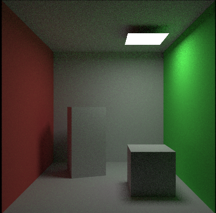
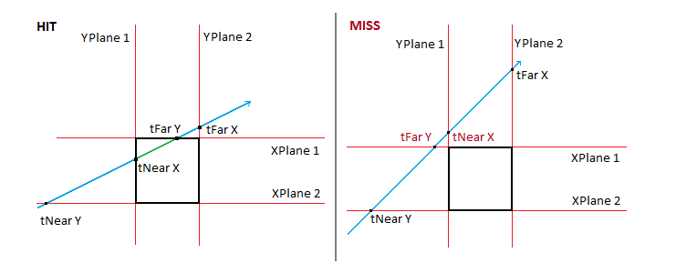

# 路径追踪基础


# 一、引言和概率论
一些内容参考Games101，以及这篇笔记：https://zhuanlan.zhihu.com/p/146714484

> 本节目标：将之前的光追基础程序修改为基于蒙特卡洛的路径追踪。


路径追踪是一种光线追踪算法，这一节中，我们将学习使用路径追踪实现更真实的全局光照效果。

在这之前，我们需要一些概率论的基础进而学习蒙特卡洛积分。（已经会的读者可以跳过这部分）

### 概率论基础

**1、概率函数**

使用函数的形式来表达概率。

概率函数$p_i=P(X=x_i)(i=1,2,3,4,5,6)$, $P(X=x_i)$表示取值到$x_i$的概率。


举个例子：我们扔一个六面骰子：

扔到3的概率是$\frac{1}{6}$,可以表示为$P(X=3)=\frac{1}{6}$

扔到5的概率是$\frac{1}{6}$, 可以表示为$P(X=5)=\frac{1}{6}$

扔到7的概率是0，可以表示为$P(X=7)=0$


**2、累积分布函数 / 概率分布函数**

累积分布函数又叫做概率分布函数。

对于所有实数值的随机变量$X$，累积分布函数定义如下：

$F_X(x)=P(X<=x)$

其中右侧表示随机变量$X$取值小于或等于$x$的概率。


举个例子：比如还是扔骰子的例子，

当x=3时，$F_X(3)=P(X<=3)=P(X=1)+P(X=2)+P(X=3)=\frac{1}{6}+\frac{1}{6}+\frac{1}{6}=\frac{3}{6}=\frac{1}{2}$

当x=5时，$F_X(5)=P(X<=5)=P(X=1)+P(X=2)+P(X=3)+P(X=4)+P(X=5)=\frac{1}{6}+\frac{1}{6}+\frac{1}{6}+\frac{1}{6}+\frac{1}{6}=\frac{5}{6}$

当x<1时，$F_X(x)=0$


**3、概率密度函数 PDF**

假设我们现在口袋里有大量黄色的乒乓球和少量的白色乒乓球。概率密度函数就是在告诉我们，抓到某种颜色的乒乓球的可能性有多大。例如这个情况中，抓到黄色乒乓球的概率就很大，抓到白色乒乓球的概率就很小。


概率密度函数（**P**robability **d**ensity **f**unction，简写作**PDF**) 用于描述连续型随机变量的概率分布。

对于一维连续随机变量 X ，设它的累积分布函数是$F_X(x)$，则*X*的概率密度函数是$pdf_X(x)$，可以表示为$X_i \sim pdf(x)$ ，满足：

$F_X(a)=\int_{-\infty}^{a}{pdf}_X(x)dx$

同样的，可以推出连续型随机变量的概率密度函数的如下性质：

1）$pdf_X(x)>=0$

2）$\int_{-\infty}^{\infty}pdf_X(x)dx=1$

3）$P(a<X<=b)= F_X(b)-F_X(a)=\int_{a}^{b}pdf_X(x)dx$

如果概率密度函数$f_X(x)$在一点$x$处连续，则累积分布函数$F_X(x)$在该点$x$处可导，且有：

$$F_X'(x)=pdf_X(x)$$


举个例子：以均匀分布为例，如果$X$在区间[0,1]上均匀分布，则其 概率密度函数 PDF为：

$$pdf_X(x)=\begin{cases}1&\text{if}\:0\le x\le1\\0&\text{otherwise}\end{cases}$$

在这个例子中，

1）计算在区间[0.2,0.5] 内的概率：

$$P(0.2<X\leq0.5)=\int_{0.2}^{0.5}f_X(x)\:dx=\int_{0.2}^{0.5}1\:dx=0.5-0.2=0.3$$

2）计算$P(X\leq0.3)$可以通过求积分得到

$$P(X\leq0.3)=\int_0^{0.3}f_X(x)\:dx=\int_0^{0.3}1\:dx=0.3$$


[2]https://en.wikipedia.org/wiki/Cumulative_distribution_function

[3]https://en.wikipedia.org/wiki/Probability_density_function


# 二、蒙特卡洛积分

在高等数学中，我们学习过一些函数的积分求解。但针对比较复杂的函数图像，求解积分就会变得很复杂，比如下图：


显然对于这样一个函数，很难去用一个方程或者解析式去描述，因此无法用一般解析的方法直接求得积分值，而这时候就可以采用蒙特卡洛的思想了。**蒙特卡洛积分的原理** 是对函数值进行多次采样，求取均值作为积分值的近似。

这种思想非常常见，例如如果我们对上面的函数从$a$到$b$均匀采样非常密集的点，就好像将整个积分区间切成了无数个很小的长方形，于是区间面积就变成了对所有小长方形求面积和，这就是**求解黎曼积分**的思想。对于蒙特卡洛积分而言，这种思想更具备一般性，**因为其可以指定一个分布来对被积分的值进行采样。**

假设我们要求解如下的积分：
$$
\int_{a}^bf(x)dx
$$
令采样点符合某一概率密度函数$X_i \sim pdf(x)$，此时蒙特卡洛的近似结果为：
$$
F_N = \frac{1}{N}\sum_{i=1}^N \frac{f(X_i)}{pdf(X_i)}
$$
举一个我们比较熟悉的例子，假设我们是在$[a,b]$区间中均匀采样$N$个点，那么根据概率论的基本知识，此时的概率密度函数为:
$$
X_i \sim pdf(x)=\frac{1}{b-a}
$$
于是此时计算蒙特卡洛的近似结果为：
$$
F_N = \frac{b-a}{N} \sum_{i=1}^N f(X_i)
$$
针对蒙特卡洛近似有如下基本结论：

- 采样点越多，结果越近似正确的结果；
- 如果是对$x$进行积分，那么就要对$x$进行采样；


# 三、路径追踪

## 1.回顾渲染方程

首先，我们来复习一下渲染方程：
$$
L_o(p,\omega_o)=L_e(p,\omega_o)+\int_{\Omega+}L_i(p,\omega_i)f_r(p,\omega_i,\omega_o)(n·\omega_i)d\omega_i
$$
可以看到，这是一个涉及到积分和递归的方程。


## 2.蒙特卡洛方法求解积分

很多时候，我们不需要关心渲染方程中的自发光项。在这里我们也是做类似的简化，此时方程可以简化为：
$$
L_o(p,\omega_o)= \int_{\Omega+}L_i(p,\omega_i)f_r(p,\omega_i,\omega_o)(n·\omega_i)d\omega_i
$$


根据第一部分的学习，我们有蒙特卡洛求解近似值的方法：
$$
F_N=\frac{1}{N} \sum_{i=1}^N \frac{f(X_i)}{p(X_i)} \quad  X_k \sim pdf(x)
$$
所以，核心思路就在于随机采样$\omega$，求出被积分函数的值，然后利用蒙特卡洛方法求解近似值。假设我们也是**均匀地在半球方向上进行采样。**对于单位半球而言，其概率密度函数为$p(\omega)=\frac{1}{2\pi}$。（==这里可以补充一下推导为什么是$\frac{1}{2\pi}$==）,此时就有：
$$
L_o(p,\omega_o)=\int_{\Omega+}L_i(p,\omega_i)f_r(p,\omega_i,\omega_o)(n·\omega_i)d\omega_i \\
\approx \frac{1}{N}\sum_{i=1}^N\frac{L_i(p,\omega_i)f_r(p,\omega_i,\omega_o)(n·\omega_i)}{pdf(\omega_i)}
$$
写成伪代码就是：

```c++
shade(p,wo)
    Randomly choose N directions wi_pdf
    Lo=0.0
    for each wi
        Trace a ray r(p,wi)
        if ray r hit the light
            Lo+=(1/N)*L_i*f_r*cosine/pdf(wi)
    return Lo
```

此时我们只考虑了直接光照的影响，也就是“追踪光线”直接可以打到光源的情况。如果是间接光照呢？看下一节。


### （1）间接光照

实际上我们引入间接光照是比较简单的，只需要将上面的方程改为递归式：

```c++
shade(p,w0)
    Randomly choose N directions wi_pdf
    L0=0.0
    for each wi
        Trace a ray r(p,wi)
        if ray r hit the light //前面的直接光照部分
            L0+=(1/N)*L_i*f_r*cosine/pdf(wi)
        else if ray r hit an object at q //引入间接光照
            L0+=(1/N)*shade(q,-wi)*f_r*cosine/pdf(wi)
    return L0
```

看起来很美好，但上述算法存在两个比较关键的问题：

- （1）**光线数量爆炸**：假设每次发射100根光线，这样如果引入间接光照，发生二次弹射，100根光线会变成10000根光线，导致光线数量爆炸，这种性能开销是不能接受的；
- （2）使用了递归函数，但是函数没有结束条件。


针对问题（1），可以思考一下，蒙特卡洛模拟的时候打出多少根光线时不会发生光线数量爆炸的现象呢？**答案是一根光线。**因此在做蒙特卡洛模拟的时候，我们只会每次打出一根光线：

```c++
shade(p,w0)
    Randomly choose ONE directions wi_pdf  //注意，只打出一根光线
    L0=0.0
    for each wi
        Trace a ray r(p,wi)
        if ray r hit the light
            L0+=L_i*f_r*cosine/pdf(wi)
        else if ray r hit an object at q //引入间接光照
            L0+=shade(q,-wi)*f_r*cosine/pdf(wi)
    return L0
```

**这种只打出一根光线的方法我们就叫做路径追踪。**在前面的光追篇中，我们会意识到每个像素只采样一次会导致结果充满噪声。当时的解决方案一种是每个像素内随机打出$N$根光线再取平均，或者是利用类似于TAA的方法做时间上的降噪（其实就是把多个采样样本分散在了时间上）。以解决方案一为例，代码类似如下：
```c++
ray_generation(camPos,pixel)
    Uniformly choose N sample positions within the pixel
    pixel_radiance=0.0
    for each sample in the pixel
        Shoot a ray r(camPos,cam_to_sample)
        if ray r hit the scene at p
            pixel_radiance+=1/N*shade(p,sample_to_cam)
    return pixel_radiance
```

**通过这种方式，也类似于蒙特卡洛的方法，通过增大样本数来进行降噪处理，从而避免因为防止光线爆炸而造成的采样数不足问题。**


接下来的问题是，针对上面的问题（2），要如何解决？

> 一种直观的想法是像之前的光线追踪程序一样，设置最大的递归深度为N，即光线最多可以递归N次。这样做好像渲染结果也不错，但是是错误的。因为在真正的自然界中，光线在传入到我们眼睛的时候应该是已经弹射无数次的，暴力地设置递归的最大次数，我们无法求出$L_o$的正确期望值。正确的方法就是下一节所描述的俄罗斯轮盘赌方法。


### （2）俄罗斯轮盘赌（**Russian Roulette**，RR）

首先介绍一下RR指的是什么。假设左轮手枪里一共可以放置6发子弹，现在里面一共有两发子弹，但并不知道子弹的位置，那么$A$拿起枪并朝$B$开枪，$B$没有被击中的概率很好计算，应该为$4/6$，这就是俄罗斯轮盘赌的概念。放在我们的路径追踪里，我们要如何使用RR方法呢？

首先，让我们设定一个概率值$p(0<p<1)$，每次打到场景物体的时候，光线有$p$的概率会继续递归，并返回着色结果为$L_o/p$，有$1-p$的概率会直接停止递归，并返回0。此时可以发现，光线基本一定会在弹射一定次数之后停止递归，但总体的期望是不变的，可以计算一下：
$$
E = p * (L_o/p) + (1-p)*0 = L_o
$$
这就是RR的巧妙之处了。通过这种方式，我们的递归就会有终止条件了。此时的代码修改如下：

```c++
shade(p,w0)
    //新增:RR
    Maually specify a probability P_RR
    Randomly select ksi in a uniform dist. in [0,1] //生成一个随机数
    if (ksi>P_RR) return 0.0
    Randomly choose ONE directions wi_pdf
    L0=0.0
    for each wi
        Trace a ray r(p,wi)
        if ray r hit the light
            L0+=L_i*f_r*cosine/pdf(wi)/P_RR
        else if ray r hit an object at q //引入间接光照
            L0+=shade(q,-wi)*f_r*cosine/pdf(wi)/P_RR
    return L0
```

此时我们解决了上面的两个递归求解的问题，但还有一个小问题：**我们的蒙特卡洛路径追踪方法还不够高效。**可以看下图帮助理解：


我们在每次计算直接光照的时候，通过任选一个方向（特别是对于lambert的漫反射情况），但很少会的光线可以hit光源，尤其当光源较小的时候，这种现象越明显，大量采样的光线都被浪费了。例如上图最右侧，假设我们的光源非常小，蒙特卡洛近似的时候采样50000根光线可能只有几根打到了光源上，此时就会造成浪费。如何更高效地进行采样呢？下一节会进行介绍。


### （3）对光线直接采样

如果想让采样都不浪费，一种想法是可以直接在光源上采样（注意，先不考虑物体和光源采样点连线中间有遮挡物地情况）。在光源上采样的好处就在于可以保证在没有中间遮挡物的情况下，所有采样的光线都一定会击中光源，这样就不会造成光线的浪费了。

假设光源的面积为$A$，并且我们是对光源进行均匀采样的，此时采样的概率密度函数应该为:
$$
pdf = 1/A
$$
回顾一下前面的渲染方程（依旧忽略自发光项）：
$$
L_o(p,\omega_o)= \int_{\Omega+}L_i(p,\omega_i)f_r(p,\omega_i,\omega_o)(n·\omega_i)d\omega_i
$$
这个积分是针对于$d{\omega_i}$的。在前面讲解蒙特卡洛近似的基础的时候，我们有提到如果是对$x$进行积分，那么就要对$x$进行采样。所以关键在于找到$dA$和$d{\omega_i}$之间的关系，这样我们就可以变换积分域了。看下图：


重点是这个结论：
$$
dw=\frac{dAcos \theta'}{||x'-x||^2}
$$

> 以上公式是如何推导出来的？首先来看分子的$dAcos \theta'$，可以发现这个结果是$dA$在与$d\omega$平行的面积部分。然后依据立体角的定义，就可以得到上面的式子了。

这时就可以改写刚才的积分公式：
$$
L_0(x,\omega_0)=\int_{\Omega+}L_i(x,\omega_i)f_r(x,\omega_i,\omega_0)cos\theta d\omega_i \\
=\int_A L_i(x,\omega_i)f_r(x,\omega_i,\omega_o)\frac{cos\theta cos \theta'}{||x'-x||^2}dA
$$
这样我们的积分域就转换到了光源上，自然蒙特卡洛近似也可以在光源上进行，此时前面的算法还可以再次改进。对于光线求交的交点，如果我们发现和光源采样点间没有遮挡物，就直接计算上式的结果（并且不需要进行RR，相当于在光源上采样）；否则如果交点和光源之间有遮挡物，则计算间接光照，并且启用RR策略。最终改进之后的基于蒙特卡洛的路径追踪算法核心函数为：

```c++
shade(p,w0):
    #contribution from the light source.
    L_dir=0.0
    Uniformly sample the light at x1 (pdf_light=1/A)
    Shoot a ray from p to x1
    if the ray is not blocked in the middle
        L_dir = L_i*f_r*cosθ*cosθ1/|x1-p|^2/pdf_light

    #Contribution from other reflectors.
    L_indir=0.0
    Test Russian Roulette with probability P_RR

    Uniformly sample the hemosphere toward wi(pdf_hemi=1/2pi)
    Trace a ray r(p,wi)
    if ray r hit a non-emitting object at q
        L_indir=shade(q,-wi)*f_r*cosθ/pdf_hemi/P_RR

    return L_dir+L_indir
```


## 3.几点补充说明

- （1）点光源比较麻烦，不做过多讨论。这里建议把点光源替换为小面积的面光源；
- （2）其他的一些工业界使用的方法，后续可以进行补充：
  - (Unidirectional & bidirectional) path tracing
  - photon mapping
  - metrophlis light transport
  - VCM/UPBP


# 四、实践

学习完上面的知识后，我们就可以用Shadertoy试一下基于蒙特卡洛积分的路径追踪了。这次我们渲染的目标是大名鼎鼎的康奈尔盒（Cornell’s box），源代码在本文档的同级目录下面，以下会对比较重要的函数进行说明。

渲染最终结果如下（假定场景中的物体都是漫反射材质，意味着光线会随机朝着四面八方散射）：



首先，还是先看主函数`mainImage`，其中采用每个像素多次采样的方式来类比蒙特卡洛方法，函数如下：

```glsl
vec3 s = vec3(0);
for(int i = 0; i < NUM_SAMPLES; i++) {
    Ray ray;
    ray.origin = cam_center;
    vec2 r = get_random();
    vec3 ray_dir = normalize(vec3(p + r.x * dFdx(p) + r.y * dFdy(p), -1));
    ray.dir = ray_dir;
    vec3 c = pt_mis(ray);
    s += c;
}

fragColor = vec4(pow(s / float(NUM_SAMPLES), vec3(1.0 / 2.2)), 1.0);
```

可以看到，每个像素会打出NUM_SAMPLES数量的光线，而`pt_mis`函数是接下来我们会重点关注的函数，用于获取单根光线着色的结果，最终着色的结果就是将NUM_SAMPLES次的结果求和之后求平均，然后做gamma校正即可。**接下来的重点是pt_mis函数。**但在这个函数之前，我们需要思考一个问题：在康奈尔盒这个场景中，物体不再是球体，因此我们需要实现光线和立方体以及和平面的求交函数。


## 1.光线的求交

### （1）光线和平面求交

对于一个平面来说，我们可以通过其中心$c$和法线方向$\vec{N}$唯一地将其确定。光线和平面求交的推导如下：

> 已知平面方程如下:
>
> $ax+by+cz+d=0$
>
> 则对于平面上的点$p$,有:
>
> - $p:(p-p')·N=0$  ($p'$是平面上一点,$N$是平面的法线方向,$\vec{N}=(a,b,c)$)
>
> 
>
> **此时我们联立光线方程与平面方程,求解二者的交点$p$**
> $$
> \begin{cases}  r(t)=p=o+td(0≤t<∞)\quad① \\   p:(p-p')·N=0\quad ②\end{cases}.
> $$
> 将①代入②,有$(o+td-p')·N=0$,通过点乘的分配律求解出:$\large t=\frac{(p'-o)·N}{d·N}$(需要验证是否满足$0≤t<∞$)

根据上文，假设平面的中心是center，法线方向是normal，可以写出如下光线和平面求交的函数：

```glsl
float intersect_plane(Ray ray, vec3 center, vec3 normal)
{
    float denom = dot(ray.dir, normal);
    float t = dot(center - ray.origin, normal) / denom;
	return t > 0.0 ? t : INFINITY;
}
```

还是比较清晰的。当然，以上代码**只能用于判断光线是否和一个无限大的平面的相交情况。**如果平面大小有限制，我们可以求出交点$p$再判断其是否在有限平面的范围内。例如对于康奈尔盒的左侧面（红色）来说，判断条件如下：
```glsl
// left
{
    vec3 n = vec3(1, 0, 0); //左侧面的法线方向
    float t = intersect_plane(ray, vec3(-1, 0, 0), n);
    if(t < t_min) {
        vec3 p_tmp = ray_at(ray, t); //计算出交点
        if(all(lessThanEqual(p_tmp.yz, vec2(1))) && all(greaterThanEqual(p_tmp.yz,
                        vec2(-1))))  //交点的yz值都要介于-1到1之间，才是在平面区间范围内
        {
            normal = n;
            p = p_tmp;

            t_min = t;

            albedo = vec4(0.9, 0.1, 0.1, 0);
        }
    }
}
```

> 由于被限定在了左平面，因此不需要额外判断交点的X值是否合法。

在这个示例程序中，天花板的面光源也是一个plane，因此判断射线是否和光源相交也可以调用前面的光线和平面求交函数。


### （2）光线和立方体求交

在康奈尔盒的场景中，还有两个旋转后的长方体。**先不考虑旋转、平移、缩放等仿射变换**，让我们来计算光线和一个立方体求交的公式。在前面的章节中我们有多次介绍AABB的概念，可以想到光线和立方体求交就是和AABB求交。于是问题就转换为了光线和AABB如何计算求交？以二维情况为例，我们来看下图：



对于上图的二维情况，我们先假设光线是“直线”，意味着两端可以无限延申，那么如果光线不和AABB的某条边平行，其一定会与XPlane1，XPlane2，YPlane1，YPlane2各有一个交点，在上图中，我们认为比较小的交点$t$值是tNear（在下面的推导中对应$t_{min}$），比较大的交点$t$值是tFar（在下面的推到中对应$t_{max}$）。左侧是光线和AABB有交点的情况，右侧则是没有交点的情况。

**注意到以下结论**:

- **光线进入box,只有两组边都进去了才算进去**
- **光线离开box,只要一组出来就算出来**

对于每一组对边,记录$t_{min}和t_{max}$,则有:

$\large t_{enter}=max(t_{min}),t_{exit}=min(t_{max})$


##### 最终结论

容易想到，似乎$t_{enter}<t_{exit}$的时候，光线和AABB可能会相交。但这里也得要求$t_{exit}>=0$。否则相当于光线离开AABB的位置在其“后面”，这时AABB位于光线的后面，也是不相交的情况。思考一下，$t_{enter}$的范围需要限制么？

- 一种特殊情况在于如果$t_{exit}>=0$同时$t_{enter}<0$,**那么可以想象到这种情况应该是光源在盒子的里面,显然这种情况也是相交的。**

因此其实我们并不需要额外限制$t_{enter}$的范围。最终得出结论,**即光线和AABB相交,当且仅当**:

$ \large t_{enter}<t_{exit}\&\&t_{exit}>=0$

趁热打铁，我们把上面的逻辑写成代码，首先是定义AABB的结构体：

```glsl
struct AABB
{
	vec3 min_, max_;
};
```

然后是光线和AABB求交的函数：

```glsl
//传入的float t_min = 0.0; float t_max = 999999999.0;
bool intersect_aabb(in Ray ray, in AABB aabb, inout float t_min, inout float t_max)
{
	vec3 div = 1.0 / ray.dir;
	vec3 t_1 = (aabb.min_ - ray.origin) * div;
	vec3 t_2 = (aabb.max_ - ray.origin) * div;

	vec3 t_min2 = min(t_1, t_2);
	vec3 t_max2 = max(t_1, t_2);  //这样可以求解出三组对边的tmin和tmax

	t_min = max(max(t_min2.x, t_min2.y), max(t_min2.z, t_min));
	t_max = min(min(t_max2.x, t_max2.y), min(t_max2.z, t_max));

	return t_min < t_max && t_max >= 0.0;
}
```

不过，针对光线和AABB求交问题，有时我们不仅要知道是否有交点，还要知道具体的交点在哪，交点的法线方向等。这里就需要特判了，具体函数不过多展开，不难理解（以下函数假定AABB的中心位于原点，因此可以用`AABB(-size,size)`来确定AABB的左下角和右上角）：

```glsl
float intersect_box(Ray ray, out vec3 normal, vec3 size)
{
	float t_min = 0.0;
	float t_max = 999999999.0;
	if(intersect_aabb(ray, AABB(-size, size), t_min, t_max)) {
		vec3 p = ray_at(ray, t_min);
		p /= size;
		if(abs(p.x) > abs(p.y)) {  //这里又有点类似于前面光栅化部分所提到的和Cubemap求交
			if(abs(p.x) > abs(p.z)) {
				normal = vec3(p.x > 0.0 ? 1.0 : -1.0, 0, 0);
			}
			else {
				normal = vec3(0, 0, p.z > 0.0 ? 1.0 : -1.0);
			}
		}
		else if(abs(p.y) > abs(p.z)) {
			normal = vec3(0, p.y > 0.0 ? 1.0 : -1.0, 0);
		}
		else {
			normal = vec3(0, 0, p.z > 0.0 ? 1.0 : -1.0);
		}

		return t_min;
	}

	return INFINITY;
}
```


### （3）引入平移和旋转

这里其实用了trick，假设我们要移动AABB，可以等价于我们移动了光源的起点。假设我们要旋转AABB，也可以等价于旋转这根光线。即，我们可以在做`intersect_box`函数之前平移ray.origin并旋转ray.direction，比如康奈尔盒中那个斜着的长方体可以声明如下：

```glsl
{
    vec3 normal_tmp;
    Ray ray_tmp = ray;
    mat4 r = rotate_y(0.3);
    ray_tmp.origin -= vec3(-0.35, -0.5, -0.35); //平移
    ray_tmp.dir = vec3(r * vec4(ray_tmp.dir, 0)); //旋转
    ray_tmp.origin = vec3(r * vec4(ray_tmp.origin, 1.0));
    float t = intersect_box(ray_tmp, normal_tmp, vec3(0.25, 0.5, 0.25));
    if(t < t_min) {
        t_min = t;
        p = ray_at(ray, t);
        albedo = vec4(0.7, 0.7, 0.7, 0);
        normal = vec3(transpose(r) * vec4(normal_tmp, 0.0)); 
    }
}
```

> 这里我们需要解释一下最后normal的变换：
>
> ==这个以防万一，需要确认一下，这代码是什么东西，有点奇怪这个矩阵变换。为什么法线是这么变换的？==


## 2.pt_mis函数：计算着色结果

先来复习一下，我们最终的伪代码为：

```c++
shade(p,w0):
    #contribution from the light source.
    L_dir=0.0
    Uniformly sample the light at x1 (pdf_light=1/A)
    Shoot a ray from p to x1
    if the ray is not blocked in the middle
        L_dir = L_i*f_r*cosθ*cosθ1/|x1-p|^2/pdf_light

    #Contribution from other reflectors.
    L_indir=0.0
    Test Russian Roulette with probability P_RR

    Uniformly sample the hemosphere toward wi(pdf_hemi=1/2pi)
    Trace a ray r(p,wi)
    if ray r hit a non-emitting object at q
        L_indir=shade(q,-wi)*f_r*cosθ/pdf_hemi/P_RR

    return L_dir+L_indir
```

### （1）直接光照部分

先来看“contribution from the light source”这部分，来自于光源的直接光照，对光源进行采样以提升采样效率。这部分代码在shadertoy中对应如下:

```glsl
vec3 pos_ls = sample_light(get_random());
vec3 l_nee = pos_ls - position;
float rr_nee = dot(l_nee, l_nee);
l_nee /= sqrt(rr_nee);
float G = max(0.0, dot(normal, l_nee)) * max(0.0, -dot(l_nee, light_normal)) / rr_nee;
```

以上部分计算得到的G项其实就是下面这个式子：
$$
\frac{cos\theta cos \theta'}{||x'-x||^2}
$$
实际在应用中，类似于之前计算漫反射的lambert项，我们只考虑$\cos\theta$和$cos \theta'$都>=0的情况，否则要么光源在被着色点的背面，要么此时点在光源的背面，都是不合理的。因此只有$G>=0$可以继续后面的运算。

回顾一下此时的渲染方程：
$$
L_0(x,\omega_0)=\int_{\Omega+}L_i(x,\omega_i)f_r(x,\omega_i,\omega_0)cos\theta d\omega_i \\
=\int_A L_i(x,\omega_i)f_r(x,\omega_i,\omega_o)\frac{cos\theta cos \theta'}{||x'-x||^2}dA
$$
代码如下：
```glsl
if(G > 0.0) {
    float light_pdf = 1.0 / light_area;

    vec3 brdf = albedo.rgb / PI; //lambert BRDF

    if(test_visibility(position, pos_ls)) {
        vec3 Le = light_albedo.rgb * light_albedo.a;
        contrib += tp * (Le * G * brdf) / light_pdf;  //tp=vec3(1.0)
    }
}
```

可以和上面的伪代码对应一下，应该是没有问题的。其中`test_visibility`函数用于检测当前位置position与光源采样位置pos_ls间是否有遮挡物，其函数如下：

```glsl
bool test_visibility(vec3 p1, vec3 p2)
{
	const float eps = 1e-5;

	Ray r = Ray(p1, normalize(p2 - p1));
	r.origin += eps * r.dir;

	vec3 n, p;
	vec4 a; // ignored
	float t_shadow = intersect(r, p, n, a);

	return t_shadow > distance(p1, p2) - 2.0 * eps;
}
```

> 实际上就是从着色点$p1$朝着光源采样点$p2$打出一根光线，与场景相交的结果为t_shadow,如果t_shadow小于$p_1$和$p_2$之间的距离，说明中间有遮挡物（当然这里有一个eps项防止自交和浮点数精度问题），此时函数返回false，意味着存在遮挡；否则不存在遮挡；


### （2）间接光照部分

再来复习一下伪代码：

```c++
#Contribution from other reflectors.
L_indir=0.0
Test Russian Roulette with probability P_RR

Uniformly sample the hemosphere toward wi(pdf_hemi=1/2pi)
Trace a ray r(p,wi)
if ray r hit a non-emitting object at q
    L_indir=shade(q,-wi)*f_r*cosθ/pdf_hemi/P_RR
```


（a）**首先我们来解决这个问题：**`Uniformly sample the hemosphere toward wi(pdf_hemi=1/2pi)`

也就是说，需要在当前着色点法线所在半球内随机采样一个方向。先来写半球内随机采样一个方向的函数：

```glsl
vec2 sample_disk(vec2 uv) //cosine-weighted重要性采样
{
	float theta = 2.0 * 3.141592653589 * uv.x;
	float r = sqrt(uv.y);
	return vec2(cos(theta), sin(theta)) * r;
}

vec3 sample_cos_hemisphere(vec2 uv) //传入的uv是随机的get_random()，返回值的范围是 [0, 1)，也就是生成的随机数是一个介于 0 和 1 之间（不包括 1）的浮点数。
{
	vec2 disk = sample_disk(uv);
	return vec3(disk.x, sqrt(max(0.0, 1.0 - dot(disk, disk))), disk.y);
}
```

> 这里`get_random()`函数的具体细节不需要过多关注，使用的是**TEA (Tiny Encryption Algorithm)** 加密算法的一种简化版本，**TEA** 是一种对称加密算法，由 David Wheeler 和 Roger Needham 在 1994 年提出。它以其简单性和高效性而闻名。使用的是一个 128 位的密钥（四个 32 位的无符号整数），并通过一系列的迭代运算（通常为 64 次）来对数据进行加密或解密。加密过程涉及位移、异或、加法等操作，确保输出是不可预测的。加密结果被返回，并用于生成伪随机数。更具体的资料可以参考：https://en.wikipedia.org/wiki/Tiny_Encryption_Algorithm

上面的`sample_disk()`函数使用参数方程的方式生成圆盘内的随机点，而生成半球内的随机点则是保留生成圆盘随机点的x值和y值作为半球采样方向的x值和z值，y值则通过向量模为1的约束条件得到。

**以上代码成立的条件是采样半球法线方向垂直向上，那么对于任意表面朝向（法线方向不一定朝上），半球采样的函数要如何修改呢？**

回忆一下在法线贴图的章节有提到过切线空间，这里我们用类似的方法。来直接看函数：

```glsl
mat3 construct_ONB_frisvad(vec3 normal)
{
	mat3 ret;
	ret[1] = normal;
	if(normal.z < -0.999805696) {
		ret[0] = vec3(0.0, -1.0, 0.0);
		ret[2] = vec3(-1.0, 0.0, 0.0);
	}
	else {
		float a = 1.0 / (1.0 + normal.z);
		float b = -normal.x * normal.y * a;
		ret[0] = vec3(1.0 - normal.x * normal.x * a, b, -normal.x);
		ret[2] = vec3(b, 1.0 - normal.y * normal.y * a, -normal.y);
	}
	return ret;
}
```

此时调用的逻辑是：`vec3 dir = normalize(onb * sample_cos_hemisphere(get_random()));`。具体解释一下：

- 在glsl中，矩阵是按照列优先的方式存储的，意味着`ret[1]`指的是矩阵`ret`的第二列；
- `construct_ONB_frisvad` 函数的主要作用是构建一个正交归一基（Orthogonal Normal Basis，简称 ONB），用于在三维空间中定义一个局部坐标系。这个坐标系的法向量为输入的 `normal` 向量；
  - `ret[1] = normal;` 将法线设置为 ONB 的第二个基向量（y 轴）；
  - 接下来，根据法线的 z 分量来决定如何计算其他两个基向量（`ret[0]` 和 `ret[2]`）：
    - 如果 `normal.z < -0.999805696`，表示法线几乎是指向负 z 轴，则使用固定的向量来定义切向量和副切向量。
    - 否则，使用 `a` 和 `b` 来帮助计算切向量和副切向量，这样可以确保这两个向量与法线互相垂直并且归一化。

> 其他参考链接：https://github.com/NVIDIA/Q2RTX/blob/master/src/refresh/vkpt/shader/utils.glsl，这个函数在这里可以找到。来自于这篇论文：https://backend.orbit.dtu.dk/ws/portalfiles/portal/126824972/onb_frisvad_jgt2012_v2.pdf

这里这个函数我们当作工具来使用就好。**主要作用就是在三维空间中构建一个局部坐标系，使得任意角度的法向量都可以返回正确的半球方向采样结果。**


（b）间接光照的计算

