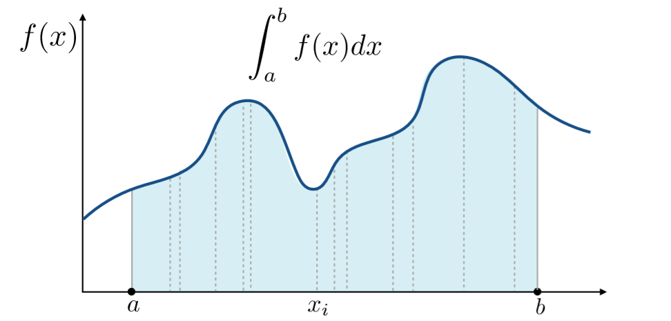
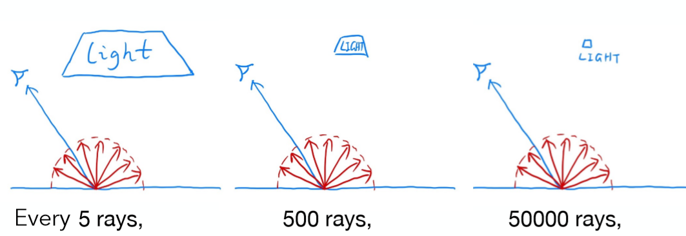
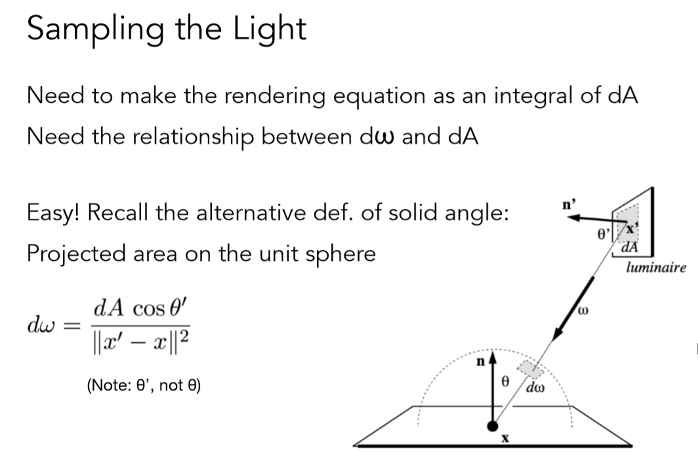

# 路径追踪基础


# 一、引言和概率论
一些内容参考Games101，以及这篇笔记：https://zhuanlan.zhihu.com/p/146714484

> 本节目标：将之前的光追基础程序修改为基于蒙特卡洛的路径追踪。


路径追踪是一种光线追踪算法，这一节中，我们将学习使用路径追踪实现更真实的全局光照效果。

在这之前，我们需要一些概率论的基础进而学习蒙特卡洛积分。（已经会的读者可以跳过这部分）

### 概率论基础

**1、概率函数**

使用函数的形式来表达概率。

概率函数$p_i=P(X=x_i)(i=1,2,3,4,5,6)$, $P(X=x_i)$表示取值到$x_i$的概率。


举个例子：我们扔一个六面骰子：

扔到3的概率是$\frac{1}{6}$,可以表示为$P(X=3)=\frac{1}{6}$

扔到5的概率是$\frac{1}{6}$, 可以表示为$P(X=5)=\frac{1}{6}$

扔到7的概率是0，可以表示为$P(X=7)=0$


**2、累积分布函数 / 概率分布函数**

累积分布函数又叫做概率分布函数。

对于所有实数值的随机变量$X$，累积分布函数定义如下：

$F_X(x)=P(X<=x)$

其中右侧表示随机变量$X$取值小于或等于$x$的概率。


举个例子：比如还是扔骰子的例子，

当x=3时，$F_X(3)=P(X<=3)=P(X=1)+P(X=2)+P(X=3)=\frac{1}{6}+\frac{1}{6}+\frac{1}{6}=\frac{3}{6}=\frac{1}{2}$

当x=5时，$F_X(5)=P(X<=5)=P(X=1)+P(X=2)+P(X=3)+P(X=4)+P(X=5)=\frac{1}{6}+\frac{1}{6}+\frac{1}{6}+\frac{1}{6}+\frac{1}{6}=\frac{5}{6}$

当x<1时，$F_X(x)=0$


**3、概率密度函数 PDF**

假设我们现在口袋里有大量黄色的乒乓球和少量的白色乒乓球。概率密度函数就是在告诉我们，抓到某种颜色的乒乓球的可能性有多大。例如这个情况中，抓到黄色乒乓球的概率就很大，抓到白色乒乓球的概率就很小。


概率密度函数（**P**robability **d**ensity **f**unction，简写作**PDF**) 用于描述连续型随机变量的概率分布。

对于一维连续随机变量 X ，设它的累积分布函数是$F_X(x)$，则*X*的概率密度函数是$pdf_X(x)$，可以表示为$X_i \sim pdf(x)$ ，满足：

$F_X(a)=\int_{-\infty}^{a}{pdf}_X(x)dx$

同样的，可以推出连续型随机变量的概率密度函数的如下性质：

1）$pdf_X(x)>=0$

2）$\int_{-\infty}^{\infty}pdf_X(x)dx=1$

3）$P(a<X<=b)= F_X(b)-F_X(a)=\int_{a}^{b}pdf_X(x)dx$

如果概率密度函数$f_X(x)$在一点$x$处连续，则累积分布函数$F_X(x)$在该点$x$处可导，且有：

$$F_X'(x)=pdf_X(x)$$


举个例子：以均匀分布为例，如果$X$在区间[0,1]上均匀分布，则其 概率密度函数 PDF为：

$$pdf_X(x)=\begin{cases}1&\text{if}\:0\le x\le1\\0&\text{otherwise}\end{cases}$$

在这个例子中，

1）计算在区间[0.2,0.5] 内的概率：

$$P(0.2<X\leq0.5)=\int_{0.2}^{0.5}f_X(x)\:dx=\int_{0.2}^{0.5}1\:dx=0.5-0.2=0.3$$

2）计算$P(X\leq0.3)$可以通过求积分得到

$$P(X\leq0.3)=\int_0^{0.3}f_X(x)\:dx=\int_0^{0.3}1\:dx=0.3$$


[2]https://en.wikipedia.org/wiki/Cumulative_distribution_function

[3]https://en.wikipedia.org/wiki/Probability_density_function


# 二、蒙特卡洛积分

在高等数学中，我们学习过一些函数的积分求解。但针对比较复杂的函数图像，求解积分就会变得很复杂，比如下图：



显然对于这样一个函数，很难去用一个方程或者解析式去描述，因此无法用一般解析的方法直接求得积分值，而这时候就可以采用蒙特卡洛的思想了。**蒙特卡洛积分的原理** 是对函数值进行多次采样，求取均值作为积分值的近似。

这种思想非常常见，例如如果我们对上面的函数从$a$到$b$均匀采样非常密集的点，就好像将整个积分区间切成了无数个很小的长方形，于是区间面积就变成了对所有小长方形求面积和，这就是**求解黎曼积分**的思想。对于蒙特卡洛积分而言，这种思想更具备一般性，**因为其可以指定一个分布来对被积分的值进行采样。**

假设我们要求解如下的积分：
$$
\int_{a}^bf(x)dx
$$
令采样点符合某一概率密度函数$X_i \sim pdf(x)$，此时蒙特卡洛的近似结果为：
$$
F_N = \frac{1}{N}\sum_{i=1}^N \frac{f(X_i)}{pdf(X_i)}
$$
举一个我们比较熟悉的例子，假设我们是在$[a,b]$区间中均匀采样$N$个点，那么根据概率论的基本知识，此时的概率密度函数为:
$$
X_i \sim pdf(x)=\frac{1}{b-a}
$$
于是此时计算蒙特卡洛的近似结果为：
$$
F_N = \frac{b-a}{N} \sum_{i=1}^N f(X_i)
$$
针对蒙特卡洛近似有如下基本结论：

- 采样点越多，结果越近似正确的结果；
- 如果是对$x$进行积分，那么就要对$x$进行采样；


# 三、路径追踪

## 1.回顾渲染方程

首先，我们来复习一下渲染方程：
$$
L_o(p,\omega_o)=L_e(p,\omega_o)+\int_{\Omega+}L_i(p,\omega_i)f_r(p,\omega_i,\omega_o)(n·\omega_i)d\omega_i
$$
可以看到，这是一个涉及到积分和递归的方程。


## 2.蒙特卡洛方法求解积分

很多时候，我们不需要关心渲染方程中的自发光项。在这里我们也是做类似的简化，此时方程可以简化为：
$$
L_o(p,\omega_o)= \int_{\Omega+}L_i(p,\omega_i)f_r(p,\omega_i,\omega_o)(n·\omega_i)d\omega_i
$$


根据第一部分的学习，我们有蒙特卡洛求解近似值的方法：
$$
F_N=\frac{1}{N} \sum_{i=1}^N \frac{f(X_i)}{p(X_i)} \quad  X_k \sim pdf(x)
$$
所以，核心思路就在于随机采样$\omega$，求出被积分函数的值，然后利用蒙特卡洛方法求解近似值。假设我们也是**均匀地在半球方向上进行采样。**对于单位半球而言，其概率密度函数为$p(\omega)=\frac{1}{2\pi}$。（==这里可以补充一下推导为什么是$\frac{1}{2\pi}$==）,此时就有：
$$
L_o(p,\omega_o)=\int_{\Omega+}L_i(p,\omega_i)f_r(p,\omega_i,\omega_o)(n·\omega_i)d\omega_i \\
\approx \frac{1}{N}\sum_{i=1}^N\frac{L_i(p,\omega_i)f_r(p,\omega_i,\omega_o)(n·\omega_i)}{pdf(\omega_i)}
$$
写成伪代码就是：

```c++
shade(p,wo)
    Randomly choose N directions wi_pdf
    Lo=0.0
    for each wi
        Trace a ray r(p,wi)
        if ray r hit the light
            Lo+=(1/N)*L_i*f_r*cosine/pdf(wi)
    return Lo
```

此时我们只考虑了直接光照的影响，也就是“追踪光线”直接可以打到光源的情况。如果是间接光照呢？看下一节。


### （1）间接光照

实际上我们引入间接光照是比较简单的，只需要将上面的方程改为递归式：

```c++
shade(p,w0)
    Randomly choose N directions wi_pdf
    L0=0.0
    for each wi
        Trace a ray r(p,wi)
        if ray r hit the light //前面的直接光照部分
            L0+=(1/N)*L_i*f_r*cosine/pdf(wi)
        else if ray r hit an object at q //引入间接光照
            L0+=(1/N)*shade(q,-wi)*f_r*cosine/pdf(wi)
    return L0
```

看起来很美好，但上述算法存在两个比较关键的问题：

- （1）**光线数量爆炸**：假设每次发射100根光线，这样如果引入间接光照，发生二次弹射，100根光线会变成10000根光线，导致光线数量爆炸，这种性能开销是不能接受的；
- （2）使用了递归函数，但是函数没有结束条件。


针对问题（1），可以思考一下，蒙特卡洛模拟的时候打出多少根光线时不会发生光线数量爆炸的现象呢？**答案是一根光线。**因此在做蒙特卡洛模拟的时候，我们只会每次打出一根光线：

```c++
shade(p,w0)
    Randomly choose ONE directions wi_pdf  //注意，只打出一根光线
    L0=0.0
    for each wi
        Trace a ray r(p,wi)
        if ray r hit the light
            L0+=L_i*f_r*cosine/pdf(wi)
        else if ray r hit an object at q //引入间接光照
            L0+=shade(q,-wi)*f_r*cosine/pdf(wi)
    return L0
```

**这种只打出一根光线的方法我们就叫做路径追踪。**在前面的光追篇中，我们会意识到每个像素只采样一次会导致结果充满噪声。当时的解决方案一种是每个像素内随机打出$N$根光线再取平均，或者是利用类似于TAA的方法做时间上的降噪（其实就是把多个采样样本分散在了时间上）。以解决方案一为例，代码类似如下：
```c++
ray_generation(camPos,pixel)
    Uniformly choose N sample positions within the pixel
    pixel_radiance=0.0
    for each sample in the pixel
        Shoot a ray r(camPos,cam_to_sample)
        if ray r hit the scene at p
            pixel_radiance+=1/N*shade(p,sample_to_cam)
    return pixel_radiance
```

**通过这种方式，也类似于蒙特卡洛的方法，通过增大样本数来进行降噪处理，从而避免因为防止光线爆炸而造成的采样数不足问题。**


接下来的问题是，针对上面的问题（2），要如何解决？

> 一种直观的想法是像之前的光线追踪程序一样，设置最大的递归深度为N，即光线最多可以递归N次。这样做好像渲染结果也不错，但是是错误的。因为在真正的自然界中，光线在传入到我们眼睛的时候应该是已经弹射无数次的，暴力地设置递归的最大次数，我们无法求出$L_o$的正确期望值。正确的方法就是下一节所描述的俄罗斯轮盘赌方法。


### （2）俄罗斯轮盘赌（**Russian Roulette**，RR）

首先介绍一下RR指的是什么。假设左轮手枪里一共可以放置6发子弹，现在里面一共有两发子弹，但并不知道子弹的位置，那么$A$拿起枪并朝$B$开枪，$B$没有被击中的概率很好计算，应该为$4/6$，这就是俄罗斯轮盘赌的概念。放在我们的路径追踪里，我们要如何使用RR方法呢？

首先，让我们设定一个概率值$p(0<p<1)$，每次打到场景物体的时候，光线有$p$的概率会继续递归，并返回着色结果为$L_o/p$，有$1-p$的概率会直接停止递归，并返回0。此时可以发现，光线基本一定会在弹射一定次数之后停止递归，但总体的期望是不变的，可以计算一下：
$$
E = p * (L_o/p) + (1-p)*0 = L_o
$$
这就是RR的巧妙之处了。通过这种方式，我们的递归就会有终止条件了。此时的代码修改如下：

```c++
shade(p,w0)
    //新增:RR
    Maually specify a probability P_RR
    Randomly select ksi in a uniform dist. in [0,1] //生成一个随机数
    if (ksi>P_RR) return 0.0
    Randomly choose ONE directions wi_pdf
    L0=0.0
    for each wi
        Trace a ray r(p,wi)
        if ray r hit the light
            L0+=L_i*f_r*cosine/pdf(wi)/P_RR
        else if ray r hit an object at q //引入间接光照
            L0+=shade(q,-wi)*f_r*cosine/pdf(wi)/P_RR
    return L0
```

此时我们解决了上面的两个递归求解的问题，但还有一个小问题：**我们的蒙特卡洛路径追踪方法还不够高效。**可以看下图帮助理解：



我们在每次计算直接光照的时候，通过任选一个方向（特别是对于lambert的漫反射情况），但很少会的光线可以hit光源，尤其当光源较小的时候，这种现象越明显，大量采样的光线都被浪费了。例如上图最右侧，假设我们的光源非常小，蒙特卡洛近似的时候采样50000根光线可能只有几根打到了光源上，此时就会造成浪费。如何更高效地进行采样呢？下一节会进行介绍。


### （3）对光线直接采样

如果想让采样都不浪费，一种想法是可以直接在光源上采样（注意，先不考虑物体和光源采样点连线中间有遮挡物地情况）。在光源上采样的好处就在于可以保证在没有中间遮挡物的情况下，所有采样的光线都一定会击中光源，这样就不会造成光线的浪费了。

假设光源的面积为$A$，并且我们是对光源进行均匀采样的，此时采样的概率密度函数应该为:
$$
pdf = 1/A
$$
回顾一下前面的渲染方程（依旧忽略自发光项）：
$$
L_o(p,\omega_o)= \int_{\Omega+}L_i(p,\omega_i)f_r(p,\omega_i,\omega_o)(n·\omega_i)d\omega_i
$$
这个积分是针对于$d{\omega_i}$的。在前面讲解蒙特卡洛近似的基础的时候，我们有提到如果是对$x$进行积分，那么就要对$x$进行采样。所以关键在于找到$dA$和$d{\omega_i}$之间的关系，这样我们就可以变换积分域了。看下图：



重点是这个结论：
$$
dw=\frac{dAcos \theta'}{||x'-x||^2}
$$

> 以上公式是如何推导出来的？首先来看分子的$dAcos \theta'$，可以发现这个结果是$dA$在与$d\omega$平行的面积部分。然后依据立体角的定义，就可以得到上面的式子了。

这时就可以改写刚才的积分公式：
$$
L_0(x,\omega_0)=\int_{\Omega+}L_i(x,\omega_i)f_r(x,\omega_i,\omega_0)cos\theta d\omega_i \\
=\int_A L_i(x,\omega_i)f_r(x,\omega_i,\omega_o)\frac{cos\theta cos \theta'}{||x'-x||^2}dA
$$
这样我们的积分域就转换到了光源上，自然蒙特卡洛近似也可以在光源上进行，此时前面的算法还可以再次改进。对于光线求交的交点，如果我们发现和光源采样点间没有遮挡物，就直接计算上式的结果（并且不需要进行RR，相当于在光源上采样）；否则如果交点和光源之间有遮挡物，则计算间接光照，并且启用RR策略。最终改进之后的基于蒙特卡洛的路径追踪算法核心函数为：

```c++
shade(p,w0):
    #contribution from the light source.
    L_dir=0.0
    Uniformly sample the light at x1 (pdf_light=1/A)
    Shoot a ray from p to x1
    if the ray is not blocked in the middle
        L_dir = L_i*f_r*cosθ*cosθ1/|x1-p|^2/pdf_light

    #Contribution from other reflectors.
    L_indir=0.0
    Test Russian Roulette with probability P_RR

    Uniformly sample the hemosphere toward wi(pdf_hemi=1/2pi)
    Trace a ray r(p,wi)
    if ray r hit a non-emitting object at q
        L_indir=shade(q,-wi)*f_r*cosθ/pdf_hemi/P_RR

    return L_dir+L_indir
```


## 3.几点补充说明

- （1）点光源比较麻烦，不做过多讨论。这里建议把点光源替换为小面积的面光源；
- （2）其他的一些工业界使用的方法，后续可以进行补充：
  - (Unidirectional & bidirectional) path tracing
  - photon mapping
  - metrophlis light transport
  - VCM/UPBP


### 

