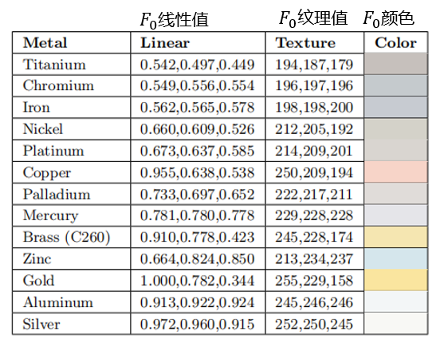

# lesson15_PBR

PBR即Physically Based Shading，基于物理的渲染，我们前面讲解了渲染方程，是基于真实世界的原理，这节中我们将基于渲染方程实现基于物理的渲染，比起前面的”基础光照“的章节，我们将实现基于现实世界中物理原理的更真实的渲染。


## 微表面（**Microfacet**）模型

日常生活中，无论是看起来相对粗糙还是相对光滑的表面，在微观上，它们大都是由不规则的微小表面构成的，如下图的香蕉皮表面和金属镁表面，在显微镜下的样子。


（a）图源[4]   [7] [8]       香蕉皮表面  					（b）图源[5]     [7] [8]  金属镁表面							

有的法线相对变化更大，法线朝向更不一致，反射的光线也会往四面八方去，表面也会看起来粗糙一些，如上图（a）香蕉皮表面。

有的法线相对变化较小，法线朝向更一致，更有机会产生镜面反射，表面也会看起来更平滑一些，如上图（b）金属镁表面。

我们很难对以上这种微小到比单个像素还小的，且不规则的表面显示建模，且我们的眼睛和大部分相机也无法观测到这样的微小表面，因此，我们转而对他们的总体效果进行统计建模。

我们在宏观上使用一个粗糙度(Roughness)参数，然后用统计学的方法来概略的估算微平面的粗糙程度。

下图展示了将凹凸不平的表面逐渐缩小之后，凸起大小逐渐减小，直到最后一张图像中的表面凸起比单个像素还要小得多，已经无法看到表面的凹凸不平，而是看到了一个统计的总体高光效果。


图源[2]  从可见的宏观表面细节逐渐过渡到微观尺度。图像序列按照从上到下，从左到右排布。每个图像中的表面形状和光源都是固定的，只有表面细节的尺度发生了变化。


因此，材质的粗糙程度可以通过微表面的法线分布情况来体现.下面的基于微表面理论的 BRDF模型中镜面反射项的NDF会更细致地讨论这点。


## 基于微表面理论的 BRDF模型

介绍：

前面的辐射度量学与渲染方程章节中我们学习了BRDF与渲染方程等内容。许多BRDF模型都是建立在上面所提到的微表面模型之上的。其中，Cook-Torrance BRDF是一个比较经典的BRDF模型，它是由ROBERT L. COOK 和 KENNETH E. TORRANCE在1982年于《A Reflectance Model for Computer Graphics》中提出的。


Cook-Torrance BRDF分为漫反射和镜面反射两个部分：
$$
\large f_r = k_d f_{lambert} + k_s f_{specular}
$$
$k_d$ : 漫反射系数.  （后面的ibl章节有更详细介绍）

 $k_s$ : 镜面反射系数.$k_d=1-k_s$ 。表示的是入射光中被反射的比例。

 $f_{lambert}$ : 漫反射部分

 $f_{specular}$ : 镜面反射部分.

$k_d$  漫反射系数在后面的ibl章节有详细介绍，而接下来我们会讲解表基于微表面理论的 BRDF模型的 $f_{lambert}$ 漫反射部分和 $f_{specular}$ 镜面反射部分.

### 漫反射部分 

 $f_{lambert}$ 漫反射部分叫做Lambertian Diffuse。 类似于我们之前提到的漫反射着色，是一个恒定的算式：
$$
\large f_{lambert}=\frac{c}{\pi}
$$

其中 $c$ 表示Albedo或表面颜色。

推导过程如下：

我们首先回忆一下前面渲染方程章节中提到的渲染方程定义（这里也是反射方程，我们暂时先忽略自发光项）：

**反射方程**：

$L_o(\omega_o)$表示的是表面从$\omega_o$ 出射的总的radiance(辐射率), 包含表面上半球所有方向的入射光线的能量贡献。如下图，假设有多个光源照亮表面p，它们都会影响到从$\omega_o$ 出射的光线的强度/能量。


反射方程的公式：
$$
L_o(\omega_o)=\int_{\H^{2}(n)}L_i(\omega_i)f_r(w_i\rightarrow w_o)cos\theta_i d\omega_i
$$

（$\H^{2}(n)$是指单位半球面，指表面上半球面。）

**半球定向反射率（hemispherical-directional reflectance）**

此处我们进一步定义一个半球定向反射率（hemispherical-directional reflectance）$R(\omega_o )$ , 

对于 $R(\omega_o )$的公式如下：
$$
R(\omega_o)=\int_{\H^{2}(n)}f_r(w_i\rightarrow w_o)cos\theta_i d\omega_i
$$

与反射方程仅相差一个$L_i(\omega_i)$ . 

**定向半球反射率（directional-hemispherical reflectance）**

还可以定义一个相反的函数：定向半球反射率（directional-hemispherical reflectance）$R(\omega_i)$ , 与上面的反射方程求的$\omega_o$不同，这次我们要求的是对于入射方向$\omega_i$,  入射光线被反射到半球内的各个方向， $R(\omega_i)$表示了这个入射光线被反射到半球方向内的数量，如下图。


对于 $R(\omega_i)$的公式如下：
$$
R(\omega_i)=\int_{\H^{2}(n)}f_r(w_i\rightarrow w_o)cos\theta_o d\omega_o
$$

由于BRDF具有**可逆性（reciprocity ）**（辐射度量学与渲染方程章节讲过），$R(\omega_i)=R(\omega_o)$  , 可以使用定向反照率（directional albedo）来作为两个反射率的统称。

 $R(\omega_i)$测量了给定入射方向上的能量损失。如果$R(\omega_i)=0$， 表示表示入射光线被完全吸收，没有反射出来。如果$R(\omega_i)=1$，则表示入射光线被完全反射，没有被吸收。由于$\omega_i$即入射光方向， $R(\omega_i)$也被写为 $R(l)$。$R(l)$ 通常会被吧I奥什维一个RGB向量，以便用于渲染。由于RGB的每个分量（红、绿、蓝）都被限制在[0,1]的范围内，因此 $R(l)$也可以被认为是一个颜色。

**Lambertian BRDF**

对于漫反射来说，我们知道，漫反射是均匀的反射，即对于任意出射方向$\omega_o$，$f_r(w_i\rightarrow w_o)$都是一个常数，即$f_r(w_i\rightarrow w_o)=f_{lambert}$。因此，对于漫反射来说，$R(\omega_i)$可以积分简化为：
$$
R(\omega_i)=f_{lambert}\int_{\H^{2}(n)}cos\theta_o d\omega_o
$$

进一步推导：(辐射度量学与渲染方程章节推导过$\mathrm{d} \omega =\sin \theta \mathrm{d} \theta \mathrm{d} \phi $  )
$$
R(\omega_i)=\\
f_{lambert}\int_{\H^{2}(n)}cos\theta_o d\omega_o=\\
f_{lambert}\int_{\H^{2}(n)}cos\theta_o sin\theta_o d\theta d\phi=\\
f_{lambert}\int_{0}^{2\pi}d \phi \int_{0}^{0.5\pi}cos\theta_o sin\theta_o d\theta =\\
f_{lambert}2\pi \int_{0}^{0.5\pi}0.5sin2\theta_o d\theta =\\
f_{lambert}2\pi \int_{0}^{0.5\pi}0.5sin2\theta_o d\theta =\\
f_{lambert}\pi \int_{0}^{0.5\pi}sin2\theta_o d\theta =\\
=f_{lambert}\pi \left[ -\frac{1}{2}cos2\theta_o \right]_{0}^{0.5\pi}=\\
=f_{lambert}\pi \left[ -\frac{1}{2}cos\pi + \frac{1}{2}cos0 \right]=\\
=f_{lambert}\pi \left[ -\frac{1}{2}(-1) + \frac{1}{2}(1) \right]=\\
f_{lambert} \pi
$$
所以
$$
R(\omega_i)=f_{lambert}\int_{\H^{2}(n)}cos\theta_o d\omega_o=f_{lambert} \pi
$$


则$f_{lambert}$可以表示为：（由上文可知$R(\omega_i)$即 $R(l)$是颜色，以下我们表示为c）
$$
f_{lambert}=\frac{R(\omega_i)}{\pi}=\frac{c}{\pi}
$$


### 镜面反射部分

$$
\large f_{specular} = \frac{DFG}{4(\omega_o·n)(\omega_i·n)}
$$

Cook-Torrance镜面反射BRDF由3个函数（D，F，G）和一个标准化因子构成。D，F，G符号各自近似模拟了特定部分的表面反射属性：【改】

（入射方向=光照方向$\omega_i=l$， 出射方向=视线方向$\omega_o=v$）


#### （1）D (Normal Distribution Function，NDF)  法线分布函数

法线分布函数（normal distribution function，NDF）是上面的微表面（**Microfacet**）模型提到的法线分布函数。Cook-Torrance镜面反射BRDF中我们将使用D来表示方程中的NDF项。

我们将微表面的法线表示为$m$。

复习一下下图：


（a）图源[4]   [7] [8]       香蕉皮表面  					（b）图源[5]     [7] [8]  金属镁表面							

有的法线$m$相对变化更大，法线$m$朝向更不一致，反射的光线也会往四面八方去，表面也会看起来粗糙一些，如上图（a）香蕉皮表面。

有的法线$m$相对变化较小，法线$m$朝向更一致，更有机会产生镜面反射，表面也会看起来更平滑一些，如上图（b）金属镁表面。

因此我们可以使用粗糙度(Roughness) $\alpha$参数来模拟NDF。


D(Normal Distribution Function，NDF)  法线分布函数描述的是法线分布的概率。

如果表面是各向同性的（isotropic）【后面补充】，NDF的变量只有一个，即宏表面法线 $n$ 与微表面法线 $m$ 之间的夹角$\theta _m$ 。理想情况下，NDF可以写为关于$\cos \theta _m =  {n}\cdot {m}$ 的表达式 .  然而有时候我们会使用半程向量$h$来表示NDF。


**半程向量**

首先 复习一下 基础光照 中讲到的半程向量：


> $\vec{h}$被称之为半程向量，其计算公式如下（这里的字母都是向量，省略向量符号）：
> $$
> \vec{h} = \frac{v+l}{||v+l||}
> $$
> 其中，$||v+l||$指的是这两个向量相加之后的向量的模，实际上就是对$v+l$向量的归一化。得到的结果就是上图的白色向量（Half Vector）。
>
> $v$ 视线，图中的camera。$l$为light，图中的sun。


###### 基于微表面模型的法线分布函数（normal distribution function，NDF）

法线分布函数（normal distribution function，NDF）近似地表示了法线$n$与半程向量$h$取向一致的微平面的比例。


可以认为，只有法线$\mathbf{m}$与半程向量 $\mathbf{h}$ 一致的微平面才能正确地将光线从入射方向$l$反射到出射方向$v$上，其他朝向的表面点对BRDF没有贡献（正负相互抵消）。这个值是通过$D(\mathbf{h})$项给出的。$D(\mathbf{h})$常被直接写作$D(\mathbf{m})$。


图源 rtrt4 由微表面构成的表面。只有微表面法线$\mathbf{m}$与半向量$\mathbf{h}$一致的微表面（图中红色的微表面），才会参与从入射方向$\mathbf{l}$到观察方向$\mathbf{v}$的光线反射

也就是说，只有$\mathbf{m}=\mathbf{h}$ 的微表面是有效的。

因此很多时候我们用宏表面的半程向量 $\mathbf{h}$ 来表示微表面的法线$\mathbf{m}$。

因此也可以说，法线分布函数，从统计学上近似的表示了与半程向量ℎ取向一致的微平面的比率。


对法线分布函数$D(\mathbf{m})$在微表面法线$\mathbf{m}$上积分，可以得到微表面的面积。

将法线分布函数$D(\mathbf{m})$投影到宏表面上，即得到$D(\mathbf{m})(\mathbf{n}\cdot\mathbf{m})$ ，对$D(\mathbf{m})(\mathbf{n}\cdot\mathbf{m})$ 进行积分，可以得到微表面投影到宏表面的面积，也就是宏表面片元（patch）的面积，其被约定为1。


图源 rtr4  微表面的侧视图。对$D(\mathbf{m})(\mathbf{n} \cdot \mathbf{m})$进行积分，即将微平面区域$D(\mathbf{m})$投影到宏表面平面上，所得到的宏表面面片（patch）的面积为1，其被约定为1。
$$
\int_{\mathbf{m} \in \Theta} D(\mathbf{m})(\mathbf{n} \cdot \mathbf{m}) d \mathbf{m}=1
\tag{1}
$$
$\Theta$ : 表示整个球面而非半球。

更一般地，微观表面（microsurface）和宏观表面（macrosurface）在垂直于任何视线方向$\mathbf{v}$的平面上的投影是相等的：
$$
\int_{\mathbf{m} \in \Theta} D(\mathbf{m})(\mathbf{v} \cdot \mathbf{m}) d \mathbf{m}=\mathbf{v} \cdot \mathbf{n}
\tag{2}
$$
###### **Beckmann 分布**

NDF有多种估计方法，第一个微表面模型里使用的表面分布函数是Beckmann NDF（Beckmann 分布），如今仍然广为使用。我们这里讲解的Cook-Torrance BRDF的NDF就是使用这个Beckmann NDF。

归一化的Beckmann  NDF的公式如下：

$$
\LARGE D(\mathbf{m})=\frac{\chi^{+}(\mathbf{n} \cdot \mathbf{m})}{\pi \alpha_{b}^{2}(\mathbf{n} \cdot \mathbf{m})^{4}}
\exp ^\left(\frac{(\mathbf{n} \cdot \mathbf{m})^{2}-1}{\alpha_{b}^{2}(\mathbf{n} \cdot \mathbf{m})^{2}}\right)
\tag{1}
$$

$\alpha_{b}$ ： 粗糙度 ， $\alpha_{b} = 0$代表了一个完全光滑的表面。

$\chi^{+}(\mathbf{n} \cdot \mathbf{m})$ ：$\chi^{+}$为正特征函数：

$$
\chi^{+}(x)=\left\{\begin{array}{ll}1, & \text { where } x>0, \\ 0, & \text { where } x \leq 0 .\end{array}\right.
\tag{2}
$$

$\chi^{+}(\mathbf{n} \cdot \mathbf{m})$确保了指向宏表面下方的微表面法线的NDF为0。有的文献会将这项忽略不计。

UE4中对Beckmann分布的实现代码如下：

用$ \mathbf{h}$表示$\mathbf{m}$ , 其中$\mathbf{n} \cdot \mathbf{m}$写为$\mathbf{n} \cdot \mathbf{h}$   ， 保证其大于0所以$\chi^{+}(\mathbf{n} \cdot \mathbf{m})$忽略。

```C++
// [Beckmann 1963, "The scattering of electromagnetic waves from rough surfaces"]
float D_Beckmann( float a2, float NoH )
{
    float NoH2 = NoH * NoH;
    return exp( (NoH2 - 1) / (a2 * NoH2) ) / ( PI * a2 * NoH2 * NoH2 );
}
```


###### **GGX（Trowbridge-Reitz）分布**

GGX分布又名Trowbridge-Reitz分布，由Trowbridge和Reitz于1975年提出，2007年，Walter等人独立重新发现并并命为GGX分布[10]。GGX分布是游戏和电影中最常用的法线分布函数。

GGX分布的公式如下：

$$
D(\mathbf{m})=\frac{\chi^{+}(\mathbf{n} \cdot \mathbf{m}) \alpha_{g}^{2}}{\pi\left(1+(\mathbf{n} \cdot \mathbf{m})^{2}\left(\alpha_{g}^{2}-1\right)\right)^{2}}
\tag{3}
$$

$\alpha_{g}$ ： 粗糙度 。 在迪士尼原理着色模型（Disney principled shading model）中，Burley推荐将粗糙度控制以$\alpha_{g}=r^{2}$暴露给用户，其中$r$是0到1之间的用户界面粗糙度参数值，以让分布以更线性的方式变化。这种方式实用性较好，不少使用GGX分布的引擎与游戏都采用了这种映射，如UE4和Unity。

如果用$ \mathbf{h}$表示$\mathbf{m}$， $\mathbf{n} \cdot \mathbf{m}$写为$\mathbf{n} \cdot \mathbf{h}$   ， 保证其大于0所以将$\chi^{+}(\mathbf{n} \cdot \mathbf{m})$忽略。GGX分布也可以写为：
$$
D(\mathbf{h})=\frac{\alpha_{g}^{2}}{\pi\left(1+(\mathbf{n} \cdot \mathbf{h})^{2}\left(\alpha_{g}^{2}-1\right)\right)^{2}}
\tag{4}
$$
UE4中对GGX分布的实现代码如下：（对应公式4）

```C++
// GGX / Trowbridge-Reitz
// [Walter et al. 2007, "Microfacet models for refraction through rough surfaces"]
float D_GGX( float a2, float NoH )
{
    float d = ( NoH * a2 - NoH ) * NoH + 1; // 2 mad
    return a2 / ( PI*d*d );         // 4 mul, 1 rcp
}
```


使用不同的粗糙度得到的效果：


图源[3]


综上，我们可以输入 {微表面粗糙度$\alpha$ + 宏表面法线方向$\mathbf{n}$ + 微表面法线方向$\mathbf{m}$ } 或者 {微表面粗糙度$\alpha$ + 宏表面法线方向$\mathbf{n}$ + 半程向量$\mathbf{h}$ } 来得到D(Normal Distribution Function，NDF) 法线分布函数； 

#### （2）G（Geometry Function）几何函数

我们考虑以下情况，情况1如下图：微表面遮挡住了光源方向$\mathbf{l}$来的入射光，产生阴影（Shadowing）。那么产生阴影的微平面对BRDF没有贡献。


情况2如下图：微表面遮挡住了往视线方向$\mathbf{v}$去的出射光，产生遮蔽（Masking）。那么被遮蔽的微平面对BRDF没有贡献。


上面的NDF函数部分中提到，$\mathbf{m}=\mathbf{h}$ 的微表面分布函数由法线分布函数$D(\mathbf{m})$进行建模。对法线分布函数$D(\mathbf{m})$在微表面法线$\mathbf{m}$上积分，可以得到微表面的面积。但是如上图所示，被遮挡的微平面对于BRDF是没有贡献的，因此，我们需要引入G项来保证这样光线无法入射到，或者光线无法出射的微平面被舍弃，不会被计入最后的BRDF.

我们再看一个场景，如下图右侧子图所示，有很多微表面的投影互相重叠，但实际上，我们并不关心不能被我们的相机所看到的那些微表面，如下图我们只关心粉色箭号所指向的距离相机最近的那个微表面。因此我们需要引入G项来保证这样的微表面被舍弃。


图编辑自[2]Real-Time Rendering 4th


图源[2]Real-Time Rendering 4th    对可见微平面的投影区域（粉红色）进行积分，得到宏观表面在垂直于v的平面上的投影面积

我们定义遮挡函数（masking function）$G_{1}(\mathbf{m}, \mathbf{v})$，是沿着视线方向$\mathbf{v}$ ，具有法线$\mathbf{m}$的可见的微表面的比例。


接上面的 法线分布函数的”基于微表面模型的法线分布函数“部分提到的内容, 

微观表面（microsurface）和宏观表面（macrosurface）在垂直于任何视线方向$\mathbf{v}$的平面上的投影是相等的：
$$
\int_{\mathbf{m} \in \Theta} D(\mathbf{m})(\mathbf{v} \cdot \mathbf{m}) d \mathbf{m}=\mathbf{v} \cdot \mathbf{n}
\tag{2}
$$
将$G_{1}(\mathbf{m}, \mathbf{v}) D(\mathbf{m})(\mathbf{v} \cdot \mathbf{m})^{+}$在球面上进行积分并投影到垂直于视线$v$的平面上，得到宏观表面在垂直于v的平面上的投影面积，即上图右侧标注黑色线条的$cos\theta_{o}$。
$$
\int_{\in \Theta} G_{1}(\mathbf{m}, \mathbf{v}) D(\mathbf{m})(\mathbf{v} \cdot \mathbf{m})^{+} d \mathbf{m}=\mathbf{v} \cdot \mathbf{n}
\tag{3}
$$

但是仅仅有公式（3）并不能唯一的确定$G_{1}(\mathbf{m}, \mathbf{v})$项到底是什么样的函数，不同的法线分布函数$D(\mathbf{m})$可能会有不同的$G_{1}(\mathbf{m}, \mathbf{v})$。原因是法线分布函数$D(\mathbf{m})$仅仅是描述了微表面的法线分布情况，即多少个微表面的法线指向了$\mathbf{m}$方向，但并没有具体说明微表面的形状，具体这些法线是如何排布的。

如下图所示，具有相同法线分布但具有不同轮廓（profiles）的微表面也导致不同的BRDF。

下图中法线分布函数$D(\mathbf{m})$是一致的，但是排布方式是不同的，右侧微表面的遮挡情况更严重，二者的BRDF会有一定的不同。


​							图源[13]Heitz, Eric. "Understanding the masking-shadowing function in microfacet-based BRDFs."

因此，要确定G项，除了公式（3）的约束，我们还需要选择合适的微表面轮廓（microsurface profile）。

目前已经有多种形式的$G_{1}$函数，但是只有**Smith遮蔽函数（Smith masking function）**和Cook-Torrance使用的**V腔遮蔽函数（V-cavity masking function）**是基于物理的，这个结论由Heitz在[13]Heitz, Eric. "Understanding the masking-shadowing function in microfacet-based BRDFs."中证明得到。

其中Heitz还证明了Smith遮蔽函数（Smith masking function）更符合真实世界的反射现象，如下图：


​					图源[13]Heitz, Eric. "Understanding the masking-shadowing function in microfacet-based BRDFs."


Smith$G_{1}$函数的公式如下：
$$
G_{1}(\mathbf{m}, \mathbf{v})=\frac{\chi^{+}(\mathbf{m} \cdot \mathbf{v})}{1+\Lambda(\mathbf{v})}
\tag{4}
$$


我们回忆一下之前提到的，产生阴影的微表面和被遮蔽的微表面一样，都对BRDF没有贡献。因此，我们定义：
$$
G_{2}(\mathbf{l}, \mathbf{v}, \mathbf{m})=G_{1}(\mathbf{v}, \mathbf{m}) G_{1}(\mathbf{l}, \mathbf{m}).
$$


（4）中每个法线分布函数NDF的$\Lambda$（lambda）函数都不一样，我们针对法线分布函数部分讲到的两个法线分布讲一下它们对应的$\Lambda$（lambda）函数。

##### Beckmann法线分布的$\Lambda$函数

$$
\Lambda(a)=\frac{\operatorname{erf}(a)-1}{2}+\frac{1}{2 a \sqrt{\pi}} \exp \left(-a^{2}\right)
\tag{5}
$$

其中：

$a$ ： $a=\frac{\mathbf{n} \cdot \mathbf{s}}{\alpha \sqrt{1-(\mathbf{n} \cdot \mathbf{s})^{2}}}= \frac{1}{\alpha\\tan \theta} $	

$\operatorname{erf}$ ：误差函数（error function），$erf(x)= \frac{2}{\sqrt{\pi}}\int_{0}^{x}e^{-x^{2}}dx$

公式（5）的计算开销很大，因为其包含了误差函数$erf(x)= \frac{2}{\sqrt{\pi}}\int_{0}^{x}e^{-x^{2}}dx$ ， 因此Walter 等人[10] 提出了如下的精确的近似计算代替:
$$
\Lambda(a) \approx\left\{\begin{array}{ll}\frac{1-1.259 a+0.396 a^{2}}{3.535 a+2.181 a^{2}}, & \text { where } a<1.6, \\ 0, & \text { where } a \geq 1.6 .\end{array}\right.
\tag{6}
$$


##### GGX法线分布的$\Lambda$函数

GGX分布具有形状不变性，其Smith$G_{1}$的$  \Lambda $函数相对比较简单：

$$
\Lambda(a)=\frac{-1+\sqrt{1+\frac{1}{a^{2}}}}{2}
\tag{7}
$$

其中：

$a$ ： $a=\frac{\mathbf{n} \cdot \mathbf{s}}{\alpha \sqrt{1-(\mathbf{n} \cdot \mathbf{s})^{2}}} $  实际上，公式（7）的$a$只会以$a^2$的形式出现，即$a^2= \frac{(\mathbf{n} \cdot \mathbf{s})^2}{\alpha^2 (1-(\mathbf{n} \cdot \mathbf{s})^2)}$，这对于计算是很方便的，因为我们避免了a的平方根计算。


##### GGX-Smith 几何函数的发展

###### Disney实现的GGX-Smith 几何函数

Disney将粗糙度进行重映射，将α 从[0,1]重映射到[0.5, 1] ，使得粗糙度的变化可以更平滑，对美术人员更友好：
$$
\alpha = (0.5 + roughness/2)^2
$$

Disney实现的GGX-Smith 几何函数如下：


$$
G_1(\mathbf{v})=\dfrac{2(\mathbf{n}\cdot\mathbf{v})}{(\mathbf{n}\cdot\mathbf{v})+\sqrt{\alpha^2+(1-\alpha^2)(\mathbf{n}\cdot\mathbf{v})^2}}
\\
G(\mathbf l,\mathbf v,\mathbf h)=G_1(\mathbf l)G_1(\mathbf v)
$$

###### UE4实现的GGX-Smith 几何函数

UE4参考了Disney将粗糙度进行重映射：
$$
 \alpha = (0.5 + roughness/2)^2
$$
定义$\LARGE k=\frac{\alpha}{2}$，UE4基于Schlick近似, 实现的GGX-Smith 几何函数如下：
$$
G_1(\mathbf{v})=\dfrac{\mathbf{n}\cdot\mathbf{v}}{(\mathbf{n}\cdot\mathbf{v})(1-k)+k}
\\
G(\mathbf l,\mathbf v,\mathbf h)=G_1(\mathbf l)G_1(\mathbf v)
$$


- **D**：**(Normal Distribution Function，NDF)**：法线分布函数，估算在受到表面粗糙度的影响下，**取向方向与半程向量一致的微平面的数量比例**。这是用来估算微平面的主要函数。
- **F：**(Fresnel equation)：菲涅尔方程，描述的是在不同的表面角下表面反射的光线所占的比率。
- **G**：(Geometry function)：几何函数，描述了微平面自成阴影的属性。当一个平面相对比较粗糙的时候，平面表面上的微h0平面有可能挡住其他的微平面从而减少表面所反射的光线。

以上的每一种函数都是用来估算相应的物理参数的，而且可以发现用来实现相应物理机制的每种函数都有不止一种形式。它们有的非常真实，有的则性能高效。可以按照自己的需求任意选择自己想要的函数的实现方法。Epic Games公司的Brian Karis对于这些函数的多种近似实现方式进行了大量的研究。这里将采用Epic Games在Unreal Engine 4中所使用的函数，其中**D使用Trowbridge-Reitz GGX**，**F使用Fresnel-Schlick近似法(Approximation)**，而**G使用Smith's Schlick-GGX**。


IBL章节写得：

本来我们在计算光照的时候，来自整个上半球的入射光都会对光照结果产生影响。为了以更有效的方式解决积分（对应上述的需求（2）），我们需要对其大部分结果进行预处理——或称预计算。**如何预计算呢？这就是我们要解决的问题。**

对于渲染方程来说：
$$
L_o\left(p, \omega_o\right)=\int_{\Omega}\left(k_d \frac{c}{\pi}+k_s \frac{D F G}{4\left(\omega_o \cdot n\right)\left(\omega_i \cdot n\right)}\right) L_i\left(p, \omega_i\right) n \cdot \omega_i d \omega_i
$$
复习一下PBR章节提到的，我们可以认为在Cook-Torrance BRDF下，BRDF的漫反射项和镜面反射项是可以拆开的，可以将上述积分分为两部分：
$$
L_o\left(p, \omega_o\right)=\int_{\Omega}\left(k_d \frac{c}{\pi}\right) L_i\left(p, \omega_i\right) n \cdot \omega_i d \omega_i + \int_{\Omega}\left(k_s \frac{D F G}{4\left(\omega_o \cdot n\right)\left(\omega_i \cdot n\right)}\right) L_i\left(p, \omega_i\right) n \cdot \omega_i d \omega_i
$$
通过将积分分成两部分，我们可以分开研究漫反射和镜面反射部分。**在这一部分中，我们会先预计算漫反射项。**


#### （3）F（ Fresnel ）菲涅尔反射

我们在“光线追踪”章节中提到过一部分菲涅尔方程，用于折射时判断有多少光线发生了折射，有多少光线发生了反射，同样的，在PBR中我们也会使用菲涅尔反射率（Fresnel reflectance）来计算被反射的光的比例。

我们回顾一下，光打到表面可能发生反射，也可能发生折射，这个比例是由菲涅尔反射率（Fresnel reflectance）$F$ 来决定的。


上图中，$\theta_i$是入射角，$\theta_r$是折射角，$\eta_1$是入射介质的折射率，$\eta_2$是折射介质的折射率。

回忆一下在现实世界中，我们直视玻璃，可以透过玻璃看到后面的东西，但是当我们从很斜的视角侧面看玻璃时，我们会看到玻璃的反射光。

这里可以放一个玻璃图片

同样的，如下图，我们从很斜的视角侧面看木头时，我们会看到木头的反射光。

这里放那个木头和书图片


了解了例子之后我，我i们也能比较理解菲涅尔反射率（Fresnel reflectance）$F$ 具有的以下特征：

1) 当入射角$\theta_{i}=0^{\circ}$时 ， 光线垂直于表面，这个特殊值$F_0$，我们可以认为它是表面物质的镜面颜色。

2) 当入射角$\theta_{i}=90^{\circ}$时 ， 光线平行于表面，$F=1$，即白色。

如下图，对于不同的材质，我们可以看到当$\theta_{i}$较小的时候，随着入射角$\theta_{i}$不断增大，这些材质的菲涅尔反射率$F$ 基本没有太大变化；而在接近$\theta_{i}=90^{\circ}$时 ，$F$ 会迅速增长为1.


图源[2] Real-Time Rendering 4th

上图代表玻璃、铜、铝（从左到右）的菲涅尔反射率（Fresnel reflectance）$F$ 的变换。

第一行图中横轴是波长，纵轴是入射角$\theta_{i}$，竖轴是$F$， 

第二行图图中横轴是入射角$\theta_{i}$，竖轴是$F$。不同的线条代表在不同入射角$\theta_{i}$下，$F$转换为 RGB 颜色通道的曲线。

第二行图图中横轴是波长，竖轴是$F$。底下展示了菲涅尔反射的 RGB 颜色。


精确地推导出菲涅尔方程的公式计算较为复杂， 其中需要的变量也较难采集，因此

在实际应用中，我们通常使用Schlick近似法（Schlick's approximation）来计算菲涅尔反射率（Fresnel reflectance）$F$，公式如下：
$$
F(\mathbf{n}, \mathbf{l}) \approx F_{0}+\left(1-F_{0}\right)\left(1-(\mathbf{n} \cdot \mathbf{l})^{+}\right)^{5} 
\tag{8}
$$
上式中：

$F_0$ ：上面提到的入射角$\theta_{i}=0^{\circ}$时的菲涅尔反射率（Fresnel reflectance）$F$  

 $\mathbf{n}$ 代表法线，$\mathbf{l}$ 代表视线，如下图：


我们注意到，当$\theta_{i}=0^{\circ}$时 ， 光线垂直于表面，公式结果为$F=F_0$;

当入射角$\theta_{i}=90^{\circ}$时 ， 光线平行于表面，公式结果为$F=1$，即白色。

没错，这个公式实际上就是在$F_0$和白色之间进行RGB插值。


如下图，虚线表示Schlick近似法的菲涅耳反射率 $F$，实线表示精确计算的菲涅耳反射率 $F$。可以看到，Schlick近似法的计算结果与精确计算结果非常接近。


图源[2] Real-Time Rendering 4th


公式8所需要的$F_0$既可以直接参考现实中相关材质的$F_0$值，也可以使用折射率来算：
$$
F_{0}=\left(\frac{n-1}{n+1}\right)^{2}
$$
$n$ : $n =\frac{\eta_2}{\eta_1}$ ，这个情况下通常是指从空气入射到物体，而空气折射率近似为$\eta_1=1$,  此时近似 $n =\eta_2$  ， $n$表示物体的折射率。


接下来我们来看看现实世界中测量出来的各种物体的$F_0$值：

##### 电介质/绝缘体

现实生活中的橡皮，皮肤，头发， 牙齿，纤维，石头，塑料，玻璃等都是电解质，或者叫做绝缘体。比较特殊的是水，纯水是绝缘体不导电的，而日常生活中的水之所以可以导电是因为它由各种杂质。

如下图所示,皮肤，头发， 牙齿，纤维，石头，塑料，玻璃等物体的$F_0$都很小，大概在0.04左右。而且R,G,B基本都是差不多的值，因此只给出一个维度。


图源[2] Real-Time Rendering 4th  各种电介质/绝缘体的$F_0$值。

当我们需要某种电介质/绝缘体材质的$F_0$时，可以直接查表得到，或者近似的认为是0.04。


##### 金属/导体

现实中金属/导体更容易出现反射现象，反射出各种各样的颜色。金属的$F_0$相对都比较高，大于0.5。 而且R,G,B 相差较大，这也解释了金属物体会反射出各种颜色。



图源[2] Real-Time Rendering 4th  各种金属/导体的$F_0$值。


因此，在我们在外界定义这个材质的时候，需要给出这个材质是金属/导体还是电介质/绝缘体，在很多引擎中，会引入**金属度(Metalness)**的参数（见很多引擎的金属工作流（metallic workflow））。金属度描述的是一个材质是金属还是非金属。

上面的”电介质/绝缘体“介绍到电介质/绝缘体可近似认为是0.04。而如果是金属，就需要用R，G，B来描述其表面的色彩。可以这样实现（OpenGL）：

```GLSL
vec3 F0 = vec3(0.04);
F0 = mix(F0, surfaceColor.rgb, metalness);//根据 metalness 在 F0 和 surfaceColor.rgb（表面颜色的RGB值）间进行线性插值
```


参考：

[1] Cook, Robert L., and Kenneth E. Torrance. "A reflectance model for computer graphics." *ACM Transactions on Graphics (ToG)* 1.1 (1982): 7-24.

[2] Real-Time Rendering 4th

[3] https://learnopengl.com/PBR/Theory

[4]https://xueqiu.com/6218450268/137632670

[5]https://www.bilibili.com/video/BV1gt421u7Go/?spm_id_from=333.337.search-card.all.click&vd_source=f2def4aba42c7ed69fc648e1a2029c7b

[6] [Physically Based Rendering: From Theory to Implementation](https://www.pbrt.org/) 4th

[8]https://www.shadertoy.com/view/4sSfzK PBR可视化

[9]https://zhuanlan.zhihu.com/p/69380665

[10]Walter et al. 2007, "Microfacet models for refraction through rough surfaces"  (https://www.graphics.cornell.edu/~bjw/microfacetbsdf.pdf)

[11]Naty Hoffman, Recent Advances in Physically Based Shading, SIGGRAPH 2016

[12]https://zhuanlan.zhihu.com/p/81708753

[13]Heitz, Eric. "Understanding the masking-shadowing function in microfacet-based BRDFs." *Journal of Computer Graphics Techniques* 3.2 (2014): 32-91. (https://inria.hal.science/hal-01024289v1/document)