# IBL——实时渲染


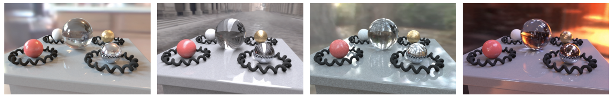

图1 图源[4] 同样的物体在不同环境光下的渲染表现


图2 图源[5]

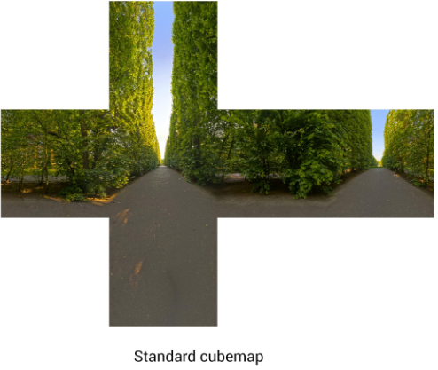

图3 图源[5]  环境立方体贴图 (Cubemap) 


有的时候，我们需要实现**基于图像的光照(Image based lighting, IBL)**，这是一类光照技术的集合，光源并不只是视为从几个方向来的直接光源，而是将周围的环境整体视为一个大的光源。IBL 通常使用（取自现实世界或从3D场景生成的）环境立方体贴图 (Cubemap) ，我们可以将立方体贴图的每个像素视为光源，在渲染方程中直接使用它。这种方式可以有效地捕捉环境的全局光照和氛围，使物体**更好地融入**其环境。

> 关于立方体贴图Cubemap，在前面的教程章节中有进行介绍。

由于基于图像的光照算法会捕捉部分甚至全部的环境光照，通常认为它是一种更精确的环境光照输入格式，甚至也可以说是一种全局光照的粗略近似。基于此特性，IBL 对 PBR 很有意义，因为当我们将环境光纳入计算之后，物体在物理方面看起来会更加准确。

接下来的部分，我们会对IBL的具体细节进行介绍。


# 一、漫反射辐照度

在学习了上一节的PBR之后，我们可以更新一下现在的渲染方程：
$$
L_o\left(p, \omega_o\right)=\int_{\Omega}\left(k_d \frac{c}{\pi}+k_s \frac{D F G}{4\left(\omega_o \cdot n\right)\left(\omega_i \cdot n\right)}\right) L_i\left(p, \omega_i\right) n \cdot \omega_i d \omega_i
$$
这里我们依据PBR的知识，将BRDF项进行了漫反射部分和镜面反射部分的拆解。解决上一节教程中的积分非常简单，因为我们事先已经知道了对积分有贡献的、若干精确的光线方向$\omega_i$，而如果入射光源是来自于四面八方的要怎么办？来自周围环境的**每个**方向$\omega_i$的入射光都可能具有一些辐射度（radiance），使得解决积分变得不那么简单。要解决这个问题，我们就要解决下面两件事：

- （1）给定任何方向向量 $\omega_i$ ，我们需要一些方法来获取这个方向上场景的radiance；
- （2）求解积分的速度要足够快，并且要满足实时性；

需求（1）是相对简单一些的，回忆在Cubemap章节介绍的Cubemap的作用，我们可以把场景的radiance预先存储到一张Cubemap当中，给定这样的Cubemap，我们可以将Cubemap图的每个纹素视为一个光源。使用一个方向向量$\omega_i$对此立方体贴图进行采样，我们就可以获取该方向上的radiance。

这时采样的代码就可以简化为：

```c++
vec3 radiance =  texture(_cubemapEnvironment, w_i).rgb;
```


本来我们在计算光照的时候，来自整个上半球的入射光都会对光照结果产生影响。为了以更有效的方式解决积分（对应上述的需求（2）），我们需要对其大部分结果进行预处理——或称预计算。**如何预计算呢？这就是我们要解决的问题。**

对于渲染方程来说：
$$
L_o\left(p, \omega_o\right)=\int_{\Omega}\left(k_d \frac{c}{\pi}+k_s \frac{D F G}{4\left(\omega_o \cdot n\right)\left(\omega_i \cdot n\right)}\right) L_i\left(p, \omega_i\right) n \cdot \omega_i d \omega_i
$$
复习一下PBR章节提到的，我们可以认为在Cook-Torrance BRDF下，BRDF的漫反射项和镜面反射项是可以拆开的，可以将上述积分分为两部分：
$$
L_o\left(p, \omega_o\right)=\int_{\Omega}\left(k_d \frac{c}{\pi}\right) L_i\left(p, \omega_i\right) n \cdot \omega_i d \omega_i + \int_{\Omega}\left(k_s \frac{D F G}{4\left(\omega_o \cdot n\right)\left(\omega_i \cdot n\right)}\right) L_i\left(p, \omega_i\right) n \cdot \omega_i d \omega_i
$$
通过将积分分成两部分，我们可以分开研究漫反射和镜面反射部分。**在这一部分中，我们会先预计算漫反射项。**


## 1.漫反射项的预计算

观察漫反射项，可以看到albedo项$c$，$\pi$是常数，因此可以把常数项移出积分，变为（注意在本节中先不考虑镜面反射项）：
$$
L_o\left(p, \omega_o\right)=\frac{c}{\pi}\int_{\Omega}k_d L_i\left(p, \omega_i\right) n \cdot \omega_i d \omega_i
$$
注意：严格来说，$k_d$并不是常数项，$k_d$的计算公式应该是：
$$
k_d = (1-F(v · h))(1-metalness)
$$

> 上式的意思是，菲涅尔项$F$是和视线方向$v$以及半程向量$h$方向有关（这也是近似，可以参考：[9]https://en.wikipedia.org/wiki/Schlick%27s_approximation），其中$h$是和视线方向$v$以及入射光方向$\omega_i$的半程向量。

为了方便，我们可以对$k_d$进行近似处理，简化如下：
$$
k_d \approx (1-F_{roughness}(n · \omega_o))(1-metalness) \triangleq k_d^*
$$
其中$F_{roughness}$公式如下：
$$
F_{roughness} = F_0 + (\Lambda - F_0)(1-n · \omega_o)^5 \\
\Lambda = max\{1-roughness, F_0\}
$$
其实就是相比于原来的Schlick近似，用$\Lambda$代替了$1$。由于近似后的$k_d$项（我们写作$k_d^*$项）并不包含$\omega_i$ ，因此此时漫反射项终于可以把$k_d^*$项提取出来了：
$$
L_o\left(p, \omega_o\right) \approx k_d^*\frac{c}{\pi}\int_{\Omega}L_i\left(p, \omega_i\right) n \cdot \omega_i d \omega_i
$$
在实时渲染中，出现这种$\approx$（近似）问题都不大，**速度是非常关键的，要做到实时性**。

在Cubemap章节包括本节中，我们都是假定待着色点$p$位于环境贴图的中心。预计算的部分是：
$$
\int_{\Omega}L_i\left(p, \omega_i\right) n \cdot \omega_i d \omega_i
$$
此时上述积分就是只依赖于法线方向$n$的积分（$n$可以决定上半球积分的朝向）。有了这些知识，我们就可以计算或预计算一个新的立方体贴图，它在每个采样方向——也就是纹素中存储漫反射积分的结果，这些结果是通过卷积计算出来的。先看一张预计算之后的结果（下图来自[5]）：

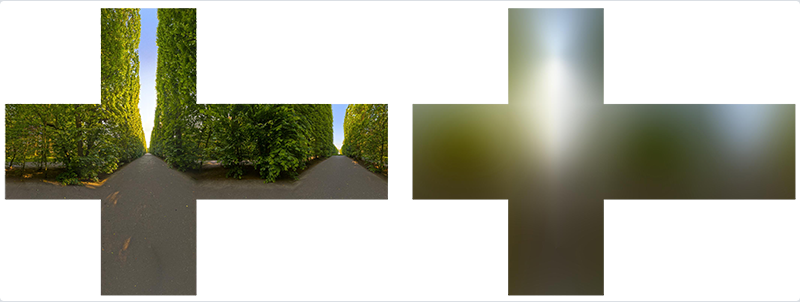

看上去，就像是对Cubemap做了”滤波“操作，使得结果变模糊了。具体的预计算方式在路径追踪章节有讲解过，即为蒙特卡洛积分，对半球进行均匀采样（注意我们把$\frac{1}{\pi}$放入到了蒙特卡洛积分求解当中，这样在实时计算IBL的时候就不需要再做除以$\pi$的操作了）：
$$
\begin{aligned} \frac{1}{\pi} \int_{\Omega} L_i\left(p, \omega_i\right) n \cdot \omega_i \mathrm{~d} \omega_i & =
\frac{1}{\pi} \int_0^{2 \pi} \int_0^{\frac{\pi}{2}} L_i\left(p, \omega_i\right) \cos \theta \sin \theta \mathrm{~d} \theta \mathrm{~d} \phi \\ & \approx \frac{1}{\pi} \frac{1}{N_1 N_2} \sum_i^{N_1} \sum_j^{N_2} \frac{L_i\left(p, \phi_j, \theta_i\right) \cos \left(\theta_i\right) \sin \left(\theta_i\right)}{pdf\left(\theta_i, \phi_j\right)} \\ & =
\frac{1}{\pi} \frac{1}{N_1 N_2} \sum_i^{N_1} \sum_j^{N_2} \frac{L_i\left(p, \phi_j, \theta_i\right) \cos \left(\theta_i\right) \sin \left(\theta_i\right)}{\frac{1}{2 \pi * 0.5 \pi}} \\ & =
\pi \frac{1}{N_1 N_2} \sum_i^{N_1} \sum_j^{N_2} L_i\left(p, \phi_j, \theta_i\right) \cos \left(\theta_i\right) \sin \left(\theta_i\right)\end{aligned}
$$
其实还可以进行重要性采样，使用以余弦为权重的半球采样：
$$
\begin{aligned} \frac{1}{\pi} \int_{\Omega} L_i\left(p, \omega_i\right) n \cdot \omega_i \mathrm{~d} \omega_i & = \frac{1}{\pi}\frac{1}{N} \sum_{i}^N \frac{L(\omega_i)(n ·\omega_i)}{\frac{n ·\omega_i}{\pi}}\end{aligned} = \frac{1}{N} \sum_{i}^N L(\omega_i)
$$
可以使用CPU或者GPU通过采样生成这样一张irradiance map。在使用 irradiance map 时根据法向$ n $采样，并且乘上$k_d^*$和$c$就可以得到漫反射项。

> 为什么在使用irradiance map的时候要用法向$n$进行采样呢？回忆我们在预计算的时候本来就是对法线$n$所在的半球进行预计算，因此采样的时候也是根据法线方向$n$进行采样即可得到来自上半球所有方向入射光的预计算结果。


### （1）重要代码

以下的片元着色器是生成irrandiance map的关键片元着色器（假定我们在蒙特卡洛过程中已经可以根据`texture(environmentMap, sampleVec)`这句对Cubemap对应方向采样了）：

```glsl
#version 330 core
out vec4 FragColor;
in vec3 WorldPos;

uniform samplerCube environmentMap;

const float PI = 3.14159265359;

void main()
{		
    vec3 N = normalize(WorldPos);

    vec3 irradiance = vec3(0.0);   
    
    // tangent space calculation from origin point
    vec3 up    = vec3(0.0, 1.0, 0.0);
    vec3 right = normalize(cross(up, N));
    up         = normalize(cross(N, right));
       
    float sampleDelta = 0.025;
    float nrSamples = 0.0f;
    for(float phi = 0.0; phi < 2.0 * PI; phi += sampleDelta)
    {
        for(float theta = 0.0; theta < 0.5 * PI; theta += sampleDelta)
        {
            // spherical to cartesian (in tangent space)
            vec3 tangentSample = vec3(sin(theta) * cos(phi),  sin(theta) * sin(phi), cos(theta));
            // tangent space to world
            vec3 sampleVec = tangentSample.x * right + tangentSample.y * up + tangentSample.z * N; 

            irradiance += texture(environmentMap, sampleVec).rgb * cos(theta) * sin(theta);
            nrSamples++;
        }
    }
    irradiance = PI * irradiance * (1.0 / float(nrSamples));
    
    FragColor = vec4(irradiance, 1.0);
}
```

至此，预计算的irrandiance map就算是构建完成了。在下一节中，我们会介绍如何处理specular项。


# 二、specular项的预计算

对于镜面项，预计算是比较麻烦的。先再来看一下要预计算的内容是什么：
$$
L_s(\omega_o) = \int_\Omega f_s(\omega_i, \omega_o) L_i(\omega) n ·\omega_i d\omega_i
$$
如果要直接暴力预计算这一项的话，我们有下面的参数需要处理：

- 法线方向$n$，视角方向$w_o$；
- BRDF当中的粗糙度$\alpha$以及$F_0$（由albedo和金属度来决定）；

如果把方向向量用球面坐标来表示的话，一共有非常多的维度要解决，没办法像漫反射一样直接用一个Cubemap来解决问题。如果使用蒙特卡洛积分的方式来做的话速度又难以接受，这里虚幻给出了一种名为Split Sum的近似解决方法：

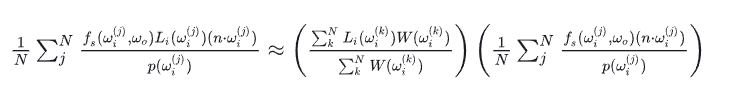

其中权重函数$W(\omega_i) = n · \omega_i$。

> Split sum方法的原论文：[3]https://cdn2.unrealengine.com/Resources/files/2013SiggraphPresentationsNotes-26915738.pdf

具体的推导比较复杂，可以参考这篇文章：[2]https://zhuanlan.zhihu.com/p/66518450。这里直接把推导过程粘贴过来：

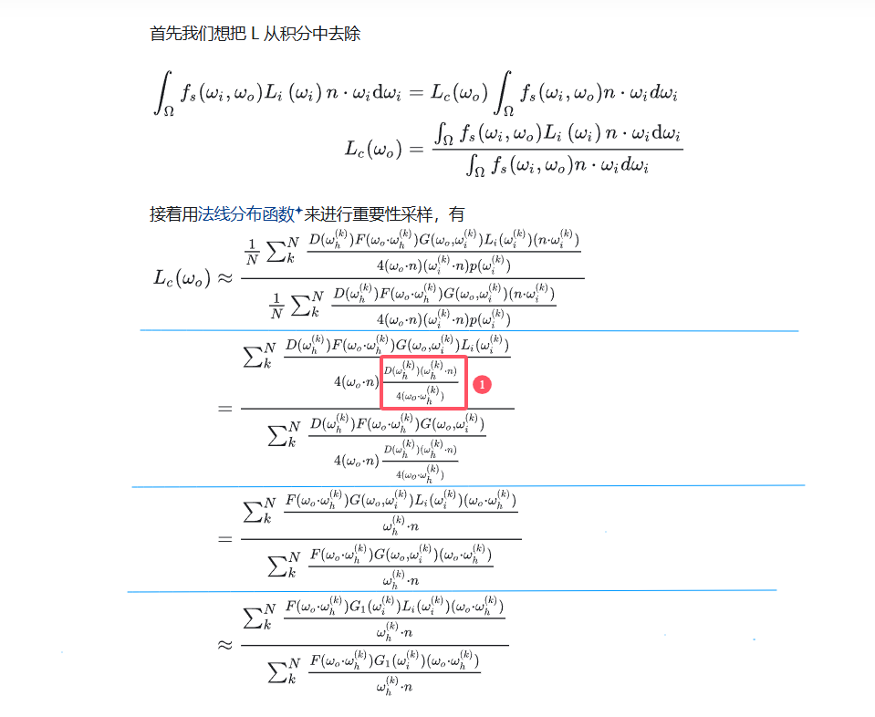

> 补充资料：基于法线分布函数NDF的重要性采样公式（对应上图红框框起来的①部分）的推导：[10]https://zhuanlan.zhihu.com/p/78146875。这一部分的基础原理在蒙特卡洛路径追踪部分的重要性采样原理中已经进行介绍，由于篇幅原因就不写NDF的GGX分布重要性采样公式推导了，这篇链接里可以查看推导过程。也可以看这篇：[11]https://www.mathematik.uni-marburg.de/~thormae/lectures/graphics1/code/ImportanceSampling/importance_sampling_notes.pdf]

继续回到Split Sum方法的推导当中，我们来看上面最后推导的式子，Unity认为$F$项的影响不大，因此约掉了$F$项。可以这么理解：

- （1）对于比较光滑的情况，主要是镜面反射，此时$\omega_h$接近于法线方向$n$，此时的Fresnel项基本是定值（相当于里面有一个$cos\theta$接近于1），可以上下约掉；
- （2）对于非光滑的情况，$L$本来也是粗略估计，这种近似本身影响也不大；

去掉$F$项后，上面的估计结果为：

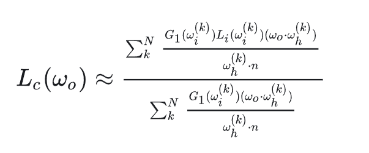

对于镜面材质的物质来说，其BRDF的形状类似如下：

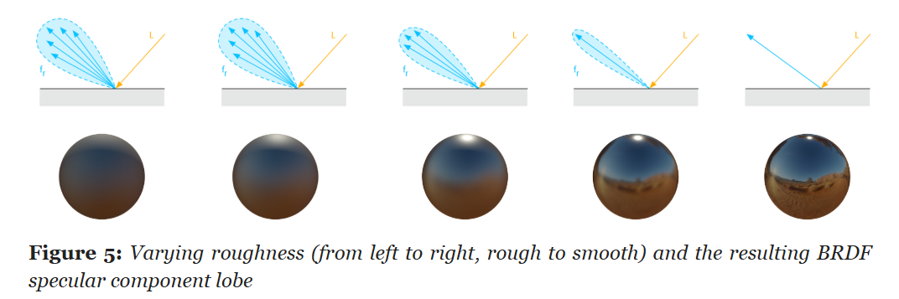

​							（示意图来自[6]Google的开源渲染器Filament的官方文档：[6]https://google.github.io/filament/Filament.html）

其BRDF：$f(\omega_o,\omega_i)$大致会在$R=reflect(-\omega_o,n)$附近有值，可以姑且假设从不同方向入射，这个probe的形状变化不大，有$f(\omega_o,\omega_i(n),n) \approx f(\omega_o,\omega_i(R),R)$。

示意图为：

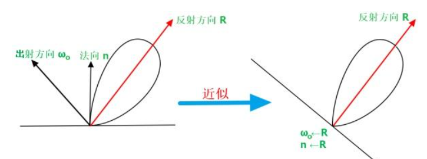

> 注：该图来自：[2]https://zhuanlan.zhihu.com/p/66518450

此时就有：
$$
L_c(\omega_o)=\frac{\int_{\Omega(\mathbf{n})}f_s(\omega_i,\omega_o)L_i(\omega_i)n\cdot\omega_i\mathrm{d}\omega_i}{\int_{\Omega(\mathbf{n})}f_s(\omega_i,\omega_o)n\cdot\omega_i\mathrm{d}\omega_i}\approx\frac{\int_{\Omega(\mathbf{R})}f_s(\omega_i,\mathbf{R})L_i(\omega_i)\mathbf{R}\cdot\omega_i\mathrm{d}\omega_i}{\int_{\Omega(\mathbf{R})}f_s(\omega_i,\mathbf{R})\mathbf{R}\cdot\omega_i\mathrm{d}\omega_i}\triangleq L_c^*(\mathbf{R})
$$
也就是说，为了加快计算的速度，可以暴力地认为**$R=n=\omega_o$**。之所以可以做这样的假设可以从上图看出来，BRDF的probe形状是类似的。对于之前的化简结果应用上面的近似处理，可以约掉点乘的部分：
$$
\begin{equation}\label{eq1}
L_c^*(\mathbf{R})\approx\frac{\sum_k^NL(\omega_i^{(k)})G_1(\omega_i^{(k)})}{\sum_k^NG_1(\omega_i^{(k)})} 
\end{equation} \tag{1}
$$
回顾虚幻提出的Split Sum方法的表达式左半部分，可以发现虚幻用的权重函数$W(\omega_i)=n · \omega_i$就跟上式的$G_1$项是等价的。虚幻之所以会认为这样更好可能是因为刚好两者的变化趋势和值域等性质是类似的。此时，针对Specular项，我们可以拿出其$L$项：
$$
\int_\Omega f_s(\omega_i,\omega_o)L_i\:(\omega_i)\:n\cdot\omega_i\mathrm{d}\omega_i=L_c^*(\mathbf{R})\int_\Omega f_s(\omega_i,\omega_o)n\cdot\omega_id\omega_i
$$
经过了比较复杂的推导，在Split sum方法中终于算是把$L$项提出来了，而这一项就是接下来要提到的pre-filter environment map。


## 1.pre-filter environment map

回忆一下我们计算的L项：
$$
L_c^*(\mathbf{R})\approx\frac{\sum_k^NL_i(\omega_i^{(k)})(n\cdot\omega_i^{(k)})}{\sum_k^N(n\cdot\omega_i^{(k)})}
 \tag{2}
$$
相对于公式（1），公式（2）使用的是虚幻的近似，使用权重函数$W(\omega_i)=n · \omega_i$暂代$G_1$项。不过我们依旧需要考虑$G$项中的粗糙度$\alpha$，因此可以认为$L_c^*(R)$依旧受到变量粗糙度$\alpha$的影响。

在之前的推导中，我们完全忽略了$n$和$\omega_o$的方向，只考虑了反射光方向$R$。其实这样做会引入误差，在寒霜引擎的著名论文中有对应的介绍：

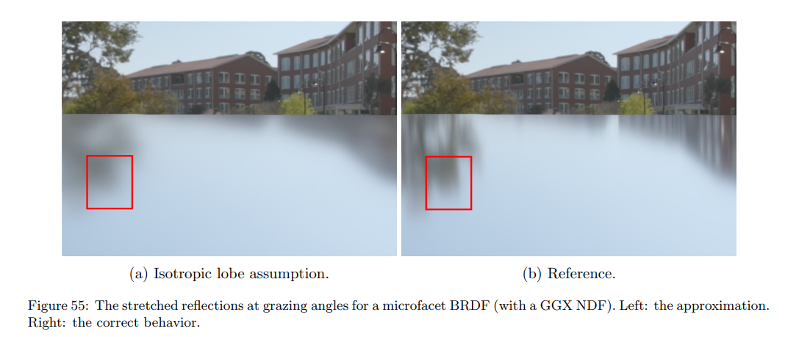

最明显的现象就是在掠射角看表面时没法得到拖长的反射，效果是不够准确的，但在实时渲染中可以接受。

> 参考文章：[7]https://seblagarde.wordpress.com/wp-content/uploads/2015/07/course_notes_moving_frostbite_to_pbr_v32.pdf

针对我们要预计算的$L_c^*(R)$项，其有两个未知量，分别为$R$和粗糙度$\alpha$。对于一个特定的粗糙度，变量就只剩$R$ ，因此我们可以像 irrandiance map 那样，预计算得到一个 cubemap。取粗糙度的序列为0，0.25，0.5，0.75，1.0，从而得到5个Cubemap，这样在实时渲染的时候就可以依据粗糙度$\alpha$和这五张预渲染的cubemap做三线性插值。

有时，这个预计算结果需要进行更新。因此如何快速对其更新也是一个问题。这个预计算关键的就是计算积分。为了加速收敛，我们可以用重要性采样，但还是需要不少的样本。Krivanek的 Pre-filtered importance sampling 可以减少样本数量，收敛提升明显，只引入了一小些偏差。

> 参考链接：[12]https://dcgi.felk.cvut.cz/publications/2008/krivanek-cgf-rts
>
> 示意图：
>
> 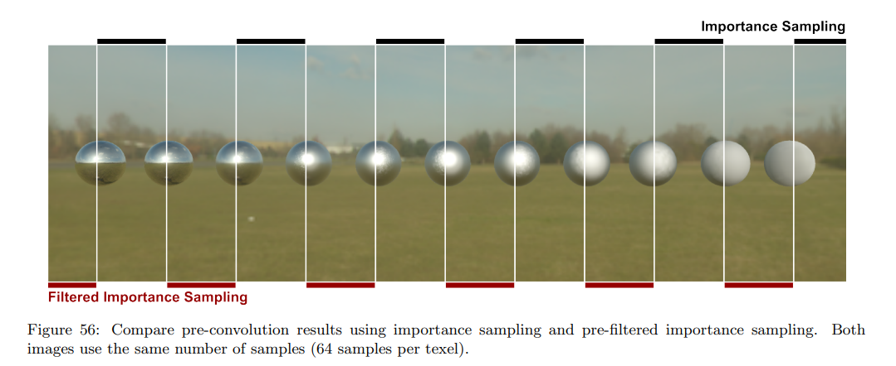

这样我们得到的 5 个 cubemap，就是 pre-filtered environment map，下图来自于LearnOpenGL:

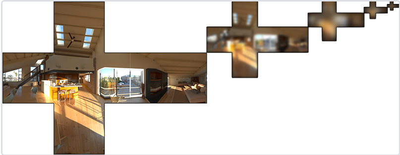


### （1）重要代码

这一部分的重要的片元着色器代码如下：（接下来会继续讲解代码中的部分内容，暂时看不懂代码的读者可以先继续看接下来的内容）

```glsl
#version 330 core
out vec4 FragColor;
in vec3 WorldPos;

uniform samplerCube environmentMap;  //这里就是正常的场景Cubemap
uniform float roughness;

const float PI = 3.14159265359;
// ----------------------------------------------------------------------------
float DistributionGGX(vec3 N, vec3 H, float roughness)
{
    float a = roughness*roughness;
    float a2 = a*a;
    float NdotH = max(dot(N, H), 0.0);
    float NdotH2 = NdotH*NdotH;

    float nom   = a2;
    float denom = (NdotH2 * (a2 - 1.0) + 1.0);
    denom = PI * denom * denom;

    return nom / denom;
}
// ----------------------------------------------------------------------------
// http://holger.dammertz.org/stuff/notes_HammersleyOnHemisphere.html
// efficient VanDerCorpus calculation.
float RadicalInverse_VdC(uint bits) 
{
     bits = (bits << 16u) | (bits >> 16u);
     bits = ((bits & 0x55555555u) << 1u) | ((bits & 0xAAAAAAAAu) >> 1u);
     bits = ((bits & 0x33333333u) << 2u) | ((bits & 0xCCCCCCCCu) >> 2u);
     bits = ((bits & 0x0F0F0F0Fu) << 4u) | ((bits & 0xF0F0F0F0u) >> 4u);
     bits = ((bits & 0x00FF00FFu) << 8u) | ((bits & 0xFF00FF00u) >> 8u);
     return float(bits) * 2.3283064365386963e-10; // / 0x100000000
}
// ----------------------------------------------------------------------------
vec2 Hammersley(uint i, uint N)
{
	return vec2(float(i)/float(N), RadicalInverse_VdC(i));
}
// ----------------------------------------------------------------------------
vec3 ImportanceSampleGGX(vec2 Xi, vec3 N, float roughness)
{
    //基于特定的粗糙度输入和低差异序列值 Xi，我们获得了一个采样向量，该向量大体围绕着预估的微表面的半向量。注意，根据迪士尼对 PBR 的研究，Epic Games 使用了平方粗糙度以获得更好的视觉效果。

	float a = roughness*roughness;
	
	float phi = 2.0 * PI * Xi.x;
	float cosTheta = sqrt((1.0 - Xi.y) / (1.0 + (a*a - 1.0) * Xi.y));
	float sinTheta = sqrt(1.0 - cosTheta*cosTheta);
	
	// from spherical coordinates to cartesian coordinates - halfway vector
	vec3 H;
	H.x = cos(phi) * sinTheta;
	H.y = sin(phi) * sinTheta;
	H.z = cosTheta;
	
	// from tangent-space H vector to world-space sample vector
	vec3 up          = abs(N.z) < 0.999 ? vec3(0.0, 0.0, 1.0) : vec3(1.0, 0.0, 0.0);
	vec3 tangent   = normalize(cross(up, N));
	vec3 bitangent = cross(N, tangent);
	
	vec3 sampleVec = tangent * H.x + bitangent * H.y + N * H.z;
	return normalize(sampleVec);
}
void main()
{		
    vec3 N = normalize(WorldPos);
    
    // make the simplifying assumption that V equals R equals the normal 
    vec3 R = N;
    vec3 V = R;

    const uint SAMPLE_COUNT = 4096u;  
    vec3 prefilteredColor = vec3(0.0);
    float totalWeight = 0.0;
    
    for(uint i = 0u; i < SAMPLE_COUNT; ++i)
    {
        // generates a sample vector that's biased towards the preferred alignment direction (importance sampling).
        vec2 Xi = Hammersley(i, SAMPLE_COUNT);
        vec3 H = ImportanceSampleGGX(Xi, N, roughness);
        vec3 L  = normalize(2.0 * dot(V, H) * H - V);

        float NdotL = max(dot(N, L), 0.0);
        if(NdotL > 0.0) //这里使用的是https://seblagarde.wordpress.com/wp-content/uploads/2015/07/course_notes_moving_frostbite_to_pbr_v32.pdf这篇里的做法
        {
            // sample from the environment's mip level based on roughness/pdf
            float D   = DistributionGGX(N, H, roughness);
            float NdotH = max(dot(N, H), 0.0);
            float HdotV = max(dot(H, V), 0.0);
            float pdf = D * NdotH / (4.0 * HdotV) + 0.0001; 

            float resolution = 512.0; // resolution of source cubemap (per face)
            float saTexel  = 4.0 * PI / (6.0 * resolution * resolution);
            float saSample = 1.0 / (float(SAMPLE_COUNT) * pdf + 0.0001);

            float mipLevel = roughness == 0.0 ? 0.0 : 0.5 * log2(saSample / saTexel); 
            
            prefilteredColor += textureLod(environmentMap, L, mipLevel).rgb * NdotL;
            totalWeight      += NdotL;
        }
    }

    prefilteredColor = prefilteredColor / totalWeight;

    FragColor = vec4(prefilteredColor, 1.0);
}

```

在实时渲染的时候，需要用$R$方向来进行采样。我们要用直接看上述代码的话，估计会有不少非常迷惑的内容，接下来则对比较重要的地方进行说明。


## 2.一些额外扩展内容介绍

这部分主要介绍一下上面的Pre-filter environment map过程中的一些细节。

### （1）Hammersley序列

在上面的代码中，有这样的一个函数：`Hammersley`。这里就牵扯到一个叫做**低差异序列**的内容。无论是离线渲染还是实时渲染，一个合理的采样序列都是有必要的。在做IBL的过程中，我们需要随机采样若干个随机的0~1之间的$\xi_1,\xi_2$作为半球采样的指导量，因此这个”随机选取0到1之间值“的质量就比较关键了。下面是一组采样点的结果：

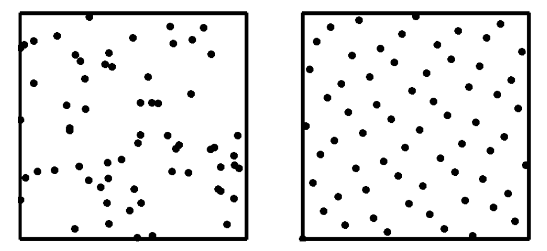

直观来看，明显右侧的采样结果”更好“，看起来分布更均匀，取值很相近的点更少。如何用数学来衡量这件事呢？为了更好地衡量一个采样序列的质量，数学家创造了**Discrepancy/差异值** 的概念， 来确定一系列n维采样点的质量。我们的目标就是寻找合适的算法,，产生**低差异采样序列/Low Discrepancy Sequence**。

> 更具体地关于差异的定义和低差异序列可以参考这篇文章：[13]https://zhuanlan.zhihu.com/p/343666731

回到IBL的话题，在工业界，Hammersley低差异序列是比较常用的一个采样序列，其作用就在于生成更好的采样结果，函数实现就是上面代码中的那个函数，更多的内容在本节里就不再展开了。


## 3.Specular BRDF项的处理——BRDF LUT

在上一节中，我们把镜面反射项待计算的积分变成了如下的形式：

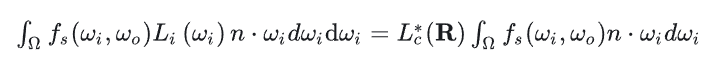

这里面的$L_c^*(R)$就是pre-filter environment map步骤中计算出来的内容，于是剩下要计算的部分就是：
$$
\int_\Omega f_s(\omega_i, \omega_o)n · \omega_i d\omega_i
$$
可以想到，这个积分项包含$\omega_o$，$n$，$F_0$（由金属度和albedo来决定）和粗糙度$\alpha$这么多未知项。由于在Cook-Torrance的PBR模型中，我们使用的GGX是各向同性的，因此我们只需要知道$\omega_o$和$n$的夹角$\theta$即可。此时可以简化为三个变量：$\theta$，$F_0$（金属度和albedo决定），以及粗糙度$\alpha$。

接下来，考虑近似处理，把$F_0$移出积分项：

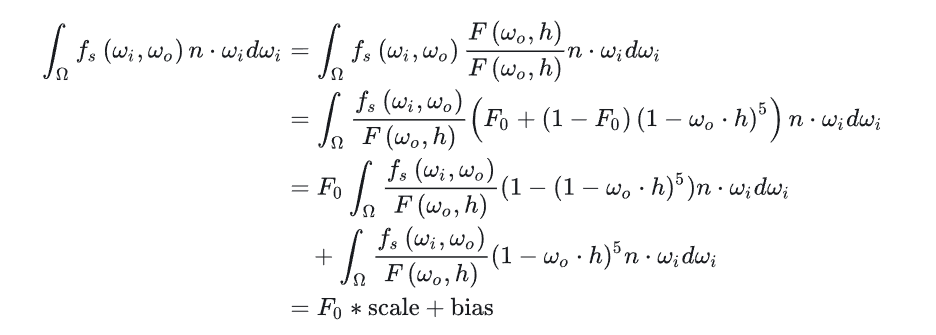

我们将积分拆成了两部分 scale 和 bias，这两项中都消去了$F$项（回忆一下：$f_s$中有一个$F$项会被消去）。此时变量只剩下$\theta$和$\alpha$。不能再约分了，那我们就用这两项来求解。为了方便，使用$\cos\theta$来计算，这样两个变量的范围就都是[0，1]了。

scale 和 bias 可以用根据法线分布函数进行重要性采样的蒙特卡洛积分来解决。NDF的GGX重要性采样在前面有进行介绍。推导如下（这里以scale项为例）：
$$
\begin{aligned} \text { scale } & \approx \frac{1}{N} \sum_k^N \frac{\frac{D\left(\omega_h^{(k)}\right) G\left(\omega_o, \omega_i^{(k)}\right)}{4\left(\omega_o \cdot n\right)\left(\omega_i^{(k)} \cdot n\right)}\left(1-\left(1-\omega_o \cdot \omega_h^{(k)}\right)^5\right)\left(\omega_i^{(k)} \cdot n\right)}{p\left(\omega_i^{(k)}\right)} \\ & =\frac{1}{N} \sum_k^N \frac{\frac{D\left(\omega_h^{(k)}\right) G\left(\omega_o, \omega_i^{(k)}\right)}{4\left(\omega_o \cdot n\right)\left(\omega_i^{(k)} \cdot n\right)}\left(1-\left(1-\omega_o \cdot \omega_h^{(k)}\right)^5\right)\left(\omega_i^{(k)} \cdot n\right)}{\frac{D\left(\omega_h^{(k)}\right)\left(\omega_h^{(k)} \cdot n\right)}{4\left(\omega_o \cdot \omega_h^{(k)}\right)}} \\ & =\frac{1}{N} \sum_k^N \frac{G\left(\omega_o, \omega_i^{(k)}\right)\left(\omega_o \cdot \omega_h^{(k)}\right)\left(1-\left(1-\omega_o \cdot \omega_h^{(k)}\right)^5\right)}{\left(\omega_o \cdot n\right)\left(\omega_h^{(k)} \cdot n\right)}\end{aligned}
$$


bias 也是类似。回顾纹理的章节，其实我们可以把这两个值预计算好，以R通道的值和B通道的值存储在一张纹理当中。这里scale 放在红色通道， bias 放在绿色通道。这个纹理称为 BRDF LUT，有确定的BRDF我们就可以生成出来这一张BRDF LUT。实际上，在确定好BRDF的计算式之后，这张预计算结果可以直接以图片方式保存下来，当然也可以通过CPU或者GPU进行预计算，这张图如下：

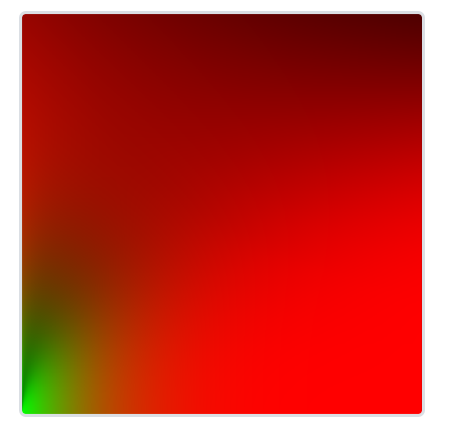

在实时渲染的时候，就是用$F_0*scale+bias$即可。


### （1）重要代码

下面这段glsl的代码展示了如何生成上面的BRDF LUT：

```glsl
#version 330 core
out vec2 FragColor;
in vec2 TexCoords;

const float PI = 3.14159265359;
// ----------------------------------------------------------------------------
// http://holger.dammertz.org/stuff/notes_HammersleyOnHemisphere.html
// efficient VanDerCorpus calculation.
float RadicalInverse_VdC(uint bits) 
{
     bits = (bits << 16u) | (bits >> 16u);
     bits = ((bits & 0x55555555u) << 1u) | ((bits & 0xAAAAAAAAu) >> 1u);
     bits = ((bits & 0x33333333u) << 2u) | ((bits & 0xCCCCCCCCu) >> 2u);
     bits = ((bits & 0x0F0F0F0Fu) << 4u) | ((bits & 0xF0F0F0F0u) >> 4u);
     bits = ((bits & 0x00FF00FFu) << 8u) | ((bits & 0xFF00FF00u) >> 8u);
     return float(bits) * 2.3283064365386963e-10; // / 0x100000000
}
// ----------------------------------------------------------------------------
vec2 Hammersley(uint i, uint N)
{
	return vec2(float(i)/float(N), RadicalInverse_VdC(i));
}
// ----------------------------------------------------------------------------
vec3 ImportanceSampleGGX(vec2 Xi, vec3 N, float roughness)
{
	float a = roughness*roughness;
	
	float phi = 2.0 * PI * Xi.x;
	float cosTheta = sqrt((1.0 - Xi.y) / (1.0 + (a*a - 1.0) * Xi.y));
	float sinTheta = sqrt(1.0 - cosTheta*cosTheta);
	
	// from spherical coordinates to cartesian coordinates - halfway vector
	vec3 H;
	H.x = cos(phi) * sinTheta;
	H.y = sin(phi) * sinTheta;
	H.z = cosTheta;
	
	// from tangent-space H vector to world-space sample vector
	vec3 up          = abs(N.z) < 0.999 ? vec3(0.0, 0.0, 1.0) : vec3(1.0, 0.0, 0.0);
	vec3 tangent   = normalize(cross(up, N));
	vec3 bitangent = cross(N, tangent);
	
	vec3 sampleVec = tangent * H.x + bitangent * H.y + N * H.z;
	return normalize(sampleVec);
}
// ----------------------------------------------------------------------------
float GeometrySchlickGGX(float NdotV, float roughness)
{
    // note that we use a different k for IBL
    float a = roughness;
    float k = (a * a) / 2.0;

    float nom   = NdotV;
    float denom = NdotV * (1.0 - k) + k;

    return nom / denom;
}
// ----------------------------------------------------------------------------
float GeometrySmith(vec3 N, vec3 V, vec3 L, float roughness)
{
    float NdotV = max(dot(N, V), 0.0);
    float NdotL = max(dot(N, L), 0.0);
    float ggx2 = GeometrySchlickGGX(NdotV, roughness);
    float ggx1 = GeometrySchlickGGX(NdotL, roughness);

    return ggx1 * ggx2;
}
// ----------------------------------------------------------------------------
vec2 IntegrateBRDF(float NdotV, float roughness)
{
    vec3 V;
    V.x = sqrt(1.0 - NdotV*NdotV);  //sin
    V.y = 0.0;
    V.z = NdotV;   	//cos

    float A = 0.0;
    float B = 0.0; 

    vec3 N = vec3(0.0, 0.0, 1.0);
    
    const uint SAMPLE_COUNT = 1024u;
    for(uint i = 0u; i < SAMPLE_COUNT; ++i)
    {
        // generates a sample vector that's biased towards the
        // preferred alignment direction (importance sampling).
        vec2 Xi = Hammersley(i, SAMPLE_COUNT);
        vec3 H = ImportanceSampleGGX(Xi, N, roughness);
        vec3 L = normalize(2.0 * dot(V, H) * H - V);

        float NdotL = max(L.z, 0.0);
        float NdotH = max(H.z, 0.0);
        float VdotH = max(dot(V, H), 0.0);

        if(NdotL > 0.0)
        {
            float G = GeometrySmith(N, V, L, roughness);
            float G_Vis = (G * VdotH) / (NdotH * NdotV);
            float Fc = pow(1.0 - VdotH, 5.0);

            A += (1.0 - Fc) * G_Vis;
            B += Fc * G_Vis;
        }
    }
    A /= float(SAMPLE_COUNT);
    B /= float(SAMPLE_COUNT);
    return vec2(A, B);
}
// ----------------------------------------------------------------------------
void main() 
{
    vec2 integratedBRDF = IntegrateBRDF(TexCoords.x, TexCoords.y);
    FragColor = integratedBRDF;
}
```

针对上述的glsl代码，有如下几点说明：

- （1）在生成这张LUT图的时候，我们的每个纹理坐标的(X,Y)分别表示($n · \omega_o, \alpha$)。

读者可以校对一下，会发现推导过程和代码是完全对应的上的。


综上，实现IBL的过程中我们需要预计算的推导公式和图如下：
$$
\LARGE{}
L_o\left(p, \omega_o\right)=\int_{\Omega}\left(k_d \frac{c}{\pi}+k_s \frac{D F G}{4\left(\omega_o \cdot n\right)\left(\omega_i \cdot n\right)}\right) L_i\left(p, \omega_i\right) n \cdot \omega_i d \omega_i

\\\LARGE{}
=\int_{\Omega}\left(k_d \frac{c}{\pi}\right) L_i\left(p, \omega_i\right) n \cdot \omega_i d \omega_i + \int_{\Omega}\left(k_s \frac{D F G}{4\left(\omega_o \cdot n\right)\left(\omega_i \cdot n\right)}\right) L_i\left(p, \omega_i\right) n \cdot \omega_i d \omega_i

\\\LARGE{}
\approx k_d^*\frac{c}{\pi}\int_{\Omega}L_i\left(p, \omega_i\right) n \cdot \omega_i d \omega_i + \int_\Omega f_s(\omega_i, \omega_o) L_i(\omega) n ·\omega_i d\omega_i
$$
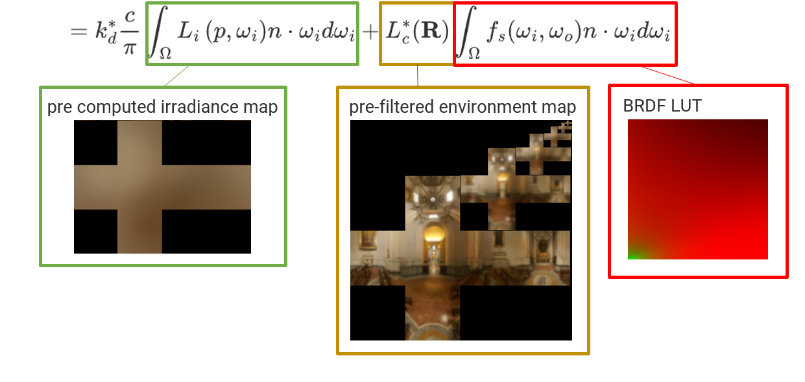

部分图源：[8]

# 三、总体流程说明

以下介绍在实现IBL的过程中需要注意的事项以及总体的算法流程。首先介绍的是Shader的部分，在实现IBL的时候，如果包含预计算，大概有6个shader需要实现：

- （1）PBR shader：渲染PBR+IBL的效果所需要的，也就是使用预计算的结果进行实时渲染的关键shader；
- （2）irradianceShader：用作IBL的漫反射项的预计算shader；
- （3）prefilterShader：回顾IBL Specular项的Split Sum方法，这个shader对应第一项，也就是上面的pre-filter environment map的预计算过程；
- （4）BRDF shader：依旧是Split Sum方法，这个shader用于计算BRDF LUT；
- （5）equirectangularToCubemapShader：这个算是一个工具shader，由于我们导入的环境贴图是hdr的格式，我们使用的贴图使用**等距柱状投影**方式，需要依据前面的Cubemap章节的基础知识，将其转换为Cubemap，因此需要这样一个Shader；
- （6）background shader：将天空盒Cubemap作为背景呈现在渲染结果上；

以下分别介绍上面的shader，并介绍总体流程。


## 1.EquirectangularToCubemap

先来看一下我们使用的hdr贴图是什么样的：

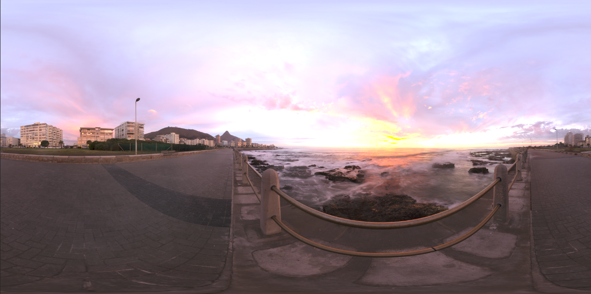

在 PBR 渲染管线中考虑高动态范围(High Dynamic Range, HDR)的场景光照非常重要。由于 PBR 的大部分输入基于实际物理属性和测量，因此为入射光值找到其物理等效值是很重要的。如果不在HDR渲染环境下工作，就无法正确指定每个光的相对强度。

因此，PBR 和 HDR 需要密切合作。回忆一下前面的Cubemap章节，我们的Cubemap的每个面的像素颜色并不是在线性空间下，这属于低动态范围(Low Dynamic Range, LDR)。在渲染的时候由于做了gamma校正，因此会比较适合于视觉的输出，但在PBR渲染管线下，我们需要**线性值**。


### （1）hdr格式

​	谈及辐射度的文件格式，辐射度文件的格式（扩展名为 .hdr）存储了一张完整的立方体贴图，所有六个面数据都是浮点数，允许指定 0.0 到 1.0 范围之外的颜色值，以使光线具有正确的颜色强度。这个文件格式使用了一个技巧来存储每个浮点值：它并非直接存储每个通道的 32 位数据，而是每个通道存储 8 位，再以 alpha 通道存放指数——虽然确实会导致精度损失，但是非常有效率，但也需要解析程序将每种颜色重新转换为它们的浮点数等效值。

​	这时我们可能会有所疑惑，上面这张示意图明明不是立方体贴图？很多时候，我们会从球体投影到平面上，这样就可以将环境信息存储到一张等距柱状投影图(Equirectangular Map) 中。在Cubemap章节也有提到，这样投影会导致水平方向的分辨率比较高，但顶部和底部的分辨率则比较低。一般情况下，这是可以接受的，因为对于几乎所有渲染器来说，大部分有意义的光照和环境信息都在水平视角附近方向。

​	加载hdr图像是一个比较麻烦的过程，可以考虑用类似于`stb_image.h`这样的头文件库函数帮助加载。`stb_image.h `自动将 HDR 值映射到一个浮点数列表：默认情况下，每个通道32位，每个颜色 3 个通道。


### （2）转移到Cubemap

要将等距柱状投影图转换为Cubemap，我们需要渲染一个（单位）立方体，并从内部将等距柱状图投影到立方体的每个面，并将立方体的六个面的图像构造成Cubemap。对于这个立方体而言，顶点着色器只是做最基本的空间变换，并将其模型坐标作为 3D 采样向量传递给片段着色器。

顶点着色器如下：

```glsl
#version 330 core
layout (location = 0) in vec3 aPos;

out vec3 WorldPos;

uniform mat4 projection;
uniform mat4 view;

void main()
{
    WorldPos = aPos;  
    gl_Position =  projection * view * vec4(WorldPos, 1.0);
}
```

而在片元着色器当中，我们就需要渲染得到立方体Cube的每个面的颜色，方法类似于将等距柱状投影图整齐地折叠到立方体的每个面。这里暂时并不需要我们关注过多细节，涉及到一些数学知识：

```glsl
#version 330 core
out vec4 FragColor;
in vec3 WorldPos;

uniform sampler2D equirectangularMap;

const vec2 invAtan = vec2(0.1591, 0.3183);
vec2 SampleSphericalMap(vec3 v)
{
    vec2 uv = vec2(atan(v.z, v.x), asin(v.y));
    uv *= invAtan;
    uv += 0.5;
    return uv;
}

void main()
{		
    vec2 uv = SampleSphericalMap(normalize(WorldPos));
    vec3 color = texture(equirectangularMap, uv).rgb;
    
    FragColor = vec4(color, 1.0);
}
```

假定我们用上述Shader渲染一个场景中心的立方体，会得到下面的结果（图片来自Learn OpenGL）：

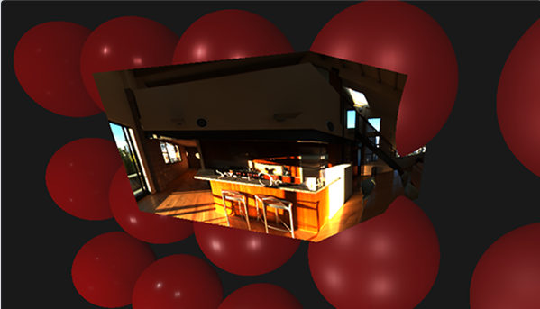

这就说明了我们确实成功投影到了立方体上。但我们还需要将源HDR图像转换为立方体贴图纹理。为了实现这一点，我们必须对同一个立方体渲染六次，每次面对立方体的一个面，并用Framebuffer对象记录其结果：我们采用Framebuffer的颜色值并围绕立方体贴图的每个面切换纹理目标，直接将场景渲染到立方体贴图的一个面上。整个过程只需要做一次，不需要在渲染的loop来完成，此时我们就可以把原来hdr贴图所代表的环境存储到Cubemap的六个面当中，方便后面直接使用。

这一部分的核心代码如下（以OpenGL为例）：

```c++
//step 1：生成对应的FBO和RBO
unsigned int captureFBO, captureRBO;
glGenFramebuffers(1, &captureFBO);
glGenRenderbuffers(1, &captureRBO);

glBindFramebuffer(GL_FRAMEBUFFER, captureFBO);
glBindRenderbuffer(GL_RENDERBUFFER, captureRBO);
glRenderbufferStorage(GL_RENDERBUFFER, GL_DEPTH_COMPONENT24, 512, 512);
glFramebufferRenderbuffer(GL_FRAMEBUFFER, GL_DEPTH_ATTACHMENT, GL_RENDERBUFFER, captureRBO);  

//step 2：为Cubemap的六个面预先分配内存
unsigned int envCubemap; 
glGenTextures(1, &envCubemap);
glBindTexture(GL_TEXTURE_CUBE_MAP, envCubemap);
for (unsigned int i = 0; i < 6; ++i)
{
    // note that we store each face with 16 bit floating point values
    glTexImage2D(GL_TEXTURE_CUBE_MAP_POSITIVE_X + i, 0, GL_RGB16F, 
                 512, 512, 0, GL_RGB, GL_FLOAT, nullptr);
}
glTexParameteri(GL_TEXTURE_CUBE_MAP, GL_TEXTURE_WRAP_S, GL_CLAMP_TO_EDGE);
glTexParameteri(GL_TEXTURE_CUBE_MAP, GL_TEXTURE_WRAP_T, GL_CLAMP_TO_EDGE);
glTexParameteri(GL_TEXTURE_CUBE_MAP, GL_TEXTURE_WRAP_R, GL_CLAMP_TO_EDGE);
glTexParameteri(GL_TEXTURE_CUBE_MAP, GL_TEXTURE_MIN_FILTER, GL_LINEAR);
glTexParameteri(GL_TEXTURE_CUBE_MAP, GL_TEXTURE_MAG_FILTER, GL_LINEAR);

//step 3：
//将等距柱状 2D 纹理捕捉到立方体贴图的面上
//面向立方体六个面设置六个不同的视图矩阵，给定投影矩阵的 fov 为 90 度以捕捉整个面，并渲染立方体六次，将结果存储在浮点帧缓冲中
glm::mat4 captureProjection = glm::perspective(glm::radians(90.0f), 1.0f, 0.1f, 10.0f);
glm::mat4 captureViews[] = 
{
   glm::lookAt(glm::vec3(0.0f, 0.0f, 0.0f), glm::vec3( 1.0f,  0.0f,  0.0f), glm::vec3(0.0f, -1.0f,  0.0f)),
   glm::lookAt(glm::vec3(0.0f, 0.0f, 0.0f), glm::vec3(-1.0f,  0.0f,  0.0f), glm::vec3(0.0f, -1.0f,  0.0f)),
   glm::lookAt(glm::vec3(0.0f, 0.0f, 0.0f), glm::vec3( 0.0f,  1.0f,  0.0f), glm::vec3(0.0f,  0.0f,  1.0f)),
   glm::lookAt(glm::vec3(0.0f, 0.0f, 0.0f), glm::vec3( 0.0f, -1.0f,  0.0f), glm::vec3(0.0f,  0.0f, -1.0f)),
   glm::lookAt(glm::vec3(0.0f, 0.0f, 0.0f), glm::vec3( 0.0f,  0.0f,  1.0f), glm::vec3(0.0f, -1.0f,  0.0f)),
   glm::lookAt(glm::vec3(0.0f, 0.0f, 0.0f), glm::vec3( 0.0f,  0.0f, -1.0f), glm::vec3(0.0f, -1.0f,  0.0f))
};

// convert HDR equirectangular environment map to cubemap equivalent
equirectangularToCubemapShader.use();
equirectangularToCubemapShader.setInt("equirectangularMap", 0);
equirectangularToCubemapShader.setMat4("projection", captureProjection);
glActiveTexture(GL_TEXTURE0);
glBindTexture(GL_TEXTURE_2D, hdrTexture);

glViewport(0, 0, 512, 512); // don't forget to configure the viewport to the capture dimensions.
glBindFramebuffer(GL_FRAMEBUFFER, captureFBO);
for (unsigned int i = 0; i < 6; ++i)
{
    equirectangularToCubemapShader.setMat4("view", captureViews[i]);
    glFramebufferTexture2D(GL_FRAMEBUFFER, GL_COLOR_ATTACHMENT0, 
                           GL_TEXTURE_CUBE_MAP_POSITIVE_X + i, envCubemap, 0);
    glClear(GL_COLOR_BUFFER_BIT | GL_DEPTH_BUFFER_BIT);

    renderCube(); // renders a 1x1 cube
}
glBindFramebuffer(GL_FRAMEBUFFER, 0);  
```

完成了上面的部分之后，envCubemap 就应该是原 HDR 图的Cubemap版。接下来我们要做的就是将这个Cubemap作为背景板渲染在场景中。


## 2.Background渲染

这个是比较容易的，实际上就是正常Cubemap的渲染过程。这个需要在渲染的loop当中每帧调用，依旧是渲染一个普通的Cube就行。但在前面的Cubemap章节中我们有提到设置`GL_LEQUAL`以及在顶点着色器中使用`gl_Position = clipPos.xyww;`这样的渲染Cubemap技巧，以使得渲染的立方体片段的深度值总是 1.0，即最大深度。

渲染Cubemap作为背景的顶点着色器如下：

```glsl
#version 330 core
layout (location = 0) in vec3 aPos;

uniform mat4 projection;
uniform mat4 view;

out vec3 WorldPos;

void main()
{
    WorldPos = aPos;

	mat4 rotView = mat4(mat3(view));
	vec4 clipPos = projection * rotView * vec4(WorldPos, 1.0);

	gl_Position = clipPos.xyww; //注意这句，是渲染Cubemap作为背景的trick
}
```

> 我们使用插值的立方体顶点坐标对环境贴图进行采样，这些坐标会直接对应于正确的采样方向向量。注意，相机的平移分量被忽略掉了，在立方体上渲染此着色器会得到非移动状态下的环境贴图。

片元着色器也是正常的Cubemap采样即可：

```glsl
#version 330 core
out vec4 FragColor;
in vec3 WorldPos;
uniform samplerCube environmentMap;

void main()
{		
    vec3 envColor = textureLod(environmentMap, WorldPos, 0).rgb;
    
    // HDR tonemap and gamma correct
    envColor = envColor / (envColor + vec3(1.0));
    envColor = pow(envColor, vec3(1.0/2.2)); 
    
    FragColor = vec4(envColor, 1.0);
}
```

> 说明：关于gamma校正和tonemapping：
>
> 由于环境贴图使用HDR色彩空间，而我们的Framebuffer使用的是LDR色彩空间，因此需要做一步tonemap的操作：`envColor = envColor / (envColor + vec3(1.0));`。同时，默认几乎所有 HDR 图都处于线性颜色空间中，因此在写入默认的framebuffer前还需要进行gamma校正：`envColor = pow(envColor, vec3(1.0/2.2))`，以获得在渲染的时候的比较好的视觉体验。

在实时渲染中，这个作为背景板的Cubemap background渲染结果如下：

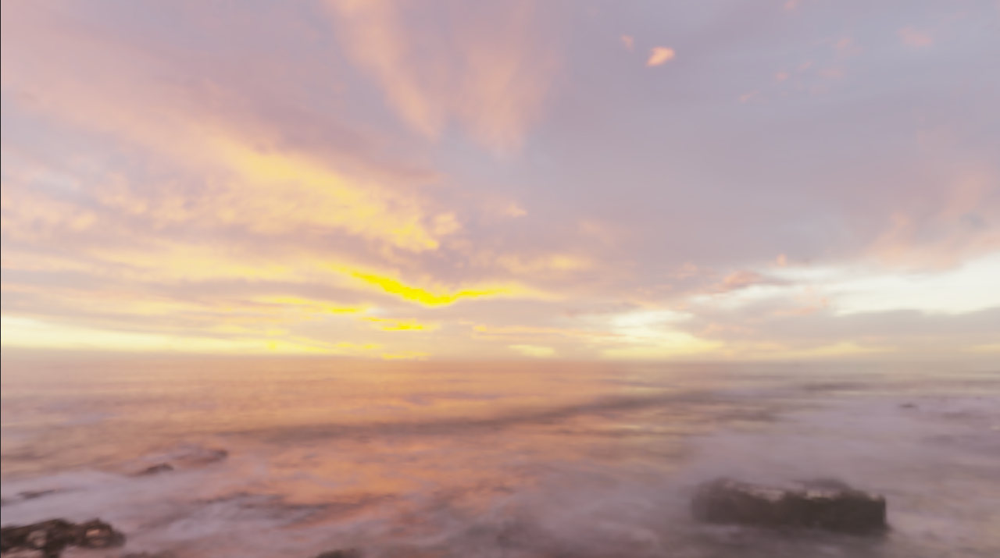

在转动视角的时候，也可以发现背景得到了很好地渲染。接下来的部分，我们会复习irradianceShader，prefilter shader和BRDF Shader的渲染流程（前面已经把核心的片元着色器介绍完了）。


## 3.IBL预计算部分

注意：预计算的部分都在渲染的loop之前完成，意味着我们只需要计算一次（除非需要显式更新）。

### （1）irradiance map

这一项预计算对应IBL的漫反射部分，OpenGL的代码如下：

```c++
// pbr: solve diffuse integral by convolution to create an irradiance (cube)map.
// -----------------------------------------------------------------------------
irradianceShader.use();
irradianceShader.setInt("environmentMap", 0);
irradianceShader.setMat4("projection", captureProjection);
glActiveTexture(GL_TEXTURE0);
glBindTexture(GL_TEXTURE_CUBE_MAP, envCubemap);

glViewport(0, 0, 32, 32); // don't forget to configure the viewport to the capture dimensions.
glBindFramebuffer(GL_FRAMEBUFFER, captureFBO);
for (unsigned int i = 0; i < 6; ++i)
{
    irradianceShader.setMat4("view", captureViews[i]);
    glFramebufferTexture2D(GL_FRAMEBUFFER, GL_COLOR_ATTACHMENT0, GL_TEXTURE_CUBE_MAP_POSITIVE_X + i, irradianceMap, 0);
    glClear(GL_COLOR_BUFFER_BIT | GL_DEPTH_BUFFER_BIT);

    renderCube_ibl();
}
glBindFramebuffer(GL_FRAMEBUFFER, 0);
```

对应shader的顶点着色器跟之前cubemap的是完全一致的，而片元着色器在前面已经进行了讲解。结果会被存储在irrandiance map的六个面中，而irrandiance map也是一个Cubemap。


### （2）Pre-filter environment map

与irradiance map的生成过程类似，也是生成一张cubemap，对六个面分别渲染。只不过这里我们需要对Cubemap开启mipmap（因为在前面的讲解中，我们提到了这一步骤要考虑粗糙度带来的影响）。在shader中，顶点着色器依旧是普通的Cubemap顶点着色器，而片元着色器则是前面有介绍过的计算pre-filter environment map的片元着色器。

这部分OpenGL的代码如下：

```c++
//specular情况下新增：prefilter
// pbr: create a pre-filter cubemap, and re-scale capture FBO to pre-filter scale.
// --------------------------------------------------------------------------------
unsigned int prefilterMap;
glGenTextures(1, &prefilterMap);
glBindTexture(GL_TEXTURE_CUBE_MAP, prefilterMap);
for (unsigned int i = 0; i < 6; ++i)
{
    glTexImage2D(GL_TEXTURE_CUBE_MAP_POSITIVE_X + i, 0, GL_RGB16F, 128, 128, 0, GL_RGB, GL_FLOAT, nullptr);
}
glTexParameteri(GL_TEXTURE_CUBE_MAP, GL_TEXTURE_WRAP_S, GL_CLAMP_TO_EDGE);
glTexParameteri(GL_TEXTURE_CUBE_MAP, GL_TEXTURE_WRAP_T, GL_CLAMP_TO_EDGE);
glTexParameteri(GL_TEXTURE_CUBE_MAP, GL_TEXTURE_WRAP_R, GL_CLAMP_TO_EDGE);
glTexParameteri(GL_TEXTURE_CUBE_MAP, GL_TEXTURE_MIN_FILTER, GL_LINEAR_MIPMAP_LINEAR); // be sure to set minification filter to mip_linear 
glTexParameteri(GL_TEXTURE_CUBE_MAP, GL_TEXTURE_MAG_FILTER, GL_LINEAR);
// generate mipmaps for the cubemap so OpenGL automatically allocates the required memory.
glGenerateMipmap(GL_TEXTURE_CUBE_MAP);

//走的是prefilter.fs这个shader,vs就是最简单的cube.vs
prefilterShader.use();
prefilterShader.setInt("environmentMap", 0);
prefilterShader.setMat4("projection", captureProjection);
glActiveTexture(GL_TEXTURE0);
glBindTexture(GL_TEXTURE_CUBE_MAP, envCubemap);

glBindFramebuffer(GL_FRAMEBUFFER, captureFBO);
unsigned int maxMipLevels = 5;
for (unsigned int mip = 0; mip < maxMipLevels; ++mip)
{
    // resize framebuffer according to mip-level size.
    unsigned int mipWidth = static_cast<unsigned int>(128 * std::pow(0.5, mip));
    unsigned int mipHeight = static_cast<unsigned int>(128 * std::pow(0.5, mip));
    glBindRenderbuffer(GL_RENDERBUFFER, captureRBO);
    glRenderbufferStorage(GL_RENDERBUFFER, GL_DEPTH_COMPONENT24, mipWidth, mipHeight);
    glViewport(0, 0, mipWidth, mipHeight);

    float roughness = (float)mip / (float)(maxMipLevels - 1);
    prefilterShader.setFloat("roughness", roughness);
    for (unsigned int i = 0; i < 6; ++i)  //这里指的是cubeMap的六个面
    {
        prefilterShader.setMat4("view", captureViews[i]);
        glFramebufferTexture2D(GL_FRAMEBUFFER, GL_COLOR_ATTACHMENT0, GL_TEXTURE_CUBE_MAP_POSITIVE_X + i, prefilterMap, mip);

        glClear(GL_COLOR_BUFFER_BIT | GL_DEPTH_BUFFER_BIT);
        renderCube_ibl();
    }
}
glBindFramebuffer(GL_FRAMEBUFFER, 0);
```


### （3）BRDF LUT

对于BRDF LUT项，我们在渲染的时候实际上会用固定的相机和镜头渲染一个quad，并将渲染结果存储在一张buffer中，作为BRDF LUT的预计算结果。如果这个渲染的quad是NDC空间下的1x1 XY quad，那么BRDF LUT shader对应的顶点着色器甚至可以这样写：

```glsl
#version 330 core
layout (location = 0) in vec3 aPos;
layout (location = 1) in vec2 aTexCoords;

out vec2 TexCoords;

void main()
{
    TexCoords = aTexCoords;
	gl_Position = vec4(aPos, 1.0);
}
```

片元着色器在前面也有进行介绍。


## 4.实时渲染——PBR

完成了上面所有的预计算部分，以及实时渲染天空盒的部分后，接下来最后整合预计算结果的实时PBR渲染部分了。这里我们以渲染一个球体为例，PBR Shader的顶点着色器如下：

```glsl
#version 330 core
layout (location = 0) in vec3 aPos;
layout (location = 1) in vec3 aNormal;
layout (location = 2) in vec2 aTexCoords;

out vec2 TexCoords;
out vec3 WorldPos;
out vec3 Normal;

uniform mat4 projection;
uniform mat4 view;
uniform mat4 model;
uniform mat3 normalMatrix;

void main()
{
    TexCoords = aTexCoords;
    WorldPos = vec3(model * vec4(aPos, 1.0));
    Normal = normalMatrix * aNormal;   

    gl_Position =  projection * view * vec4(WorldPos, 1.0);
}
```

没有任何特殊之处，做了正常的空间变换。主要是看片元着色器，重要的地方用【】进行标注：

```glsl
#version 330 core
out vec4 FragColor;
in vec2 TexCoords;
in vec3 WorldPos;
in vec3 Normal;

// material parameters
uniform sampler2D albedoMap;
uniform sampler2D normalMap;
uniform sampler2D metallicMap;
uniform sampler2D roughnessMap;
uniform sampler2D aoMap;

// IBL
uniform samplerCube irradianceMap;
uniform samplerCube prefilterMap;
uniform sampler2D brdfLUT;

// lights
uniform vec3 lightPositions[4];
uniform vec3 lightColors[4];

uniform vec3 camPos;

const float PI = 3.14159265359;
// ----------------------------------------------------------------------------
// Easy trick to get tangent-normals to world-space to keep PBR code simplified.
// Don't worry if you don't get what's going on; you generally want to do normal 
// mapping the usual way for performance anyways; I do plan make a note of this 
// technique somewhere later in the normal mapping tutorial.
vec3 getNormalFromMap()
{
    vec3 tangentNormal = texture(normalMap, TexCoords).xyz * 2.0 - 1.0;

    vec3 Q1  = dFdx(WorldPos);
    vec3 Q2  = dFdy(WorldPos);
    vec2 st1 = dFdx(TexCoords);
    vec2 st2 = dFdy(TexCoords);

    vec3 N   = normalize(Normal);
    vec3 T  = normalize(Q1*st2.t - Q2*st1.t);
    vec3 B  = -normalize(cross(N, T));
    mat3 TBN = mat3(T, B, N);

    return normalize(TBN * tangentNormal);
}
// ----------------------------------------------------------------------------
float DistributionGGX(vec3 N, vec3 H, float roughness)
{
    float a = roughness*roughness;
    float a2 = a*a;
    float NdotH = max(dot(N, H), 0.0);
    float NdotH2 = NdotH*NdotH;

    float nom   = a2;
    float denom = (NdotH2 * (a2 - 1.0) + 1.0);
    denom = PI * denom * denom;

    return nom / denom;
}
// ----------------------------------------------------------------------------
float GeometrySchlickGGX(float NdotV, float roughness)
{
    float r = (roughness + 1.0);
    float k = (r*r) / 8.0;

    float nom   = NdotV;
    float denom = NdotV * (1.0 - k) + k;

    return nom / denom;
}
// ----------------------------------------------------------------------------
float GeometrySmith(vec3 N, vec3 V, vec3 L, float roughness)
{
    float NdotV = max(dot(N, V), 0.0);
    float NdotL = max(dot(N, L), 0.0);
    float ggx2 = GeometrySchlickGGX(NdotV, roughness);
    float ggx1 = GeometrySchlickGGX(NdotL, roughness);

    return ggx1 * ggx2;
}
// ----------------------------------------------------------------------------
vec3 fresnelSchlick(float cosTheta, vec3 F0)
{
    return F0 + (1.0 - F0) * pow(clamp(1.0 - cosTheta, 0.0, 1.0), 5.0);
}
// ----------------------------------------------------------------------------
vec3 fresnelSchlickRoughness(float cosTheta, vec3 F0, float roughness)
{
    return F0 + (max(vec3(1.0 - roughness), F0) - F0) * pow(clamp(1.0 - cosTheta, 0.0, 1.0), 5.0);
}   
// ----------------------------------------------------------------------------
void main()
{		
    // material properties
    vec3 albedo = pow(texture(albedoMap, TexCoords).rgb, vec3(2.2));
    float metallic = texture(metallicMap, TexCoords).r;
    float roughness = texture(roughnessMap, TexCoords).r;
    float ao = texture(aoMap, TexCoords).r;
       
    // input lighting data
    vec3 N = getNormalFromMap();
    vec3 V = normalize(camPos - WorldPos);
    vec3 R = reflect(-V, N); 

    // calculate reflectance at normal incidence; if dia-electric (like plastic) use F0 
    // of 0.04 and if it's a metal, use the albedo color as F0 (metallic workflow)    
    vec3 F0 = vec3(0.04); 
    F0 = mix(F0, albedo, metallic);

    // reflectance equation
    vec3 Lo = vec3(0.0);
    for(int i = 0; i < 4; ++i) //【1】有四个固定的“点光源”，计算点光源直接光照带来的PBR着色结果
    {
        // calculate per-light radiance
        vec3 L = normalize(lightPositions[i] - WorldPos);
        vec3 H = normalize(V + L);
        float distance = length(lightPositions[i] - WorldPos);
        float attenuation = 1.0 / (distance * distance);
        vec3 radiance = lightColors[i] * attenuation;

        // Cook-Torrance BRDF
        float NDF = DistributionGGX(N, H, roughness);   
        float G   = GeometrySmith(N, V, L, roughness);    
        vec3 F    = fresnelSchlick(max(dot(H, V), 0.0), F0);        
        
        vec3 numerator    = NDF * G * F;
        float denominator = 4.0 * max(dot(N, V), 0.0) * max(dot(N, L), 0.0) + 0.0001; // + 0.0001 to prevent divide by zero
        vec3 specular = numerator / denominator;
        
         // kS is equal to Fresnel
        vec3 kS = F;
        // for energy conservation, the diffuse and specular light can't
        // be above 1.0 (unless the surface emits light); to preserve this
        // relationship the diffuse component (kD) should equal 1.0 - kS.
        vec3 kD = vec3(1.0) - kS;
        // multiply kD by the inverse metalness such that only non-metals 
        // have diffuse lighting, or a linear blend if partly metal (pure metals
        // have no diffuse light).
        kD *= 1.0 - metallic;	                
            
        // scale light by NdotL
        float NdotL = max(dot(N, L), 0.0);        

        // add to outgoing radiance Lo
        Lo += (kD * albedo / PI + specular) * radiance * NdotL; // note that we already multiplied the BRDF by the Fresnel (kS) so we won't multiply by kS again
    }   
    
    // ambient lighting (we now use IBL as the ambient term) //【2】IBL部分
    vec3 F = fresnelSchlickRoughness(max(dot(N, V), 0.0), F0, roughness);
    
    vec3 kS = F;
    vec3 kD = 1.0 - kS;
    kD *= 1.0 - metallic;	  
    
    vec3 irradiance = texture(irradianceMap, N).rgb;
    vec3 diffuse      = irradiance * albedo;
    
    // sample both the pre-filter map and the BRDF lut and combine them together as per the Split-Sum approximation to get the IBL specular part.
    const float MAX_REFLECTION_LOD = 4.0;
    vec3 prefilteredColor = textureLod(prefilterMap, R,  roughness * MAX_REFLECTION_LOD).rgb;    
    vec2 brdf  = texture(brdfLUT, vec2(max(dot(N, V), 0.0), roughness)).rg;
    vec3 specular = prefilteredColor * (F * brdf.x + brdf.y);

    vec3 ambient = (kD * diffuse + specular) * ao;
    
    vec3 color = ambient + Lo;

    // HDR tonemapping
    color = color / (color + vec3(1.0));
    // gamma correct
    color = pow(color, vec3(1.0/2.2)); 

    FragColor = vec4(color , 1.0);
}

```

注：这里也可以参考虚幻官方的实现：[3] https://cdn2.unrealengine.com/Resources/files/2013SiggraphPresentationsNotes-26915738.pdf


参考：

[1] https://learnopengl-cn.github.io/07%20PBR/03%20IBL/01%20Diffuse%20irradiance/

[2] https://zhuanlan.zhihu.com/p/66518450

[3] https://cdn2.unrealengine.com/Resources/files/2013SiggraphPresentationsNotes-26915738.pdf

[4] Debevec, Paul. ["Image-Based Lighting"](http://ict.usc.edu/pubs/Image-Based Lighting.pdf) (PDF). *[USC Institute for Creative Technologies](https://en.wikipedia.org/wiki/Institute_for_Creative_Technologies)*. [University of Southern California](https://en.wikipedia.org/wiki/University_of_Southern_California). Retrieved 21 February 2016.

[5]https://www.indiedb.com/features/using-image-based-lighting-ibl

[6]https://google.github.io/filament/Filament.html

[7]https://seblagarde.wordpress.com/wp-content/uploads/2015/07/course_notes_moving_frostbite_to_pbr_v32.pdf

[8]https://wiki.jmonkeyengine.org/docs/3.4/tutorials/how-to/articles/pbr/pbr_part3.html

[9]https://en.wikipedia.org/wiki/Schlick%27s_approximation

[10]https://zhuanlan.zhihu.com/p/78146875

[11]https://www.mathematik.uni-marburg.de/~thormae/lectures/graphics1/code/ImportanceSampling/importance_sampling_notes.pdf

[12]https://dcgi.felk.cvut.cz/publications/2008/krivanek-cgf-rts

[13]https://zhuanlan.zhihu.com/p/343666731
