# 空间加速结构

前面我们在渲染管线章节中我们有提到，可以使用空间加速来快速剔除不在视锥体内的不可见物体。我们回忆一下：

假设我们的三维场景是一个巨大的拥有20个国家的开放世界，有几万个物体，那么，我们放置的相机大概率只能看见其中的一小部分物体，如果我们使用观察体剔除一个一个判断并剔除这些物体，会带来不可估计的性能消耗。如下示意图，大部分区域都是相机不可见的（褐色方块标出）。


如果我们的相机正在国家1的路上拍照，它大概率并不需要渲染剩下19个国家的所有物体，进一步想，我们可以将三维空间划分为各个区域，不与我们的观察体棱台相交的整个区域可以尽快抛弃，而无需一个个物体进行剔除，从而进行**空间加速**。

同样的，空间加速在渲染，物理等方面也有很大的作用。例如在光线追踪中，我们从像素打一根光线到场景中，我们需要对于场景中所有物体，计算光线是否与各个物体相交，如果场景很大，有成千上万个物体，使用空间加速就会大大加快计算。又例如在检测碰撞的场景中，物体A移动了一下，需要检测是否与其他物体
物体相交，如果场景中有很多物体，使用空间加速也会大大加快计算。

绝大多数现在的ray tracers都使用K-D树或者是BVH树，在本篇中会实现八叉树,K-D树以及BVH树。

# 一、Octree八叉树

原理很容易理解，如下图：


我们有一个Box，将这个Box八等分（X,Y,Z方向各对半分），那我们就有了八个子Box（$2^3$个）。如果我们再把这八个再划分一下，那就能得到64个Box($2^6$个)。在实际应用中，往往不会对所有子节点无差别的划分，而是满足“一定条件”的子节点，才会被再次划分。

## 1.八叉树的数据结构

对于每一个`node`，其代表了一个子空间。对box而言，我们可以使用`center`和`size`来定义这个空间，此时判断某一点$P$是否包含在`node`内的逻辑是比较简单的。可以这样判断：

（本次实验环境是unity，方便可视化）

```c#
bool isInSideNode(Vector3 pos)
{
    return abs(pos.x-center.x)<size.x/2.0 && abs(pos.y-center.y)<size.y/2.0 && abs(pos.z-center.z)<size.z/2.0;
}
```

在后面的代码中，也会看到这个函数的实现。

根据上述知识，我们定义八叉树的Node节点以及其构造函数：

```c#
namespace SpaceAccelerateDemo
{
    public class OctreeNode
    {
        public List<GameObject> areaObjects;
        public Vector3 center;
        public float size; //为了节省空间，这里定义每个node都是正方体，因此用一个float值即可存储size
        
        private const int kidCount = 8; //八叉树，每个节点有8个子节点
        private OctreeNode[] kids;
        public OctreeNode(Vector3 center, float size)
        {
            this.center = center;
            this.size = size;
            areaObjects = new List<GameObject>();
            kids = new OctreeNode[kidCount];
        }
    }
}
```

一些基本的逻辑函数，例如下面这两个：

```c#
public bool isLeaf => kids[0] == null;
        
public bool Contains(Vector3 position)
{
    var halfSize = size * 0.5f;
    return Mathf.Abs(position.x - center.x) <= halfSize &&
           Mathf.Abs(position.y - center.y) <= halfSize &&
           Mathf.Abs(position.z - center.z) <= halfSize;
}
```

还需要一个DrawGizmos的函数，方便后面做可视化的时候用：

```c#
public void DrawGizmos()
{
    Gizmos.DrawWireCube(center, Vector3.one * size);
}
```

具体还有哪些别的，可以看源代码`OctreeNode.cs`。


## 2.OctreeTest

刚才的八叉树只是一个数据结构，我们还需要对其进行管理。这里简单起见，只增加一个`OctreeTest.cs`文件用于测试八叉树空间加速结构，OctreeTest.cs中包含了八叉树测试的剩余逻辑。我们随机生成一些Cube，用于测试：

```c#
private void GenSceneObjects()
{
    float genRange = range * 0.5f;
    sceneObjects = new List<GameObject>();
    for (int i = 0; i < genCount; i++)
    {
        var obj = GameObject.CreatePrimitive(PrimitiveType.Cube);
        obj.transform.position = new Vector3(Random.Range(-genRange, genRange), Random.Range(-genRange, genRange), Random.Range(-genRange, genRange));
        obj.hideFlags = HideFlags.HideInHierarchy; //隐藏在Hierarchy面板
        sceneObjects.Add(obj);
    }
}
```

> 为了防止不重要的内容干扰阅读，这篇文章中只展示比较核心的代码，全部的代码可以看SpaceAcceleration子文件夹中的。

此时运行程序，会产生许多随机位置的Cube。接下来便是对他们进行划分。


### （1）八叉树划分算法

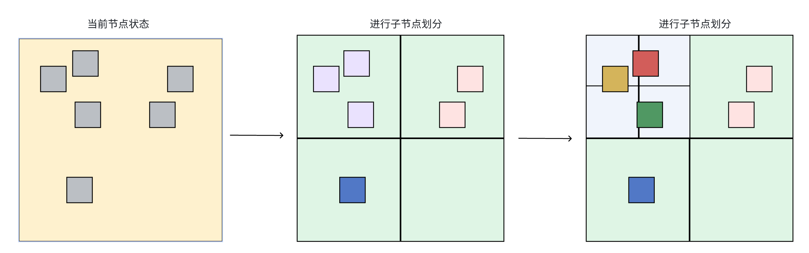

大致的算法如下：

- （a）如果当前生成递归深度小于定义最大递归深度， 则从【当前节点】创建8个【子节点】；
- （b）遍历【当前节点】中记录的场景对象，将对象分配到对应的【子节点】中；
- （c）当前深度减一，遍历【子节点】，尝试执行步骤1。直到【子节点】中的物体数量小于等于1(或者指定最小值)，或者递归深度达到最大递归深度；

代码如下（其中OctreePartion()函数在Start函数中被调用）：

```c#
private void OctreePartion()
{
    root = new OctreeNode(Vector3.zero, range);
    root.areaObjects.AddRange(sceneObjects);
    BuildOctree(root, 0);
}

private void BuildOctree(OctreeNode node, int depth)
{
    if (depth >= buildDepth)
    {
        return;
    }
    if (node.objectCount <= 1)
    {
        return;
    }
    var halfSize = node.size * 0.5f;
    for (int i = 0; i < 8; i++)
    {
        var center = node.center;
        //根据i的二进制位来判断是在左还是右,前还是后,上还是下,i=0~7分别是000，001，010，011，100，101，110，111
        center.x += (i & 1) == 0 ? halfSize * 0.5f : -halfSize * 0.5f;
        center.y += (i & 2) == 0 ? halfSize * 0.5f : -halfSize * 0.5f;
        center.z += (i & 4) == 0 ? halfSize * 0.5f : -halfSize * 0.5f;
        var newNode = new OctreeNode(center, halfSize);
        node.Kids[i] = newNode;
        newNode.areaObjects = node.areaObjects.FindAll(obj => newNode.Contains(obj.transform.position));
        BuildOctree(newNode, depth + 1);
    }
}
```


### （2）可视化

完成了上述的八叉树划分，我们还需要将其可视化出来。在Test脚本中定义一个枚举类型，表示debug的模式：

```c#
public enum OctreeDebugMode
{
    AllDepth,
    TargetDepth
}
```

此时为Test文件添加一个DrawGizmos的函数(继承于Monobehavior)：

```c#
private void DrawOctree(OctreeNode node, int depth)
{
    //AllDepth:绘制所有深度的八叉树
    if (octreeDebugMode == OctreeDebugMode.AllDepth)
    {
        node.DrawGizmos();
        if (node.isLeaf)
        {
            return; 
        }
        for (int i = 0; i < 8; i++)
        {
            DrawOctree(node.Kids[i], depth + 1);
        }
    }
    //TargetDepth:绘制目标深度的八叉树
    else if (octreeDebugMode == OctreeDebugMode.TargetDepth)
    {
        Gizmos.color = Color.yellow;
        if (depth == targetDisplayDepth)
        {
            Gizmos.color = Color.green;
            node.DrawGizmos();
        }
        if (node.isLeaf)
        {
            return;
        }
        for (int i = 0; i < 8; i++)
        {
            DrawOctree(node.Kids[i], depth + 1);
        }
    }
}

private void OnDrawGizmos()
{
    if (root == null || !debugDraw)
    {
        return;
    }
    DrawOctree(root,0);
}
```

此时运行程序，用2D正交相机可以看到如下结果：

（1）首先是AllDepth：

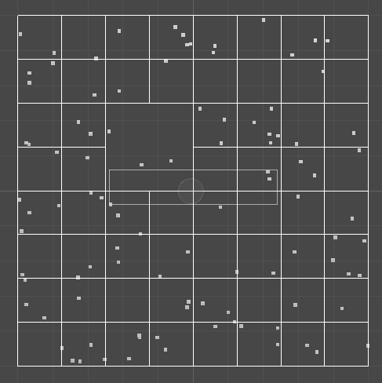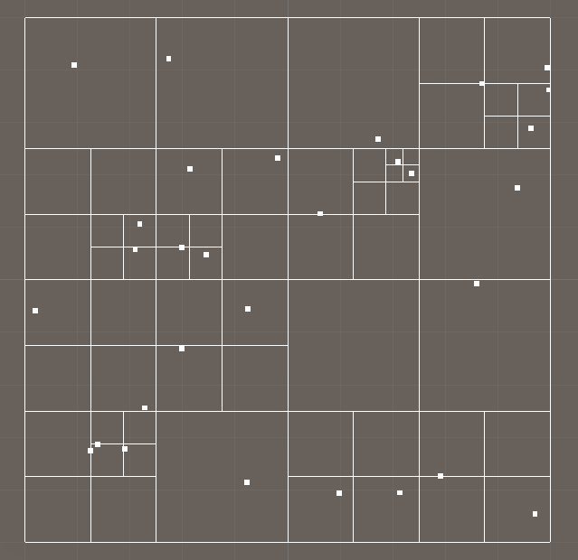

> 看起来有的格子里物体数量比较多是因为我们是2D投影的结果，实际应该是三维的；

（2）targetDepth=3，这次用三维来看：


## 3.八叉树的作用：场景查询

我们已然有了加速结构，但是有什么用呢？一个很直观的作用就是“场景查询”。例如，我们已知有一个检查点的坐标，想知道场景中的物体，哪些与这个检查点很接近，意味着其可能发生碰撞。

为了做测试，新增一些变量：

```c#
public bool doQueryTest = false;
public Transform queryTransform;
private List<GameObject> queryObjects; //临近物体的列表，用于找到最近的物体
private OctreeNode queryNode; //查询到的最终节点，会递归找到叶子节点，将其可视化为绿色
```

此时查询的函数如下：

```c#
private void Update()
{
    if (doQueryTest)
    {
        if(queryObjects != null)
            queryObjects.Clear();
        queryObjects = new List<GameObject>();
        queryNode = null;
        QueryNearestObject(root, queryTransform.position);
    }
}

private void QueryNearestObject(OctreeNode node, Vector3 position)
{
    if (node.isLeaf) //一直找到叶子节点
    {
        queryNode = node;
        queryObjects.AddRange(node.areaObjects);
        return;
    }
    for (int i = 0; i < 8; i++)
    {
        if (node.Kids[i].Contains(position))
        {
            QueryNearestObject(node.Kids[i], position);  //看看哪个子节点中有这个物体，有的话再走到子节点
        }
    }
}
```

OnDrawGizmos函数也要更新，如果有QueryNode的话，就找到当前QueryNode下所有包含物体中距离target最近的物体，连一条红色的线过去。


### （1）可视化效果

下面的动图展示了八叉树查询时的优势（让所有生成的Cube的y=0，用2D俯视图来可视化结果）：

<video src="./assets/OctreeTreeDemo.mp4"></video>

## 4.整个场景

整个场景非常简单，如下：

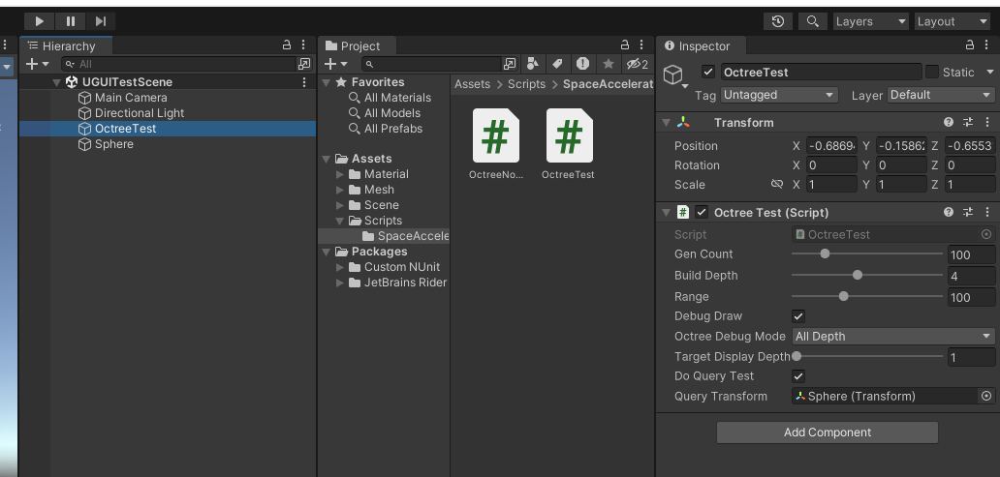

其中Sphere是要查询的物体。对应的代码在SpaceAcceleration文件夹下面。

> 其他关于Octree的参考资料：[2]https://www.gameres.com/665565.html。一些关键词：
>
> - 松散八叉树：
>   - 游戏中用的八叉树常常是[松散八叉树](https://zhida.zhihu.com/search?content_id=514615747&content_type=Answer&match_order=1&q=松散八叉树&zhida_source=entity)，就是子节点的范围会比正常的范围略微大一圈，这样如果物体和分割轴相交，也可以放到子节点下。
>
>[1]https://www.zhihu.com/question/48905832/answer/2664911942


八叉树的动态更新：如果物体的位置改变了，八叉树要怎么更新？

> 1. - 松散八叉树在处理物体移动问题时，采取了较为高效和简洁的策略：
>
>      1. **物体位置更新**：当物体移动时，首先判断物体的中心点是否超出了其当前所在节点的“入口边界”（inner boundary）。如果超出了，才需要将其从当前节点移除。
>      2. **避免频繁调整**：松散八叉树的“出口边界”（outer boundary）比“入口边界”宽，通常是入口边界的两倍。这意味着即使物体在边界附近移动，也较难超出出口边界，从而减少了物体频繁更换节点的情况。
>      3. **快速重新定位**：当物体确实需要移动到另一个节点时，由于松散八叉树的特性，可以快速确定新的合适节点。只需根据物体新的中心位置和当前层级的节点范围，直接插入到新的节点中，这一过程通常可以在O(1)的时间复杂度内完成。
>      4. **减少冗余检测**：通过这种设计，减少了在查询碰撞或视锥体剔除时需要检查的物体数量，因为大部分物体不会因为轻微的移动而频繁改变所属节点。
>      5. **动态更新简化**：对于动态场景，物体移动后，只需简单检查并更新其在树中的位置，而不需要对整个八叉树结构进行大规模的重构，大大简化了动态管理的复杂度。
>
>      可以看出，松散八叉树通过扩大节点的覆盖范围，简化了一些动态物体的管理，在游戏和模拟场景中可以提高一定的物体移动处理的效率和性能。


# 二、BVH Tree

参考文章：[3]https://zhuanlan.zhihu.com/p/697130257

PBRT原文从这里开始看：[4]https://pbr-book.org/4ed/Primitives_and_Intersection_Acceleration/Aggregates

以下是PBRT关于一些与空间加速和BVH 树的解释：

> 大体上，解决这个问题有两种主要方法：空间细分和对象细分。
>
> - 空间细分算法将三维空间分解为区域（例如，通过在场景上叠加一个轴对齐的盒子网格）并记录哪些原始图形与哪些区域重叠。在某些算法中，区域也可以根据重叠的原始图形数量进行自适应细分。当需要找到光线交点时，计算光线经过的这些区域的序列，并仅测试与重叠区域中的原始图形的交点。
> - 相反，对象细分是基于逐步将场景中的对象分解为较小的相邻对象。例如，一个房间的模型可能被分解为四面墙、一个天花板和一把椅子。如果光线没有与房间的包围体相交，则可以剔除它的所有原始图形。否则，将对每个原始图形进行测试。如果光线击中椅子的包围体，则可能会对其每条腿、座椅和靠背进行测试。否则，椅子将被剔除。
>
> 这两种方法在解决光线交点计算要求方面都非常成功；没有根本理由偏向其中一种。BVH基于对象细分，而 KdTree则基于空间细分。

BVH树在光线追踪和物理解算的时候有比较广泛的应用。但以下两种场景可能不那么适合用BVH：

- （1）场景非常简单，只有几个物体，此时用空间划分的方法可能更好，比如八叉树（有待商榷）；
- （2）场景频繁发生变化，BVH树在处理动态物体的时候会复杂一些，如果场景里的各种物品都在来回移动，可以考虑使用BVH以外的空间加速结构。


## 1.BVH树的基本原理

来看下面的图：

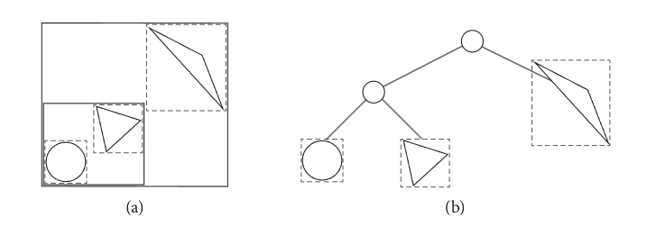

左侧是场景，右侧则是基于这个场景创建的BVH树。其中，叶子节点存储的是每个物体自身的包围盒，而非叶子节点（包含根节点）则存储的是大的包围盒。显然，在判断是否相交的时候要先根据大的包围盒判断，如果相交才会走到其孩子节点继续判断是否相交。

BVH构建的准则在于：

- 每个primitive（可以理解为图元）在层次结构中只出现一次。相比之下，在空间细分的方法中，一个primitive可能会与多个空间区域重叠，因此在光线经过这些区域时，可能会被多次测试交点。BVH树这一特性的另一个含义是，用于表示primitive细分层次结构所需的内存量是有限的。**对于一个在每个叶子节点存储单个primitive的二叉 BVH，总节点数为 (2n - 1)，其中 (n) 是原始图形的数量。（这里有 (n) 个叶子节点和 (n - 1) 个内部节点。可以看上面右图辅助理解）**如果叶子节点存储多个primitive，则需要的节点更少。

相对于kd-树来说，BVH树的构建更加高效，并且通常在数值上更稳健，较少因舍入误差导致漏掉交点。因此类似于PBRT这本书，会把BVH树作为默认的空间加速结构。

> **在本节教程中，我们会基于Unity构建BVH树，并将其可视化出来。**

构建BVH树有以下类型：

- ```c++
  enum class SplitMethod { SAH, HLBVH, Middle, EqualCounts };
  ```

- 默认值 SAH 表示应使用基于“surface area heuristic”的算法（在PBRT第 7.3.2 节中讨论）。另一种替代方案 HLBVH（在PBRT第 7.3.3 节中讨论）可以更高效地构建（并且更容易进行并行化），但其构建的树不如 SAH 有效（effective）。剩下的两种方法计算量更少，但创建的树质量相对较低。它们主要用于强调前两种方法的优越性。


## 2.Unity创建BVH树

接下来，我们先来看看创建基本BVH树的过程并做一个小demo，然后再回来补充PBRT中的内容。主要参考这篇：[3]https://zhuanlan.zhihu.com/p/697130257。

### （1）包围盒——AABB

在Unity导入Mesh之后，我们可以看到其AABB。用一个center+size就可以表示出AABB。

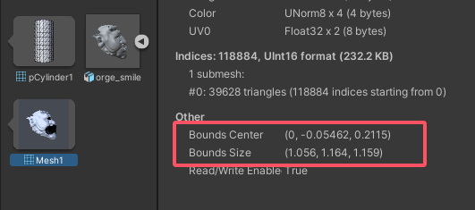

`Bounds Center`即为AABB包围盒的中心点，`Bounds Size`即为这包围盒的“长宽高”。

如下图，对于一个【物体A】的【包围盒A】，我们有如下性质：

1. 如果检查点不在【包围盒A】内部，则检查点一定也不在【物体A】内部。
2. 如果射线不与【包围盒A】相交，则射线一定不与【物体A】相交。

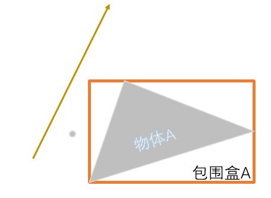

例如说在光线追踪中，光线要先和AABB求交，才会去判断是否和物体的三角形面片相交。

**当然，也可以用左下角（minCorner）和右上角（maxCorner）来表示一个AABB，这样做的话判断两个AABB取union操作可能更容易一些。**

在C#中定义AABB的基本结构（在C#中，struct默认是值传递，class则默认是引用传递）：

```c#
public struct AABB
{
    public Vector3 minCorner; //左下角
    public Vector3 maxCorner;  //右上角

    public AABB(Vector3 min, Vector3 max)
    {
        this.minCorner = min;
        this.maxCorner = max;
    }

    public Vector3 Size => maxCorner - minCorner;
    public Vector3 Center => (maxCorner + minCorner) * 0.5f;

}
```

在BVH树的构建中，对两个AABB取并集这件事非常有用，而实际上对于AABB来说也比较简单，min=min(A，B)，max=max（A，B）即可。看下图更有助于理解：

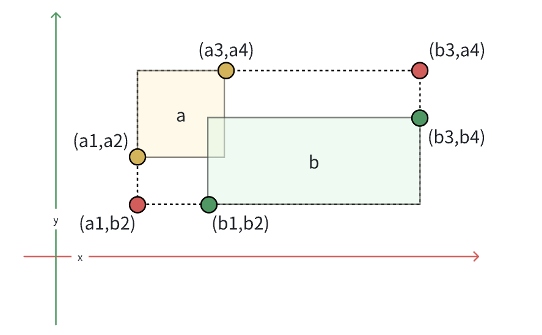

将以上逻辑写成代码就是：

```c#
public AABB Union(AABB aabb)
{
    minCorner.x = Mathf.Min(minCorner.x, aabb.minCorner.x);
    minCorner.y = Mathf.Min(minCorner.y, aabb.minCorner.y);
    minCorner.z = Mathf.Min(minCorner.z, aabb.minCorner.z);

    maxCorner.x = Mathf.Max(maxCorner.x, aabb.maxCorner.x);
    maxCorner.y = Mathf.Max(maxCorner.y, aabb.maxCorner.y);
    maxCorner.z = Mathf.Max(maxCorner.z, aabb.maxCorner.z);

    return new AABB(minCorner, maxCorner);
}
```

另外，AABB还需要一个reset函数，一开始认为minCorner是max值，maxCorner是min值，这样的reset之后的AABB虽然在代码上并不合法，但在与任何AABB取并集的时候就会变成对应的AABB，可以认为是一种trick：

```c#
public static AABB Reset()
{
    return new AABB(Vector3.one * float.MaxValue, Vector3.one * float.MinValue);
}
```

一般来说，平时使用AABB的时候还可能会涉及到光线与AABB求交，以及两个AABB的求交问题，但这里先不展开了。上述基础函数对于BVH树的基本构建已经足够了。


### （2）BVH Node

主要逻辑代码如下，重点是看InitializeAABB的部分：

```c#
public class BVHNode
{
    public BVHNode leftNode;
    public BVHNode rightNode;
    public BVHNode parent;

    public AABB aabb { get; private set; }
    public List<GameObject> sceneObjects; //BVH节点包含的物体

    #region Debug
    public string Name { get; private set; } //BVH节点的名字
    private Color spaceColor; //BVH节点的颜色
    #endregion

    private void InitializeAABB()
    {
        this.aabb = AABB.Reset();
        if (sceneObjects == null || sceneObjects.Count==0) return;
        //计算AABB,遍历sceneObjects，找到公共包围盒
        foreach (var obj in sceneObjects)
        {
            var aabb = ComputeWorldAABB(obj);
            this.aabb = this.aabb.Union(aabb);
        }
    }

    public void DumpSceneObject(System.IO.StreamWriter file)
    {
        if (sceneObjects == null) return;
        foreach (var obj in sceneObjects)
        {
            file.WriteLine("    " + obj.name);
        }
    }

    public BVHNode(string name, List<GameObject> objs)
    {
        sceneObjects = objs;
        InitializeAABB();
        Name = name;
        spaceColor = new Color(Random.value, Random.value, Random.value, 0.9f);
    }

    public void UnionAABB(AABB other)
    {
        this.aabb = this.aabb.Union(other);
    }

    public static AABB ComputeWorldAABB(GameObject obj)
    {
        var mesh = obj.GetComponent<MeshFilter>().sharedMesh;
        var localMin = mesh.bounds.min;
        var localMax = mesh.bounds.max;
        var worldMin = obj.transform.TransformPoint(localMin);
        var worldMax = obj.transform.TransformPoint(localMax);
        return new AABB(worldMin, worldMax);
    }

    public void SetLeaf(BVHNode left, BVHNode right)
    {
        leftNode = left;
        rightNode = right;
        if(leftNode!=null) leftNode.parent = this;
        if(rightNode!=null) rightNode.parent = this;
        this.sceneObjects = null;
    }       
}
```

另外，跟八叉树一样，我们也需要BVH节点的可视化逻辑：

```c#
public void DrawGizmos()
{
    Gizmos.color = spaceColor;
    Gizmos.DrawWireCube(this.aabb.center, this.aabb.size);
    Gizmos.DrawSphere(this.aabb.minCorner, 0.1f);
    Gizmos.DrawSphere(this.aabb.maxCorner, 0.1f);
}
```

其他涉及到的函数会在需要的时候做补充。


### （3）BVH Space

这个类用于划分空间中的物体。一种直观的想法是基于二分来做，本来二分其实要求物体要排好序，这里我们先实现具体的逻辑，重点是看下面代码里面的递归划分阶段，这里我们退出递归的叶子节点需要满足以下两个条件之一：

- 达到对应的depth值，比如这颗BVH树在创建的时候我们可以允许其最多有5层，这样可以会造成叶子节点的AABB中有超过一个物体；
- 叶子节点的AABB中只有一个物体，此时不再创建左右孩子节点。

**再次强调，BVH的非叶子节点中虽然有AABB的相关信息，但并不包含物体的信息，因此在node.SetLeaf函数中会把node里面的sceneObjects置为null。**

```c++
public class BVHSpace
{
    public BVHNode root { get; private set; }

    public void BuildBVH(List<GameObject> sceneObjects, int depth)
    {
        root = new BVHNode("root", null);
        foreach (var obj in sceneObjects)
        {
            var aabb = BVHNode.ComputeWorldAABB(obj);
            root.UnionAABB(aabb);
        }

        BinaryPartition(root, sceneObjects, 0, sceneObjects.Count, depth);
    }

    //二分递归划分
    private void BinaryPartition(BVHNode node, List<GameObject> objs, int startIndex, int endIndex, int depth)
    {
        if ( (node.sceneObjects!=null && node.sceneObjects.Count == 1) || depth <=0) return;

        //计算二分下标
        var halfIndex = (endIndex + startIndex) / 2;
        //把对应的物体分配到左右子节点
        var leftNode = new BVHNode(node.Name + "_leftKid_" + depth.ToString(), new List<GameObject>(objs.GetRange(startIndex, halfIndex - startIndex)));
        var rightNode = new BVHNode(node.Name + "_rightKid_" + depth.ToString(), new List<GameObject>(objs.GetRange(halfIndex, endIndex - halfIndex)));

        node.SetLeaf(leftNode, rightNode);

        //前半部分递归
        BinaryPartition(leftNode, objs, startIndex, halfIndex, depth - 1);
        //后半部分递归
        BinaryPartition(rightNode, objs, halfIndex, endIndex, depth - 1);
    }
}
```

> 补充：在这篇笔记对应的Github仓库源码中，还提供了将整棵BVH树层序遍历到文件中的函数，函数入口是`DumpTreeNodeInfos("BVHTree.txt");`。


### （4）可视化结果

现在我们在BVHTest.cs文件中随机生成若干物体，然后构建BVH树。写一个函数来可视化每一层的各个节点，并在`OnDrawGizmos`函数中调用。具体如下：
```c#
//BVHTest.cs
private void OnDrawGizmos()
{
    binarySpace?.root?.DrawTargetDepth(displayDepth);
}
```

而BVHNode类的DrawTargetDepth函数如下（调用的DrawGizmos函数就是绘制AABB出来）：
```c#
public void DrawTargetDepth(int depth)
{
    if (depth <= 0)
    {
        DrawGizmos();
    }
    else
    {
        this.rightNode?.DrawTargetDepth(depth - 1);
        this.leftNode?.DrawTargetDepth(depth - 1);
    }
}
```

可以看到，使用递归的方式把对应层的AABB都绘制出来了。我们假设整个场景的objects的生成顺序是从左到右的（意味着是排好序的），此时在做二分生成BVH子节点的时候效果会比较好（因为二分法对位置排序好的节点比较友好），动图可视化如下：

<video src="./assets/BVHDemo1.mp4"></video>

不过，如果我们场景的物体并没有排好序，会发生什么事呢？

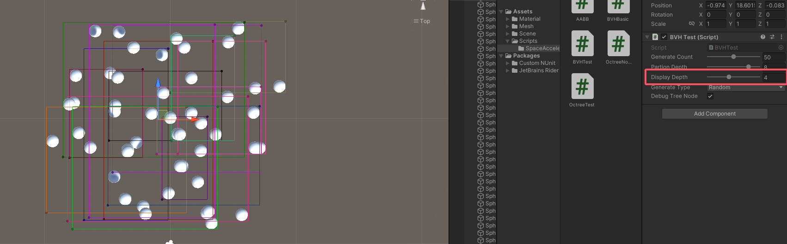

可以看到，由于我们之前的逻辑是暴力地二分整个场景的物品，然后依据索引值放到子节点里面，在上图的情况下，场景objects列表里面的物体并没有按顺序排布，而是随机排布，此时构建出来的BVH树会非常糟糕，基本起不到什么优化效果，三维情况观察如下图：

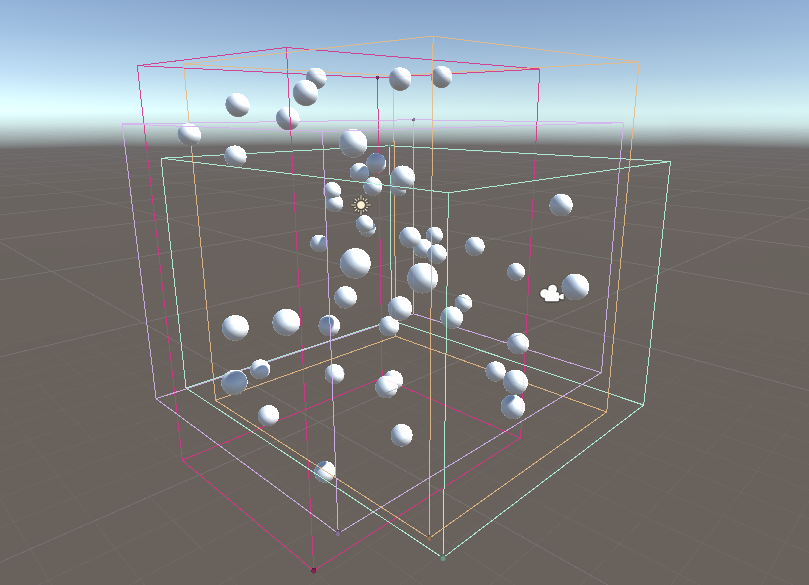

### （5）优化——AxisPartition

基于数组下标的二分法得到的AABB并不再是一个理想的结果，我们更希望每一层的AABB尽可能地不相交。那么，有没有什么办法能更好地做物体的划分呢？理论上，我们可以借鉴八叉树和KD-树的思想，试图在坐标上做划分。对于轴向的划分，可以选择X、Y、Z三个轴。选择哪一个轴呢？

> 我们可以观察到如下事实：如果说场景物体的x值非常集中，比如方差只有0.01，那么基于x值的坐标二分结果的AABB也会非常集中，并不是一个好的结果。

例如：

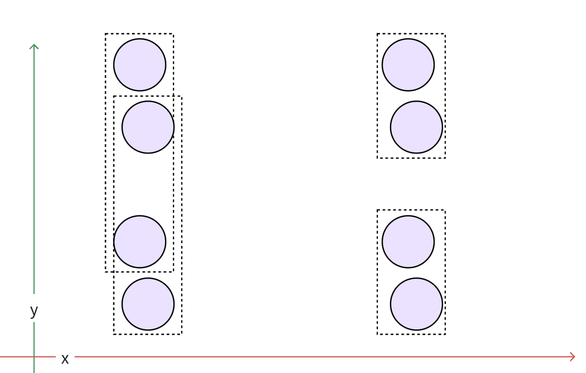

上图的左右是同一个场景，这个场景物体在x轴上分布的非常集中，y轴则分布的相对松散一些，所以我们要在Y轴上进行划分。同时，很明显能够看出右侧的划分质量比左侧更好。实际上，**寻找方差最大的轴，计算中点，分割物体**，这正是[k-d tree](https://zhida.zhihu.com/search?content_id=243048037&content_type=Article&match_order=1&q=k-d+tree&zhida_source=entity)的构建算法。它是和八叉树一样，是基于空间的加速结构。这里我们借用其算法思想，来作为BVH的构建。来看代码，在BVHSpace中新增以下函数，同时修改BuildBVH函数，增加对type的判断：

```c#
//最大方差轴分割
private void AxisPartition(BVHNode node, List<GameObject> sceneObjects, int depth)
{
    if ( (node.sceneObjects!=null && node.sceneObjects.Count == 1) || depth <=0) return;

    var leftNodeSceneObjects = new List<GameObject>();
    var rightNodeSceneObjects = new List<GameObject>();

    int mode = PickVariance(sceneObjects);
    float centerMode = node.aabb.Center[mode]; //对应轴的中心
    foreach (var obj in sceneObjects)
    {
        var objCenter = obj.transform.position[mode];
        if (objCenter < centerMode)
        {
            leftNodeSceneObjects.Add(obj);
        }
        else
        {
            rightNodeSceneObjects.Add(obj);
        }
    }

    var leftNode = new BVHNode(node.Name + "_leftKid_" + depth.ToString(), leftNodeSceneObjects);
    var rightNode = new BVHNode(node.Name + "_rightKid_" + depth.ToString(), rightNodeSceneObjects);
    node.SetLeaf(leftNode, rightNode);
    //递归
    AxisPartition(leftNode, leftNodeSceneObjects, depth - 1);
    AxisPartition(rightNode, rightNodeSceneObjects, depth - 1);
}

//选择方差最大的轴
private int PickVariance(List<GameObject> sceneObjects)
{
    var maxVariance = float.MinValue;
    var maxIndex = 0;
    for (int i = 0; i < 3; i++)
    {
        var variance = ComputeVariance(sceneObjects, i);
        if (variance > maxVariance)
        {
            maxVariance = variance;
            maxIndex = i;
        }
    }
    return maxIndex;
}

private float ComputeVariance(List<GameObject> sceneObjects, int axis)
{
    var center = Vector3.zero;
    foreach (var obj in sceneObjects)
    {
        center += obj.transform.position;
    }
    center /= sceneObjects.Count;
    var variance = 0.0f;
    foreach (var obj in sceneObjects)
    {
        variance += Mathf.Pow(obj.transform.position[axis] - center[axis], 2);
    }
    return variance;
}

public void BuildBVH(List<GameObject> sceneObjects, int depth, int type=1)
{
    //...
    if(type==0)
        BinaryPartition(root, sceneObjects, 0, sceneObjects.Count, depth);
    else if(type==1)
        AxisPartition(root, sceneObjects, depth);
}
```

此时我们再随机生成一些物体，然后可视化一下BVH树，结果如下：

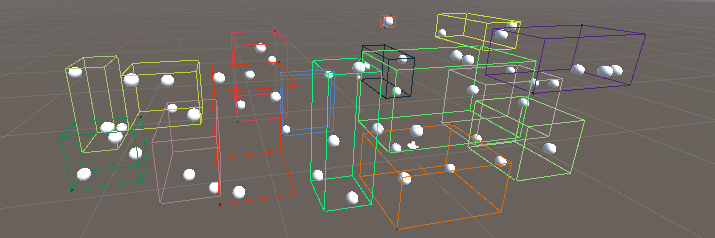

可以看到，这时的划分结果比前面不做特殊处理的时候要好很多。这就是Axis-Partition的作用，这种思想在图形学中也是比较常见的。在实际BVH的应用中，假设场景是静止的，构建这棵树基本是一次性的，在运行的时候可以很好起到加速的作用，对于静态场景来说可以大大提升光线求交和物理碰撞解算的效率。


### （6）补充

至此，我们成功地构建了BVH，但是这种方式是“自上而下”[[2\]](https://zhuanlan.zhihu.com/p/697130257#ref_2)的构建方式，我们得提前知道场景中的所有物体`List<GameObject>`。

> **top-down :** [离线渲染](https://zhida.zhihu.com/search?content_id=243048037&content_type=Article&match_order=1&q=离线渲染&zhida_source=entity)中最流行的方法.将所有BV(bounding volume)放在一起组成树的根节点，使用合适的方式将根节点分割成两部分组成子节点，这样[递归式](https://zhida.zhihu.com/search?content_id=243048037&content_type=Article&match_order=1&q=递归式&zhida_source=entity)地循环往下分割，构成完整的BVH。
> 选择分割轴和分割点的方式多种多样，比如最简单的一种方式是从XYZ轴选取一个最长的轴作为分割轴，选取所有BV中心点的平均中心作为分割点。
> top-down方法的一个优势是可以实现**懒初始化**，整个BVH在真正需要用到的时候再初始化.但是也因为其构建时间较长，导致其在[实时渲染](https://zhida.zhihu.com/search?content_id=243048037&content_type=Article&match_order=1&q=实时渲染&zhida_source=entity)等对帧率有要求的地方应用不多。

接下来我们会介绍如何处理动态场景，比如有物体来回移动，这就涉及到了物体的动态添加与删除，也就是在二、1部分提到的表面积启发 (Surface Area Heuristic，SAH)算法。


## 3.BVH树进阶——动态物体处理

主要参考链接：[5]https://zhuanlan.zhihu.com/p/697580373。

上一节很好地实现了BVH的基本创建，并且我们构建的BVH树可以处理静态场景。本节将介绍如何使用“插入构建”的方式来更新BVH树。

### （1）一些约定

再来看一下这张图：

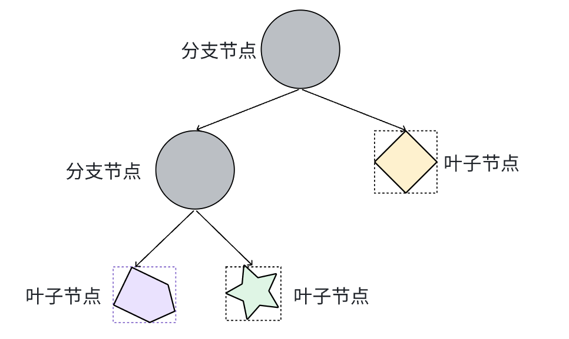

**在插入构建的方式下，规定一个包围体只能包围两个小的包围体**。因此，在本节对应的 BVH 中，节点类型只有两种[[1\]](https://zhuanlan.zhihu.com/p/697580373#ref_1)：

- 分支节点（Branch Node）：包围两个 AABB 的 AABB；
- 叶子节点 (Leaf Node) ：包围住实际物体的 AABB；

对于动态修改BVH树来说，常见的操作是【合并节点】与【分离节点】，以下分别介绍：

### （2）合并节点

一般的，合并节点的步骤是，已知一个【目标叶子节点A】和一个【要合并的叶子节点B】。可以理解成A是一个BVH树上已有的叶子节点，而B现在可能不在BVH树上，也可能在**其他分支的叶子节点**上，需要合并到A上。这时的做法如下：

- （a）复制节点A的内容，创建一个新的节点A'；
- （b）计算节点A'与节点B的并集AABB，作为节点A的AABB。由于节点A的AABB发生变化，需要向上传播更新这一条链上的AABB（如果有父级的话）。
- （c）最后，把 A' 与 B 作为A 的子节点。

最后构建出来的树如下图所示（其中节点A‘是从节点A复制出来的，节点A的AABB是节点A’与物体B的AABB的并集）：

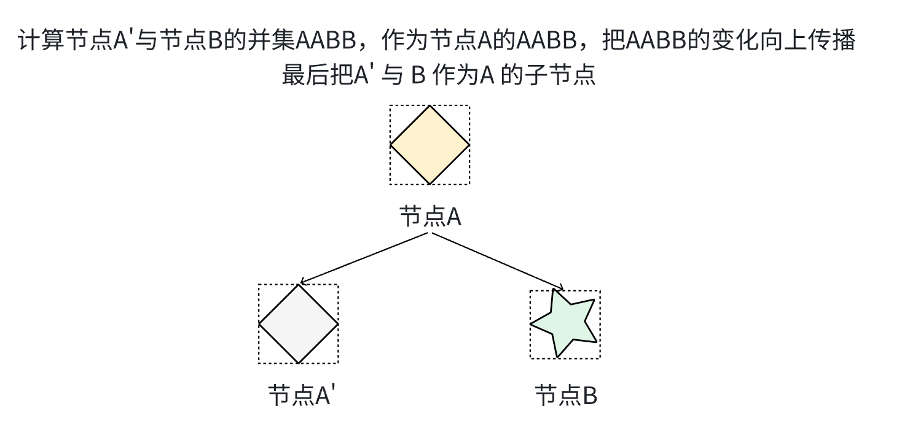

注意事项：

- 【目标叶子节点A】和一个【要合并的叶子节点B】**不能是分支节点**，此时插入节点之后，我们会发现原来A的父节点的所属并没有发生变化，只是A节点变成了一个新的”分支节点“，而原来A节点的内容被下放到叶子节点里面了。

趁热打铁，我们来为BVHNode类添加需要的函数：

```c#
#region 与动态BVH相关

public bool isLeaf => this.sceneObjects != null; //判断是否是叶子节点,如果是叶子节点，sceneObjects不为空

//复制一个节点
public BVHNode(BVHNode source)
{
    this.aabb = source.aabb;
    this.sceneObjects = source.sceneObjects;
    this.leftNode = source.leftNode;
    this.rightNode = source.rightNode;
    //注：这里没有复制parent，因为在动态BVH中，拷贝出来的节点的parent本来就要重新设置
    this.Name = source.Name + "_copy";
    this.spaceColor = new Color(Random.value, Random.value, Random.value, 0.9f);
}

//获取兄弟节点
public BVHNode GetSibling()
{
    return this.parent?.GetTheOtherNode(this);
}

private BVHNode GetTheOtherNode(BVHNode brother)
{
    if (this.leftNode == brother) return this.rightNode;
    if (this.rightNode == brother) return this.leftNode;
    return null;
}

//查找根节点
private BVHNode FindRoot()
{
    if (this.parent != null)
    {
        return parent.FindRoot();
    }
    return this;
}

//合并两个节点,sourcenode的内容会被合并到targetnode中
public static BVHNode Merge(BVHNode targetNode, BVHNode sourceNode)
{
    //step1:复制出一个targetNode，取名为copyNode
    BVHNode copyNode = new BVHNode(targetNode);
    //step2:合并source的AABB到targetNode, 并且更新整条树的链的AABB
    targetNode.UnionAABB(sourceNode.aabb);
    targetNode.AABBBroadCast();
    //step3：将targetNode作为copyNode和sourceNode的父节点
    targetNode.SetLeaf(copyNode, sourceNode);
    return copyNode; //返回原来的targetNode
}

private void AABBBroadCast()
{
    if (this.parent != null)
    {
        this.parent.UpdateAABB();
        this.parent.AABBBroadCast();
    }
}

public void UpdateAABB()
{
    this.aabb = AABB.Reset(); //重新计算AABB，左右节点的AABB求并
    if (leftNode != null)
    {
        UnionAABB(leftNode.aabb);
    }

    if (rightNode != null)
    {
        UnionAABB(rightNode.aabb);
    }
}

#endregion
```


### （3）分离节点

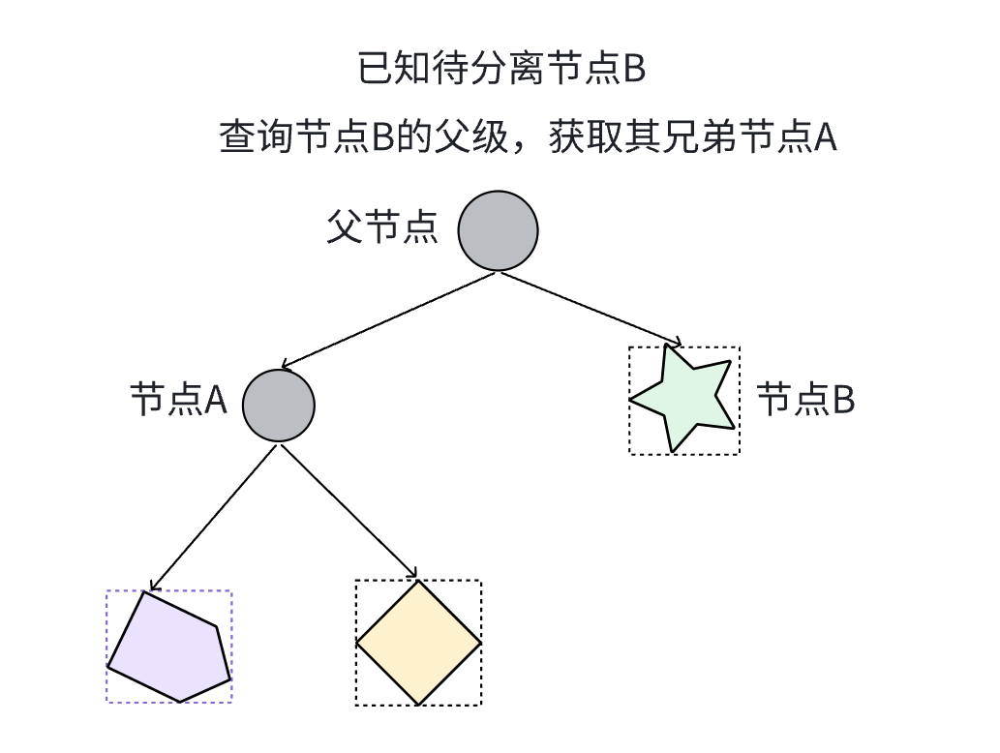

看上图，相当于我们要把节点B从这颗BVH树摘下来，此时的步骤如下：

- （a）获取到待分离的节点【B】的【父节点】以及【兄弟节点A】；
- （b）把【兄弟节点A】的必要信息复制到【父节点】里，包括AABB，场景物体信息，叶子节点信息等；
- （c）删除【节点A】和【节点B】，并且沿着树的链一直向上更新所有的AABB。

可以发现，上面的操作相当于把树减少了一层，并且我们把原来节点A的AABB和叶子节点信息复制到父节点中，即可保持父节点以上的连接关系不变。以上操作写成代码就是：

```c#
public static BVHNode Separate(BVHNode beSeperatedNode)
{
    //step1:找到父节点和兄弟节点
    BVHNode parent = beSeperatedNode.parent;
    if (parent != null && parent.Contains(beSeperatedNode))
    {
        BVHNode brother = beSeperatedNode.GetSibling();
        //step2:将brother的内容复制到parent中
        var brotherAABB = brother.aabb;
        parent.SetLeaf(brother.leftNode, brother.rightNode);
        parent.aabb = brotherAABB;
        parent.AABBBroadCast();
        parent.sceneObjects = brother.sceneObjects;

        //step3:删除beSeperatedNode和brother节点
        //应当会自己GC,毕竟没人引用了

        return parent;
    }
    Debug.LogError("Separate Error: beSeperatedNode is not a child of parent");
    return null;
}
```


### （4）动态BVH树

在第三节的一开始的约定部分，我们提到了此时每个叶子节点只会有一个物体，所以我们用Dictionary存储好所有叶子节点与物体的映射关系。前面我们写了一个BVHSpace类，这里我们写一个DynamicBVHSpace类。因为“合并”与“删除”会发生数据的转移，所以同一个游戏对象，在不同时刻，可能会对应不同的节点，需要我们更新维护好。

```c#
public class DynamicBVHSpace
{
    public BVHNode root { get; private set; }
    //维护一个当前bvh的所有叶子结点列表
    private List<BVHNode> leafs;
    private int generateCount = 0;

    //游戏对象与节点的映射
    public Dictionary<GameObject, BVHNode> gameObjectToNode;

    public DynamicBVHSpace()
    {
        leafs = new List<BVHNode>();
        gameObjectToNode = new Dictionary<GameObject, BVHNode>();
    }

    //更新、记录游戏对象与节点的映射关系
    private void RecordGameobject(BVHNode node)
    {
        var obj = (node.sceneObjects == null) ? null: node.sceneObjects[0]; //这种情况下只会有一个物体
        if (obj != null)
        {
            if (gameObjectToNode.ContainsKey(obj))
            {
                gameObjectToNode[obj] = node;
            }
            else
            {
                gameObjectToNode.Add(obj, node);
            }
        }
    }


    //添加一个节点
    public BVHNode AddNode(GameObject go)
    {
        BVHNode leaf = new BVHNode("leaf_" + generateCount.ToString(), new List<GameObject>(){go});
        RecordGameobject(leaf);
        BuildBVH(leaf);
        generateCount++;
        return leaf;
    }

    //删除一个节点,传入的是对应的obj
    public void RemoveNode(GameObject go)
    {
        if (gameObjectToNode.TryGetValue(go, out var node))
        {
            //step1:在leafs中移除目标节点及其兄弟节点
            leafs.Remove(node);
            leafs.Remove(node.GetSibling()); //如果兄弟节点不是叶子节点，那么不会影响
            //step2:分离节点
            BVHNode subTree = BVHNode.Separate(node); //分离后的子树根节点
            //step3:更新映射,移除后有可能返回的是叶子节点，也有可能不是叶子节点
            if (subTree!=null && subTree.isLeaf)
            {
                leafs.Add(subTree);
                RecordGameobject(subTree);
            }
        }
    }

    //构建bvh
    public void BuildBVH(BVHNode leaf)
    {
        if (root == null) //第一次构建
        {
            root = leaf;
            leafs.Add(leaf);
            return;
        }
        //step1:找到最佳叶子节点
        BVHNode bestLeaf = leafs[0]; //todo：假设第一个叶子节点是最佳叶子节点，但是这里只是一个简单构建，后面有空再优化
        //step2:合并节点
        BVHNode newNode = BVHNode.Merge(bestLeaf, leaf);
        //step3:更新叶子节点列表
        leafs.Add(leaf);
        leafs.Add(newNode); //添加了两个新的
        leafs.Remove(bestLeaf); //删除老的

        //step4：记录映射并更新根节点
        RecordGameobject(newNode);
        root = newNode.FindRoot(); //记得更新root
    }
}
```

此时就可以添加一个DynamicBVHTest.cs文件，将其修改为可以动态添加BVH树中的物体和删除BVH树中的物体：

```c#
public class DynamicBVHTest : MonoBehaviour
{
    private DynamicBVHSpace sahSpace;
    private List<GameObject> seneObjects;
    [Range(0, 10)]
    public int displayDepth;

    public GameObject removeObj;

    void Start()
    {
        seneObjects = new List<GameObject>();
        sahSpace = new DynamicBVHSpace();
    }

    private void Update()
    {
        if (Input.GetKeyDown(KeyCode.A)) //A添加物体
        {
            var go = GameObject.CreatePrimitive(PrimitiveType.Sphere);
            var randomPos = Random.insideUnitSphere * 10;
            go.transform.position = randomPos;
            sahSpace.AddNode(go);
            seneObjects.Add(go);
        }
        if (Input.GetKeyDown(KeyCode.S)) //S删除物体
        {
            if (removeObj != null)
            {
                sahSpace.RemoveNode(removeObj);
                Destroy(removeObj);
                seneObjects.Remove(removeObj);
            }
            else
            {
                //随机删除一个物体
                if (seneObjects.Count > 0)
                {
                    var index = Random.Range(0, seneObjects.Count);
                    var obj = seneObjects[index];
                    sahSpace.RemoveNode(obj);
                    seneObjects.RemoveAt(index);
                    Destroy(obj);
                }
            }
        }
    }

    private void OnDrawGizmos()
    {
        sahSpace?.root?.DrawTargetDepth(displayDepth);
    }
}
```

挂载到场景里面，然后可以按下A键和S键测试效果。截图如下：

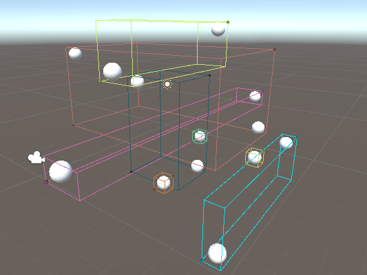

可以看到，虽然我们可以动态添加节点进BVH树，但是构建的AABB还是会有一些相交的现象，构建地并不是很好，这是因为每次我们都是选择leaf[0]作为被插入的节点，这其实是不准确的。接下来我们就会介绍SAH算法，用来做出”最佳的选择“。


### （5）SAH算法

以下内容参考自GDC2019的一篇报告：

[6]https://box2d.org/files/ErinCatto_DynamicBVH_GDC2019.pdf

这篇报告的前面部分也值得看一下，基本就是和前面的BVH内容相关。

在”动态BVH树“的部分有一个BuildBVH函数，这里有这样一句：
```c#
//step1:找到最佳叶子节点
BVHNode bestLeaf = leafs[0]; //todo：假设第一个叶子节点是最佳叶子节点
```

仔细想想，这其实没道理，如果只是基于这种条件来动态为BVH树添加节点，那么很可能会构建出上图那种比较丑的BVH划分。那么，bestLeaf应该是基于什么算法来选择的呢？

> 这里我们使用来自【Box2D】的`Dynamic Bounding Volume Hierarchy`中的SAH算法[[2\]](https://zhuanlan.zhihu.com/p/697580373#ref_2) ，但实现上会有所精简。

先来看看SAH算法的介绍（上述pdf的第32页）：

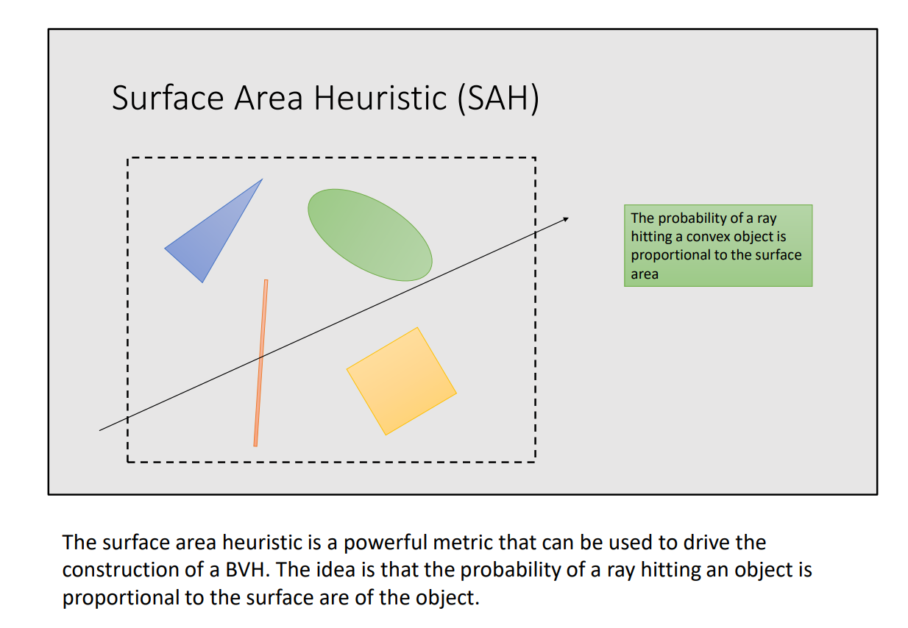

SAH算法做了一个启发式的假设：即光线击中AABB的概率与表面积有关，AABB的表面积越大，被光线击中的概率就越大。

如何计算AABB的表面积呢？在Box2D中作者给出了这样的公式（其实很好理解，就是长方体的表面积）：

```c++
float Area(AABB A)
{
    Vec3 d = A.upperBound - A.lowerBound;
    return 2.0f * (d.x * d.y + d.y * d.z + d.z * d.x);
}
```

我们将计算AABB:A的表面积的运算定义为$SA(A)$，后面会用到。此时我们就可以计算一棵树的cost，cost被认为是所有中间节点的AABB的表面积之和。之所以只有中间节点的AABB会被计算，而不需要计算叶子节点，是因为对于不同的BVH树构建方法来说，往往叶子节点的AABB总和是一样的（显然，每个叶子节点包含场景里的一个物体，场景里有多少物体，叶子节点的AABB表面积总和就是所有物体AABB的表面积总和）。

因此，一棵树的cost可以认为是：
$$
C(T) = \sum_{i \in InnerNodes} SA(i)
$$
写成代码就是：

```c++
float ComputeCost(Tree tree)
{
    float cost = 0.0f;
    for(int i=0;i<tree.nodeCount;i++)
    {
        if(tree.nodes[i].isLeaf==false)
        {
            cost += Area(tree.nodes[i].box);
        }
    }
    return cost;
}
```

此时我们就可以计算出插入一个节点所带来的代价了。当我们选择目标节点时，判断依据就是哪一个节点的插入会有“最小表面积”的变化。其中：

**【变化表面积】=【新增的分支节点的表面积】+【插入后所有祖先节点的表面积差】**。看下图：

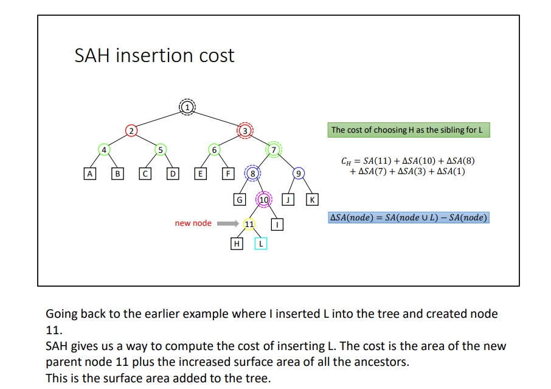

实际上，我们可以搜索被插入的节点是比较费的，比如对于上图来说，中间节点①~10，以及叶子节点A到L都是可以被插入的节点，总共要搜索2n-1次（n个叶子节点，n-1个中间节点）。在考虑优化之前，我们不妨先实现一下目前的内容，看看效果。

> 注：在下面的实现中，**为了方便一点，只会考虑计算添加到哪个叶子节点上，也就是只会遍历所有的叶子节点。如果后面要进阶的话再来补充。**

首先，在AABB类中，增加对于表面积的计算：

```c#
public float surfaceArea => (Size.x * Size.y + Size.x * Size.z + Size.y * Size.z) * 2.0f;
```

于是BVHNode中也加入一个表面积的计算：

```c#
public float surfaceArea => aabb.surfaceArea;
```

在DynamicBVHSpace中，新增SAH方法，并修改BuildBVH函数：

```c#
private BVHNode findBestLeaf(BVHNode node)
{
    BVHNode bestLeaf = null;
    float minCost = float.MaxValue;
    foreach (var leaf in leafs)
    {
        var leafAABB = new AABB(leaf.aabb); //复制一个AABB,避免修改原来的AABB,这就是C#引用传递的福报
        var newBranchAABB = AABB.Union(leafAABB, node.aabb);
        //新增的分支节点表面积,新引入的
        float deltaCost = newBranchAABB.surfaceArea;
        float wholeCost = deltaCost;
        var parent = leaf.parent;

        //统计所有祖先节点的表面积差
        while (parent != null)
        {
            var s2 = parent.surfaceArea;
            var unionAABB = AABB.Union(parent.aabb, node.aabb);
            var s3 = unionAABB.surfaceArea;
            deltaCost = s3 - s2;  //对于父节点链上的节点的AABB的影响
            wholeCost += deltaCost;
            parent = parent.parent;
        }

        //返回最小的目标
        if (wholeCost < minCost)
        {
            bestLeaf = leaf;
            minCost = wholeCost;
        }
    }
    return bestLeaf;
}

public void BuildBVH(BVHNode leaf)
{
    //...
    //step1:找到最佳叶子节点
    BVHNode bestLeaf = findBestLeaf(leaf);
    if (bestLeaf == null)
    {
        Debug.LogWarning("SAH Can't find best leaf, default to use leaf0");
        bestLeaf = leafs[0];
    }
    //step2:合并节点
    //...
}
```

此时再次运行程序，添加一些个节点，查看BVH树的创建结果（depth=2）：

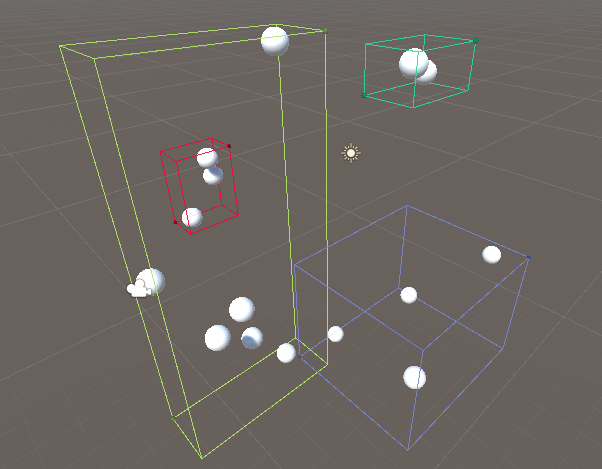

下面则是depth=3的结果：

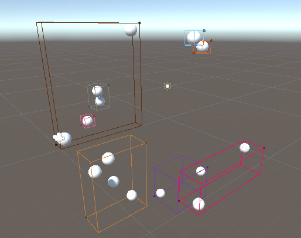

可以看到，使用了SAH的启发式算法之后，BVH树的构建更准确了一些。

> todo:尚未补充的内容，后面有时间补充一下：
>
> - （1）在做SAH的时候，比较费，需要遍历所有的叶子节点，计算cost的时候还要递归遍历父节点，这种性能开销不太能接受，后面看看能否优化，参考pdf文件；


### （6）移动物体的处理

当物体移动更新位置后，我们应该如何更新BVH树呢？有如下几种策略：

- （a）不改变BVH的结构，重新沿着父节点向上更新所有的AABB；
  - 这种方法可能会导致后面AABB的效率很低；
- （b）重新创建子树；
  - 这种做法很expensive（类似于GC，这一点在参考连接p57页，后面求证一下）；
- （c）很简单，先删除物体所对应的叶子节点，再把物体加入到BVH的新的位置；
  - 依旧比较费，但相比（b）方案应该会好一些。因此Box2D选择了（c）方法作为对于移动物体的处理方法。

在Box2D当中，认为每一帧物体的移动是一个很小的范围，可以用宽松的AABB来包裹物体（这一点类似于松散八叉树）。这样，当且仅当物体的移动超出节点的宽松AABB时，才发生BVH的重建。

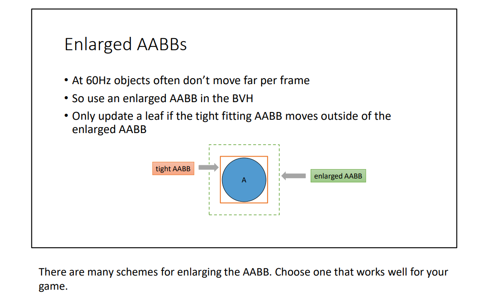

在下面的代码实现中，由于我们是做一个通用的BVH，这里就先不做松散处理了，后面有时间再完成对应的部分。

代码修改如下：修改`RemoveNode`方法，令其返回一个布尔值，来判断是否成功删除节点。然后新增UpdateNode函数，逻辑是先删除节点，再添加节点。根据前面的学习，删除节点和添加节点的逻辑都是写好了的。此时UpdateNode函数如下（**注意，为了简单起见，没有做松散AABB的处理**）：

```c#
public void UpdateNode(GameObject go)
{
    if (RemoveNode(go))
    {
        AddNode(go);
    }
}
```

此时在Test类里，新增Update函数中的逻辑，每tick更新BVH树（理论上，我们会在物体超出宽松AABB范围后才更新BVH树，这里为了方便就每tick更新了）：

```c#
if(removeObj != null) //用removeObj来表示要移动的物体
{
    sahSpace.UpdateNode(removeObj);
}
```

此时效果如下：

<video src="./assets/BVHDemo2.mp4"></video>

剩下的补充内容后面有空再做补充，比如一种退化情况：当顺序插入时会让BVH树退化成一个链表，我们需要使用一些方法平衡这个二叉树。常用手段就是“树的旋转”。


### （7）Branch and Bound 算法

在前面介绍的SAH方法中，每次插入节点时都要找到最佳的叶子节点，需要遍历所有的叶子节点和中间节点，并且涉及到递归的操作，非常费。在Box2D中，提出了一种优化的算法：**Branch and Bound Algorithm**，能够让全局搜索的速度加快。Branch and Bound算法的主要思想在于：

- （a）递归地搜索BVH树；
- （b）跳过那些“不会更好”的子树；

具体实现上，可以使用优先队列来做（思考：在Dijkstra算法中，我们也可以使用优先队列，思想是类似的），一开始我们先把节点1放入到优先队列中。假设现在遍历到了下图⑦的中间节点：

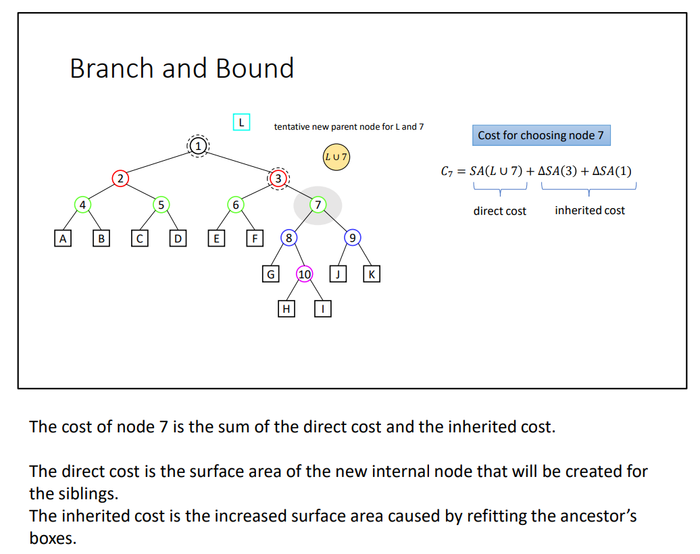

如果$C_7$比当前的$C_{best}$要更低的话，就更新$C_{best}$的值为$C_7$。接下来的问题是，我们有必要遍历⑦的子树么？可以发现，⑦的两个子节点的cost的下界是：
$$
C_{low}=SA(L)+\Delta SA(7) + \Delta SA(3) + \Delta SA(1)
$$
其中，$SA(L)$是新引入的节点$L$的AABB的表面积，其他的$\Delta$项则表示对应节点的AABB表面积变化量。如果计算出的下界$C_{low}$要小于$C_{best}$，那么就有必要把⑦的叶子节点⑧和⑨加入到优先队列当中；否则的话就可以进行剪枝操作，⑦分支的子树不需要被考虑进来。再回顾一下$\Delta$的计算公式：
$$
∆𝑆𝐴 (𝑛𝑜𝑑𝑒) = 𝑆𝐴 (𝑛𝑜𝑑𝑒 ∪ 𝐿) − 𝑆𝐴(𝑛𝑜𝑑𝑒)
$$
说白了，之前不优化前我们很可能是一个一个节点去遍历，找到最小的cost，而优化之后我们一开始会把根节点①放入到优先队列中，然后看看是否要更新$C_{best}$，接着每次从优先队列中pop一个节点出来，看其子节点的下限$C_{low}$是否比当前的$C_{best}$更小。如果更小的话，子节点就是值得考虑的节点，可以放入到优先队列当中；否则可以直接剪枝掉。

> 后面有时间的话，在Demo当中实现一下这个Branch and Bound算法。


### （8）树的退化情况

假设我们有一排场景物体，他们已经排好序，会逐个加入BVH的创建。在实际应用场景中，我们无法阻止这样的输入序列。假设输入序列是排好序的ABCDEF，此时这颗树大概会变成下图所示：

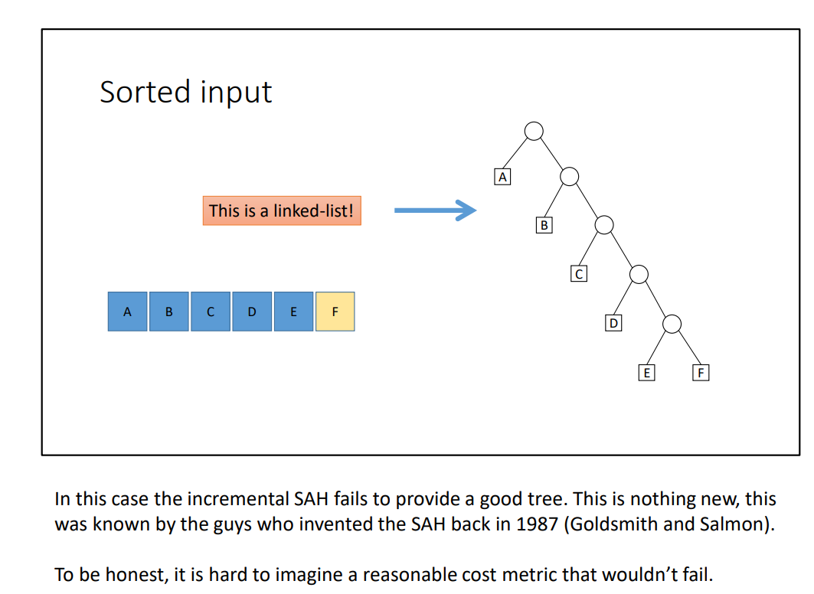

这种情况下，SAH算法会给我们带来不理想的结果。这种其实并非个例，比如以下的游戏场景（我的理解是下图的树本来就是从左往右种植的，很有可能会被顺序加入到BVH的构建当中）：

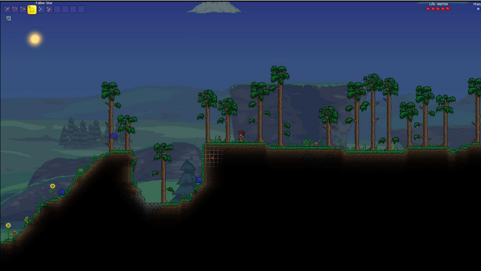

**此时可以想到一种数据结构课上学到的解决方案：平衡二叉树（AVL tree）。**这里涉及到一些树的旋转问题。具体可以看原参考链接的p73页开始：

https://box2d.org/files/ErinCatto_DynamicBVH_GDC2019.pdf。


## 4.整个场景

跟八叉树差不多，测试BVH只需要一个空物体上挂载两个脚本即可：

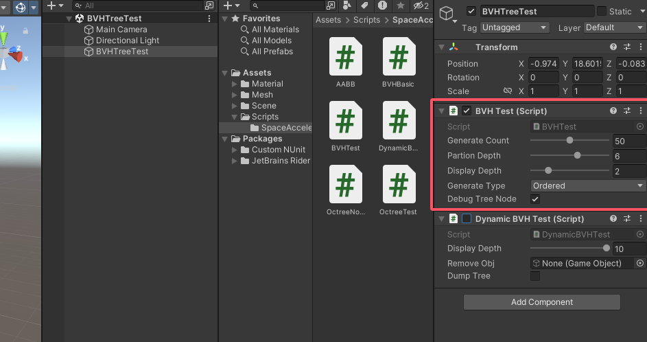

其中，红框的脚本是静态构建、自顶向下的BVH树，而未被框起的脚本则对应动态的BVH树，支持增加物体、减少物体和更新移动物体的功能，以及将BVH树的结构dump到文件中的功能。相关代码都在这篇文档的同级目录下。


参考：

[1]https://www.zhihu.com/question/48905832/answer/2664911942

[2]https://www.gameres.com/665565.html

[3]https://zhuanlan.zhihu.com/p/697130257

[4]https://pbr-book.org/4ed/Primitives_and_Intersection_Acceleration/Aggregates

[5]https://zhuanlan.zhihu.com/p/697580373

[6]https://box2d.org/files/ErinCatto_DynamicBVH_GDC2019.pdf