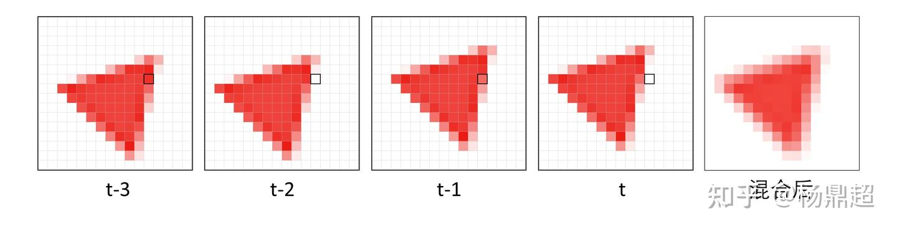
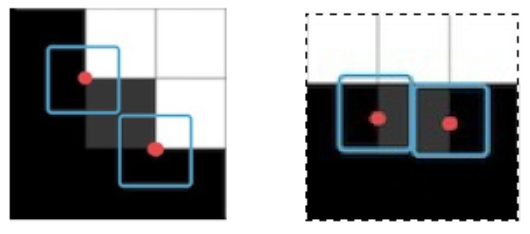
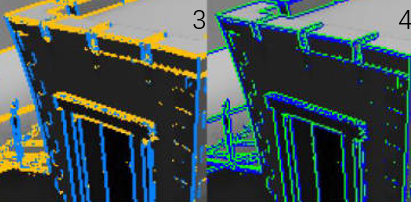

# Lesson 19——反走样技术

​	在之前的课程中，我们介绍了如何将一个物体渲染到2D的屏幕上。如果读者直接使用当前版本的渲染器进行渲染的话，可能会发现一个问题，那就是最终呈现在屏幕上的图形出现了”锯齿“现象，类似于下图的情况：


​	不难发现这种锯齿产生的原因是因为一个像素块被着色为一个单独的颜色，同时像这种边界会显得很“硬”，造成了锯齿。那么是否有什么办法可以让这种锯齿不那么明显，或者是消除锯齿呢？这就是本节要介绍的核心内容，即图形学中传统的抗锯齿技术，以及工业界对此的应用和扩展出的技术。

> 抗锯齿（也叫做反走样）是一种处理技术，通过对图像中的颜色和亮度进行平滑处理，从而使得边缘看起来更加平滑、自然，减少视觉上的锯齿效果。它通过对像素颜色进行插值或混合，以达到更高的视觉质量。

​	在本节中，我们会**先用容易理解的方式更深层地介绍一下抗锯齿的基本思路，然后依次介绍主流的抗锯齿技术。**由于抗锯齿涉及到很多的工业界实现细节，因此本节在渲染器中将只包含SSAA和简易MSAA的基本实现，更多的抗锯齿技术将不会在这个MiniRenderer中被应用，感兴趣的读者可以自行尝试实现。


# 一、探究锯齿产生的原因

​	在生活中，”采样“现象是经常发生的。例如我们使用录音设备录制声音的时候，就是在对连续的声音进行采样。由于计算机的逻辑限制，这种采样只能是**离散的**。一个常用的方法是采样(sampling)再重建(Reconstruction)。

​	例如下图采样声音的时候，第一行中设备会将连续的声波转换成磁带内的电压值，第二行中设备会将采样到的离散数据转换回声波输出播放器。


​	图源：[1] Fundamentals-of-Computer-Graphics-Fourth-Edition（虎书）

对于录音设备来说，其质量的好坏，有时和一个指标具有很大的关系——采样率。音频采样率是指**录音设备在一秒钟内对声音信号的采样次数**，采样频率越高声音的还原就越真实越自然。不妨对其进行分析，注意下图，上一半的图像代表了原始的波形函数，而下一半的图则表示用不同的采样率采样得到的波形图像。实线是使用较高的采样率进行采样，而虚线则是使用较低的采样率。从图中结果可以很好地观察到，低采样率还原出来的波形函数与”标准答案“是存在较大差异的，此时就会出现”走样“的现象。

> 低采样率会造成很多视觉上的问题，例如：
>
> - 锯齿
> - 摩尔纹
> - 车轮效应
>
> 这里不过多展开，感兴趣的读者可以查找额外的资料进行学习。


图源：[1] Fundamentals-of-Computer-Graphics-Fourth-Edition（虎书）

​	为了解决这种采样带来的走样问题，我们就可以提高采样率，对某个像素进行多次采样，在对结果取平均，以实现抗锯齿/反走样的效果。

> **更深入一点的探讨**
>
> 我们可以把图像看作是由不同频率的“波”组合而成的。高频部分通常代表图像中的细节和快速变化的区域（如边缘），而低频部分则代表较为平滑的区域（如天空或墙壁）。当我们看到锯齿状边缘时，其实就是在说高频信号过于强烈，而低频信号不足。也就是说，图像中有很多细小的颜色变化，但这些变化没有被良好地处理，导致了视觉上的不连贯感。
>
> 之前所说的抗锯齿本质上是”图像滤波“操作（**如果没有学过图像处理，对频域等内容不了解的读者可以选择性阅读这段，不会影响整体理解**），先对图像进行一个模糊（滤波）操作，然后再进行采样。
>
> - **注意不能先采样再做模糊，可以用频域来解释。**模糊（卷积）操作本质上是低通滤波，将图像中的高频信号过滤掉，这样剩下的就是低频信号了。空域中的采样本质上可以理解为重复频域上的频谱内容，而空域上的乘积等于频域上的卷积（反过来也是同理）。
>
> ==todo：这里补充一下Games101笔记中记录的频谱相关内容。==


# 二、实现抗锯齿的基本思路

​	依据前面的知识讲解，抗锯齿目前有两种比较主流的思路，各有搭配的较为成熟的方案，在这部分中我们先大致介绍一下，具体的细节见下一部分：

- （1）对于每个像素进行多次采样，并根据对此采样的结果来综合决定该像素的颜色。
  - 如果是直接暴力地将图像按照×N倍的分辨率进行渲染，然后将图像整体缩小，例如将A×B的图像放大四倍进行渲染，然后每4个像素的颜色取平均，最终得到A×B的图像，这种方式就是SSAA（**Super Sampling Anti-Aliasing**），将图形首先渲染到一张比较大的贴图上，再将其缩小。**SSAA算法的思想非常直观，但是带来的性能开销往往是不可忍受的，因此现在几乎不使用这种算法了。**
  - MSAA（**Multisampling Antialiasing**）：MSAA与SSAA的相同之处在于，他们都会设置”次像素点“，与SSAA的不同之处在于，MSAA记录了次像素的”覆盖情况“，从而在性能上做到了优化。具体的细节我们将在第三部分进行叙述。
  - 我们可以在空间上对某个像素多次采样，那么能否在时间上对某个像素连续多帧的颜色进行采样呢？答案也是可以的，这就是TAA反走样算法的基本思路。
- （2）使用”图像后处理“的方式，相当于拿到了渲染到屏幕的初始图像，然后对这张图进行额外的处理。这里有几种常见的抗锯齿算法：
  - 很多时候，锯齿产生的地方往往来自边缘（比如前景和背景交界的地方），因此可以通过算法检测图像中的那些”边缘“，并对这些边缘进行抗锯齿处理，这种思路就是FXAA以及SMAA两种算法的思路。

注：玩游戏的读者可能会经常听到**DLSS**这种算法，这里需要说明一下，DLSS是使用人工智能的方法做的**深度学习超级采样**（Deep Learning Super Sampling），其想要实现的效果与抗锯齿有共同之处，但本质是有较大差别的，DLSS这种技术利用深度学习将较低分辨率的图像缩放为更高分辨率的图像，以便在更高分辨率的计算机上显示，而反走样算法更多依赖于对现有像素的颜色处理和插值，而不是从低分辨率图像生成新图像。因此在本节中我们不会提到DLSS的技术细节，而是继续把目光聚焦于主流的”反走样“技术。


# 三、主流抗锯齿方法

## 1.基于多次采样的方法

### （1）SSAA

前面提到，SSAA（Super Sampling Anti-Aliasing，超采样抗锯齿）将图像按照×N倍的分辨率进行渲染（如 x2、x4），即超采样。然后再通过平均像素值，将高分辨率图像缩小到目标分辨率。

如下图所示，左边的像素点只有一个采样点，且未被覆盖，因此得到白色。右边的像素点上放置了四个次像素点，有两个次像素点被覆盖，因此得到的颜色是粉色的。


​															SSAA的原理 图源https://zhuanlan.zhihu.com/p/415087003

### （2）MSAA

> 后面优化一下其中的内容，基本上讲解这篇中包含的内容就够了：https://zhuanlan.zhihu.com/p/415087003

​	MSAA（Multisample Anti-Aliasing，多重采样抗锯齿）是最早被应用的抗锯齿技术，主要依靠硬件来实现，曾经是一种非常流行的抗锯齿方法。在过去，当游戏画面的质量较低时，其额外的性能消耗并不显著。然而，随着游戏画面质量的提升，以及每帧需要渲染的物体数量增加，MSAA所需的额外性能开销也变得越来越高。


图源DX11的光栅化说明文档

> 对于每个次像素点(上图中黑色点位置)，会先进行 **coverage test/覆盖测试**，覆盖测试即测试该次像素点是否在三角形内部，如果在三角形内部，说明需要采样(计算 pixel shader)。出于性能考虑，同一个像素上的多个次像素点，不会每个都进行一次像素着色计算，而是共享像素中心点的像素计算结果。对于每个像素点，如果上面对应的次像素点至少有一个次像素点通过了覆盖测试(上图中圆圈位置)，就会进行**一次**采样，计算的插值采样位置是像素的中心位置(上面图中的菱形块)。一次采样的结果，会用于多个次像素采样点中。
>
> 计算完成后，每个通过覆盖测试的次像素点还需要进行 **depth-stencil test/深度-模板测试**，这个测试和普通的单个像素的深度-模板测试是一样的，只是现在发生在次像素点而已。当深度-模板测试通过后，在像素中心位置采样的结果值就会写入到对应的次像素点。
>
> 在这里，我们实际采样的位置，全都是像素的中心点位置。有的时候，三角形可能没有覆盖到像素的中心位置，这时候如果再使用像素中心点采样，就可能得到错误的渲染效果。GPU 硬件会使用 **centroid sampling** 来调整采样点的位置，当像素中心点被覆盖时，是正常的像素中心点的采样，而当像素中心点未被三角形覆盖时，GPU就会挑选最近的通过覆盖测试的次像素点，作为采样点。
>
> 
>
> 上图中，中间一个图表示有一个像素，会被两个物件覆盖。其中红色的物件会覆盖3个采样位置，蓝色的会覆盖一个。PS的求值位置显示为绿色。由于红色三角形覆盖像素的中心，因此该位置用于着色器求值。蓝色对象的PS在采样位置1的地方进行PS求值。对于MSAA，所有四个位置存储单独的颜色和深度。右侧显示EQAA的2f4x模式。其中4个采样点有4个ID数，对应了包含2个颜色和深度信息的表格。**针对2f4x的EQAA，会有一个2倍大小的buffer和一个两位的标记位对照表，当绘制蓝色三角形的时候，会把采样点1位置的PS计算后的结果，保存在表格中A位置，然后给采样点1的标记位设置为A。然后绘制红色三角形的时候，会把像素中心点位置的PS计算后的结果，保存在表格B位置，然后给采样点0、2、3的标记位设置为B。 如果该像素只被2个或者2个以内的可见不透明物件覆盖，就像本例中一样，则两者的结果完全一样。且EQAA更省内存。否则，MSAA的效果会更好。**
>
> 还有一些额外的细节，可以参考这篇文章：http://geekfaner.com/shineengine/Translation5_RealTime_Rendering_4th_Edition1.html的后半部分。或者是这篇文章：https://zhuanlan.zhihu.com/p/415087003

​	可以参考DirectX的官方文档：https://learn.microsoft.com/zh-tw/windows/uwp/graphics-concepts/rasterization-rules

MSAA就不看代码了，现在硬件直接支持了，不需要再写代码了。

> 注：**这里可以补充问题及答案：为什么延迟渲染不支持MSAA？**不过延迟渲染还没有讲，因此先不说了，自己知道就行。

【后面要将反走样放到延迟渲染后】

### （3）TAA

基本上参考这一篇：https://zhuanlan.zhihu.com/p/425233743

接下来我们通过核心的代码来介绍TAA算法的细节，这里用Unity作为开发环境（使用Unity是因为游戏引擎帮我们做好了很多底层的问题，比如渲染管线，我们可以聚焦于shader的编写，也就是算法的实现。如果读者没有安装Unity的话可以直接阅读代码以更好地掌握算法，如果有安装Unity 2020及以上的版本应该可以结合Github的程序来看）。这里参考的代码链接为：https://github.com/Raphael2048/AntiAliasing


#### 静态场景

TAA**(Temporal Anti-Aliasing)** 会随着时间在像素中多次采样，(SSAA是每帧都多次采样，但是TAA将这个采样过程分摊到多帧)，再与历史帧进行混合。


图片来源：知乎 @ 杨鼎超

##### **采样点偏移 (Jittering Samples)**

一般的采样点分布可能是均匀的：


图源虚幻 https://de45xmedrsdbp.cloudfront.net/Resources/files/TemporalAA_small-59732822.pdf

但是这种均匀分布有时并不好，所以需要一种 Low-discrepancy （低差异化）的点序列，如 Halton 或者 Sobol 分布。

虚幻引擎 里面就使用了八个点的 Halton(2,3) 分布来作为采样点：


图源虚幻 https://de45xmedrsdbp.cloudfront.net/Resources/files/TemporalAA_small-59732822.pdf


而对采样点进行偏移的一个常用方法是：**对投影矩阵添加小的偏移量。**如在 虚幻引擎 里面：
$$
ProjMatrix[2][0] += ( SampleX * 2.0f – 1.0f ) / ViewRect.Width(); \\
ProjMatrix[2][1] += ( SampleY * 2.0f – 1.0f ) / ViewRect.Height();
$$
图源虚幻引擎 https://de45xmedrsdbp.cloudfront.net/Resources/files/TemporalAA_small-59732822.pdf


只需要将偏移的XY分量分别写入到投影矩阵的[2, 0] 和 [2, 1]即可。这样，当左边的向量值乘以新的投影矩阵时，最终得到裁剪空间的坐标也会相应偏移。


>我们之前讲的投影矩阵
>
>上面那个应该是把这个翻转了 取逆
>
>因为我们应该是左乘向量，然后向量竖着放
>$$
>M 
>=
>
>\begin{bmatrix} 
> \frac{n}{r} & 0 & 0 & 0 \\
> 0 & \frac{n}{t} & 0 & 0 \\
> 0 & 0 & -\frac{n+f}{ f-n} & -\frac{2nf}{f-n} \\ 
> 0 & 0 & -1 & 0 \\
>\end{bmatrix}
>=
>
>\begin{bmatrix} 
> \frac{n}{  tan(\frac{\theta}{2})\cdot aspect\cdot n} & 0 & 0 & 0 \\
> 0 & \frac{n}{ tan(\frac{\theta}{2})\cdot n} & 0 & 0 \\
> 0 & 0 & -\frac{n+f}{ f-n} & -\frac{2nf}{f-n} \\ 
> 0 & 0 & -1 & 0 \\
>\end{bmatrix}
>
>=
>
>\begin{bmatrix} 
> \frac{1}{  tan(\frac{\theta}{2})\cdot aspect} & 0 & 0 & 0 \\
> 0 & \frac{1}{ tan(\frac{\theta}{2})} & 0 & 0 \\
> 0 & 0 & -\frac{n+f}{ f-n} & -\frac{2nf}{f-n} \\ 
> 0 & 0 & -1 & 0 \\
>\end{bmatrix}
>$$
>
>
>


当场景静止时，因为每一帧的投影矩阵都被微小偏移，所以我们可以直接混合某一点前几帧的值来实现抗锯齿。



图片来源：知乎 @ 杨鼎超

但场景通常都是运动的，涉及到物体自身的运动和摄像机的运动，所以我们需要知道物体上的一点对应于上一帧的哪个位置。使用的方法就是重投影


###### 重投影

首先要考虑的是镜头的移动，镜头移动后，原来投射到某个像素上的物体，现在很可能不在原来的位置上了。

假设物体是不动的，我们就可以使用当前帧的信息，反算出屏幕像素点$p^t$点A的世界坐标。

然后我们使用上一帧的投影矩阵，就可以再做一次 **重投影（Reprojection）**，计算出上一帧的点A在上一帧相机屏幕上的像素点$p^{t-1}$。


然后我们就可以拿着上一帧它的颜色和这一帧的颜色做叠加了。

但是，如上图所示，有的点实际上会从上一帧没有出现，而这一帧突然出现，那我们就无法拿到时间维度上这个点之前的颜色。

不过重投影只能适用于静态的物体，如果物体是移动的，我们就无法精确还原物体上一帧的投影位置了。

#### 动态场景

用 **Motion Vector** 贴图来记录物体在屏幕空间中的变化距离，表示当前帧和上一帧中，物体在屏幕空间位置的变化值。

在渲染物体时，我们需要用到上一帧的投影矩阵和上一帧该物体的位置信息，这样可以得到上一帧物体的位置，进而计算当前帧和上一帧的位置差，并写入到 Motion Vector。Motion Vector 可以作为延迟渲染的 GBuffer 的一部分，除了用了实现 TAA，还可以实现移动模糊/Motion Blur 等效果。

 Motion Vector贴图大概如下图：


图源https://youtu.be/0j4R6F6FCiA?si=sPn0vM8s5HXbsWBT

###### 使用 Motion Vector

接下来就是使用 Motion Vector 进行混合计算了，我们需要使用 Motion Vector 算出上一帧物体在屏幕空间中投射的坐标。在计算之前，我们先要移除当前像素采样的抖动偏移值，然后减去采样 Motion Vector 得到的 Motion 值，就可以算出上一帧中投影坐标的位置。然后就可以根据位置对历史数据进行采样了，因为我们得到的坐标往往不是正好在像素中心位置，因此这里使用双线性模式进行采样。

```c
// 减去抖动坐标值，得到当前实际的像素中心UV值
uv -= _Jitter;
// 减去Motion值，算出上帧的投影坐标
float2 uvLast = uv - motionVectorBuffer.Sample(point, uv);
//使用双线性模式采样
float3 historyColor = historyBuffer.Sample(linear, uvLast);
```

当镜头的移动时，可能会导致物体的遮挡关系发生变化，比如一个远处的物体原来被前面的物体遮挡住，现在因为镜头移动而忽然出现，这时采样 Motion 偏移得到的位置，上帧中其实是没有渲染的数据的。因此为了得到更加平滑的数据，可以在当前像素点周围判断深度，取距离镜头最近的点位置，来采样 Motion Vector 的值，这样可以减弱遮挡错误的影响。


## 2.基于图像后处理的方法

有一种反走样是**基于图像的**，先渲染出有锯齿的图然后通过图像处理的方法将锯齿给提取出来并替换成没有锯齿的图，这种方法叫image based anti-aliasing solution.

### （1）FXAA

https://zhuanlan.zhihu.com/p/431384101

​	FXAA(**F**ast Appro**x**imate **A**nti-**A**liasing)可以理解为是基于屏幕后处理实现的，在Unity的Built-in管线中`OnRenderImage`函数作为程序入口，会将原始渲染图像的RenderTarget传入shader，经过shader后处理后呈现在屏幕上，因此下面的代码主要是依据shader来介绍的。NVIDIA为FXAA提供了两个版本，Quality和Console，可以用一个Enum字段传入shader：

```glsl
public enum FXAAMode
{
    Quality = 0,
    Console = 1,
};
```

​	以下分别介绍Quality和Console版本，并结合代码来看。Quality版本质量更高，而Console版本速度更快。


FXAA的大致流程如上图，左边是输入的被处理的图像，中间是通过FXAA算法确认的边界，右侧则是将边界两侧像素混合后得到的抗锯齿效果。**FXAA(fast approximate antialiasing)** 是一种比较注重性能的形变抗锯齿方式，只需要一次 Pass 就能得到结果，FXAA 注重快速的视觉抗锯齿效果，而非追求完美的真实抗锯齿效果。

####  （b）Console

Console 版本寻找当前像素点亮度变化的梯度值，作为锯齿线的法线方向。

采样的位置是下图所示的点，分别得到中间点M和角上四个点NW、NE、SW、SE的颜色值，注意这里的偏移是只有半个像素的，而不是Quality 版本 的一个像素。


图源https://www.iryoku.com/aacourse/downloads/09-FXAA-3.11-in-15-Slides.pdf

FXAA Console 中，只需要进行五次采样。

计算以下这五个点的对比度差距，如果差距大于阈值，就进行反走样。


图源https://www.iryoku.com/aacourse/downloads/09-FXAA-3.11-in-15-Slides.pdf


图源https://www.iryoku.com/aacourse/downloads/09-FXAA-3.11-in-15-Slides.pdf

上图中左图亮度对比度较大，右图对比度较小，对比度较小，就不进行反走样。

图源https://www.iryoku.com/aacourse/downloads/09-FXAA-3.11-in-15-Slides.pdf

然后来计算当前亮度变化的梯度值，即亮度变化最快的方向，就是锯齿边界的法线方向。得到法线方向后，就可以进一步得到切线方向。


红色箭头是亮度变化最快的方向(梯度值方向)， 绿色箭头是我们要求的切线方向

然后我们沿着**切线方向**在其左右采样两次，例如上图（或者下图）中黑色点，然后平均，作为抗锯齿的结果。

而这样抗锯齿的结果，对于斜向的抗锯齿（下图）效果比较好


但是对于横向的抗锯齿，效果就比较一般




图源https://zhuanlan.zhihu.com/p/431384101

#### （a）Quality

**1.对比度计算**


采样上图的五个点（M是像素中心），计算当前处理的像素点和周围像素点的亮度对比值，FXAA 通过确定水平和垂直方向上像素点的亮度差，来计算对比值。

当对比度值较大时，我们认为需要进行抗锯齿处理。求亮度可以使用常用的求亮度公式 L = 0.213 * R + 0.715 * G + 0.072 * B，也可以直接使用G分量的颜色值作为亮度值，因为绿色对整体亮度的贡献是最大的。

亮度值也可以在上一个 Pass中处理时，写入到 alpha 通道中，这样可以省去计算每个采样点的亮度的过程，还可以直接使用 Gather4 函数来加速采样的过程。对比度计算的逻辑是这样的（片元着色器）：

```glsl
float4 FXAAQualityFragement(Interpolators interpolators) : SV_Target
{
    float2 UV = interpolators.uv;
    float2 TexelSize = _MainTex_TexelSize.xy;
    float4 Origin = tex2D(_MainTex, UV);
    float M  = Luminance(Origin);
    float E  = Luminance(tex2D(_MainTex, UV + float2( TexelSize.x,            0)));
    float N  = Luminance(tex2D(_MainTex, UV + float2(           0,  TexelSize.y)));
    float W  = Luminance(tex2D(_MainTex, UV + float2(-TexelSize.x,            0)));
    float S  = Luminance(tex2D(_MainTex, UV + float2(           0, -TexelSize.y)));

    //计算出对比度的值
    float MaxLuma = max(max(max(N, E), max(W, S)), M);
    float MinLuma = min(min(min(N, E), min(W, S)), M);
    float Contrast =  MaxLuma - MinLuma;

    //如果对比度值很小，认为不需要进行抗锯齿，直接跳过抗锯齿计算
    if(Contrast < max(_ContrastThreshold, MaxLuma * _RelativeThreshold))
    {
        return Origin;
    }
    //...
}
```

_MinThreshold 和 _Threshold是可以配置的阈值。如果得到的对比度值比较小，可以认为当前的点，不需要进行锯齿处理。


图源https://www.iryoku.com/aacourse/downloads/09-FXAA-3.11-in-15-Slides.pdf

上图中左图亮度对比度较大，右图对比度较小。

这一步就是在进行边缘检测：


**2.基于亮度的混合系数计算**

接下来就是确定当前像素点进行混合时的系数，在这里为了使结果更加精确，我们还需要对对角线上的四个点进行采样并计算亮度值，这样就需要再额外采样并得到斜对角上四个点的亮度值：


通过计算目标像素和周围像素点的平均亮度的差值，我们来确定将来进行颜色混合时的权重。因为对角像素距离中心像素比较远，所以计算平均亮度值时的权重会略微低一些。


​											计算FXAA的基于亮度的混合系数时，九个采样点位置的权重

计算出周围像素点平均亮度和中间亮度的差，再用亮度范围进行归一化。为了使混合权重更加平滑，我们对得到的混合权重再用 smoothstep 处理一下， 再将结果进行平方处理：

```glsl
//继续写在片元着色器里面
float NW = Luminance(tex2D(_MainTex, UV + float2(-TexelSize.x,  TexelSize.y)));
float NE = Luminance(tex2D(_MainTex, UV + float2( TexelSize.x,  TexelSize.y)));
float SW = Luminance(tex2D(_MainTex, UV + float2(-TexelSize.x, -TexelSize.y)));
float SE = Luminance(tex2D(_MainTex, UV + float2( TexelSize.x, -TexelSize.y)));

// 这部分是基于亮度的混合系数计算
float Filter = 2 * (N + E + S + W) + NE + NW + SE + SW;
Filter = Filter / 12;
Filter = abs(Filter -  M);
Filter = saturate(Filter / Contrast);
// 基于亮度的混合系数值
float PixelBlend = smoothstep(0, 1, Filter);
PixelBlend = PixelBlend * PixelBlend;
```

这样一来，我们就算出了`PixelBlend` ,  混合的权重，它决定了偏移的程度。


**3.计算混合方向**

接下来就是确定进行混合计算的方向，锯齿边界通常不会是刚好水平或者垂直的，但是这里我们要寻找一个最接近的方向。如下图所示：


通过下面的计算方式，我们来确定通过锯齿边界的方向：

如果水平方向的亮度变化较大，锯齿边界就是垂直的，沿水平方向进行混合；

如果垂直方向的亮度变化较大，锯齿边界是水平的，按垂直方向进行混合。

计算得到混合方向后，我们接着来确定具体的混合是沿着正负方向的那个方向，我们取变化值最大的那个方向。当在垂直方向时，我们约定向上为正，向下为负。在水平方向时，向右为正，向左为负：

```glsl
// 先计算出亮度变换的方向，是水平方向还是垂直方向
float Vertical   = abs(N + S - 2 * M) * 2 + abs(NE + SE - 2 * E) + abs(NW + SW - 2 * W);  //计算上下两侧相对于中间像素的亮度差，如果Vertical项大于Horizontal项说明这个锯齿是横向的，下类似
float Horizontal = abs(E + W - 2 * M) * 2 + abs(NE + NW - 2 * N) + abs(SE + SW - 2 * S);
bool IsHorizontal = Vertical > Horizontal;
//混合的方向
float2 PixelStep = IsHorizontal ? float2(0, TexelSize.y) : float2(TexelSize.x, 0);
// 确定混合方向的正负值
float Positive = abs((IsHorizontal ? N : E) - M);
float Negative = abs((IsHorizontal ? S : W) - M);
if(Positive < Negative) PixelStep = -PixelStep;
```

这样一来，我们就算出了`PixelStep` ， 混合方向的步长（也就是单位偏移量），它包含偏移方向的信息。




**4.混合**

```glsl
float4 Result = tex2D(_MainTex, UV + PixelStep * FinalBlend);
```


> 关于FXAA有一个一开始让我迷惑的点，这里补充一下，关于最终渲染某个像素的结果为：`float4 Result = tex2D(_MainTex, UV + PixelStep * FinalBlend);`这里有个问题，就是为什么通过对贴图的采样UV做一点偏移就可以做反走样呢？
>
> **A：我的理解是一般贴图有做一步Mipmap/Lerp操作，比如双线性插值，这样其实得到的贴图的某个像素本身就包含了其周边像素的“平均信息”，这样只需要对UV进行偏移就相当于在双线性插值的贴图中做和周围像素的混合了（位置不同混合的权重自然不同，回忆一下双线性插值那个图，P在不同位置混合四周像素的权重肯定是不同的）**


英伟达的FXAA白皮书中的步骤如下：


图源：https://developer.download.nvidia.cn/assets/gamedev/files/sdk/11/FXAA_WhitePaper.pdf

图1 原图

图2 **边缘检测**：检测到的边缘绘制成红。

图3 **边缘方向分类**： 用来计算edge的方向，金色为水平，蓝色为垂直；

图4 **选择高对比度像素对**：给定边缘方向，选择与边缘成 90 度的对比度最高的像素对，用蓝色与绿色表示该像素对位于边缘的哪一侧（**用来精确定位edge位于那两个像素之间**）；

图5 **检测边缘终点**：沿着边缘的正负（红/蓝色）方向搜索边缘终点，通过检测高对比度像素对沿边缘的平均亮度显著变化来实现（我们上述步骤其实是隐式跳过这一步，边缘终点搜索）

图6 **子像素偏移**：确定了边缘端点后，将边缘上的像素位置转换为垂直于边缘方向的子像素偏移（水平偏移用红/蓝色表示负/正方向，垂直偏移用金色/蓝色表示负/正方向）。

图7  **重采样输入纹理**：根据计算出的子像素偏移，重新采样输入纹理。

图8：FXAA后结果图


FXAA 本质上是一种模糊技术，可以当成一种后处理技术，不过它只对检测到的锯齿边缘进行模糊处理，而不是对整个图像进行模糊，因此在保持图像清晰度的同时，也减少锯齿，也就是通过亮度来找到边缘，平滑边缘。


### （2）SMAA

SMAA（Enhanced-Subpixel-Morphological-Antialiasing）

SMAA是 **MLAA(Morphological Antialiasing)** 的一个加强版，

#### MLAA


图源https://www.iryoku.com/smaa/

图1可以知道，这是有锯齿的，其想要的结果应该是一条斜着的直线（图2），图像方法会先去识别它然后通过各种匹配的方法找到它正确结果的样子，

图3是MLAA的方法，从而得到它应该变成的样子，然后图4通过其边界在各个像素内占的百分比进行shading。


#### 注意点：

延迟渲染中，G-buffer是不可以反走样的。假如前景和背景物体的深度进行了混合，这个中间值是没有意义的，并不代表任何物体的深度。


更多SMAA的内容可以参考：

https://zhuanlan.zhihu.com/p/342211163


参考：

[1] Fundamentals-of-Computer-Graphics-Fourth-Edition（“虎书”）

TAA

[2]https://zhuanlan.zhihu.com/p/366494818

[3]https://zhuanlan.zhihu.com/p/425233743

FXAA

[4]https://www.iryoku.com/aacourse/downloads/09-FXAA-3.11-in-15-Slides.pdf

[5]https://zhuanlan.zhihu.com/p/431384101