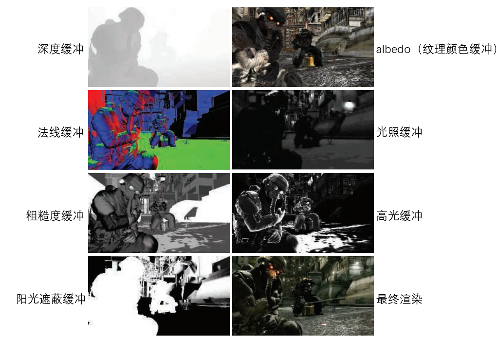
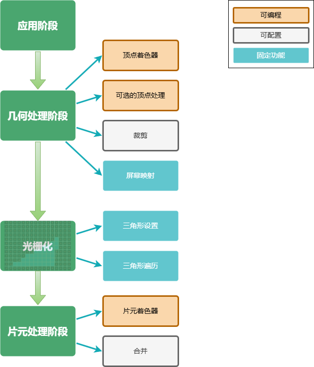
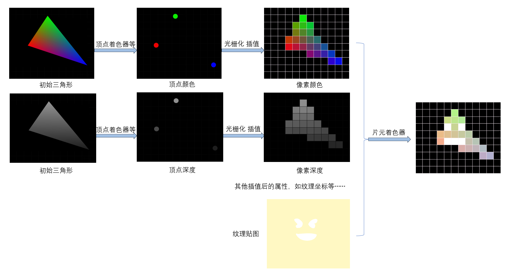

# 延迟渲染

**前向渲染**

我们回忆一下之前渲染管线等章节的学习，假设当前场景有多个光源与多个物体，我们会遍历每一个光源，对每一个物体的每一个片元，进行光照着色计算。显然，如果光源和物体特别特别多，性能就会急剧下降。这就是前向渲染。


我们使用下面的描述来表示这个过程（其中，参考unity shaderLab，一个Pass 代码块会对物体进行一次渲染  ）

```GLSL
Pass
{
    遍历物体的每个片元
    {
        if(没通过深度测试)
        {
            抛弃;
        }
        else
        {
            //该片元可见
            进行光照计算
            将颜色写入片元
        }
    }
}
```

对于每个光源每个物体，都需要执行上述Pass，再最终混合得到最后的颜色值。假设场景中有n个物体，m个光源，渲染整个场景一共需要 n*m个Pass。

可以看到，如果光源大大增加，需要执行的总的Pass也会大大增加，从而增加很大的性能开销。


**延迟渲染**

于是，延迟渲染被提出以解决上述问题。延迟渲染提前将所有物体绘制到屏幕空间的缓冲区中，这些缓冲区也被统称为G缓冲（G-buffer，即geometry buffer）。G-buffer存储了一些距离相机最近的表面的信息，例如表面的深度，法线，纹理颜色（albedo），粗糙度等等，如下图所示。



图编辑自[1] Real-Time Rendering 4th

可以看到，我们相当于仅仅需要在第一个Pass中存储屏幕空间多张二维图像即G-buffer，接下来，我们就可以在第二个Pass中使用G-buffer来计算最终的光照。

第二个Pass中假设我们有多个光源，我们只需要绘制一个屏幕大小的四边形，然后将G-buffer作为纹理来访问，对于每个像素，只要这个像素位于光源影响范围内，我们就计算其光照效果，放入最终呈现在屏幕上的缓冲区中。每个光源执行同样的操作，最后，就可以计算出最终的渲染结果。

我们使用下面的描述来表示这个过程:

```GLSL
Pass 1 //存储G-buffer
{
    遍历物体的每个片元
    {
        if(没通过深度测试)
        {
            抛弃;
        }
        else
        {
            //该片元可见
            将深度，法线，纹理颜色（albedo），粗糙度等信息存储到G-buffer中
        }
    }
}
Pass 2 //光照计算
{
    遍历屏幕每个像素
    {
        读取G-buffer
        根据G-buffer的信息进行光照
        将颜色写入屏幕像素
    }
}
```


接下来，我们回忆前面的渲染管线章节，对比前向渲染和延迟渲染的渲染管线上的差别。

**前向渲染和延迟渲染的渲染管线上的差别**


**前向渲染的渲染管线**

我们回忆一下 渲染管线章节中讲到的前向渲染渲染管线：




1）应用阶段

应用阶段，需要准备好相机，光源，物体等场景数据，然后剔除不可见物体，设置渲染状态，最后提交几何图元至GPU以供渲染。

2）几何处理阶段

如上图所示，几何处理阶段会通过对输入的几何图元经过**顶点着色器，裁剪和屏幕映射**等多步处理，最终输出屏幕空间的二维**顶点信息**如顶点坐标，每个顶点的深度值、着色等信息，然后交给光栅化阶段进行处理。

3）光栅化阶段

拿到几何处理阶段的顶点信息，遍历三角形，查看屏幕像素是否被三角形覆盖。如果是的话，我们就生成一个对应的**片元(fragment)**，插值得到深度，屏幕坐标，法线，纹理坐标等等信息。

4）片元着色器

对每个像素进行光照，着色等处理，最后得到这个片元显示在屏幕上的最终颜色。

大致理解如下图：



**延迟渲染的渲染管线**

1）应用阶段

与前向渲染一样。（准备场景数据，剔除不可见物体，设置渲染状态，提交几何图元。）

2）几何处理阶段

**这一阶段与前向渲染不同。**

延迟渲染中几何处理阶段


如上图所示，几何处理阶段会通过对输入的几何图元经过**顶点着色器，裁剪和屏幕映射**等多步处理，最终输出屏幕空间的二维**顶点信息**如顶点坐标，每个顶点的深度值、着色等信息，然后交给光栅化阶段进行处理。


会负责**绘制G-buffer**。将距离相机最近的表面的信息，例如表面的深度，法线，纹理颜色（albedo），粗糙度等信息存储到G-buffer中。


（是否是存储表面的三角形顶点信息？还是直接存像素信息？）


3）光栅化阶段

**这一阶段与前向渲染不同。**

拿到几何处理阶段的顶点信息，遍历三角形，查看屏幕像素是否被三角形覆盖。如果是的话，我们就生成一个对应的**片元(fragment)**，插值得到深度，屏幕坐标，法线，纹理坐标等等信息，并存储到**G-buffer**中。


？？？应该也是这样 是吗

拿到几何处理阶段的顶点信息，遍历三角形，查看屏幕像素是否被三角形覆盖。如果是的话，我们就生成一个对应的**片元(fragment)**，插值得到深度，屏幕坐标，法线，纹理坐标等等信息。


4）片元着色器

**这一阶段与前向渲染不同。**

使用G-buffer中存储的信息来计算最终的光照。相当于我们只需要对于整个屏幕绘制一次最终结果，而不需要像前向渲染一样，在每个像素的片元着色器都进行光照计算。


>、延迟渲染的管线与前向渲染有所不同，特别是在光照和材质的处理方式上：
>
>- **应用阶段**: 仍然与前向渲染类似，主要涉及物体、相机、光源的变换等操作。
>- **几何处理阶段**: 在延迟渲染中，这个阶段主要负责将场景中的每个物体绘制到多个缓冲区中，常见的有 **位置缓冲区（G-buffer）**、**法线缓冲区**、**颜色缓冲区** 等。每个物体的表面信息（位置、法线、漫反射颜色等）被存储在这些缓冲区中，而不是在这一阶段计算光照。
>- **光栅化阶段**: 在延迟渲染中，光栅化阶段主要将几何数据（例如顶点、三角形）转换为片元，但不涉及光照计算，所有光照数据将在之后的光照计算阶段中集中处理。
>- **片元处理阶段（Lighting Stage）**: 延迟渲染的特点在这一阶段得以体现。在这一阶段，使用存储在 G-buffer 中的信息来进行光照计算。这意味着所有光照的计算和材质的处理都在这一阶段集中进行，而不是在每个像素的片元处理阶段都进行光照计算。

补充：

想象一下场景中大量的物体互相遮挡，一定会有很多片元最终不会被呈现在屏幕上，但是前向渲染中我们依旧要对这些未来会被舍弃的片元做大量的光照计算，是十分浪费的。（关于这点后面会补充）

或许有读者还记得之前提到的深度测试中的early-z，是否会有疑惑，如果使用了early-z，在片元着色器前抛弃片元，是否就可以解决浪费的问题。但实际上

参考：

[1] Real-Time Rendering 4th

[2] https://zhuanlan.zhihu.com/p/28489928

[3] Unity Shader 入门精要