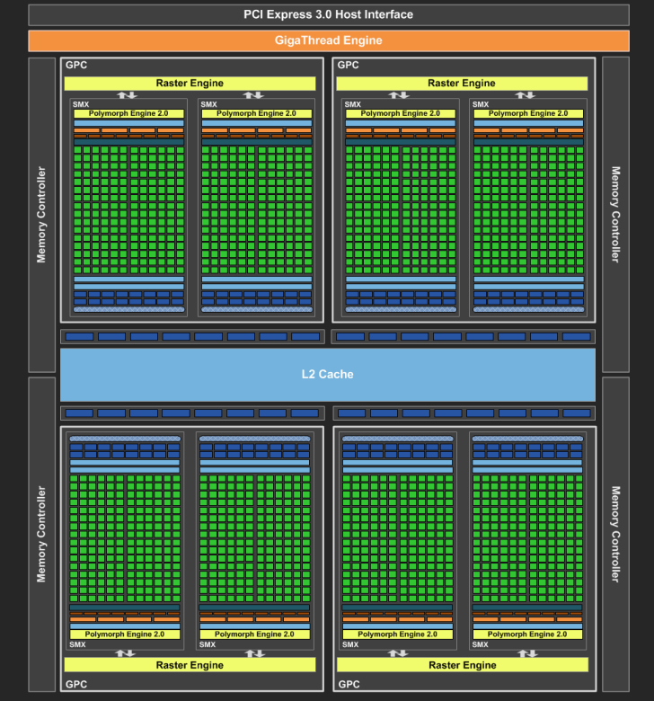

# lesson22_图形处理单元GPU

https://docs.nvidia.com/cuda/cuda-c-programming-guide/index.html#scalable-programming-model

https://zhuanlan.zhihu.com/p/413145211

如下图， GPU被划分成多个GPCs(Graphics Processing Cluster，图形处理集群)，每个GPC拥有多个SM（SMX、SMM）和一个光栅化引擎(Raster Engine)。

GeForce GTX 680 Block Diagram

我们之前在渲染管线章节提到的可编程的顶点着色器和片元着色器就是在SM（Stream Multiprocessor，流多处理器）上完成的。

一个SM（Stream Multiprocessor）有多个**着色器核心（shader core）**。

https://www.nvidia.com/content/PDF/product-specifications/GeForce_GTX_680_Whitepaper_FINAL.pdf