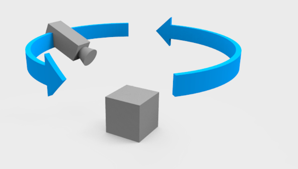

# 课时3——相机的位姿变化

​	在之前的课时中，我们实现了一些空间变换矩阵，我们在场景中实现了一个三维的立方体，但仍未做到实时与场景进行交互，我们无法像看真实世界中的例如握在手里的水杯，能够随意看到这个水杯的各个角度。那么我们这节课就来实现这件事。在本节中，我们会写一些代码对相机进行控制，从而让我们能够实时看到渲染的结果正确与否。读者可以跟随下面文档的大致步骤对之前的代码进行修改，或是从Github上拉下来这一课时的对应代码。

​	什么样的相机是合适的呢？在很多第三人称或者第一人称游戏中，我们通过wasd前后左右移动，旋转鼠标来旋转相机。但是我们的小渲染一般只渲染一个中心目标，因此还不需要场景漫游。因此，我们引入更合适于我们项目的环绕相机，相机会一直盯着我们设定的目标点看，我们可以围绕这个目标点旋转，但是目光都不会离开这个目标点，同时也可以调整目标点的位置和与目标点的距离。

（https://www.zhihu.com/question/24786878/answer/820931418）

[controls/OrbitControls.js 第390-395行github.com/mrdoob/three.js/blob/r108/examples/js/controls/OrbitControls.js#L390-L395](https://link.zhihu.com/?target=https%3A//github.com/mrdoob/three.js/blob/r108/examples/js/controls/OrbitControls.js%23L390-L395)



# 一、在当前架构中书写回调函数

## 1.监听事件+回调函数的逻辑

​	我们首先在`test_enter_mainloop`函数的while循环最后加入一句`input_poll_events();`，这个函数定义写在了`win32.cpp`文件当中，如下：

```c++
void input_poll_events(void) 
{
    MSG message;
    while (PeekMessage(&message, NULL, 0, 0, PM_REMOVE)) 
    {
        TranslateMessage(&message);
        DispatchMessage(&message);
    }
}
```

​	不需要关心过多底层的细节，这里windows相关的库文件已经帮我们做好了，当任何鼠标/键盘等事件发生的时候，会自动调用以下函数（需要写一个，这是我看函数调用堆栈的时候看到的）：

```c++
static LRESULT CALLBACK process_message(HWND hWnd, UINT uMsg,
    WPARAM wParam, LPARAM lParam) 
{
    window_t* window = (window_t*)GetProp(hWnd, WINDOW_ENTRY_NAME);
    if (window == NULL) {
        return DefWindowProc(hWnd, uMsg, wParam, lParam);
    }
    else if (uMsg == WM_KEYDOWN) {
        handle_key_message(window, wParam, 1);
        return 0;
    }
    else if (uMsg == WM_KEYUP) {
        handle_key_message(window, wParam, 0);
        return 0;
    }
    else if (uMsg == WM_LBUTTONDOWN) {
        handle_button_message(window, BUTTON_L, 1);
        return 0;
    }
    else if (uMsg == WM_RBUTTONDOWN) {
        handle_button_message(window, BUTTON_R, 1);
        return 0;
    }
    else if (uMsg == WM_LBUTTONUP) {
        handle_button_message(window, BUTTON_L, 0);
        return 0;
    }
    else if (uMsg == WM_RBUTTONUP) {
        handle_button_message(window, BUTTON_R, 0);
        return 0;
    }
    else if (uMsg == WM_MOUSEWHEEL) {
        float offset = GET_WHEEL_DELTA_WPARAM(wParam) / (float)WHEEL_DELTA;
        handle_scroll_message(window, offset);
        return 0;
    }
    else {
        return DefWindowProc(hWnd, uMsg, wParam, lParam);
    }
}
```

​	这里面需要我们填写的就是例如`handle_button_message`函数以及`handle_key_message`函数。这里我们举个简单的例子，比如我们想要在按下ESC键的时候，窗口关闭，可以补充`handle_key_message`函数如下：

```c++
/*
 * for virtual-key codes, see
 * https://docs.microsoft.com/en-us/windows/desktop/inputdev/virtual-key-codes
 */
static void handle_key_message(window_t* window, WPARAM virtual_key,
    char pressed) 
{
    std::cout<<"key message"<<std::endl;
    keycode_t key;
    switch (virtual_key) 
    {
        case 'A':      key = KEY_A;     break;
        case 'D':      key = KEY_D;     break;
        case 'S':      key = KEY_S;     break;
        case 'W':      key = KEY_W;     break;
        case VK_SPACE: key = KEY_SPACE; break;
        case VK_ESCAPE: window->should_close = 1; return;
        default:       key = KEY_NUM;   break;
    }
    if (key < KEY_NUM) 
    {
        window->keys[key] = pressed;
        if (window->callbacks.key_callback)
        {
            window->callbacks.key_callback(window, key, pressed);
        }
    }
}
```

​	可以看到在上面的函数当中，我们定义ESC键`VK_ESCAPE`的回调函数是`window->should_close=1`，此时只需要给window类增加一个should_close字段，并在`test_enter_mainloop`中给while循环设置以下条件：

```c++
while (!window->should_close){
    //...
}
```

​	其他的也是同理，接下来我们要做的事情就是给按键之类的绑定一系列的监听函数，并结合相机的相关逻辑，接下来先来说设定回调函数的部分。

------


## 2.设定回调函数

​	这次我们主要是测试与相机有关的逻辑，所以暂时可以把上一个课时当中的`void space_transform(framebuffer_t* framebuffer)`函数中的内容复制过来。

​	接着，我们在`win32.h`头文件当中，加入以下的内容：

```c++
typedef enum { KEY_A, KEY_D, KEY_S, KEY_W, KEY_SPACE, KEY_NUM } keycode_t;
typedef enum { BUTTON_L, BUTTON_R, BUTTON_NUM } button_t;
typedef struct 
{
	void (*key_callback)(window_t* window, keycode_t key, int pressed);
	void (*button_callback)(window_t* window, button_t button, int pressed);
	void (*scroll_callback)(window_t* window, float offset);
} callbacks_t;
```

​	现在我们需要回到windows_t类当中，为其添加与用户交互有关的内容：

```c++
struct window_t
{
	HWND handle;
	HDC memory_dc;
	image_t* surface;
	/* common data */
	int should_close;
	char keys[KEY_NUM];
    char buttons[BUTTON_NUM];
	callbacks_t callbacks; //这里的callbacks记录所有的回调函数，相关的结构体上一个代码段已经可见
    void* userdata;
};
```

​	这里我们重新回到test_enter_mainloop函数当中，书写以下的内容：

```c++
class record_t
{
public:
    /* orbit */
    int is_orbiting;
    vec2_t orbit_pos;
    vec2_t orbit_delta;
    /* pan */
    int is_panning;
    vec2_t pan_pos;
    vec2_t pan_delta;
    /* zoom */
    float dolly_delta;

    /* click */
    float press_time;
    float release_time;
    vec2_t press_pos;
    vec2_t release_pos;
    int single_click;
    int double_click;
    vec2_t click_pos;
};

void test_enter_mainloop5(tickfunc_t* tickfunc)
{
	window_t* window;
	framebuffer_t* framebuffer;

	float prev_time;
	float print_time;
	int num_frames;

	window = window_create(WINDOW_TITLE, WINDOW_WIDTH, WINDOW_HEIGHT);
	framebuffer = framebuffer_create(WINDOW_WIDTH, WINDOW_HEIGHT);
	Camera* camera = new Camera(CAMERA_POSITION, CAMERA_TARGET, (float)WINDOW_WIDTH / (float)WINDOW_HEIGHT);
	callbacks_t callbacks;
	record_t record;
	memset(&callbacks, 0, sizeof(callbacks_t));
	callbacks.button_callback = button_callback;
    callbacks.scroll_callback = scroll_callback;
	window->callbacks = callbacks;
    window->userdata = &record;
    
	num_frames = 0;
	prev_time = platform_get_time();
	print_time = prev_time;

	while (!window->should_close)
	{
		float curr_time = platform_get_time();
		float delta_time = curr_time - prev_time; //与帧率有关的值
		update_camera(window, camera, &record);

		tickfunc(framebuffer);
		window_draw_buffer(window, framebuffer);

		input_poll_events();
	}

}
```

这里的record_t类我们暂时不说，这个会放在后面具体讲相机逻辑的时候再说。但大概的逻辑就在于我们要实现以下几个按键和鼠标的事件：

- （1）按下空格键的时候，相机会归位；
- （2）按住鼠标左键左右移动的时候，会将模型进行旋转；
- （3）按住鼠标右键左右移动的时候，会将模型进行平移；
- （4）滑动鼠标的滚轮，可以放大和缩小模型。

接下来我们重点来说一下这个相机模型。

------


# 二、相机位姿变化模型

> 这一部分主要是业界里一些效果比较好的解决方案，如果没有理解的很透彻也没关系，更多是工业界上的实现，了解即可。


## 1.滚轮放大缩小

```c++
void scroll_callback(window_t* window, float offset) 
{
    record_t* record = (record_t*)window_get_userdata(window);
    record->dolly_delta += offset;
}
```

在我的设备当中，鼠标滚轮向上滑动输出的结果为1，滚轮向下滑动输出的结果为-1。dolly指的是相机沿着一条直线前后移动，通常是在摄影轨道上进行。这种运动可以拉近或拉远拍摄对象。


## 2.按下鼠标左右键的平移、缩放与旋转

这部分的核心代码如下：

```c++
void button_callback(window_t* window, button_t button, int pressed)
{
    // 获取与窗口关联的用户数据userdata，userdata存储状态信息?
    record_t* record = (record_t*)window_get_userdata(window);
    // 获取当前鼠标光标的位置
    vec2_t cursor_pos = get_cursor_pos(window);
    
    // 检测左键是否被按下
    if (button == BUTTON_L)
    {
        float curr_time = platform_get_time(); // 获取当前时间
        
        if (pressed) // 左键按下时
        {
            record->is_orbiting = 1; // 设置为 正在进行旋转
            record->orbit_pos = cursor_pos; // 记录起始旋转位置
            record->press_time = curr_time; // 记录按下时间
            record->press_pos = cursor_pos; // 记录按下位置
        }
        else // 左键释放时
        {
            float prev_time = record->release_time; // 获取上次的释放时间
            vec2_t pos_delta = get_pos_delta(record->orbit_pos, cursor_pos); // 计算当前位置与之前位置的差值（即按下位置与释放位置的插值）
            
            record->is_orbiting = 0; // 结束旋转
            record->orbit_delta = vec2_add(record->orbit_delta, pos_delta); // 更新旋转位移
            
            // 检测双击情况
            if (prev_time && curr_time - prev_time < CLICK_DELAY) 
            {
                record->double_click = 1; // 记录为双击
                record->release_time = 0; // 重置释放时间
            }
            else 
            {
                record->release_time = curr_time; // 更新释放时间
                record->release_pos = cursor_pos; // 记录释放位置
            }
        }
    }
    // 检测右键是否被按下
    else if (button == BUTTON_R) 
    {
        if (pressed) // 右键按下时
        {
            record->is_panning = 1; // 设置为正在进行平移
            record->pan_pos = cursor_pos; // 记录起始平移位置
        }
        else // 右键释放时
        {
            vec2_t pos_delta = get_pos_delta(record->pan_pos, cursor_pos); // 计算当前位置与之前位置的差值
            record->is_panning = 0; // 结束平移
            record->pan_delta = vec2_add(record->pan_delta, pos_delta); // 更新平移位移
        }
    }
}

```

- Orbit 指的是相机围绕一个点或对象旋转的运动，通常保持与对象的相对距离不变。这种运动可以提供全方位的视角。
- Pan 是指相机在水平方向上左右旋转的运动，通常固定在同一位置，使得拍摄的画面在水平方向上发生变化。

​	拿到了record当中记录的值，这时我们就可以在loop循环中写一个update_camera的函数`update_camera(window, camera, &record);`。这个函数比较重要，包含相机旋转、平移、缩放的核心逻辑，我们对其进行探讨。

​	先看相机isOrbiting的情况，对应效果就像按下鼠标左键拖拽移动旋转模型，**实际上是修改了相机的位置**，这段函数如下：

```c++
if (record->is_orbiting) 
{
    vec2_t pos_delta = get_pos_delta(record->orbit_pos, cursor_pos); // 计算鼠标拖拽的位移
    record->orbit_delta = vec2_add(record->orbit_delta, pos_delta); // 更新旋转位移
    record->orbit_pos = cursor_pos; // 更新当前光标位置
}
```

​	isPanning的情况，对应平移相机，对应的函数如下：

```c++
if (record->is_panning)
{
    vec2_t pos_delta = get_pos_delta(record->pan_pos, cursor_pos); // 计算鼠标拖拽的位移
    record->pan_delta = vec2_add(record->pan_delta, pos_delta); // 更新平移位移
    record->pan_pos = cursor_pos; // 更新当前光标位置
}
```

​	如果按下空格，则相机的位置会被归正，否则会调用下面的这个核心函数，用于做相机的变换：

```c++
void camera_update_transform(Camera* camera, motion_t motion)
{
    // 计算从相机位置到目标位置（target）的向量
    vec3_t from_target = vec3_sub(camera->position, camera->target);
    
    // 计算从目标位置到相机位置（position）的向量
    vec3_t from_camera = vec3_sub(camera->target, camera->position);
    
    // 计算平移量pan，用于调整目标位置
    vec3_t pan = calculate_pan(from_camera, motion);
    
    // 计算偏移量offset，用于确定新的相机位置
    vec3_t offset = calculate_offset(from_target, motion);
    
    // 更新目标位置，将pan添加到原来的target上
    camera->target = vec3_add(camera->target, pan);
    
    // 更新相机位置，将新的offset添加到更新后的target上
    camera->position = vec3_add(camera->target, offset);
}

```

我们来解读一下上面的这段代码：

- （1）from_target指的是从相机目标指向相机的一根向量；
- （2）from_camera则指的是由相机出发指向target的一根向量。执行前两句的时候camera的position和target并没有发生改变；
- （3）接下来会计算pan，pan用来修改相机指向的target的位置，这样就可以模拟一种平移的效果，这个pan的计算函数如下：

```c++
static vec3_t calculate_pan(vec3_t from_camera, motion_t motion)
{
    // 归一化当前相机位置向量，以得到前方方向
    vec3_t forward = vec3_normalize(from_camera);
    
    // 通过叉乘计算出相机的左方向
    vec3_t left = vec3_cross(UP, forward);
    
    // 通过叉乘计算出相机的上方向
    vec3_t up = vec3_cross(forward, left);

    // 计算相机到目标的距离
    float distance = vec3_length(from_camera);
    
    // 计算因子以适配视野范围
    float factor = distance * (float)tan(FOVY / 2) * 2;
    
    // 计算相机在其水平方向上应该移动的量，下一句类似
    vec3_t delta_x = vec3_mul(left, motion.pan.x * factor); 
    
    // 计算垂直方向的位移量
    vec3_t delta_y = vec3_mul(up, motion.pan.y * factor);
    
    // 返回最终的平移向量
    return vec3_add(delta_x, delta_y);
}
```

> ①将相机当前的位置向量归一化，以便得到方向向量 `forward`。这个向量指向相机所面对的方向。
>
> ②使用向量叉乘计算出“左”向量，表示相机的左边方向。假设 `UP` 是一个常量向量（例如 (0, 1, 0) 表示 y 轴向上），通过与 `forward` 相交计算得出。（OpenGL是右手系，这就意味着up叉乘forward方向会得到left方向）
>
> ③通过叉乘计算出“上”向量，确保相机的上方方向正确。这种计算确保右、前、上三者互相正交。
>
> ④接下来的两句用于计算视角的范围：
>
> - `distance` 是相机与场景原点之间的距离。
> - `factor` 计算出了在当前视野中，基于相机位置和视场角（FOVY），每个单位在屏幕上对应的实际物理长度。`FOVY` 是视场角的垂直角度，通过 `tan` 函数可以得到相对于相机到场景的距离，每个方向的适配比例。
>
> ⑤ 最后将两个位移向量相加，返回最终的平移位移向量。


- （4）接下来会计算offset，这个量是会加在相机观察的target上的，并作为相机新的position的位置，这段代码如下：

  
  
  ```c++
  static vec3_t calculate_offset(vec3_t from_target, motion_t motion) 
  {
      float radius = vec3_length(from_target);
      float theta = (float)atan2(from_target.x, from_target.z);  /* azimuth */
      float phi = (float)acos(from_target.y / radius);           /* polar */
      float factor = PI * 2;
      vec3_t offset;
  
      radius *= (float)pow(0.95, motion.dolly);
      theta -= motion.orbit.x * factor;
      phi -= motion.orbit.y * factor;
      phi = float_clamp(phi, EPSILON, PI - EPSILON);
  
      offset.x = radius * (float)sin(phi) * (float)sin(theta);
      offset.y = radius * (float)cos(phi);
      offset.z = radius * (float)sin(phi) * (float)cos(theta);
  
      return offset;
  }
  ```

> ①**计算半径**: `vec3_length(from_target)` 计算从目标到相机的距离（即半径），有效地得到当前相机与目标点之间的直线距离。
>
> ②**计算方位角**: 使用 `atan2` 函数计算方位角（azimuth angle）`theta`，表示相机在水平平面内相对于 Z 轴的角度。注意，`from_target.x` 和 `from_target.z` 的顺序是为了符合右手坐标系的定义。
>
> ③**计算极角**: 使用 `acos` 函数计算极角（polar angle）`phi`，表示相机相对于 Y 轴的角度。这里需要注意的是，`from_target.y` 除以 `radius` 是为了确保是单位向量，从而得到正确的角度。
>
> ④**设定因子**: 设定一个常量 `factor` 为 `2π`，用于将运动变化（orbit）转换为弧度。
>
> ⑤定义一个 `offset` 向量，用于存储最终计算出的新的相机位置。根据用户的 `motion.dolly` 输入来调整半径。`dolly` 通常意味着相机向前或向后移动，这里通过乘以一个小于1的值（0.95）来模拟缩小半径（靠近目标）。**调整方位角**: 根据用户输入的 `motion.orbit.x` 数值（来源于鼠标左右移动）来调整 `theta`。这个操作会改变相机在水平面上的旋转角度。
>
> ⑥**限制极角范围**: 使用 `float_clamp` 函数确保 `phi` 在合法范围内，避免值过小或过大导致计算错误（例如，防止相机完全“翻转”）。
>
> ⑦在计算得到结果之后，再计算三个分量并赋值回去。


**总结：这个课时主要是实现了鼠标与窗体之间的交互，用户可以通过按住鼠标左键旋转模型，按住鼠标右键缩放模型，上下滑动鼠标滚轮缩放模型。核心的原理就是记录每个操作之间的offset量，然后用数学来移动相机的position和其lookat的target的位置。从最终实现的效果来看还是不错的。**