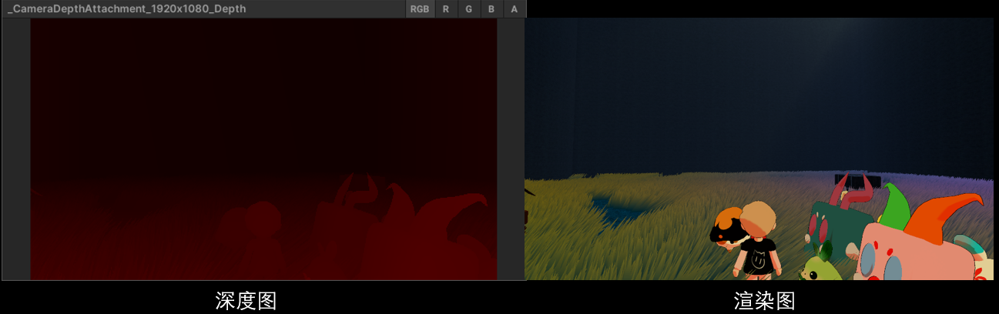

# lesson4_深度测试、深度缓冲与深度图


# 课时4：深度缓冲、深度测试、深度图

## 1.深度的引入/概念

- （1）没有深度缓冲的结果（上一节的正方体图）

  记得上一节课中，我们渲染了一个正方体的模型。读者可能会觉得这个渲染出来的“箱子”有点不对劲，好像三角形渲染的顺序出了问题。因为顶面的三角形并没有出现，而竟然能看见箱子的内部！


如果我们的三角形按照正确的深度进行渲染，理想的效果应该是，离我们眼睛更远的三角形被离我们眼睛更近的三角形所遮挡，这才是正确的效果。


- （2）画家算法
  - 画家算法，无法解决物体内像素穿插的问题（冯乐乐图）

  那么我们可能会想，如果我们像画家一样，如下图将物体从后到前地画在屏幕上，先画背景，再从后到前一个个画物体，是否就能解决这个问题呢？

  

  然而这个画家算法也有其局限性，如下图所示，物体之间互相穿插，到底什么物体在最前面呢？可见画家算法无法处理相互重叠的多边形。

  

- （3）所以想解决画家算法解决不了的问题，人们就发明了深度缓冲（Depth Buffer）技术，记录一张buffer，在渲染第一个三角形的时候记录每个像素点的深度。当渲染第二个三角形时，与buffer中已经记录的深度作比较，如果待渲染的像素A'的深度比记录的当前的像素深度A要更小，说明离相机更近，远的物体往往都会被近的物体所遮挡，所以最后只需要渲染最近的像素就可以。在这章的第三节我们会具体说明。

​	下图渲三角形的时候写的数字代表深度，渲第二个三角形的时候与第一个三角形的深度做一个比较，如果更小就会覆盖之前的深度写进更小的深度值

<video src="lesson4视频演示/DepthTestZWriteZTest.mp4"></video>

## 2.线性深度与非线性深度

- （1）线性深度

  线性表示变化曲线的一阶导为常数，例如$F(x) = 3x $，导数$F'(x) = 3$

  从上一节课我们学习到,相机空间的深度$ z $，是线性的深度。

  

  

  不过此时我们的深度变化范围是（-n，-f），我们希望将范围线性映射到（0，1），可以节约精度并提高数值处理的效率。
  $$
  F(z) = \frac{z + n}{n - f}
  $$
  
  
  

  （2）非线性深度
  
  从相机空间变换到到了裁剪空间之后深度（z值）就不是线性的了。我们可以回忆一下上个课时空间变换的演示视频：
  
  <video src="lesson4视频演示/PerspectiveToOrthographicFromPer.mp4"></video>
  我们复习一下，可以看到，从相机空间变换为裁剪空间之后，很多点的z值已经发生了改变。从动图很容易看出,除了近裁剪面上的点和远裁剪面上的点，中间的点都是更靠近远裁剪面的,z值都发生了偏移。
  <video src="lesson4视频演示/PerspectiveShowOnlyMorePoints.mp4"></video>
  
  根据上节课提到的透视投影矩阵：
  $$
  M 
  =
  \begin{bmatrix} 
   \frac{2n}{r - l} & 0 & -\frac{r + l}{r - l} & 0 \\
   0 & \frac{2n}{t - b} &  -\frac{t + b}{t - b} & 0 \\
   0 & 0 & -\frac{n+f}{ f-n} & -\frac{2nf}{f-n} \\ 
   0 & 0 & -1 & 0 \\
  \end{bmatrix}
  $$
  我们计算z值
  $$
  M\begin{bmatrix} x \\ y \\ z \\ 1 \\ \end{bmatrix} 
  =
  \begin{bmatrix} 
   \frac{2n}{r - l} & 0 & -\frac{r + l}{r - l} & 0 \\
   0 & \frac{2n}{t - b} &  -\frac{t + b}{t - b} & 0 \\
   0 & 0 & -\frac{n+f}{ f-n} & -\frac{2nf}{f-n} \\ 
   0 & 0 & -1 & 0 \\
  \end{bmatrix}
  \begin{bmatrix} x \\ y \\ z \\ 1 \\ \end{bmatrix}
  =
  \begin{bmatrix} X \\ Y \\ -\frac{n+f}{ f-n}z  -\frac{2nf}{f-n} \\ -z \\ \end{bmatrix}
  $$
  然后我们需要转换到在NDC空间中，同除w进行透视除法，即同除-z项，得到 
  $$
  N(z) =\frac{n+f}{ f-n}  +\frac{2nf}{(f-n)z}
  $$
  然后我们将深度进一步从NDC的[-1,1]线性映射为为[0,1]
  $$
  G(z) =\\\frac{1}{ 2}N(z)+\frac{1}{ 2}=\\\frac{1}{ 2}(\frac{n+f}{ f-n}  +\frac{2nf}{(f-n)z})+\frac{1}{ 2}
  $$
  假设近平面为-4，远平面为-100，我们根据以上公式做一个图，可以看到，很明显经过透视投影和透视除法后的深度是非线性的。
  
  并且，靠近近平面的深度的取值占据了大部分的取值范围。也就是说，距离相机越近的物体，给予的存储深度的信息越多，显示质量更高；距离相机越远的物体，深度信息被压缩得越强，深度信息越少。例如：0-0.9的精度都用来存储-4到-20左右的物体的深度信息，而其他的远的物体本身相对于近的物体来说也看不清楚，并不需要那么多的精度来存储其信息。
  
  
  
  
  
  此时我们有了两种记录深度的方法，一种是线性的真实的深度，一种是非线性的记录更多近平面信息的深度。
  
  如何选择呢？由上文可知，如果记录的是相机空间的线性的真实的深度，浮点数精度不能保证。
  
  权衡来看，最终人们选择了非线性的深度来进行计算，也就是将NDC空间的z值映射到0-1之间作为深度。


- （2）非线性深度转换到线性深度
  
  - （a）非线性深度转换回线性深度的意义是什么？
  
    在许多图形应用中，我们不仅仅需要屏幕空间中的深度值，还需要真实的、线性的相机空间深度。例如：
  
    1. **重建世界坐标**：为了在相机空间中计算物体的实际位置，需要恢复线性深度。非线性深度值不能直接用于这些计算。具体如何重建会在后续章节讲解。
    2. **特效渲染**：一些后期处理特效（如景深、体积光效等）需要基于物体距离相机的真实深度，而不是压缩过的深度值。
    3. **物理模拟**：在光线追踪(后续会具体展开讲解)或碰撞检测中，线性深度信息通常是必要的。
  
    因此，将非线性深度值转换回线性深度，使得我们可以准确地对物体与相机的距离进行运算。
  
    很多时候我们其实想要拿到相机空间的深度值，来做一些特殊的效果，比如重建世界坐标。
  
  - （b）公式推导：如何转换
  
    **深度缓冲值 $G(z)$** 是从之前的透视投影中得到的非线性深度值。它通过下面的关系计算得出：$$G(z)=\frac12\left(\frac{n+f}{f-n}+\frac{2nf}{(f-n)z}\right)+\frac12$$
  
  对公式进行化简，我们可以推导出：
  
  
  $$z=\frac{2nf}{(n+f)-(f-n)\cdot G(z)}$$
  
  这个公式将屏幕空间中的非线性深度值 $G(z)$ 转换回了相机空间中的线性深度值 $z$。通过这个公式，我们可以在需要的时候恢复出原始的线性深度值，进而用于其他计算和渲染。


## 3.深度缓冲与深度测试

- （1）ZBuffer的概念，存储的内容；

在渲染三维物体时，我们记录一个缓冲区，这个缓冲区（buffer）是一个保存屏幕像素深度（即z值）的二维数组。在渲染第一个三角形的时候buffer记录这个三角形每个像素点的深度。当渲染第二个三角形时，与buffer中已经记录的深度作比较，如果这第二个三角形也在与第一个三角形在同一个像素生成渲染结果，那么我们就会比较二者的深度，如果第二个三角形待渲染的像素的深度比buffer记录的深度要更小，说明离相机更近，远的物体往往都会被近的物体所遮挡，所以最后只需要渲染最近的像素就可以。这个缓冲区我们称为ZBuffer。

<video src="lesson4视频演示/DepthTestZWriteZTest.mp4"></video>


- （2）深度测试算法的介绍，深度写入； 

  深度测试就是上述写入ZBuffer的过程，我们在渲染每个像素的时候，都会将当前像素的深度值与ZBuffer中的深度值进行比较，如果当前像素的深度值小于ZBuffer中的深度值，那么我们就会更新ZBuffer中的深度值，并且渲染当前像素。这个过程就是**深度测试**。而**深度写入**就是将当前像素的深度值写入ZBuffer中。

  
  
  - 实际上，现在的渲染管线支持我们对深度测试进行配置，比如LESSTHAN，LEQUAL，一般都是LESSTHAN
  
  LESSTHAN：如果当前像素的深度值小于ZBuffer中的深度值，那么我们就会更新ZBuffer中的深度值，并且渲染当前像素。
  
  LEQUAL：如果当前像素的深度值小于等于ZBuffer中的深度值，那么我们就会更新ZBuffer中的深度值，并且渲染当前像素。
  
  


## 4.深度图

在上面的非线性深度的讲解中，我们得到将深度进一步从NDC的[-1,1]线性映射为为[0,1]后
$$
G(z) =\\\frac{1}{ 2}N(z)+\frac{1}{ 2}=\\\frac{1}{ 2}(\frac{n+f}{ f-n}  +\frac{2nf}{(f-n)z})+\frac{1}{ 2}
$$
这个$G(z)$就是深度图/深度纹理中的对应像素值。

在实际使用的时候，很多时候要把深度图的像素值转换为相机空间的深度值。参考上面提到的非线性深度转换到线性深度部分。

深度图长什么样？

我们从Unity里面截一张，放过来看一下效果。



左边显示的时深度图，之所以是红色，是因为其将深度保存在R通道。Unity这张可视化的深度图对深度做了一个反转，即（0，1）变为（1，0）。


## 5.项目中的代码

```C++
float screen_depths[3];//三角形的三个顶点的深度值	
for (int i = bbox.min_x; i <= bbox.max_x; i++)
	{
		for (int j = bbox.min_y; j <= bbox.max_y; j++)
		{
			vec2_t p{ (float)(i + 0.5), (float)(j + 0.5) };
			vec3_t result = calculate_weights(screen_coords, p);

            //深度插值
			float depth = interpolate_depth(screen_depths, result);
			//Zbuffer test
			int screen_index = j * width + i;
            
            //深度测试
			if (depth < zbuffer[screen_index])
			{
                //深度写入
				zbuffer[screen_index] = depth;
			}
			else
			{
				continue;
			}
			......
	
		}
	}
}
```

