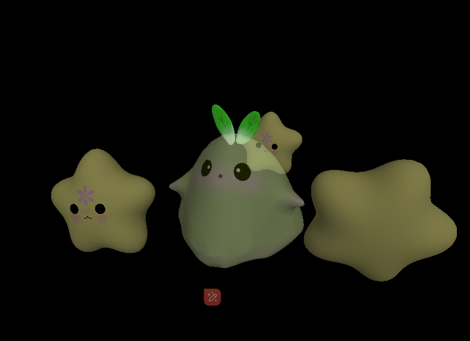

# lesson5_透明物体的渲染

## 5.1  透明物体的概念与引入

什么是透明物体？比如玻璃、水、眼镜片等等，现实中这些物体都是透明的，我们可以透过其看到其后面的物体。光线入射到透明物体的表面，一部分光线被反射，一部分光线被折射。光线在不同介质中的传播速度不同，（介绍折射率）我们将介质的折射率$\eta_i$定义为$\frac{c}{v}$，其中$c$是真空中光速，$v$是介质中的光速。

如下图所示，入射角与折射角之间的关系由Snell定律给出：
$$
\frac{\sin\theta_r}{\sin\theta_i}=\frac{\eta_i}{\eta_r}
$$


其中，$\theta_i$是入射角，$\theta_r$是折射角，$\eta_i$是入射介质的折射率，$\eta_r$是折射介质的折射率。

使用光线追踪（后面章节会展开讲解）可以很好的模拟透明物体的渲染效果，但是光线追踪的计算量较大，不适合实时渲染（如大多数手游不适合光线追踪）。在实时渲染中，我们通常不考虑折射。这个方法假设所有介质的折射率都是一样的，这样折射角总是与入射角相等。


对于很薄的表面来说，效果其实是可以接受的。现在我们先做简化，不考虑折射，只考虑透明度。这种情况下，我们可以使用透明系数/透明度（alpha）来模拟透明物体的效果。

问题引入：拿着我们现有的渲染器，能解决半透明物体的渲染吗？

现在还不能，因为在渲染透明物体时，我们还需要考虑透明物体的渲染顺序、透明度测试、透明度混合等问题。

## 5.2  透明物体的深度写入与深度测试

### 5.2.1 渲染透明物体关闭深度写入

> 要点是引出透明物体不应写入深度，用错误的结果先展示可能会更清晰。

现在，我们在场景中加入透明物体，记得我们上一节的深度测试吗（不记得的读者可以去复习一下），如果我们的透明物体正常进行了深度写入，当透明物体出现在不透明物体之前的时候，因为深度更小距离相机更近，通过深度测试并进行深度写入，因此会直接替换FrameBuffer颜色缓冲中的颜色值，会覆盖后面的不透明物体，如图1所示。不透明物体就会被遮挡，这样就不符合透明物体的特性了。因此，我们需要可以考虑**渲染透明物体时，关闭深度写入**。


​																	图1

而实际上我们应该透过透明物体看到后面的不透明物体。我们要做的是透明物体与它后面的不透明物体的颜色**混合**，然后再写入颜色缓冲。

（搞个正确的图）


但是关闭深度写入就一定是对的吗？实际上，这个问题并没有这么简单，在5.6节，我们已经学完渲染顺序后我们会更进一步讲解。


### 5.2.2 渲染透明物体开启深度测试

渲染透明物体时，虽然我们关闭了深度写入，但是我们仍然需要进行深度测试。

因为深度测试的结果是选择是否要抛弃这个片元，复习下图，通过了深度测试之后，无论是否开启深度写入，都会写入颜色缓冲。


如图2所示，透明物体在不透明物体之后，那么它深度值更大，深度测试会抛弃透明物体的片元，不会写入颜色缓冲，这样就不会出现不透明物体被遮挡的情况。

tu2(一个不透明物体前，一个透明物体后)


可以看到 白色物体距离相机更近。


开启深度测试       没开启深度测试


透明物体在不透明物体之前，那么它深度值更小，深度测试会通过透明物体的片元，虽然并不会写入深度,但是依旧会与颜色缓冲中的值进行混合，写入颜色缓冲。

tu3(一个不透明物体后，一个透明物体前)

因此深度测试是必须的,我们必须知道这个片元能否被显示出来,还是被遮挡了.


## 5.3  AlphaBlending 透明度混合

透明度是一个在0到1之间的值，0表示完全透明，1表示完全不透明。

(可以搞一张图，alpha 0 -1  物体从不透明到透明，三角形也行)

透明度的混合通常遵循以下公式：

$$
C_{\text{result}} = C_{\text{src}} \cdot F_{\text{src}} + C_{\text{dst}} \cdot F_{\text{dst}}
$$

- 其中：
  - $C_{\text{result}}$ 是最终渲染出的颜色。
  - $C_{\text{src}}$ 是源物体的颜色（当前已经被渲染的物体颜色）。
  - $C_{\text{dst}}$ 是目标物体的颜色（已经在屏幕上的颜色）。
  - $F_{\text{src}}$ 是源因子，通常是源物体的透明度（alpha 值）。
  - $F_{\text{dst}}$ 是目标因子，通常是 $1 - F_{\text{src}}$。

我们就先采用**源颜色乘以源因子**的混合模式(在Unity引擎中表示为**Blend SrcAlpha OneMinusSrcAlpha**的模式)，$F_{\text{dst}} = 1 - F_{\text{src}}$，结果会是源颜色的线性组合。

即
$$
C_{\text{result}} = C_{\text{src}} \cdot F_{\text{src}} + C_{\text{dst}} \cdot (1 - F_{\text{src}})
$$


假设我们现在有这么一个场景，一个白色的背景$(1,1,1)$，和一个绿色的三角形$(0,1,0,alpha = 0.8)$，透明度为0.8，那么我们的渲染结果如何计算呢？

入数值：
$$
C_{\text{result\_red}} = (0, 1, 0) \cdot 0.8 + (1, 1, 1) \cdot (1 - 0.8) = (0, 0.8, 0) + (0.2, 0.2, 0.2)
$$
计算结果：
$$
C_{\text{result\_green}} = (0.2, 1.0, 0.2)
$$
屏幕上显示的颜色是接近亮绿色的颜色，如图：


## 5.4  透明度测试

但是,实现特殊的透明效果,还可以使用一种特殊的透明度测试办法.透明度测试是一个非0即1的结果,只要片元的透明度满足某个条件,比如大于某个阈值，就通过测试，否则就抛弃这个片元。也就是说,这个片元要么成为不透明的被看见,像不透明片元一样正常参与深度测试,深度写入.要么完全透明被抛弃不显示出来,直接不做处理。我们可以看出,透明度测试是不需要关闭深度写入的.

透明度测试的目的是为了提高渲染效率，减少不必要的片元的计算。透明度测试的结果是决定是否要抛弃这个片元，而不是决定是否要写入颜色缓冲。


下面可以是正方形面片也可以


## 5.5  渲染顺序

### 5.5.1 回顾深度测试与不透明物体的渲染顺序

  上一节课lesson4_深度测试、深度缓冲与深度图 实际上与这节课紧密相关，在上一节课中，我们学习了深度测试的基本原理，以及如何使用深度测试来解决**不透明物体**的渲染问题。

  从下面的示意视频可以更清晰看出，对于不透明物体来说，不论先渲染哪个物体，都会让深度最近的物体覆盖深度较远的物体。因此，**渲染顺序是不影响不透明物体的渲染结果的**。

  先渲染深度更深的三角形（蓝色）再渲染深度近的的三角形（黄色）。

（视频加上的话文档太卡了，先屏蔽）

```<video src="lesson5视频演示/DepthTestZWriteZTestSeq.mp4"></video>```

先渲染深度更近的三角形（黄色）再渲染深度深的的三角形（蓝色）。

```<video src="lesson5视频演示/DepthTestZWriteZTestSeq2.mp4"></video>```


但是，我们接下来要讲的如果场景中加入透明物体，那么其渲染顺序就非常重要了，会很大的影响其渲染结果。


### 5.5.2  加入透明物体的渲染顺序


我们已经知道，使用透明度混合渲染透明物体时，需要关闭深度写入，开启深度测试。那么是否这样就可以渲染出正确的透明物体呢？渲染顺序是否和只有不透明物体一样随意排序也不影响渲染结果呢？

也我们看看不同渲染顺序下结果，

#### 5.5.2.1 透明物体+不透明物体的渲染顺序

##### 1） 先渲染透明物体，再渲不染透明物体

依旧是图1所示物体，不透明物体+透明物体，假设我们先渲染了透明物体，然后再渲染不透明物体

那么结果如下图，不透明物体覆盖了透明物体，结果错误。

这是因为，渲染透明物体的时候，我们关闭了深度写入，那么透明物体的深度值是不会写入深度缓冲的。然后我们再渲染不透明物体，不透明物体发现，深度缓冲中没有数值，那么就会直接写入深度缓冲和颜色缓冲，覆盖了透明物体。


##### 2） 先渲染不透明物体，再渲染透明物体

假设我们先渲染了不透明物体，然后再渲染透明物体。首先，不透明物体写入深度缓冲和颜色缓冲。然后渲染透明物体，透明物体的深度值小于不透明物体，深度测试通过，与颜色缓冲中的值进行混合，写入颜色缓冲。效果正确。


综上，透明物体+不透明物体的渲染顺序是有讲究的，**正确的渲染顺序是先渲染不透明物体，再渲染透明物体。**

#### 5.5.2.2 多个透明物体的渲染顺序

那么我们假设此时有两个透明物体，如下图所示，


可以看到，不透明物体之间的渲染顺序也是非常重要的，不同顺序会导致不同的渲染结果。

假设场景中有绿色片的alpha为0.8，红色片的alpha为0.7，背景为白色。如果先渲染绿色，那么，屏幕上的颜色值为多少呢


在上面的透明度混合部分,我们已经讲了透明度混合的公式，这里我们再次重复一下：
$$
C_{\text{result}} = C_{\text{src}} \cdot F_{\text{src}} + C_{\text{dst}} \cdot (1 - F_{\text{src}})
$$

##### 1）先绿色后红色


一个白色的背景$(1,1,1)$先和一个绿色的三角形$(0,1,0,alpha = 0.8)$，透明度为0.8，

$$
C_{\text{result\_green}} = (0, 1, 0) \cdot 0.8 + (1, 1, 1) \cdot (1 - 0.8) = (0, 0.8, 0) + (0.2, 0.2, 0.2)
$$

$$
C_{\text{result\_green}} = (0.2, 1.0, 0.2)
$$

屏幕上显示的颜色是接近亮绿色的颜色，如图：

接着将红色片叠加到绿色片上。红色片的 alpha 值为 0.7，同样按照**源颜色乘以源因子**的混合模式，进行计算：
$$
C_{\text{result\_final}} = C_{\text{red}} \cdot F_{\text{red}} + C_{\text{result\_green}} \cdot (1 - F_{\text{red}})
$$
代入数值：
$$
C_{\text{result\_final}} = (1, 0, 0) \cdot 0.7 + (0.2, 1.0, 0.2) \cdot (1 - 0.7)
$$
计算结果：
$$
C_{\text{result\_final}} = (0.7, 0, 0) + (0.06, 0.3, 0.06)
$$
最终：
$$
C_{\text{result\_final}} = (0.76, 0.3, 0.06)
$$
因此，最后渲染结果是偏红的橙色。符合红色片在上的情况


##### 2）先红色后绿色

同理,
$$
C_{\text{result\_red}} = (1, 0, 0) \cdot 0.7 + (1, 1, 1) \cdot (1 - 0.7) = (0.7, 0, 0) + (0.3, 0.3, 0.3)=(1.0, 0.3, 0.3)
$$
然后再渲染绿色片，绿色片的 alpha 值为 0.8，同样按照**源颜色乘以源因子**的混合模式，进行计算：
$$
C_{\text{result\_final}} = C_{\text{green}} \cdot F_{\text{green}} + C_{\text{result\_red}} \cdot (1 - F_{\text{green}})
\\=(0,1,0)*0.8+(1.0, 0.3, 0.3)\cdot (1-0.8) = (0,0.8,0)+(0.2,0.06,0.06)=(0.2,0.86,0.06)
$$
可见颜色偏绿色,符合绿色片在上的情况.


因此对于多个透明物体,正确的渲染顺序是，先渲染深度值较大的透明物体，再渲染深度值较小的透明物体，这样的顺序才会是正确的。即对于多个透明物体，**渲染顺序是由远到近**。


总结

因此，我们需要先渲染不透明物体，然后再渲染半透明物体，半透明是从远到近进行渲染。

## 5.6 渲染顺序后再谈深度写入

5.2.1 部分我们提到渲染透明物体关闭深度写入，否则不透明物体就会被遮挡，这样就不符合透明物体的特性了。因此，我们需要在**渲染透明物体时，关闭深度写入**。


但是，如果我们按照正确的渲染顺序，先渲染不透明物体，再渲染透明物体，那么透明物体并不会遮挡不透明物体，是否就并不需要关闭深度写入呢？

图 正确渲染顺序（先渲染不透明物体，再渲染透明物体）下的渲染结果


>进一步考虑，透明物体和透明物体之间，由于透明物体之间的渲染顺序是由远到近的，即使开启深度写入，深度值更大更远的物体也不会覆盖深度值更小更近的物体，深度值更小的物体会与其背后的物体进行混合，写入颜色缓冲。
>
>图片：
>
>关闭深度写入和开启深度写入效果一样。
>
>这么看，透明物体的渲染好像真的并不需要关闭深入写入了？或者说，是否关闭深度似乎并不影响？


### 重叠的半透明物体

我们来继续看以下这个场景，我们以Unity引擎为例。场景中有两个绿色和橙色的半透明面片，相互交叉。一直保持绿色面片和橙色面片各有一部分距离相机更近。


正确的情况下：


在**开启深度写入**的情况下：

  图2

（不知道清不清晰   移动过程考虑可以做成视频或者gif ）

​	可以看到，将绿色面片往前移动，当绿色面片的中心点与相机的距离小于橙色面片的中心点与相机的距离时，橙色面片就会遮挡绿色面片，并且没有做混合。

​	这是因为在多数渲染器或引擎（例如Unity）中，将不透明物体进行排序是基于物体的中心点进行排序的。例如图2，绿色面片中心点离相机更近，因此认为绿色面片应该在橙色面片前面，按照从远到近的渲染顺序，先渲染橙色面片，再渲染绿色面片。

在红框部分，由于**橙色面片**进行了深度写入，重叠部分的**绿色面片**就无法通过深度测试，被剔除不渲染。


​	在**关闭深度写入**的情况下：

​	这种情况下，是否关闭深度写入就能解决呢？

​	二面片交叉，绿色面片距离相机更近


​	二面片交叉，绿色面片距离相机更远


​	效果依旧是错误的，出现了整个绿色面片再橙色面片前（图a），或者整个橙色面片在绿色面片前（图b）的情况。这依旧是因为在多数渲染器或引擎（例如Unity）中，将不透明物体进行排序是基于物体的中心点进行排序的，是**物体级别**，而不是**像素级别**的排序。但是至少两个面片都是透明的，虽然都是错误的效果，但相比于开启深度写入在某些方面没有错得那么明显。

​	也就是说，当基于物体级别进行排序时，出现透明物体的交叉重叠问题，关闭还是开启深度写入都不能解决透明物体的渲染问题。在大多数渲染器或者引擎中（例如Unity引擎），会默认使用关闭深度写入来渲染透明物体，作为一个折中的方法。

​	那么，如何解决这个问题呢？我们可以使用像素级别的排序，如使用order-independent transparency(OIT,顺序无关的半透明渲染）技术.这是一个比较深入的问题，只是想打基础的读者可以先不用深究。

使用OIT:


## 5.6  自遮挡物体的半透明效果处理


### 5.6.1  伪半透明效果

[Unity Shader 点阵像素剔除半透（Stipple Transparency ） - 知乎 (zhihu.com)](https://zhuanlan.zhihu.com/p/92955281)
### 5.6.2  开启深度写入的半透明


## 实践




