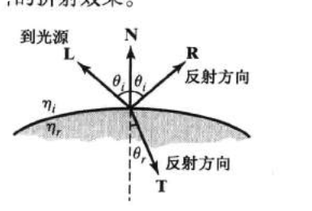

# lesson5_透明物体的渲染

## 1、透明物体的概念与引入

什么是透明物体？比如玻璃、水、眼镜片等等，现实中这些物体都是透明的，我们可以透过其看到其后面的物体。光线入射到透明物体的表面，一部分光线被反射，一部分光线被折射。光线在不同介质中的传播速度不同，（介绍折射率）我们将介质的折射率$\eta_i$定义为$\frac{c}{v}$，其中$c$是真空中光速，$v$是介质中的光速。

如下图所示，入射角与折射角之间的关系由Snell定律给出：
$$
\frac{\sin\theta_r}{\sin\theta_i}=\frac{\eta_i}{\eta_r}
$$

其中，$\theta_i$是入射角，$\theta_r$是折射角，$\eta_i$是入射介质的折射率，$\eta_r$是折射介质的折射率。

使用光线追踪（后面章节会展开讲解）可以很好的模拟透明物体的渲染效果，但是光线追踪的计算量较大，不适合实时渲染（如大多数手游不适合光线追踪）。在实时渲染中，我们通常不考虑折射。这个方法假设所有介质的折射率都是一样的，这样折射角总是与入射角相等。

对于很薄的表面来说，效果其实是可以接受的。现在我们先做简化，不考虑折射，只考虑透明度。这种情况下，我们可以使用透明系数/透明度来模拟透明物体的效果。

透明度是一个在0到1之间的值，0表示完全透明，1表示完全不透明。

(可以搞一张图，alpha 0 -1  物体从不透明到透明，三角形也行)

问题引入：拿着我们现有的渲染器，能解决半透明物体的渲染吗？

现在还不能，因为在渲染透明物体时，我们还需要考虑透明物体的渲染顺序、透明度测试、透明度混合等问题。

## 2、渲染顺序

### 2.1、回顾深度测试与不透明物体的渲染顺序

  上一节课lesson4_深度测试、深度缓冲与深度图 实际上与这节课紧密相关，在上一节课中，我们学习了深度测试的基本原理，以及如何使用深度测试来解决**不透明物体**的渲染问题。

  从下面的示意视频可以更清晰看出，对于不透明物体来说，不论先渲染哪个物体，都会让深度最近的物体覆盖深度较远的物体。因此，**渲染顺序是不影响不透明物体的渲染结果的**。

  先渲染深度更深的三角形（蓝色）再渲染深度近的的三角形（黄色）。

<video src="lesson5视频演示/DepthTestZWriteZTestSeq.mp4"></video>

先渲染深度更近的三角形（黄色）再渲染深度深的的三角形（蓝色）。

<video src="lesson5视频演示/DepthTestZWriteZTestSeq2.mp4"></video>

但是，我们接下来要讲的如果场景中加入透明物体，那么其渲染顺序就非常重要了，会很大的影响其渲染结果。

### 2.2、加入透明物体的渲染顺序

> 要点是引出透明物体不应写入深度，用错误的结果先展示可能会更清晰。

现在，我们在场景中加入透明物体，当透明物体出现在不透明物体之前的时候，我们不能像之前一样直接替换FrameBuffer颜色缓冲中的颜色值，因为我们应该透过透明物体看到后面的不透明物体。如果我们直接替换颜色缓冲中的颜色值，那么如下图，不透明物体就会被遮挡，这样就不符合透明物体的特性了。

我们要做的是透明物体与它后面的不透明物体的颜色**混合**，然后再写入颜色缓冲。

（搞个正确的图）

记得我们上一节的深度测试吗（不记得的读者可以去复习一下），如果我们的透明物体正常进行了深度写入，

## 1.渲染顺序的重要性

最后提一下先渲染不透明，然后再渲染半透明，半透明是从远到近进行渲染。

## 3.透明度测试

## 4.透明度混合

- 开启深度写入的半透明效果

## 5.自遮挡物体的半透明效果处理

### 5.1.伪半透明效果

[Unity Shader 点阵像素剔除半透（Stipple Transparency ） - 知乎 (zhihu.com)](https://zhuanlan.zhihu.com/p/92955281)
### 5.2开启深度写入的半透明
