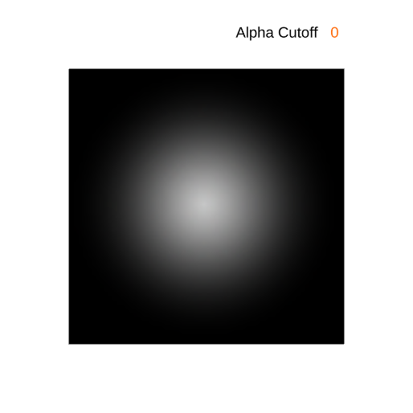

# lesson5_透明物体的渲染

## 5.1  透明物体的概念与引入

​	什么是透明物体？比如玻璃、水、眼镜片等等，现实中这些物体都是透明的，我们可以透过其看到其后面的物体。从光学原理来看，光线入射到透明物体的表面，一部分光线被反射出去，一部分光线被折射进入表面。光线在不同介质中的传播速度不同，回顾一下初中物理，我们将介质的折射率$\eta_i$定义为$\frac{c}{v}$，其中$c$是真空中光速，$v$是介质中的光速。

​	如下图所示，入射角与折射角之间的关系由Snell定律给出：
$$
\frac{\sin\theta_r}{\sin\theta_i}=\frac{\eta_i}{\eta_r}
$$


​	其中，$\theta_i$是入射角，$\theta_r$是折射角，$\eta_i$是入射介质的折射率，$\eta_r$是折射介质的折射率。

​	使用光线追踪（后面章节会展开讲解）可以很好的模拟透明物体的渲染效果，但是光线追踪的计算量较大，不适合实时渲染（如大多数手游不适合光线追踪）。在实时渲染中，我们通常不考虑折射。这时我们假设所有介质的折射率都是一样的，这样折射角总是与入射角相等。

       

​	对于很薄的表面来说，效果其实是可以接受的。现在我们先做简化，不考虑折射。但很容易观察到，不同的透明物体的透光性是不一样的，为了更好地做模拟，我们引入了**透明度**。这种情况下，我们可以使用透明系数/透明度（alpha）来模拟透明物体的效果。

​	问题引入：拿着我们现有的渲染器，能解决半透明物体的渲染吗？


## 5.2  AlphaBlending 透明度混合

​	透明度（alpha）是一个在0到1之间的值，0表示完全透明，1表示完全不透明。

​	透明度的混合通常遵循以下公式：

$$
C_{\text{result}} = C_{\text{src}} \cdot F_{\text{src}} + C_{\text{dst}} \cdot F_{\text{dst}}
$$

- 其中：
  - $C_{\text{result}}$ 是最终渲染出的颜色。
  - $C_{\text{src}}$ 是源物体的颜色（当前已经被渲染的物体颜色）。
  - $C_{\text{dst}}$ 是目标物体的颜色（已经在屏幕上的颜色）。
  - $F_{\text{src}}$ 是源因子，通常是源物体的透明度（alpha 值）。
  - $F_{\text{dst}}$ 是目标因子，通常是 $1 - F_{\text{src}}$。

​	我们就先采用**源颜色乘以源因子**的混合模式(在Unity引擎中表示为**Blend SrcAlpha OneMinusSrcAlpha**的模式)，$F_{\text{dst}} = 1 - F_{\text{src}}$，结果如下：

$$
C_{\text{result}} = C_{\text{src}} \cdot F_{\text{src}} + C_{\text{dst}} \cdot (1 - F_{\text{src}})
$$


​	假设我们现在有这么一个场景，一个蓝色的板子$(0,0,1)$，和一个绿色的正方形$(0,1,0,alpha = 0.8)$，透明度为0.8，那么我们的渲染结果如何计算呢？

$$
C_{\text{result}} = (0, 1, 0) \cdot 0.8 + (0, 0, 1) \cdot (1 - 0.8) = (0, 0.8, 0) + (0, 0, 0.2)
$$
​	计算结果：
$$
C_{\text{result}} = (0, 0.8, 0.2)
$$
​	屏幕上重叠部分的颜色是接近绿色的蓝绿色，如图：


## 5.3  透明度测试

​	在实际开发中,实现特殊的透明效果,还有一种特殊的技术叫做“透明度测试”.

​	透明度测试是一个非0即1的结果,只要片元的透明度满足某个条件,比如大于某个阈值，我们通常称为**Alpha Cutoff**（透明度阈值），就通过测试，否则就抛弃这个片元。也就是说，这个片元要么成为不透明的被看见，像不透明片元一样正常参与深度测试，深度写入。要么完全透明被抛弃不显示出来，直接不做处理。

​	透明度测试的目的是为了提高渲染效率，减少不必要的片元的计算。透明度测试的结果是决定是否要抛弃这个片元，而不是决定是否要写入颜色缓冲。




​	从上图可见，例如Alpha Cutoff 0.21表示透明度低于21%的片元被丢弃。这样，我们就可以通过透明度测试来控制透明物体的显示效果。

​	伪代码如下：

```C++
if (color.a < alphaCutoff) 
{
    discard; // 丢弃片元
}
// 否则，继续渲染片元
```


## 5.4  渲染顺序

### 5.4.1 回顾深度测试与不透明物体的渲染顺序

​	实际上与这节课与 上一节课`lesson4_深度测试、深度缓冲与深度图`紧密相关，在上一节课中，我们学习了深度测试的基本原理，以及如何使用深度测试来解决**不透明物体**的渲染问题。

​	从下面的示意视频可以更清晰看出，对于不透明物体来说，不论先渲染哪个物体，都会让深度最近的物体覆盖深度较远的物体。因此，**渲染顺序是不影响不透明物体的渲染结果的**。

​	先渲染深度更深的三角形（蓝色）再渲染深度近的的三角形（黄色）。

<video src="lesson5视频演示/DepthTestZWriteZTestSeq.mp4"></video>


​	先渲染深度更近的三角形（黄色）再渲染深度深的的三角形（蓝色）。

<video src="lesson5视频演示/DepthTestZWriteZTestSeq2.mp4"></video>


#### 优化思路

​	我们看上面那个例子，先渲染远的三角形（蓝色）再渲染近的的三角形（黄色），那么如下图对于画框处的五个像素而言，它们是两个三角形的重叠处，它们被渲染了两次。如果我们采用先渲染近的三角形（黄色）再渲染远的的三角形（蓝色），那么蓝色三角形的红框处像素就不会通过深度测试，不会被渲染，从而减少了片元着色器的计算量，提高渲染效率。


​	我们进一步设想一个场景，一个相机面向着一座人山人海的城市，但是一堵墙挡住了相机的视线，使其看不见墙后面的城市。那么，如果我们先渲染了墙，再渲染了城市，那么城市的片元无法通过深度测试，就会被舍弃不渲染。如果先渲染城市，再渲染墙，那么我们就白白浪费了不必要的计算资源来渲染最后也看不见的城市。因此，为了**提升性能**，大多数渲染器/引擎都会采用让**不透明物体使用从近到远的渲染顺序**。


### 5.4.2  加入透明物体的渲染顺序


​	如果在场景中加入透明物体，其渲染顺序要怎么样才会正确呢？

​	也我们看看不同渲染顺序下结果，

#### 5.4.2.1 多个透明物体的渲染顺序

​	那么我们假设此时有两个透明物体，如下图所示，我们观察其重叠区域：

​	绿色在上红色在上

​	可以看到，不透明物体之间的渲染顺序是非常重要的，不同顺序会导致不同的渲染结果。

​	假设场景中有绿色片的alpha为0.8，红色片的alpha为0.7，背景为白色。如果先渲染绿色，那么，屏幕上的颜色值为多少呢


​	在上面的透明度混合部分,我们已经讲了透明度混合的公式，这里我们再次重复一下：
$$
C_{\text{result}} = C_{\text{src}} \cdot F_{\text{src}} + C_{\text{dst}} \cdot (1 - F_{\text{src}})
$$

##### 场景举例

​	假设我们现在有如下一个场景，要渲染两个半透明的物体，其中红色的半透明物体离相机更近，绿色的半透明物体离相机更远，并且红色半透明物体遮挡住了绿色半透明物体的一部分。


​	接下来，我们来看一下应用两种不同的次序渲染这两个物体的效果：


##### 1）先绿色后红色


​	一个白色的背景$(1,1,1)$先和一个绿色的正方形$(0,1,0,alpha = 0.8)$，透明度为0.8，

$$
C_{\text{result\_green}} = (0, 1, 0) \cdot 0.8 + (1, 1, 1) \cdot (1 - 0.8) = (0, 0.8, 0) + (0.2, 0.2, 0.2)
$$

$$
C_{\text{result\_green}} = (0.2, 1.0, 0.2)
$$

​	屏幕上显示的颜色是接近纯绿色的颜色，如图：


​	接着将红色片叠加到绿色片上。红色片的 alpha 值为 0.7，同样按照**源颜色乘以源因子**（源颜色指的是正在被渲染的像素的颜色）的混合模式，进行计算：
$$
C_{\text{result\_final}} = C_{\text{red}} \cdot F_{\text{red}} + C_{\text{result\_green}} \cdot (1 - F_{\text{red}})
$$
​	代入数值：
$$
C_{\text{result\_final}} = (1, 0, 0) \cdot 0.7 + (0.2, 1.0, 0.2) \cdot (1 - 0.7)
$$
​	计算结果：
$$
C_{\text{result\_final}} = (0.7, 0, 0) + (0.06, 0.3, 0.06)
$$
​	最终：
$$
C_{\text{result\_final}} = (0.76, 0.3, 0.06)
$$
​	因此，最后重叠部分渲染结果是偏红的。符合红色片在上的情况：


##### 2）先红色后绿色

​	同理,
$$
C_{\text{result\_red}} = (1, 0, 0) \cdot 0.7 + (1, 1, 1) \cdot (1 - 0.7) = (0.7, 0, 0) + (0.3, 0.3, 0.3)=(1.0, 0.3, 0.3)
$$
​	然后再渲染绿色片，绿色片的 alpha 值为 0.8，同样按照**源颜色乘以源因子**的混合模式，进行计算：
$$
C_{\text{result\_final}} = C_{\text{green}} \cdot F_{\text{green}} + C_{\text{result\_red}} \cdot (1 - F_{\text{green}})
\\=(0,1,0)*0.8+(1.0, 0.3, 0.3)\cdot (1-0.8) = (0,0.8,0)+(0.2,0.06,0.06)=(0.2,0.86,0.06)
$$
​	可见最终重叠部分的颜色偏向绿色，是不符合常识的结果。重叠部分错误的渲染颜色：


​	因此对于多个透明物体，正确的渲染顺序是，先渲染深度值较大的透明物体，再渲染深度值较小的透明物体，这样的顺序才会是正确的。即对于多个透明物体，**渲染顺序是由远到近**。

​	总之，对于多个透明物体，**正确的渲染顺序应当是由远到近**。


------


#### 5.4.2.2 透明物体+不透明物体的渲染顺序

##### 1）所有物体都使用从后往前的渲染顺序

​	如果所有物体都使用从后往前的渲染顺序，不区分透明物体与不透明物体，然后透明物体的渲染都会进行透明度混合，那么渲染结果是正确的。

​	但是，我们在5.5.1 回顾深度测试与不透明物体的渲染顺序的最后提到，为了提高性能，我们希望**不透明物体采用从近到远的渲染顺序**，可是，由上一小节，我们知道，**透明物体的渲染顺序是由远到近的**，那么这两者的渲染顺序是矛盾的。所以，我们需要将透明物体和不透明物体的渲染顺序分开渲染。那么应该先渲染哪种呢？


##### 2） 先渲染透明物体，再渲染不透明物体

​	图1所示物体，不透明物体+透明物体，假设我们先渲染了透明物体，然后再渲染不透明物体。

​	按照以前的做法，照常开启不透明物体与半透明物体的深度写入，并开启了透明度混合，中间的透明物体因为先渲染（此时后面的物体还没有渲染），无法与后面的不透明物体做混合。由于中间的半透明物体写入了深度，因此我们也看不到后面的不透明物体（因为无法通过深度测试）。


​	那么，我们是不是可以尝试一下，针对透明物体关闭深度写入，这样看起来在渲染完半透明物体之后，因为它不开启深度写入，所以不会遮挡后面的不透明物体。但是，这样结果还是错的，如下图。

​	这是因为，渲染透明物体的时候，我们关闭了深度写入，那么透明物体的深度值是不会写入深度缓冲的。然后我们再渲染不透明物体，不透明物体发现，深度缓冲中没有数值，那么就会直接写入深度缓冲和颜色缓冲，覆盖了透明物体。


##### 3） 先渲染不透明物体，再渲染透明物体

​	假设我们先渲染了不透明物体，然后再渲染透明物体。首先，不透明物体写入深度缓冲和颜色缓冲。然后渲染透明物体，透明物体的深度值小于不透明物体，深度测试通过，与颜色缓冲中的值进行混合，写入颜色缓冲。效果正确。


​	综上，透明物体+不透明物体的渲染顺序是有讲究的，**正确的渲染顺序是先渲染不透明物体，再渲染透明物体。**


​	**总结**

​	因此，我们需要先渲染不透明物体，然后再渲染半透明物体，半透明是从远到近进行渲染。为了提升性能，不透明物体可以采用从近到远渲染。


## 5.5  透明物体的深度测试与深度写入


### 5.5.1 渲染透明物体开启深度测试

​	渲染透明物体时，我们正常进行深度测试，此处顺便复习一下深度测试的内容。

​	因为深度测试的结果是选择是否要抛弃这个片元，复习下图，通过了深度测试之后，无论是否开启深度写入，都会写入颜色缓冲。


​	

​	可以看到，白色不透明物体物体距离相机更近，灰色透明物体距离相机更远。


​	如图2所示，透明物体在不透明物体之后，那么它深度值更大，深度测试会抛弃透明物体的片元，不会写入颜色缓冲，这样就不会出现不透明物体被遮挡的情况。

图 2 开启深度测试       没开启深度测试


​	如果透明物体在不透明物体之前，那么它深度值更小，深度测试会通过。透明物体的片元，会与颜色缓冲中的值进行混合，写入颜色缓冲。


​	**因此深度测试是必须的,我们必须知道这个片元能否被显示出来,还是被遮挡了。**

### 5.5.2 渲染透明物体的深度写入问题

​	如果我们按照正确的渲染顺序，先渲染不透明物体，再渲染透明物体，透明物体从远到近渲染，结果似乎就是正确的，是否并不需要关注深度写入呢？


>​	透明物体和透明物体之间，由于透明物体之间的渲染顺序是由远到近的，即使开启深度写入，深度值更大更远的物体也不会覆盖深度值更小更近的物体，深度值更小的物体会与其背后的物体进行混合，写入颜色缓冲。
>
>​	以下两组场景中关闭深度写入和开启深度写入效果是一样的：
>
>
>
>​	这么看，透明物体的渲染好像真的并不需要关注深入写入？或者说，是否关闭深度写入似乎并不影响？


#### 重叠的半透明物体

​	我们来继续看以下这个场景。场景中有两个绿色和橙色的半透明面片，相互交叉。绿色面片和橙色面片各有一部分距离相机更近。


​	正确理想的情况下：


​	在**开启深度写入**的情况下：

  

图5.1							图5.2

​	可以看到，将绿色面片往靠近相机的方向移动，当绿色面片的中心点与相机的距离小于橙色面片的中心点与相机的距离时，橙色面片就会遮挡绿色面片，并且没有做混合。

​	这是因为在多数光栅化渲染器或引擎（例如Unity）中，将不透明物体进行排序是基于物体的中心点进行排序的。例如图5.2，绿色面片中心点离相机更近，因此认为绿色面片应该在橙色面片前面，按照从远到近的渲染顺序，先渲染橙色面片，再渲染绿色面片。


​																图5.3

图5.3中，在红框部分，由于**橙色面片**进行了深度写入，重叠部分的**绿色面片**就无法通过深度测试，被剔除不渲染。那么，看起来在渲染半透明物体的时候，开启深度写入会有一定问题，那么如果我们关闭了深度写入，是不是就正确了呢？


​	在**关闭深度写入**的情况下：

​	这种情况下，是否关闭深度写入就能解决呢？

​	


​									图5.4 二面片交叉，绿色面片距离相机更近	


​								图5.5 二面片交叉，绿色面片距离相机更远

​	效果依旧是错误的，出现了整个绿色面片在橙色面片前（图5.4），或者整个橙色面片在绿色面片前（图5.5）的情况。这依旧是因为在多数渲染器或引擎（例如Unity）中，将不透明物体进行排序是基于物体的中心点进行排序的，是**物体级别**，而不是**像素级别**的排序。但是至少两个面片都是透明的，虽然关闭深度写入与否都是错误的效果，但关闭深度写入的情况相比于开启深度写入在某些方面没有错得那么明显。

​	也就是说，当基于物体级别进行排序时，出现透明物体的交叉重叠问题，关闭还是开启深度写入都不能解决透明物体的渲染问题。在大多数渲染器或者引擎中（例如Unity引擎），会默认使用关闭深度写入来渲染透明物体，作为一个折中的方法。

​	那么，如何解决这个问题呢？我们可以使用像素级别的排序，如使用order-independent transparency(OIT,顺序无关的半透明渲染）技术.这是一个比较深入的问题，只是想打基础的读者可以先不用深究。

​	使用OIT就可以实现正确的半透明穿插渲染效果:


## 5.6 项目中的代码

##### 透明度混合

```C++
//目前只是简单的将颜色写入到framebuffer中，并做透明度混合
void draw_fragment(framebuffer_t* framebuffer, int index, vec4_t& color,Program* program)
{
	//start 增加透明度混合
	int transparent = program->alpha_blend;
	if (transparent == 1)
	{
		//float alpha = color.w;
		float alpha = 0.6;
		if (alpha < 1)
		{
			unsigned char dst_r = framebuffer->color_buffer[index * 4 + 0];
			unsigned char dst_g = framebuffer->color_buffer[index * 4 + 1];
			unsigned char dst_b = framebuffer->color_buffer[index * 4 + 2];
			color.x = color.x * alpha + float_from_uchar(dst_r) * (1 - alpha);
			color.y = color.y * alpha + float_from_uchar(dst_g) * (1 - alpha);
			color.z = color.z * alpha + float_from_uchar(dst_b) * (1 - alpha);
		}
	}
	
	//end
	framebuffer->color_buffer[index * 4 + 0] = float_to_uchar(color.x);
	framebuffer->color_buffer[index * 4 + 1] = float_to_uchar(color.y);
	framebuffer->color_buffer[index * 4 + 2] = float_to_uchar(color.z);
	framebuffer->color_buffer[index * 4 + 3] = float_to_uchar(color.w);
}

```


##### 渲染顺序

```C++
void SceneBuilder::test_draw_scene(Scene scene, framebuffer_t* framebuffer, Camera* camera)
{
    vector<Model*> models = scene.models;
    //渲染顺序
    
    //区分透明与非透明模型
    vector<Model*> TransModels ;//透明物体
    vector<Model*> OpaqueModels;//非透明物体
    for (int index = 0; index < models.size(); index++)
    {  // 统计非透明模型的数量
        Model* model = models[index];
        
        if (model->transparent==0)
        {
            OpaqueModels.push_back(model);
        }
        else
        {
            TransModels.push_back(model);  //renderQueue = transparent + 1 
            //break;  // 透明模型不计入
        }
    }


    //先渲染不透明物体，再渲染透明物体
    //绘制不透明模型 不需要关注顺序
    sort_models(OpaqueModels, camera_get_view_matrix(*camera));
    for (int index = 0; index < OpaqueModels.size(); index++)
	{
		Model* model = OpaqueModels[index];
        Mesh* mesh = OpaqueModels[index]->mesh;

        Program* program = OpaqueModels[index]->program;
        uniforms_blinnphong* uniforms = (uniforms_blinnphong*)program->get_uniforms();
        uniforms->light_dir = vec3_new(0.5f, 0.8f, 0.9f);
        uniforms->camera_pos = camera->position;

        uniforms->camera_vp_matrix = mat4_mul_mat4(camera_get_proj_matrix(*camera), camera_get_view_matrix(*camera));

        rasterization_tri(mesh, program, framebuffer);
	}
    //绘制透明模型
    //绘制透明物体时，应该采用先远后近的顺序
    sort_models(TransModels, camera_get_view_matrix(*camera),false);
    for (int index = 0; index < TransModels.size(); index++)
	{
		Model* model = TransModels[index];
		Mesh* mesh = TransModels[index]->mesh;

		Program* program = TransModels[index]->program;
		uniforms_blinnphong* uniforms = (uniforms_blinnphong*)program->get_uniforms();
		uniforms->light_dir = vec3_new(0.5f, 0.8f, 0.9f);
		uniforms->camera_pos = camera->position;

		uniforms->camera_vp_matrix = mat4_mul_mat4(camera_get_proj_matrix(*camera), camera_get_view_matrix(*camera));

		rasterization_tri(mesh, program, framebuffer);
	}
}
void Qsort(std::vector<Model*>& models, bool isAscending)
{
    if(isAscending)
	{
		std::sort(models.begin(), models.end(), [](Model* a, Model* b) {
			return a->distance < b->distance; // 升序排序
		});
	}
	else
	{
		std::sort(models.begin(), models.end(), [](Model* a, Model* b) {
			return a->distance > b->distance; // 降序排序
		});
	}
  
}
void SceneBuilder::sort_models(std::vector<Model*>& models, const mat4_t& view_matrix,bool isAscending)//是否是升序

{
    int num_models = models.size();  // 获取模型数量
    if (num_models > 1)
    {
        for (int i = 0; i < num_models; i++)
        {  // 遍历所有模型
            Model* model = models[i];
            vec3_t center = model->mesh->getCenter();  // 获取模型中心
            vec4_t local_pos = vec4_from_vec3(center, 1.0f);  // 转换为4D齐次坐标
            vec4_t world_pos = mat4_mul_vec4(model->transform, local_pos);  // 变换到世界坐标

            vec4_t view_pos = mat4_mul_vec4(view_matrix, world_pos);
            model->distance = -view_pos.z;  // 计算距离
        }
        Qsort(models,isAscending);  
    }
}
```


​	以及我们选择了折中方案，如果是透明物体，关闭深度写入：

```C++
for (int i = bbox.min_x; i <= bbox.max_x; i++)
{
	for (int j = bbox.min_y; j <= bbox.max_y; j++)
	{
		vec2_t p{ (float)(i + 0.5), (float)(j + 0.5) };
		vec3_t result = calculate_weights(screen_coords, p);
		if (!(result.x > 0 && result.y > 0 && result.z > 0)) continue;
		float depth = interpolate_depth(screen_depths, result);
		int screen_index = j * WINDOW_WIDTH + i;
		//Zbuffer test 深度测试
		if (depth < framebuffer->depth_buffer[screen_index])
		{
			framebuffer->depth_buffer[screen_index] = depth;
			////如果是不透明物体，进行深度写入；如果是透明物体，不进行深度写入
			if(program->alpha_blend == 0)
			{
				//深度写入
				framebuffer->depth_buffer[screen_index] = depth;
			}					
		}
		else
		{
			continue;
		}
......
```


效果：（星星和植物幽灵头上的叶子设置为不透明，植物幽灵身体设置为半透明）


（将星星也设置为半透明）


