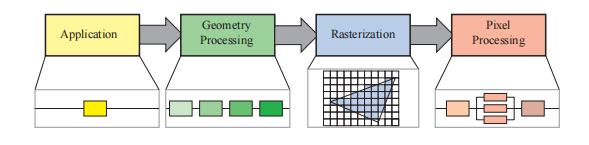

# lesson7_渲染管线

## 7.1 引入

​	在之前的课程里，我们已经学会了光栅化，空间变换，深度测试，纹理等，我们不免会产生这样的疑惑：我们该如何一步步将这些模块串联起来，完整的实现从一个三维场景出发，在屏幕上渲染出一张彩色的二维图像呢？

​	本节要讲的渲染管线就可以实现从一个三维场景出发，渲染出一张二维图像。

​	我们可以参考《Real-Time Rendering，4th》的划分方法，如下图，将渲染管线划分为四个大阶段，分别是应用阶段，几何处理阶段，光栅化阶段和片元处理阶段。

​	

这图 翻译为中文

## 7.2 应用阶段

## 7.3 几何处理阶段

## 7.4 光栅化阶段

## 7.5 片元处理阶段
