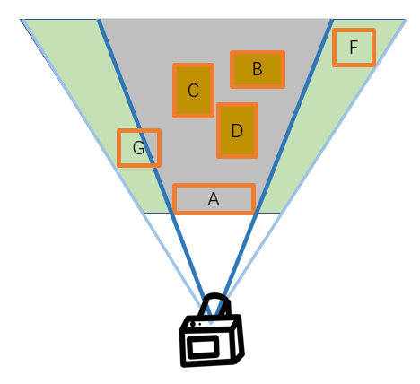

# lesson7_渲染管线

## 7.1 引入

​	在之前的课程里，我们已经学会了光栅化，空间变换，深度测试，纹理等，我们不免会产生这样的疑惑：我们该如何一步步将这些模块串联起来，完整的实现从一个三维场景出发，在屏幕上渲染出一张彩色的二维图像这整个渲染过程呢？

​	本节要讲的渲染管线可以实现从一个三维场景出发，渲染出一张二维图像。

> 直观理解：渲染管线执行一系列操作来获取场景的内容，并将这些内容显示在屏幕上。

​	我们可以参考《Real-Time Rendering，4th》的划分方法，如下图，将渲染管线划分为四个大阶段，分别是应用阶段，几何处理阶段，光栅化阶段和片元处理阶段。这是当前多数引擎/渲染器所使用的架构。在每一个阶段，渲染管线按照从上到下的次序执行每个模块。

.png)

## 7.2 应用阶段

​	假设我们要给给虚拟的三维场景中的小猫小狗们拍照，最终拍成一张照片。

​	首先，我们需要摄影师（相机）和被拍摄的小猫小狗们，还有打光师（光源）各就各位，放置在三维场景中的正确位置，即**准备好场景数据**。常见的应用阶段可以抽象出以下三个步骤：

​	（1）第一步，剔除不可见物体。为了提升性能，我们需要大致将场景中相机看不见的物体**剔除**（culling）出去，避免使用宝贵的资源渲染最后在屏幕上根本看不见的东西。

​	（2）第二步，设置渲染状态。接下来，我们需要设置这些小猫小狗们（也就是待渲染的物体）长什么样，什么颜色，身上是否有花纹，即设置材质信息，纹理信息等**渲染状态**。

​	（3）第三步，提交几何图元至GPU以供渲染。我们自然要将小猫小狗的模型网格，渲染状态传递给后续阶段，进行渲染。在多数引擎/渲染器中，接下来就需要送入GPU中进行渲染。

> **几何图元**是指在几何学中定义的基本几何形状，如点、线、面等。它们是构成更复杂几何对象的基本构件，通过它们可以描述和组合出各种几何结构和图形。

​	接下来我们会详细介绍上述的三个步骤。

### 7.2.1 剔除不可见物体

#### 7.2.1.1 棱台观察体剔除

​	在前面的空间变换中，我们知道在透视投影中，观察体是棱台。下图中的绿色部分就是棱台观察体（也有教材称为平截头体，Frustum），只有位于其中的物体会被观察到。

​	那么在这个棱台之外的物体可以被剔除掉，而不需要送入后续的渲染，优化性能。如下图棱台俯视图所示。

​	一个简单的观察体棱台剔除方法例如：将物体用AABB（轴对齐包围盒，简单理解就是用一个最小的立方体完整包围住整个物体的包围盒，后面的教程会展开介绍）包住，若物体包围盒的所有顶点都在观察体的某个面所在的平面外，说明这个物体一定在观察体之外，将其剔除。这个方法其实并不能严谨地剔除所有在观察体之外的物体，但是被剔除的物体一定不会有部分出现在观察体内(下图被剔除的物体显示为褐色)。**也就是说，可能会有观察体外的漏网之鱼没被剔除，但不会出现错判在观察体内的物体而造成剔除，因此从视觉表现上是正确的。**

#### 7.2.1.2 遮挡剔除

​	我们在之前的教程中举过一个例子，一个相机面向着一座人山人海的城市，但是一堵墙挡住了相机的视线，使其看不见墙后面的城市。我们可以在应用阶段就将墙后的城市进行剔除，来优化性能。

​	如下图，假设相机渲染众多物体时，有如下场景：

我们发现，A遮挡了其后面的B,C,D，使这三个物体不可见，那么我们可以将这三个物体剔除，优化性能。

#### 7.2.1.3 快速剔除

​	假设我们的三维场景是一个巨大的拥有20个国家的开放世界，有几万个物体，那么，我们放置的相机大概率只能看见其中的一小部分物体，如果我们使用观察体剔除一个一个判断并剔除这些物体，会带来不可估计的性能消耗。如下示意图，大部分区域都是相机不可见的（褐色方块标出）。

如果我们的相机正在国家1的路上拍照，它大概率并不需要渲染剩下19个国家的所有物体，进一步想，我们可以将三维空间划分为各个区域，不与我们的观察体棱台相交的整个区域可以尽快抛弃，而无需一个个物体进行剔除，从而进行**空间加速**，如下图。将三维空间划分为各个区域的方法有四叉树、八叉树、BSP树等等，我们在后续”空间加速“章节会展开讲解。

​																四叉树【https://en.wikipedia.org/wiki/Quadtree】

> 在计算机图形学中，空间加速是一种技术，旨在提高渲染三维场景时的性能和效率。空间加速结构是一种数据结构，用于快速执行空间查询操作，如射线与物体相交测试、碰撞检测等。常见的空间加速结构包括包围体层次结构（BVH, Bounding Volume Hierarchy）、八叉树结构和K-D树等，通过这些结构可以更有效地管理和组织场景中的对象，从而减少冗余的计算，提升图形渲染的效率。如果读者不理解这些具体的加速结构的算法，不必担心，在**光线追踪**的章节会有更详细的解释。

### 7.2.2 设置渲染状态

​	什么是渲染状态？渲染状态就是定义场景中的模型网格是如何被渲染的，包括纹理绑定，光源，材质，是否开启深度测试，透明度混合（alpha blend）选项，使用何种顶点着色器（7.3.1），片元着色器（7.5.1）等。既然我们可以进行设置，说明这是GPU管线内可以配置的参数。

​	下图三个网格使用了一样的渲染状态，因此三个网格看起来像是有了一样的材质。

### 7.2.3 提交几何图元至GPU以供渲染

​	CPU剔除不可见物体，设置渲染状态后，此时CPU就要发送几何图元给GPU，命令它我们要开始渲染了。

​	复习一下，几何图元（或成为渲染图元（rendering primitive））可以是点（点图元），线（线图元）和三角形（三角形图元），它们就是我们要进行渲染的几何物体（的最小可绘制的单元），最终这些图元会通过光栅化，变成像素，呈现在屏幕上。

​	应用阶段最重要的任务，就是CPU提交几何图元至GPU以供渲染。

>不过，我们自己实现的的小渲染器为了方便学习和调试，均使用CPU进行渲染，在后面我们会将部分可并行运算的操作移植到GPU端，以进行加速。

​	在这个步骤中，CPU会调用图像编程接口，例如OpenGL中`glDrawElements()`命令或者DirectX中的`DrawIndexedPrimitive()`命令将几何图元传递给GPU，来命令GPU执行渲染操作，这个**CPU对GPU的渲染命令**，我们称为**Draw Call**。

​	可能有读者已经了解过，GPU运算能力很强，因此，真正的拖慢速度的是CPU而不是GPU。假设这时我们要渲染一万个网格模型，那我们就需要”设置渲染状态->提交Draw Call“，重复这个步骤一万次，CPU提交Draw Call的速度相对较慢，GPU会一直处于渲染完上一个三角形，等待CPU提交下一个Draw Call的阶段。

​	假设这一万个网格模型都是使用的一样的材质，贴图等，即拥有一样的渲染状态，那么，我们是不是可以只设置一次渲染状态呢？是的，并且我们还可以通过**批处理(batching)**操作来优化这个过程，即我们在CPU的内存中将这些相同的网格模型合并模型（合并网格），这样一来，我们只需更改一次渲染状态，然后提交一次Draw Call就可以了，这样可以将性能大大提升。

## 7.3 几何处理阶段

​	我们已经知道，上一个应用阶段会提交几何图元到GPU来进行后续的例如几何处理的阶段，而在几何处理阶段会通过对输入的几何图元经过**顶点着色器，裁剪和屏幕映射**等多步处理，最终输出屏幕空间的二维顶点坐标，每个顶点的深度值、着色等信息，然后交给光栅化阶段进行处理。

​	如下图，我们将几何处理阶段划分为顶点着色器，（可选的顶点处理），裁剪和屏幕映射三个部分。

.png)

### 7.3.1 顶点着色器

​	**顶点着色器**，字如其名，是处理顶点的，它的输入是顶点（点图元），输出也是顶点，且是空间变换后位于**裁剪空间**的顶点，带有开发人员希望它携带的其他顶点信息，比如法线，纹理坐标，光照信息等。为什么能够带有”开发人员希望它携带的信息“呢，因为顶点着色器是完全**可编程**的，开发人员可以自己定义其中要对顶点进行的操作。

​	而线图元的端点是两个点图元，三角形图元的顶点是三个点图元，因此，顶点着色器变换点图元也可以看作是将所有图元进行了变换。

​	顶点着色器的主要职责是处理输入的顶点数据（点图元），通常包括：

- **顶点坐标**：这通常是在应用阶段（CPU端）从模型数据中获取的模型空间的顶点坐标。
- **其他顶点属性**：可能包括顶点的法线、纹理坐标、颜色等。开发人员可以根据需要，将这些信息传递给顶点着色器，并在顶点着色器中进行相应的处理。

​	每一个三角形的三个顶点都会被输入顶点着色器，而这里会利用到GPU的并行计算，因此需要各个顶点是互相独立的，此时无法知道某两个顶点之间是否属于同一个网格。而并行处理的速度很快。

​	处理：前面提到，顶点着色器是完全**可编辑**的，因此，开发人员在这里可以根据自己的需要计算顶点的光照，顶点的法线，顶点的颜色等等，而计算顶点的位置的步骤是必须在这步实现的，即把顶点从模型空间转换为裁剪空间。（忘记空间变换的读者可以查看前面”空间变换“的章节。）

复习一下从相机空间转为裁剪空间：

<video src="../lesson2_空间变换/lesson2视频演示/PerspectiveToOrthographicFromPer.mp4"></video>

​	当然，我们已经知道了我们可以处理顶点的位置，那么是不是也可以对其进行自定义的偏移呢？确实，我们可以在顶点着色器中对顶点进行自定义偏移或者扰动，造成比如波动，扭曲的效果，甚至是制作布料挥动，旗帜飘动等顶点动画。

​	以下这个动图就是使用顶点着色器，对顶点进行偏移，从而实现了仿佛鱼在游动，水在流动的效果。

>进阶：
>
>如果了解过Shader的读者应该会发现，这就是Shader中可以自定义编写的顶点着色器。
>
>在顶点着色器中，还会进行动画系统的蒙皮操作，从而实现复杂的**骨骼动画**，让我们的人物动起来，后续动画章节会展开。

### 7.3.2 可选的顶点处理

在顶点着色器之后，还可以选择是否进行额外的顶点处理，例如：曲面细分（tessellation），几何着色（geometry shading）等。这里为了知识的简洁性和整体的架构，不会对这部分进行扩展，感兴趣的读者可以扩展阅读例如DirectX的官方文档，LearnOpenGL的官方网站等。

> 以下进行最通俗的介绍：
>
> - **几何着色器**：几何着色器是一种在图形渲染管线中的一个阶段，几何着色器可以改变物体的形状、大小和外观，比如将一个三角形变成更复杂的几何体或者创建特殊效果。
> - **曲面细分着色器**：曲面细分着色器能够根据需求对物体进行细分，常见的需求是比如美术人员在建模的时候模型的面片数不够，很多效果难以表现出来，现代管线就可以配置这个着色器对模型的面片进行进一步细分，以增加细节。

### 7.3.3 裁剪

我们很自然的会认为，不在我们摄像机视野内的图元不会被看见，是可以直接被抛弃的。确实如此，在将顶点变换到裁剪空间后，我们可以对图元进行裁剪操作。

如图所示，图元分为：

1）完全在裁剪空间外：完全位于裁剪空间之外的图元，我们可以直接抛弃。(如上图图元A)

2）完全在裁剪空间内：完全位于裁剪空间之内的图元，我们保留。(如上图图元B)

3）部分在裁剪空间内：对于一部分在裁剪空间内，一部分在裁剪空间外的图元，我们的裁剪空间会将这个图元截断，生成新的顶点组成图元，完全位于裁剪空间外的图元会被抛弃。(如上图图元C)

通常情况下，我们也并不需要关心这个裁剪步骤是如何实现的，因为这是硬件的固定操作，通常无法，也不会进行编辑。

裁剪剩下的顶点会由硬件自动进行透视除法，进一步从裁剪空间转到NDC空间。（具体矩阵运算等可见之前的空间变换章节）

（光栅化补充这个补充章节会讲解具体的裁剪算法。）

### 7.3.4 屏幕映射

空间变换中，转为NDC空间后，应当进行窗口映射转为屏幕坐标。与空间变换相对应的，几何处理阶段的最后一个子步骤就是将NDC空间的顶点转为屏幕空间。（具体矩阵运算等可见之前的空间变换章节）

我们的屏幕左下角是$(x_1,y_1)$, 右上角是$(x_2,y_2)$。也就是我们需要将我们的NDC空间的$[-1,1]^3$的坐标映射到这个范围内，本身是一个简单的缩放过程。同时，我们的z坐标也需要映射到0-1，即我们在”深度”章节提到过的存储为0-1的非线性深度。

一般来说，屏幕的最小值会被设置为$(0,0)$。 在OpenGL中，$(0,0)$位于左下角；而在DirectX和Vulkan中，$(0,0)$位于左上角。这个差异在迁移API时需要注意。

至此，我们得到了屏幕空间的顶点坐标，每个顶点的深度值，以及其他的顶点信息，接下来就是光栅化阶段的任务了。

## 7.4 光栅化阶段

我们从几何阶段拿到了屏幕空间的顶点坐标，以及顶点的各种信息，但是假设我们此时要渲染三角形，我们仅仅知道其三个顶点的颜色是不够的，我们还希望知道这个三角形内部所有像素值的颜色。因此我们这阶段的任务就是找到（插值得到）要渲染的图元（比如三角形图元，线图元）中所有的像素值。这个过程称作为光栅化（rasterization）。

在渲染管线中，我们可以进一步将这个过程划分为三角形设置和三角形遍历阶段。

点图元和线图元一样会进入这两个阶段，只是三角形图元更常见，才会将其命名为”三角形“设置和”三角形“遍历。

.png)

整个光栅化阶段，不论是三角形设置，还是三角形遍历，都由专门的硬件单元进行执行，不可编辑。

### 7.4.1 三角形设置

​	三角形设置阶段，也称为图元装配（primitive assembly）阶段，会进行数据的准备，以便在三角形遍历阶段中使用。在前面的”光栅化“章节中我们提到，光栅化可以使用重心坐标的方式计算，也可以使用边界方程（ Edge Equations ）的算法计算。如果使用边界方程的算法，那么我们可以在三角形设置阶段中计算出每个三角形的边界方程。这些数据会在三角形遍历阶段中使用。

### 7.4.2 三角形遍历

​	三角形遍历阶段也成为扫描变换（Scan Conversion）。

​	得到了三角形设置的相关数据之后，三角形遍历会查看像素是否被三角形覆盖。如果是的话，我们就生成一个对应的**片元(fragment)**。这个片元并不单纯是一个像素，还包含了插值后的深度，屏幕坐标，从几何处理阶段传递来的法线，纹理坐标等等信息。

​	我们在前面的章节已经学过了光栅化，此时我们可以再复习一下。

​	以下视频中展示了光栅化的过程，将屏幕空间中的三个二维顶点构成的三角形，转换成屏幕上的一个个片元的过程。（且图中使用了AABB包围盒，只遍历了包围这个三角形的一个矩形区域，而不是整个屏幕）。我们可以简单的使用像素中心点来来代表这个像素，然后使用重心坐标或者边界方程来判断是否在三角形内。

<video src="视频演示/rasterization.mp4"></video>

​	对于三角形内部的点对应的片元，光栅化阶段还需要输出得它的深度，着色等数据，我们可以通过对三角形的三个顶点的属性进行插值得到。

​	但是我们不能简单地对屏幕上的三角形做重心插值，这是因为投影后三角形的形状一般情况下会发生形变。如下图观察空间中一个较宽的三角形，投影后可能变成一个特别窄的三角形（对应下图近裁剪面上的三角形），这时候计算出来的该像素的重心坐标可能与空间中该像素对应的点在三角形内的重心坐标不同，如果直接插值会导致错误的结果。因此我们需要对其做重心插值的矫正。（空间变换章节有介绍过具体的矫正算法）

## 7.5 片元处理阶段

​	上一阶段得到了位于三角形内部的片元，将作为这个像素处理阶段的输入。上阶段中我们只是对顶点信息进行了插值，得到了每个像素所拥有的插值后的深度，纹理坐标等一系列数据信息，像素处理阶段将会对这些数据进行计算，真正得到最后出现再屏幕上的颜色。

​	我们可以将像素处理阶段划分为片元着色器和合并两个阶段。如下图：

.png)

​	片元处理阶段中，片元着色器阶段是完全可编程的，合并阶段虽然不是完全可编程的，但也是高度可配置的。

### 7.5.1 片元着色器

​	和顶点着色器一样，片元着色器是一个完全可编辑的阶段。其工作是对每个像素进行光照，着色等处理。

​	片元着色器的输入是光栅化阶段插值后的像素信息，比如像素的深度，像素对应的纹理坐标，法线等等。

​	片元着色器拿着每个片元的各种信息，根据开发人员的需求，例如可以进行光照，贴纹理等操作，最后得到这个片元显示在屏幕上的最终颜色。

>如果了解过Shader的读者应该同样会发现，这就是Shader中可以自定义编写的片元着色器。

### 7.5.2 合并

​	合并（Merger）阶段是渲染管线中的最后一个阶段了，不同的教材或者文档中，也将合并阶段称为逐片元操作（Per-Fragment Operations）或者光栅运算阶段(raster operations stage，ROP)。合并阶段虽然不是完全可编程的，但也是高度可配置的。

​	经过片元着色器之后，每个片元都有了自己的最终颜色，但可惜并不是所有的片元最终都能显示在屏幕上，比如如果有的片元距离相机很远，就可能被距离相机更近的片元遮挡住，那么我们最后屏幕上就只需要输出距离相机近的片元的颜色,其实这就是合并阶段可以进行的深度测试。（我们在”深度“章节已经讲解过）。所以合并阶段是不可缺少的，合并阶段可以做的事情包括：

1）可见性问题。这一阶段可以进行**深度测试**和**模板测试**（马上会介绍模板测试）。

2）AlphaBlending 透明度混合。

#### 7.5.2.1 可见性问题

**1 深度测试**

​	我们在”深度“章节已经了解过，此处复习一下。在合并阶段，我们在渲染每个片元的时候，都会将当前片元的深度值与ZBuffer中的深度值进行比较，如果当前像素的深度值小于ZBuffer中的深度值，说明距离相机更近，那么我们就会更新ZBuffer中的深度值，并且渲染当前像素到颜色缓冲区。反之，就会抛弃这个片元不做渲染。这个过程就是**深度测试**。而**深度写入**就是将当前像素的深度值写入ZBuffer中。

​	流程如下图所示：

**优化思路**

​	在最传统的渲染管线中，确实是会像上面介绍的这样。在片元着色器计算完所有片元的颜色之后，在合并阶段，在深度测试通过之后，将颜色更新为更近的像素。不过读者可以想到，若片元着色器的计算发生在深度测试之前，那么很可能会造成浪费，明明一个像素无法通过深度测试，却还是计算了一遍颜色，这会造成计算资源的浪费。

​	我们可以回忆一下”透明物体的渲染“章节介绍的例子，如果先渲染远的三角形（蓝色）再渲染近的的三角形（黄色），那么如下图对于画框处的五个像素而言，它们是两个三角形的重叠处，它们被渲染了两次。如果我们对对深度进行排序，先渲染近的物体，再渲染远的物体（对于不透明物体来说）并提前开启深度测试，即先渲染近的三角形（黄色）再渲染远的的三角形（蓝色），那么蓝色三角形的红框处像素就不会通过深度测试，不会被渲染，从而减少了片元着色器的计算量，提高渲染效率。

​	我们进一步设想一个场景，一个相机面向着一座人山人海的城市，但是一堵墙挡住了相机的视线，使其看不见墙后面的城市。那么，如果我们先渲染了墙，再渲染了城市，如果提前开启深度测试，那么城市的片元无法通过深度测试，就会被舍弃不渲染。否则我们就白白浪费了不必要的计算资源来渲染最后也看不见的城市。因此，现代管线很多时候会把深度测试提前到片元着色器之前（我们的渲染器也是这样），这这就是early-z的思想。

2 模板测试

模板测试是一个可选的阶段，位于片元处理阶段下的“合并”阶段。

如果读者曾经接触过Photoshop等绘图软件，应该对”模板”的概念有所耳闻（有的也叫做“蒙版”，实际就是Mask）。如上图所示，我们可以拿一个模板，盖在我们的原图上面，来决定哪些片元被保留，哪些片元被丢弃。

中间的图表示的是一个**模板缓冲**，通常它的每个像素包含8个bit，即每个像素可以表示不止0或者1，还可以是256种不同的模板值。我们可以自行定义模板值为我们想要的，然后自定义规则。如果开启了**模板测试**，GPU读取模板缓冲中该片元位置的模板值，根据这个模板值和和我们读取到的参考值作比较，这个比较规则是自定义的，比如大于，等于，或者小于的时候舍弃片元。

如上图，假设此时我们的模板值在中心部分是1，形成一个圆，其他部分是0，然后我们定义片元只有在模板值是1的时候会被渲染，否则被抛弃，那么最后我们就会渲染出如图所示的只有原图中心被圆覆盖的部分通过模板测试，得到渲染。下图也是另一个形象的例子：

​										模板测试【https://learnopengl.com/Advanced-OpenGL/Stencil-testing】

#### 7.5.2.2 透明度混合

​	我们在”透明物体的渲染“章节已经了解过，此处复习一下。在正确的渲染顺序中，应当是先渲染不透明物体，然后再渲染半透明物体，半透明是从远到近进行渲染。为了提升性能，不透明物体可以采用从近到远渲染。

​	首先，不透明物体写入深度缓冲和颜色缓冲。然后渲染半透明物体，如果半透明物体的深度值小于不透明物体，深度测试通过，与颜色缓冲中的值进行混合，写入颜色缓冲。

​	混合公式可以采用：
$$
C_{\text{result}} = C_{\text{src}} \cdot F_{\text{src}} + C_{\text{dst}} \cdot (1 - F_{\text{src}})
$$

​	

至此，我们介绍完了渲染管线的每个步骤的细节。
