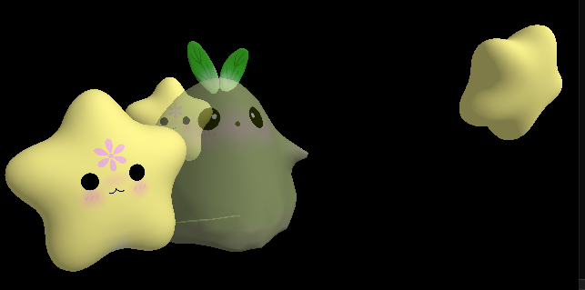
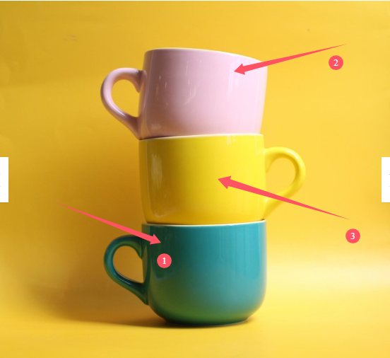
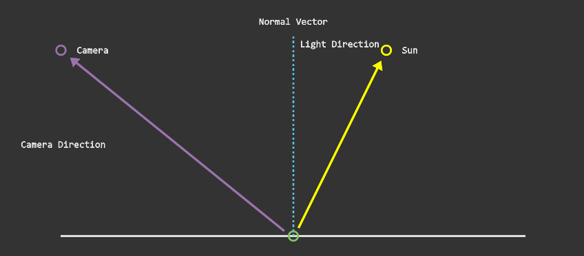
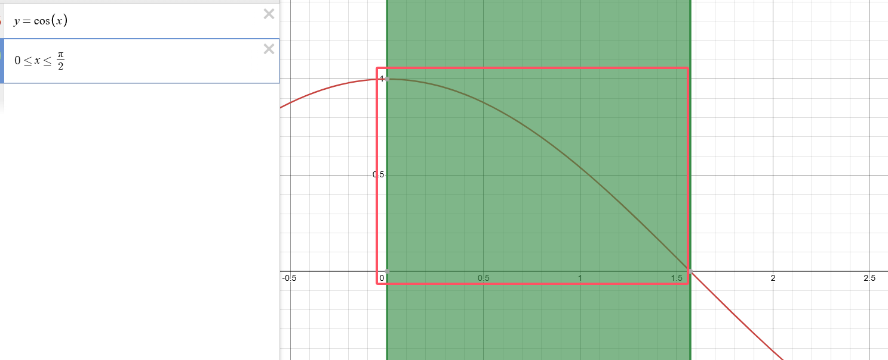
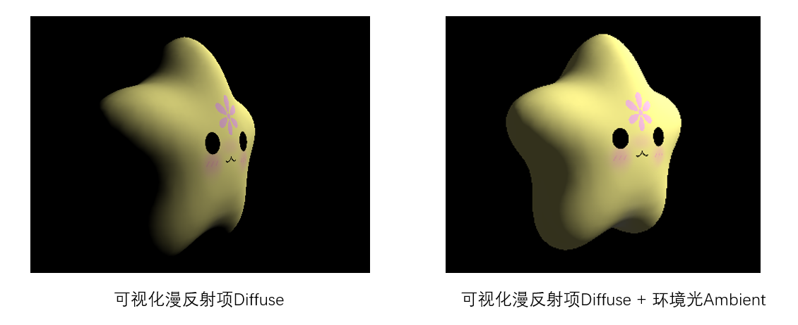
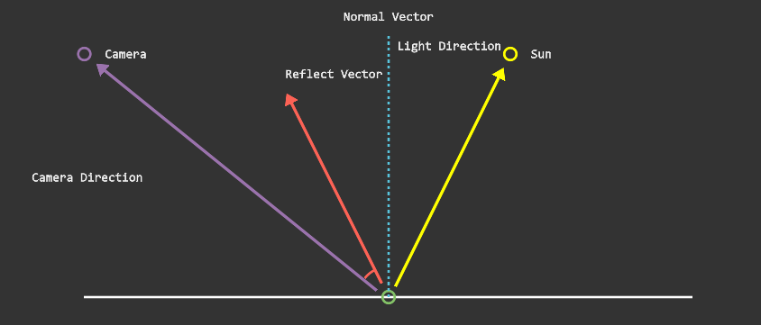
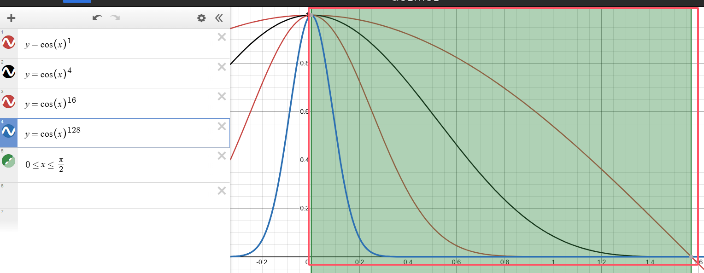
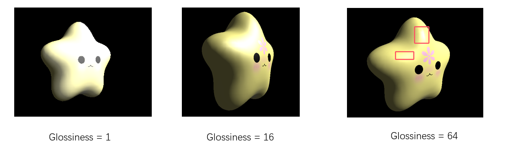
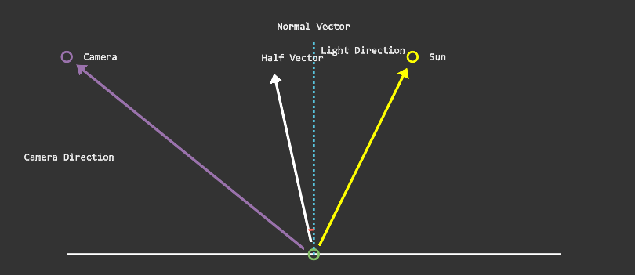
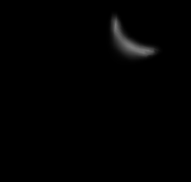

# Lesson7——基础光照（上）

​	回顾一下，在之前的章节，我们使用渲染器得到了这样的渲染结果：



​	可以看到，我们的”小星星“在光照射的地方更亮一些，在背光侧则会偏暗。实际上这非常符合我们的常识，那就是在渲染的时候一定要加入光照的相关信息。不妨看一下当没有光照系统的时候渲染同样一个场景的效果：


​	不难发现，当没有光照的时候，这个场景是缺乏”立体感“的，因此，光照必不可少。在本节中，我们会介绍最为经典的Blinn-Phong光照系统的细节，并将其实现在渲染器中，以进一步提升渲染的质量。


# 一、光照系统的拆解

## 1.光线的传播

​	在很小的时候我们就学习过，光线是按照直线传播的。暂时来看我们也认为他是正确的，这也是光栅化（包括后面的光线追踪）的理论基础。在真实场景中，我们之所以能够看见某个物体，是因为这个物体反射了光线，这些光线进入我们的眼睛，然后我们的大脑解析这些光线，最终我们看到了这个物体。一根光线打在物体上，可能会发生弹射，吸收等过程，最终抵达我们的眼睛。这里我们先不深入展开，在光线追踪部分我们会有更加深入的讲解，读者理解到这里就足够理解本节的内容了。


## 2.光照系统的拆解

观察下面这张图：



​	真实世界的光照是十分复杂的，甚至于直到今天，我们可能觉得电影和游戏中的渲染已经非常真实了，但计算机图形学依旧没有”参透“大自然的全部渲染奥秘。读者可能听说过大名鼎鼎的光线追踪技术，可以大大提升渲染的质量，而这也是在后面的课时中我们会提及的话题。但现在，不妨让我们还是用光栅化的思想来看看上面这张图（毕竟光线追踪是性能炸弹，假设你正在开发一款手游，用光线追踪技术的话很多机型是顶不住的）。我们会发现这几件事：

- （1）针对①部分，这部分并没有被光直接照到，但并不是全黑色的，这里就有环境光（ambient light）的作用。在实际光照中，环境光是十分复杂的，物体可能接收到周围物体反射的光线，例如①区域之所以不完全是黑色，有一部分原因可能是其接收到了墙面反射过来的光。同时，上图的杯子又有着光滑的表面，它也能反射出来光线给周围的物体，这些非光源直射到的部分都可以构成”环境光“。读者不妨回忆一下，其实我们很难在现实中见到一个纯黑的场景，这是因为只要附近有光源，就会有环境光，最终抵达我们眼睛的时候就不会是纯黑色的。**在本节我们讲到的经典光照模型中，我们直接暴力地将环境光设定为一个常数，用于避免全黑的场景。**
- （2）针对②部分，这部分可以被光直接照到。并且我们可以发现②的部分有一个高光，这是因为光源直射到了这个部分，同时这个表面又比较光滑，因此会形成一个局部的高光。在本节讲述的Blinn-Phong模型中，我们将这部分光称之为”镜面反射光“（specular light）；
- （3）针对③部分，这部分也可以被光直接照到，但是这个部分并没有高光，这是因为这部分相对粗糙一些，光线会被四处散射，因此不会形成高光。在本节讲述的Blinn-Phong模型中，我们将这部分光称之为”漫反射光“（diffuse light）。

​	在Blinn-Phong光照模型中，我们将这三项叠加在一起，就得到了最终的光照结果。接下来的部分我们会讨论这三部分的具体细节，以及如何在渲染器中实现。假设我们计算得到的环境光项是$L_a$，漫反射光项为$L_d$，镜面反射项为$L_s$，那么在Blinn-Phong模型中，最终光照的结果为：
$$
L = 
L_a + L_d + L_s
$$
​	这样也比较符合常理，有一个默认的环境光保证了场景不会是全黑的，漫反射光保证了物体的基础反射光的情况，而镜面反射光则保证了物体的表面会有高光。接下来我们就来逐一拆解光照系统的每一项，并将他们整合进我们的渲染器当中。

> 注意，在Blinn-Phong模型中，我们无法处理物体间相互的间接光照。这一部分要交给后面的光线追踪部分去进行讲解。Blinn-Phong模型是一个**经验模型**，其光照得到的结果并不是物理准确的，甚至也不满足能量保守定律（后面的教程会继续展开），但这是一个非常经典的光照模型，而且效果不错，非常值得我们去学习。


# 二、环境光&自发光

## 1.环境光

​	这一部分最为简单，因为在前面的讲解中我们已经提到，环境光是一个常数，用于避免全黑的场景。在Blinn-Phong模型中，我们将环境光设定为一个常数，这里我们就设定其为RGB三个通道的值。因此环境光照项可以表示为：
$$
L_a = k_aI_a
$$
​	其中$k_a$被称之为环境光系数（ambient coefficient），$I_a$则可以理解为光源抵达表面的强度，直观理解光在传播过程中会有所衰减，因此到达表面的光可能是衰减之后的。假设我们是一个红色的物体，那么我们就可以设定$k_a$是红色，而这也符合认知，因为如果一个物体表现为红色，那么是因为其反射出来的红色光比较多，进入人眼就会呈现红色。而针对漫反射项，可以不考虑光到达表面的衰减，直接设置$I_a$为一个强度系数即可（float值）。如果读者想在渲染器中加入光源的颜色等信息，那么$I_a$也可以指的是一个含有RGB项的光源颜色。


## 2.自发光

​	有时我们要渲染的物体自身还会发光，我们想要有一个自发光项（Emission）。自发光项其实和前面的环境光可以放在一起，实际上自发光项可以简单地表示为：
$$
L_e = k_e
$$
​	其中$k_e$是我们自己设定的表面自发光的颜色。在我们的渲染器中，我们把自发光项和前面计算的环境光项叠加到一起，作为最终的$L_a$项，即：
$$
L_a = L_a + L_e
$$


## 3.核心代码

​	主要的改动应该集中在光栅化阶段当中。

> 实际上也可以将光照做在顶点处理阶段中，然后在光栅化的时候对光照的着色结果做插值。具体的细节涉及到**着色频率**的概念，我们会在下一节《基础光照（下）》中进行更为详细的描述。

​	将自发光项和环境光项引入到渲染器当中，核心代码如下：
```c++
vec3_t color = material.emission; //ke
if (uniforms->ambient_intensity > 0)
{
    vec3_t ambient = material.diffuse;  //ka，material.diffuse其实就是表面的颜色，简单理解就是物体的颜色即为其反射环境光的颜色
    float intensity = uniforms->ambient_intensity; //Ia
    color = vec3_add(color, vec3_mul(ambient, intensity));
}
```

​	现在让我们的渲染器只有这部分环境光的颜色，渲染结果如下（只渲染一个物体）：


​	可以看到，环境光项可以让物体不会呈现纯黑色，这样就有了一种在黑夜中，即使没什么光源，但仍能看到物体的效果。环境光项$k_a$会与后面讲解的漫反射项和镜面反射项一起，最终构成Blinn-Phong模型的光照。


# 三、漫反射项

## 1.理论部分

​	回顾一下这张图：


​	光可以直接照到③部分，而由于③部分不是一个非常“镜面”的区域，因此光线打到表面后，我们认为其会均匀地向四面八方发射，而不是集中反射到某个区域被我们捕捉到，这种材质就被称为**漫反射材质**。现实中有很多物体都可以归类为漫反射材质，比如很多绝缘体（塑料，木头桌子）等。**如何用数学来表述漫反射材质的光学特性呢？**



​	将光照场景抽象为上图的模型，其中紫色的箭头指的是相机的方向，也就是人眼的方向$\vec{v}$，黄色的箭头是光源的方向$\vec{l}$，绿色的空心圆是要计算光照着色结果的物体表面点，蓝色的虚线则是表面的法线方向$\vec{n}$（指向上面）。按上一段所述，光线打到表面之后会往四面八方弹射，因此光照结果应该是“与视角方向无关的”，也就是不包含$\vec{v}$项。在图形学光照模型中，我们将以上向量都认为是归一化的，即向量的模为1。

> 思考一下：光照到一个漫反射材质的物体表面（比如塑料球），会有什么特点？

​	容易想到，光“直接照射”到的表面会更亮一些，而非直接照射的区域会更暗，背光侧最暗。怎么描述“光直接照射的程度”呢？**这就用到了数学中的点乘知识。**看上图，直接照到表面的光线，可以认为$\vec{l}$与$\vec{n}$是同向的，此时计算两个向量的点乘结果$\vec{l} · \vec{n}=1$，而如果光是斜着照在表面上的，也就是$\vec{n}$和$\vec{l}$的夹角比较大，那么这个点乘的结果就会较小，结果就更暗。更极端地，如果是背光侧，意味着光直接在白色的表面下面，此时$\vec{l} · \vec{n}<0$，就不应该有光照。将以上的观察总结起来，可以得到漫反射项（**又叫做Lambert项**）的数学表达：
$$
L_d = k_d(I/r^2)max(0, \vec{n} · \vec{l})
$$
​	逐项解释一下这个公式，$k_d$和之前的环境光项类似，是漫反射系数。类似的理解，表面呈现$k_d$的颜色是因为其反射了$k_d$颜色的光，因此$k_d$可以简单表示为表面的颜色。$I$指的是光源的光强度（注意，这里我们认为是**点光源**），而$I/r^2$则是点光源发出的光到达物体表面“衰减”之后的结果（实际上，这里的“衰减”并不是那么严谨，不过方便理解，点光源发出的光传播地越远，到达表面应该就越弱一些，就以“衰减”先这样理解也没什么问题）。读者可能会疑惑为什么衰减之后的结果为$I/r^2$，而不是$I/r$或者别的什么？

> **这里更为严谨的解答应该要学习到辐射度量学，不过先给出一个直观的理解，即点光源本身就是向四面八方发射的，可以理解当光传播的距离$r$固定时，其均匀照到一个半径为$r$的球体表面，而球的表面积公式为$4\pi r^2$，因此到达表面后的光应该反比于$r^2$**。如果难以理解的话也没有关系，在辐射度量学中我们还会更详细地进行介绍。

$max(0, \vec{n} · \vec{l})$是我们之前学习到的内容，即光越直射到表面，$\vec{n} · \vec{l}$越大，因此计算的结果越亮。当$\vec{n} · \vec{l}<0$时，意味着是背光侧，此时计算得到的$L_d$应该为0。其中$\vec{n} · \vec{l}=cos\theta$，$\theta$即为两个向量的夹角。复习一下$cos\theta$在$[0, \pi/2]$定义域上的函数图像，如下图：



​	$\cos\theta$函数在对应定义域内是单调递减的，这也符合我们的认知，即光线越不直射表面，表面越暗。


## 2.代码及漫反射项可视化

​	再次复习一下漫反射项的公式：
$$
L_d = k_d(I/r^2)max(0, \vec{n} · \vec{l})
$$
​	具体每一项的含义不再赘述。将以上内容写成代码其实很直观，如下：

```c++
//lambert and blinn_phong
vec3_t light_dir = vec3_normalize(uniforms->light_dir); //注意Light方向要归一化，指的是表面指向光源的方向
float n_dot_l = vec3_dot(material.normal, light_dir);
if (n_dot_l < 0)
{
	n_dot_l = 0;
}
vec3_t diffuse = vec3_mul(material.diffuse, n_dot_l);
color = vec3_add(color, diffuse); //color是之前计算得到的环境光
```

​	这里并没有把$(I/r^2)$实现进来，是因为我们假定光是类似太阳的平行光，并且是白色的光源，这样就不太用考虑衰减项了，$(I/r^2)$始终为1。对于下一部分的镜面反射项，我们使用类似的近似处理。不妨可视化一下相同场景下的diffuse项和加入环境光之后的color项：



​	很明显，我们的小星星模型变得更加立体了！同时可以观察到，如果只有漫反射项，模型的背光侧是纯黑的。而随着环境光Ambient的加入，我们保证了即使是完全的背光侧，照样可以显示出一些模型本身的颜色，视觉效果更真实一些。


# 四、镜面反射项/高光项

## 1.理论部分——Phong模型

​	在上面的教程中，我们为渲染器引入了简单的光照系统，包含环境光项和漫反射项。从上图的渲染结果可以看到，我们能够模拟“粘土”类型的材质，也就是漫反射材质。实际上，现实中还有相当多的一类材质具备镜面反射项，最简单的比如金属。我们来看一张金属的光照效果图：


​	能看到，金属材质被光照到的地方会有高亮，而我们现在的光照模型还无法做到这一点。**如何建模出光照模型中的高光项呢？**看下图：



​	虽然我们要介绍的是Blinn-Phong模型的镜面反射项，但还是有必要从传统的Phong镜面反射项出发，更加容易理解。读者可以参照生活中的经验，一束光照射到金属的表面，会出现高光。**但回忆一下，这个高光是不是和视角方向有关？**实际上我们观察到高光的现象一般只集中于某个区域，最简单的例子，如果读者身边有一把钥匙（别的有高光项的物体也是类似的，这里以钥匙为例），将其放在光源下，保持钥匙的高光面是水平的，然后逐渐从下往上平移。容易看到一个有趣的现象，当我们“斜视”钥匙的高光面时，我们可以看到很明显的高光。但当我们“平视”钥匙的高光面时，会发现高光部分不见了。

​	实际上，学过初中物理之后，这件事可能更好用数学来表达。**镜面材质**可以理解为对于入射光，其反射的光会集中于某个区域当中，而不是四面八方的散射出去。看上图，我们依旧认为$\vec{v}$是视角方向，$\vec{l}$是光源方向，$\vec{n}$是表面法线方向。与漫反射项不同的是上图的红色向量$\vec{r}$，由于表面是镜面材质，因此入射进来的光是$\vec{-l}$，依据初中物理其会“镜面反射”出去，即$\vec{r}$向量。显然，$\vec{l}$和$\vec{r}$关于法线$\vec{n}$对称，而生活常识告诉我们，$\vec{r}$是反射出来的光线，是不是我们的眼睛越靠近这根反射出来的光线，就越能看到这个高光呢？没错，所以我们暂时可以讲Phong镜面反射项写为下面的公式：
$$
L_s = k_s (I/r^2) max(0, \vec{v}·\vec{r})
$$
​	在理解了漫反射项之后，理解上面这个式子会容易一些。这里的$k_s$是镜面反射系数，如果是金属的话可以是金属的颜色，或者是我们自己定义的颜色也可以。同样，点乘结果和0取一个max值，也是为了处理背光侧无镜面反射效果这个情况。

> 截止到这里，我们已经对镜面反射项有了基本的数学建模。但还有一项没有考虑进去，那就是“高光程度”。有许多物体都具有高光项，事实上，现实中纯漫反射的材质很少，一般都会带点镜面反射项。但显然，一支笔的镜面反射高光程度肯定跟一根金条是不一样的。

​	为了解决高光程度的问题，认为引入了一个新的glossiness项，即高光项$\alpha$，修改之后的Phong光照模型如下：
$$
L_s = k_s (I/r^2) max(0, \vec{v}·\vec{r})^\alpha
$$
​	可视化一下$max(0, \vec{v}·\vec{r})^\alpha$这部分，实际上就是一个$\cos$函数的幂次方项。



​	可以对照着左图的颜色观察右边的函数图像。容易发现当高光系数$\alpha$越大时，这个函数图像越“窄”，并且衰减地越快。这就意味着，假设$\alpha$很大，就相当于视角只要和镜面反射方向“差一点”，高光项就会急速衰减，此时就可以模拟一种非常集中的高光效果，比如金属。引入了这一项之后，我们来看一下不同高光系数$\alpha$下，用渲染器渲染我们的小星星模型的对比：



​	与前面的理论部分效果一致，即高光系数越大，高光效果就越集中。

------


## 2.理论部分——Blinn-Phong模型

​	上面的Phong镜面光照模型$L_s = k_s (I/r^2) max(0, \vec{v}·\vec{r})^\alpha$已经可以体现出高光的效果了。不过随着时代的发展，现在人们更多使用的是Blinn-Phong镜面光项，如下图：



​	我们先来介绍公式。其实和Phong的镜面光项基本是一样的：
$$
L_s = k_s (I/r^2) max(0, \vec{n}·\vec{h})^\alpha
$$
​	这里的$k_s$，$I$，$\vec{n}$，$\alpha$的定义都不变，但区别在于在Phong镜面光项中，我们计算的点乘是$\vec{v}·\vec{r}$，而Blinn-Phong的镜面反射项则是$\vec{n}·\vec{h}$。这里的$\vec{h}$是什么呢？

> $\vec{h}$被称之为半程向量，其计算公式如下（这里的字母都是向量，省略向量符号）：
> $$
> \vec{h} = \frac{v+l}{||v+l||}
> $$
> 其中，$||v+l||$指的是这两个向量相加之后的向量的模，实际上就是对$v+l$向量的归一化。得到的结果就是上图的白色向量（Half Vector）。

​	读者可能会疑惑，**为什么要计算这个半程向量，难道前面那个模型的$\vec{v}·\vec{r}$出错了么？**实际上，由于本节介绍的模型本身就是经验模型，并不是严格物理正确的，人们在实践中发现Blinn-Phong镜面反射项相比Phong镜面反射项有以下优点：

- （1）Blinn-Phong 使用半角向量（half-vector）来代替 Phong 中的反射向量（reflection vector），这样减少了计算量，使得渲染速度更快；
- （2）Blinn-Phong 在处理高光反射时，会产生更广泛且更柔和的高光，看起来更加自然，更符合真实物体的外观。

​	其实就是Blinn-Phong的表现效果更好一些，更贴近人们对高光项的认知。从更容易理解的角度，$\vec{v}·\vec{r}$和$\vec{n}·\vec{h}$基本是等价的，因为我们可以想到，这两者的衰减趋势类似，并且同样都是视角离镜面反射光越近，高光效果越强烈。**在之后的实时渲染中，人们往往都不显式区分这两个点乘的结果，读者可以将他们认为是等价的，只不过Blinn-Phong渲染的更”快“，而且效果”更好看“**。


## 3.代码及高光项可视化

​	在渲染器中我们实现的是Blinn-Phong模型的高光项，如下：
$$
L_s = k_s (I/r^2) max(0, \vec{n}·\vec{h})^\alpha
$$
​	其中（以下省略向量符号）：
$$
\vec{h} = \frac{v+l}{||v+l||}
$$
​	因此，核心代码可以写为：

```c++
static vec3_t get_specular(vec3_t light_dir, vec3_t view_dir, Material_BlinnPhong material)
{
    if (!is_zero_vector(material.specular)) //material.specular对应ks项
    {
        vec3_t half_dir = vec3_normalize(vec3_add(light_dir, view_dir));
        float n_dot_h = vec3_dot(material.normal, half_dir);
        if (n_dot_h > 0)
        {
            float strength = (float)pow(n_dot_h, material.shininess);  //material.shininess对应α项
            return vec3_mul(material.specular, strength);
        }
        return vec3_new(0, 0, 0);
    }
    else
    {
		return vec3_new(0, 0, 0);
	}
}
```

​	只是可视化镜面反射项，效果如下：



​	这里假设$K_s=(1,1,1)$，即纯白色。从上图也可以看到小星星模型的高光效果。


# 四、综合的Blinn-Phong光照模型

​	综合上文所述的内容，可以得到如下的数学公式：
$$
L = 
L_a + L_d + L_s = k_aI_a + k_d(I/r^2)max(0, \vec{n} · \vec{l}) + L_s = k_s (I/r^2) max(0, \vec{n}·\vec{h})^\alpha
$$
​	这就是大名鼎鼎的Blinn-Phong光照经验模型了，主要包含环境光，漫反射项和镜面反射项。将以上三部分实现在渲染器中，并相加到一起，可以得到下图的结果：


​	很不错！我们动手将光照模型引入了渲染器当中，并最终渲染出了一个更具有立体感的模型。在接下来的课程中，我们会介绍着色频率的相关知识点。简单理解，就是我们究竟是把光照做在每个像素上，还是做在模型的顶点上，并通过之前讲的插值过程插值得到中间像素的颜色？

> **另一个还没有涉及的问题：**
>
> 容易发现虽然模型自己有了光照带来的体积感，但如果我们将模型放置在地面上，并不会产生阴影。正如本节开始时所说的，我们没有考虑到物体间的光照信息。一个没有阴影的物体放置在地面上，会有“悬浮”在地面上的错误感觉，因此还需要解决阴影的效果问题。不过这就是后话了，我们会在阴影的相关章节进一步叙述解决方案。
