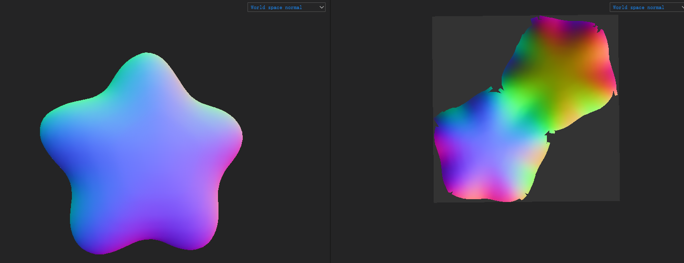
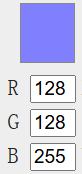
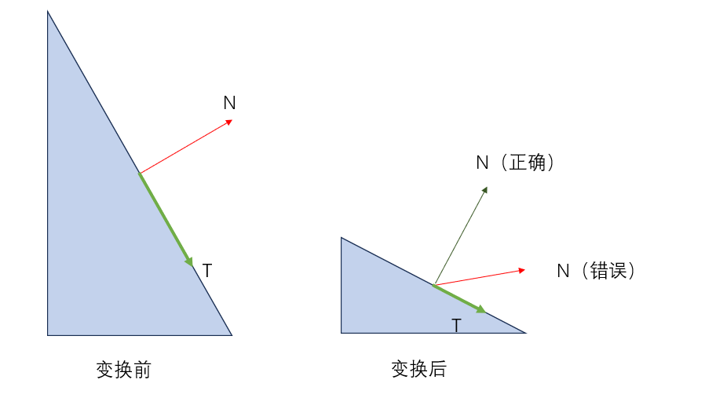

# lesson9_纹理（下）——几种特殊的纹理贴图及应用

​	在上节中，我们依次介绍了纹理贴图的概念、应用、属性，以及纹理放大和纹理缩小时遇到的问题和解决方案。实际上在图形学中，纹理贴图远不止基础纹理这么简单。例如在游戏开发中，常见的纹理贴图可能有40种以上，看起来十分复杂，但基本作用有以下几种：

- （1）**存放预计算的结果**：在实时渲染中，计算量比较大的运算很难做到及时计算完成，会成为运行的瓶颈。因此很多计算可以提前预计算好，”烘焙“成一张贴图，在渲染的时候读取贴图上的RGBA值作为数据来使用。这类贴图很常见，比如在以后的课程中我们会讲述环境光照的模拟就会用到许多预计算的贴图。
- （2）**增加渲染质量**：这点也是由于实时渲染的效率决定的。由于实时渲染有速度的要求，很多时候我们甚至希望能到60fps（帧率，每秒60帧）甚至120fps。这就要求渲染要足够快，因此可能直接渲染不容易表现出细节等信息。在本节中，我们会介绍”法线贴图“的原理，并介绍法线贴图是如何”欺骗“观众，从而为模型添加光照的细节的。
- （3）**记录数据**：最为典型的就是VAT（Vertex Animation Texture），提前在纹理中存放好每个顶点的移动数据，这样在制作顶点动画的时候就可以直接从纹理中拿到每个顶点的运动轨迹，进而做一些类似于旗帜飘动，或者破碎的效果。另外，我们也可能会把环境的信息提前存放在一张环境贴图中，这样在渲染的时候采用一些实时渲染的技术，就可以在运行时没有这个环境的同时，模拟物体在某个环境下的情况。

​	读者不难发现，以上三条其实都有降低实时渲染的计算量的考量。在本节中，我们会着重介绍两种纹理贴图，**法线贴图**和**环境贴图**，并将这两种贴图引入我们的渲染器当中。


# 一、纹理对光照系统的改善作用

## 1.回顾

​	在Blinn-Phong光照模型的相关章节中，我们介绍了环境光项，漫反射项和镜面反射项。复习一下当时的公式：
$$
L = 
L_a + L_d + L_s = k_aI_a + k_d(I/r^2)max(0, \vec{n} · \vec{l}) + k_s (I/r^2) max(0, \vec{n}·\vec{h})^\alpha
$$
​	那么，能否把纹理引入到光照模型中，加入更多的细节呢？显然是可以的，在光照模型（上）的章节中我们最后渲染出了这张图：


​	实际上这里的漫反射项中的$k_d$，即漫反射系数就取自于漫反射贴图。这张贴图长这样：


​	显然，我们在做漫反射光照的时候，伪代码应该如下：
```c++
float4 frag(varying input)
{
    float2 uv = input.uv; //片元着色器，插值之后的uv值
    float4 albedo = tex2D(_DiffuseMap, uv); //用上面的uv值对上图漫反射贴图采样，得到对应UV坐标的颜色
    float4 kd = albedo;
    float3 lightDir = GetLightDir();
    float ndotL = dot(input.normal, lightDir);
    float3 diffuse = kd * max(0, ndotL);
    return diffuse;
}
```

​	在工业界，一个模型的相关贴图往往都是由美术工作人员进行绘制的。常见的绘制贴图的软件有比如Photoshop，以及Substance Painter等等。值得注意的是，**漫反射贴图又叫做albedo贴图，在这张贴图中应该只包含基础色相关的内容，不应该将光照信息存储于这张贴图中，否则结果就会不正确。**


## 2.将高光项存储为贴图

​	对于光照章节的模型渲染来说，我们认为模型的材质是“均一的”，也就是说每个位置的镜面反射效果是类似的。但实际上，我们可以用贴图很好地控制不同区域的高光系数$k_s$，以下我们用Substance Painter软件给小星星模型绘制一张Specular贴图，如下图：


​	我们先来看这样处理之后的高光项的伪代码：
```c++
float4 frag(varying input)
{
    float2 uv = input.uv; //片元着色器，插值之后的uv值
    float4 spec = tex2D(_SpecularMap, uv); //用上面的uv值对上图镜面反射贴图采样，得到对应UV坐标的颜色
    float4 ks = spec;
    float3 lightDir = GetLightDir();
    float3 viewDir = GetViewDir();
    float3 halfDir = normalize(viewDir + lightDir);
    float3 specular = ks * pow(max(0, dot(input.normal, halfDir)), _glossiness);
    return specular;
}
```

​	在之前的光照章节中，我们默认$k_s$是白色的，或者是一个固定值，而这里我们直接从贴图中用UV坐标采样。容易想到，当采样到的$k_s=0$时，就不可能会有高光出现。通过这种方式，我们可以对高光区域有更加精细地控制。将这张贴图引入到高光中，效果如下：


​	可以看到，现在的高光区域集中在UV贴图的对应区域了，读者可以跟之前的效果图做对比，体会Specular map对渲染的精细控制。实际上，像高光贴图这种贴图常用于对光照系统的某一项做“指导作用”。比如说，我们也可以把高光系数glossiness存成贴图，在计算Blinn-Phong的高光项的时候对贴图采样，拿到高光系数。读者可以尝试在自己的渲染器中引入更多的贴图，增加渲染的细节。


# 二、法线贴图NormalMap

​	法线贴图是渲染当中一种**无比重要和常见**的贴图类型。一言以蔽之，法线贴图的作用是**通过对法线方向做偏移，欺骗光照系统，使得模型“好像”有了更多细节**。直接看在Substance Painter软件中制作一张法线贴图，贴在我们的小星星模型上的效果吧：


​	还是很有意思的，我们的模型好像直接多出了”凹凸感“。但是实际上，这个模型并没有做任何的修改，依然是普通的小星星模型，和之前的章节一样。那么法线贴图是如何神奇地做到这件事呢？我们先来看这张法线贴图长什么样：


​	很奇怪，这张贴图大部分的区域呈现蓝紫色，而且我们并不清楚这张贴图为什么能够让模型产生凹凸感呢？别急，我们一点一点来，先来讲述一下这张贴图在光照模型中的作用。根据本节最开始的回顾章节，易知对于Blinn-Phong光照模型来说，抛开视角方向和光源方向，以及常数项，只有表面法线方向会对光照效果产生影响。那么，如果我们通过一张贴图”扰动“了法线的方向，比如说模拟了物体表面有一个坑的时候的法线变化，那么在光照的时候光照模型就会严格使用偏移之后的法线，从而**就像是模型表面本来就有一个深坑一样。**这就是法线贴图的巧妙之处，我们并不需要对模型做任何的细分等操作，就可以”欺骗“观众，为模型带来更多的细节。

## 1.法线贴图的数学原理

​	简单理解了一下法线贴图的本质之后，我们先来思考第一个问题，这张贴图如何制作出来？有几种常见的思路：

- 在工业界中，例如游戏行业，往往由美术人员先在模型上做雕刻，再把雕刻出来的细节烘焙成一张法线贴图，用于在实时渲染的时候供低模（面片数比较低的模型）使用。
- 像上面这张法线贴图，是我们直接绘制出来的，Substance Painter有提供绘制法线贴图的绘制方法。

​	接下来是第二个问题，这张法线贴图为什么基本是蓝色的？如果我们把模型在模型空间或者是世界空间的法线烘焙下来，应该会得到下图的效果：



​	很好理解，因为对于整个模型来说，其法线应该各个朝向都有，所以如果把法线方向归一化后的$xyz$值转换为RGB值之后应该是五颜六色的才对，好像跟我们的蓝色贴图有不小的差距，这里就要引入一个新的概念了——**切线空间**。


### （1）切线空间

​	在法线贴图中，切线空间（Tangent Space）指的是一个局部坐标空间，它与每个表面上的顶点相关联。切线空间由三个基向量组成：切线向量（Tangent），副切线向量（Bitangent 或 Binormal），和法线向量（Normal）。这三个向量通常被用来描述表面的局部几何属性。我们不妨先来想想类似上图，把模型空间或者世界空间下的法线烘焙成贴图的**坏处**是什么，有几个常见的劣势：

- （1）假设我们有一个正方体，雕刻了这个正方体的上面的细节，并把模型空间下的法线烘焙成了贴图，那么这张法线贴图就很难有复用性，我们没办法把它直接用在一个球体上；
- （2）上侧面在模型空间的法线烘焙成了法线贴图后，没办法用在前侧面。我们要存储每个面的所有法线信息。

​	其实很好理解，因为我们存储的是模型空间的法线，即**绝对法线信息**，仅可以用于创建时的那个模型，应用到其他模型上就会出问题。而即将引入的在**切线空间下的法线贴图**则记录的是**相对法线信息**，因此具备可复用性，我们马上会看到这样做的明智之处。在这之前，我们先看看切线空间的示意图：


​	对于切线空间（切线空间针对每个顶点）来说，我们**定义**：

> 切线空间的原点就是该顶点本身，切线空间的Z轴正方向是模型顶点的法线$\vec{N}$方向，而X轴正方向（上图的$\vec{T}$）是模型顶点的切线方向，而切线空间的Y轴正方向可以由叉乘得到（复习一下高数中的叉乘知识，Y轴正向向量可以由Z轴正向向量叉乘X轴正向向量得到）：

$$
B = cross(N, T)
$$

​	这个Y轴又被称为副切线方向（bitangent）。现在回归之前的问题，**为什么法线贴图是蓝色的？**这是因为，法线贴图是定义在**切线空间**当中的，假设我们完全不对法线做任何偏移，所有顶点的法线都指向本来切线空间的Z正方向，也就是（x，y，z） = (0，0，1)，由于向量每个分量的范围是[-1，1]，而颜色的RGB范围是[0，1]，因此要做一步转换，将向量编码为颜色：
$$
y = 0.5 x + 0.5
$$
​	其中$x$就是输入的向量的单个分量，$y$则是该分量输出的颜色值。带入$(x,y,z) = (0,0,1)$，得到$(R,G,B)=(0.5,0.5,1)$。来看一下这个颜色是什么：



​	破案了，这就是法线贴图的一般颜色！这也能够解释为什么法线贴图基本都是蓝色，因为我们实际上并不会对法线偏移的太过分，所以基本都是蓝色的。


## 2.切线空间中的法线贴图的好处

​	引入切线空间中的法线贴图，有如下的好处：

- （1）自由度高。由于切线空间下的法线贴图记录的是相对法线信息，因此即使把这张贴图用到别的模型上面，也可以得到比较合理的结果。

- （2）很好做贴图复用。同样是之前提到的立方体场景，如果使用切线空间下的法线贴图，六个面就可以只是用一张法线贴图，而不用每个面都单独存储了，节省空间；

- （3）方便做UV动画。假设我们想做一个水渲染效果，用一张法线贴图做水表面的凹凸不平的效果。此时模拟水体流动的时候就可以修改采样切线空间的法线贴图的UV坐标即可，伪代码如下：
  ```c++
  float2 uv = float2(uv.x + _Time, uv.y);
  float3 normalMapColor = tex2D(_NormalMap, uv);
  float3 tangentSpaceNormal = unpack(normalMapColor);  //将颜色转换为切线空间下的法线方向
  float3 worldSpaceNormal = ConvertNormalFromTangentToWorldSpace(tangentSpaceNormal); //将切线空间下的法线方向转到世界空间，因为我们的光源方向，视角方向都是世界空间下的。
  //正常做光照模型即可
  ```

  如果法线贴图是做在模型空间的，这样做大概率会得到**完全错误的结果。**而切线空间避免了这个问题。正因为每个顶点的模型空间法线方向都不一样，因此我们记录**相对偏移**就非常便捷了。

总之，使用切线空间中的法线贴图确实好处多多，接下来我们要做的就是将其引入我们的渲染器当中。核心的步骤就是`ConvertNormalFromTangentToWorldSpace`这个函数的实现细节。


## 3.将法线贴图引入渲染器当中

​	现在又有了新的问题，我们已知法线贴图的每个颜色通道的含义了，那么在实际渲染的时候，我们要如何利用这张贴图来偏移法线，进而“欺骗”光照系统，从而“欺骗”观众呢？

> 复习一下，法线贴图的RGB通道分别存储了在切线空间下的修正后的模型顶点法线方向，默认切线空间的X的正方向是切线方向，Z的正方向是法线方向，Y的正方向由叉乘得到，被称为副切线方向。那么我们要做的事情实际上就是在正常渲染的时候**把法线信息从法线贴图里解析出来，转到世界空间，然后在世界空间下正常做光照模型，但法线方向修改为法线贴图解析之后的法线方向。**

### （1）法线变换矩阵推导

​	以上过程中最难的一个步骤是，如何将切线空间的法线转到世界空间当中？我们可以将这个过程拆解为两次变换，分别是切线空间->模型空间，以及模型空间->世界空间。我们分别求解这两个矩阵，但在这之前我们需要推导一下法线变换的矩阵。

​	在前面的空间变换章节中，我们介绍了通用的结论：

> A空间转B空间，对应矩阵为B空间下A空间XYZ三个轴竖着放。
>
>
> $$
> M_{a->b}=
> \begin{bmatrix}
> |&|&|&|\\
> \mathbf{x}_a&\mathbf{y}_a&\mathbf{z}_a&O_{a}\\
> |&|&|&|\\
> 0&0&0&1
> \end{bmatrix}
> $$
> 同理，如果是B空间转A空间，那么矩阵对应的变换矩阵应该是上面矩阵$M_{a->b}$的转置。由于对于正交矩阵（**一个结论：只包含绕XYZ轴旋转的矩阵是正交矩阵，这里不做进一步证明**）来说，逆矩阵就等于其转置矩阵，坐标轴自然是正交的，因此
> $$
> M_{b->a}=M_{a->b}^{-1}=M_{a->b}^{T}=
> \begin{bmatrix}
> |&|&|\\
> \mathbf{x}_a&\mathbf{y}_a&\mathbf{z}_a\\
> |&|&|
> \end{bmatrix}^{T}
> =
> \begin{bmatrix}
> -&\mathbf{x}_a&-\\
> -&\mathbf{y}_a&-\\
> -&\mathbf{z}_a&-
> \end{bmatrix}
> $$
>
> 

​	但注意，上面这个结论针对模型的顶点是成立的，这里我们就要扩展一下，这个结论**对法线向量依然成立么？**先考虑普通的向量，假设A点和B点都是模型的顶点，那么容易想到对于向量$\vec{AB}$来说，这个结论依旧成立。读者可以定义两个点A，B为$[x_a,y_a,z_a,1]^T$和$[x_b,y_b,z_b,1]^T$，并自行带入矩阵乘法算一下。上述结论利用矩阵的分配律很容易证明出来。

​	所以，如果向量的两端都在模型上，那么因为向量可以由两个顶点的差值得到，自然对向量的变换可以等价为对顶点的变换。**现在我们类比一下，法线可以这样做么？**看下图：

	

​	现在我们做了一个非均等缩放，观察上图，会发现如果法线跟着整个模型一起直接用$M_{a->b}$变换的话，结果是错误的（红色的错误法线），正确的应该是深绿色那根向量。那如何求得正确的法线变换矩阵呢？**观察上图同时可以发现，虽然法线直接变换是错误的，但切线跟着顶点一起变换是没有问题的。**由于切线是由两个顶点之间的差值计算得到的，因此我们**可以直接使用用于变换顶点的变换矩阵来变换切线**。这在上一个公式中已经有了一个粗略的证明。同时，我们又有一个已知的结论，那就是**顶点的法线方向已经与切线方向是垂直的。**因此，我们就可以利用这两个结论推导法线空间变换的矩阵，如下：

> 既然对顶点变换的矩阵可以对切线进行变换，那么有：
> $$
> T_b = M_{a->b}T_a
> $$
> 其中$T_a$是在A空间中的切线方向，$T_b$是在B空间中的切线方向，$M_{a->b}$就是正常的变换矩阵，在之前有推导过。**已知法线一定和切线方向垂直**,所以实际上只需要求出变换后的切线方向并求出与其垂直的向量即可。现在我们假设矩阵**G**可以将法线方向变换到**与变换后的切线垂直**，则推导过程如下：
> $$
> T_a · N_a = 0 \quad (1)\\
> T_b · N_b = (M_{a->b}T_a)·(G_{a->b}N_a) = 0 \quad (2)
> $$
> 注意，这里的$(M_{a->b}T_a),(G_{a->b}N_a)$都是变换之后的向量。由于两个向量$\vec{x}·\vec{y}$可以写为矩阵相乘的形式，即$\vec{x}·\vec{y} = X^T Y$，因此上面的（2）式可以等价为：
> $$
> (M_{a->b}T_a)·(G_{a->b}N_a) = 0 => (M_{a->b}T_a)^T(G_{a->b}N_a) = T_a^TM_{a->b}^TG_{a->b}N_a=T_a^T(M_{a->b}^TG_{a->b})N_a \quad (3)
> $$
> 上一步可以由矩阵的结合律得到。又由（1）（3），
>
> $T_a · N_a = T_a^T N_a = 0 = T_a^T(M_{a->b}^TG_{a->b})N_a$，因此可以认为$(M_{a->b}^TG_{a->b})$的结果是单位矩阵$I$，此时容易得到$G_{a->b}=(M_{a->b}^T)^{-1}$

​	从上面的推导可以看出，**变换法线的矩阵应该是普通顶点变换矩阵的转置矩阵的逆矩阵。**特别地，如果这个变换是一个正交变换（例如前面说的只包含绕XYZ轴旋转的变换），那么有$(M_{a->b}^T)^{-1}=M_{a->b}$，这时才可以用变换顶点的矩阵直接变换法线。

​	**以上这个结论非常重要，涉及到法线贴图的核心思路，希望读者务必理解并记住这个结论。**


### （2）TBN矩阵的推导

​	有了上一节法线空间变换的基础知识，我们就可以真正来计算将法线从切线空间转到世界空间的矩阵了。依据前置知识，我们需要求解出**世界空间下切线空间XYZ轴的方向**，然后竖着按列放构成矩阵，再算出这个矩阵转置的逆即可。由于切线空间转到世界空间的操作并不涉及旋转以外的操作，因此**这个矩阵是正交的。**也就是说，我们只要求出世界坐标下的切线空间的三个轴的位置，并组成下面的矩阵：
$$
\begin{bmatrix}
|&|&|\\
\mathbf{T}&\mathbf{B}&\mathbf{N}\\
|&|&|
\end{bmatrix}
$$
​	其中T，B，N分别是切线空间下的切线方向，副切线方向和法线方向在世界空间中的方向。这个方向可能不太好求，但切线空间下的切线方向，副切线方向和法线方向在**模型空间**中的方向是很容易计算的，T就对应模型顶点的切线方向，N对应模型顶点的法线方向，B则可以通过叉乘来得到。接着我们就可以再通过模型转世界空间的矩阵将法线方向转到世界空间中。以下则是将法线贴图中记录的法线转换到世界空间的代码，读者可以结合前面的推导理解一下：

```c++
float3 ConvertNormalFromTangentToWorldSpace(float3 tangentSpaceNormal, attribute input) //a2v记录模型空间的顶点法线、切线方向
{
    float3 N = input.normal;
    float3 T = input.tangent;
    float3 B = cross(N,T); //利用叉乘得到
    Matrix3X3 TBN = Matrix3X3(T,B,N); //列优先，这三个向量按列放，如上式
    Matrix3X3 objectToWorldMat = ConvertObjectToWorld(input.position); //顶点模型空间转世界空间的矩阵，由于法线此时的变换是正交的，因此这个矩阵也可以变换法线到世界空间
    Matrix3X3 res = objectToWorldMat * TBN;
    return res * tangentSpaceNormal;
}
```

​	有了以上的知识，我们就可以在渲染器当中实现法线贴图的凹凸感了！


### （3）将法线贴图引入到渲染器当中

##### （a）模型切线的引入

​	打开我们之前的小星星模型，会发现模型中有记录模型空间的顶点坐标、法线方向、UV坐标，但是并没有记录顶点的切线方向。理论上我们可以借助于UV空间的U方向和法线方向求解出模型顶点的切线方向，但**这里我们借助于建模软件，帮我们计算出模型的切线方向**，我们去Blender中将小星星模型的Obj文件导入，并在Blender导出为glTF格式（另一种模型格式），勾选**保存切线信息**，然后可以利用Github仓库中的`convertGLTFtoObj.py`文件，重新将切线的信息导入到Obj格式的文件当中，执行完毕后切线的信息类似如下：

```c++
# ext.tangent 0.915900 -0.375400 0.142100 1.0
# ext.tangent 0.900300 -0.400200 0.171300 1.0
# ext.tangent 0.900700 -0.400900 0.167300 1.0
# ext.tangent 0.900800 -0.401200 0.166100 1.0
# ext.tangent 0.901000 -0.401500 0.164100 1.0
```

> 感兴趣的读者可以去查看上述Python文件的源码，我们已经将源码和处理后的obj模型都上传到了Github上。相关的所有处理可以参考pythonScripts这个文件夹里面。

​	以上的文件中保存了模型顶点的切线信息，读者可能会疑惑为什么一个顶点的tangent属性有四个值，并且最后一个值看上去没什么用？实际上我们前面介绍bitangent副切线方向可以由`bitangent = cross(normal, tangent.xyz)`得到。但这里有一点可以补充，在某些情况下，尤其是在使用法线贴图（Normal Mapping）时，切线可能需要根据 UV 空间内的倒置进行调整。例如，如果我们的纹理坐标系统有翻转或镜像，切线的方向可能需要反转。举个例子就是比如虽然我们的模型是使用**OpenGL**的右手系创建的，但贴图却是来自于DirectX的左手系，此时纹理的Y坐标可能需要翻转。为了更好地统一这个问题，很多建模软件在输出切线的时候会增加一维w值，此时的副切线计算式就变为了：`bitangent = cross(normal, tangent.xyz) * tangent.w`。**读者可以简单理解为，在计算bitangent方向的时候，使用上式可以避免翻转带来的错误效果。**

> 如果想要了解更多，可以参考这篇讨论：https://discussions.unity.com/t/what-is-tangent-w-how-to-know-whether-its-1-or-1-tangent-w-vs-unity_worldtransformparams-w/662979/2


##### （b）在顶点着色器当中计算世界空间下的切线空间tangent和bitangent方向

​	这一步在前面有说，是为了计算TBN矩阵，核心代码为：

```c++
vec3_t input_normal = attribs->normal;
vec3_t world_normal = mat3_mul_vec3(normal_matrix, input_normal);
if (uniforms->normal_map.height > 0)
{
    mat3_t tangent_matrix = mat3_from_mat4(model_matrix);
    vec3_t input_tangent = vec3_from_vec4(attribs->tangent);
    vec3_t world_tangent = mat3_mul_vec3(tangent_matrix, input_tangent);
    vec3_t world_bitangent;

    world_normal = vec3_normalize(world_normal);
    world_tangent = vec3_normalize(world_tangent);
    world_bitangent = vec3_cross(world_normal, world_tangent);
    world_bitangent = vec3_mul(world_bitangent, attribs->tangent.w);

    varyings->normal = world_normal;
    varyings->world_tangent = world_tangent;
    varyings->world_bitangent = world_bitangent;
}
```

这里我们把切线空间的normal，tangent和bitangent的方向都转换到了世界空间，接下来就是在片元着色器当中将法线贴图中记录的切线空间的法线转换到世界空间了。


##### （c）法线从切线空间转到世界空间

回顾一下TBN矩阵：
$$
\begin{bmatrix}
|&|&|\\
\mathbf{T}&\mathbf{B}&\mathbf{N}\\
|&|&|
\end{bmatrix}
$$
所以，在片元着色器当中的`get_normal_dir`函数如下：

```c++
static vec3_t get_normal_dir(varyings_blinnphong* varyings, uniforms_blinnphong* uniforms, int backface)
{
    //添加法线贴图的相关逻辑
    vec3_t normal_dir = varyings->normal;
    if (uniforms->normal_map.height > 0) //用这种方式判断有使用法线贴图
    {
        vec4_t sample= sample2D(uniforms->normal_map, varyings->texcoord);
        vec3_t tangent_normal = vec3_new(sample.x * 2 - 1,
            sample.y * 2 - 1,
            sample.z * 2 - 1); //从法线贴图中拿到切线空间的法线值，转为[-1,1]的范围
        float bump_intensity = 1; 
        vec2_t tangent_normal_xy = vec2_new(tangent_normal.x, tangent_normal.y);
        tangent_normal_xy = vec2_mul(tangent_normal_xy, bump_intensity);  //可以让法线的偏移更大一些，没有这个逻辑也不影响
        float new_tangent_z = sqrt(1 - tangent_normal_xy.x * tangent_normal_xy.x - tangent_normal_xy.y * tangent_normal_xy.y);
        tangent_normal = vec3_new(tangent_normal_xy.x, tangent_normal_xy.y, new_tangent_z);
        mat3_t tbn_matrix = mat3_from_cols( //核心：TBN矩阵
            varyings->world_tangent,
            varyings->world_bitangent,
            varyings->normal);
        vec3_t world_normal = mat3_mul_vec3(tbn_matrix, tangent_normal); //利用TBN矩阵将法线从切线空间转到世界空间
        normal_dir = vec3_normalize(world_normal); 
    }
    else
    {
        normal_dir = vec3_normalize(varyings->normal);
	}
    return backface ? vec3_negate(normal_dir) : normal_dir;
}
```

将法线方向修改为以上函数获取到的法线方向之后，渲染得到的结果如下：


可以看到，我们成功为小星星模型添加了由法线贴图带来的细节！法线贴图在图形学当中有着非常广泛的应用，例如在游戏开发当中，可以用很少的成本来为模型增加细节，而代价只是多了一张贴图和相关的一些存储空间和矩阵运算，并不会十分消耗性能。

（我们发现，小星星的边缘有点走样（出现锯齿）了，这在”反走样“章节会介绍如果反走样（抗锯齿）。）

除了NormalMap法线贴图以外，还有其他的贴图也能改善场景渲染的效果。看上图的渲染结果，读者可能觉得模型的渲染效果虽然出来了，但背景现在是纯黑色，有一些影响观感。在接下来的小节中，我们会为场景添加”天空盒“的效果，以更好地改善渲染质量。

------

