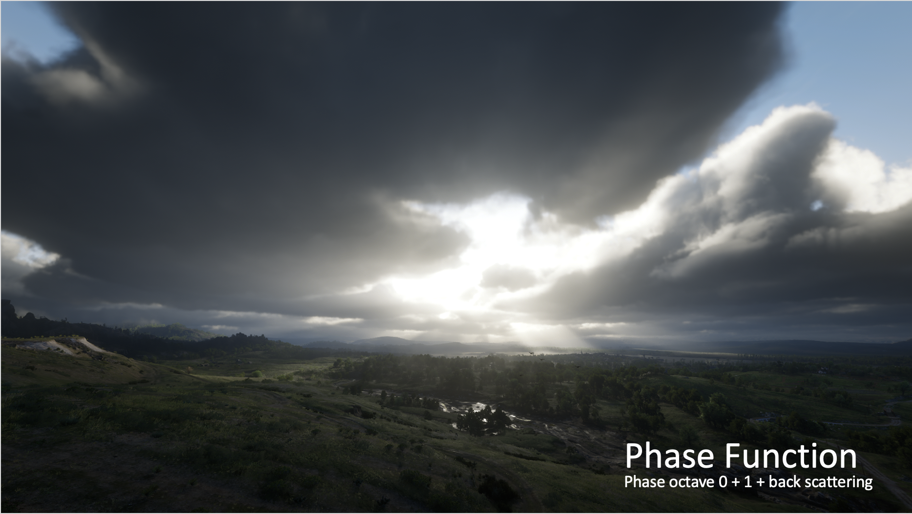

# lesson_0 导论

计算机图形学是什么？

简单来说，计算机图形学就是研究怎么在计算机中表示图形，处理图形。可以说，计算机图形学就是用算法和数学来展示虚拟世界的视觉内容。

所有电子游戏和三维动画电影中，虚拟世界中的角色，场景是如何显示在屏幕上的？这就需要计算机图形学的知识。

渲染

不同的渲染风格是如何实现的？

游戏《黑神话悟空》图源 https://www.heishenhua.com/

上图来自游戏《黑神话悟空》，场景十分逼真，要想实现这样的场景，就需要学习计算机图形学中真实感渲染的知识。

上图来自游戏《》，场景与角色看起来像漫画中画的一样，是使用计算机图形学中的非真实感渲染实现的，比如我们观察发现，这样的风格角色有可能会有描边效果增强轮廓线，色块之间过渡不明显，模仿漫画的风格。

这些不同风格的渲染应该如何实现呢？相信大家学习了计算机图形学，都会对这些渲染一定的了解。

​	图源《哪吒2》

不仅是游戏中，还有各种三维动画电影中，都需要大量计算机图形学的知识。

如上图中，场景与角色的建模，破碎的模拟等

以及很多需要特效的电影中，都需要

塞尔达 旷野之息中的天气系统

游戏《荒野大镖客2》中的体积云效果

VR

虚拟现实跳伞训练

https://zh.wikipedia.org/wiki/%E8%99%9A%E6%8B%9F%E7%8E%B0%E5%AE%9E

位于德国达姆施塔特的欧洲航天局的研究人员配备了虚拟现实耳机和运动控制器，展示了宇航员未来如何使用虚拟现实技术来训练扑灭月球栖息地内的火灾

动画

动作捕捉

https://www.bilibili.com/video/BV1Fd4y1c737/?spm_id_from=333.337.search-card.all.click&vd_source=f2def4aba42c7ed69fc648e1a2029c7b

https://www.youtube.com/watch?v=2CJ26DEu3E0

https://www.youtube.com/watch?v=2CJ26DEu3E0

物理模拟

流体模拟

来自游戏《崩坏 星穹铁道》 https://www.bilibili.com/video/BV1EF411X7PF/?share_source=copy_web&vd_source=067de257d5f13e60e5b36da1a0ec151e

布料模拟

http://min-tang.github.io/home/PCloth/

人工智能

推荐教材：

经典教材：

《Fundamentals-of-Computer-Graphics》（常被称为”虎书“，http://repo.darmajaya.ac.id/5422/1/Fundamentals%20of%20Computer%20Graphics%2C%20Fourth%20Edition%20%28%20PDFDrive%20%29.pdf）

《Real-Time Rendering》（实时渲染，https://www.realtimerendering.com/）

《Physically Based Rendering: From Theory To Implementation》（https://pbr-book.org/）

视频教程：

Games101（https://sites.cs.ucsb.edu/~lingqi/teaching/games101.html）

Games202（https://sites.cs.ucsb.edu/~lingqi/teaching/games202.html）

网站：

shadertoy（https://www.shadertoy.com/）

图形学是什么，渲染，建模，AI等  贴近生活 更多的看视频 看链接 与时俱进