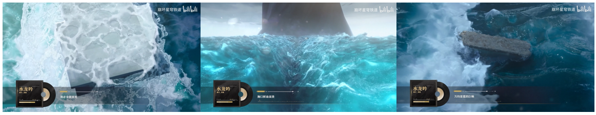

# lesson_0 导论

# 引入

学习计算机图形学，第一个问题肯定是：计算机图形学是什么？

> 简单来说，计算机图形学就是研究怎么在计算机中表示图形，处理图形。可以说，计算机图形学就是用算法和数学来展示虚拟世界的视觉内容。

举个例子，我们看到的所有电子游戏和三维动画电影中，虚拟世界中的角色，场景是如何显示在屏幕上的？这就需要计算机图形学的知识。许多行业都离不开图形学，这里我们先来举一些图形学的典型应用。

# 一、图形学的应用场景

## 1.游戏行业

游戏可能是许多人非常熟悉的图形学应用领域了，比如：

​												游戏《黑神话悟空》图源 https://www.heishenhua.com/

上图来自游戏《黑神话：悟空》，一眼看上去场景渲染的比较真实，同时角色正在做动作。如何将一个”虚拟角色“制作出来，并渲染呈现在玩家的屏幕上，实现不同的动画和各种特效，涉及到大量的计算机图形学知识，涵盖渲染、几何、模拟仿真（比如衣服摆动）、物理（和场景其他物体的碰撞）、动画系统的方方面面。

下图是《荒野大镖客2》中实现的效果非常不错的体积云，这种渲染效果可以在十几毫秒的时间呈现在玩家的屏幕上：

除了类似《黑神话：悟空》、《荒野大镖客2》这种走真实感渲染风格的游戏，还有比如走风格化渲染的游戏，例如下图为《崩坏：星穹铁道》中的游戏截图：

可以观察到，上述这样的风格有会有描边效果增强、色块之间过渡不明显等特点，像是在模仿手绘漫画风格。在学习图形学的过程中，除了涉及到真实感渲染技术的介绍（用于模拟真实世界），本系列教程还会介绍一些与非真实感渲染有关的内容。

另一款非真实感的代表性作品，《塞尔达：旷野之息》中实现了复杂的物理系统和天气系统：

针对游戏的部分，学完图形学之后，你将理解以下内容是如何实现的：

- （1）游戏制作的基本流程是什么样的？
- （2）一个角色从建模到显示在玩家的屏幕上，并实现各种动作和与玩家的交互，中间经过了什么过程？涉及到的技术又有哪些？
- （3）自然界中的各种效果（如雪，雾，云）在游戏中如何表达？一些类似于反射、阴影等效果在虚拟世界中如何表达？
- （4）如何实时实现毛发和布料的效果？
- （5）如何实现不同风格的渲染效果？比如真实感渲染和风格化的渲染（如卡通渲染）？
- （6）粒子特效和屏幕后处理效果是如何实现的？
- （7）游戏中常见的物理系统涵盖哪些图形学中的内容？

还有一些其他的内容，会逐步在后续的教程中呈现给读者。值得注意的是，游戏中往往要求**实时性**，意味着不论是物理解算、模拟还是渲染，都要求在非常短的时间内完成。以渲染为例，游戏中往往要求一个渲染feature要在最多几毫秒内渲染完成，因此在实现上和**离线渲染**相比有很多近似处理和技巧。

> **离线渲染**：在离线渲染中，渲染过程是在计算机上预先完成的，而不是实时生成的。这意味着渲染可能需要较长的时间，但可以产生更精细、更真实的效果。

## 2.动画/电影行业

最近，《**哪吒之魔童闹海**》打破了诸多的记录。

> B站上有一些与这部电影有关的解析，其中不乏部分技术点的介绍，例如：https://www.bilibili.com/video/BV16nKGezEcg/?spm_id_from=333.337.search-card.all.click&vd_source=f0e5ebbc6d14fe7f10f6a52debc41c99。

对于电影行业来说，图形学依旧是**必不可少的**。例如下图是《**哪吒之魔童闹海**》的部分细节截图：

可以看到，呈现在屏幕上给观众的画面都是从白模开始建模，并逐渐呈现给玩家的。电影行业和游戏行业所用到的图形学相关知识有一定的重合度，但正如我们前面所介绍的，电影行业更注重于**离线渲染**，因此在性能开销上可以更加奢侈一些。

下图展示了物理模拟在《**哪吒之魔童闹海**》中的应用。制作者们需要模拟出桥梁等实体破碎的过程和状态，从而使得效果更加真实，令观众信服。

除了动画电影，许多电影也将现实甚至是超现实带入到了荧幕上面。我们所看到的电影画面，许多都是利用图形学的知识”无中生有“出来的，比如下面的经典应用：

电影的后期特效生成，模型的生成、动捕，方方面面均离不开图形学。

像电影行业中非常常用的**动作捕捉技术**，感兴趣的读者可以观看以下补充材料：

> - https://www.bilibili.com/video/BV1Fd4y1c737/?spm_id_from=333.337.search-card.all.click&vd_source=f2def4aba42c7ed69fc648e1a2029c7b
> - https://www.youtube.com/watch?v=2CJ26DEu3E0
> - https://www.youtube.com/watch?v=2CJ26DEu3E0

## 3.VR/AR

VR和AR领域同样离不开图形学。

> - 虚拟现实（Virtual Reality，简称VR）是一种沉浸式的计算机生成环境，用户通过专用设备（如VR头盔或眼镜）进入一个完全虚拟的世界。在这个环境中，用户可以与虚拟对象进行交互，体验身临其境的感觉。
> - 增强现实（Augmented Reality，简称AR）是一种将虚拟信息（如图像、文本或动画）叠加到现实世界中的技术。用户通过智能手机、平板电脑或AR眼镜等设备，可以看到现实世界与虚拟内容的结合。

比如说，飞行员利用VR技术进行现实中的跳伞训练（https://zh.wikipedia.org/wiki/%E8%99%9A%E6%8B%9F%E7%8E%B0%E5%AE%9E）：

以及位于德国达姆施塔特的欧洲航天局的研究人员配备了虚拟现实耳机和运动控制器，展示了宇航员未来如何使用虚拟现实技术来训练扑灭月球栖息地内的火灾：

## 4.人工智能

随着NeRF系列和Gaussian Splatting等人工智能技术的兴起，图形学也在计算机视觉领域发光发热。本系列教程也会额外介绍图形学在人工智能中的应用。

举个简单例子，比如思考一个问题：如果给定了一些视角下的场景镜头，神经网络能否”告诉“我其他未知视角和位置观察到的场景是什么样呢？这就是NeRF所带来的贡献了，而NeRF与计算机图形学有着**极为密切的联系**。

> NeRF的官网如下：
>
> https://www.matthewtancik.com/nerf

更详细的介绍，敬请期待后续的课程内容。

## 5.其他

自然，图形学在其他领域也有很多应用，比如工业建模、数字孪生等。由于篇幅原因这里就不再额外介绍了，感兴趣的读者可以自行查阅额外的资料。

# 二、图形学的研究内容

看完了上述的一些图形学的应用场景，读者可能会思考图形学有哪些研究内容呢？这一部分，我们会介绍图形学中的部分研究课题，并分别给出每个课题的几个例子, 更多内容在本系列教程后续会继续完善：

## 1.渲染

用一句简单的话来概括渲染，即**如何用数学和物理法则在屏幕上创造逼真/风格化的光影效果。**涉及到渲染，自然就涉及到光、物体和相机三者是如何将优秀的画面展现在我们面前的。本系列教程会涵盖渲染的这些方面：

- 三角形与光栅化
- 基础光照
- 渲染管线
- 纹理映射
- 光线追踪与辐射度量学
- 路径追踪
- 实时渲染的各种技术

​													上图为一个轻量级引擎的渲染效果

## 2.几何

几何研究的是如何在计算机中表示和处理物体的形状和结构。

* 多边形网格
* 曲线与曲面
* 几何变换

## 3.物理/模拟仿真

* 流体模拟

来自游戏《崩坏 星穹铁道》 https://www.bilibili.com/video/BV1EF411X7PF/?share_source=copy_web&vd_source=067de257d5f13e60e5b36da1a0ec151e

* 布料模拟

http://min-tang.github.io/home/PCloth/

## 4.动画

动画也是计算机图形学中的一个重要领域. 

* 关键帧动画
* 骨骼动画

* 动作捕捉

## 5.人工智能

计算机与人工智能结合的情景越来越多，尤其是在生成式3D内容（3D AIGC）方面。

* 3D 模型生成
  
  * 下图为gaussian splatting
  
  
  
  * Nerf
  
* 自动动画生成

* 超分辨率

  * DLSS

# 三、如何入门/学习图形学？

除了本系列教程后续的内容，我们还推荐给读者一些额外的参考资料，供感兴趣的读者学习。

## 1.经典教材

考虑到渲染非常适合作为图形学的入门学习内容，并且非常容易吸引大家学习，有很不错的正反馈，这里主要介绍一些与渲染有关的教材：

- 《Fundamentals-of-Computer-Graphics》（常被称为”虎书“，http://repo.darmajaya.ac.id/5422/1/Fundamentals%20of%20Computer%20Graphics%2C%20Fourth%20Edition%20%28%20PDFDrive%20%29.pdf），这本书适合入门，搭配其他图形学的基础课程使用。
- 《Real-Time Rendering》（实时渲染，https://www.realtimerendering.com/），涵盖了实时渲染的方方面面，从high-level的角度进行介绍，可以帮助读者建立起实时渲染的框架。
- 《Physically Based Rendering: From Theory To Implementation》（https://pbr-book.org/），这本书的优点是介绍的非常详细，且有对应的开源代码。但**难度很大。**适合已经入门，想要进阶学习离线渲染技术的读者阅读。

## 2.视频教程

非常推荐Games的系列课程：

- Games101（https://sites.cs.ucsb.edu/~lingqi/teaching/games101.html），图形学基础，很适合入门。
- Games202（https://sites.cs.ucsb.edu/~lingqi/teaching/games202.html），相对进阶一些，涉及到**渲染中的实时渲染**技术。

## 3.其他

如果读者对于游戏行业有一定的兴趣，那么图形学和渲染开发、引擎开发、TA等岗位有着密切的关系，以下是一些推荐内容：

- shadertoy（https://www.shadertoy.com/），里面有各种神奇的效果，你可以看到一个着色器可以变出各种各样的花样；
- 《Unity Shader 入门精要》：算是技术美术的必读书目，介绍如何在游戏中实现各种渲染上的效果；
- 各个论坛和官方文档：手中常备Github，StackOverflow，其实知乎上也有很多不错的优质文章，可以辅助学习。