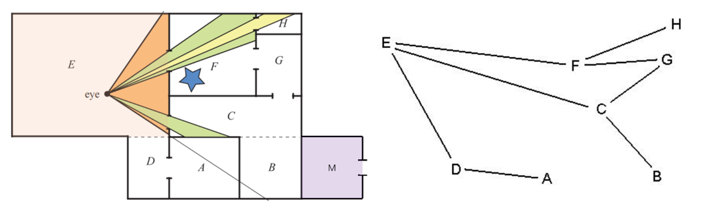

# 剔除（可见性判断）

这章节可以放在渲染管线前/后

应用阶段

## 7.2.1.1 视锥体剔除

​	在前面的空间变换中，我们知道在透视投影中，观察体是棱台。下图中的绿色部分就是视锥体，（也有教材称为棱台观察体，平截头体，Frustum），只有位于其中的物体会被观察到。

​	那么在这个视锥体之外的物体可以被剔除掉，而不需要送入后续的渲染，优化性能。如下图视锥体俯视图所示。

​	一个简单的视锥体剔除方法例如：将物体用AABB（轴对齐包围盒，简单理解就是用一个最小的立方体完整包围住整个物体的包围盒，后面的教程会展开介绍）包住，若物体包围盒的所有顶点都在观察体的某个面所在的平面外，说明这个物体一定在观察体之外，将其剔除。这个方法其实并不能严谨地剔除所有在观察体之外的物体，但是被剔除的物体一定不会有部分出现在观察体内(下图被剔除的物体显示为褐色)。**也就是说，可能会有观察体外的漏网之鱼没被剔除，但不会出现错判在观察体内的物体而造成剔除，因此从视觉表现上是正确的。**

开始讲视锥体剔除算法

那些这些的

比如转换到裁剪空间等等

##  7.2.1.3 空间加速 加速剔除

​	假设我们的三维场景是一个巨大的拥有20个国家的开放世界，有几万个物体，那么，我们放置的相机大概率只能看见其中的一小部分物体，如果我们使用观察体剔除一个一个判断并剔除这些物体，会带来不可估计的性能消耗。如下示意图，大部分区域都是相机不可见的（褐色方块标出）。

如果我们的相机正在国家1的路上拍照，它大概率并不需要渲染剩下19个国家的所有物体，进一步想，我们可以将三维空间划分为各个区域，不与我们的观察体棱台相交的整个区域可以尽快抛弃，而无需一个个物体进行剔除，从而进行**空间加速**，如下图。将三维空间划分为各个区域的方法有四叉树、八叉树、BSP树等等，我们在后续”空间加速“章节有展开讲解。

​																四叉树【https://en.wikipedia.org/wiki/Quadtree】

> 在计算机图形学中，空间加速是一种技术，旨在提高渲染三维场景时的性能和效率。空间加速结构是一种数据结构，用于快速执行空间查询操作，如射线与物体相交测试、碰撞检测等。常见的空间加速结构包括包围体层次结构（BVH, Bounding Volume Hierarchy）、八叉树结构和K-D树等，通过这些结构可以更有效地管理和组织场景中的对象，从而减少冗余的计算，提升图形渲染的效率。如果读者不理解这些具体的加速结构的算法，不必担心，在**空间加速**的章节会有更详细的解释。

## 7.2.1.2 遮挡剔除

​	就算物体在视锥体之外，也可能被别的物体所遮挡，因此我们还需要遮挡剔除。

​	我们在之前的教程中举过一个例子，一个相机面向着一座人山人海的城市，但是一堵墙挡住了相机的视线，使其看不见墙后面的城市。我们可以在应用阶段就将墙后的城市进行剔除，来优化性能。

​	如下图，假设相机渲染众多物体时，有如下场景：

我们发现，A遮挡了其后面的B,C,D，使这三个物体不可见，那么我们可以将这三个物体剔除，优化性能。

##### 基于门（portal）的剔除 

如上图所示，美术和策划可能会针对上面的房间手动标记出每个房间和其他房间的接连关系如右图。

假设我们现在位于E，然后我们去寻找与E相连接的所有的房间节点。

1、没有和E相连接的所有节点都是不可见的可以直接剔除（如M）

2、遍历与E相连的，如F，然后视锥体穿越门到F之后，会缩小(例如上图的F中绿色视锥体)，我们可以进一步对F中物体进行视锥体剔除。然后我们就会发现星星物体被这个绿色视锥体剔除了。

3、然后查找与F相连的，是H和G

​	G不会被缩小的视锥体看到，省略。

​	穿过H的门，视锥体继续缩小。

其他步骤也类似，就不赘述了。

如上图，如果蓝色条状物会透过一个房间的两个门被看到，但是它不应该被渲染两次。所以每个物体被渲染后要被标记，防止重复渲染。

https://zhuanlan.zhihu.com/p/66407205

https://zhuanlan.zhihu.com/p/403774140

### 实时

#### 距离剔除

### 离线

https://zhuanlan.zhihu.com/p/363277669

https://zhuanlan.zhihu.com/p/66407205

预计算可见性

如上图，当相机位于E区域的时候，是不可能看得到M的，而这个事情，是可以预先知道的，因此，我们可以进行遮挡剔除的**预计算**，预先进行离线计算存储场景中在某个区域，我们能看到的所有物体，将这些可见物品的集合存储下来。在运行的时候我们可以根据摄像机的位置根据之前与计算的可见性数据，快速剔除被遮挡的物体。运行的时候开销为0.

https://zhuanlan.zhihu.com/p/363277669

也就是说，我们可以预计算遮挡剔除，即通过预计算**潜在可见集（potentially visible set,PVS）**来进行。我们通过预计算潜在可见集，运行的时候查询这个集合，我们可以快速剔除绝对不可能看见的物体或者区域。

参考：

游戏引擎架构

