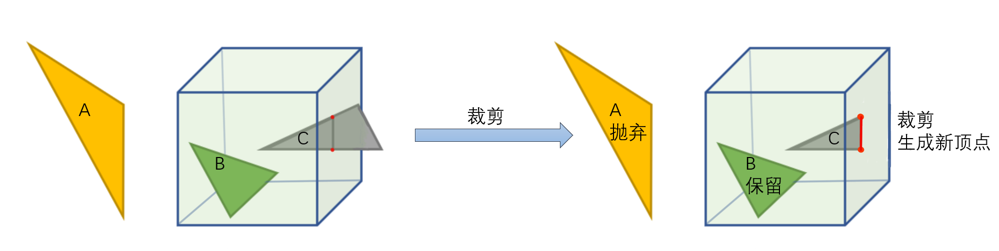
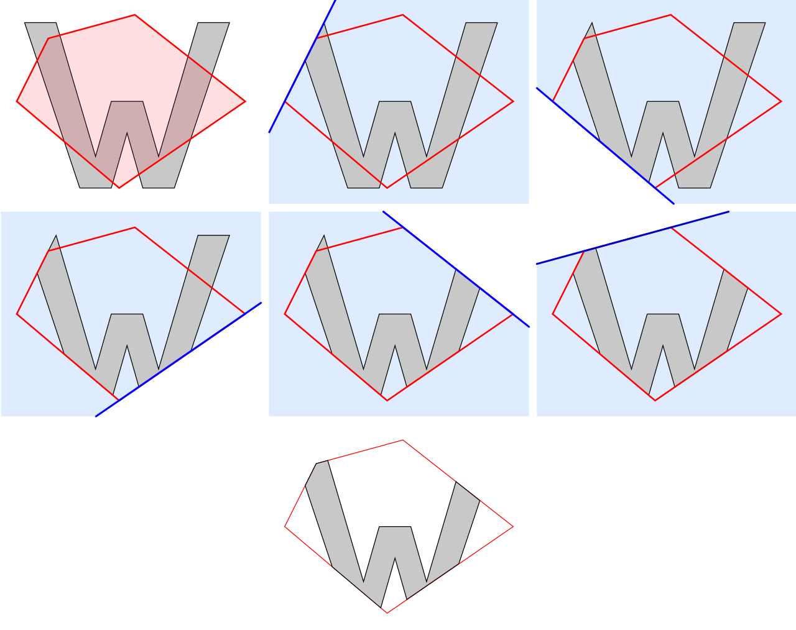
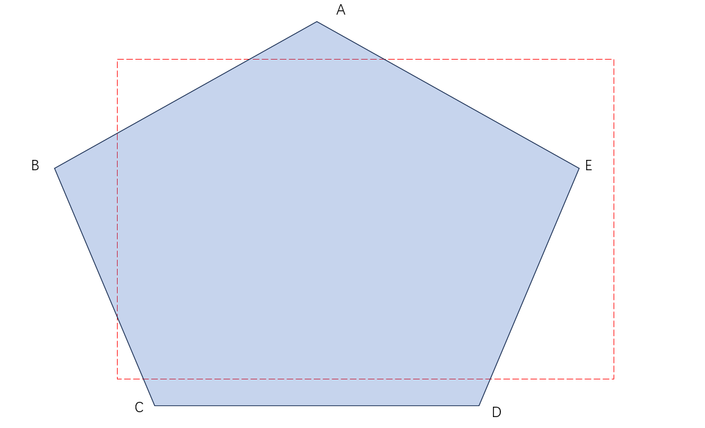
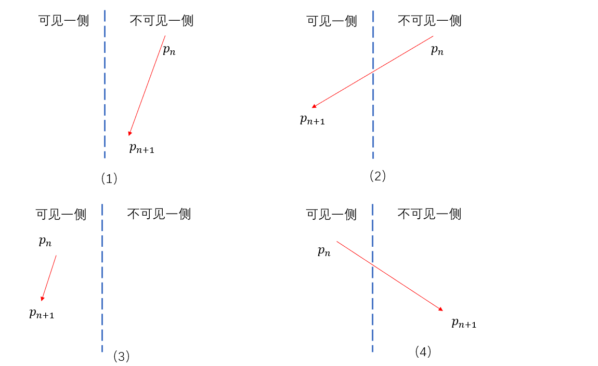
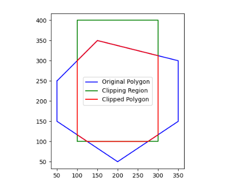

# 渲染篇补充——裁剪空间剔除

在渲染管线的章节中，我们介绍了在顶点着色器变换到裁剪空间之后，有一步裁剪的过程，如下图所示：



如图所示，图元分为：

1）完全在裁剪空间外：完全位于裁剪空间之外的图元，我们可以直接抛弃。(如上图图元A)

2）完全在裁剪空间内：完全位于裁剪空间之内的图元，我们保留。(如上图图元B)

3）部分在裁剪空间内：对于一部分在裁剪空间内，一部分在裁剪空间外的图元，我们的裁剪空间会将这个图元截断，生成新的顶点组成图元，完全位于裁剪空间外的图元会被抛弃。(如上图图元C)

通常情况下，**我们也并不需要关心这个裁剪步骤是如何实现的，因为这是硬件的固定操作，通常无法，也不会进行编辑。**但现在我们自己写了软渲染器，这就是一个值得关心的问题了，这一小节补充就用来介绍这个裁剪空间的剔除是怎么做的。

> 因为我们有自由活动的相机，所以三角形的裁剪就不能忽略了。如果不实现裁剪算法，在相机近裁剪面进入模型之后就会出现视觉上的错误效果。

而接下来要实现的算法，要解决的问题就如上面所示，针对不同情况进行剔除。


# 一、Sutherland-Hodgman算法

这是一种非常经典的裁剪算法，我们会先介绍初始的2D版本，并在渲染器中引入三维裁剪空间下的剔除方法。这个算法要解决的问题如下图所示：



> 注意：该算法只在处理凸多边形的时候比较有效，针对凹多边形的处理不够好，但由于渲染的时候基本都规定是凸多边形，所以用这个算法效果是不错的。

## 1.基本思想

一次用窗口的一条边裁剪多边形。考虑窗口的一条边以及延长线构成的裁剪线。该线把平面分成两个部分，可见一侧；不可见一侧。比如下图是我们要解决的问题：



这里的红色虚线就是裁剪窗口，五边形ABCDE则是要被裁剪的多边形。容易看出红色虚线代表的矩形的四条边的可见一侧和不可见一侧。理解Sutherland-Hodgman算法首先要理解一件事，那就是多边形的一条边相对于裁剪线只有如下几种情况（这里的$P_{n+1}$指的是当前要考虑的顶点，$P_n$是当前顶点之前的顶点，$P_nP_{n+1}$则是当前要考虑的边）：



我们来依次讨论这四种情况的裁剪结果：

- （1）对于（1）来说，都在不可见一侧，输出0个顶点；
- （2）对于（2）来说，$P_n$在不可见一侧，但是$$P_{n+1}$$在可见一侧，此时输出$P_{n+1}$和与裁剪线的交点，一共两个点；
- （3）对于（3）来说，都在可见一侧，此时仅输出$P_{n+1}$；
- （4）对于（4）来说，$P_n$在可见一侧，但是$$P_{n+1}$$在不可见一侧，此时输出的是线段与裁剪线的交点。

实际上，对于线段$P_nP_{n+1}$来说，要考虑的问题就是这个线段能否“穿过”裁剪线，并且其实并不需要考虑$P_n$这个点（只需要考虑当前的点$P_{n+1}$），因为$P_n$这个点在迭代的上一轮其实已经考虑过了。


## 2.算法的实现

我们使用python来实现这个算法，方便读者理解算法本身：

### （1）判断点在一条边的内侧/外侧

我们假定窗口的边界线方向是顺时针方向，以下也会用顺时针方向来进行计算。

```python
def inside(point, edge_start, edge_end):
    """判断点是否在裁剪边的内侧"""
    x, y = point
    x1, y1 = edge_start
    x2, y2 = edge_end
    return (x2 - x1) * (y - y1) - (y2 - y1) * (x - x1) <= 0
```

使用叉乘来判断点是在一条边（edge_start，edge_end）的内侧还是外侧。


### （2）计算线段与裁剪边的交点

```python
def intersect(p1, p2, edge_start, edge_end):
    """计算线段 (p1, p2) 与裁剪边 (edge_start, edge_end) 的交点"""
    x1, y1 = p1
    x2, y2 = p2
    x3, y3 = edge_start
    x4, y4 = edge_end

    a = x2 - x1
    b = x3 - x4
    c = y2 - y1
    d = y3 - y4
    e = x3 - x1
    f = y3 - y1

    # 使用直线的参数方程求交点
    denom = a * d - b * c
    if denom == 0:  # 平行或重合
        return None

    px = (e * d - b * f) / denom
    # py = (a * f - e * c) / denom  # 使用克拉默法则求解
    resx = x1 + px * (x2 - x1)
    resy = y1 + px * (y2 - y1)
    return (resx, resy)
```

求解的基本思路是这样的：
首先，我们假设两条线段的交点是$(x',y')$，第一条线段的两个端点坐标分别为$(x_1,y_1),(x_2,y_2)$，第二条线段的两个端点坐标分别为$(x_3,y_3),(x_4,y_4)$。此时对于交点有：
$$
x' = x_1+t(x_2-x_1) = x_3 + u(x_4 - x_3) \\
y' = y_1 + t(y_2 - y_1) = y_3 + u(y_4 - y_3)
$$
我们要求解的其实就是$t$或者$u$的值，这样就可以得到最后交点的位置。具体的求导法则涉及矩阵运算和克拉默法则，这里不过多展开，感兴趣的读者可以回顾线性代数的对应章节。总之，上述代码就可以求解出交点的值。


### （3）遍历求解的过程

总的遍历求解的代码如下：

```python
output_list = polygon
# 遍历裁剪区域的每一条边
for i in range(len(clipper)):
    input_list = output_list
    output_list = []

    # 当前裁剪边,clipper是顺时针的
    edge_start = clipper[i]
    edge_end = clipper[(i + 1) % len(clipper)]

    # 遍历多边形的每一条边
    for j in range(len(input_list)):
        current_point = input_list[j]
        prev_point = input_list[(j - 1) % len(input_list)]

        # 判断点的位置
        current_inside = inside(current_point, edge_start, edge_end)
        prev_inside = inside(prev_point, edge_start, edge_end)

        if current_inside:
            if not prev_inside:
                # 从外部到内部，添加交点
                intersection = intersect(prev_point, current_point, edge_start, edge_end)
                if intersection:
                    output_list.append(intersection)
                    intersact_points.append(intersection)
            # 添加当前点
            output_list.append(current_point)
        elif prev_inside:
            # 从内部到外部，添加交点
            intersection = intersect(prev_point, current_point, edge_start, edge_end)
            if intersection:
                output_list.append(intersection)
                intersact_points.append(intersection)

return output_list
```

其中polygon指的是要被裁剪的多边形，而clipper则是用来裁剪多边形的（也就是裁剪体），最终返回的`output_list`则是裁剪后的多边形顶点列表，将其依次连接起来就可以构成最终的多边形。最终执行该算法的结果如下：



在Python中使用matplotlib画图，可以看到结果还是比较形象的。**在我们的渲染器当中也是类似的思路，只不过由于这里是三维的，因此针对上述算法的第（1）步需要修改为判断点在一个面的内侧/外侧，道理是类似的，这里不过多展开了。**

> 这部分的代码会有一些理解上的难度，如果读者感兴趣可以去Github原仓库当中进行阅读。
