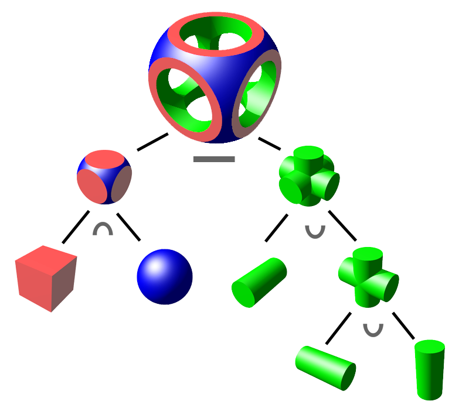
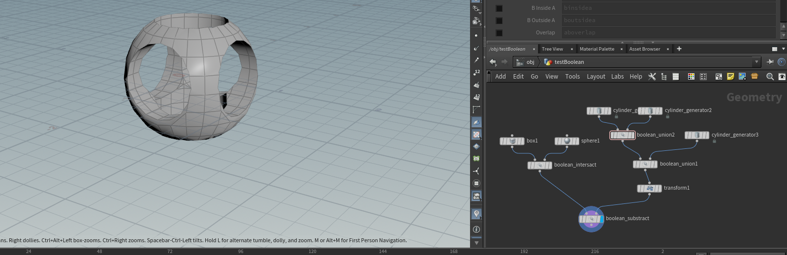

# 教程——几何篇（1）

> 注：几何部分的代码基于taichi框架来做，这样的好处是可以关注于比较复杂的算法本身，而不是C++的语法。因为这部分用C++写的话可能需要调用第三方库，可能存在配环境问题，而taichi很好配环境，具体可以参考官方仓库：https://github.com/taichi-dev/taichi


# 一、前置知识——渲染

​	在前面的光栅化渲染篇中，我们介绍了一些渲染的基本知识，好在taichi其实在渲染上已经给我们提供了足够的便利，很方便我们实现几何这部分的算法。taichi的一些简单的案例、快速上手可以参考这篇：https://docs.taichi-lang.org/docs/hello_world


# 二、几何的基本知识

​	我们在渲染部分使用了很多模型进行过渲染，比如小星星模型。读者们可以在日常使用计算机的时候看到很多模型的表达，比如说游戏里的角色模型、场景模型，电影当中的模型、VR当中周围的景物模型等等。这些模型都是几何（Geometry），但Geometry除了模型的表达方式外，还有很多别的表达方式，最简单比如一条函数图像绘制出来的曲线也可以认为是Geometry。这里我们先了解一下”几何“有哪些常见的表达形式。在本节中，我们也会重点介绍显式表达方式中的曲线表达方式（其中以贝塞尔曲线尤为出名）。

### （1）显式表示法

​	显式表示法通过明确给出几何形状的边界或轮廓来定义形状，通常涉及比如使用参数方程、顶点列表或其它可直接计算的位置关系的方法。显式几何表示是一种 **直接或间接（通过参数映射的方式）定义点、线、面等元素集合** 的方法。在显式几何表示中，各元素的位置通常由坐标值直接给出，各元素之间的关系通常由数据结构来表示。实际上，**我们之前渲染中用到的obj模型都是显式表示，因为文件中显式定义了顶点的信息，包含位置、法线等**。这种也被称之为**多边形网格**，往往由三角面片或四边形面片组成。

以下介绍一些其他的显式表达：

#### （a）参数方程

​	在高中的时候我们就学习过参数方程的表达，比如下面这个例子：
$$
F: \mathbb{R}^2 \to \mathbb{R}^3 \\
(u,v) \to (x,y,z)
$$
​	举个例子并将其绘制出来。假设我们的方程为$f(u,v)=((2+\cos{u})\cos{v},(2+\cos{u})\sin{v},\sin{u})$,读者可以发现这符合上面的参数方程表达形式。这个曲面如下：


​	这种方式比较符合我们的认知，而且采样生成对应的点也很容易。但有一个问题，那就是如果我有一个$(x,y,z)$的输出坐标，我能否快速得知这个坐标是否在曲面内/外？对于这种表达方式来说，是比较困难的。读者可以自己尝试一下，就会发现这种表达方式对于判断点在曲面内外的困难性。


#### （b）点云表达法（point cloud）

​	点云是一种常见的3D形状的表达方式，我们可以通过点云来表示一个物体或者一个场景。通过不同角度的观察点云，我们通过人眼可以分辨出点云所代表的物体的类别、猜测物体可能蕴含的功能以及通过不完整的点集来还原出物体本来的形状。点云通常由三维扫描仪获取。点云中每个点的位置（位置向量)都由一组笛卡尔坐标(X,Y,Z) 描述，有些可能还会包含色彩信息（R,G,B）或物体反射面强度（intensity）等信息。下图是一个点云的示意图：


​	可以看到，点云的表述方法是比较直观且便于理解的。点云的表达和通过点云方式的渲染也在工业界的应用，比如皮克斯的这篇技术报告：https://web.archive.org/web/20131202234149/http://www.cgsociety.org/index.php/CGSFeatures/CGSFeatureSpecial/pixar_points，感兴趣的读者可以进行阅读。显然，点云表示法也是一种显式表示法，因为我们相当于显式地指定了点云中每个点的位置。


#### （c）曲线

​	曲线也是一种几何显式表示的方法。曲线可以被定义为一系列连续的点，这些点在某个参数范围内通过数学函数连接起来。曲线可以是开放的或闭合的，比如说常见的函数图像就可以理解为一条曲线。在计算机图形学中，我们甚至可以认为**直线**也属于曲线的特殊情况。在初高中数学中，我们还有学习过类似于圆锥曲线、抛物线之类的曲线表达。在本节中，我们会介绍一种尤为出名的曲线，叫做**贝塞尔曲线（Bézier curve）**。这是一种参数化的曲线，后文会详细介绍。下图是Bézier曲线的示意图：


### （2）隐式表示法

​	隐式几何表示是一种 **使用数学关系式来描述几何形状** 的方法，并不是直接描述其顶点和边界等元素。在隐式几何表示法中，几何形状被定义为方程的解集，即满足某些条件的一组点的集合。来举一个容易理解的例子，下面的方程就是一个隐式表达的方程：
$$
f(x,y,z) = x^2 + y^2 + z^2 - 1
$$
​	容易看出，$f(x,y,z)=0$的点构成半径为1的球面的表面，而$f(x,y,z)>0$的点位于球面表面的外侧，$f(x,y,z)<0$的点位于球面表面的内侧，这也是这种表达方式的优势，我们很容易能够计算出给定点$A(x',y',z')$是在给定曲面$f(x,y,z)$的内侧还是外侧，对2D情况也是同理。以下我们具体介绍常见的隐式表达方法。

#### （a）代数曲面

​	代数曲面通过一组参数方程来定义曲线/曲面。例如上面这个例子，读者可以去Desmos网站（https://www.desmos.com/3d?lang=zh-CN）上绘制自己感兴趣的代数曲面，比如下面这个方程：
$$
\left(x^{2}+\frac{9}{4}y^{2}+z^{2}-1\right)^{3}=x^{2}z^{3\ }+\frac{9}{80}y^{2}z^{3}
$$
​	对于代数曲面来说，一个弊端就在于我们不太容易观察得到这个曲面的形状，不像显式曲面（例如前面的例子$f(u,v)=((2+\cos{u})\cos{v},(2+\cos{u})\sin{v},\sin{u})$），可以轻松得到映射关系。但代数曲面的优势就在于如果给定一个点$A(x',y',z')$，可以快速判断其在曲面的内侧/外侧。接下来揭晓谜底，上面这个代数曲面如下：


#### （b）构造实体几何（Constructive solid geometry）

​	构造实体几何允许建模人员通过使用布尔运算符组合简单的对象来创建复杂的表面或物体。看起来有点抽象，我们直接看下图：



​	最上面的就是我们要建模的物品，而上面这颗树的所有叶子节点则是最基本的几何体。构造实体几何的方法定义了三种布尔运算，分别是并（$\cup$），交（$\cap$），和差集（$-$）。从上图也可以大致看出来他们的作用，用通俗的语言来讲：

- 并：将两个几何体合并为一个（见上图右）；
- 交：找出两个几何体公共的部分（见上图左）；
- 差集：$A-B$意味着从$A$中减去包含有$B$的部分（见上图最上面）。

​	在美术建模当中，有很多软件可以帮助我们来做上面的布尔运算，而布尔运算也是**程序化建模**的重要部分。例如在Houdini当中，我们可以用布尔运算复刻上图的实现过程：



​	布尔运算的好处在于很容易理解，对于建模师来说也更容易调整。对其中某个基础几何体进行形状、位置的改变，就可以改变最后布尔运算的结果，并且很方便看到结果。


#### （c）符号距离函数（Signed Distance Function，SDF）

​	这种隐式表达的方式在计算机图形学中有着**极为重要**的应用，这里我们先简要介绍一下。在后面的章节中，我们会频繁用到SDF的思想，并逐渐深入介绍，到时候读者也会逐渐理解这种思想的绝妙之处。对于SDF来说，其可以理解为一个函数，输入是空间中的任意一个点，输出则是该点距离几何体表面的最近距离，具体来说：

- 当SDF的值大于0，表示点在几何体外部；
- 当SDF的值等于0，点在几何体的表面上；
- 当SDF的值小于0，表示点在几何体的内部；

​	同时，SDF的绝对值表示点距离几何体表面的最近距离。举个例子，用SDF的方式来表示一个球体，应该如下：

```c++
float sdSphere( in vec3 p, in float r )
{
    return length(p)-r;
}
```

​	输入SDF函数的参数分别为：$p$是一个向量，表示要求解的点相对于球心的方向向量，$r$则是球体的半径。从上面的方程可以看到，如果SDF函数小于0，说明length(p)<r，即该点在球体内；如果SDF函数大于0，说明点在球体外。同时还可以注意到，SDF返回的值的绝对值其实代表了这个点距离表面的最近距离。有了SDF之后，做**表面融合**这样的效果会简单很多。SDF在后面的光线追踪篇会有大量的应用，在下一篇教程中会有更详细的介绍。


#### （d）水平集

​	这种方法其实和上述的SDF有相似之处，见下图：


​	由于封闭形式的方程（见（a）部分）很难描述复杂的形状，所以人们发明出了一种替代方案：**存储一个值近似函数的网格（可以是二维的也可以是三维的）**，然后用插值的方式找到$f(x)=a$的点作为表面，其实比较类似于地理学上的等高线。再举一个医学上的例子，如果有一个三维的纹理表示人体不同位置的骨密度，我们可以让密度函数$f(x)$=某个具体的值$a$，然后找到所有满足这个等式的位置，就可以得到一个表面。


#### （e）分形

​	分形源于自然之美。“分形”的主要思想是截取不规则图形的一部分，当不断放大或者不断缩小时，它们看上去总是高度相似的，即“**自相似性**”。分形几何学是诞生于上世纪七十年代的一门年轻的数学分支。1978年，洛伦·卡彭特（Loren Carpenter）首次将分形的思想融入进了计算机技术，通过对最基本的几何图形三角形的不断分形迭代，描绘出了山脉模型，这可以说是分形几何学和计算机科学的初次相识。以下是一个典型的分形图案（[Mandelbrot set](https://en.wikipedia.org/wiki/Mandelbrot_set) at islands）：


​	在这部分中，我们尝试用Python+taichi绘制分形领域较为经典的谢尔宾斯基(Sierpinski)曲线。如下图：


​								（图源维基百科：https://en.wikipedia.org/wiki/Sierpi%C5%84ski_triangle）

这条曲线如何制作呢？这就体现分形的美妙之处了。我们定义以下的内容（该定义法被称为[L系统](https://zh.wikipedia.org/wiki/L系統)）：

- 变数为$A，B$：表示曲线“向前方向走”，通俗讲也可以是笔直向当前方向走；
- 常数为$+$，$-$：$-$表示左转60度，$+$表示右转60度（比如上图左上角的子图，如果我们从左下角开始走的话，中间相当于做了两次右转操作；当然如果从右下角开始走的话，相当于做了两次左转操作）
- 同时，定义运算法则：
  - $A→B-A-B$
  - $B→A+B+A$
  - 注意，这里的运算法则就是简单的字符串替换，比如$A-B$，如果我们替换$A,B$为上面的迭代式，则会变成$B-A-B-A+B+A$，不需要加括号运算，只是类似于宏替换一样的字符串替换。

有了以上的知识，就可以开始绘制上面的曲线了。定义初始的运算为$A$，从右下角开始走，那么第一轮迭代的结果应该为$B-A-B$，读者可以自行验证，正好对应上面最左上角的图（从右下角开始走），而第二轮我们分别替换$B-A-B$当中的$A,B$，可以得到（再次注意，只做字符串替换）：
$$
B-A-B=A+B+A-B-A-B-A+B+A
$$
依然假设我们从右下角开始走，读者可以比对一下上面中间那幅图，和上式是否是一致的？验证完毕之后，就可以写代码了。以下我们用Python+taichi来做，是因为taichi能够帮助我们做好一些绘制线段的操作，读者也完全可以用matplotlib这样的绘图包来绘图，思想是完全可以借鉴的。代码不长，但完全可以体现到分形之美（代码中，我们从左下角开始走，且$-$表示右转，$+$表示左转，这样比较方便写代码）：

```python
import taichi as ti
import taichi.math as tm
import math

gui = ti.GUI('Fractal Sierpinski curve', res=(900, 900))

ti.init(arch=ti.gpu)

def apply_rules(axiom, iterations):
    """Apply L-system rules for the specified number of iterations."""
    rules = {'A': 'B-A-B', 'B': 'A+B+A'}
    result = axiom

    for _ in range(iterations):
        next_result = ''.join(rules.get(char, char) for char in result)
        result = next_result

    return result

def draw_line(start, end):
    gui.line(start, end, radius=2, color=0x068587)

def sierpinski_arrowhead_curve(axiom, order, length):
    """Draw the Sierpiński arrowhead curve using the derived string."""
    instructions = apply_rules(axiom, order)

    # print instructions
    # print(instructions)

    # Initial position and angle
    pos = (0, 0)
    angle = 60

    # Draw based on the instructions
    stack = []

    for command in instructions:
        if command == 'A' or command == 'B':
            # Calculate the endpoint based on current position and angle
            end_x = pos[0] + length * math.cos(math.radians(angle))
            end_y = pos[1] + length * math.sin(math.radians(angle))
            draw_line(pos, (end_x, end_y))
            pos = (end_x, end_y)
        elif command == '+':
            angle += 60
        elif command == '-':
            angle -= 60

# Initialize variables
depth = 7  # Set the recursion depth
length = 0.0075  # Set the initial length of each line segment
axiom = 'A'  # Starting axiom

# Draw the Sierpiński arrowhead curve
while gui.running:
    gui.clear(0x0000)
    sierpinski_arrowhead_curve(axiom, depth, length)
    gui.show()
```

​	主要控制的几个参数为：

- depth：迭代的深度，不需要太大，下面展示的图片中depth取7；
- length：每条线段的长度比例，如果depth比较大的话length要相应减小一点，避免溢出屏幕；
- axiom：初始的字符，这里以‘A’为例；
- `sierpinski_arrowhead_curve`函数中的：
  - pos：初始绘制的位置，这里我们从左下角开始绘制，设定为（0，0）
  - angle：初始绘制的角度。观察上面的参考图，对于不同的depth这个angle可能是0或者60。例如在depth=7的时候，初始的angle就是60。

上面的代码最终绘制的结果如下：


​	是不是非常神奇！如果读者对其他的分形算法感兴趣的话，也可以自行查阅更多的资料，并编程实现自己的分形图案。


# 三、贝塞尔曲线/曲面

​	在前文中，我们已经介绍了几何显式表示法和隐式表示法，并分别举了一些例子。在这部分中，我们会具体介绍一种显式表达几何的方式——贝塞尔曲线。贝塞尔曲线是通过一系列控制点进行定义的曲线。对于绘制的过程而言，用户只需要改变控制点的位置，就可以修改曲线的整体走向和形状，这很方便设计师设计各种曲线出来。这一部分，我们会介绍贝塞尔曲线的定义，并在taichi中用少量的代码实现出贝塞尔曲线的效果。读者可以在Github仓库中的chapter_geometry文件夹中找到对应的Demo来运行（要配置python+taichi环境，非常简单，可以自行查找资料，一般就是`pip install`安装一个包即可）。以下是一个贝塞尔曲线的示意图：


​	其中，$P_0,P_1,P_2,P_3$是贝塞尔曲线的控制点，而实心的曲线则是由控制点生成的贝塞尔曲线。贝塞尔曲线究竟是如何用控制点生成的呢？接下来进行详细介绍。


## 1.贝塞尔曲线的原理

​	贝塞尔曲线由至少两个控制点进行描述。这里我们先以而阶贝塞尔曲线为例，方便读者理解。二阶贝塞尔曲线由3个控制点构成，分别是$P_0,P_1,P_2$。这种比较简单，我们先从它入手。在前面的教程中我们学习了插值的概念，假设给出了两个控制点$P_0,P_1$，和插值的参数$t(0<=t<=1)$，那么对于给定的$t$，可以得到$P_0$和$P_1$线性插值的中间点$P'$：
$$
P' = (1-t)P_0 + tP_1
$$
​	带入$t=0$和$t=1$，容易发现正好是$P_0$点和$P_1$点。插值对于理解贝塞尔曲线的绘制过程非常重要。我们来看一个二次贝塞尔曲线的动态绘制过程：


​	在计算机的表达中，一条曲线可以理解为是一条条间隔非常短的线段构成的（毕竟在计算机中是离散表达的），那么贝塞尔曲线其实也是由一段段“线段”首尾相连得到的。对于二次贝塞尔曲线，我们可以这样生成：

① 对于某个$t$（$t$即上文的插值系数，范围是$0-1$）,在$P_0P_1$线段上找到对应插值的结果$P_0^1$，在$P_1P_2$线段上找到对应插值的结果$P_1^1$，如下图：


②接着，对$P_0^1P_1^1$线段依据$t$的值进行第二次插值，得到$P_0^2$，这里约定右上角的角标表示插值的轮数，而右下角的角标则是当前迭代轮次插值线段的起点索引。这一步骤得到的结果如下图：


进一步地，我们0-1区间内的不同$t$值做上述的步骤，假设$t$每隔0.001绘制一个插值的点，这段代码如下（完整版的代码在Github仓库中的chapter_geometry/BezierDemos中，这个案例对应`draw_bezier_curve_2`函数）：

```python
def draw_bezier_curve_2(t):
    # 绘制贝塞尔曲线
    if t > 1 or t < 0:
        return
    center_bezier = [np.array(center) for center in centers]
    p01 = (1.0 - t) * center_bezier[0] + t * center_bezier[1]
    p11 = (1.0 - t) * center_bezier[1] + t * center_bezier[2]
    p = (1.0 - t) * p01 + t * p11
    bezier_curve_points.append(p)
    
# loop 中间调用
if can_draw_bezier_curve:  # 开始绘制了，不断增加时间
    global_time += 0.002
    draw_bezier_curve_2(global_time)
```

绘制得到的结果为：


很不错！黄色的线就是我们所绘制的二次贝塞尔曲线。那么，上述结论能否推广到更高阶的贝塞尔曲线呢？我们能否写一个通用的函数来自行决定贝塞尔的阶数，这就是接下来要讨论的问题。


#### 插值法解更高阶贝塞尔曲线

对于更高阶的贝塞尔曲线来说，做法是类似的。只不过插值的轮数有所不同。例如三阶的贝塞尔曲线由四个控制点组成，其示意图就如下：


这里的蓝色点（对应红色字）都是第一次插值得到的点，绿色点则表示第二次插值得到的点，而紫色的点则是最终插值的结果。此时对于三次贝塞尔曲线而言，上述的代码可以写为：

```python
def draw_bezier_curve_3(t):
    if t > 1 or t < 0:
        return
    center_bezier = [np.array(center) for center in centers]
    p01 = (1.0 - t) * center_bezier[0] + t * center_bezier[1]
    p11 = (1.0 - t) * center_bezier[1] + t * center_bezier[2]
    p21 = (1.0 - t) * center_bezier[2] + t * center_bezier[3]
    p02 = (1.0 - t) * p01 + t * p11
    p12 = (1.0 - t) * p11 + t * p21
    p = (1.0 - t) * p02 + t * p12
    bezier_curve_points.append(p)
```

绘制得到的结果如下：


对于更高阶的贝塞尔曲线，我们总不能每一阶都写死求解的函数，需要写一个通用的函数来解决二阶及以上任意阶的贝塞尔曲线。函数如下：

```python
def draw_bezier_curve_common(t, n): # t为插值系数，n为控制点个数, n-1 阶贝塞尔曲线
    if t > 1 or t < 0:
        return
    center_bezier = [np.array(center) for center in centers]
    for i in range(n - 1):
        for j in range(n - i - 1):
            center_bezier[j] = (1.0 - t) * center_bezier[j] + t * center_bezier[j + 1]
    bezier_curve_points.append(center_bezier[0])
```

这样，我们就可以绘制任意阶（阶数>=2）的贝塞尔曲线了，比如下面是4阶（5个控制点）， 6阶（7个控制点），8阶（9个控制点）的结果：


注意到，随着阶数的增加，对贝塞尔曲线的控制就可以越精细，并且可以组成各式各样的曲线。这种插值求解贝塞尔曲线的方法也被称之为**de Casteljau算法。**


## 2.贝塞尔曲线的数值求解

回顾前面的插值法（de Casteljau算法），我们还是先以二次贝塞尔曲线为例（三个控制点），有：
$$
P_0^1 = (1-t) P_0 + tP_1 \\
P_1^1 = (1-t) P_1 + tP_2 \\
p' = (1-t)P_0^1 + tP_1^1 = (1-t)((1-t) P_0 + tP_1) + t((1-t) P_1 + tP_2) \\
=(1-t)^2P_0+2t(1-t)P_1+t^2P_2
$$
这就得到了贝塞尔曲线的数值求解结果。同理，更高阶的贝塞尔曲线也可以这样代入进去求解。例如读者可以尝试自己代入推导一下三阶贝塞尔曲线的数值表达。实际上，对于数值求解方法来说，有：
$$
P(t) = \sum_{i=0}^n P_i B_i^n(t)
$$
这里的$P_i$表示每个控制点，$n$则是贝塞尔曲线的阶数，而$B_i^n(t)$被称之为伯恩斯坦多项式。这里深入会涉及到更多的数学知识，感兴趣的读者可以参考下面这一篇对伯恩斯坦多项式有个更细致的理解：

> https://zhuanlan.zhihu.com/p/366082920

对于二次伯恩斯坦多项式而言：
$$
B_0^2(t) = (1-t)^2 \\
B_1^2(t) = 2t(1-t) \\
B_2^2(t) = t^2
$$
可以发现，跟我们本节开始时推导的二次贝塞尔曲线数值解前面的系数是一致的。对于三次伯恩斯坦多项式来说也是类似，有：
$$
B_0^3(t) = (1-t)^3 \\
B_1^3(t) = 3t(1-t)^2 \\
B_2^3(t) = 3t^2(1-t) \\
B_3^3(t) = t^3
$$
伯恩斯坦多项式有一个性质，即当t在范围0~1之间时，各项伯恩斯坦多项式的值相加结果应为1，即$\sum_{i=0}^n B_i^n(t) = 1$。


## 3.贝塞尔曲线的性质

通过上面的学习，我们来总结一下贝塞尔曲线的性质：

- （1）**贝塞尔曲线一定会经过控制点的起点和终点**。这一点是显然的，毕竟是通过插值来得到曲线中间的点。
- （2）在**仿射**（Affine）变换下：对贝塞尔曲线做仿射变换与对控制点做仿射变换再获得贝塞尔曲线结果是相同的。回顾一下仿射变换包含线性变换和平移项，这一条性质也比较好理解；
- （3）**贝塞尔曲线具备凸包性**：贝塞尔曲线在控制点的凸包内。凸包可以理解为能够包围几何形体的**最小**的**凸多边形**。读者可以想象有一根无比紧的橡皮筋，而每个控制点就是一根钉子，橡皮筋紧紧环绕住每根钉子，就会形成对应多边形的凸包，而贝塞尔曲线一定在这个凸包的内部。上图中也可以看到这个特性；
- （4）对于贝塞尔曲线而言，其起始点$P_0$的切线方向为$P_0P_1$方向，终止点$P_n$的切线方向为$P_{n-1}P_{n}$方向。这一点不过多证明，可以由伯恩斯坦多项式的性质得到。


## 4.逐段贝塞尔曲线和贝塞尔曲线的连续性

在上面的图中，我们展示了一个绘制出的8阶贝塞尔曲线。实际上，这是”美化“后的结果。高阶的贝塞尔曲线很容易出现下面的问题：


> 感觉跟想象中的可能不太一样？对于上述的二阶和三阶贝塞尔曲线而言，我们很容易通过控制点就想象出曲线的大致形状，**但是当控制点很多的时候，我们有时不太容易能想像出曲线大致的形状。**

另外还有一点，需要编辑的时候才能看出来。不妨为我们的贝塞尔曲线demo引入编辑功能，做一个简单的上下左右键控制某个点的位置功能。具体代码不粘贴在这里了，在Github的仓库中可以找到完整的代码。

编辑一个点，做一下前后对比图：


可以看到，高阶贝塞尔曲线（实际上任意阶的贝塞尔曲线）有一个劣势，那就是做编辑的时候很难做到局部修改，会”牵一发而动全身“。这其实可以通过数值求解的过程来理解，还记得前面我们提到过贝塞尔曲线的数值表示：
$$
P(t) = \sum_{i=0}^n P_i B_i^n(t)
$$
其中$B_i^n(t)$是伯恩斯坦多项式。当我们修改了控制点之后，由于伯恩斯坦多项式仅在$t=0$或者$t=1$的端点处为0，因此移动的控制点会对全局的贝塞尔曲线造成影响（相当于加权每个控制点求和出最终的位置）。

为了解决这个问题，在现代的很多建模软件（例如CAD，Maya）当中，通常不鼓励用户使用高阶的贝塞尔曲线，而是用低阶的贝塞尔曲线（通常是四阶的）相连，形成**逐段的贝塞尔曲线**，如下图：


> 这里有一个Demo网站，读者可以来尝试一下：
>
> https://math.hws.edu/eck/cs424/notes2013/canvas/bezier.html

在继续本节教程前，我们需要先了解一个概念，即曲线的连续性。

### （1）曲线的连续性

我们先来看看在使用了逐段的贝塞尔曲线之后，可能会出现什么问题：


> 对上图来说，每个黑色的点是控制点，控制点左右的可视化线段则是对左右两侧的切线方向进行可视化。

如上图，红框框起来的两个控制点左右的曲线看起来”不光滑“。那么什么看起来是光滑的呢？类似于下图：


从观感上来说，这张明显比上一张效果要更好。读者可能已经发现了，这张图里每个控制点左右两侧的切线是共线的，我们可以直观的感觉到此时的”连续性“更好。这就引出了$C^0$连续和$C^1$连续的概念。

回顾一下在微积分当中，我们有学到”连续“的概念：

> **在微积分的观念里，我们对曲线上的某一点左右进行求导，如果导数相等，那么就是连续的。对于这种连续性我们称为传统的连续性**。

对于曲线而言，我们有类似的定义：

- 0阶几何连续性（$C^0$或$G^0$连续性）：两条曲线段必在公共点处有相同的坐标位置；
- 1阶几何连续性（$C^1$或$G^1$连续性）：一阶导数在两条相邻曲线段的交点处成比例。注意，1阶几何连续性并不要求相连点左右的切向量模保持一致，只要方向在一条直线上即可。
- 2阶几何连续性（$C^2$或$G^2$连续性）：两条曲线段1在相交处的一阶和二阶导数均成比例。在2阶几何连续性下，两条曲线段在交点处的曲率相等。

从上述定义也可以看到，本节第一张图虽然满足了$C^0$连续性，但并不满足$C^1$连续性，而第二张图既满足了$C^0$又满足了$C^1$连续性，所以更加光滑，效果更好。


对于许多建模软件而言，他们往往也建议用户使用分段、低阶的贝塞尔曲线，并且提供在交点处实现$C^1$连续的选项，这样可以使得生成的曲线更加光滑，容易控制。


## 5.贝塞尔曲面

有了贝塞尔曲线的前置知识，理解贝塞尔曲面就会容易很多。以下是一个贝塞尔曲面的例子：


实际上，贝塞尔曲面只是在曲线的基础上增加了一个维度。如果说对于曲线来说只有一个参数$ t \in [ 0 , 1 ] $，那么对于一个面来说，就应该有两个参数，分别设 $u \in [0,1]$,$v \in [0,1]$，这里就有点像在渲染篇我们所介绍的UV坐标。而贝塞尔曲面就是对UV两个方向进行两次插值操作。

> 在这个网站中可以找到动图帮助学习理解：https://acko.net/blog/making-mathbox/

假定一共有4×4=16个控制点，如下图蓝色点所示，灰色点则表示控制点在水平面的投影点。


接下来，对于每一列的四个控制点（每一行也可以，这里以列来称呼），这四个控制点可以控制一条贝塞尔曲线的生成，利用$u$值（类比于之前贝塞尔曲线），可以求出插值后的点，也就是下图中每根曲线上的蓝点，下图当中每列灰色的线则是这列的四个控制点生成的贝塞尔曲线。


此时，在某个$u$值下的四条贝塞尔曲线上的蓝点，又可以成为上图蓝色贝塞尔曲线的控制点，对这四个控制点用$v$值进行插值，即可得到最终在固定$u,v$坐标下的贝塞尔曲面上的点。