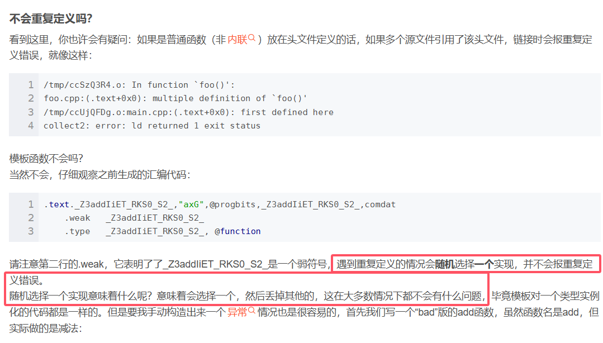

# 渲染器优化篇（1）

在本文档中，会介绍渲染器的逐步优化过程，以使得最终代码的质量更高一些，且使用Modern C++的一些编程技巧，锻炼自己的能力。


# 一、渲染器数学库——模板优化

## 1.知识点：头文件

Q：头文件.h和源文件.cpp到底怎么安排？类似模板的放在哪里？

> A：关于头文件和源文件，首先可以看看这篇：https://www-runoob-com.translate.goog/w3cnote/cpp-header.html?_x_tr_sl=zh-CN&_x_tr_tl=zh-TW&_x_tr_hl=zh-TW&_x_tr_pto=sc。以下是重点内容：
>
> - （1）**头文件中应该只放变量和函数的声明，而不能放它们的定义。**因为一个头文件的内容实际上是会被引入到多个不同的 .cpp 文件中的，并且它们都会被编译。放声明当然没事，如果放了定义，那么也就相当于在多个文件中出现了对于一个符号（变量或函数）的定义，纵然这些定义都是相同的，但对于编译器来说，这样做不合法。
>
>   - 类似的声明：`extern int a; `，`void f(); `
>
> - （2）注意上述规则有例外：
>
>   - （a）**头文件中可以写 const 对象的定义。因为全局的 const 对象默认是没有 extern 的声明的，所以它只在当前文件中有效。**把这样的对象写进头文件中，即使它被包含到其他多个 .cpp 文件中，这个对象也都只在包含它的那个文件中有效，对其他文件来说是不可见的，所以便不会导致多重定义。同时，因为这些 .cpp 文件中的该对象都是从一个头文件中包含进去的，这样也就保证了这些 .cpp 文件中的这个 const 对象的值是相同的，可谓一举两得。**同理，static 对象的定义也可以放进头文件。**
>
>     - 这里需要注意一点：**.h** 文件中能包含： **static** 普通变量和普通函数的定义，但是不能包含，**static** 成员函数和成员变量的定义。
>
>       原因在于 **static** 这个关键词其实有两个不同的含义：
>
>       - **static** 修饰普通的变量和函数时，**static** 关键字是为了限制可见性。
>
>       举例：
>
>       **void funcA(){ int a =0; a++; printf(a) }**，如果要连续记录调用了多少次，就得使用全局变量，但是全局变量暴露的太多了，其他文件中也能可见，所以，static a 用于仅本文件可见。
>
>       而 static 修饰类的成员变量时，该成员是属于类本身，所有类的实例对象共享。
>
>       ```
>       class A{
>           public:
>               static int a;
>       }
>       ```
>
>       其他文件 include 类定义的头文件 classA.h，本质上相当于复制。假设我们现在不 **#include "classA.h"** 而是直接写。
>
>       例如 a.cpp 写上上述头文件，然后再加上 **int A::a = 3;**, 在 b.cpp 中写上上述头文件，然后再加上 **int A::a = 3;**, 等于是定义了两次，此时发生重定义问题（根源在于 static 成员变量并不限制仅本文件可见），**所以头文件中不能包含static 成员函数和成员变量的定义，只能声明。**
>
>   - （b）头文件中可以写内联函数（inline）的定义。因为inline函数是需要编译器在遇到它的地方根据它的定义把它内联展开的，而并非是普通函数那样可以先声明再链接的（内联函数不会链接），所以编译器就需要在编译时看到内联函数的完整定义才行。**C++ 规定，内联函数可以在程序中定义多次，只要内联函数在一个 .cpp 文件中只出现一次，并且在所有的 .cpp 文件中，这个内联函数的定义是一样的，就能通过编译。**那么显然，把内联函数的定义放进一个头文件中是非常明智的做法。
>
>   - （c）**头文件中可以写类（class）的定义**。一般，我们的做法是，把类的定义放在头文件中，而把函数成员的实现代码放在一个 .cpp 文件中。这是可以的，也是很好的办法。不过，还有另一种办法。那就是直接把函数成员的实现代码也写进类定义里面。在 C++ 的类中，如果函数成员在类的定义体中被定义，那么编译器会视这个函数为内联的。因此，把函数成员的定义写进类定义体，一起放进头文件中，是合法的。**注意一下，如果把函数成员的定义写在类定义的头文件中，而没有写进类定义中，这是不合法的，因为这个函数成员此时就不是内联的了。**一旦头文件被两个或两个以上的 .cpp 文件包含，这个函数成员就被重定义了。

写头文件的时候记得把`#ifndef`,`#define`，`#endif`这一套写进去，可以更好地避免多重定义地错误。回到这一节开头的问题：模板定义放在哪？


### （1）模板定义放在哪？

https://blog.csdn.net/imred/article/details/80261632

具体的细节可以阅读上面这篇博客，但结论是这样的：**把模板和其对应的实现写进头文件即可，且不需要担心多重定义的问题。**不过需要注意下面这段话：



也就是说，**不要手动搓出好几个相同的模板函数，但是定义各不同，这属于没事找事。**