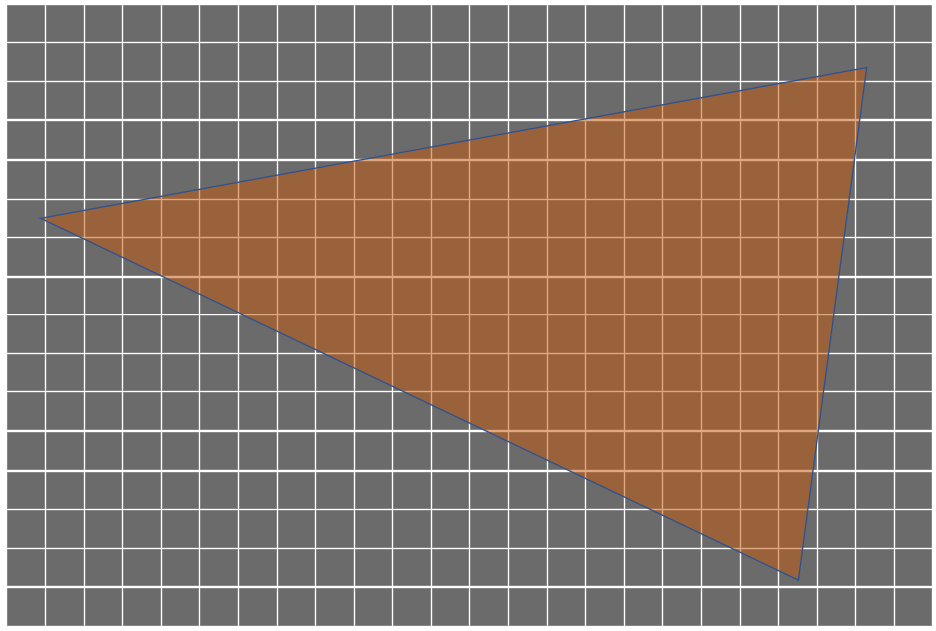
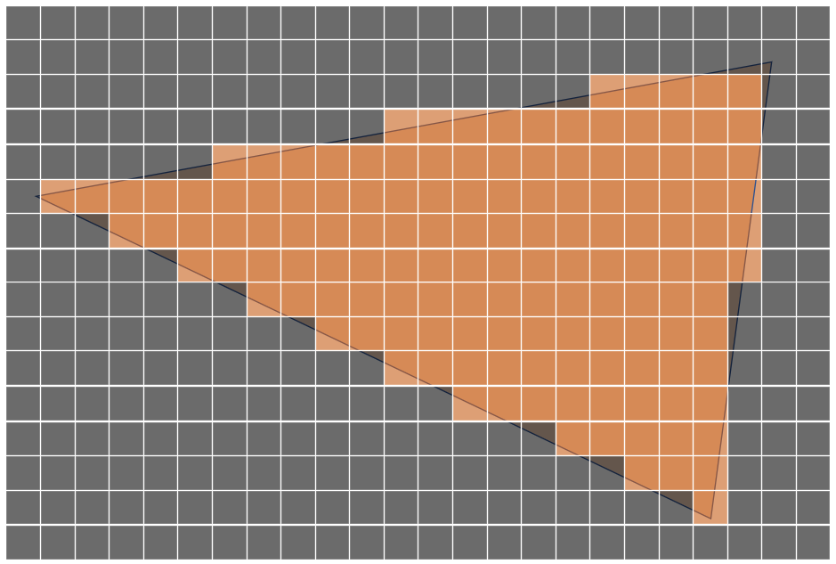
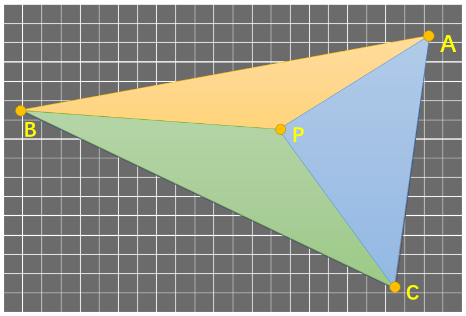
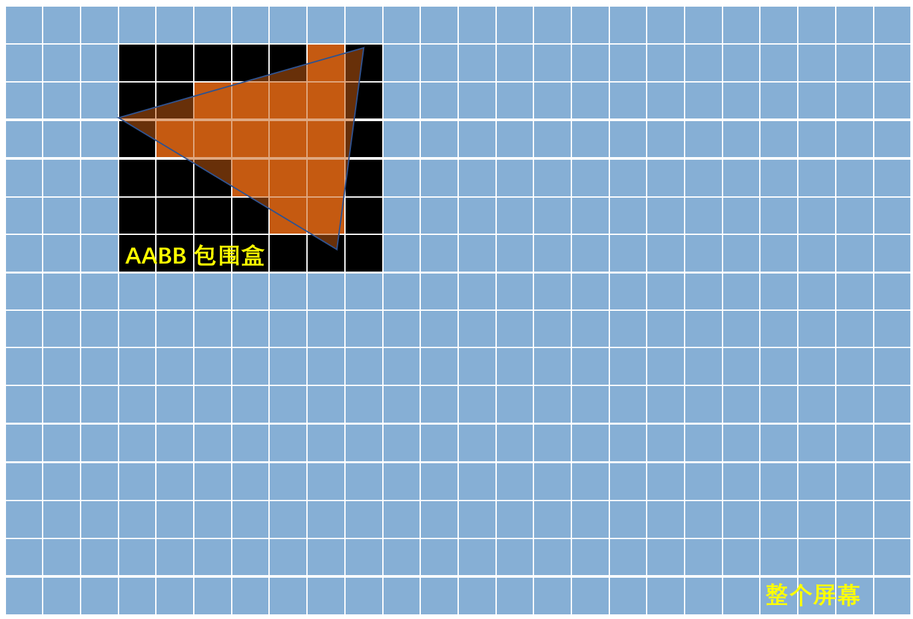
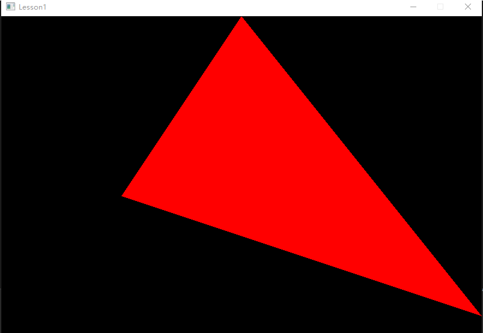
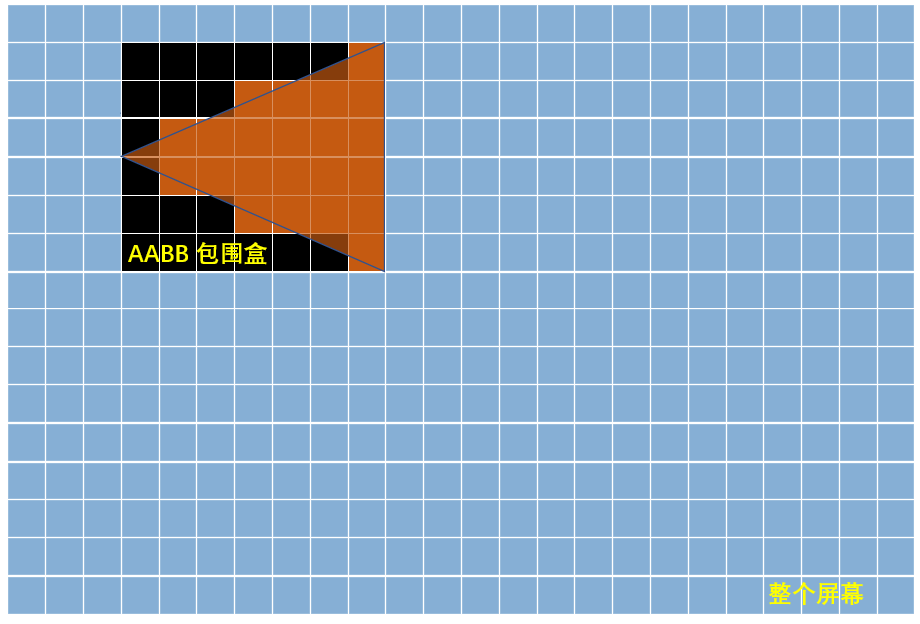
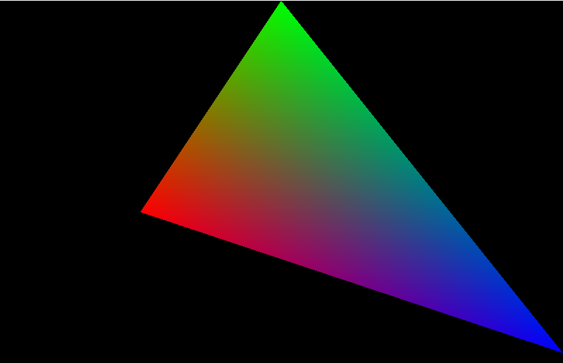

# 课时1——三角形的光栅化

本节目标：尽量讲解清晰易懂的三角形光栅化原理，并使用代码将一个三角形绘制在屏幕上。这将是渲染器的第一个绘制的内容。


# 一、知识点讲解

在图形学当中，无论计算机算法生成了什么漂亮的图案，最终都是要呈现在设备（如手机，电脑）的屏幕上。**因此我们首先要解决的问题是，**屏幕上的图像是如何显示出来的呢？我们都知道，一块屏幕由若干像素点构成，而计算机图形学渲染的最终目标就是将图像呈现在屏幕上。那么从简单的问题说起：一个三角形，如何显示在由像素构成的屏幕中呢？这里就引出本节的核心知识点：**光栅化的概念。**

> **在计算机图形学中，光栅化（Rasterization）是将矢量图形（如几何图形、三角形等）转换为光栅图像（即像素网格或位图）的过程。**例如在本节中，将下图这个三角形呈现在像素网格上，这就是光栅化。



如上图，这是理想化的呈现方法，但存在关键性的问题：

- 我们的屏幕像素只存在“被着色”和“未被着色”两种状态，无法做到某个像素的一部分被着色。

因此，**上图这个三角形需要经过“离散化”才能在屏幕上进行显示，如下图所示。**假设我们此时要绘制一个纯色的三角形，一种做法是通过询问屏幕中每一个像素点，看它是否在三角形中（一般来说一个像素可以用其中心点的位置坐标来表示），如果在，那么我们就为其涂上颜色，这样一来三角形就绘制出来了。用C++的伪代码描述这个过程就是：

```c++
void drawTriangle(const Point& a, const Point& b, const Point& c, std::vector<std::vector<int>>& screen, int color) 
{
    // 假设screen是一个2D数组，表示屏幕的像素，初始值为0（背景色）
    int width = screen.width();
    int height = screen.height();

    for (int x = 0; x < width; ++x) 
    {
        for (int y = 0; y < height; ++y)
        {
            Point p = {x, y};
            if (isPointInTriangle(p, a, b, c))  //核心是完善这个函数
            {
                screen[x][y] = color; 
            }
        }
    }
}
```




> （此时可以画一个图 一个网格+三角形，有多个过程/gif，一行一行问，不断打勾打叉，来渲染三角形）

此时问题就转化成了：如何判断一个点（x,y）是否在三角形ABC中呢？

- 一种朴素的想法是，可以用数学方法来计算点是否在三角形内。这里我们介绍最为常见的**使用三角形重心坐标来判断点是否在三角形内。**


## 1.重心坐标

### （1）重心坐标

#### 定义

> 重心坐标$(w,u,v)$表示点P在三角形ABC内的位置。对于三角形ABC所在平面内任意一点P, 存在三个数u,v,w，满足：
>
> $P=w*A+u*B+v*C$，且$u+v+w=1$
>
> 则$(w,u,v)$称为该对应平面上P点的重心坐标。

注意，这里的点P可能在三角形内，也可以在三角形的边上，或者在三角形外，只要满足上面的式子的点P，我们可以认为其在三角形ABC所在的平面上。


在三角形情形中，重心坐标也叫**面积坐标**，因为*P*点关于三角形*ABC*的重心坐标和三角形PBC,PCA及PAB的（有向）面积成比例，比如说点P在三角形内部的时候，

$w:u:v = S(PBC):S(PCA):S(PAB)$，这里的S指的是三角形的面积。




现在我们介绍了重心坐标的概念，接下来就是如何用重心坐标来判断点在三角形的内部还是外部了。

------


###  （2）判断点在三角形内

如果点P在三角形内部，则它必然会对三角形的每一边形成一个小三角形，这些小三角形的面积都是正的（即w,u,v都大于零，见上图情况）。而如果其中任一重心坐标（比如u）为零或负数，意味着点P恰好位于某一边上或者在边外，这样就不再是“严格”位于三角形内部。

通过以上的思考，可以得出如下结论：

> 只有当三角形的三个重心坐标都>0时才认为是在三角形内（这里暂时不过多考虑边界情况，比如=0的情况）。也即，如果点P可以用三角形重心坐标表示为$P=w*A+u*B+v*C$（对应的重心坐标为$(w,u,v)$），那么判断点P在三角形ABC内部的条件如下：
>
> - （1）$u+v+w=1$
> - （2）$u >0$且$v >0$且$w >0$

只需要计算出点P的重心坐标，就可以判断这一点是否在三角形内，从而决定是否为其着色。此时就进入到了最后一个核心问题，**如何求解某一点P相对于三角形ABC的重心坐标呢？**

------


### （3） 重心坐标计算公式

#### （a）用面积来计算

依据一、1.（1）部分的介绍，一种计算重心坐标的方式如下：

> 
>
> 既然有：$w:u:v = S(PBC):S(PCA):S(PAB)$，那么就有：
> $$
> w = S(PBC)/(S(PBC) + S(PCA) + S(PAB)) = S(PBC)/S(ABC)
> $$
> 同理：
> $$
> u = S(PCA)/(S(PBC) + S(PCA) + S(PAB)) = S(PCA)/S(ABC) \\
> v = S(PAB)/(S(PBC) + S(PCA) + S(PAB)) = S(PAB)/S(ABC)
> $$

这样只需要计算所需的几个三角形的面积就可以计算重心坐标了。这样做非常有助于理解，但并不适合计算机去计算，这就引出了**接下来的核心算法，也就是用叉乘的方法直接计算某一点P的重心坐标，速度快，而且优雅。**


#### （b）本节核心——重心坐标公式计算。

以下为推导部分。该推导部分需要读者有如下的基本数学知识：

- （1）对于向量及其叉乘的理解，在高等数学和线性代数课程上应当有所学习；
- （2）对于矩阵的最基本的认识，包括矩阵乘法的含义。

> **如果读者并不完全掌握上述的内容，可以选择进行学习，或是跳过推导的部分，直接看后文的结论和代码。**


> 在**光栅化**过程中，屏幕上的某一个像素中心P一定在需要被光栅化的三角形ABC所在的平面上（显然，因为屏幕空间是一个2D的空间）。此时重心坐标$(w,u,v)$一定满足$u+v+w=1$，此时
>
> 令$w=1-u-v$，则$P=w*A+u*B+v*C = (1-u-v)*A+u*B+v*C$。
>
> 展开可得：
>
> $P = A-u*A-v*A+u*B+v*C $，即
>
> $P = A+u*(B-A)+v*(C-A)$，依据向量的定义：
>
> $P = A+u*\overrightarrow{AB}+v*\overrightarrow{AC}$，将$P$移动到等式的右侧，再次依据向量的定义，可以得到：
>
> $u*\overrightarrow{AB}+v*\overrightarrow{AC}+\overrightarrow{PA} = \overrightarrow{0}$。
>
> 由此，可以推出以下两个方程：
> $$
> \begin{bmatrix} u \\ v \\ 1 \end{bmatrix} \begin{bmatrix} \overrightarrow{AB}_x & \overrightarrow{AC}_x & \overrightarrow{PA}_x \end{bmatrix} = 0
> $$
>
> $$
> \begin{bmatrix} u \\ v \\ 1 \end{bmatrix} \begin{bmatrix} \overrightarrow{AB}_y & \overrightarrow{AC}_y & \overrightarrow{PA}_y \end{bmatrix} = 0
> $$
>
> 注：$\overrightarrow{AB}_x$指的是向量$\overrightarrow{AB}$的$x$分量。
>
> **通过以上的推导，可以得出结论：**向量$\begin{bmatrix} u & v & 1 \end{bmatrix} $与$\begin{bmatrix} \overrightarrow{AB}_x & \overrightarrow{AC}_x & \overrightarrow{PA}_x \end{bmatrix} $和$\begin{bmatrix} \overrightarrow{AB}_y & \overrightarrow{AC}_y & \overrightarrow{PA}_y \end{bmatrix} $都垂直。在三维几何中，向量a和向量b的叉乘结果是一个向量，该向量垂直于a和b向量构成的平面。如果$\overrightarrow{a} \times \overrightarrow{b} =  \overrightarrow{n}$，则 $ \overrightarrow{n}$与 $ \overrightarrow{a}$垂直， $ \overrightarrow{n}$与 $ \overrightarrow{b}$垂直。反之亦然，如果 $ \overrightarrow{n}$与 $ \overrightarrow{a}$垂直， $ \overrightarrow{n}$与 $ \overrightarrow{b}$垂直，则$\overrightarrow{a} \times \overrightarrow{b} =  \overrightarrow{n}$。


不难看出，实际上重心坐标就等于$(\overrightarrow{AB}_x, \overrightarrow{AC}_x, \overrightarrow{PA}_x)$和$(\overrightarrow{AB}_y, \overrightarrow{AC}_y, \overrightarrow{PA}_y)$的叉乘结果（当然要归一化z到1）。
$$
\begin{bmatrix} u & v & 1 \end{bmatrix} =(\overrightarrow{AB}_x, \overrightarrow{AC}_x, \overrightarrow{PA}_x) \times (\overrightarrow{AB}_y, \overrightarrow{AC}_y, \overrightarrow{PA}_y)
$$

$$
(\overrightarrow{AB}_x, \overrightarrow{AC}_x, \overrightarrow{PA}_x) \times (\overrightarrow{AB}_y, \overrightarrow{AC}_y, \overrightarrow{PA}_y) = \\
\begin{vmatrix}i&j&k\\\overrightarrow{AB}_x&\overrightarrow{AC}_x&\overrightarrow{PA}_x\\\overrightarrow{AB}_y&\overrightarrow{AC}_y&\overrightarrow{PA}_y
\end{vmatrix} \\
$$


$$
[(\overrightarrow{AC}_x\cdot \overrightarrow{PA}_y)-(\overrightarrow{AC}_y\cdot \overrightarrow{PA}_x)]\overrightarrow{i} \\
-[(\overrightarrow{AB}_x\cdot \overrightarrow{PA}_y)-(\overrightarrow{AB}_y\cdot \overrightarrow{PA}_x)]\overrightarrow{j} \\
+[(\overrightarrow{AB}_x\cdot \overrightarrow{AC}_y)-(\overrightarrow{AB}_y\cdot \overrightarrow{AC}_x)]\overrightarrow{k}
$$


至此,我们发现,当我们只知道A,B,C和P的坐标,就顺利算出P的重心坐标$\begin{bmatrix} 1-u-v,u , v \end{bmatrix} $,通过判断$u,v,1-u-v$是否>0,我们就可以判断P是否在三角形内。趁热打铁直接来看判断点P是否在三角形ABC内部的核心代码：

```c++
vec3_t calculate_weights(vec2_t abc[3], vec2_t& p)
{
	vec2_t a = abc[0];
	vec2_t b = abc[1];
	vec2_t c = abc[2];
	vec2_t ab = vec2_sub(b, a);
	vec2_t ac = vec2_sub(c, a);
	vec2_t pa = vec2_sub(a, p);
	float factor = 1 / (ab.x * ac.y - ab.y * ac.x);  //factor用于做归一化操作
	float u = (ac.x * pa.y - ac.y * pa.x) * factor;
	float v = -(ab.x * pa.y - ab.y * pa.x) * factor;
	vec3_t weights = vec3_new(1 - u - v, u, v);
	return weights;
}
```


### 2.光栅化的优化——引入AABB

>  在计算机图形学中，AABB（Axis-Aligned Bounding Box，轴对齐包围盒）是用来描述三维空间中物体边界的一种简单且常用的几何体。它是一种最小的长方体（或立方体），能够完全包围一个物体，并且与坐标轴平行。

AABB听起来很高大上，但其实核心思路很简单，不过它在图形学中有非常多的应用，我们后续会在光线追踪、物理碰撞等地方频繁地见到包围盒的相关概念。这里我们使用AABB的思想：

> 实际上，我们并不需要在渲染每个三角形的时候遍历整个屏幕的所有像素，只需要找到包住三角形的所有像素遍历即可。可以用下面这张图形象的表现出来：



也就是说，在遍历屏幕像素的时候，只需要遍历上图当中黑色矩形的区域，也就是三角形的包围盒（AABB）即可。这个黑色AABB区域也很好计算，核心代码如下：

```c++
struct bbox_t
{
    int min_x, min_y, max_x, max_y;
};

bbox_t find_bounding_box(vec2_t abc[3], int width, int height)
{
	vec2_t min = vec2_min(vec2_min(abc[0], abc[1]), abc[2]); //min的x和y分别取abc[0]、abc[1]、abc[2]的x和y的分别的最小值，即最小的 x 和 y 坐标值
	vec2_t max = vec2_max(vec2_max(abc[0], abc[1]), abc[2]);//max的x和y分别取abc[0]、abc[1]、abc[2]的x和y的分别的最大值，即最大的 x 和 y 坐标值
	bbox_t bbox;
	bbox.min_x = max_integer((int)floor(min.x), 0); //确保最小 x 坐标不小于0，即不会超出图像的左边界。
	bbox.min_y = max_integer((int)floor(min.y), 0); //确保最小 y 坐标不小于0，即不会超出图像的上边界。
	bbox.max_x = min_integer((int)ceil(max.x), width - 1);//确保最大 x 坐标不超过图像的宽度减1，即不会超出图像的右边界。
	bbox.max_y = min_integer((int)ceil(max.y), height - 1); //确保最大 y 坐标不超过图像的高度减1，即不会超出图像的下边界。
	return bbox;
}
```

至此，光栅化的核心思路就讲述完成了。**读者可能会思考，如果要渲染在屏幕上的不是一个三角形，要怎么计算重心坐标呢？**

> 实际上，在计算机图形学中，当需要渲染的图形不是一个三角形时，通常会将其拆分成多个三角形。这种过程称为**三角剖分**（Triangulation）。这是因为大多数图形硬件和光栅化算法都是基于三角形来进行处理的。所以掌握了三角形的光栅化，理论上对于复杂多边形的光栅化也是类似的过程。

------


# 二、实践

## 2.1、基本框架

首先我们来搭建一下这个课时所需的基本框架，这个框架后续会持续完善，直到最后渲染器的完成。使用的环境为C/C++，尽量依赖最少的第三方库，同时尽量不涉及比较难的C++语法。首先先新新建一个main.cpp，创建我们的主函数：

```c++
#include <stdio.h>
#include <stdlib.h>
#include <string.h>
#include <time.h>
#include "test_rasterization.h"

typedef void testfunc_t(int argc, char* argv[]);//① 语法讲解
//定义结构体 testcase_t
typedef struct 
{ 
    const char* testname; 
    testfunc_t* testfunc; 
} testcase_t;

static testcase_t g_testcases[] = 
{
    {"rasterization", test_rasterization},
};

int main(int argc, char* argv[])
{
    //now we test rasterization
    const char* testname = g_testcases[0].testname;
    testfunc_t* testfunc = g_testcases[0].testfunc;
    if (testfunc)
    {
        testfunc(argc, argv);
    }
}
```

其中`"test_rasterization.h"`文件中只包含一个我们要实现的光栅化函数，如下：

```c++
#ifndef TEST_BLINN_H
#define TEST_BLINN_H

void test_rasterization(int argc, char* argv[]);

#endif
```

接下来我们要做的就是完善这个函数，从而把一个三角形绘制在屏幕上。

------

①语法讲解：（已经会的读者可以跳过）

>此处的typedef为声明创建一个新的名字
>
>`testfunc_t` 被定义为一个函数指针类型，指向一个函数，其参数为 `int argc` 和 `char* argv[]`，返回类型为 `void`（无返回值）。

------


### 1.FrameBuffer的概念

​	在很多教学类小型渲染器的实现中（如比较出名的TinyRenderer），最终渲染得到的结果是以tga格式文件保存的，**这其实不利于我们实时查看自己渲染器写的效果是否正确**，因此在一开始我们就先搭建一个简易的窗体程序，便于后续将渲染得到的结果呈现在屏幕上，以及后面会根据相机进行缩放、平移等。这里面主要使用C++的windows相关API接口来创建窗口，这部分不需要完全掌握（由于Windows的API内容比较复杂，且和课程并没有太大的关联，这里就不贴上来了，刚兴趣的读者可以直接查看项目工程中的源码部分），我们直接把代码和核心的注释贴在下面：

#### （1）创建一个FrameBuffer类

创建一个graphics.h头文件，这里面我们要创建一个FrameBuffer，用于保存渲染得到的结果，并后续呈现在屏幕上：

```c++
#ifndef GRAPHICS_H
#define GRAPHICS_H

class framebuffer_t
{
public:
    int width, height;
    unsigned char* color_buffer;
    framebuffer_t() : width(0), height(0), color_buffer(nullptr) {}
    framebuffer_t(int width, int height, int color_buffer_size) : width(width), height(height), color_buffer(new unsigned char[color_buffer_size]()) {}
};

#endif
```

这里color_buffer是char类型的数组，原因是颜色范围在0到255之间，因此用char类型保存是完全够用的。

创建一个frameBuffer的函数如下：

```c++
void framebuffer_clear_color(framebuffer_t* framebuffer, vec4_t color)
{
	int num_pixels = framebuffer->width * framebuffer->height;
	for (int i = 0; i < num_pixels; i++)
	{
		framebuffer->color_buffer[i * 4 + 0] = float_to_uchar(color.x);
		framebuffer->color_buffer[i * 4 + 1] = float_to_uchar(color.y);
		framebuffer->color_buffer[i * 4 + 2] = float_to_uchar(color.z);
		framebuffer->color_buffer[i * 4 + 3] = float_to_uchar(color.w);
	}
}

framebuffer_t* framebuffer_create(int width, int height)
{
	int color_buffer_size = width * height * 4;
	vec4_t default_color = { 0, 0, 0, 1 };
	framebuffer_t* framebuffer;

	assert(width > 0 && height > 0);//assert函数作用:如果它的条件返回错误，则终止程序执行。
	framebuffer = new framebuffer_t(width, height, color_buffer_size);

	//给这个framebuffer的每个像素点都填充默认颜色
	framebuffer_clear_color(framebuffer, default_color);

	return framebuffer;
}
```

------


#### （2）创建一个image_t类

这个类用于保存渲染得到的图片，用于进一步放到FrameBuffer上并渲染到屏幕上。新建一个`image.h`头文件，创建一个类：

```c++
#ifndef IMAGE_H
#define IMAGE_H

class image_t
{
public:
	int width, height, channels;
	unsigned char* color_buffer;

	image_t() : width(0), height(0), channels(0), color_buffer(nullptr) {}
	image_t(int width, int height, int channels) : width(width), height(height), channels(channels), color_buffer(new unsigned char[width * height * channels]()) {}
	~image_t() { delete[] color_buffer; }
};

#endif
```

此时创建一个image_t的逻辑如下：

```c++
image_t* image_create(int width, int height, int channels)
{
	assert(width > 0 && height > 0 && channels >= 1 && channels <= 4);
	image_t* image = new image_t(width, height, channels);
	return image;
}
```

------


#### （3）创建一个Windows类

```c++
//win32.h
#pragma once
#include <assert.h>
#include <stdlib.h>
#include <string.h>
#include <direct.h>
#include <windows.h>
#include "image.h"

struct window_t
{
	HWND handle;
	HDC memory_dc;
	image_t* surface;
};

```

HWND和HDC的说明如下：

> `HWND` 和 `HDC` 是 Windows API 中的类型，用于处理窗口和绘图的相关操作。
>
> ### HWND
>
> - **定义**: `HWND` 是一个句柄（handle），用于标识一个窗口。
> - **用途**: 它可以用来引用和管理窗口，比如获取窗口信息、发送消息等。
>
> ### HDC
>
> - **定义**: `HDC` 是一个设备上下文（Device Context）的句柄。
> - **用途**: 它代表了一个绘图表面，可以在上面进行2D绘图操作。通过 `HDC`，你可以进行像素绘制、文本绘制、图形绘制等。

​	这里有一些额外的框架中的函数和文件（主要用于把Image，windows和framebuffer绑定在一起，后续在做渲染的时候只需要将结果赋值给framebuffer即可），不需要非常关心，不过如果读者感兴趣的话这里给出一些参考：

- `platform_initialize();`这个函数用于做一些与窗体和平台层有关的初始化工作；
- `test_enter_mainloop`：这里主要是初始化window，framebuffer等，并做一些赋值上的工作，如下：

```c++
void test_enter_mainloop(tickfunc_t* tickfunc)
{
	window_t* window;
	framebuffer_t* framebuffer;
	window = window_create(WINDOW_TITLE, WINDOW_WIDTH, WINDOW_HEIGHT);
	framebuffer = framebuffer_create(WINDOW_WIDTH, WINDOW_HEIGHT);
	while (1)
	{
		tickfunc(framebuffer);
		window_draw_buffer(window, framebuffer);
	}
	
}
```

​	在tickFunc中需要把framebuffer传入进去，tickFunc就是我们对应课时要测试的函数，比如本次就是`void rasterization_triangle(framebuffer_t* framebuffer)`这个函数，在函数中会对framebuffer进行赋值，这样在调用`window_draw_buffer(window, framebuffer);`函数的时候就可以自动把更新之后的framebuffer绘制到窗口中了。

------


## 2.2、三角形的光栅化

### 1.画线算法（非本节内容，但有必要提一下）

​	实际上，在图形学中，由于光栅化的结果是离散表达的，因此绘制直线的算法并没有那么简单，在代码实现上可以直接使用Bresenham’s Line Drawing Algorithm进行绘制，具体代码不讲，太底层了，也没那么重要。

> 感兴趣的话可以去看https://github.com/ssloy/tinyrenderer/wiki/Lesson-1:-Bresenham%E2%80%99s-Line-Drawing-Algorithm这里会讲具体这个函数的迭代过程。

​	如果我们有了Bresenham’s Line Drawing Algorithm，绘制三角形的另一种方案是依据三角形的三个顶点ABC，分别AB画一条线，BC画一条线，CA画一条线。一开始可能能想到的代码是这样的：

```c++
Vec2i t0[3] = {Vec2i(10, 70),   Vec2i(50, 160),  Vec2i(70, 80)}; 
Vec2i t1[3] = {Vec2i(180, 50),  Vec2i(150, 1),   Vec2i(70, 180)}; 
Vec2i t2[3] = {Vec2i(180, 150), Vec2i(120, 160), Vec2i(130, 180)}; 
triangle(t0[0], t0[1], t0[2], image, red); 
triangle(t1[0], t1[1], t1[2], image, white); 
triangle(t2[0], t2[1], t2[2], image, green);
```

​	如何填充所绘制的三角形的内部呢？一种方案是扫描线的方法，一行一行找到三角形的边界，然后进行填充。在参考的链接当中，考虑了很多可能存在的问题，不过本质上其实这些都是old-school style的代码，目前用**重心插值**的方法来做才是主流的方法。而前面的理论也是介绍重心插值的方法，所以这个Bresenham’s 画线算法+扫描线填充的“光栅化”算法就不再介绍了。


### 2.绘制三角形——重心坐标

​	首先来看下面的伪代码：

```c++
triangle(vec2 points[3]) 
{ 
    vec2 bbox[2] = find_bounding_box(points); 
    for (each pixel in the bounding box) 
    { 
        if (inside(points, pixel)) 
        { 
            put_pixel(pixel); 
        } 
    } 
}
```

​	这份代码是比较直观的，找到要绘制的三角形的三个顶点的包围盒，接着遍历在包围盒内部的每个像素，如果有办法判断该像素处于三角形的内部，就对其进行“上色”处理，其实这就是**光栅化**的核心思想了。


#### （1）重心坐标

我们在第一部分已经详细解释了重心坐标的作用(判断点是否在三角形内),以及重心坐标的最终计算公式,复习一下:
$$
\begin{bmatrix} u & v & 1 \end{bmatrix} =(\overrightarrow{AB}_x, \overrightarrow{AC}_x, \overrightarrow{PA}_x) \times (\overrightarrow{AB}_y, \overrightarrow{AC}_y, \overrightarrow{PA}_y) = 
$$


$$
[(\overrightarrow{AC}_x\cdot \overrightarrow{PA}_y)-(\overrightarrow{AC}_y\cdot \overrightarrow{PA}_x)]\overrightarrow{i} \\
-[(\overrightarrow{AB}_x\cdot \overrightarrow{PA}_y)-(\overrightarrow{AB}_y\cdot \overrightarrow{PA}_x)]\overrightarrow{j} \\
+[(\overrightarrow{AB}_x\cdot \overrightarrow{AC}_y)-(\overrightarrow{AB}_y\cdot \overrightarrow{AC}_x)]\overrightarrow{k}
$$

重心坐标 = $\begin{bmatrix} 1-u-v,u , v \end{bmatrix} $ 

只有当三角形的三个重心坐标都>0时才认为是在三角形内（这里一概不过多考虑边界情况，比如=0之类的）。


求解三角形重心坐标的代码：

```c++
vec3_t calculate_weights(vec2_t abc[3], vec2_t& p)
{
	vec2_t a = abc[0];
	vec2_t b = abc[1];
	vec2_t c = abc[2];
	vec2_t ab = vec2_sub(b, a);
	vec2_t ac = vec2_sub(c, a);
	vec2_t pa = vec2_sub(a, p);
	float factor = 1 / (ab.x * ac.y - ab.y * ac.x);
	float u = (ac.x * pa.y - ac.y * pa.x) * factor;
	float v = -(ab.x * pa.y - ab.y * pa.x) * factor;
	vec3_t weights = vec3_new(1 - u - v, u, v);
	return weights;
}
```


#### （2）光栅化

那么此时，光栅化就变成了对图像上的每个像素，判断其是否在三角形内，如果在三角形内，就为其赋予颜色。这里我们先赋值一个红色的三角形，那么初版不包含AABB的代码如下：

```c++
void rasterization_triangle(framebuffer_t* framebuffer)
{
	//绘制三角形的主函数
	//先把frameBuffer全部填白色
	//framebuffer_clear_color(framebuffer, vec4_t{ 1.0f, 0.0f, 0.0f, 1.0f });
	int width = framebuffer->width;
	int height = framebuffer->height;
	vec2_t abc[3] = { vec2_new(200, 300), vec2_new(400, 600), vec2_new(800, 100) };
	for (int i = 0; i < width; i++)
	{
		for (int j = 0; j < height; j++)
		{
			vec2_t p{ (float)(i + 0.5), (float)(j + 0.5) };
			vec3_t result = calculate_weights(abc, p);
			if (result.x > 0 && result.y > 0 && result.z > 0)
			{
				framebuffer->color_buffer[(j * width + i) * 4 + 0] = 255;
				framebuffer->color_buffer[(j * width + i) * 4 + 1] = 0;
				framebuffer->color_buffer[(j * width + i) * 4 + 2] = 0;
				framebuffer->color_buffer[(j * width + i) * 4 + 3] = 255;
			}
		}
	}
}
```

渲染得到的结果如下：



至此，我们渲染出了第一个三角形！

------


##### 引入AABB

上文已经讲解了AABB的作用,我们通过这个图来复习一下:



我们求解时需要寻找包裹住这个三角形的最小的矩形区域,我们发现这个矩形区域的左下角,就是取三角形3个顶点中最小的x,然后再取出3个顶点中最小的y形成的.同理,右上角就是由三个顶点中的最大的x和最大的y坐标值构成。

AABB求解代码如下：

```c++
struct bbox_t
{
    int min_x, min_y, max_x, max_y;
};

bbox_t find_bounding_box(vec2_t abc[3], int width, int height)
{
	//min的x和y分别取abc[0]、abc[1]、abc[2]的x和y的分别的最小值，即最小的 x 和 y 坐标值
	vec2_t min = vec2_min(vec2_min(abc[0], abc[1]), abc[2]);
	//max的x和y分别取abc[0]、abc[1]、abc[2]的x和y的分别的最大值，即最大的 x 和 y 坐标值
	vec2_t max = vec2_max(vec2_max(abc[0], abc[1]), abc[2]);
	bbox_t bbox;
	//确保最小 x 坐标不小于0，即不会超出图像的左边界。
	bbox.min_x = max_integer((int)floor(min.x), 0);
	//确保最小 y 坐标不小于0，即不会超出图像的上边界。
	bbox.min_y = max_integer((int)floor(min.y), 0);
	//确保最大 x 坐标不超过图像的宽度减1，即不会超出图像的右边界。
	bbox.max_x = min_integer((int)ceil(max.x), width - 1);
	//确保最大 y 坐标不超过图像的高度减1，即不会超出图像的下边界。
	bbox.max_y = min_integer((int)ceil(max.y), height - 1);
	return bbox;
}
```

> //返回一个vec2_t，其中的x和y分别取两个vec2_t的x和y的最小值
>
> ```c++
> vec2_t vec2_min(vec2_t a, vec2_t b)
> {
>  float x = float_min(a.x, b.x);
>  float y = float_min(a.y, b.y);
>  return vec2_new(x, y);
> }
> ```
>
> 注：在整个渲染器的实现中，我们并不会每次都在文档中给出所有函数的实现（因为量比较大），例如上面的`vec2_min`函数的实现，不过这种函数字面意思一般都能理解，大部分这类函数都在`maths.h`文件和`maths.cpp`文件中可以找到定义。


AABB的代码初次一看可能会有点绕，读者可以比对上面那张示意图进行更好的理解。当求解出三角形的AABB之后，接下来就是对AABB中的每个像素进行光栅化处理了，这里给出修改之后的`rasterization_triangle`函数：

```c++
void rasterization_triangle(framebuffer_t* framebuffer)
{
    vec4_t default_color = { 0, 0, 0, 1 };
	framebuffer_clear_color(framebuffer, default_color); //请注意，在每tick绘制之前，先清空一下framebuffer
	//绘制三角形的主函数
	int width = framebuffer->width;
	int height = framebuffer->height;
	vec2_t abc[3] = { vec2_new(200, 300), vec2_new(400, 600), vec2_new(800, 100) };
	bbox_t bbox = find_bounding_box(abc, width, height);
	vec4_t color{ 1,0,0,1 };
	for (int i = bbox.min_x; i <= bbox.max_x; i++)
	{
		for (int j = bbox.min_y; j <= bbox.max_y; j++)
		{
			vec2_t p{ (float)(i + 0.5), (float)(j + 0.5) };
			vec3_t result = calculate_weights(abc, p);
			
			if (result.x > 0 && result.y > 0 && result.z > 0)
			{
				draw_fragment(framebuffer, j * width + i, color);
			}
		}
	}
}
```

其中` draw_fragment`函数的定义如下：

```c++
void draw_fragment(framebuffer_t* framebuffer, int index, vec4_t& color)
{
	framebuffer->color_buffer[index * 4 + 0] = float_to_uchar(color.x);
	framebuffer->color_buffer[index * 4 + 1] = float_to_uchar(color.y);
	framebuffer->color_buffer[index * 4 + 2] = float_to_uchar(color.z);
	framebuffer->color_buffer[index * 4 + 3] = float_to_uchar(color.w);
}
```


此时渲染出来的结果与刚才未引入AABB的结果应该是相同的，不过这里我们用了一个加速的思想。

**至此，Lesson1：三角形的光栅化就算是完成了。**

------


## homework

【1】三角形的重心坐标在图形学中有很多应用，比方说我们拿到了重心坐标a，b，c，那么就可以通过重心坐标插值得到三角形内部某个像素的颜色。尝试对Github上的仓库代码（https://github.com/hhlovesyy/MyTinyRenderer）进行修改，以实现下面的效果：



【2】尝试绘制一个属于你的三角形，并想办法让三角形沿着水平方向向右平移。

> 提示：引入一个与时间有关的变量，你可以把代码写的不那么优雅（例如直接暴力设置一个全局变量），能够实现效果即可。

