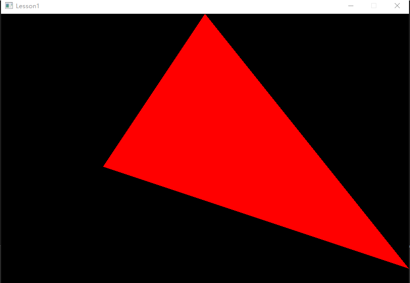
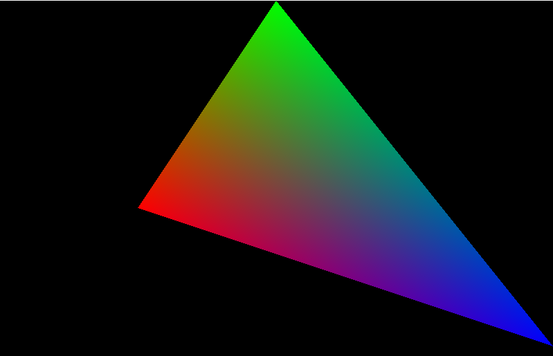

# 课时1——三角形的光栅化

尽量用最清晰易懂的代码将一个三角形绘制在屏幕上。这将是渲染器的第一个绘制的内容。


# 一、知识点讲解

屏幕上的图像是如何显示出来的呢？我们都知道，一块屏幕由像素点构成，那么从简单的问题说起：一个三角形，如何显示在由像素构成的屏幕中呢？


假设我们此时要绘制一个纯色的三角形，我们是不是可以通过询问屏幕中每一个像素点，看它是否在三角形中，如果在，那么我们就为其涂上颜色，这样一来三角形就绘制出来了。


（此时画一个图 一个网格+三角形，有多个过程/gif，一行一行问，不断打勾打叉，来渲染三角形）

那么问题就来了：如何判断一个点是否在三角形中呢，此时我们需要引入**重心坐标**来判断一个点是否在三角形中。


## 1.重心坐标

### （1）重心坐标

#### 定义

重心坐标$(w,u,v)$表示点P在三角形ABC内的位置。

（以下以二维情况为例，由于重心插值是光栅化所需要的，所以只讨论二维的情况即可）

对于三角形ABC内任意一点P, 存在三个数u,v,w，满足：

$u+v+w=1$

$P=w*A+u*B+v*C$

则$(w,u,v)$称为此三角形上P点的重心坐标


在三角形情形中，重心坐标也叫**面积坐标**，因为*P*点关于三角形*ABC*的重心坐标和三角形PBC,PCA及PAB的（有向）面积成比例，

$w:u:v = S(PBC):S(PCA):S(PAB)$


###  （2）判断点在三角形内

如果点P在三角形内部，则它必然会对三角形的每一边形成一个小三角形，这些小三角形的面积都是正的（即w,u,v都大于零）。

如果其中任一重心坐标（比如u）为零或负数，意味着点P恰好位于某一边上或者在边外，这样就不再是“严格”位于三角形内部。

因此只有当三角形的三个重心坐标都>0时才认为是在三角形内（这里暂时不过多考虑边界情况，比如=0之类的）。

因此,我们只需要计算出点P的重心坐标,就可以判断这一点是否在三角形内,从而决定是否为其着色。


### （3） 重心坐标计算公式

使$w=1-u-v$

则$P=w*A+u*B+v*C = (1-u-v)*A+u*B+v*C$

展开

$P = A-u*A-v*A+u*B+v*C $

$P = A+u*(B-A)+v*(C-A)$

$P = A+u*\overrightarrow{AB}+v*\overrightarrow{AC}$

$u*\overrightarrow{AB}+v*\overrightarrow{AC}+\overrightarrow{PA} = \overrightarrow{0}$

由此，可以推出以下两个方程：


$$
\begin{bmatrix} u \\ v \\ 1 \end{bmatrix} \begin{bmatrix} \overrightarrow{AB}_x & \overrightarrow{AC}_x & \overrightarrow{PA}_x \end{bmatrix} = 0
$$


$$
\begin{bmatrix} u \\ v \\ 1 \end{bmatrix} \begin{bmatrix} \overrightarrow{AB}_y & \overrightarrow{AC}_y & \overrightarrow{PA}_y \end{bmatrix} = 0
$$
因此$\begin{bmatrix} u & v & 1 \end{bmatrix} $与$\begin{bmatrix} \overrightarrow{AB}_x & \overrightarrow{AC}_x & \overrightarrow{PA}_x \end{bmatrix} $和$\begin{bmatrix} \overrightarrow{AB}_y & \overrightarrow{AC}_y & \overrightarrow{PA}_y \end{bmatrix} $都垂直，

>在三维几何中，向量a和向量b的叉乘结果是一个向量，该向量垂直于a和b向量构成的平面。
>
>$\overrightarrow{a} \times \overrightarrow{b} =  \overrightarrow{n}$
>
>则 $ \overrightarrow{n}$与 $ \overrightarrow{a}$垂直， $ \overrightarrow{n}$与 $ \overrightarrow{b}$垂直，
>
>反之亦然，如果 $ \overrightarrow{n}$与 $ \overrightarrow{a}$垂直， $ \overrightarrow{n}$与 $ \overrightarrow{b}$垂直，
>
> 则$\overrightarrow{a} \times \overrightarrow{b} =  \overrightarrow{n}$

不难看出，实际上重心坐标就等于$(\overrightarrow{AB}_x, \overrightarrow{AC}_x, \overrightarrow{PA}_x)$和$(\overrightarrow{AB}_y, \overrightarrow{AC}_y, \overrightarrow{PA}_y)$的叉乘结果（当然要归一化z到1）。
$$
\begin{bmatrix} u & v & 1 \end{bmatrix} =(\overrightarrow{AB}_x, \overrightarrow{AC}_x, \overrightarrow{PA}_x) \times (\overrightarrow{AB}_y, \overrightarrow{AC}_y, \overrightarrow{PA}_y)
$$

$$
(\overrightarrow{AB}_x, \overrightarrow{AC}_x, \overrightarrow{PA}_x) \times (\overrightarrow{AB}_y, \overrightarrow{AC}_y, \overrightarrow{PA}_y) = \\
\begin{vmatrix}i&j&k\\\overrightarrow{AB}_x&\overrightarrow{AC}_x&\overrightarrow{PA}_x\\\overrightarrow{AB}_y&\overrightarrow{AC}_y&\overrightarrow{PA}_y
\end{vmatrix} \\
$$


$$
[(\overrightarrow{AC}_x\cdot \overrightarrow{PA}_y)-(\overrightarrow{AC}_y\cdot \overrightarrow{PA}_x)]\overrightarrow{i} \\
-[(\overrightarrow{AB}_x\cdot \overrightarrow{PA}_y)-(\overrightarrow{AB}_y\cdot \overrightarrow{PA}_x)]\overrightarrow{j} \\
+[(\overrightarrow{AB}_x\cdot \overrightarrow{AC}_y)-(\overrightarrow{AB}_y\cdot \overrightarrow{AC}_x)]\overrightarrow{k}
$$


至此,我们发现,当我们只知道A,B,C和P的坐标,就顺利算出P的重心坐标$\begin{bmatrix} 1-u-v,u , v \end{bmatrix} $,通过判断u,v是否>0,我们就可以判断P是否在三角形内.

## 2.光栅化

对图像上的每个像素，判断其是否在三角形内，如果在三角形内，就为其赋予颜色。假设我们先绘制一个红色的三角形.

伪代码如下:

```C++
//遍历所有的像素点
for (int i = 0; i < width; i++)
	{
		for (int j = 0; j < height; j++)
		{
			vec2_t p{ (float)(i + 0.5), (float)(j + 0.5) };
            //calculate_weights(三角形abc,p点),返回重心坐标(w,u,v)
			vec3_t result = calculate_weights(abc, p);
            //如果这个像素点位于三角形内
			if (result.x > 0 && result.y > 0 && result.z > 0)
			{
                //为这个像素赋值红色
				framebuffer->color_buffer[(j * width + i) * 4 + 0] = 255;
				framebuffer->color_buffer[(j * width + i) * 4 + 1] = 0;
				framebuffer->color_buffer[(j * width + i) * 4 + 2] = 0;
				framebuffer->color_buffer[(j * width + i) * 4 + 3] = 255;
			}
		}
	}
```

(画一个图/动图,每个像素着色)


##### 引入AABB

实际上，我们并不需要在渲染每个三角形的时候遍历整个屏幕的所有像素，只需要找到包住三角形的所有像素遍历即可，这里就涉及到AABB求交的问题，可以用下面这张图形象的表现出来：


也就是说，一个能想到的加速方法是只遍历上图当中绿色矩形的区域，也就是三角形的包围盒（AABB）

那么接下来,让我们在实际代码实践中更深入的理解这些知识点吧.


# 二、实践


## 2.1、基本框架

首先我们来搭建一下这个课时所需的基本框架，这个框架后续会持续完善，直到最后渲染器的完成。使用的环境为C/C++，尽量依赖最少的第三方库，同时尽量不涉及比较难的C++语法。首先先新新建一个main.cpp，创建我们的主函数：

```c++
#include <stdio.h>
#include <stdlib.h>
#include <string.h>
#include <time.h>
#include "test_rasterization.h"

typedef void testfunc_t(int argc, char* argv[]);//① 语法讲解
//定义结构体 testcase_t
typedef struct 
{ 
    const char* testname; 
    testfunc_t* testfunc; 
} testcase_t;

static testcase_t g_testcases[] = 
{
    {"rasterization", test_rasterization},
};

int main(int argc, char* argv[])
{
    //now we test rasterization
    const char* testname = g_testcases[0].testname;
    testfunc_t* testfunc = g_testcases[0].testfunc;
    if (testfunc)
    {
        testfunc(argc, argv);
    }
}
```

其中`"test_rasterization.h"`文件中只包含一个我们要实现的光栅化函数，如下：

```c++
#ifndef TEST_BLINN_H
#define TEST_BLINN_H

void test_rasterization(int argc, char* argv[]);

#endif
```

接下来我们要做的就是完善这个函数，从而把一个三角形绘制在屏幕上。

------


>①语法讲解：（已经会的读者可以跳过）
>
>此处的typedef为声明创建一个新的名字
>
>`testfunc_t` 被定义为一个函数指针类型，指向一个函数，其参数为 `int argc` 和 `char* argv[]`，返回类型为 `void`（无返回值）。


### 1.FrameBuffer的概念

​	在很多教学类小型渲染器的实现中（如比较出名的TinyRenderer），最终渲染得到的结果是以tga格式文件保存的，这其实不利于我们实时查看自己渲染器写的效果是否正确，因此在一开始我们就先搭建一个简易的窗体程序，便于后续将渲染得到的结果呈现在屏幕上，以及后面会根据相机进行缩放、平移等。这里面主要使用C++的windows相关API接口来创建窗口，这部分不需要完全掌握，直接把代码和核心的注释贴在下面：

#### （1）创建一个FrameBuffer类

创建一个graphics.h头文件，这里面我们要创建一个FrameBuffer，用于保存渲染得到的结果，并后续呈现在屏幕上：

```c++
#ifndef GRAPHICS_H
#define GRAPHICS_H

class framebuffer_t
{
public:
    int width, height;
    unsigned char* color_buffer;
    framebuffer_t() : width(0), height(0), color_buffer(nullptr) {}
    framebuffer_t(int width, int height, int color_buffer_size) : width(width), height(height), color_buffer(new unsigned char[color_buffer_size]()) {}
};

#endif
```

这里color_buffer是char类型的数组，原因是颜色范围在0到255之间，因此用char类型保存是完全够用的.

创建一个frameBuffer的函数如下：

```c++
void framebuffer_clear_color(framebuffer_t* framebuffer, vec4_t color)
{
	int num_pixels = framebuffer->width * framebuffer->height;
	for (int i = 0; i < num_pixels; i++)
	{
		framebuffer->color_buffer[i * 4 + 0] = float_to_uchar(color.x);
		framebuffer->color_buffer[i * 4 + 1] = float_to_uchar(color.y);
		framebuffer->color_buffer[i * 4 + 2] = float_to_uchar(color.z);
		framebuffer->color_buffer[i * 4 + 3] = float_to_uchar(color.w);
	}
}

framebuffer_t* framebuffer_create(int width, int height)
{
	int color_buffer_size = width * height * 4;
	vec4_t default_color = { 0, 0, 0, 1 };
	framebuffer_t* framebuffer;

	assert(width > 0 && height > 0);//assert函数作用:如果它的条件返回错误，则终止程序执行。
	framebuffer = new framebuffer_t(width, height, color_buffer_size);

	//给这个framebuffer的每个像素点都填充默认颜色
	framebuffer_clear_color(framebuffer, default_color);

	return framebuffer;
}
```


#### （2）创建一个image_t类

这个类用于保存渲染得到的图片，用于进一步放到FrameBuffer上并渲染到屏幕上。新建一个`image.h`头文件，创建一个类：

```c++
#ifndef IMAGE_H
#define IMAGE_H

class image_t
{
public:
	int width, height, channels;
	unsigned char* color_buffer;

	image_t() : width(0), height(0), channels(0), color_buffer(nullptr) {}
	image_t(int width, int height, int channels) : width(width), height(height), channels(channels), color_buffer(new unsigned char[width * height * channels]()) {}
	~image_t() { delete[] color_buffer; }
};

#endif
```

此时创建一个image_t的逻辑如下：

```c++
image_t* image_create(int width, int height, int channels)
{
	assert(width > 0 && height > 0 && channels >= 1 && channels <= 4);
	image_t* image = new image_t(width, height, channels);
	return image;
}
```


#### （3）创建一个Windows类

```c++
//win32.h
#pragma once
#include <assert.h>
#include <stdlib.h>
#include <string.h>
#include <direct.h>
#include <windows.h>
#include "image.h"

struct window_t
{
	HWND handle;
	HDC memory_dc;
	image_t* surface;
};

```

HWND和HDC的说明如下：

> `HWND` 和 `HDC` 是 Windows API 中的类型，用于处理窗口和绘图的相关操作。
>
> ### HWND
>
> - **定义**: `HWND` 是一个句柄（handle），用于标识一个窗口。
> - **用途**: 它可以用来引用和管理窗口，比如获取窗口信息、发送消息等。
>
> ### HDC
>
> - **定义**: `HDC` 是一个设备上下文（Device Context）的句柄。
> - **用途**: 它代表了一个绘图表面，可以在上面进行2D绘图操作。通过 `HDC`，你可以进行像素绘制、文本绘制、图形绘制等。

​	这里有一些额外的框架中的函数和文件（主要用于把Image，windows和framebuffer绑定在一起，后续在做渲染的时候只需要将结果赋值给framebuffer即可），不需要非常关心，不过如果读者感兴趣的话这里给出一些参考：

- `platform_initialize();`这个函数用于做一些与窗体和平台层有关的初始化工作；
- `test_enter_mainloop`：这里主要是初始化window，framebuffer等，并做一些赋值上的工作，如下：

```c++
void test_enter_mainloop(tickfunc_t* tickfunc)
{
	window_t* window;
	framebuffer_t* framebuffer;
	window = window_create(WINDOW_TITLE, WINDOW_WIDTH, WINDOW_HEIGHT);
	framebuffer = framebuffer_create(WINDOW_WIDTH, WINDOW_HEIGHT);
	while (1)
	{
		tickfunc(framebuffer);
		window_draw_buffer(window, framebuffer);
	}
	
}
```

​	在tickFunc中需要把framebuffer传入进去，tickFunc就是我们对应课时要测试的函数，比如本次就是`void rasterization_triangle(framebuffer_t* framebuffer)`这个函数，在函数中会对framebuffer进行赋值，这样在调用`window_draw_buffer(window, framebuffer);`函数的时候就可以自动把更新之后的framebuffer绘制到窗口中了。

------


## 2.2、三角形的光栅化

### 1.画线算法（暂时非重点）

​	这里其实可以简单说一下，在图形学中，由于光栅化的结果是离散表达的，因此绘制直线的算法并没有那么简单，在代码实现上可以直接使用Bresenham’s Line Drawing Algorithm进行绘制，具体代码不讲，太底层了，也没那么重要。

> 感兴趣的话可以去看https://github.com/ssloy/tinyrenderer/wiki/Lesson-1:-Bresenham%E2%80%99s-Line-Drawing-Algorithm这里会讲具体这个函数的迭代过程。


​	现在我们已经有了上面那个画线函数，一个能想到的绘制三角形的方案是依据三角形的三个顶点ABC，分别AB画一条线，BC画一条线，CA画一条线。一开始可能能想到的代码是这样的：

```c++
Vec2i t0[3] = {Vec2i(10, 70),   Vec2i(50, 160),  Vec2i(70, 80)}; 
Vec2i t1[3] = {Vec2i(180, 50),  Vec2i(150, 1),   Vec2i(70, 180)}; 
Vec2i t2[3] = {Vec2i(180, 150), Vec2i(120, 160), Vec2i(130, 180)}; 
triangle(t0[0], t0[1], t0[2], image, red); 
triangle(t1[0], t1[1], t1[2], image, white); 
triangle(t2[0], t2[1], t2[2], image, green);
```

​	如何填充所绘制的三角形的内部呢？一种方案是扫描线的方法，一行一行找到三角形的边界，然后进行填充。在参考的链接当中，考虑了很多可能存在的问题，不过本质上其实这些都是old-school style的代码，目前用**重心插值**的方法来做才是主流的方法。因此以下我们主要讨论**重心插值的方法。**

### 2.绘制三角形——重心坐标

​	首先来看下面的伪代码：

```c++
triangle(vec2 points[3]) 
{ 
    vec2 bbox[2] = find_bounding_box(points); 
    for (each pixel in the bounding box) 
    { 
        if (inside(points, pixel)) 
        { 
            put_pixel(pixel); 
        } 
    } 
}
```

​	这份代码是比较直观的，找到要绘制的三角形的三个顶点的包围盒，接着遍历在包围盒内部的每个像素，如果有办法判断该像素处于三角形的内部，就对其进行“上色”处理，其实这就是**光栅化**的核心思想了。


#### （1）重心坐标

我们在第一部分已经详细解释了重心坐标的作用(判断点是否在三角形内),以及重心坐标的最终计算公式,复习一下:
$$
\begin{bmatrix} u & v & 1 \end{bmatrix} =(\overrightarrow{AB}_x, \overrightarrow{AC}_x, \overrightarrow{PA}_x) \times (\overrightarrow{AB}_y, \overrightarrow{AC}_y, \overrightarrow{PA}_y) = 
$$


$$
[(\overrightarrow{AC}_x\cdot \overrightarrow{PA}_y)-(\overrightarrow{AC}_y\cdot \overrightarrow{PA}_x)]\overrightarrow{i} \\
-[(\overrightarrow{AB}_x\cdot \overrightarrow{PA}_y)-(\overrightarrow{AB}_y\cdot \overrightarrow{PA}_x)]\overrightarrow{j} \\
+[(\overrightarrow{AB}_x\cdot \overrightarrow{AC}_y)-(\overrightarrow{AB}_y\cdot \overrightarrow{AC}_x)]\overrightarrow{k}
$$

重心坐标 = $\begin{bmatrix} 1-u-v,u , v \end{bmatrix} $ 

只有当三角形的三个重心坐标都>0时才认为是在三角形内（这里一概不过多考虑边界情况，比如=0之类的）。


求解三角形重心坐标的代码：

```c++
vec3_t calculate_weights(vec2_t abc[3], vec2_t& p)
{
	vec2_t a = abc[0];
	vec2_t b = abc[1];
	vec2_t c = abc[2];
	vec2_t ab = vec2_sub(b, a);
	vec2_t ac = vec2_sub(c, a);
	vec2_t pa = vec2_sub(a, p);
	float factor = 1 / (ab.x * ac.y - ab.y * ac.x);
	float u = (ac.x * pa.y - ac.y * pa.x) * factor;
	float v = -(ab.x * pa.y - ab.y * pa.x) * factor;
	vec3_t weights = vec3_new(1 - u - v, u, v);
	return weights;
}
```


#### （2）光栅化

那么此时，光栅化就变成了对图像上的每个像素，判断其是否在三角形内，如果在三角形内，就为其赋予颜色。这里我们先赋值一个红色的三角形，那么初版不包含AABB的代码如下：

```c++
void rasterization_triangle(framebuffer_t* framebuffer)
{
	//绘制三角形的主函数
	//先把frameBuffer全部填白色
	//framebuffer_clear_color(framebuffer, vec4_t{ 1.0f, 0.0f, 0.0f, 1.0f });
	int width = framebuffer->width;
	int height = framebuffer->height;
	vec2_t abc[3] = { vec2_new(200, 300), vec2_new(400, 600), vec2_new(800, 100) };
	for (int i = 0; i < width; i++)
	{
		for (int j = 0; j < height; j++)
		{
			vec2_t p{ (float)(i + 0.5), (float)(j + 0.5) };
			vec3_t result = calculate_weights(abc, p);
			if (result.x > 0 && result.y > 0 && result.z > 0)
			{
				framebuffer->color_buffer[(j * width + i) * 4 + 0] = 255;
				framebuffer->color_buffer[(j * width + i) * 4 + 1] = 0;
				framebuffer->color_buffer[(j * width + i) * 4 + 2] = 0;
				framebuffer->color_buffer[(j * width + i) * 4 + 3] = 255;
			}
		}
	}
}
```

渲染得到的结果如下：



至此，我们渲染出了第一个三角形！

------


##### 引入AABB

上文已经讲解了AABB的作用,我们通过这个图来复习一下:


我们求解时需要寻找包裹住这个三角形的最小的矩形区域,我们发现这个矩形区域的左下角,就是取三角形3个顶点中最小的x,然后再取出3个顶点中最小的y形成的.同理,右上角就是由三个顶点中的最大的x和最大的y坐标值构成


AABB求解代码如下：

```c++
struct bbox_t
{
    int min_x, min_y, max_x, max_y;
};

bbox_t find_bounding_box(vec2_t abc[3], int width, int height)
{
	//min的x和y分别取abc[0]、abc[1]、abc[2]的x和y的分别的最小值，即最小的 x 和 y 坐标值
	vec2_t min = vec2_min(vec2_min(abc[0], abc[1]), abc[2]);
	//max的x和y分别取abc[0]、abc[1]、abc[2]的x和y的分别的最大值，即最大的 x 和 y 坐标值
	vec2_t max = vec2_max(vec2_max(abc[0], abc[1]), abc[2]);
	bbox_t bbox;
	//确保最小 x 坐标不小于0，即不会超出图像的左边界。
	bbox.min_x = max_integer((int)floor(min.x), 0);
	//确保最小 y 坐标不小于0，即不会超出图像的上边界。
	bbox.min_y = max_integer((int)floor(min.y), 0);
	//确保最大 x 坐标不超过图像的宽度减1，即不会超出图像的右边界。
	bbox.max_x = min_integer((int)ceil(max.x), width - 1);
	//确保最大 y 坐标不超过图像的高度减1，即不会超出图像的下边界。
	bbox.max_y = min_integer((int)ceil(max.y), height - 1);
	return bbox;
}
```

> //返回一个vec2_t，其中的x和y分别取两个vec2_t的x和y的最小值
>
> vec2_t vec2_min(vec2_t a, vec2_t b)
> {
>     float x = float_min(a.x, b.x);
>     float y = float_min(a.y, b.y);
>     return vec2_new(x, y);
> }
>
> 
>
> 注：在整个渲染器的实现中，我们并不会每次都在文档中给出所有函数的实现（因为量比较大），例如上面的`vec2_min`函数的实现，不过这种函数字面意思一般都能理解，大部分这类函数都在`maths.h`文件和`maths.cpp`文件中可以找到定义。


AABB的代码初次一看可能会有点绕，读者可以比对上面那张示意图进行更好的理解。当求解出三角形的AABB之后，接下来就是对AABB中的每个像素进行光栅化处理了，这里给出修改之后的`rasterization_triangle`函数：

```c++
void rasterization_triangle(framebuffer_t* framebuffer)
{
    vec4_t default_color = { 0, 0, 0, 1 };
	framebuffer_clear_color(framebuffer, default_color); //请注意，在每tick绘制之前，先清空一下framebuffer
	//绘制三角形的主函数
	int width = framebuffer->width;
	int height = framebuffer->height;
	vec2_t abc[3] = { vec2_new(200, 300), vec2_new(400, 600), vec2_new(800, 100) };
	bbox_t bbox = find_bounding_box(abc, width, height);
	vec4_t color{ 1,0,0,1 };
	for (int i = bbox.min_x; i <= bbox.max_x; i++)
	{
		for (int j = bbox.min_y; j <= bbox.max_y; j++)
		{
			vec2_t p{ (float)(i + 0.5), (float)(j + 0.5) };
			vec3_t result = calculate_weights(abc, p);
			
			if (result.x > 0 && result.y > 0 && result.z > 0)
			{
				draw_fragment(framebuffer, j * width + i, color);
			}
		}
	}
}
```

其中` draw_fragment`函数的定义如下：

```c++
void draw_fragment(framebuffer_t* framebuffer, int index, vec4_t& color)
{
	framebuffer->color_buffer[index * 4 + 0] = float_to_uchar(color.x);
	framebuffer->color_buffer[index * 4 + 1] = float_to_uchar(color.y);
	framebuffer->color_buffer[index * 4 + 2] = float_to_uchar(color.z);
	framebuffer->color_buffer[index * 4 + 3] = float_to_uchar(color.w);
}
```


此时渲染出来的结果与刚才未引入AABB的结果应该是相同的，不过这里我们用了一个加速的思想。

**至此，Lesson1：三角形的光栅化就算是完成了。**

------


## homework

【1】三角形的重心坐标在图形学中有很多应用，比方说我们拿到了重心坐标a，b，c，那么就可以通过重心坐标插值得到三角形内部某个像素的颜色。尝试对Github上的仓库代码进行修改，以实现下面的效果：



【2】尝试绘制一个属于你的三角形，并让三角形沿着水平方向向右平移。提示：引入一个与时间有关的变量，你可以把代码写的不那么优雅（例如直接暴力设置一个全局变量），能够实现效果即可。

