# 课时2——空间变换

现在我们在屏幕上绘制出了第一个三角形，但这个三角形是静止的（也许你完成了上一课时的作业，但三角形依然变换的比较无聊）。通过这个课时的学习和实践，我们希望能够把这个三角形变得“立体化”，像是一个三维的三角形，并绘制属于我们的第一个立方体

> 注意：我们实现的是OpenGL标准，这就意味着都是矩阵乘向量这种形式，如果要对向量旋转，需要把旋转矩阵乘在左边。


# 一、旋转、缩放、平移

第一步，我们希望上一节课绘制出来的三角形能够旋转，缩放和平移。

## （1）旋转矩阵

如果此时我们需要让第一节课的三角形围绕着某个轴旋转，我们需要将其左乘一个旋转矩阵。

#### 围绕Z轴旋转

根据右手法则，$\overrightarrow{X} \times \overrightarrow{Y} = \overrightarrow{Z} $

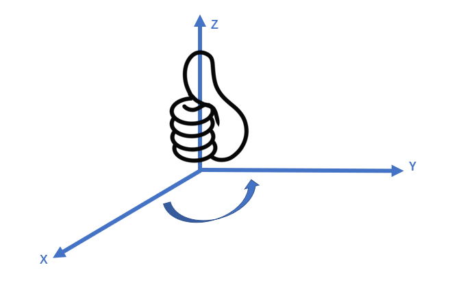

假设旋转矩阵为：
$$
\begin{bmatrix}a&b&0\\c&d&0\\0&0&1\end{bmatrix}
$$
旋转后的点可以由原来的点左乘旋转矩阵得到：
$$
\begin{bmatrix}X\\Y\\Z\end{bmatrix}=\begin{bmatrix}a&b&0\\c&d&0\\0&0&1\end{bmatrix}\begin{bmatrix}x\\y\\z\end{bmatrix}
$$

我们假设以下这个情景，有一个三角形围绕着Z轴旋转

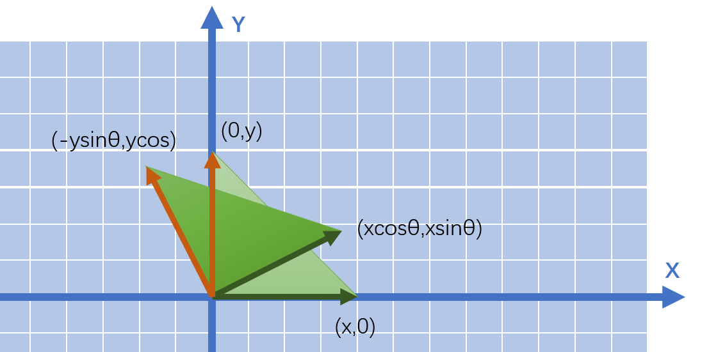

三角形中的点$(x,0,0)$旋转后成为点$(xcos\theta,xsin\theta,0)$
$$
\begin{bmatrix}
xcos\theta\\xsin\theta\\0
\end{bmatrix}=
\begin{bmatrix}
i&j&0\\k&l&0\\0&0&1
\end{bmatrix}
\begin{bmatrix}
x\\0\\0
\end{bmatrix}
$$

$$
\begin{numcases}{}
x*cos\theta = x*i \\
x*sin\theta = x*k  \\
\end{numcases}
$$

$$
\begin{numcases}{}
i= cos\theta \\
k= sin\theta
\end{numcases}
$$


三角形中的顶点$(0,y,0)$旋转后成为点$(-ysin\theta,ycos\theta,0)$
$$
\begin{bmatrix}-ysin\theta\\ycos\theta\\0\end{bmatrix}=\begin{bmatrix}i&j&0\\k&l&0\\0&0&1\end{bmatrix}\begin{bmatrix}0\\y\\0\end{bmatrix}
$$

$$
\begin{numcases}{}
-y*sin\theta = y*j \\
y*cos\theta = y*l  \\
\end{numcases}
$$

$$
\begin{numcases}{}
j= -sin\theta  \\
l= cos\theta
\end{numcases}
$$

因此我们得到绕着z轴旋转的旋转矩阵为：
$$
\begin{bmatrix}cos\theta&-sin\theta&0\\sin\theta&cos\theta&0\\0&0&1\end{bmatrix}
$$

#### 围绕X轴旋转

根据右手法则，$\overrightarrow{Y} \times \overrightarrow{Z} = \overrightarrow{X} $

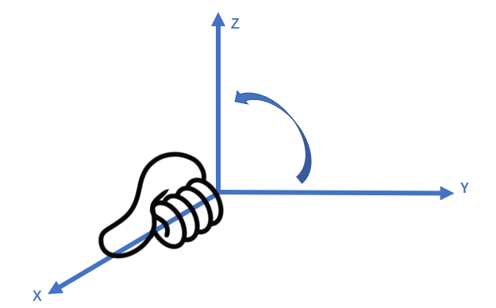

参考上面的围绕Z轴旋转的旋转矩阵不难想出，如果是绕着x轴旋转，则
$$
\begin{bmatrix}Y\\Z\end{bmatrix}=
\begin{bmatrix}
	cos\theta&-sin\theta\\
	sin\theta&cos\theta
\end{bmatrix}
\begin{bmatrix}y\\z\end{bmatrix}
$$

因此我们得到绕着x轴旋转的旋转矩阵为：

$$
\begin{bmatrix}X\\Y\\Z\end{bmatrix}=
\begin{bmatrix}
	1&0&0\\
	0&cos\theta&-sin\theta\\
	0&sin\theta&cos\theta
\end{bmatrix}
\begin{bmatrix}x\\y\\z\end{bmatrix}
$$

#### 围绕Y轴旋转

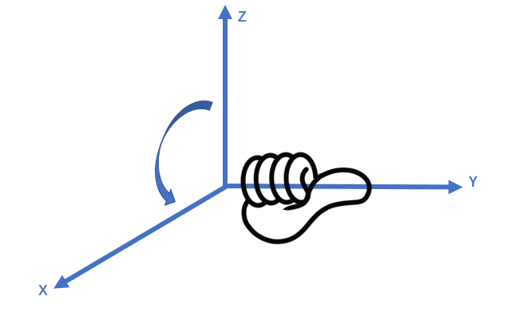

如果是绕着y旋转，

根据右手法则，$\overrightarrow{Z} \times \overrightarrow{X} = \overrightarrow{Y} $

则


$$
\begin{bmatrix}Z\\X\end{bmatrix}=
\begin{bmatrix}
	cos\theta&-sin\theta\\
	sin\theta&cos\theta
\end{bmatrix}
\begin{bmatrix}z\\x\end{bmatrix}
$$
但是我们在旋转矩阵中，z向x旋转 $\theta$ 角度 等价于x向z旋转 $-\theta$ 角度

因此
$$
\begin{bmatrix}X\\Z\end{bmatrix}=
\begin{bmatrix}
	cos(-\theta)&-sin(-\theta)\\
	sin(-\theta)&cos(-\theta)
\end{bmatrix}
\begin{bmatrix}X\\Z\end{bmatrix}
$$

$$
\begin{bmatrix}X\\Z\end{bmatrix}=
\begin{bmatrix}
	cos\theta&sin\theta\\
	-sin\theta&cos\theta
\end{bmatrix}
\begin{bmatrix}X\\Z\end{bmatrix}
$$
因此我们得到绕着y轴旋转的旋转矩阵为：
$$
\begin{bmatrix}X\\Y\\Z\end{bmatrix}=
\begin{bmatrix}
	cos\theta&0&sin\theta\\
	0&1&0\\
	-sin\theta&0&cos\theta
\end{bmatrix}
\begin{bmatrix}x\\y\\z\end{bmatrix}
$$


实践代码如下：

```c++
/*
 * angle: 旋转角度，以弧度为单位
 *
 *  1  0  0  0
 *  0  c -s  0
 *  0  s  c  0
 *  0  0  0  1
 */
mat4_t mat4_rotate_x(float angle) //传入的angle是弧度，意味着90度是PI/2.0
{
    float c = (float)cos(angle);
    float s = (float)sin(angle);
    mat4_t m = mat4_identity();
    m.m[1][1] = c;
    m.m[1][2] = -s;
    m.m[2][1] = s;
    m.m[2][2] = c;
    return m;
}

/*
 * angle: 旋转角度，以弧度为单位
 *
 *  c  0  s  0
 *  0  1  0  0
 * -s  0  c  0
 *  0  0  0  1
 */
mat4_t mat4_rotate_y(float angle)
{
    float c = (float)cos(angle);
    float s = (float)sin(angle);
    mat4_t m = mat4_identity();
    m.m[0][0] = c;
    m.m[0][2] = s;
    m.m[2][0] = -s;
    m.m[2][2] = c;
    return m;
}

/*
 * angle: 旋转角度，以弧度为单位
 *
 *  c -s  0  0
 *  s  c  0  0
 *  0  0  1  0
 *  0  0  0  1
 */
mat4_t mat4_rotate_z(float angle)
{
    float c = (float)cos(angle);
    float s = (float)sin(angle);
    mat4_t m = mat4_identity();
    m.m[0][0] = c;
    m.m[0][1] = -s;
    m.m[1][0] = s;
    m.m[1][1] = c;
    return m;
}
```

在提供的Github代码中，有测试绕着Z轴旋转的相关的测试函数，读者可以进行测试，查看旋转矩阵的执行效果。

------


####  绕任意轴旋转

第一种情况是这个任意轴过原点，那么我们按照以下步骤操作

（提一下不过原点情况）

1. 将旋转轴P旋转至XOZ平面=>图中的R轴
2. 将旋转轴旋转至于Z轴重合=>图中的T轴/Z轴
3. 绕Z轴旋转θ度
4. 执行步骤2的逆过程
5. 执行步骤1的逆过程

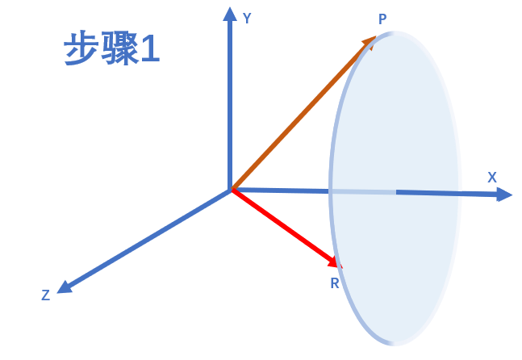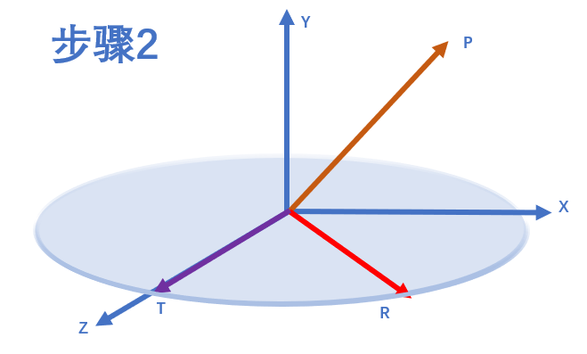


##### 绕X轴旋转，旋转至XOZ平面

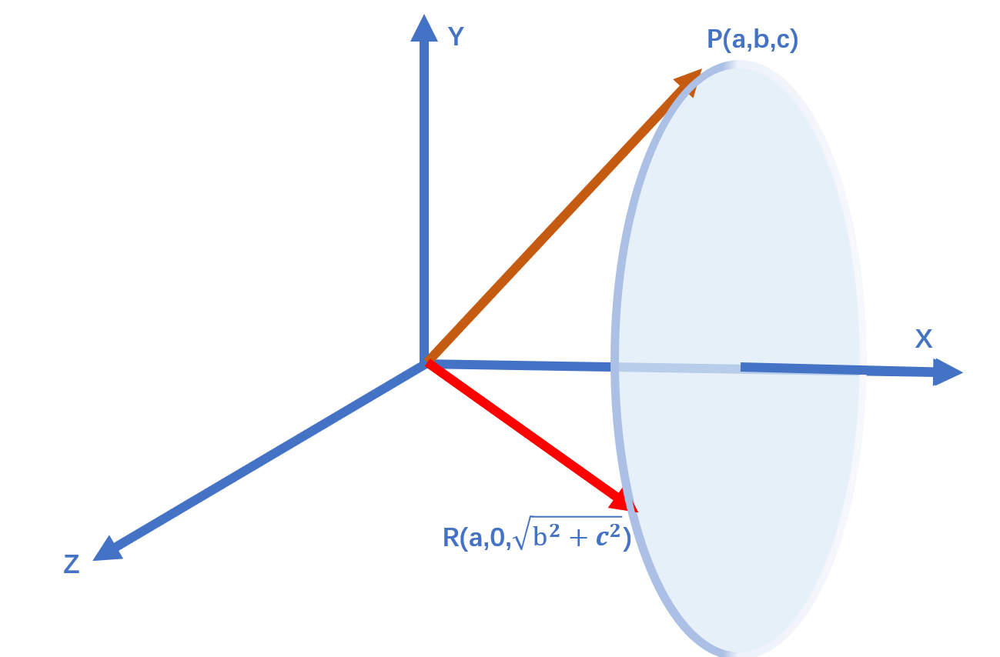

假设P绕着X轴旋转$\alpha$得到R，我们将P投影到YOZ上得到P1点（0,b,c）,


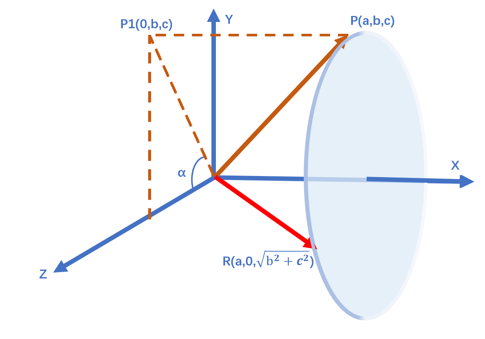

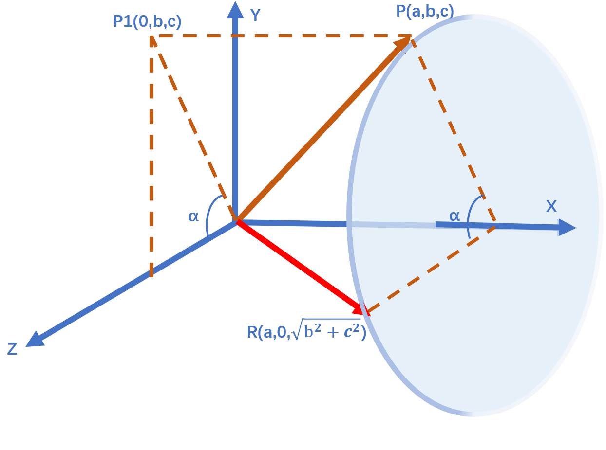

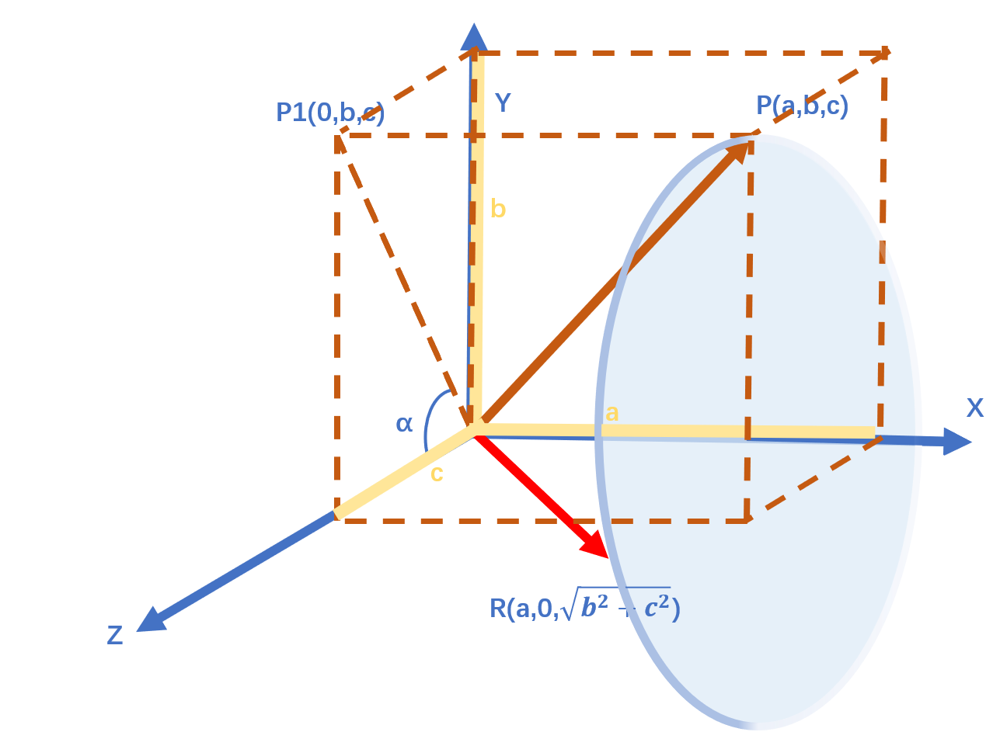

从图中不难看出，$cos\alpha =\frac{c}{\sqrt{b^2+c^2}}$,$sin\alpha =\frac{b}{\sqrt{b^2+c^2}}$

根据一.1中”围绕X轴旋转“对应的公式，我们得到围绕X轴旋转的公式为

$$Rx(\alpha)=\begin{bmatrix}1&0&0&0\\0&cos\alpha&-sin\alpha&0\\0&sin\alpha&cos\alpha&0\\0&0&0&1\end{bmatrix}=\begin{bmatrix}1&0&0&0\\0&\frac{c}{\sqrt{b^2+c^2}}&-\frac{b}{\sqrt{b^2+c^2}}&0\\0&\frac{b}{\sqrt{b^2+c^2}}&\frac{c}{\sqrt{b^2+c^2}}&0\\0&0&0&1\end{bmatrix}$$


##### 绕Y轴旋转，旋转至与Z轴重合

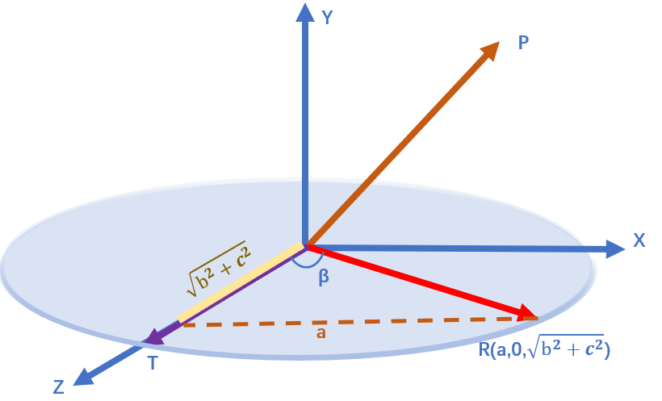

我们将R**绕Y轴旋转**至与Z轴重台，顺时针旋转的角度为$\beta$,则逆时针旋转角度为$-\beta$

$$cos(-\beta)=cos\beta=\frac{\sqrt{b^{2}+c^{2}}}{\sqrt{a^{2}+b^{2}+c^{2}}},\quad sin(-\beta)=-sin\beta=-\frac{a}{\sqrt{a^{2}+b^{2}+c^{2}}}$$

根据一.2中”围绕Y轴旋转“对应的公式，我们得到围绕Y轴旋转的公式为
$$
Ry(-\beta)=\begin{bmatrix}cos\beta&0&sin(-\beta)&0\\0&1&0&0\\-sin(-\beta)&0&cos\beta&0\\0&0&0&1\end{bmatrix}=\begin{bmatrix}\frac{\sqrt{b^2+c^2}}{\sqrt{a^2+b^2+c^2}}&0&-\frac{a}{\sqrt{a^2+b^2+c^2}}&0\\0&1&0&0\\\frac{a}{\sqrt{a^2+b^2+c^2}}&0&\frac{\sqrt{b^2+c^2}}{\sqrt{a^2+b^2+c^2}}&0\\0&0&0&1\end{bmatrix}
$$


##### 绕Z轴旋转

根据一.1中”围绕Z轴旋转“对应的公式，我们得到围绕Z轴旋转的公式为
$$
Rx(\theta)=\begin{bmatrix}
cos\theta&-sin\theta&0&0
\\sin\theta&cos\theta&0&0
\\0&0&1&0
\\0&0&0&1
\end{bmatrix}
$$


##### 整合

我们按照步骤将以上的矩阵相乘(不断左乘),得到：

$$M=R_{x}(-\alpha)\cdot R_{y}(\beta)\cdot R_{z}(\theta)\cdot R_{y}(-\beta)\cdot R_{x}(\alpha)$$

即

$$\begin{bmatrix}a^2+(1-a^2)cos\theta&ab(1-cos\theta)+csin\theta&ac(1-cos\theta)-bsin\theta&0\\ab(1-cos\theta)-csin\theta&b^2+(1-b^2)cos\theta&bc(1-cos\theta)+asin\theta&0\\ac(1-cos\theta)+bsin\theta&bc(1-cos\theta)-asin\theta&c^2+(1-c^2)cos\theta&0\\0&0&0&1\end{bmatrix}$$

> 后续可以写一个作图工具 a.rotateTowarsds(axis, 60, 3).wait(2s).translate().wait()   

## （2）缩放矩阵

以原点为中心进行缩放

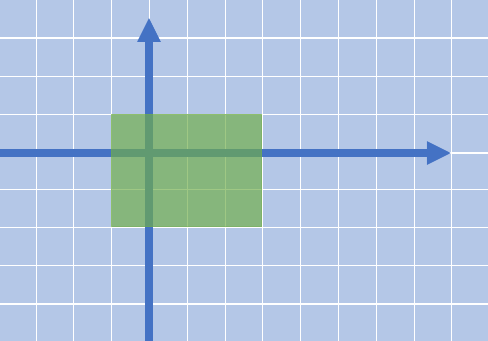 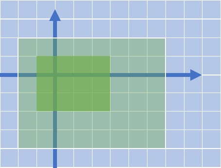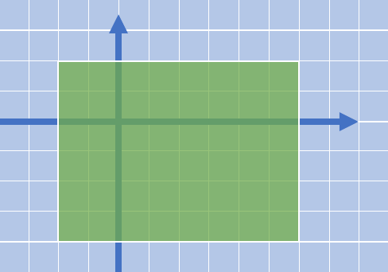
$$
\begin{bmatrix}X\\Y\\Z\end{bmatrix}=
\begin{bmatrix}
	sx&0&0\\
	0&sy&0\\
	0&0&sz
\end{bmatrix}
\begin{bmatrix}x\\y\\z\end{bmatrix}
$$


```c++
/*
 * sx, sy, sz: scale factors along the x, y, and z axes, respectively
 *
 * sx  0  0  0
 *  0 sy  0  0
 *  0  0 sz  0
 *  0  0  0  1
 *
 * see http://docs.gl/gl2/glScale
 */
mat4_t mat4_scale(float sx, float sy, float sz) 
{
    mat4_t m = mat4_identity();
    assert(sx != 0 && sy != 0 && sz != 0);
    m.m[0][0] = sx;
    m.m[1][1] = sy;
    m.m[2][2] = sz;
    return m;
}
```


## （3）平移矩阵

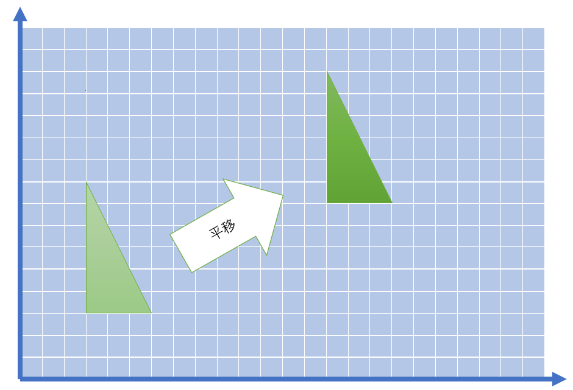

将上图拓展到三维也是一样的，平移后的每个点
$$
\begin{numcases}{}
X=x+dx
\\
Y=y+dy
\\
Z=z+dz
\end{numcases}
$$

 则
$$
\begin{bmatrix}
X\\Y\\Z
\end{bmatrix}=
\begin{bmatrix}
x\\y\\z
\end{bmatrix}+
\begin{bmatrix}dx\\dy\\dz
\end{bmatrix}
$$

如何将以上公式表示为矩阵相乘的形式呢，我们发现是无法使用3×3的矩阵表示的，因此我们引入齐次坐标

#### 齐次坐标

在齐次坐标系统中，一个点不是通过常规的笛卡尔坐标（即非齐次坐标）来表示，而是通过添加一个额外的维度来表示。

在二维空间中，一个点由三个坐标而不是两个来表示，形式为 (x, y, w)。
在三维空间中，一个点由四个坐标来表示，形式为 (x, y, z, w)。

**表示点**：当 `w` 为 1 时，表示普通点。

**表示无穷远点/向量**：在齐次坐标系统中，可以用有限的坐标表示无穷远的点。当 `w` 为 0 时，表示的是无穷远的点。即对于向量来说w=0。


回到如何表示平移矩阵的问题，此时我们使用齐次坐标就可以表示出平移矩阵了。
$$
\begin{bmatrix}X\\Y\\Z\\1\end{bmatrix}=
\begin{bmatrix}
1&0&0&dx
\\0&1&0&dy
\\0&0&1&dz
\\0&0&0&1
\end{bmatrix}

\begin{bmatrix}x\\y\\z\\1\end{bmatrix}
= 
\begin{bmatrix}
x+dx\\y+dy\\z+dz\\1
\end{bmatrix}
$$


```c++
mat4_t mat4_translate(float tx, float ty, float tz)
{
    mat4_t m = mat4_identity();
    m.m[0][3] = tx;
    m.m[1][3] = ty;
    m.m[2][3] = tz;
    return m;
}
```

不妨去上一个课时的代码里进行修改，查看平移矩阵带来的影响（不过z的影响应该是看不到的，我们来修改一下x和y的属性即可）：

```c++
//修改rasterize_triangle函数
//...
void matrix_translate(vec2_t* abc)
{
	mat4_t translate = mat4_translate(l2_x_delta_trans, l2_y_delta_trans, 0);
	vec4_t a = vec4_new(abc[0].x, abc[0].y, 0, 1);
	vec4_t b = vec4_new(abc[1].x, abc[1].y, 0, 1);
	vec4_t c = vec4_new(abc[2].x, abc[2].y, 0, 1);
	a = mat4_mul_vec4(translate, a);
	b = mat4_mul_vec4(translate, b);
	c = mat4_mul_vec4(translate, c);
	abc[0] = vec2_new(a.x, a.y);
	abc[1] = vec2_new(b.x, b.y);
	abc[2] = vec2_new(c.x, c.y);
}
vec2_t abc[3] = { vec2_new(100 , 300), vec2_new(200 , 600), vec2_new(300, 100) };
matrix_translate(abc);
```

修改之后再运行，可以看到三角形在屏幕上看到三角形平移运动。

------


# 二、空间变换

现在，我们的三角形能够实现平移、旋转和缩放了，于是我们可以思考，能否不仅仅是绘制二维的图形，而是进一步绘制出三维的图形比如立方体呢？

在屏幕中绘制立方体的某个视角图像，就类似于拍一张照片的过程。首先，我们需要拜访场景，比如将立方体等物体摆放到相应的位置，接下来摆放照相机的位置，并确定这个照相机该往哪里去看，比如朝着立方体去看。按下快门后，我们要根据镜头来裁剪场景，最终形成一张照片，显示出了立方体的某一个角度的照片。

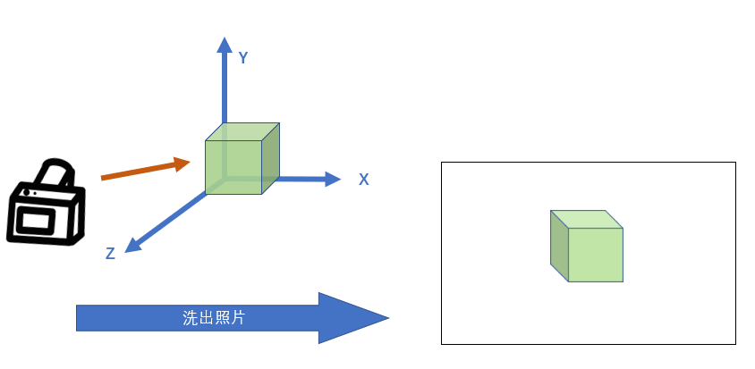

在图形学的管线中，需要经过模型空间->世界空间->相机空间->裁剪空间->屏幕空间的过程，读者可以在test_space_transform这个文件中找到对应这几个空间变换的函数。

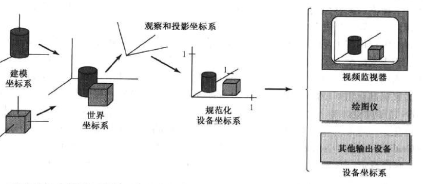

## 1.模型空间->世界空间

(看入门精要将三个轴竖着放那个讲解)TODO：

假设此时我们要渲染世界中的一个三角形，我们首先要找到这个三角形在这个世界上什么位置呢？它相对于世界的中心有多远？因此我们需要把它从模型空间转到世界空间。

> 模型空间转世界空间，对应矩阵为世界空间下模型空间XYZ三个轴竖着放。

首先我们定义一下要渲染的三角形的三个顶点的坐标，因为这里要做空间变换因此此时定义的坐标是三维的，比如下面的这个例子：

```c++
vec3_t abc_3d[3] = 
{ 
    vec3_new(-0.2, 0.3, 0.2), 
    vec3_new(0.2, 0.6, -0.2), 
    vec3_new(0.3, 0.1, 0) 
};
```

这里接下来需要左乘的是model矩阵，将三角形转到世界空间，这里我们可以先跳过这个矩阵（因为我们只有一个三角形），在后面载入属于我们的obj模型的时候会继续完善这个函数；


## 2.世界空间->相机空间

提供绿皮子算计图形学P27那个图

​	放置完场景中的物体，接下来我们需要放置照相机的位置，并确定这个照相机该往哪里去看。要决定照相机“往哪里去看”这件事，也就是说我们需要知道相机此时的朝向，即相机的向上，向右和向前方向分别是哪三个向量。

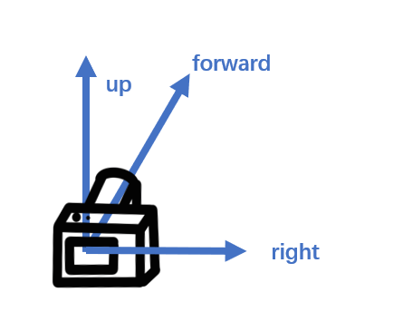

​	我们首先在世界坐标中选择一个位置$P_0=(x_0,y_0,z_0)$作为相机位置。将相机看向的物体的中心方向，作为向前方向$\overrightarrow{f}$。并且我们在一开始假设相机的向上方向是平行于Y轴的方向$\overrightarrow{u} = (0,1,0)$.那么根据相机的向上，向右和向前方向应该相互垂直，我们得到相机的向右方向 $\overrightarrow{r} = \overrightarrow{f} \times \overrightarrow{u}$

​	此时，只保证了r与f垂直以及r与u垂直，还不能保证f与u垂直，所以我们来修正一下u ，让新的 $\overrightarrow{u} = \overrightarrow{r} \times \overrightarrow{f}$   

​	这样一来，我们得到了相机位置和相机的向前方向f，向右方向r，和向上方向u，得到了相机空间/观察空间的坐标系。接下来我们就要拍照了，需要将相机移动到原点的位置，


将观察坐标系原点移动到世界坐标系原点的平移变换矩阵是：
$$
T=
\begin{bmatrix}
1&0&0&-x_0
\\0&1&0&-y_0
\\0&0&1&-z_0
\\0&0&0&1
\end{bmatrix}
$$
我们希望将相机坐标旋转到与世界空间坐标系重合，让相机向上方向u与世界空间y轴重合，向右方向与世界坐标x轴重合，但是要注意的是，向前方向是与世界坐标的-z方向重合。将观察坐标系旋转到与世界坐标系三个轴重合的组合旋转变换矩阵是R：??
$$
R^{-1}=
\begin{bmatrix}
r_x&u_x&-f_x&0\\
r_y&u_y&-f_y&0\\
r_z&u_z&-f_z&0\\
0&0&0&1
\end{bmatrix}
$$
转置

$$
R=
\begin{bmatrix}
r_x&r_y&r_z&0\\
u_x&u_y&u_z&0\\
-f_x&-f_y&-f_z&0\\
0&0&0&1
\end{bmatrix}
$$

将平移矩阵和旋转矩阵乘起来，获得最终的坐标变换矩阵 RT ??([[]【书上和这里不一样 后面看看】])
$$
R\cdot  T=
\begin{bmatrix}
r_x&r_y&r_z&-x_0\\
u_x&u_y&u_z&-y_0\\
-f_x&-f_y&-f_z&-z_0\\
0&0&0&1
\end{bmatrix}
$$


（做出类似下图）

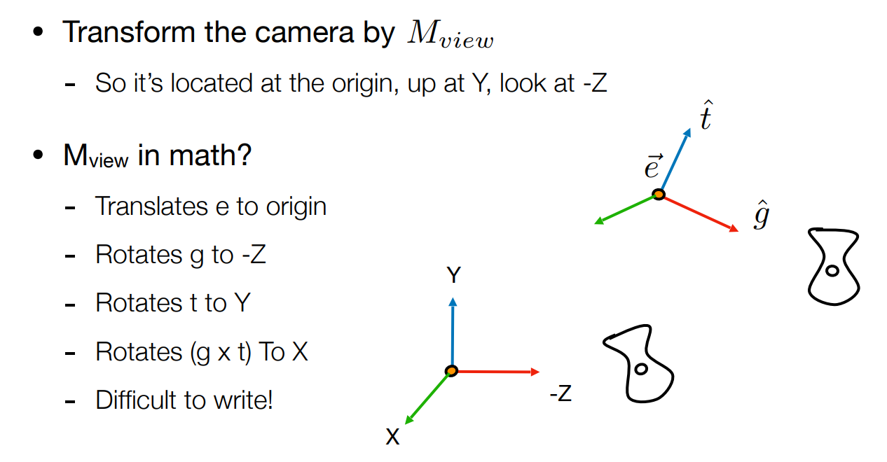

此时这个转到相机空间/观察空间的矩阵如下（推导暂略）：

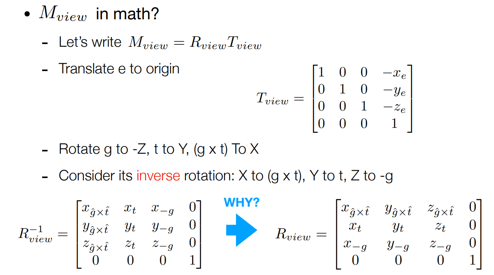

这里我们开始写代码。首先定义一个camera.h文件和对应的camera.cpp文件，用于表示相机。根据我们刚才所说，相机需要一个position和一个lookat的方向，通常来说相机还有一个宽高比aspect参数（这个在透视投影里会有用，先写进来）：

```c++
class Camera
{
public:
	vec3_t position;
	vec3_t target;
    float aspect;
};
```

lookat方向可以计算出来（target-position），后面函数会说。同时我们还要定义一个相机的UP方向`static const vec3_t UP = {0, 1, 0};`（默认相机都是抬头向上的，这也是为了方便）。这是我们就可以依据上面的矩阵写出view矩阵了（**注意下面函数还包含一步将相机的中心先移动到原点，所以其实还有一步平移矩阵（这个上面的PPT里有，但是在写的时候不要遗漏掉），具体可以看http://www.songho.ca/opengl/gl_camera.html这里的推导**）：

```c++
/*
 * eye: the position of the eye point
 * target: the position of the target point
 * up: the direction of the up vector
 *
 * x_axis.x  x_axis.y  x_axis.z  -dot(x_axis,eye)
 * y_axis.x  y_axis.y  y_axis.z  -dot(y_axis,eye)
 * z_axis.x  z_axis.y  z_axis.z  -dot(z_axis,eye)
 *        0         0         0                 1
 *
 * z_axis: normalize(eye-target), the backward vector
 * x_axis: normalize(cross(up,z_axis)), the right vector
 * y_axis: cross(z_axis,x_axis), the up vector
 *
 * see http://www.songho.ca/opengl/gl_camera.html
 */
mat4_t mat4_lookat(vec3_t eye, vec3_t target, vec3_t up) 
{
    vec3_t z_axis = vec3_normalize(vec3_sub(eye, target));
    vec3_t x_axis = vec3_normalize(vec3_cross(up, z_axis));
    vec3_t y_axis = vec3_cross(z_axis, x_axis);
    mat4_t m = mat4_identity();

    m.m[0][0] = x_axis.x;
    m.m[0][1] = x_axis.y;
    m.m[0][2] = x_axis.z;

    m.m[1][0] = y_axis.x;
    m.m[1][1] = y_axis.y;
    m.m[1][2] = y_axis.z;

    m.m[2][0] = z_axis.x;
    m.m[2][1] = z_axis.y;
    m.m[2][2] = z_axis.z;

    m.m[0][3] = -vec3_dot(x_axis, eye);
    m.m[1][3] = -vec3_dot(y_axis, eye);
    m.m[2][3] = -vec3_dot(z_axis, eye);

    return m;
}

mat4_t camera_get_view_matrix(Camera& camera)
{
	return mat4_lookat(camera.position, camera.target, UP);
}
```

另一个值得说明的点在于，由于我们希望渲染器是用户友好的，因此观察空间的X轴并不需要手动的指定，而是通过lookat方向和UP方向（默认为（0，0，1））之间的叉乘关系得到。

------


## 3.相机空间->裁剪空间

经过上面的步骤，我们的眼睛已经对准了相机，可以按下快门，将场景记录在照片上了。这就是说，这一阶段我们需要将物体投影到观察平面上，可以通过正交投影和透视投影等的方式进行。

（类似下图的图画一个 就是下图的正方体是照相机可见的渲染的场景区域）

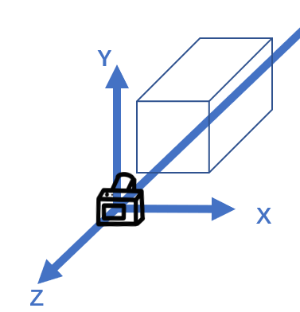


### （1）正交投影矩阵：

#### 裁剪窗口

不同的镜头类型决定了相片中能看到场景的多少，比如广角镜头就能看到更多的场景信息。正交相机能看到的三维区域可以用一个立方体框起来，立方体中的物体就是相机能看到的，立方体外的物体就是相机看不到的。而这个立方体中的场景信息会被投影到裁剪窗口，对应被相机洗出照片。

这个立方体我们称为正交投影观察体。

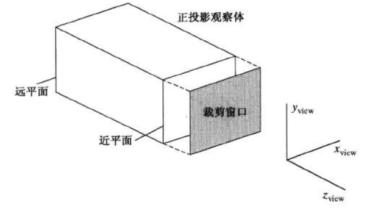

对于任意一个点$(x,y,z)$,它进行正交投影变换后等于$(x',y',z')$，其中$x$与$y$是不会改变的，等于$(x,y,z')$。

（做一个类似以上的图）

我们还需要将正交投影观察体规范化，让x,y,z 的范围规范到-1到1.

如下图所示，正交投影观察体中的点（xmin，ymin，-znear）/（left，bottom，-near）规范化后成为点（-1，-1，-1），点（xmax，ymax，-zfar）规范化后成为点（1，1，1）

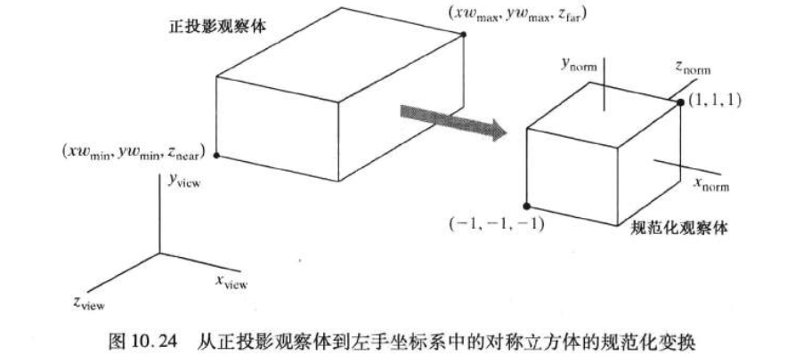

（做一个类似以上的图）

图中我们很明显能够知道，正交投影的规范化变化首先使用平移矩阵将正交投影观察体平移到原点，接着使用缩放矩阵将观察体规范化到-1到1之间。

我们规定正交投影观察体的点为（left，bottom，-near），注意这里的负号，即规定near为正，那么缩放系数$ \frac{2}{ f-n}$就不需要乘负号（有的规定会使n，f为负数，那么就需要负号，请注意甄别）。则此时右手系坐标系下正交投影矩阵写为：
$$
\mathbf{M_{ortho}}=\mathbf{R\cdot T}=
 \begin{bmatrix} 
 \frac{2}{r - l} & 0 & 0 & 0 \\
 0 & \frac{2}{t - b} & 0 & 0 \\
 0 & 0 & +\frac{2}{ f-n} & 0 \\
 0 & 0 & 0 & 1 \\
 \end{bmatrix} 
 \begin{bmatrix} 
 1 & 0 & 0 & -\frac{r + l}{2} \\
 0 & 1 & 0 & -\frac{t + b}{2} \\
 0 & 0 & 1 & +\frac{n + f}{2} \\ 
 0 & 0 & 0 & 1 \\ 
 \end{bmatrix}
 =
  \begin{bmatrix} 
 \frac{2}{r - l} & 0 & 0 & -\frac{r + l}{r - l} \\
 0 & \frac{2}{t - b} & 0 & -\frac{t + b}{t - b} \\
 0 & 0 & +\frac{2}{ f-n} & +\frac{n + f}{f-n} \\ 
 0 & 0 & 0 & 1 \\
 \end{bmatrix}
$$
但是opengl的NDC，标准设备坐标系是左手系，如果我们要以这个标准为主，那么我们需要需要将向量的z值变成它的相反数（https://learnwebgl.brown37.net/08_projections/projections_ortho.html）
$$
\mathbf{M_{convertToLeftHanded}}=
 \begin{bmatrix} 
 1 & 0 & 0 & 0 \\
 0 & 1 & 0 & 0 \\
 0 & 0 & -1 & 0 \\
 0 & 0 & 0 & 1 \\
 \end{bmatrix}
$$


所以最终的投影矩阵：
$$
\mathbf{M_{ortho}}=\mathbf{\mathbf{M_{convertToLeftHanded}} \cdot R\cdot T }=
 \begin{bmatrix} 
 1 & 0 & 0 & 0 \\
 0 & 1 & 0 & 0 \\
 0 & 0 & -1 & 0 \\
 0 & 0 & 0 & 1 \\
 \end{bmatrix}

  \begin{bmatrix} 
 \frac{2}{r - l} & 0 & 0 & -\frac{r + l}{r - l} \\
 0 & \frac{2}{t - b} & 0 & -\frac{t + b}{t - b} \\
 0 & 0 & +\frac{2}{ f-n} & +\frac{n + f}{f-n} \\ 
 0 & 0 & 0 & 1 \\
 \end{bmatrix}
  =
\begin{bmatrix} 
 \frac{2}{r - l} & 0 & 0 & -\frac{r + l}{r - l} \\
 0 & \frac{2}{t - b} & 0 & -\frac{t + b}{t - b} \\
 0 & 0 & -\frac{2}{ f-n} & -\frac{n + f}{f-n} \\ 
 0 & 0 & 0 & 1 \\
 \end{bmatrix}
$$


```c++
/*
 * 使用第二种写法，n和f为正
 * left, right: the coordinates for the left and right clipping planes
 * bottom, top: the coordinates for the bottom and top clipping planes
 * near, far: the distances to the near and far depth clipping planes
 *
 * 2/(r-l)        0         0  -(r+l)/(r-l)
 *       0  2/(t-b)         0  -(t+b)/(t-b)
 *       0        0  -2/(f-n)  -(f+n)/(f-n)
 *       0        0         0             1
 *
 * see http://docs.gl/gl2/glOrtho
 */
mat4_t mat4_ortho(float left, float right, float bottom, float top,
    float near, float far)
{
    float x_range = right - left;
    float y_range = top - bottom;
    float z_range = far - near;
    mat4_t m = mat4_identity();
    assert(x_range > 0 && y_range > 0 && z_range > 0);
    m.m[0][0] = 2 / x_range;
    m.m[1][1] = 2 / y_range;
    m.m[2][2] = -2 / z_range;
    m.m[0][3] = -(left + right) / x_range;
    m.m[1][3] = -(bottom + top) / y_range;
    m.m[2][3] = -(near + far) / z_range;
    return m;
}
```

请注意，这里的near和far都是大于0的数，这就意味着near应当<far。


### （2）正交投影矩阵版本2：

这一版其实就是上一部分的简化版本。因为很多时候我们的投影矩阵有如下规律：left=-right，bottom=-top，因此可以对矩阵进行简化：

注意near和far为正数，即假设正交投影观察体的点的为（left，bottom，-near）
$$
\mathbf{M_{ortho}}
 =
  \begin{bmatrix} 
 \frac{2}{r - l} & 0 & 0 & -\frac{r + l}{r - l} \\
 0 & \frac{2}{t - b} & 0 & -\frac{t + b}{t - b} \\
 0 & 0 & -\frac{2}{ f-n} & -\frac{n + f}{f-n} \\ 
 0 & 0 & 0 & 1 \\
 \end{bmatrix}
  =
  \begin{bmatrix} 
 \frac{2}{r - (-r)} & 0 & 0 & -\frac{r -r}{r - (-r)} \\
 0 & \frac{2}{t - (-t)} & 0 & -\frac{t + b}{t - (-t)} \\
 0 & 0 & -\frac{2}{ f-n} & -\frac{n + f}{f-n} \\ 
 0 & 0 & 0 & 1 \\
 \end{bmatrix}
   =
  \begin{bmatrix} 
 \frac{1}{r} & 0 & 0 & 0 \\
 0 & \frac{1}{t} & 0 & 0 \\
 0 & 0 & -\frac{2}{ f-n} & -\frac{n + f}{f-n} \\ 
 0 & 0 & 0 & 1 \\
 \end{bmatrix}
$$

```c++
/*
 * 使用第二种写法，n和f为正
 * right: the coordinates for the right clipping planes (left == -right)
 * top: the coordinates for the top clipping planes (bottom == -top)
 * near, far: the distances to the near and far depth clipping planes
 *
 * 1/r    0         0             0
 *   0  1/t         0             0
 *   0    0  -2/(f-n)  -(f+n)/(f-n)
 *   0    0         0             1
 *
 * this is the same as
 *     float left = -right;
 *     float bottom = -top;
 *     mat4_ortho(left, right, bottom, top, near, far);
 *
 * see http://www.songho.ca/opengl/gl_projectionmatrix.html
 */
mat4_t mat4_orthographic(float right, float top, float near, float far) {
    float z_range = far - near;
    mat4_t m = mat4_identity();
    assert(right > 0 && top > 0 && z_range > 0);
    m.m[0][0] = 1 / right;
    m.m[1][1] = 1 / top;
    m.m[2][2] = -2 / z_range;
    m.m[2][3] = -(near + far) / z_range;
    return m;
}
```

至此，正交投影矩阵就算是完成了。

------


### （3）透视投影矩阵

真实世界中，我们看到的东西实际上会符合近大远小的特点，是透视投影而不是正交投影。

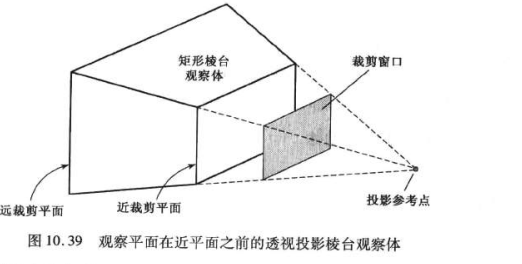

在透视投影中，观察体就不再是立方体而是棱台。

透视投影可以拆分为两个子步骤，第一步，先将观察体棱台压缩到一个立方体内，第二步，将立方体做一次正交投影。

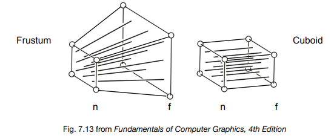

#### 棱台观察体压缩为立方体


在这个压缩过程中，我们规定：

1. 近平面上的点经过压缩后坐标不会变
2. 远平面上的点的 z 坐标不会随着压缩而变化
3. 压缩后原来远平面的中心依然是中心


我们从压缩前的棱台观察体中随机取一个点$A(x,y,z)$,将它与相机连线，与近平面相交于$C(x',y',-n)$这个点上(在前面，我们规定n与f是正数)。由于进行正交投影变换后$x'$与$y'$是不会改变的，因此点A压缩后对应的点$B(x',y',z')$的$x'$与$y'$与C是一致的。

换言之，点A对应到压缩后的立方体中是点$B(x',y',z')$，在立方体中，我们将点B进行正交投影，投影到近平面上，进行正交投影变换后$x'$与$y'$是不会改变的，得到点$C(x',y',-n)$。

则由相似三角形我们计算出压缩后的x'和y'值，但是我们注意到，此时我们是还需要得到压缩后的z'
$$
y^\prime = -\frac{z}{n}y 
\space\space\space\space\space\space\space\space\space\space\space\space 
x^\prime = -\frac{z}{n}x
$$


（下图改为-n）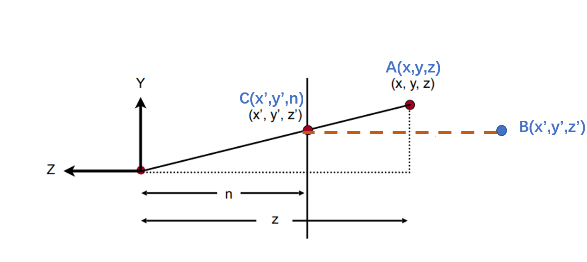

因此，对于棱台观察体中的每一个点A$\begin{bmatrix} x \\ y \\ z \\ 1 \\ \end{bmatrix}$，我们左乘M矩阵，可以将其压缩变换为立方体中的点B$\begin{bmatrix} -\frac{nx}{z} \\  -\frac{ny}{z}\\ p \\ 1 \\ \end{bmatrix}$，符合如下计算(z'是未知量)：
$$
M\begin{bmatrix} x \\ y \\ z \\ 1 \\ \end{bmatrix}=
\begin{bmatrix} -\frac{nx}{z} \\  -\frac{ny}{z}\\ z' \\ 1 \\ \end{bmatrix}
$$
将点B每个分量同时乘（-z），仍然代表点B(z''是未知量)：
$$
\begin{bmatrix} -\frac{nx}{z} \\  -\frac{ny}{z}\\ z' \\ 1 \\ \end{bmatrix} = 
\begin{bmatrix} nx \\ ny \\ z'' \\ -z \\ \end{bmatrix}
$$
将M写成4*4矩阵形式，即：
$$
M\begin{bmatrix} x \\ y \\ z \\ 1 \\ \end{bmatrix}=
\begin{bmatrix} -\frac{nx}{z} \\  -\frac{ny}{z}\\ z' \\ 1 \\ \end{bmatrix} = 
\begin{bmatrix} nx \\ ny \\ z'' \\ -z \\ \end{bmatrix} = 
\begin{bmatrix} n & 0 & 0 & 0 \\ 0 & n & 0 & 0 \\ a & b & c & d \\ 0 & 0 & -1 & 0 \\ \end{bmatrix} \begin{bmatrix} x \\ y \\ z \\ 1 \\ \end{bmatrix}
$$
##### 近平面点坐标不变

根据压缩过程中的第一条规定：近平面上的点经过压缩后坐标不会变。而近平面中所有点的$z=-n$，此时的变换后对应立方体中的点为
$$
\begin{bmatrix} -\frac{nx}{z} \\  -\frac{ny}{z}\\ z' \\ 1 \\ \end{bmatrix}
\overset{z=-n}{=} 
\begin{bmatrix} \frac{nx}{n} \\  \frac{ny}{n}\\ -n \\ 1 \\ \end{bmatrix}
\overset{\cdot n}{=}
\begin{bmatrix} nx \\ ny \\ -n^2 \\ n \\ \end{bmatrix}
$$

因此：
$$
M\begin{bmatrix} x \\ y \\ -n \\ 1 \\ \end{bmatrix}=
\begin{bmatrix} nx \\ ny \\ -n^2 \\ n \\ \end{bmatrix} = 
\begin{bmatrix} n & 0 & 0 & 0 \\ 0 & n & 0 & 0 \\ a & b & c & d \\ 0 & 0 & -1 & 0 \\ \end{bmatrix} \begin{bmatrix} x \\ y \\ -n \\ 1 \\ \end{bmatrix}=
\begin{bmatrix} nx \\ ny \\ ax + by - cn +d  \\ n \\ \end{bmatrix}
$$
即 $ax + by + cn +d = n^2$,由于$n^2$与x与y变量都无关，因此$a=0,b=0$，我们得到：
$$
-cn +d = -n^2
$$
##### 远平面中心点坐标不变

根据压缩过程中的第三条规定：压缩后原来远平面的中心点依然是中心点$\begin{bmatrix} 0 \\ 0 \\ -f \\ 1 \\ \end{bmatrix}$
$$
M\begin{bmatrix} 0 \\ 0 \\ -f \\ 1 \\ \end{bmatrix}=
\begin{bmatrix} 0 \\ 0 \\ -f \\ 1 \\ \end{bmatrix} \overset{\cdot f}{=}
\begin{bmatrix} 0 \\ 0 \\ -f^2 \\ f \\ \end{bmatrix} = 
\begin{bmatrix} n & 0 & 0 & 0 \\ 0 & n & 0 & 0 \\ 0 & 0 & c & d \\ 0 & 0 & -1 & 0 \\ \end{bmatrix} \begin{bmatrix} 0 \\ 0 \\ -f \\ 1 \\ \end{bmatrix}=
\begin{bmatrix} 0 \\ 0 \\ -cf +d  \\ f\\ \end{bmatrix}
$$
因此我们得到：
$$
-cf +d = f^2
$$
联立得到：


$$
\begin{numcases}{}
-cn +d = -n^2\\
-cf +d = -f^2
\end{numcases}
$$
解得：
$$
\begin{numcases}{}
c = n+f\\
d = nf
\end{numcases}
$$
至此，我们得到将观察体棱台压缩到一个立方体内的变换为
$$
M = \begin{bmatrix} n & 0 & 0 & 0 \\ 0 & n & 0 & 0 \\ 0 & 0 & n+f & nf \\ 0 & 0 & -1 & 0 \\ \end{bmatrix}
$$


#### 正交投影


$$
M =
\begin{bmatrix} 
 \frac{2}{r - l} & 0 & 0 & -\frac{r + l}{r - l} \\
 0 & \frac{2}{t - b} & 0 & -\frac{t + b}{t - b} \\
 0 & 0 & -\frac{2}{ f-n} & -\frac{n + f}{f-n} \\ 
 0 & 0 & 0 & 1 \\
\end{bmatrix}

\begin{bmatrix} n & 0 & 0 & 0 \\ 0 & n & 0 & 0 \\ 0 & 0 & n+f & nf \\ 0 & 0 & -1 & 0 \\ \end{bmatrix}

=
\begin{bmatrix} 
 \frac{2n}{r - l} & 0 & -\frac{r + l}{r - l} & 0 \\
 0 & \frac{2n}{t - b} &  -\frac{t + b}{t - b} & 0 \\
 0 & 0 & -\frac{n+f}{ f-n} & -\frac{2nf}{f-n} \\ 
 0 & 0 & -1 & 0 \\
\end{bmatrix}
$$
如果b=-t，l=-r，则透视投影矩阵为
$$
M 
=
\begin{bmatrix} 
 \frac{2n}{2r} & 0 & 0 & 0 \\
 0 & \frac{2n}{2t} & 0 & 0 \\
 0 & 0 & -\frac{n+f}{ f-n} & -\frac{2nf}{f-n} \\ 
 0 & 0 & -1 & 0 \\
\end{bmatrix}
=
\begin{bmatrix} 
 \frac{n}{r} & 0 & 0 & 0 \\
 0 & \frac{n}{t} & 0 & 0 \\
 0 & 0 & -\frac{n+f}{ f-n} & -\frac{2nf}{f-n} \\ 
 0 & 0 & -1 & 0 \\
\end{bmatrix}
$$


参考https://docs.gl/gl2/glFrustum这里的实现，在透视投影中，我们依然沿袭之前的near和far都是>0，且near的绝对值<far的绝对值的传统，构建透视投影矩阵如下：

```c++
/*
 * left, right: the coordinates for the left and right clipping planes
 * bottom, top: the coordinates for the bottom and top clipping planes
 * near, far: the distances to the near and far depth clipping planes
 *
 * 2n/(r-l)         0   (r+l)/(r-l)           0
 *        0  2n/(t-b)   (t+b)/(t-b)           0
 *        0         0  -(f+n)/(f-n)  -2fn/(f-n)
 *        0         0            -1           0
 *
 * see http://docs.gl/gl2/glFrustum
 */
mat4_t mat4_frustum(float left, float right, float bottom, float top,
                    float near, float far) 
{
    float x_range = right - left;
    float y_range = top - bottom;
    float z_range = far - near;
    mat4_t m = mat4_identity();
    assert(near > 0 && far > 0);
    assert(x_range > 0 && y_range > 0 && z_range > 0);
    m.m[0][0] = 2 * near / x_range;
    m.m[1][1] = 2 * near / y_range;
    m.m[0][2] = (left + right) / x_range;
    m.m[1][2] = (bottom + top) / y_range;
    m.m[2][2] = -(near + far) / z_range;
    m.m[2][3] = -2 * near * far / z_range;
    m.m[3][2] = -1;
    m.m[3][3] = 0;
    return m;
}
```


### （4）透视投影矩阵——Perspective


在刚才我们有提及到相机类有一个参数是`float aspect;`，这个是相机画幅的长宽比$\frac{width}{height}$。实际上，往往还有一个FOV参数（了解摄影的朋友应该很熟悉）,在公式中我们将竖直方向的FOV表示为$\theta$。下图很好地揭示了Aspect参数，FOV参数与刚才上面的透视投影矩阵的参数的关系（图来自https://www.songho.ca/opengl/gl_projectionmatrix.html#google_vignette）：
$$
\frac{top}{near} = tan(\frac{\theta}{2}) \\ 
top = tan(\frac{\theta}{2})\cdot near\\
right = top \cdot \frac{width}{height} = top \cdot aspect = tan(\frac{\theta}{2})\cdot near\cdot aspect \\
$$
将这些带入以上透视投影矩阵得到：
$$
M 
=

\begin{bmatrix} 
 \frac{n}{r} & 0 & 0 & 0 \\
 0 & \frac{n}{t} & 0 & 0 \\
 0 & 0 & -\frac{n+f}{ f-n} & -\frac{2nf}{f-n} \\ 
 0 & 0 & -1 & 0 \\
\end{bmatrix}
=

\begin{bmatrix} 
 \frac{n}{  tan(\frac{\theta}{2})\cdot aspect\cdot n} & 0 & 0 & 0 \\
 0 & \frac{n}{ tan(\frac{\theta}{2})\cdot n} & 0 & 0 \\
 0 & 0 & -\frac{n+f}{ f-n} & -\frac{2nf}{f-n} \\ 
 0 & 0 & -1 & 0 \\
\end{bmatrix}

=

\begin{bmatrix} 
 \frac{1}{  tan(\frac{\theta}{2})\cdot aspect} & 0 & 0 & 0 \\
 0 & \frac{1}{ tan(\frac{\theta}{2})} & 0 & 0 \\
 0 & 0 & -\frac{n+f}{ f-n} & -\frac{2nf}{f-n} \\ 
 0 & 0 & -1 & 0 \\
\end{bmatrix}
$$


画一个类似下图

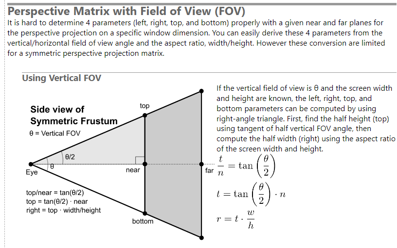

因此，不难写出Perspective版本的透视投影矩阵（因为FOV和aspect的定义，其实这里还暗含着b=-t，l=-r）：

```c++
/*
 * fovy: the field of view angle in the y direction, in radians
 * aspect: the aspect ratio, defined as width divided by height
 * near, far: the distances to the near and far depth clipping planes
 *
 * 1/(aspect*tan(fovy/2))              0             0           0
 *                      0  1/tan(fovy/2)             0           0
 *                      0              0  -(f+n)/(f-n)  -2fn/(f-n)
 *                      0              0            -1           0
 *
 * this is the same as
 *     float half_h = near * (float)tan(fovy / 2);
 *     float half_w = half_h * aspect;
 *     mat4_frustum(-half_w, half_w, -half_h, half_h, near, far);
 *
 * see http://www.songho.ca/opengl/gl_projectionmatrix.html
 */
mat4_t mat4_perspective(float fovy, float aspect, float near, float far) 
{
    float z_range = far - near;
    mat4_t m = mat4_identity();
    assert(fovy > 0 && aspect > 0);
    assert(near > 0 && far > 0 && z_range > 0);
    m.m[1][1] = 1 / (float)tan(fovy / 2);
    m.m[0][0] = m.m[1][1] / aspect;
    m.m[2][2] = -(near + far) / z_range;
    m.m[2][3] = -2 * near * far / z_range;
    m.m[3][2] = -1;
    m.m[3][3] = 0;
    return m;
}
```

推导一下就会发现这个Perspective矩阵完全等价于上面的Frustum矩阵，但对用户来说更加容易理解。

实际上，这种Perspective的矩阵形式是我们这个渲染器所最常使用的，因为相对来说需要调整的参数更少一些，而且更好理解。

------

此时，整个Camera.cpp文件如下：

```c++
#include "camera.h"

static const float NEAR = 0.1f;
static const float FAR = 10000;
static const float FOVY = TO_RADIANS(60);
static const vec3_t UP = { 0, 1, 0 };

mat4_t camera_get_view_matrix(Camera& camera)
{
	return mat4_lookat(camera.position, camera.target, UP);
}

mat4_t camera_get_proj_matrix(Camera& camera) 
{
	return mat4_perspective(FOVY, camera.aspect, NEAR, FAR);
}
```

注：暂时我们先把很多参数写死，后面如果有需求会开放更多的参数。

------


## 4.透视除法+视口映射

经过透视投影之后，我们的点的齐次坐标（xyzw）中的w就有了数值而不再是1，接下来我们需要对其进行透视除法（同除w），具体的代码如下：

```c++
vec4_t clip_abc[3];
vec3_t ndc_coords[3];

for (int i = 0; i < 3; i++)
{
	clip_abc[i] = mat4_mul_vec4(proj_matrix, mat4_mul_vec4(view_matrix, vec4_from_vec3(abc_3d[i], 1)));
	vec3_t clip_coord = vec3_from_vec4(clip_abc[i]);
	ndc_coords[i] = vec3_div(clip_coord, clip_abc[i].w);  //这一步是做透视除法
	vec3_t window_coord = viewport_transform(width, height, ndc_coords[i]); //这一步是做视口变换
}

```

> **请注意！！这里有不少细节还没有处理好，但为了让读者能够很好地看到不错地效果，就先这样写着。**

接下来就是映射到视口了，


做了投影之后,范围会被规范化到$[-1,1]^3$,所以接下来要转换为屏幕坐标,这里我们认为像素的坐标是以左下角为定位点的,中心应该是(x+0.5,y+0.5),矩阵如下(复习前面的,先缩放再平移):
$$
M_{viewport}=\left[\begin{matrix} \frac{width}{2} & 0 & 0&\frac{width}{2} \\ 0&\frac{height}{2}&0&\frac{height}{2} \\ 0&0&\frac{1}{2}&\frac{1}{2} \\0&0&0&1 \end{matrix}\right]
$$

------

这个函数这样写：

我们之所有要保留z是为了后续的深度测试等操作，需要保留深度值。

```c++
/*
 * for viewport transformation, see subsection 2.12.1 of
 * https://www.khronos.org/registry/OpenGL/specs/es/2.0/es_full_spec_2.0.pdf
 */
vec3_t viewport_transform(int width, int height, vec3_t ndc_coord)
{
	float x = (ndc_coord.x + 1) * 0.5f * (float)width;   /* [-1, 1] -> [0, w] */
	float y = (ndc_coord.y + 1) * 0.5f * (float)height;  /* [-1, 1] -> [0, h] */
	float z = (ndc_coord.z + 1) * 0.5f;                  /* [-1, 1] -> [0, 1] */
	return vec3_new(x, y, z);
}
```

此时我们把视口映射加入到空间变换当中，修改之后的代码如下：

```c++
void space_transform(framebuffer_t* framebuffer)
{
	vec4_t default_color = { 0, 0, 0, 1 };
	framebuffer_clear_color(framebuffer, default_color); //请注意，在每tick绘制之前，先清空一下framebuffer
	//绘制三角形的主函数
	int width = framebuffer->width;
	int height = framebuffer->height;
	vec3_t abc_3d[3] = { vec3_new(-0.2, 0.3, 0.2), vec3_new(0.2, 0.6, -0.2), vec3_new(0.3, 0.1, 0) };
	vec3_t camera_pos = vec3_new(0, 0, 1.5f);
	vec3_t target_pos = vec3_new(0, 0, 0);
	//Camera *camera = new Camera(camera_pos, target_pos, (float)WINDOW_WIDTH / (float)WINDOW_HEIGHT);
	Camera camera(camera_pos, target_pos, (float)WINDOW_WIDTH / (float)WINDOW_HEIGHT);
	mat4_t view_matrix = camera_get_view_matrix(camera);
	mat4_t proj_matrix = camera_get_proj_matrix(camera);
	vec4_t clip_abc[3];
	vec3_t ndc_coords[3];

	vec2_t screen_coords[3];
	float screen_depths[3];

	for (int i = 0; i < 3; i++)
	{
		clip_abc[i] = mat4_mul_vec4(proj_matrix, mat4_mul_vec4(view_matrix, vec4_from_vec3(abc_3d[i], 1)));
		vec3_t clip_coord = vec3_from_vec4(clip_abc[i]);
		ndc_coords[i] = vec3_div(clip_coord, clip_abc[i].w);  //这一步是做透视除法
		vec3_t window_coord = viewport_transform(width, height, ndc_coords[i]); //这一步是做视口变换
		screen_coords[i] = vec2_new(window_coord.x, window_coord.y);
		screen_depths[i] = window_coord.z;
	}

	//vec2_t abc[3] = { vec2_new(100 , 300), vec2_new(200 , 600), vec2_new(300, 100) };

	bbox_t bbox = find_bounding_box(screen_coords, width, height);
	//...后面一样，只不过现在要渲染的三角形的三个顶点的二维坐标被存在了screen_coords里
}
```

运行，得到的效果如下：

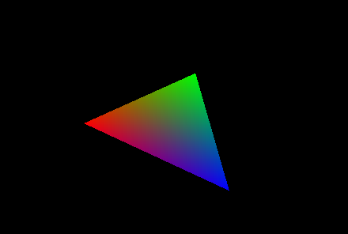


## 5.加强效果！

到这里其实看不出来什么空间变换的意思，因为只有一个三角形。不妨试一下渲染一个立方体：

```c++
void space_transform(framebuffer_t* framebuffer)
{
	vec4_t default_color = { 0, 0, 0, 1 };
	framebuffer_clear_color(framebuffer, default_color); //请注意，在每tick绘制之前，先清空一下framebuffer
	//绘制三角形的主函数
	int width = framebuffer->width;
	int height = framebuffer->height;

	float vertices[] = //这里的每三个值是一个顶点，每九个值构成一个三角形
	{
		-0.5f, -0.5f, -0.5f,  
		 0.5f, -0.5f, -0.5f,  
		 0.5f,  0.5f, -0.5f,  
		 0.5f,  0.5f, -0.5f, 
		-0.5f,  0.5f, -0.5f,  
		-0.5f, -0.5f, -0.5f,  

		-0.5f, -0.5f,  0.5f,  
		 0.5f, -0.5f,  0.5f,  
		 0.5f,  0.5f,  0.5f,  
		 0.5f,  0.5f,  0.5f,  
		-0.5f,  0.5f,  0.5f,  
		-0.5f, -0.5f,  0.5f,  

		-0.5f,  0.5f,  0.5f,  
		-0.5f,  0.5f, -0.5f,  
		-0.5f, -0.5f, -0.5f,  
		-0.5f, -0.5f, -0.5f,  
		-0.5f, -0.5f,  0.5f,  
		-0.5f,  0.5f,  0.5f, 

		 0.5f,  0.5f,  0.5f,  
		 0.5f,  0.5f, -0.5f,  
		 0.5f, -0.5f, -0.5f, 
		 0.5f, -0.5f, -0.5f,  
		 0.5f, -0.5f,  0.5f,  
		 0.5f,  0.5f,  0.5f,  

		-0.5f, -0.5f, -0.5f,  
		 0.5f, -0.5f, -0.5f,  
		 0.5f, -0.5f,  0.5f,  
		 0.5f, -0.5f,  0.5f,  
		-0.5f, -0.5f,  0.5f,  
		-0.5f, -0.5f, -0.5f,  

		-0.5f,  0.5f, -0.5f,  
		 0.5f,  0.5f, -0.5f,  
		 0.5f,  0.5f,  0.5f,  
		 0.5f,  0.5f,  0.5f,  
		-0.5f,  0.5f,  0.5f,  
		-0.5f,  0.5f, -0.5f,  
	};

	vec3_t camera_pos = vec3_new(0, -1, 1.5f);
	vec3_t target_pos = vec3_new(0, 0, 0);
	//Camera *camera = new Camera(camera_pos, target_pos, (float)WINDOW_WIDTH / (float)WINDOW_HEIGHT);
	Camera camera(camera_pos, target_pos, (float)WINDOW_WIDTH / (float)WINDOW_HEIGHT);
	mat4_t view_matrix = camera_get_view_matrix(camera);
	mat4_t proj_matrix = camera_get_proj_matrix(camera);

	//每三个顶点赋值给abc_3d,一共绘制12个三角形
	for (int index = 0; index < 12; index++)
	{
		vec3_t abc_3d[3] = { vec3_new(vertices[index * 9], vertices[index * 9 + 1], vertices[index * 9 + 2]),
			vec3_new(vertices[index * 9 + 3], vertices[index * 9 + 4], vertices[index * 9 + 5]),
			vec3_new(vertices[index * 9 + 6], vertices[index * 9 + 7], vertices[index * 9 + 8]) };
		
		vec4_t clip_abc[3];
		vec3_t ndc_coords[3];

		vec2_t screen_coords[3];
		float screen_depths[3];

		for (int i = 0; i < 3; i++)
		{
			clip_abc[i] = mat4_mul_vec4(proj_matrix, mat4_mul_vec4(view_matrix, vec4_from_vec3(abc_3d[i], 1)));//透视投影
			vec3_t clip_coord = vec3_from_vec4(clip_abc[i]);
			ndc_coords[i] = vec3_div(clip_coord, clip_abc[i].w);  //这一步是做透视除法
			vec3_t window_coord = viewport_transform(width, height, ndc_coords[i]); //这一步是做视口变换
			screen_coords[i] = vec2_new(window_coord.x, window_coord.y);
			screen_depths[i] = window_coord.z;
		}

        //将当前这个三角形绘制到屏幕上
		bbox_t bbox = find_bounding_box(screen_coords, width, height);
		//random 0-1 color
		vec4_t color1{ (float)rand() / RAND_MAX, (float)rand() / RAND_MAX, (float)rand() / RAND_MAX, 1 }; //注：会有一点闪，这是为了能够看清立体感，不然都是纯色的
		for (int i = bbox.min_x; i <= bbox.max_x; i++)
		{
			for (int j = bbox.min_y; j <= bbox.max_y; j++)
			{
				vec2_t p{ (float)(i + 0.5), (float)(j + 0.5) };
				vec3_t result = calculate_weights(screen_coords, p);
				
				if (!(result.x > 0 && result.y > 0 && result.z > 0)) continue;
				draw_fragment(framebuffer, j * width + i, color1);
			}
		}
	}
	
}
```

此时得到的结果如下：

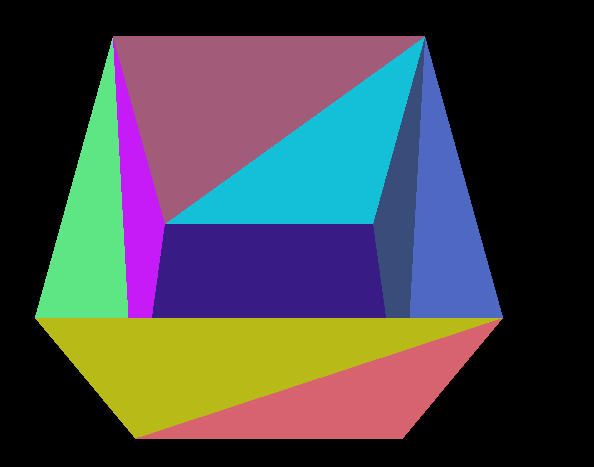

读者可能会觉得这个渲染出来的“箱子”有点不对劲，好像“三角形渲染的顺序出了问题”。这是因为我们还没有进行ZBuffer的处理，这就是下一节课程的一部分预告了。读者可以尝试在Github仓库的test_space_transform.cpp文件中，将以下部分注释的代码打开：

```c++
if (z < zbuffer[screen_index])
{
    zbuffer[screen_index] = z;
}
else
{
    continue;
}
```

添加这几行代码就可以渲染出如下图所示的箱子了：

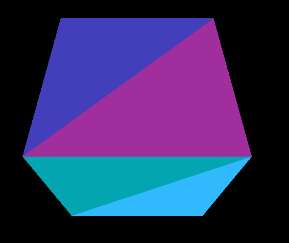

这就是ZBuffer的魅力，更多的内容将在下一节进行介绍。

> 注：也许你会觉得相机的位姿跟想象有点不一样，这主要是因为UP方向被规定为了（0，1，0），所以如果相机的lookat方向是斜着的话会显得跟目标效果不太一致，在后续课程中我们会实现WASD移动和按住鼠标旋转相机，所以这里问题暂时不大，可以不太管。

------


# 三、一个重要的注意事项——重心插值的结果


我们已经知道三角形投影变换后的三个顶点在屏幕上的坐标$\large(x_{\tiny A},y_{\tiny A})，(x_{\tiny B},y_{\tiny B})，(x_{\tiny C},y_{\tiny C})$和目标像素$P( x , y )$，似乎就能算出P点的在**屏幕中呈现的三角形**中的重心坐标，然后里有一个很容易出错的地方，而在我们前面的实现中也是错误的（虽然结果好像没看出来），那就是**我们不能直接拿屏幕空间重心插值得到的结果对模型空间的属性进行插值（例如深度、顶点颜色、法线等）**。

原因有很多，比如投影后三角形的形状一般情况下会发生形变。空间中一个正三角形，投影后可能变成一个特别窄的三角形，这时候计算出来的该像素的重心坐标肯定与空间中该像素对应的点在三角形内的重心坐标不同，如果直接插值会导致错误的结果。

有的读者可能会想到，直接对屏幕空间的像素点P应用透视投影矩阵的逆，做个逆变换变回原来的空间中，就知道P点在空间中的准确位置了可以进行正确的重心插值，但是一个例如1080p 的屏幕有1920 x 1080= 2,073,600 个像素，每个像素都要做一次逆矩阵运算的话计算量过于庞大了。

因此，在这个地方，我们需要做一次重心插值矫正。


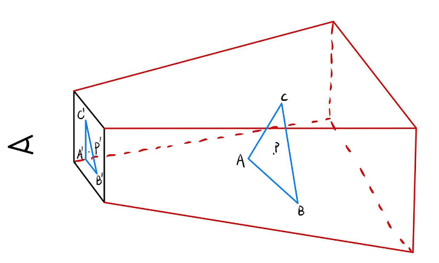

以下我们以插值深度为例。


#### 建立投影前后重心坐标的关系 

 $\alpha'$, $\beta'$, $\gamma'$是屏幕空间的P点在屏幕空间三角形ABC中计算得到的重心坐标，符合：
$$
\begin{equation}
    1 = \alpha' + \beta' + \gamma'
\end{equation}
$$
进行变形，我们可以得到：
$$
\begin{equation}
   	\frac{Z}{Z} = \frac{Z_A}{Z_A} \alpha' + \frac{Z_B}{Z_B}  \beta' + \frac{Z_C}{Z_C}  \gamma'
\end{equation}
$$
其中，$Z$ 是屏幕空间的点 $P$ 所对应的投影前的点的正确深度值，是我们求解的目标值。$Z_A$, $Z_B$, $Z_C$ 是空间中 $A$, $B$, $C$ 三个顶点的深度值。

接下来，对上述公式两边同时乘以  $Z$, 得：：
$$
\begin{equation}
    Z = \left(\frac{Z}{Z_A}\alpha' \right) Z_A + \left( \frac{Z}{Z_B} \beta' \right) Z_B + \left( \frac{Z}{Z_C} \gamma' \right) Z_C \tag{1}
\end{equation}
$$
比较之前的深度插值公式：
$$
\begin{equation}
    Z = \alpha Z_A + \beta Z_B + \gamma Z_C \cdots \cdots \cdots \cdots \tag{2}
\end{equation}
$$
由（1）和（2）公式对应项系数相等，我们得到：
$$
\alpha = \frac{Z}{Z_A} \alpha', \quad \beta = \frac{Z}{Z_B} \beta', \quad \gamma = \frac{Z}{Z_C} \gamma'\cdots \cdots \cdots \tag{3}
$$
#### 导出透视修正后的深度插值公式

我们可以将公式（3）带入 $1 = \alpha + \beta + \gamma$，重新排列为：
$$
\begin{equation}
    1 = \frac{Z}{Z_A} \alpha' + \frac{Z}{Z_B} \beta' + \frac{Z}{Z_C} \gamma' \cdots \cdots \cdots \tag{4}
\end{equation}
$$
最后，对等式（4）两边同时乘以$ \frac{1}{Z} $ ，可以得到最终的透视修正深度插值公式：
$$
\begin{equation}
    \frac{1}{Z} = \alpha' \frac{1}{Z_A} + \beta' \frac{1}{Z_B} + \gamma' \frac{1}{Z_C}
\end{equation}
$$
至此，我们通过投影后的屏幕空间三角形内点 $P'$ 的 $\alpha'$, $\beta'$, $\gamma'$，计算出投影前三角形内点 $P$ 的深度值$Z$。


#### 任意属性插值

不止是深度，我们希望包括颜色，法线等在内的其他属性也能够得到正确的插值结果。我们用$ ( I_A, I_B, I_C )$ 表示三角形三个顶点的属性值。

##### 插值公式

目标点的属性 $ I$  可以通过以下公式计算： $ I = \alpha I_A + \beta I_B + \gamma I_C $

这里的$ \alpha, \beta, \gamma $ 是该点在正确空间的三角形内的重心坐标，它们的和为1。

将公式（3）带入 $ I = \alpha I_A + \beta I_B + \gamma I_C $，我们得到：
$$
  I =  ( \frac{Z}{Z_A}\alpha')I_A +  (\frac{Z}{Z_B}\beta')I_B + (\frac{Z}{Z_C}\gamma')I_C 
$$
整理一下 ：
$$
I = Z \cdot \left( \alpha' \frac{I_A}{Z_A} + \beta' \frac{I_B}{Z_B} + \gamma' \frac{I_C}{Z_C} \right)
$$


在https://registry.khronos.org/OpenGL/specs/es/2.0/es_full_spec_2.0.pdf这篇文章中的3.5.1小节，有这样一段话：

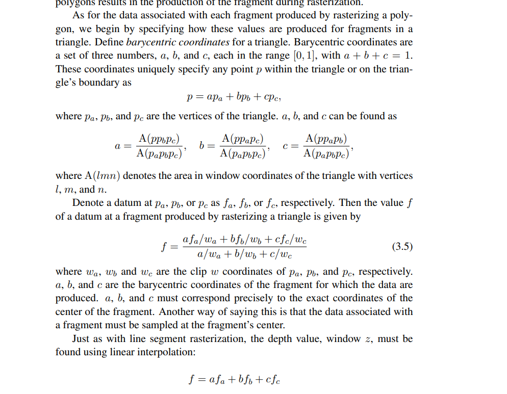

## 1.插值深度（有点不确定对错，参照OpenGL）

也就是说，针对深度，我们可以这样插值：

```c++
for (int i = 0; i < 3; i++)
{
	clip_abc[i] = mat4_mul_vec4(proj_matrix, mat4_mul_vec4(view_matrix, vec4_from_vec3(abc_3d[i], 1)));
	vec3_t clip_coord = vec3_from_vec4(clip_abc[i]);
	ndc_coords[i] = vec3_div(clip_coord, clip_abc[i].w);  //这一步是做透视除法
	vec3_t window_coord = viewport_transform(width, height, ndc_coords[i]); //这一步是做视口变换
	screen_coords[i] = vec2_new(window_coord.x, window_coord.y);
	screen_depths[i] = window_coord.z;
}
for (x = bbox.min_x; x <= bbox.max_x; x++) {
    for (y = bbox.min_y; y <= bbox.max_y; y++) {
        vec2_t point = vec2_new((float)x + 0.5f, (float)y + 0.5f);
        vec3_t weights = calculate_weights(screen_coords, point);
        int weight0_okay = weights.x > -EPSILON;
		int weight1_okay = weights.y > -EPSILON;
		int weight2_okay = weights.z > -EPSILON;
		if (weight0_okay && weight1_okay && weight2_okay) {
    		int index = y * width + x;
    		float depth = interpolate_depth(screen_depths, weights);
            //...
        }
```

> 这里似乎是在深度插值中直接对Z以屏幕空间三角形的重心坐标做重心插值。这跟https://blog.csdn.net/Motarookie/article/details/124284471这篇链接中讲到的重心插值不太一样，感觉针对重心插值的情况还是按照OpenGL官方的报告书上的来写会比较合适。


## 2.插值其他任意属性

对应的代码如下（参考上面的公式）：

```c++
float recip_w[3];
for (int i = 0; i < 3; i++)
{
	clip_abc[i] = mat4_mul_vec4(proj_matrix, mat4_mul_vec4(view_matrix, vec4_from_vec3(abc_3d[i], 1)));
	recip_w[i] = 1 / clip_abc[i].w;
    //...
}
vec3_t interpolate_varyings(vec3_t& weights, float recip_w[3])  //weights是屏幕空间求解出来的重心坐标，recip_w存储的是齐次坐标的w项
{
	float weight0 = recip_w[0] * weights.x;
	float weight1 = recip_w[1] * weights.y;
	float weight2 = recip_w[2] * weights.z;
	float normalizer = 1 / (weight0 + weight1 + weight2);
	return vec3_t{ weight0 * normalizer, weight1 * normalizer, weight2 * normalizer };
}
vec4_t color =vec4_add(vec4_mul(color1,new_weights.x), vec4_add(vec4_mul(color2, new_weights.y),vec4_mul(color3,new_weights.z)));  //这里代码写的比较丑，其实就是求出新的重心坐标权重，然后对三个顶点的color做加权平均
```

做了相关的改动之后，`test_space_transform.cpp`包含了或许正确的重心坐标插值公式，读者可以去对应仓库的提交记录进行查看。

------

至此，本课时暂时完成。接下来我们会用一个课时的时间来对相机进行平移、旋转、缩放操作，使用回调函数处理鼠标和键盘的监听事件，这样也方便我们实时查看渲染器的视觉效果的正确与否。
