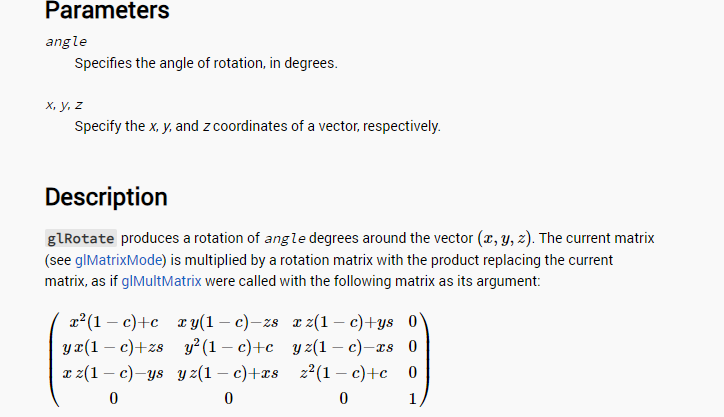

# 课时2——空间变换

**暂时先主要讲解实现，矩阵的推导放在真正做教程的时候再来做。**

现在我们在屏幕上绘制出了第一个三角形，但这个三角形是静止的（也许你完成了上一课时的作业，但三角形依然变换的比较无聊）。通过这个课时的学习和实践，我们希望能够把这个三角形变得“立体化”，像是一个三维的三角形，并绘制属于我们的第一个箱子模型（一个box，从obj格式的文件中读取）

> 注意：我们实现的是OpenGL标准，这就意味着都是矩阵乘向量这种形式，如果要对向量旋转，需要把旋转矩阵乘在左边。


# 一、平移、旋转、缩放

这里直接给出对应的矩阵链接，暂时不讲推导，等到真正需要教学的时候再推导。

## （1）平移矩阵

```c++
mat4_t mat4_translate(float tx, float ty, float tz)
{
    mat4_t m = mat4_identity();
    m.m[0][3] = tx;
    m.m[1][3] = ty;
    m.m[2][3] = tz;
    return m;
}
```

不妨去上一个课时的代码里进行修改，查看平移矩阵带来的影响（不过z的影响应该是看不到的，我们来修改一下x和y的属性即可）：

```c++
//修改rasterize_triangle函数
//...
void matrix_translate(vec2_t* abc)
{
	mat4_t translate = mat4_translate(l2_x_delta_trans, l2_y_delta_trans, 0);
	vec4_t a = vec4_new(abc[0].x, abc[0].y, 0, 1);
	vec4_t b = vec4_new(abc[1].x, abc[1].y, 0, 1);
	vec4_t c = vec4_new(abc[2].x, abc[2].y, 0, 1);
	a = mat4_mul_vec4(translate, a);
	b = mat4_mul_vec4(translate, b);
	c = mat4_mul_vec4(translate, c);
	abc[0] = vec2_new(a.x, a.y);
	abc[1] = vec2_new(b.x, b.y);
	abc[2] = vec2_new(c.x, c.y);
}
vec2_t abc[3] = { vec2_new(100 , 300), vec2_new(200 , 600), vec2_new(300, 100) };
matrix_rotateZ(abc);
```

修改之后再运行，可以看到三角形在屏幕上看到三角形平移运动。

------


## （2）旋转矩阵

```c++
/*
 * angle: the angle of rotation, in radians
 *
 *  1  0  0  0
 *  0  c -s  0
 *  0  s  c  0
 *  0  0  0  1
 *
 * see http://www.songho.ca/opengl/gl_anglestoaxes.html
 */
mat4_t mat4_rotate_x(float angle) //传入的angle是弧度，意味着90度是PI/2.0
{
    float c = (float)cos(angle);
    float s = (float)sin(angle);
    mat4_t m = mat4_identity();
    m.m[1][1] = c;
    m.m[1][2] = -s;
    m.m[2][1] = s;
    m.m[2][2] = c;
    return m;
}

/*
 * angle: the angle of rotation, in radians
 *
 *  c  0  s  0
 *  0  1  0  0
 * -s  0  c  0
 *  0  0  0  1
 *
 * see http://www.songho.ca/opengl/gl_anglestoaxes.html
 */
mat4_t mat4_rotate_y(float angle)
{
    float c = (float)cos(angle);
    float s = (float)sin(angle);
    mat4_t m = mat4_identity();
    m.m[0][0] = c;
    m.m[0][2] = s;
    m.m[2][0] = -s;
    m.m[2][2] = c;
    return m;
}

/*
 * angle: the angle of rotation, in radians
 *
 *  c -s  0  0
 *  s  c  0  0
 *  0  0  1  0
 *  0  0  0  1
 *
 * see http://www.songho.ca/opengl/gl_anglestoaxes.html
 */
mat4_t mat4_rotate_z(float angle)
{
    float c = (float)cos(angle);
    float s = (float)sin(angle);
    mat4_t m = mat4_identity();
    m.m[0][0] = c;
    m.m[0][1] = -s;
    m.m[1][0] = s;
    m.m[1][1] = c;
    return m;
}
```

在提供的Github代码中，有测试绕着Z轴旋转的相关的测试函数，读者可以进行测试，查看旋转矩阵的执行效果。

------


## （3）缩放矩阵

```c++
/*
 * sx, sy, sz: scale factors along the x, y, and z axes, respectively
 *
 * sx  0  0  0
 *  0 sy  0  0
 *  0  0 sz  0
 *  0  0  0  1
 *
 * see http://docs.gl/gl2/glScale
 */
mat4_t mat4_scale(float sx, float sy, float sz) 
{
    mat4_t m = mat4_identity();
    assert(sx != 0 && sy != 0 && sz != 0);
    m.m[0][0] = sx;
    m.m[1][1] = sy;
    m.m[2][2] = sz;
    return m;
}
```


## （4）绕着任意轴旋转

这里有一个罗德里格斯公式，有兴趣的话可以了解一下，根据https://docs.gl/gl2/glRotate即OpenGL的官方文档，这个矩阵如下：



这里的c指的是cos（angle）， s指的是sin（angle），xyz则是归一化的向量（意味着||x，y，z||==1）。读者可以在`mat4_t mat4_rotate(float angle, float vx, float vy, float vz)`这个函数中找到对应的实现。


------


# 二、空间变换

在图形学的管线中，需要经过模型空间->世界空间->相机空间->裁剪空间->屏幕空间的过程，读者可以在test_space_transform这个文件中找到对应这几个空间变换的函数。

## 1.模型空间->世界空间

> 模型空间转世界空间，对应矩阵为世界空间下模型空间XYZ三个轴竖着放。

首先我们定义一下要渲染的三角形的三个顶点的坐标，因为这里要做空间变换因此此时定义的坐标是三维的，比如下面的这个例子：

```c++
vec3_t abc_3d[3] = { vec3_new(-0.2, 0.3, 0.2), vec3_new(0.2, 0.6, -0.2), vec3_new(0.3, 0.1, 0) };
```

这里接下来需要左乘的是model矩阵，将三角形转到世界空间，这里我们可以先跳过这个矩阵（因为我们只有一个三角形），在后面载入属于我们的obj模型的时候会继续完善这个函数；


## 2.世界空间->相机空间

一般定义相机位姿的时候，需要提供一个相机的camera_position（对应下图的向量e）和相机看向的物体的中心方向，即look_at方向（对应下图的向量g），


此时这个转到相机空间/观察空间的矩阵如下（推导暂略）：


这里我们开始写代码。首先定义一个camera.h文件和对应的camera.cpp文件，用于表示相机。根据我们刚才所说，相机需要一个position和一个lookat的方向，通常来说相机还有一个宽高比aspect参数（这个在透视投影里会有用，先写进来）：

```c++
class Camera
{
public:
	vec3_t position;
	vec3_t target;
    float aspect;
};
```

lookat方向可以计算出来（target-position），后面函数会说。同时我们还要定义一个相机的UP方向`static const vec3_t UP = {0, 1, 0};`（默认相机都是抬头向上的，这也是为了方便）。这是我们就可以依据上面的矩阵写出view矩阵了（**注意下面函数还包含一步将相机的中心先移动到原点，所以其实还有一步平移矩阵（这个上面的PPT里有，但是在写的时候不要遗漏掉），具体可以看http://www.songho.ca/opengl/gl_camera.html这里的推导**）：

```c++
/*
 * eye: the position of the eye point
 * target: the position of the target point
 * up: the direction of the up vector
 *
 * x_axis.x  x_axis.y  x_axis.z  -dot(x_axis,eye)
 * y_axis.x  y_axis.y  y_axis.z  -dot(y_axis,eye)
 * z_axis.x  z_axis.y  z_axis.z  -dot(z_axis,eye)
 *        0         0         0                 1
 *
 * z_axis: normalize(eye-target), the backward vector
 * x_axis: normalize(cross(up,z_axis)), the right vector
 * y_axis: cross(z_axis,x_axis), the up vector
 *
 * see http://www.songho.ca/opengl/gl_camera.html
 */
mat4_t mat4_lookat(vec3_t eye, vec3_t target, vec3_t up) 
{
    vec3_t z_axis = vec3_normalize(vec3_sub(eye, target));
    vec3_t x_axis = vec3_normalize(vec3_cross(up, z_axis));
    vec3_t y_axis = vec3_cross(z_axis, x_axis);
    mat4_t m = mat4_identity();

    m.m[0][0] = x_axis.x;
    m.m[0][1] = x_axis.y;
    m.m[0][2] = x_axis.z;

    m.m[1][0] = y_axis.x;
    m.m[1][1] = y_axis.y;
    m.m[1][2] = y_axis.z;

    m.m[2][0] = z_axis.x;
    m.m[2][1] = z_axis.y;
    m.m[2][2] = z_axis.z;

    m.m[0][3] = -vec3_dot(x_axis, eye);
    m.m[1][3] = -vec3_dot(y_axis, eye);
    m.m[2][3] = -vec3_dot(z_axis, eye);

    return m;
}

mat4_t camera_get_view_matrix(Camera& camera)
{
	return mat4_lookat(camera.position, camera.target, UP);
}
```

另一个值得说明的点在于，由于我们希望渲染器是用户友好的，因此观察空间的X轴并不需要手动的指定，而是通过lookat方向和UP方向（默认为（0，0，1））之间的叉乘关系得到。

------


## 3.相机空间->裁剪空间

这一步往往需要经过投影变换，这里包括正交投影和透视投影。同样地，我们暂时不做矩阵的推导（后面应该会做补充，读者感兴趣可以自己先去看下推导），而是直接给出这两种矩阵。

### （1）正交投影矩阵：

```c++
/*
 * left, right: the coordinates for the left and right clipping planes
 * bottom, top: the coordinates for the bottom and top clipping planes
 * near, far: the distances to the near and far depth clipping planes
 *
 * 2/(r-l)        0         0  -(r+l)/(r-l)
 *       0  2/(t-b)         0  -(t+b)/(t-b)
 *       0        0  -2/(f-n)  -(f+n)/(f-n)
 *       0        0         0             1
 *
 * see http://docs.gl/gl2/glOrtho
 */
mat4_t mat4_ortho(float left, float right, float bottom, float top,
    float near, float far)
{
    float x_range = right - left;
    float y_range = top - bottom;
    float z_range = far - near;
    mat4_t m = mat4_identity();
    assert(x_range > 0 && y_range > 0 && z_range > 0);
    m.m[0][0] = 2 / x_range;
    m.m[1][1] = 2 / y_range;
    m.m[2][2] = -2 / z_range;
    m.m[0][3] = -(left + right) / x_range;
    m.m[1][3] = -(bottom + top) / y_range;
    m.m[2][3] = -(near + far) / z_range;
    return m;
}
```

请注意，这里的near和far都是大于0的数，这就意味着near应当<far。


### （2）正交投影矩阵版本2：

这一版其实就是上一部分的简化版本。因为很多时候我们的投影矩阵有如下规律：left=-right，bottom=-top，因此可以对矩阵进行简化：

```c++
/*
 * right: the coordinates for the right clipping planes (left == -right)
 * top: the coordinates for the top clipping planes (bottom == -top)
 * near, far: the distances to the near and far depth clipping planes
 *
 * 1/r    0         0             0
 *   0  1/t         0             0
 *   0    0  -2/(f-n)  -(f+n)/(f-n)
 *   0    0         0             1
 *
 * this is the same as
 *     float left = -right;
 *     float bottom = -top;
 *     mat4_ortho(left, right, bottom, top, near, far);
 *
 * see http://www.songho.ca/opengl/gl_projectionmatrix.html
 */
mat4_t mat4_orthographic(float right, float top, float near, float far) {
    float z_range = far - near;
    mat4_t m = mat4_identity();
    assert(right > 0 && top > 0 && z_range > 0);
    m.m[0][0] = 1 / right;
    m.m[1][1] = 1 / top;
    m.m[2][2] = -2 / z_range;
    m.m[2][3] = -(near + far) / z_range;
    return m;
}
```

至此，正交投影矩阵就算是完成了。

------


### （3）透视投影矩阵

参考https://docs.gl/gl2/glFrustum这里的实现，在透视投影中，我们依然沿袭之前的near和far都是>0，且near的绝对值<far的绝对值的传统，构建透视投影矩阵如下：

```c++
/*
 * left, right: the coordinates for the left and right clipping planes
 * bottom, top: the coordinates for the bottom and top clipping planes
 * near, far: the distances to the near and far depth clipping planes
 *
 * 2n/(r-l)         0   (r+l)/(r-l)           0
 *        0  2n/(t-b)   (t+b)/(t-b)           0
 *        0         0  -(f+n)/(f-n)  -2fn/(f-n)
 *        0         0            -1           0
 *
 * see http://docs.gl/gl2/glFrustum
 */
mat4_t mat4_frustum(float left, float right, float bottom, float top,
                    float near, float far) 
{
    float x_range = right - left;
    float y_range = top - bottom;
    float z_range = far - near;
    mat4_t m = mat4_identity();
    assert(near > 0 && far > 0);
    assert(x_range > 0 && y_range > 0 && z_range > 0);
    m.m[0][0] = 2 * near / x_range;
    m.m[1][1] = 2 * near / y_range;
    m.m[0][2] = (left + right) / x_range;
    m.m[1][2] = (bottom + top) / y_range;
    m.m[2][2] = -(near + far) / z_range;
    m.m[2][3] = -2 * near * far / z_range;
    m.m[3][2] = -1;
    m.m[3][3] = 0;
    return m;
}
```


### （4）透视投影矩阵——Perspective

在刚才我们有提及到相机类有一个参数是`float aspect;`，这个是相机画幅的长宽比。实际上，往往还有一个FOV参数（了解摄影的朋友应该很熟悉）。下图很好地揭示了Aspect参数，FOV参数与刚才那个透视投影矩阵的参数时间的关系（图来自https://www.songho.ca/opengl/gl_projectionmatrix.html#google_vignette）：


因此，不难写出Perspective版本的透视投影矩阵（因为FOV和aspect的定义，其实这里还暗含着b=-t，l=-r）：

```c++
/*
 * fovy: the field of view angle in the y direction, in radians
 * aspect: the aspect ratio, defined as width divided by height
 * near, far: the distances to the near and far depth clipping planes
 *
 * 1/(aspect*tan(fovy/2))              0             0           0
 *                      0  1/tan(fovy/2)             0           0
 *                      0              0  -(f+n)/(f-n)  -2fn/(f-n)
 *                      0              0            -1           0
 *
 * this is the same as
 *     float half_h = near * (float)tan(fovy / 2);
 *     float half_w = half_h * aspect;
 *     mat4_frustum(-half_w, half_w, -half_h, half_h, near, far);
 *
 * see http://www.songho.ca/opengl/gl_projectionmatrix.html
 */
mat4_t mat4_perspective(float fovy, float aspect, float near, float far) 
{
    float z_range = far - near;
    mat4_t m = mat4_identity();
    assert(fovy > 0 && aspect > 0);
    assert(near > 0 && far > 0 && z_range > 0);
    m.m[1][1] = 1 / (float)tan(fovy / 2);
    m.m[0][0] = m.m[1][1] / aspect;
    m.m[2][2] = -(near + far) / z_range;
    m.m[2][3] = -2 * near * far / z_range;
    m.m[3][2] = -1;
    m.m[3][3] = 0;
    return m;
}
```

推导一下就会发现这个Perspective矩阵完全等价于上面的Frustum矩阵，但对用户来说更加容易理解。

实际上，这种Perspective的矩阵形式是我们这个渲染器所最常使用的，因为相对来说需要调整的参数更少一些，而且更好理解。

------

此时，整个Camera.cpp文件如下：

```c++
#include "camera.h"

static const float NEAR = 0.1f;
static const float FAR = 10000;
static const float FOVY = TO_RADIANS(60);
static const vec3_t UP = { 0, 1, 0 };

mat4_t camera_get_view_matrix(Camera& camera)
{
	return mat4_lookat(camera.position, camera.target, UP);
}

mat4_t camera_get_proj_matrix(Camera& camera) 
{
	return mat4_perspective(FOVY, camera.aspect, NEAR, FAR);
}
```

注：暂时我们先把很多参数写死，后面如果有需求会开放更多的参数。

------


## 4.透视除法+视口映射

经过透视投影之后，我们的点的齐次坐标（xyzw）中的w就有了数值，接下来我们需要对其进行透视除法，具体的代码如下：

```c++
vec4_t clip_abc[3];
vec3_t ndc_coords[3];

for (int i = 0; i < 3; i++)
{
	clip_abc[i] = mat4_mul_vec4(proj_matrix, mat4_mul_vec4(view_matrix, vec4_from_vec3(abc_3d[i], 1)));
	vec3_t clip_coord = vec3_from_vec4(clip_abc[i]);
	ndc_coords[i] = vec3_div(clip_coord, clip_abc[i].w);  //这一步是做透视除法
	vec3_t window_coord = viewport_transform(width, height, ndc_coords[i]); //这一步是做视口变换
}

```

> **请注意！！这里有不少细节还没有处理好，但为了让读者能够很好地看到不错地效果，就先这样写着。**

接下来就是映射到视口了，这个函数这样写：

```c++
/*
 * for viewport transformation, see subsection 2.12.1 of
 * https://www.khronos.org/registry/OpenGL/specs/es/2.0/es_full_spec_2.0.pdf
 */
vec3_t viewport_transform(int width, int height, vec3_t ndc_coord)
{
	float x = (ndc_coord.x + 1) * 0.5f * (float)width;   /* [-1, 1] -> [0, w] */
	float y = (ndc_coord.y + 1) * 0.5f * (float)height;  /* [-1, 1] -> [0, h] */
	float z = (ndc_coord.z + 1) * 0.5f;                  /* [-1, 1] -> [0, 1] */
	return vec3_new(x, y, z);
}
```

此时我们把视口映射加入到空间变换当中，修改之后的代码如下：

```c++
void space_transform(framebuffer_t* framebuffer)
{
	vec4_t default_color = { 0, 0, 0, 1 };
	framebuffer_clear_color(framebuffer, default_color); //请注意，在每tick绘制之前，先清空一下framebuffer
	//绘制三角形的主函数
	int width = framebuffer->width;
	int height = framebuffer->height;
	vec3_t abc_3d[3] = { vec3_new(-0.2, 0.3, 0.2), vec3_new(0.2, 0.6, -0.2), vec3_new(0.3, 0.1, 0) };
	vec3_t camera_pos = vec3_new(0, 0, 1.5f);
	vec3_t target_pos = vec3_new(0, 0, 0);
	//Camera *camera = new Camera(camera_pos, target_pos, (float)WINDOW_WIDTH / (float)WINDOW_HEIGHT);
	Camera camera(camera_pos, target_pos, (float)WINDOW_WIDTH / (float)WINDOW_HEIGHT);
	mat4_t view_matrix = camera_get_view_matrix(camera);
	mat4_t proj_matrix = camera_get_proj_matrix(camera);
	vec4_t clip_abc[3];
	vec3_t ndc_coords[3];

	vec2_t screen_coords[3];
	float screen_depths[3];

	for (int i = 0; i < 3; i++)
	{
		clip_abc[i] = mat4_mul_vec4(proj_matrix, mat4_mul_vec4(view_matrix, vec4_from_vec3(abc_3d[i], 1)));
		vec3_t clip_coord = vec3_from_vec4(clip_abc[i]);
		ndc_coords[i] = vec3_div(clip_coord, clip_abc[i].w);  //这一步是做透视除法
		vec3_t window_coord = viewport_transform(width, height, ndc_coords[i]); //这一步是做视口变换
		screen_coords[i] = vec2_new(window_coord.x, window_coord.y);
		screen_depths[i] = window_coord.z;
	}

	//vec2_t abc[3] = { vec2_new(100 , 300), vec2_new(200 , 600), vec2_new(300, 100) };

	bbox_t bbox = find_bounding_box(screen_coords, width, height);
	//...后面一样，只不过现在要渲染的三角形的三个顶点的二维坐标被存在了screen_coords里
}
```

运行，得到的效果如下：


## 5.加强效果！

到这里其实看不出来什么空间变换的意思，因为只有一个三角形。不妨试一下渲染一个立方体：

```c++
void space_transform(framebuffer_t* framebuffer)
{
	vec4_t default_color = { 0, 0, 0, 1 };
	framebuffer_clear_color(framebuffer, default_color); //请注意，在每tick绘制之前，先清空一下framebuffer
	//绘制三角形的主函数
	int width = framebuffer->width;
	int height = framebuffer->height;

	float vertices[] = //这里的每三个值是一个顶点，每九个值构成一个三角形
	{
		-0.5f, -0.5f, -0.5f,  
		 0.5f, -0.5f, -0.5f,  
		 0.5f,  0.5f, -0.5f,  
		 0.5f,  0.5f, -0.5f, 
		-0.5f,  0.5f, -0.5f,  
		-0.5f, -0.5f, -0.5f,  

		-0.5f, -0.5f,  0.5f,  
		 0.5f, -0.5f,  0.5f,  
		 0.5f,  0.5f,  0.5f,  
		 0.5f,  0.5f,  0.5f,  
		-0.5f,  0.5f,  0.5f,  
		-0.5f, -0.5f,  0.5f,  

		-0.5f,  0.5f,  0.5f,  
		-0.5f,  0.5f, -0.5f,  
		-0.5f, -0.5f, -0.5f,  
		-0.5f, -0.5f, -0.5f,  
		-0.5f, -0.5f,  0.5f,  
		-0.5f,  0.5f,  0.5f, 

		 0.5f,  0.5f,  0.5f,  
		 0.5f,  0.5f, -0.5f,  
		 0.5f, -0.5f, -0.5f, 
		 0.5f, -0.5f, -0.5f,  
		 0.5f, -0.5f,  0.5f,  
		 0.5f,  0.5f,  0.5f,  

		-0.5f, -0.5f, -0.5f,  
		 0.5f, -0.5f, -0.5f,  
		 0.5f, -0.5f,  0.5f,  
		 0.5f, -0.5f,  0.5f,  
		-0.5f, -0.5f,  0.5f,  
		-0.5f, -0.5f, -0.5f,  

		-0.5f,  0.5f, -0.5f,  
		 0.5f,  0.5f, -0.5f,  
		 0.5f,  0.5f,  0.5f,  
		 0.5f,  0.5f,  0.5f,  
		-0.5f,  0.5f,  0.5f,  
		-0.5f,  0.5f, -0.5f,  
	};

	vec3_t camera_pos = vec3_new(0, -1, 1.5f);
	vec3_t target_pos = vec3_new(0, 0, 0);
	//Camera *camera = new Camera(camera_pos, target_pos, (float)WINDOW_WIDTH / (float)WINDOW_HEIGHT);
	Camera camera(camera_pos, target_pos, (float)WINDOW_WIDTH / (float)WINDOW_HEIGHT);
	mat4_t view_matrix = camera_get_view_matrix(camera);
	mat4_t proj_matrix = camera_get_proj_matrix(camera);

	//每三个顶点赋值给abc_3d,一共绘制12个三角形
	for (int index = 0; index < 12; index++)
	{
		vec3_t abc_3d[3] = { vec3_new(vertices[index * 9], vertices[index * 9 + 1], vertices[index * 9 + 2]),
			vec3_new(vertices[index * 9 + 3], vertices[index * 9 + 4], vertices[index * 9 + 5]),
			vec3_new(vertices[index * 9 + 6], vertices[index * 9 + 7], vertices[index * 9 + 8]) };
		
		vec4_t clip_abc[3];
		vec3_t ndc_coords[3];

		vec2_t screen_coords[3];
		float screen_depths[3];

		for (int i = 0; i < 3; i++)
		{
			clip_abc[i] = mat4_mul_vec4(proj_matrix, mat4_mul_vec4(view_matrix, vec4_from_vec3(abc_3d[i], 1)));
			vec3_t clip_coord = vec3_from_vec4(clip_abc[i]);
			ndc_coords[i] = vec3_div(clip_coord, clip_abc[i].w);  //这一步是做透视除法
			vec3_t window_coord = viewport_transform(width, height, ndc_coords[i]); //这一步是做视口变换
			screen_coords[i] = vec2_new(window_coord.x, window_coord.y);
			screen_depths[i] = window_coord.z;
		}

		bbox_t bbox = find_bounding_box(screen_coords, width, height);
		//random 0-1 color
		vec4_t color1{ (float)rand() / RAND_MAX, (float)rand() / RAND_MAX, (float)rand() / RAND_MAX, 1 }; //注：会有一点闪，这是为了能够看清立体感，不然都是纯色的
		for (int i = bbox.min_x; i <= bbox.max_x; i++)
		{
			for (int j = bbox.min_y; j <= bbox.max_y; j++)
			{
				vec2_t p{ (float)(i + 0.5), (float)(j + 0.5) };
				vec3_t result = calculate_weights(screen_coords, p);
				
				if (!(result.x > 0 && result.y > 0 && result.z > 0)) continue;
				draw_fragment(framebuffer, j * width + i, color1);
			}
		}
	}
	
}
```

此时得到的结果如下：


读者可能会觉得这个渲染出来的“箱子”有点不对劲，好像“三角形渲染的顺序出了问题”。这是因为我们还没有进行ZBuffer的处理，这就是下一节课程的一部分预告了。读者可以尝试在Github仓库的test_space_transform.cpp文件中，将以下部分注释的代码打开：

```c++
if (z < zbuffer[screen_index])
{
    zbuffer[screen_index] = z;
}
else
{
    continue;
}
```

添加这几行代码就可以渲染出如下图所示的箱子了：


这就是ZBuffer的魅力，更多的内容将在下一节进行介绍。

> 注：也许你会觉得相机的位姿跟想象有点不一样，这主要是因为UP方向被规定为了（0，1，0），所以如果相机的lookat方向是斜着的话会显得跟目标效果不太一致，在后续课程中我们会实现WASD移动和按住鼠标旋转相机，所以这里问题暂时不大，可以不太管。

------


# 三、一个重要的注意事项——重心插值的结果

这里有一个很容易出错的地方，而在我们前面的实现中也是错误的（虽然结果好像没看出来），那就是**我们不能直接拿屏幕空间重心插值得到的结果对模型空间的属性进行插值（例如顶点颜色、法线等）**。这里可以参考如下所示的一篇博客：https://blog.csdn.net/Motarookie/article/details/124284471，讲解的会比较清晰一些。以下记录重点：

