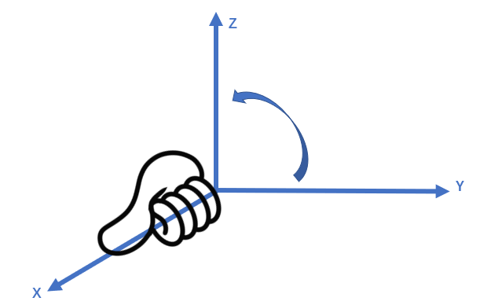
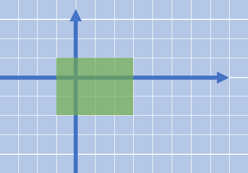
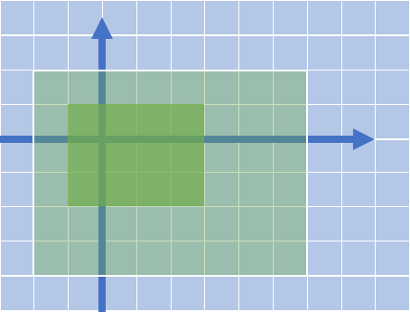
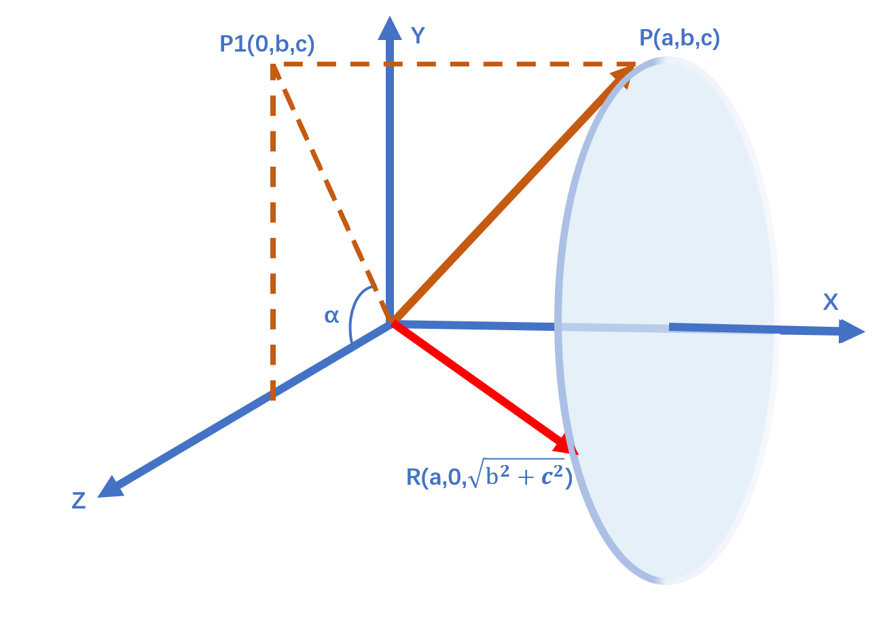

# 课时2——空间变换

*

现在我们在屏幕上绘制出了第一个三角形，但这个三角形是静止的（也许你完成了上一课时的作业，但三角形依然变换的比较无聊）。通过这个课时的学习和实践，我们希望能够把这个三角形变得“立体化”，像是一个三维的三角形，并绘制属于我们的第一个箱子模型（一个box，从obj格式的文件中读取）

> 注意：我们实现的是OpenGL标准，这就意味着都是矩阵乘向量这种形式，如果要对向量旋转，需要把旋转矩阵乘在左边。


# 一、平移、旋转、缩放

这里直接给出对应的矩阵链接，暂时不讲推导，等到真正需要教学的时候再推导。

## （1）平移矩阵


平移后的每个点
$$
\begin{numcases}{}
X=x+dx\\Y=y+dy
\end{numcases}
$$

 则
$$
\begin{bmatrix}X\\Y\end{bmatrix}=\begin{bmatrix}x\\y\end{bmatrix}+\begin{bmatrix}dx\\dy\end{bmatrix}
$$

如何将以上公式表示为矩阵相乘的形式呢，我们使用齐次坐标为这个矩阵增加一维
$$
\begin{bmatrix}X\\Y\\1\end{bmatrix}=\begin{bmatrix}1&0&dx\\0&1&dy\\0&0&1\end{bmatrix}\begin{bmatrix}x\\y\\1\end{bmatrix}
= \begin{bmatrix}x+dx\\y+dy\\1\end{bmatrix}
$$


```c++
mat4_t mat4_translate(float tx, float ty, float tz)
{
    mat4_t m = mat4_identity();
    m.m[0][3] = tx;
    m.m[1][3] = ty;
    m.m[2][3] = tz;
    return m;
}
```

不妨去上一个课时的代码里进行修改，查看平移矩阵带来的影响（不过z的影响应该是看不到的，我们来修改一下x和y的属性即可）：

```c++
//修改rasterize_triangle函数
//...
void matrix_translate(vec2_t* abc)
{
	mat4_t translate = mat4_translate(l2_x_delta_trans, l2_y_delta_trans, 0);
	vec4_t a = vec4_new(abc[0].x, abc[0].y, 0, 1);
	vec4_t b = vec4_new(abc[1].x, abc[1].y, 0, 1);
	vec4_t c = vec4_new(abc[2].x, abc[2].y, 0, 1);
	a = mat4_mul_vec4(translate, a);
	b = mat4_mul_vec4(translate, b);
	c = mat4_mul_vec4(translate, c);
	abc[0] = vec2_new(a.x, a.y);
	abc[1] = vec2_new(b.x, b.y);
	abc[2] = vec2_new(c.x, c.y);
}
vec2_t abc[3] = { vec2_new(100 , 300), vec2_new(200 , 600), vec2_new(300, 100) };
matrix_rotateZ(abc);
```

修改之后再运行，可以看到三角形在屏幕上看到三角形平移运动。

------


## （2）旋转矩阵


#### 围绕Z轴旋转


绕z轴旋转。此时我们暂时不考虑齐次坐标，这里的第三维目前表示的是z

假设旋转矩阵为
$$
\begin{bmatrix}a&b&0\\c&d&0\\0&0&1\end{bmatrix}
$$

$$
\begin{bmatrix}X\\Y\\Z\end{bmatrix}=\begin{bmatrix}a&b&0\\c&d&0\\0&0&1\end{bmatrix}\begin{bmatrix}x\\y\\z\end{bmatrix}
$$

我们假设以下这个情景，有一个三角形围绕着原点旋转


三角形中的点$(x,0)$旋转后成为点$(xcos\theta,xsin\theta)$
$$
\begin{bmatrix}xcos\theta\\xsin\theta\\1\end{bmatrix}=\begin{bmatrix}i&j&0\\k&l&0\\0&0&1\end{bmatrix}\begin{bmatrix}x\\0\\1\end{bmatrix}
$$

$$
\begin{numcases}{}
x*cos\theta = x*i \\
x*sin\theta = x*k  \\
\end{numcases}
$$

$$
\begin{numcases}{}
i= cos\theta \\
k= sin\theta
\end{numcases}
$$


三角形中的顶点$(0,y)$旋转后成为点$(-ysin\theta,ycos\theta)$
$$
\begin{bmatrix}-ysin\theta\\ycos\theta\\1\end{bmatrix}=\begin{bmatrix}i&j&0\\k&l&0\\0&0&1\end{bmatrix}\begin{bmatrix}0\\y\\1\end{bmatrix}
$$

$$
\begin{numcases}{}
-y*sin\theta = y*j \\
y*cos\theta = y*l  \\
\end{numcases}
$$

$$
\begin{numcases}{}
j= -sin\theta  \\
l= cos\theta
\end{numcases}
$$

因此我们得到绕着z轴旋转的旋转矩阵为：
$$
\begin{bmatrix}cos\theta&-sin\theta&0\\sin\theta&cos\theta&0\\0&0&1\end{bmatrix}
$$

#### 围绕X轴旋转



不难想出，如果是绕着x轴旋转，则
$$
\begin{bmatrix}Y\\Z\end{bmatrix}=
\begin{bmatrix}
	cos\theta&-sin\theta\\
	sin\theta&cos\theta
\end{bmatrix}
\begin{bmatrix}y\\z\end{bmatrix}
$$


$$
\begin{bmatrix}X\\Y\\Z\end{bmatrix}=
\begin{bmatrix}
	1&0&0\\
	0&cos\theta&-sin\theta\\
	0&sin\theta&cos\theta
\end{bmatrix}
\begin{bmatrix}x\\y\\z\end{bmatrix}
$$

#### 围绕Y轴旋转


如果是绕着y旋转，

根据右手法则，$\overrightarrow{Z} \times \overrightarrow{X} = \overrightarrow{Y} $

则


$$
\begin{bmatrix}Z\\X\end{bmatrix}=
\begin{bmatrix}
	cos\theta&-sin\theta\\
	sin\theta&cos\theta
\end{bmatrix}
\begin{bmatrix}z\\x\end{bmatrix}
$$
但是我们在旋转矩阵中，z向x旋转 $\theta$ 角度 等价于x向z旋转 $-\theta$ 角度

因此
$$
\begin{bmatrix}X\\Z\end{bmatrix}=
\begin{bmatrix}
	cos(-\theta)&-sin(-\theta)\\
	sin(-\theta)&cos(-\theta)
\end{bmatrix}
\begin{bmatrix}X\\Z\end{bmatrix}
$$

$$
\begin{bmatrix}X\\Z\end{bmatrix}=
\begin{bmatrix}
	cos\theta&sin\theta\\
	-sin\theta&cos\theta
\end{bmatrix}
\begin{bmatrix}X\\Z\end{bmatrix}
$$

$$
\begin{bmatrix}X\\Y\\Z\end{bmatrix}=
\begin{bmatrix}
	cos\theta&0&sin\theta\\
	0&1&0\\
	-sin\theta&0&cos\theta
\end{bmatrix}
\begin{bmatrix}x\\y\\z\end{bmatrix}
$$


```c++
/*
 * angle: the angle of rotation, in radians
 *
 *  1  0  0  0
 *  0  c -s  0
 *  0  s  c  0
 *  0  0  0  1
 *
 * see http://www.songho.ca/opengl/gl_anglestoaxes.html
 */
mat4_t mat4_rotate_x(float angle) //传入的angle是弧度，意味着90度是PI/2.0
{
    float c = (float)cos(angle);
    float s = (float)sin(angle);
    mat4_t m = mat4_identity();
    m.m[1][1] = c;
    m.m[1][2] = -s;
    m.m[2][1] = s;
    m.m[2][2] = c;
    return m;
}

/*
 * angle: the angle of rotation, in radians
 *
 *  c  0  s  0
 *  0  1  0  0
 * -s  0  c  0
 *  0  0  0  1
 *
 * see http://www.songho.ca/opengl/gl_anglestoaxes.html
 */
mat4_t mat4_rotate_y(float angle)
{
    float c = (float)cos(angle);
    float s = (float)sin(angle);
    mat4_t m = mat4_identity();
    m.m[0][0] = c;
    m.m[0][2] = s;
    m.m[2][0] = -s;
    m.m[2][2] = c;
    return m;
}

/*
 * angle: the angle of rotation, in radians
 *
 *  c -s  0  0
 *  s  c  0  0
 *  0  0  1  0
 *  0  0  0  1
 *
 * see http://www.songho.ca/opengl/gl_anglestoaxes.html
 */
mat4_t mat4_rotate_z(float angle)
{
    float c = (float)cos(angle);
    float s = (float)sin(angle);
    mat4_t m = mat4_identity();
    m.m[0][0] = c;
    m.m[0][1] = -s;
    m.m[1][0] = s;
    m.m[1][1] = c;
    return m;
}
```

在提供的Github代码中，有测试绕着Z轴旋转的相关的测试函数，读者可以进行测试，查看旋转矩阵的执行效果。

------


## （3）缩放矩阵

以原点为中心进行缩放

 
$$
\begin{bmatrix}X\\Y\\Z\end{bmatrix}=
\begin{bmatrix}
	sx&0&0\\
	0&sy&0\\
	0&0&sz
\end{bmatrix}
\begin{bmatrix}x\\y\\z\end{bmatrix}
$$


```c++
/*
 * sx, sy, sz: scale factors along the x, y, and z axes, respectively
 *
 * sx  0  0  0
 *  0 sy  0  0
 *  0  0 sz  0
 *  0  0  0  1
 *
 * see http://docs.gl/gl2/glScale
 */
mat4_t mat4_scale(float sx, float sy, float sz) 
{
    mat4_t m = mat4_identity();
    assert(sx != 0 && sy != 0 && sz != 0);
    m.m[0][0] = sx;
    m.m[1][1] = sy;
    m.m[2][2] = sz;
    return m;
}
```


## （4）绕着任意轴旋转

第一种情况是这个任意轴过原点，那么我们按照以下步骤操作

1. 将旋转轴旋转至XOZ平面=>图中的R轴
2. 将旋转轴旋转至于Z轴重合=>图中的T轴
3. 绕Z轴旋转θ度
4. 执行步骤2的逆过程
5. 执行步骤1的逆过程


##### 将旋转轴旋转至XOZ平面


假设P绕着X轴旋转$\alpha$得到R，我们将P投影到YOZ上得到P1点（0,b,c）,





从图中不难看出，$cos\alpha =\frac{c}{\sqrt{b^2+c^2}}$,$sin\alpha =\frac{b}{\sqrt{b^2+c^2}}$

根据一.2中”围绕X轴旋转“对应的公式，我们得到围绕X轴旋转的公式为

$$Rx(\alpha)=\begin{bmatrix}1&0&0&0\\0&cos\alpha&-sin\alpha&0\\0&sin\alpha&cos\alpha&0\\0&0&0&1\end{bmatrix}=\begin{bmatrix}1&0&0&0\\0&\frac{c}{\sqrt{b^2+c^2}}&-\frac{b}{\sqrt{b^2+c^2}}&0\\0&\frac{b}{\sqrt{b^2+c^2}}&\frac{c}{\sqrt{b^2+c^2}}&0\\0&0&0&1\end{bmatrix}$$


##### 将R轴旋转至与Z轴重合


我们将R**绕Y轴旋转**至与Z轴重台，顺时针旋转的角度为$\beta$,则逆时针旋转角度为$-\beta$

$$cos(-\beta)=cos\beta=\frac{\sqrt{b^{2}+c^{2}}}{\sqrt{a^{2}+b^{2}+c^{2}}},\quad sin(-\beta)=-sin\beta=-\frac{a}{\sqrt{a^{2}+b^{2}+c^{2}}}$$

根据一.2中”围绕Y轴旋转“对应的公式，我们得到围绕Y轴旋转的公式为
$$
Ry(-\beta)=\begin{bmatrix}cos\beta&0&sin(-\beta)&0\\0&1&0&0\\-sin(-\beta)&0&cos\beta&0\\0&0&0&1\end{bmatrix}=\begin{bmatrix}\frac{\sqrt{b^2+c^2}}{\sqrt{a^2+b^2+c^2}}&0&-\frac{a}{\sqrt{a^2+b^2+c^2}}&0\\0&1&0&0\\\frac{a}{\sqrt{a^2+b^2+c^2}}&0&\frac{\sqrt{b^2+c^2}}{\sqrt{a^2+b^2+c^2}}&0\\0&0&0&1\end{bmatrix}
$$


##### 围绕Z轴旋转

根据一.2中”围绕Z轴旋转“对应的公式，我们得到围绕X轴旋转的公式为
$$
Rx(\theta)=\begin{bmatrix}
cos\theta&-sin\theta&0&0
\\sin\theta&cos\theta&0&0
\\0&0&1&0
\\0&0&0&1
\end{bmatrix}
$$


##### 整合

我们按照步骤将以上的矩阵相乘,得到：

$$M=R_{x}(-\alpha)\cdot R_{y}(\beta)\cdot R_{z}(\theta)\cdot R_{y}(-\beta)\cdot R_{x}(\alpha)$$

即

$$\begin{bmatrix}a^2+(1-a^2)cos\theta&ab(1-cos\theta)+csin\theta&ac(1-cos\theta)-bsin\theta&0\\ab(1-cos\theta)-csin\theta&b^2+(1-b^2)cos\theta&bc(1-cos\theta)+asin\theta&0\\ac(1-cos\theta)+bsin\theta&bc(1-cos\theta)-asin\theta&c^2+(1-c^2)cos\theta&0\\0&0&0&1\end{bmatrix}$$


