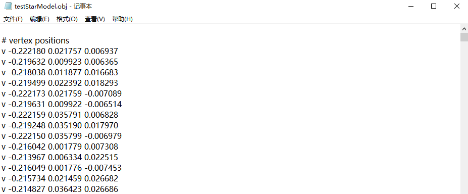
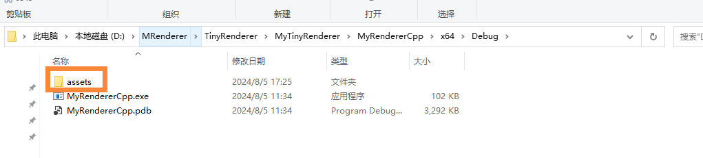
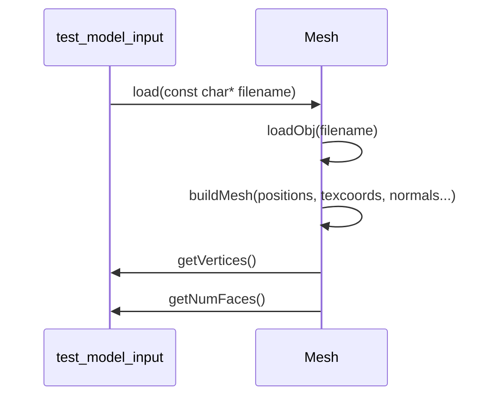
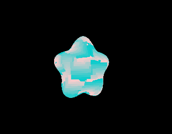
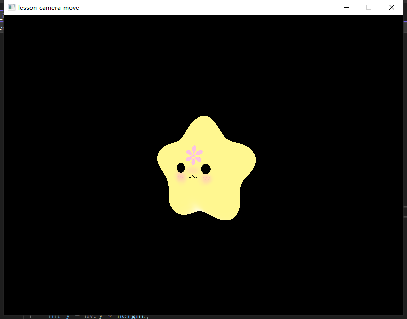

# 课时4——模型解析与导入

**这节课主要来做obj模型的解析和导入，同学们也能够为导入自己喜欢的模型进行后续的学习。**


# 一、3D模型的表示--以obj为例

这节课我们会首先讲讲单网格（mesh）的obj模型的简单解析。后续会逐步进行更多的解析。


## 1、知识点

我们拿一个obj模型文件打开来进行查看

`v(x,y,z)` :以v开头的表示的是顶点，后面三个值表示xyz。例如：

```
# vertex positions
v -0.222180 0.021757 0.006937
v -0.219632 0.009923 0.006365
v -0.218038 0.011877 0.016683
v -0.219499 0.022392 0.018293
```





`vt(u,v)` :以vt开头的表示的是uv纹理坐标，后面两个值表示u和v。通常在0到1之间。如果大于1，意味着对纹理进行镜像填充、翻转填充等操作。例如：

```
# UV coordinates
vt 0.298623 0.589949
vt 0.283123 0.584219
vt 0.289757 0.573796
vt 0.303445 0.576128
vt 0.288927 0.604331
vt 0.275961 0.597488
```

`vn(x,y,z)` :以vn开头的表示的是顶点法线，后面三个值表示xyz,指示法向量的方向。例如：

```
# vertex normals
vn -0.990921 -0.088540 0.101176
vn -0.951096 -0.292274 0.099964
vn -0.924206 -0.259723 0.279977
vn -0.944558 -0.075414 0.319566
vn -0.990841 -0.088444 -0.102042
vn -0.951107 -0.292062 -0.100478
vn -0.989059 0.098723 0.109618
```

`f(v,vt,vn)` :以f开头的表示的是面，后面三个值表示上面的顶点、纹理和法线的索引。例如`f 4/4/4 1/1/1 2/2/2`其中，这个三角形面的第一个顶点的顶点索引是4，对应上面顶点坐标部分的`v -0.219499 0.022392 0.018293`。例如：

```
# Mesh
f 4/4/4 1/1/1 2/2/2
f 2/2/2 3/3/3 4/4/4
f 1/1/1 5/5/5 6/6/6
f 6/6/6 2/2/2 1/1/1
f 8/8/8 7/7/7 1/1/1
f 1/1/1 4/4/4 8/8/8
f 7/10/7 9/9/9 5/5/5
f 5/5/5 1/1/1 7/10/7
```


## 2、代码

了解了obj文件格式如何进行解析之后，我们来动手实现一下对于obj格式的解析：

mesh.cpp中的loadObj函数

```C++
static Mesh* loadObj(const char* filename) 
{
    std::vector<vec3_t> positions;
    std::vector<vec2_t> texcoords;
    std::vector<vec3_t> normals;
    std::vector<int> position_indices;
    std::vector<int> texcoord_indices;
    std::vector<int> normal_indices;
    char line[LINE_SIZE];
    Mesh* mesh;
    FILE* file;

    file = fopen(filename, "r");
    std::cout << "filename: " << filename << std::endl;
    assert(file != NULL);
    while (1) 
    {
        int items;
        if (fgets(line, LINE_SIZE, file) == NULL) 
        {
            break;
        }
        //strncmp比较两个字符串的前n个字符是否相等。
        //strncmp(line, "v ", 2) == 0用于检查字符串line的前两个字符是否与字符串"v "相等。如果相等，表示该行是以字符"v "开头的。
        else if (strncmp(line, "v ", 2) == 0) 
        {              
            vec3_t position;
            items = sscanf(line, "v %f %f %f",
                &position.x, &position.y, &position.z);
            assert(items == 3);
            positions.push_back(position);
        }
        else if (strncmp(line, "vt ", 3) == 0) 
        {             
            vec2_t texcoord;
            items = sscanf(line, "vt %f %f",
                &texcoord.x, &texcoord.y);
            assert(items == 2);
            texcoords.push_back(texcoord);
        }
        else if (strncmp(line, "vn ", 3) == 0)
        {             
            vec3_t normal;
            items = sscanf(line, "vn %f %f %f",
                &normal.x, &normal.y, &normal.z);
            assert(items == 3);
            normals.push_back(normal);
        }
        else if (strncmp(line, "f ", 2) == 0) 
        {               
            int i;
            int pos_indices[3], uv_indices[3], n_indices[3];
            items = sscanf(line, "f %d/%d/%d %d/%d/%d %d/%d/%d",
                &pos_indices[0], &uv_indices[0], &n_indices[0],
                &pos_indices[1], &uv_indices[1], &n_indices[1],
                &pos_indices[2], &uv_indices[2], &n_indices[2]);
            assert(items == 9);
            for (i = 0; i < 3; i++) 
            {
                //position_indices、texcoord_indices、normal_indices分别存储了顶点的位置、纹理坐标和法线的索引。
                position_indices.push_back(pos_indices[i] - 1);
                texcoord_indices.push_back(uv_indices[i] - 1);
                normal_indices.push_back(n_indices[i] - 1);
            }
        }
        
        //告诉编译器，我们在这里声明了一个变量items，但是我们并没有在后续的代码中使用它，防止产生不必要的警告信息。
        UNUSED_VAR(items);
    }
    fclose(file);
    mesh=后续使用从obj中解析出来的顶点，面等数据进行mesh的构建
    return mesh;
}

```


>strncmp:
>
>strncmp比较两个字符串的前n个字符是否相等。
>strncmp(line, "v ", 2) == 0用于检查字符串line的前两个字符是否与字符串"v "相等。如果相等，表示该行是以字符"v "开头的。


将buildMesh和loadObj作为两个函数存在并不是多此一举，既是为了更好的解耦，即将这两个职责分开，可以使代码更清晰、更易于维护，也有考虑到代码复用的问题，如果以后需要从其他格式的文件中加载数据（例如 .ply 文件），可以复用 buildMesh 函数，而不需要重复编写构建 Mesh 对象的代码。同时，可以确保顶点数据的顺序与面（face）的顺序一致，方便后续更所功能增加。

```C++
//buildMesh的作用是根据顶点数据构建一个Mesh对象。
static Mesh* buildMesh
(
    std::vector<vec3_t>& positions, std::vector<vec2_t>& texcoords, std::vector<vec3_t>& normals,
    std::vector<int>& position_indices, std::vector<int>& texcoord_indices, std::vector<int>& normal_indices
) 
{
    //bbox_min和bbox_max分别表示模型的包围盒的最小和最大顶点坐标。
    vec3_t bbox_min = vec3_new(+1e6, +1e6, +1e6);
    vec3_t bbox_max = vec3_new(-1e6, -1e6, -1e6);
    int num_indices = position_indices.size();
    int num_faces = num_indices / 3;
    std::vector<Mesh::Vertex> vertices(num_indices);
    Mesh* mesh = new Mesh();//buildMesh是Mesh 类的友元函数，这样它就可以访问私有构造函数

    // 断言检查
    assert(num_faces > 0 && num_faces * 3 == num_indices);
    assert(position_indices.size() == num_indices);
    assert(texcoord_indices.size() == num_indices);
    assert(normal_indices.size() == num_indices);

    // 遍历所有的面，构建顶点数据
    for (int i = 0; i < num_indices; i++) 
    {
        int position_index = position_indices[i];
        int texcoord_index = texcoord_indices[i];
        int normal_index = normal_indices[i];
        assert(position_index >= 0 && position_index < positions.size());
        assert(texcoord_index >= 0 && texcoord_index < texcoords.size());
        assert(normal_index >= 0 && normal_index < normals.size());
        vertices[i].position = positions[position_index];
        vertices[i].texcoord = texcoords[texcoord_index];
        vertices[i].normal = normals[normal_index];

        bbox_min = vec3_min(bbox_min, vertices[i].position);
        bbox_max = vec3_max(bbox_max, vertices[i].position);
    }

    // 设置 Mesh 对象的属性
    mesh->num_faces = num_faces;
    mesh->vertices = std::move(vertices);
    mesh->center = vec3_div(vec3_add(bbox_min, bbox_max), 2);

    return mesh;
}
```


剩下的就提供函数入口和相关get函数等

```c++

//load函数用于加载模型文件，返回一个Mesh对象。
Mesh* Mesh::load(const char* filename) 
{
    std::string filename_str(filename);
    std::string extension_str = private_get_extension(filename_str);
    const char* extension = extension_str.c_str();

    if (strcmp(extension, "obj") == 0) 
    {
        return loadObj(filename);
    }
    else 
    {
        assert(0);
        return nullptr;
    }
}

void Mesh::release() 
{
    delete this;
}

/* vertex retrieving */

int Mesh::getNumFaces() const 
{
    return num_faces;
}

const std::vector<Mesh::Vertex>& Mesh::getVertices() const 
{
    return vertices;
}

vec3_t Mesh::getCenter() const 
{
    return center;
}
```


## 二、将模型光栅化到场景中

test_model_input.cpp中，我们暂时将模型提前load出来，其他部分结合上一节课的光栅化就可以完成。

```C++
int num_faces = 0;
std::vector<Mesh::Vertex> vertices;

void preLoadModel()
{
	//相对路径
	const char* model_path = "test.obj";
	Mesh* mesh = Mesh::load(model_path);
	if (mesh == nullptr) 
	{
		std::cerr << "Failed to load model: " << model_path << std::endl;
		return;
	}

	//获取模型的顶点数据
	vertices = mesh->getVertices();
	num_faces = mesh->getNumFaces();
}
```

注意，我们要在在Debug和Release中增加assets，并在其中加入obj模型




##### 时序图




这时候，可以看到，场景中就可以出现我们的模型了。


随意给点颜色更能看出是3D




接下来上纹理

 git commit -m “给3d模型增加纹理贴图相关代码"

