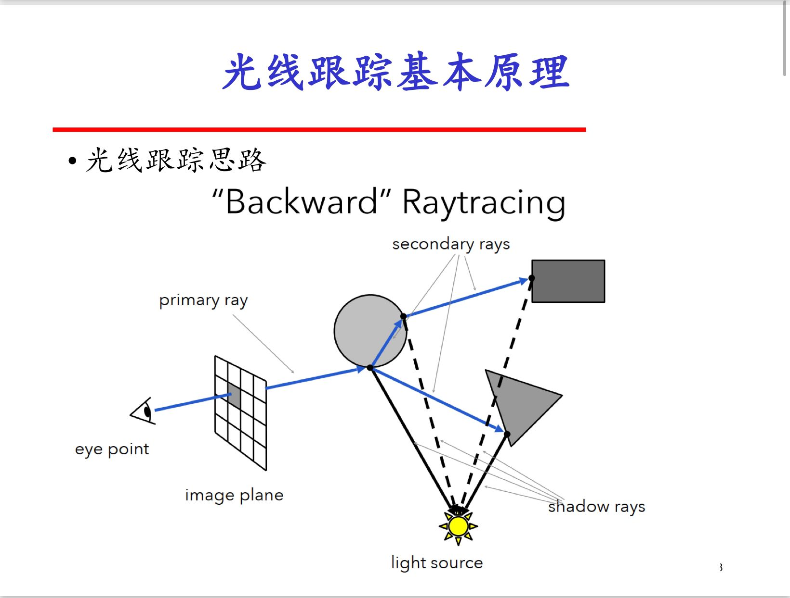

### 计算机图形学 光线追踪C++

1.hpp文件与.h,.cpp文件的区别:

[hpp.h与.h的区别_小博客-CSDN博客](https://blog.csdn.net/liuzhanchen1987/article/details/7270005?utm_medium=distribute.pc_relevant.none-task-blog-2~default~BlogCommendFromMachineLearnPai2~default-3.control&depth_1-utm_source=distribute.pc_relevant.none-task-blog-2~default~BlogCommendFromMachineLearnPai2~default-3.control)

2.构建一个ray类

```c++
#pragma once
#include<Eigen/Core>//引入Eigen库
using namespace Eigen;
class Ray
{
private:
	Vector3f _origin;//起点向量
	Vector3f _direction;//方向向量
public:
	Ray(Vector3f origin, Vector3f direction)//构造一条光线
	{
		_origin = origin;
		_direction = direction;
	}
	Vector3f Origin ()const //返回起始向量
	{
		return _origin;
	}
	Vector3f Direction()const//返回方向向量
	{
		return _direction;
	}
	Vector3f PointAtT(float t)const //发射一条射线(类似于数学的参数方程)
	{
		return (_origin + t * _direction);
	}
};
```

补充知识:[c++在函数后加const的意义：_oykotxuyang的博客-CSDN博客](https://blog.csdn.net/oykotxuyang/article/details/106142465)


3.构建一个Camera类,用来表示场景中的相机

**此时需要引入我们之前书写的ray类来产生光线,方便后续对其进行光线追踪**

首先,我们参考如下一张图:


所以,当我们书写一个generate_ray函数的时候,我们就可以利用刚才的Ray(Vector3f origin, Vector3f direction)函数进行光线的生成,generate_ray函数提供对应的u,v,由这条函数生成光线的起始向量和发生方向.

为了简化对应的运算和便于直观理解,这里我们设置了几个值:

```c++
Camera()
{
	//注意：这里为了方便，直接把这几个参数写死了
	_origin = Vector3f(0, 0, 0);
	_lower_left_corner = Vector3f(-2.0, -1.5, -1.0);
	_horizontal = Vector3f(4.0, 0.0, 0.0);
	_vetical = Vector3f(0.0, 3.0, 0.0);
}
```

然后,根据我们上述推导的式子继续补充camera类的书写:

```c++
#pragma once
#include<Eigen/Core>
#include"ray.hpp"
class Camera
{
private:
	Vector3f _origin;
	Vector3f _lower_left_corner;
	Vector3f _horizontal;
	Vector3f _vertical;
public:
	Camera()
	{
		//注意：这里为了方便，直接把这几个参数写死了,但注意_horizontal和vertical没有归一化
		_origin = Vector3f(0, 0, 0);
		_lower_left_corner = Vector3f(-2.0, -1.5, -1.0);
		_horizontal = Vector3f(4.0, 0.0, 0.0);
		_vertical = Vector3f(0.0, 3.0, 0.0);
	}
	Ray Generate_ray(float u, float v)//这里的u和v不用担心,后续会通过循环来遍历每一条光线,因此这里的u和v可以理解成像素对应的坐标就可以(比如1,3表示u=1,v=3位置的像素)
	{
		return  Ray(_origin, _lower_left_corner - _origin + u * _horizontal + v * _vertical);
	}
};
```


4.为了很好地初步看到实验结果,我们需要创建一个场景.为了方便其间,姑且将场景中的物体都设置为球体(球体的求交等也比较容易理解),因此我们创建三个类来很好地表现出场景:

(4-1)Material类,用来体现场景中的球的材质

回顾我们之前所了解的Blinn-Phong模型,我们可以得到对于每个简单的材料来说,应该具有高光系数,漫反射参数,环境光参数,折射率等,所以我们要对于每种材质的这些属性赋值,因此Material类应该提供方法来更改这些参数以获得不同的材质.

首先我们声明一些变量:

```c++
Vector3f _Ka;//物体表面的环境光反射系数
Vector3f _Kd;//漫反射系数
Vector3f _Ks;//镜面反射系数(与材料性质和入射光波长有关)
Vector3f _Km;//mirror
float _shiness;//高光系数(也就是cos值上面的系数)
float _refraction;//折射率
bool _transparent;//是否为透明材质
bool _reflective;//是否具有反射特性
```

并书写一些函数以便于对这些量进行赋值处理,完成之后的Material类如下所示:

```c++
class Material
{
public:
	Material() //默认是不透明的而且不具有反射特性
    {
		_transparent = false;
		_reflective = false;
	}

	void SetKa(Vector3f ka) //设置环境光反射系数
    {
		_Ka = ka;
	}

	void SetKd(Vector3f kd) //设置漫反射系数
    {
		_Kd = kd;
	}

	void SetKs(Vector3f ks)//设置镜面反射系数
    {
		_Ks = ks;
	}

	void SetKm(Vector3f km) 
    {
		_Km = km;
	}

	void SetShiness(float sh) //设置高光系数
    {
		_shiness = sh;
	}

	void SetTransparent(bool trans)//设置是否为透明材质
	{
		_transparent = trans;
	}

	void SetRefraction(float refra)//设置折射率
	{
		_refraction = refra;
	}

	void SetReflective(bool reflective)//设置是否具有反射特性
	{
		_reflective = reflective;
	}

	Vector3f _Ka;//物体表面的环境光反射系数
	Vector3f _Kd;//漫反射系数
	Vector3f _Ks;//镜面反射系数(与材料性质和入射光波长有关)
	Vector3f _Km;//mirror
	float _shiness;//高光系数(也就是cos值上面的系数)
	float _refraction;//折射率
	bool _transparent;//是否为透明材质
	bool _reflective;//是否具有反射特性
};
```

(4-2)Sphere类,用于生成一个球体(这也是场景中唯一的几何体种类,这样是为了方便)

(4-2-1)可以肯定的是,对于每一个球体来说,我们只需要得知它的球心和半径,就可以绘制出这个球体,因此我们很容易写出以下代码:

```c++
class Sphere
{
private:
	float _r;//球的半径
	Vector3f _center;//球的球心
public:
	Sphere(const Vector3f& center,float r)//为球的球心和半径赋初值
	{
		_center = center;
		_r = r;
	}
};
```

接下来,我们需要完成光线追踪程序当中的一个重要部分,也就是判断光线是否与球面相交

在继续完成我们的光线追踪程序之前,我们有必要先复习一点基础知识:
(4-2-2-1)如何判断光线与球面是否相交?


(以上图片中c指的是球心)

(4-2-2-2)为了简化过程,定义一个结构体来存储光线与球面相碰的交点信息,我们将这个结构体命名为HitInfo,声明如下:

```c++
struct HitInfo
{
	float t;//相交之后最后所采纳的t的值
	float t1, t2;//两个存在的交点,也就是对应方程的两个解
	Vector3f position;//相交位置
	Vector3f normal;//相交的法线方向
	bool hit;//是否会相交
	int objIdx;//物体索引值
};
```

这样我们就可以很好地将每次相交的相关信息存储在对应的结构体当中,清晰明了.

(4-2-2-3)请注意,虽然我们可以方便地得出求交点的方程和公式,但是我们需要考虑多种情况,比如方程是否有解?两个交点在e的同侧还是异侧d等,分别讨论如下:


若disc<0.也就是根号下面的值小于0,则无实数解,故光线与球面不相交.

进行上述讨论之后,此时我们继续在Sphere类中补充下述函数:

```c++
bool Hit(const Ray& ray, HitInfo& hinfo)
	{
		Vector3f oc = ray.Origin() - _center;//这里对应上图的(e-c),也就是球心直指光线起点的位置
		float a = ray.Direction().dot(ray.Direction());//这里对应上图的d*d,d指的是光线的方向
		float b = oc.dot(ray.Direction());//这里是用(e-c)·d,两者进行点乘
		float c = oc.dot(oc) - _r * _r;//这里是指上图的(e-c)*(e-c)-R*R
    	//用以上变量来做替代是为了后续可以简化运算
		float disc = b * b - a * c;//这里对应上图根号下面的部分
		if (disc > 0) //这个时候根据一元二次方程性质可以得知共有两个交点
        {
			float t1 = (-b - sqrt(b*b - a * c)) / a;//这个对应下方的交点
			float t2 = (-b + sqrt(b*b - a * c)) / a;//这个对应上方的交点
			hinfo.t1 = t1;//存储两个t的值,t1是小的
			hinfo.t2 = t2;//t2是大的
			//由于t1和t2是浮点数,难免会出现误差,所以放宽松一点界限
			if (t1 <= 1e-3 && t2 <= 1e-3)//两个值基本都是0,不认为是相交
				return false;
			if (t1 <= 1e-3 && t2 > 1e-3)
			{//从内部射出，取t2
				hinfo.hit = true;
				hinfo.t = t2;//最终结果取t2
				hinfo.position = ray.PointAtT(t2);//这里对应Ray类中的方法,用来确定碰撞位置
				hinfo.normal = (hinfo.position - _center).normalized();//记得对于相交点的法线向量进行归一化处理
				return true;
			}

			//t1 > 0, 从外部射入，取t1
			hinfo.hit = true;//此时相交
			hinfo.t = t1;//取t1
			hinfo.position = ray.PointAtT(t1);//找到相交位置
			hinfo.normal = (hinfo.position - _center).normalized();//将相交位置的法向量进行归一化处理
			return true;
		}
		//以下对应根号下的值为负数,此时无解,不相交
		hinfo.hit = false;
		return false;
	}
```

(4-3)制作一个场景类Scene,用于解决场景问题

```c++
class Scene
{
private:
	vector<pair<Sphere, Material> > _scene;//用容器存储每一对球和对应的材质
public:
	int ObjectCount() const//返回场景中一共有多少个物体
	{
		return _scene.size();
	}
	Sphere* GetObjectPtr(int i)//返回第一个球和对应的材质
	{
		return &_scene[i].first;
	}

	void Insert(const pair<Sphere, Material>& obj)//这个函数用于向场景中加入一个球和对应的材质
	{
		_scene.push_back(obj);
	}
};
```

至此,有关于scene.hpp文件我们就书写完毕了,接下来我们需要书写一个文件用于很好地导出我们的图片从而看到效果.


5.书写hpp文件ppm.hpp

这里我们下载一个名为**IrFanViewer**的安装包，用于查看生成的ppm图像文件(我们本次程序会以ppm格式导出)。将ppm安装包安装到工程文件之下,所有的安装参数选择默认就可以

在ppm.hpp中书写以下内容:

```c++
#pragma once
#include <stdio.h>

class PPM
{
public:
	PPM(int width=640, int height=480)//默认导出图片的大小
	{
		_nWidth = width;
		_nHeight = height;
		_nChannel = 3;//需要几个通道?一般是R,G,B
		_rgb_data = new unsigned char[3*_nWidth*_nHeight];//RGB所占的文件大小信息(字节数)
	}

	~PPM()//析构函数
    {
		delete []_rgb_data;
	}

	void SetPixel(int row, int col, unsigned r, unsigned g, unsigned b)
	{
		int idx = 3 * (row * _nWidth + col);//由于每个像素有R,G,B三个通道信息,因此如果是数组的话每增加一个像素其实数组位置会+3,用索引值找到对应的数组位置,分别存放r,g,b三个通道的信息
		_rgb_data[idx + 0] = r;
		_rgb_data[idx + 1] = g;
		_rgb_data[idx + 2] = b;
	}

	void Write2File(const char* filename = "output.ppm")//导出图像文件
	{
		FILE* fp;
		fopen_s(&fp, filename, "w");//这是Visual Studio的写法(fopen_s)
		fprintf(fp, "P3\n%d %d\n255\n", _nWidth, _nHeight);//写入图片大小信息,我们可以通过下面这张图看到ppm格式文件会读取我们的信息,因此需要写入
		int idx = 0;
        //开始写入每个像素的R,G,B信息
		for (int j = _nHeight - 1; j >= 0; --j)
		{
			for (int i = 0; i < _nWidth; ++i)
			{
				idx = 3*(j * _nWidth + i);
				fprintf_s(fp, "%d %d %d\n", _rgb_data[idx], _rgb_data[idx + 1], _rgb_data[idx + 2]);
			}
		}
		//写完之后关闭文件,不要忘了这句
		fclose(fp);
	}

private:
	unsigned char* _rgb_data;
	int _nHeight;
	int _nWidth;
	int _nChannel;
};
//下述图片解释了fprintf一句的作用
```


6.创建场景中的内容,对应主函数main.cpp部分

写完以上文件内容后,我们其实可以开始在主函数中搭建一些物体了,但是最重要的光线追踪文件raytracer.hpp还没有写,所以我们先创建一个raytracer.hpp文件但还不急着写里面的内容,在main.cpp中写入以下内容:

```c++
#include <Eigen/Core>
#include "ppm.hpp"
#include "camera.hpp"
#include "raytracer.hpp"
#include <iostream>
using namespace std;

int main()
{
	int width = 1280, height = 960;
	PPM outrlt(width, height);//设置导出ppm格式文件的宽度和高度
	Camera cam;//设置照相机
	Scene world;//设置整个世界
	//以下创建了六个球(不过有一个目前还没有用到)
	Sphere sp1(Vector3f(0, 0.5, -2), 1.0);
	Sphere sp2(Vector3f(0, -10000.5, -2), 10000.0);
	Sphere sp3(Vector3f(-2.0, 0, -2), 0.5);
	Sphere sp4(Vector3f(1.0, -0.2, -1.0), 0.3);
	Sphere sp5(Vector3f(3.0, 0, -2.2), 0.4);
	Sphere sp6(Vector3f(-1, 0.0, -0.8), 0.2);
	//以下创建了五个材质对应前面的前五个球
	Material mtl, mtl2, mtl3, mtl4, mtl5;
	mtl.SetKa(Vector3f(0.5, 0.5, 0.5));
	mtl.SetKd(Vector3f(0.8, 0.6, 0.0));
	mtl.SetKs(Vector3f(0.7, 0.8, 0.8));
	mtl.SetTransparent(false);
	mtl.SetReflective(true);
	mtl.SetShiness(50);

	mtl2.SetKa(Vector3f(0.5, 0.5, 0.5));
	mtl2.SetKd(Vector3f(0.0, 0.6, 0.2));
	mtl2.SetKs(Vector3f(0.1, 1.0, 0.8));
	mtl2.SetTransparent(false);
	mtl2.SetReflective(false);
	mtl2.SetShiness(10);

	mtl3.SetKa(Vector3f(0.5, 0.5, 0.5));
	mtl3.SetKd(Vector3f(0.0, 0.3, 0.6));
	mtl3.SetKs(Vector3f(0.0, 0.0, 0.0));
	mtl3.SetTransparent(false);
	mtl3.SetReflective(false);
	mtl3.SetShiness(10);

	mtl4.SetKa(Vector3f(0.1, 0.1, 0.1));
	mtl4.SetKd(Vector3f(0.0, 0.0, 0.0));
	mtl4.SetKs(Vector3f(0.0, 0.0, 0.0));
	mtl4.SetTransparent(true);
	mtl4.SetReflective(false);
	mtl4.SetRefraction(1.33);
	mtl4.SetShiness(200);

	mtl5.SetKa(Vector3f(0.5, 0.5, 0.5));
	mtl5.SetKd(Vector3f(0.75, 0.56, 0.0));
	mtl5.SetKs(Vector3f(0.75, 0.56, 0.0));
	mtl5.SetTransparent(false);
	mtl5.SetReflective(false);
	mtl5.SetRefraction(1.33);
	mtl5.SetShiness(100);
	//向世界中插入每个球和对应的材质
	world.Insert(make_pair(sp1, mtl));
	world.Insert(make_pair(sp2, mtl2));
	world.Insert(make_pair(sp3, mtl3));
	world.Insert(make_pair(sp4, mtl4));
	world.Insert(make_pair(sp5, mtl5));
	return 0;
}
```

接下来就是重头戏了,开始我们的光线追踪程序:

(**注:主程序还没有写完,当写完光线追踪程序后会对主程序进行补充**)


7.复习光线追踪的基础知识(重要!)

在继续书写程序前,我们必须对光线追踪有正确的认识:

(7-1)概念:光线追踪是逐像素进行绘制的,因此在主函数当中必须对每个像素进行遍历;

(7-2)光线追踪核心(伪代码)

```c++
for(each pixel or ray)
{
    for(each triangle)
    {
        if(ray hits triangle)
        {
            keep closest hit;//这里我们之前的scene.hpp中已经实现了
        }
    }
}
```
(7-3)光线跟踪基本原理-1



从上图中我们得知了以下几个信息:

(7-3-1)光线追踪和传统的光线进入眼睛不同,其本质是倒推回去的思想,也就是"backward",因此不难想到其大概率需要通过递归来完成

(7-3-2)我们可以发现从眼睛直接"发射"出的光线是初级光线(primary ray),碰到物体之后会产生次级光线(secondary rays),依次类推(递归完成)

(7-3-3)注意到光线追踪的强大之处之一是其可以判断某条"光线"是否是阴影,这在后续中会进行详述

**(7-4)光线跟踪算法**


上图中涉及到的shading model为phong模型等局部光照模型,接下来也会对其进行简要复习:

**(7-5)Whitted着色模型,阴影,以及反射折射等信息,这里直接放到下述专题中**


**8.(最核心部分)**

(1)首先我们先大致看一下Whitted着色模型,这也是我们最后求出每个像素位置时需要采用的基础模型:


接下来,会对其进行详细的解释:

书写一个函数,将其命名为RayColor,也就是Whitted着色模型所求出的结果,函数原型如下:

```c++
Vector3f RayColor(const Ray& ray, Scene& scene, int depth=0, bool test=false)
```

四个形参分别是光线,场景,深度和是否开启测试(默认深度为0,不开启测试)

(2)首先我们先来看第一件事,那就是判断光是否与物体会发生相交,此时就用到了我们之前写的内容:

```c++
Vector3f RayColor(const Ray& ray, Scene& scene, int depth=0, bool test=false)
{
	HitInfo closest_hp;//记录较近的碰撞点
	closest_hp.t = FLT_MAX;//较近碰撞点的碰撞t值为最大数,#define FLT_MAX 3.402823466e+38F
	closest_hp.objIdx = -1;//相交物体的索引值初始为-1
	//光线和球求交
	for (int i = 0; i < scene.ObjectCount(); ++i)//开始遍历场景中的每个物体
	{
		HitInfo ht;//存储相交点信息
		bool bhit = scene.GetObjectPtr(i)->Hit(ray, ht);//获取到这个scene(pair结构)的first的内容(也就是sphere球,这里我们尚不需要材质信息)
		
        //其实以下做的事情是找到对于一条光线来说与场景物体相交的最近的位置
        if (bhit)//如果有相交,参考之前sphere类中的bool Hit函数
		{
			if (ht.t > 0 && ht.t<closest_hp.t)//取到的碰撞点t值>0并且碰撞点的t值小于最近的碰撞点的t值
			{
				closest_hp = ht;//更新最近的点以及相关的球物体的索引
				closest_hp.objIdx = i;
			}
		}
	}
}
```

做完上述的操作之后,我们可以获取到每一条光线与场景物体最近的相交点等信息,由于我们此时用结构体来存储信息,所以取用十分方便.

**(3)知识点补充:环境光**


从以上我们得知了:

(1)环境光是最容易理解的一种光,可以直观地理解为这是一种均匀的光(简化理解),具有R,G,B三个通道值

(2)环境光也会和物体表面发生作用,进而会"损失掉"一部分,这里我们可以简单地用反射系数Ka(前面设定过了)与环境光地值进行相乘从而得到衰减后的效果.

了解这些后我们继续在RayColor函数中补充下述内容(最后会放完整代码):

```c++
Vector3f lightAmbient(0.6, 0.6, 0.6);//环境光参数,直接放上来比较方便
if (closest_hp.objIdx != -1)//如果与场景中的物体有相交,那么颜色就需要进行调整
{
	int idx = closest_hp.objIdx;//获取到相交最近物体的索引值
	Material mtl = scene._scene[idx].second;//获取到对应这个物体的材质
	//环境光
	Vector3f ambient = Vector3f(lightAmbient[0]* mtl._Ka[0],lightAmbient[1] * mtl._Ka[1], lightAmbient[2] * mtl._Ka[2]);//此时的环境光会削弱为原来的值*材质的环境光反射系数
	Vector3f color = ambient;//初始的颜色应该是漫反射的颜色
}
```

**(4)知识点补充:阴影**

现在我们有了第一种计算的光,那么接下来一个值得思考的便是阴影的相关问题:


不难想到,为了判断是否是阴影,一种简单的方式是去查看相交点与光源的连接线段中是否有物体"阻挡"了光线,**但我们注意到第二幅图片中引入了一个参数ε,这是因为计算机的浮点型计算会带来误差,也许计算出的相交点在实际的相交点下方一点点的位置,此时检测阴影就会出现自己与自己相交的情况,不利于进行判断,因此需要将交点"适当地上移一点",以解决计算机内部浮点数运算带来的误差**

(4-1)了解以上知识后,我们可以动手写检测阴影的代码了

继续在if (closest_hp.objIdx != -1)判断语句中补充以下语句:

```c++
bool isShadow = false;//默认是没有阴影的
//shadow ray 求交,这条是相交点与光源之间的连线
Ray shadow_ray(closest_hp.position, lightpos - closest_hp.position);
//判断是否发生遮挡,判断这条光线(相交点与光源地连线)是否与场景中的球面相交
for (int i = 0; i < scene.ObjectCount(); ++i)
{
	HitInfo ht1;
	if (scene.GetObjectPtr(i)->Hit(shadow_ray, ht1))//Hit函数判断球是否会和shadow_ray进行相交,这里其实我们已经加入ε项了(在Hit函数当中,有一个<1e-3的操作)
	{
		isShadow = true;
		break;
	}
}
if(!isShadow) //如果不是阴影，继续计算
{
    //待补充
}
```

**(5)知识点补充:漫反射**

如果根据上面的判断,我们发现这条光线并不是阴影,则接下来就需要求解其漫反射项,这一部分参考如下:

(5-1)漫反射:将反射光线散射到各个方向,理想的朗伯表面可以做到光向各个方向均匀地散射,而这里为了简化运算我们也采用朗伯表面的思想

(5-2)我们能够观察到粗糙的表面,主要是来自于物体表面具有漫反射

(5-3)对漫反射光进行求解:


于是,我们就可以在if(!isShadow)中继续补充我们的漫反射项,如下所示:

```c++
if(!isShadow) //如果不是阴影，继续计算
{
	//漫反射
	Vector3f lightdir = (lightpos - closest_hp.position).normalized();//对应入射光的方向(相交点指向光源方向)
	float coscoef = lightdir.dot(closest_hp.normal);//对应上面的l·n,进行点乘求出的cos值,交点的法向方向也已在上述函数中做了归一化处理
	if (coscoef < 0) coscoef = 0;//对应max(l·n,0)项,如果<0没有意义,取0
	Vector3f diffuse = Vector3f(0.8* mtl._Kd[0] * coscoef,0.8 * mtl._Kd[1] * coscoef,0.8 * mtl._Kd[2] * coscoef);//对应Id=Kd*cos(l·n)*Ld(方便起见Ld的每一项都指定为0.8了,(Vector3f _Kd;//漫反射系数))
}
```

此时,漫反射的强度也计算出来了.

**(6)知识点补充:镜面反射**

与漫反射并行地,我们需要对镜面反射进行求解,在这里我们需要了解一些镜面反射的知识:

(6-1)关于镜面反射,Phong模型和改进后的Blinn-Phong模型都可以对镜面光反射强度进行计算,而由于Blinn-phong模型的计算量要小于Phong模型,因此我们在这里采用这种模型来加深理解.

不过,为了复习方便,我们还是首先简单说一下phong模型:

**(6-2)Phong模型**


从以上我们可以知道:

(1)Phong模型是对理想的反射方向与实际的反射方向求了一个夹角(当然,要归一化),来模拟衰减的效果.

(2)**高光系数指的是什么?**

其可以用来确定光强度衰减的快慢,而之所以采用了余弦函数也是因为比较好计算这个夹角值,随着α的增加,光在某一区域内的衰减速度会越来越快,从而产生"高光"效果

比如,当α->∞时,对应镜子,其范围在100-200之间时,对应金属材料,而在5-10之间时则对应类似塑料的材质

**(6-3)Blinn-Phong模型**

从phong模型我们可以看到,理想的反射光线方向没有那么容易计算,所以Blinn-phong模型在此基础上采用半程向量来简化运算(**核心在于用实际反射光(视点方向)与入射光求中值单位向量,再求其与法向量的夹角**),模型如下:


(6-4)了解以上知识后,我们可以动手开始写镜面反射的代码了:

```c++
//以下内容补充在if(!isShadow)的漫反射的后面
Vector3f eyedir = (Vector3f(0, 0, 0) - closest_hp.position).normalized();//简化运算,让眼睛从原点开始看,看向光线与物体交点方向
//下面的shadow ray这条是相交点与光源之间的连线,之前有说
Vector3f half = (eyedir + shadow_ray.Direction().normalized()).normalized();//计算半程向量(记得归一化!)
float specularcoef = half.dot(closest_hp.normal);//半程向量与法向量点乘,对应上面的(n·h)项
if (specularcoef < 0) specularcoef = 0;//这一步与漫反射类似,同样需要求一个max值,因为负的值没有意义
else specularcoef = pow(specularcoef, mtl._shiness);//将高光系数作为指数项
Vector3f specular = Vector3f(lightSpecular[0]* mtl._Ks[0] * specularcoef,
lightSpecular[1] * mtl._Ks[1] * specularcoef,
lightSpecular[2] * mtl._Ks[2] * specularcoef);//对应Ks*Ls*max((n·h)^α)项
color += diffuse + specular;//漫反射+镜面反射(算完上述内容后的"衰减"后的color)
```

(7)此时我们回过头来看Whitted着色模型,上述代码已经解决了非递归的部分.


**(8)递归项的求解(不管是不是阴影都要判断这一项)**

(8-1)首先我们先解决镜面光的递归项,其实依然是上述的Blinn-phong模型,只是新的入射光的方向需要重新定义:

```c++
Vector3f reflectColor(0.0, 0.0, 0.0);//递归项的镜面反射颜色项
Vector3f reflectDir = 2.0*eyedir.dot(closest_hp.normal)*closest_hp.normal - eyedir;//反射方向会成为新的光线方向,对应上述镜面反射的用l和n计算r(r=2(l*n)n-l),证明过程如下图
Ray reflectRay(closest_hp.position, reflectDir);//生成一条反射光线(作为递归项中的那条光线)
reflectRay._origin = closest_hp.position + 1e-2*reflectDir.normalized();//更改一下起点值,与判断阴影效果类似,加一个ε项以处理计算误差
if (mtl._reflective)
{
	//镜面光，调用递归
	reflectColor = reflectColor + RayColor(reflectRay, scene, test);
}
```

补充:关于(r=2(l*n)n-l)的证明:


此时,只要继续递归便可以求出递归的镜面反射项

(8-2)折射光的求解


关于折射定律

**由于篇幅限制,在这里不对折射公式进行推导,感兴趣的朋友可以参考下述的这篇文章,在这里我们需要将公式转化为我们的C++语言来对折射光线进行求解**

**折射公式推导:**

[折射定律证明_domzhaosh-CSDN博客_折射定律](https://blog.csdn.net/u012419410/article/details/49448341)

为了增加程序的易读性,我们写一个函数来求解折射光的方向,同时利用引用的特点返回这个方向,而函数的返回值为bool类型,用来判断是否会发生折射,函数书写如下:

```c++
bool Refract(const Vector3f& d, const Vector3f& n,float ni_over_nt, Vector3f& refracted)//形参分别为:d:入射方向,n:法向,ni_over_nt:nt的倒数,refracted:折射方向向量
{
	Vector3f unit_d = d.normalized();//将入射方向归一化
	float dt = unit_d.dot(n);//对应(d·n)项
	float disc = 1.0 - ni_over_nt * ni_over_nt*(1 - dt * dt);//对应根号下的项
	if (disc > 0)
	{
		refracted = ni_over_nt * (unit_d - n * dt) - n * sqrt(disc);//折射方向见上面的图
		return true;
    }
	else //根号下的项<0,没有折射
		return false;
}
```

现在我们可以得知折射方向以及是否发生折射,接下来就需要进行折射的递归调用

```c++
//折射，调用递归
Vector3f refractionColor(0.0, 0.0, 0.0);
if (mtl._transparent)//如果是透明物体
{
	//折射光，调用递归
	Vector3f refractDir;
	float ni_over_nt;
	bool refract;
	if (ray.Direction().dot(closest_hp.normal) < 0) //入射
	{
		ni_over_nt = 1.0 / mtl._refraction;//此时的折射率
		refract = Refract(ray.Direction(), closest_hp.normal, ni_over_nt, refractDir);
	}
	else//出射((对应或许是从折射物内部射出的光线(光线在里面还有反射,以及会折射出来)))
	{
		ni_over_nt = mtl._refraction;
		refract = Refract(ray.Direction(), -closest_hp.normal, ni_over_nt, refractDir);//此时的法线方向也要取内侧.并且nt也会发生变化
	}
	if (refract)//如果有折射现象,则进行递归处理
	{
		Ray refractRay(closest_hp.position, refractDir);
		refractRay._origin = closest_hp.position + 1e-2*refractDir.normalized();
		refractionColor = refractionColor + RayColor(refractRay, scene);//这一部分与反射的递归类似
	}
	else
	{
		refractionColor = Vector3f(0, 0, 0);//如果不折射,则这一部分颜色不会叠加
	}
}
```

完成上述所有内容后,还有一步是对场景颜色进行叠加和大于1的检测(RGB>1时按照白光1处理),如下:

```c++
color = color + 0.2*reflectColor + 0.9*refractionColor;
if (color[0] > 1.0) color[0] = 1.0;
if (color[1] > 1.0) color[1] = 1.0;
if (color[2] > 1.0) color[2] = 1.0;
return color;
```

所以,我们的raytracer光线跟踪hpp文件的所有代码如下(注意,可能要将前面的一些字段由private改为public,方便书写):

```c++
#pragma once
#include "ray.hpp"
#include "scene.hpp"
#include <iostream>
#define MAXDEPTH 20
bool Refract(const Vector3f& d, const Vector3f& n, float ni_over_nt, Vector3f& refracted)//形参分别为:d:入射方向,n:法向,ni_over_nt:nt的倒数,refracted:折射方向向量
{
	Vector3f unit_d = d.normalized();//将入射方向归一化
	float dt = unit_d.dot(n);//对应(d·n)项
	float disc = 1.0 - ni_over_nt * ni_over_nt*(1 - dt * dt);//对应根号下的项
	if (disc > 0)
	{
		refracted = ni_over_nt * (unit_d - n * dt) - n * sqrt(disc);//折射方向见上面的图
        return true;
	}
	else //根号下的项<0,没有折射
		return false;
}
Vector3f RayColor(const Ray& ray, Scene& scene, int depth = 0, bool test = false)
{
	HitInfo closest_hp;//记录较近的碰撞点
	closest_hp.t = FLT_MAX;//较近碰撞点的碰撞t值为最大数,#define FLT_MAX 3.402823466e+38F
	closest_hp.objIdx = -1;//相交物体的索引值初始为-1
	//光线和球求交
	for (int i = 0; i < scene.ObjectCount(); ++i)//开始遍历场景中的每个物体
	{
		HitInfo ht;//存储相交点信息
		bool bhit = scene.GetObjectPtr(i)->Hit(ray, ht);//获取到这个scene(pair结构)的first的内容(也就是sphere球,这里我们尚不需要材质信息)

		//其实以下做的事情是找到对于一条光线来说与场景物体相交的最近的位置
		if (bhit)//如果有相交,参考之前sphere类中的bool Hit函数
		{
			if (ht.t > 0 && ht.t < closest_hp.t)//取到的碰撞点t值>0并且碰撞点的t值小于最近的碰撞点的t值
			{
				closest_hp = ht;//更新最近的点以及相关的球物体的索引
				closest_hp.objIdx = i;
			}
		}
	}
	Vector3f lightpos(0.0, 4, 2);
	Vector3f lightAmbient(0.6, 0.6, 0.6);//环境光参数,直接放上来比较方便
	Vector3f lightDiffuse(1.0, 1.0, 1.0);
	Vector3f lightSpecular(1.0, 1.0, 1.0);
	if (closest_hp.objIdx != -1)//如果与场景中的物体有相交,那么颜色就需要进行调整
	{
		int idx = closest_hp.objIdx;//获取到相交最近物体的索引值
		Material mtl = scene._scene[idx].second;//获取到对应这个物体的材质
		//环境光
		Vector3f ambient = Vector3f(lightAmbient[0] * mtl._Ka[0], lightAmbient[1] * mtl._Ka[1], lightAmbient[2] * mtl._Ka[2]);//此时的环境光会削弱为原来的值*材质的环境光反射系数
		Vector3f color = ambient;//初始的颜色应该是漫反射的颜色
		bool isShadow = false;//默认是没有阴影的
//shadow ray 求交,这条是相交点与光源之间的连线
		Ray shadow_ray(closest_hp.position, lightpos - closest_hp.position);
		//判断是否发生遮挡,判断这条光线(相交点与光源地连线)是否与场景中的球面相交
		for (int i = 0; i < scene.ObjectCount(); ++i)
		{
			HitInfo ht1;
			if (scene.GetObjectPtr(i)->Hit(shadow_ray, ht1))//Hit函数判断球是否会和shadow_ray进行相交,这里其实我们已经加入ε项了(在Hit函数当中,有一个<1e-3的操作)
			{
				isShadow = true;
				break;
			}
		}
		Vector3f eyedir = (Vector3f(0, 0, 0) - closest_hp.position).normalized();//简化运算,让眼睛从原点开始看,看向光线与物体交点方向
		if (!isShadow) //如果不是阴影，继续计算
		{
			//漫反射
			Vector3f lightdir = (lightpos - closest_hp.position).normalized();//对应入射光的方向(相交点指向光源方向)
			float coscoef = lightdir.dot(closest_hp.normal);//对应上面的l·n,进行点乘求出的cos值,交点的法向方向也已在上述函数中做了归一化处理
			if (coscoef < 0) coscoef = 0;//对应max(l·n,0)项,如果<0没有意义,取0
			Vector3f diffuse = Vector3f(0.8* mtl._Kd[0] * coscoef, 0.8 * mtl._Kd[1] * coscoef, 0.8 * mtl._Kd[2] * coscoef);//对应Id=Kd*cos(l·n)*Ld(方便起见Ld的每一项都指定为0.8了,(Vector3f _Kd;//漫反射系数))
			
//下面的shadow ray这条是相交点与光源之间的连线,之前有说
			Vector3f half = (eyedir + shadow_ray.Direction().normalized()).normalized();//计算半程向量(记得归一化!)
			float specularcoef = half.dot(closest_hp.normal);//半程向量与法向量点乘,对应上面的(n·h)项
			if (specularcoef < 0) specularcoef = 0;//这一步与漫反射类似,同样需要求一个max值,因为负的值没有意义
			else specularcoef = pow(specularcoef, mtl._shiness);//将高光系数作为指数项
			Vector3f specular = Vector3f(lightSpecular[0] * mtl._Ks[0] * specularcoef,
				lightSpecular[1] * mtl._Ks[1] * specularcoef,
				lightSpecular[2] * mtl._Ks[2] * specularcoef);//对应Ks*Ls*max((n·h)^α)项
			color += diffuse + specular;//漫反射+镜面反射(算完上述内容后的"衰减"后的color)
			
		}
		Vector3f reflectColor(0.0, 0.0, 0.0);//递归项的镜面反射颜色项
		Vector3f reflectDir = 2.0*eyedir.dot(closest_hp.normal)*closest_hp.normal - eyedir;//反射方向会成为新的光线方向,对应上述镜面反射的用l和n计算r(r=2(l*n)n-l),证明过程如下图
		Ray reflectRay(closest_hp.position, reflectDir);//生成一条反射光线(作为递归项中的那条光线)
		reflectRay._origin = closest_hp.position + 1e-2*reflectDir.normalized();//更改一下起点值,与判断阴影效果类似,加一个ε项以处理计算误差
		if (mtl._reflective)
		{
			//镜面光，调用递归
			reflectColor = reflectColor + RayColor(reflectRay, scene, test);
		}
		Vector3f refractionColor(0.0, 0.0, 0.0);
		if (mtl._transparent)//如果是透明物体
		{
			//折射光，调用递归
			Vector3f refractDir;
			float ni_over_nt;
			bool refract;
			if (ray.Direction().dot(closest_hp.normal) < 0) //入射
			{
				ni_over_nt = 1.0 / mtl._refraction;//此时的折射率
				refract = Refract(ray.Direction(), closest_hp.normal, ni_over_nt, refractDir);
			}
			else//出射((对应或许是从折射物内部射出的光线(光线在里面还有反射,以及会折射出来)))
			{
				ni_over_nt = mtl._refraction;
				refract = Refract(ray.Direction(), -closest_hp.normal, ni_over_nt, refractDir);//此时的法线方向也要取内侧.并且nt也会发生变化
			}
			if (refract)//如果有折射现象,则进行递归处理
			{
				Ray refractRay(closest_hp.position, refractDir);
				refractRay._origin = closest_hp.position + 1e-2*refractDir.normalized();
				refractionColor = refractionColor + RayColor(refractRay, scene);//这一部分与反射的递归类似
			}
			else
			{
				refractionColor = Vector3f(0, 0, 0);//如果不折射,则这一部分颜色不会叠加
			}

		}
		color = color + 0.2*reflectColor + 0.9*refractionColor;
		if (color[0] > 1.0) color[0] = 1.0;
		if (color[1] > 1.0) color[1] = 1.0;
		if (color[2] > 1.0) color[2] = 1.0;
		return color;
		
	}
	return Vector3f(0.6, 0.8, 0.8);
}
```

9.主函数最后补充

完成以上步骤后,我们还需要最后再补充一下主函数,以对所有的光线都能进行追踪

在main.cpp文件中补充下述内容:

```c++
for (int j = height-1; j >= 0; --j)//请注意,输出是从上到下,从左到右进行输出的,所以j先从最上面一行开始
{
	for (int i = 0; i < width; ++i)
	{	
		bool test = false;
		//生成光线
		float u = float(i) / float(width);
		float v = float(j) / float(height);
		Ray ray = cam.GenerateRay(u, v);
		Vector3f color = RayColor(ray, world, test);
		//由于color[0],color[1],color[2]存放的值为[0,1],所以需要转换成正常的RGB值 
		outrlt.SetPixel(j, i, 
		int(255.99*color[0]), int(255.99*color[1]), int(255.99*color[2]));
	}
}
	outrlt.Write2File();
```

将解决方案配置更改为release,就可以运行程序查看结果了


